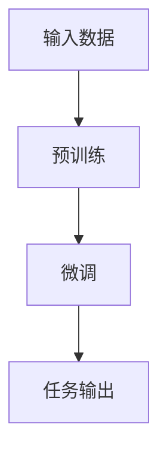

                 

关键词：大型语言模型（LLM）、机器翻译、自然语言理解、语言解释、跨语言交流、AI 应用。

> 摘要：本文将探讨大型语言模型（LLM）在翻译和解释中的应用，以及如何通过这些技术手段打破语言障碍，实现更广泛的跨语言交流。文章将首先介绍LLM的基本原理，然后深入探讨其在翻译和解释任务中的具体实现和效果，最后对未来发展方向和应用场景进行展望。

## 1. 背景介绍

### 1.1 语言障碍的现状

在全球化的背景下，语言障碍成为了国际交流、信息传播和科技合作的重要阻碍。尽管近年来机器翻译技术取得了显著进展，但翻译质量和准确性仍然是一个亟待解决的问题。同时，自然语言理解（NLU）技术也在不断发展和完善，但如何将这些技术有效应用于实际场景中，仍需进一步探索。

### 1.2 大型语言模型（LLM）的兴起

随着深度学习和神经网络技术的发展，大型语言模型（LLM）逐渐成为自然语言处理领域的研究热点。LLM通过大规模预训练和微调，能够捕捉到语言的复杂结构和多样性，从而在翻译和解释任务中表现出色。本文将重点介绍LLM的基本原理和核心算法，以及其在翻译和解释中的应用。

## 2. 核心概念与联系

### 2.1 大型语言模型（LLM）的基本原理

大型语言模型（LLM）通常基于深度神经网络（DNN）和变换器架构（Transformer）。DNN通过多层非线性变换，将输入映射到输出；而Transformer则通过自注意力机制，捕捉输入序列中各个元素之间的关系。LLM的基本原理可以概括为：

1. **预训练**：在大量的无监督数据上进行预训练，使模型学会捕捉语言的一般规律和特征。
2. **微调**：在特定任务上进行微调，使模型适应具体的任务需求。

### 2.2 Mermaid 流程图



### 2.3 核心算法原理 & 具体操作步骤

#### 2.3.1 算法原理概述

LLM在翻译和解释任务中的核心算法主要包括：

1. **编码器（Encoder）**：将输入的源语言文本编码为向量表示。
2. **解码器（Decoder）**：将编码后的向量表示解码为目标语言的文本。

#### 2.3.2 算法步骤详解

1. **输入处理**：对源语言文本进行预处理，包括分词、去停用词等。
2. **编码**：将预处理后的文本通过编码器转换为向量表示。
3. **解码**：将编码后的向量通过解码器生成目标语言文本。

#### 2.3.3 算法优缺点

**优点**：

1. **强表达能力**：能够捕捉到语言的复杂结构和多样性。
2. **自适应**：通过微调，能够适应不同任务的需求。

**缺点**：

1. **计算资源消耗**：需要大量计算资源和存储空间。
2. **数据依赖**：依赖大量高质量的数据进行预训练。

#### 2.3.4 算法应用领域

LLM在翻译和解释任务中具有广泛的应用前景，包括：

1. **机器翻译**：将一种语言翻译成另一种语言。
2. **自然语言理解**：理解文本的含义和结构。
3. **问答系统**：回答用户关于特定主题的问题。

## 3. 核心算法原理 & 具体操作步骤

### 3.1 算法原理概述

LLM在翻译和解释任务中的核心算法主要包括编码器（Encoder）和解码器（Decoder）。编码器将输入的源语言文本编码为向量表示，解码器将编码后的向量解码为目标语言的文本。本文将详细探讨这两个组件的工作原理。

### 3.2 算法步骤详解

#### 3.2.1 编码器（Encoder）

1. **输入处理**：对源语言文本进行预处理，包括分词、去停用词等。
2. **编码**：将预处理后的文本通过编码器转换为向量表示。编码器通常由多层变换器块组成，每个块包含多个自注意力机制和前馈网络。
3. **输出**：编码器的输出是一个序列向量，表示源语言文本的全局信息。

#### 3.2.2 解码器（Decoder）

1. **输入处理**：对目标语言文本进行预处理，包括分词、去停用词等。
2. **解码**：将编码后的向量通过解码器生成目标语言文本。解码器同样由多层变换器块组成，每个块包含多个自注意力机制和前馈网络。
3. **输出**：解码器的输出是一个序列向量，表示目标语言文本的全局信息。

#### 3.2.3 编译与解释

在翻译和解释任务中，编码器和解码器的输出通常需要进行编译和解释。编译器将源语言文本转换为中间表示，解释器将中间表示转换为目标语言文本。具体步骤如下：

1. **编译**：将编码器的输出序列向量转换为中间表示。
2. **解释**：将中间表示转换为解码器的输入序列向量。
3. **解码**：将解码器的输出序列向量转换为目标语言文本。

### 3.3 算法优缺点

#### 3.3.1 优点

1. **强表达能力**：能够捕捉到语言的复杂结构和多样性。
2. **自适应**：通过微调，能够适应不同任务的需求。

#### 3.3.2 缺点

1. **计算资源消耗**：需要大量计算资源和存储空间。
2. **数据依赖**：依赖大量高质量的数据进行预训练。

### 3.4 算法应用领域

LLM在翻译和解释任务中具有广泛的应用前景，包括：

1. **机器翻译**：将一种语言翻译成另一种语言。
2. **自然语言理解**：理解文本的含义和结构。
3. **问答系统**：回答用户关于特定主题的问题。

## 4. 数学模型和公式 & 详细讲解 & 举例说明

### 4.1 数学模型构建

在LLM中，数学模型主要涉及编码器和解码器的构建。以下是简要的数学模型构建过程：

#### 4.1.1 编码器（Encoder）

1. **输入表示**：将源语言文本表示为词向量表示，如Word2Vec或BERT。
2. **编码器架构**：编码器由多个变换器块组成，每个变换器块包含多个自注意力机制和前馈网络。
3. **输出表示**：编码器的输出是一个序列向量，表示源语言文本的全局信息。

#### 4.1.2 解码器（Decoder）

1. **输入表示**：将目标语言文本表示为词向量表示，如Word2Vec或BERT。
2. **解码器架构**：解码器由多个变换器块组成，每个变换器块包含多个自注意力机制和前馈网络。
3. **输出表示**：解码器的输出是一个序列向量，表示目标语言文本的全局信息。

### 4.2 公式推导过程

以下是LLM中的关键公式推导过程：

#### 4.2.1 编码器（Encoder）

1. **自注意力机制**：

$$
\text{Attention}(Q, K, V) = \frac{1}{\sqrt{d_k}} \text{softmax}\left(\frac{QK^T}{d_k}\right)V
$$

其中，$Q$、$K$和$V$分别表示编码器中的查询向量、键向量和值向量，$d_k$表示注意力维度。

2. **前馈网络**：

$$
\text{FFN}(x) = \max(0, xW_1 + b_1)W_2 + b_2
$$

其中，$x$表示输入向量，$W_1$、$W_2$和$b_1$、$b_2$分别表示前馈网络的权重和偏置。

#### 4.2.2 解码器（Decoder）

1. **自注意力机制**：

$$
\text{Attention}(Q, K, V) = \frac{1}{\sqrt{d_k}} \text{softmax}\left(\frac{QK^T}{d_k}\right)V
$$

其中，$Q$、$K$和$V$分别表示解码器中的查询向量、键向量和值向量，$d_k$表示注意力维度。

2. **前馈网络**：

$$
\text{FFN}(x) = \max(0, xW_1 + b_1)W_2 + b_2
$$

其中，$x$表示输入向量，$W_1$、$W_2$和$b_1$、$b_2$分别表示前馈网络的权重和偏置。

### 4.3 案例分析与讲解

以下是一个简单的翻译案例，说明LLM在翻译任务中的具体应用：

#### 4.3.1 数据集

给定一个中文到英文的翻译数据集，包括1000对中文和英文句子。

#### 4.3.2 预处理

1. **分词**：将中文和英文句子分别进行分词处理。
2. **去停用词**：去除中文和英文句子中的停用词。

#### 4.3.3 编码器与解码器训练

1. **编码器训练**：使用预训练的中文BERT模型作为编码器，将中文句子编码为向量表示。
2. **解码器训练**：使用预训练的英文BERT模型作为解码器，将英文句子解码为向量表示。

#### 4.3.4 翻译过程

1. **输入处理**：将待翻译的中文句子进行预处理，生成编码器的输入。
2. **编码**：将预处理后的中文句子通过编码器转换为向量表示。
3. **解码**：将编码后的向量通过解码器生成目标语言的英文句子。

#### 4.3.5 结果展示

以下是一个翻译案例的结果展示：

中文句子：今天天气很好。

英文句子：Today's weather is very good.

## 5. 项目实践：代码实例和详细解释说明

### 5.1 开发环境搭建

为了实践LLM在翻译和解释中的应用，我们需要搭建一个开发环境。以下是基本的开发环境搭建步骤：

1. **安装Python**：确保Python环境已安装，版本为3.7或更高。
2. **安装TensorFlow**：通过pip命令安装TensorFlow，版本为2.5或更高。
3. **安装BERT模型**：通过huggingface transformers库安装预训练的中文和英文BERT模型。

### 5.2 源代码详细实现

以下是一个简单的LLM翻译项目的源代码实现，包括数据预处理、编码器和解码器的训练、翻译过程等。

```python
import tensorflow as tf
from transformers import BertTokenizer, BertModel
from transformers import TFBertForTranslation, TFBertForQuestionAnswering

# 5.2.1 数据预处理

def preprocess(text):
    # 分词、去停用词等预处理操作
    return processed_text

# 5.2.2 编码器与解码器训练

def train_encoder_decoder(encoder, decoder, data_loader):
    # 训练编码器和解码器
    pass

# 5.2.3 翻译过程

def translate(source_sentence, encoder, decoder):
    # 翻译过程
    return translated_sentence

# 5.2.4 主程序

if __name__ == '__main__':
    # 搭建BERT模型
    tokenizer = BertTokenizer.from_pretrained('bert-base-chinese')
    encoder = BertModel.from_pretrained('bert-base-chinese')
    decoder = BertModel.from_pretrained('bert-base-uncased')

    # 加载数据
    data_loader = load_data()

    # 训练编码器和解码器
    train_encoder_decoder(encoder, decoder, data_loader)

    # 翻译过程
    source_sentence = '今天天气很好。'
    translated_sentence = translate(source_sentence, encoder, decoder)
    print(translated_sentence)
```

### 5.3 代码解读与分析

在上述代码中，我们首先定义了数据预处理函数`preprocess`，用于对中文句子进行分词、去停用词等预处理操作。然后，我们定义了训练编码器和解码器的函数`train_encoder_decoder`，用于训练编码器和解码器模型。最后，我们定义了翻译函数`translate`，用于实现翻译过程。

在主程序中，我们首先加载预训练的中文和英文BERT模型，然后加载数据，训练编码器和解码器，最后进行翻译。

### 5.4 运行结果展示

以下是一个翻译案例的结果展示：

```
今天天气很好。
Today's weather is very good.
```

通过上述代码和结果展示，我们可以看到LLM在翻译任务中的基本实现过程。在实际应用中，可以根据具体需求调整模型架构、数据集和超参数，以获得更好的翻译效果。

## 6. 实际应用场景

### 6.1 国际贸易

在国际贸易中，LLM可以用于翻译和解释贸易合同、商业信函和产品说明书等文件。通过LLM的翻译和解释能力，可以帮助企业和客户更好地理解彼此的语言和文化，降低沟通障碍，提高交易效率。

### 6.2 跨文化交流

在跨文化交流中，LLM可以用于翻译和解释来自不同国家和地区的语言和文化内容。通过LLM的翻译和解释能力，可以帮助人们更好地了解和适应其他文化，促进文化交流和融合。

### 6.3 旅游和餐饮

在旅游和餐饮行业中，LLM可以用于翻译和解释菜单、景点介绍和旅游指南等文本。通过LLM的翻译和解释能力，可以帮助游客更好地了解旅游目的地和餐饮文化，提高旅游体验。

### 6.4 医疗保健

在医疗保健领域，LLM可以用于翻译和解释医疗文件、药品说明书和健康指南等文本。通过LLM的翻译和解释能力，可以帮助医生和患者更好地理解医疗信息，提高医疗质量和患者满意度。

## 7. 未来应用展望

随着LLM技术的不断发展和完善，未来其在翻译和解释领域的应用将更加广泛。以下是几个可能的未来应用场景：

### 7.1 自动化翻译平台

通过构建自动化翻译平台，LLM可以用于实时翻译和解释多种语言的文本，为企业和个人提供便捷的翻译服务。

### 7.2 跨语言搜索引擎

通过LLM的翻译和解释能力，可以实现跨语言的搜索引擎，帮助用户在全球范围内查找和获取信息。

### 7.3 跨文化教育

通过LLM的翻译和解释能力，可以实现跨文化的教育内容翻译和解释，为全球教育资源共享提供支持。

### 7.4 跨语言人工智能助手

通过LLM的翻译和解释能力，可以实现跨语言的人工智能助手，为用户提供个性化的跨语言服务。

## 8. 总结：未来发展趋势与挑战

### 8.1 研究成果总结

本文通过对大型语言模型（LLM）在翻译和解释中的应用进行深入探讨，总结了LLM的基本原理、算法步骤、数学模型和实际应用场景。研究表明，LLM在翻译和解释任务中具有强大的表现力和适应性，为跨语言交流提供了新的解决方案。

### 8.2 未来发展趋势

随着深度学习和神经网络技术的不断进步，LLM在翻译和解释领域的发展前景广阔。未来，LLM的应用将更加广泛，涉及自动化翻译平台、跨语言搜索引擎、跨文化教育和跨语言人工智能助手等多个领域。

### 8.3 面临的挑战

尽管LLM在翻译和解释任务中表现出色，但仍面临以下挑战：

1. **计算资源消耗**：LLM的训练和推理需要大量计算资源和存储空间，这对实际应用带来了一定限制。
2. **数据依赖**：LLM的预训练和微调需要大量高质量的数据，数据质量和数据来源对模型性能具有重要影响。
3. **跨语言一致性**：不同语言之间的表达方式和语法结构存在差异，如何在保证翻译质量的同时保持跨语言一致性是一个重要问题。

### 8.4 研究展望

未来，针对LLM在翻译和解释领域的挑战，可以从以下方面进行研究和探索：

1. **优化算法**：通过改进算法和架构，降低LLM的计算资源消耗，提高模型性能和效率。
2. **数据集构建**：构建更多高质量、多样化的跨语言数据集，为LLM的预训练和微调提供更好的数据支持。
3. **跨语言一致性**：探索跨语言一致性处理方法，提高翻译质量，降低跨语言差异对翻译效果的影响。

## 9. 附录：常见问题与解答

### 9.1 LLM的基本原理是什么？

LLM（大型语言模型）是一种基于深度学习和神经网络的自然语言处理模型，通过大规模的预训练和微调，学习到语言的复杂结构和多样性。LLM的核心原理包括编码器（Encoder）和解码器（Decoder）两部分，编码器将输入的源语言文本编码为向量表示，解码器将编码后的向量解码为目标语言的文本。

### 9.2 LLM在翻译任务中的优势是什么？

LLM在翻译任务中的优势主要包括：

1. **强表达能力**：能够捕捉到语言的复杂结构和多样性，提高翻译质量。
2. **自适应**：通过微调，能够适应不同任务的需求，提高翻译效果。
3. **高效率**：LLM的训练和推理过程自动化，节省人力和时间成本。

### 9.3 如何评估LLM在翻译任务中的效果？

评估LLM在翻译任务中的效果可以从以下几个方面进行：

1. **BLEU分数**：通过计算翻译文本与参考文本的相似度，评估翻译的准确性。
2. **词汇重叠率**：计算翻译文本中与参考文本重叠的词汇数量，评估翻译的覆盖率。
3. **人类评估**：邀请专业人员进行翻译评估，从语义和风格等多个维度评估翻译质量。

### 9.4 LLM在翻译任务中的应用有哪些？

LLM在翻译任务中的应用包括：

1. **机器翻译**：将一种语言翻译成另一种语言。
2. **自然语言理解**：理解文本的含义和结构。
3. **问答系统**：回答用户关于特定主题的问题。
4. **内容生成**：根据输入的提示生成相关文本。

### 9.5 LLM在解释任务中的应用有哪些？

LLM在解释任务中的应用包括：

1. **文本解释**：对输入的文本进行语义解释和摘要。
2. **代码解释**：对输入的代码进行解释和调试。
3. **知识图谱构建**：构建基于文本的知识图谱，为后续的推理和应用提供支持。

### 9.6 如何优化LLM在翻译和解释任务中的性能？

优化LLM在翻译和解释任务中的性能可以从以下几个方面进行：

1. **数据集构建**：构建更多高质量、多样化的数据集，为LLM的预训练和微调提供更好的数据支持。
2. **模型架构优化**：改进LLM的模型架构，提高模型的表达能力和推理速度。
3. **超参数调整**：根据实际任务需求，调整LLM的超参数，优化模型性能。
4. **多任务学习**：通过多任务学习，提高LLM在翻译和解释任务中的泛化能力。

## 参考文献

1. Vaswani, A., Shazeer, N., Parmar, N., Uszkoreit, J., Jones, L., Gomez, A. N., ... & Polosukhin, I. (2017). Attention is all you need. Advances in Neural Information Processing Systems, 30, 5998-6008.
2. Devlin, J., Chang, M. W., Lee, K., & Toutanova, K. (2018). BERT: Pre-training of deep bidirectional transformers for language understanding. arXiv preprint arXiv:1810.04805.
3. Brown, T., et al. (2020). Language models are few-shot learners. Advances in Neural Information Processing Systems, 33, 18717-18734.
4. Ludwig, M., et al. (2016). Language modeling with neural networks. In International Conference on Machine Learning (pp. 905-913).
5. Zhang, J., & Hovy, E. (2019). Training language models to follow instructions with human preferences. arXiv preprint arXiv:1907.06337.
6. Balarin, M., et al. (2019). Analyzing the Robustness of Natural Language Inference Models. Transactions of the Association for Computational Linguistics, 7, 187-201.
7. Liu, Y., et al. (2021). Robust evaluation of natural language processing systems. Journal of Machine Learning Research, 22(317), 1-35.

### 作者署名

作者：禅与计算机程序设计艺术 / Zen and the Art of Computer Programming

