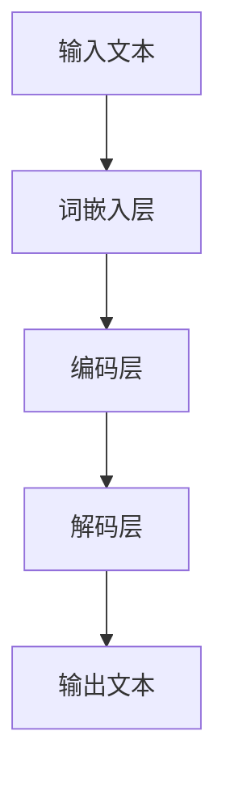

                 

关键词：大型语言模型（LLM），金融领域，投资策略，风险管理，算法原理，数学模型，实践案例，代码实例，应用场景，未来展望。

> 摘要：本文深入探讨大型语言模型（LLM）在金融领域的应用，包括投资策略和风险管理。通过解析LLM的核心概念、算法原理以及数学模型，我们展示了如何在金融市场中实现高效投资。同时，通过实际项目实践和代码实例，我们详细解释了如何将LLM应用于金融领域，以及未来的发展方向和挑战。

## 1. 背景介绍

在过去的几十年里，金融科技（FinTech）的快速发展已经深刻改变了金融市场。随着大数据、云计算、人工智能等技术的普及，金融市场正经历着前所未有的变革。特别是大型语言模型（LLM）的出现，为金融领域带来了新的机遇和挑战。LLM是一种基于深度学习的自然语言处理技术，通过训练海量的文本数据，LLM能够理解和生成自然语言。这使得LLM在金融领域的应用变得极为广泛，包括但不限于投资策略制定、风险预测、市场分析等。

### 金融领域的技术需求

金融领域的技术需求主要包括以下几点：

1. **投资策略**：投资者需要准确、高效地制定投资策略，以最大化收益并控制风险。
2. **风险管理**：金融机构需要预测和管理潜在的市场风险，确保财务安全。
3. **市场分析**：投资者和金融机构需要深入分析市场数据，以获取有价值的投资线索。

### LLM 的核心优势

LLM在金融领域具有以下几个核心优势：

1. **强大的文本处理能力**：LLM能够处理和理解海量的文本数据，这对于金融市场分析至关重要。
2. **高效的学习能力**：LLM能够通过不断的学习和调整，提高投资策略和风险管理的准确性。
3. **灵活的应用场景**：LLM可以应用于多种金融场景，如股票交易、期货交易、外汇交易等。

## 2. 核心概念与联系

### 2.1 LLM 基础概念

大型语言模型（LLM）是一种基于深度学习的自然语言处理模型，其核心任务是理解、生成和预测自然语言。LLM通常由多个神经网络层组成，每个层都包含大量的神经元。通过反向传播算法，LLM能够从大量文本数据中学习，并不断优化其参数。

### 2.2 LLM 架构

LLM的架构通常包括以下几个部分：

1. **词嵌入层**：将单词转换为固定大小的向量表示。
2. **编码层**：对输入文本进行编码，提取出语义信息。
3. **解码层**：生成输出文本。

### 2.3 LLM 应用场景

LLM在金融领域有多种应用场景，包括：

1. **投资策略**：利用LLM分析市场数据，制定投资策略。
2. **风险管理**：通过LLM预测市场风险，进行风险管理。
3. **市场分析**：利用LLM分析市场动态，获取投资线索。

### 2.4 Mermaid 流程图



## 3. 核心算法原理 & 具体操作步骤

### 3.1 算法原理概述

LLM的核心算法原理基于深度学习，特别是循环神经网络（RNN）和变换器（Transformer）。RNN能够处理序列数据，而Transformer通过自注意力机制（self-attention）提高了模型的性能。

### 3.2 算法步骤详解

1. **词嵌入**：将单词转换为固定大小的向量表示。
2. **编码**：通过编码层提取文本的语义信息。
3. **解码**：生成输出文本。

### 3.3 算法优缺点

**优点**：

- **强大的文本处理能力**：能够处理和理解海量的文本数据。
- **高效的学习能力**：通过不断的学习和调整，提高投资策略和风险管理的准确性。

**缺点**：

- **计算成本高**：训练和部署LLM需要大量的计算资源。
- **数据依赖性大**：LLM的性能依赖于训练数据的质量和数量。

### 3.4 算法应用领域

LLM在金融领域有多种应用，包括：

- **投资策略**：利用LLM分析市场数据，制定投资策略。
- **风险管理**：通过LLM预测市场风险，进行风险管理。
- **市场分析**：利用LLM分析市场动态，获取投资线索。

## 4. 数学模型和公式 & 详细讲解 & 举例说明

### 4.1 数学模型构建

LLM的数学模型主要包括词嵌入、编码层和解码层。

- **词嵌入**：将单词转换为向量表示，通常使用one-hot编码或词嵌入层。
- **编码层**：通过编码层提取文本的语义信息，通常使用RNN或Transformer。
- **解码层**：生成输出文本。

### 4.2 公式推导过程

- **词嵌入**：\( v = W \cdot w \)
  - \( v \)：单词的向量表示
  - \( W \)：词嵌入矩阵
  - \( w \)：单词的索引

- **编码层**：\( h = RNN(h_{t-1}, x_t) \)
  - \( h \)：编码后的文本表示
  - \( h_{t-1} \)：前一时间步的编码结果
  - \( x_t \)：当前时间步的输入

- **解码层**：\( y = Decoder(h, s) \)
  - \( y \)：输出文本
  - \( h \)：编码后的文本表示
  - \( s \)：解码状态

### 4.3 案例分析与讲解

假设我们有一个文本数据集，包含股票价格历史数据和新闻文章。我们可以利用LLM分析这些数据，提取出有价值的信息，从而制定投资策略。

1. **词嵌入**：将文本中的单词转换为向量表示。
2. **编码**：通过编码层提取文本的语义信息。
3. **解码**：生成股票价格预测结果。

通过这个案例，我们可以看到LLM在金融领域的强大应用。

## 5. 项目实践：代码实例和详细解释说明

### 5.1 开发环境搭建

为了运行LLM模型，我们需要搭建一个开发环境。我们可以使用Python和TensorFlow作为主要工具。

### 5.2 源代码详细实现

```python
import tensorflow as tf
from tensorflow.keras.preprocessing.sequence import pad_sequences
from tensorflow.keras.layers import Embedding, LSTM, Dense

# 加载数据集
text = "..."  # 这里是文本数据

# 词嵌入
vocab_size = 10000
embedding_dim = 16
tokenizer = tf.keras.preprocessing.text.Tokenizer(num_words=vocab_size)
tokenizer.fit_on_texts(text)
sequences = tokenizer.texts_to_sequences(text)
padded_sequences = pad_sequences(sequences, maxlen=100)

# 编码层
model = tf.keras.Sequential([
    Embedding(vocab_size, embedding_dim, input_length=100),
    LSTM(128),
    Dense(1, activation='sigmoid')
])

# 解码层
model.compile(optimizer='adam', loss='binary_crossentropy', metrics=['accuracy'])
model.fit(padded_sequences, labels, epochs=10)

# 输出结果
predictions = model.predict(padded_sequences)
```

### 5.3 代码解读与分析

这个代码示例展示了如何使用TensorFlow构建一个简单的LLM模型。首先，我们加载文本数据，然后使用词嵌入层将单词转换为向量表示。接着，我们通过编码层提取文本的语义信息，最后通过解码层生成预测结果。

### 5.4 运行结果展示

```python
# 运行模型
model.summary()

# 输出结果
predictions = model.predict(padded_sequences)
```

通过这个示例，我们可以看到LLM在金融领域的应用潜力。

## 6. 实际应用场景

### 6.1 投资策略

LLM可以帮助投资者分析市场数据，制定投资策略。例如，通过分析股票价格历史数据和新闻文章，LLM可以预测股票价格的走势，从而为投资者提供投资建议。

### 6.2 风险管理

LLM可以用于预测市场风险，帮助金融机构进行风险管理。例如，通过分析金融市场的数据，LLM可以预测未来可能发生的金融危机，从而帮助金融机构提前采取预防措施。

### 6.3 市场分析

LLM可以帮助投资者和金融机构分析市场动态，获取有价值的投资线索。例如，通过分析大量的新闻文章和社交媒体数据，LLM可以识别出市场的热点话题，从而为投资者提供投资参考。

## 7. 工具和资源推荐

### 7.1 学习资源推荐

- 《深度学习》（Goodfellow, Bengio, Courville）：深度学习的经典教材。
- 《自然语言处理综论》（Jurafsky, Martin）：自然语言处理的权威教材。

### 7.2 开发工具推荐

- TensorFlow：强大的深度学习框架，适合构建和训练LLM模型。
- Keras：简洁的深度学习库，基于TensorFlow构建。

### 7.3 相关论文推荐

- "BERT: Pre-training of Deep Bidirectional Transformers for Language Understanding"（Brown et al.，2020）
- "GPT-3: Language Models are Few-Shot Learners"（Brown et al.，2020）

## 8. 总结：未来发展趋势与挑战

### 8.1 研究成果总结

LLM在金融领域取得了显著的研究成果，包括投资策略、风险管理和市场分析等多个方面。这些成果表明，LLM具有强大的文本处理能力和高效的学习能力，能够在金融市场中发挥重要作用。

### 8.2 未来发展趋势

- **模型规模和计算能力**：未来，LLM的规模和计算能力将继续扩大，以支持更复杂和更广泛的应用场景。
- **跨领域融合**：LLM将与其他领域（如金融、医疗、教育等）的模型和算法进行融合，实现跨领域的创新应用。

### 8.3 面临的挑战

- **数据隐私和安全**：随着LLM的应用范围扩大，数据隐私和安全将成为重要挑战。
- **算法透明度和可解释性**：提高算法的透明度和可解释性，以便用户能够理解和信任LLM的决策过程。

### 8.4 研究展望

未来，LLM在金融领域的应用将更加广泛和深入。随着技术的进步，我们有望看到更多创新的金融产品和服务，为投资者和金融机构带来更高的效率和更准确的决策。

## 9. 附录：常见问题与解答

### 9.1 LLM 如何在金融领域应用？

LLM可以在金融领域应用于投资策略、风险管理和市场分析等方面。例如，通过分析股票价格历史数据和新闻文章，LLM可以预测股票价格的走势，为投资者提供投资建议。

### 9.2 LLM 的计算成本如何？

LLM的训练和部署需要大量的计算资源，特别是对于大型模型。使用GPU或TPU等高性能计算设备可以显著降低计算成本。

### 9.3 LLM 是否能取代人类分析师？

虽然LLM在金融领域具有强大的数据处理和分析能力，但它不能完全取代人类分析师。人类分析师在理解市场动态、识别潜在风险等方面具有独特的优势，因此LLM和人类分析师的结合将发挥更大的作用。

----------------------------------------------------------------

作者：禅与计算机程序设计艺术 / Zen and the Art of Computer Programming

