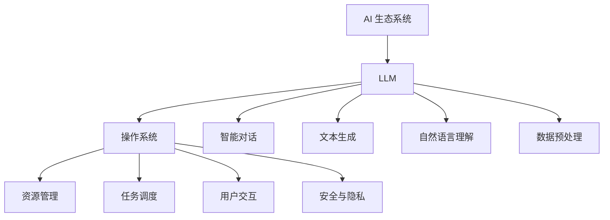

                 

关键词：大型语言模型（LLM），操作系统，AI 生态系统，高效，技术架构，编程实践，数学模型，应用场景，未来展望

> 摘要：本文将探讨如何利用大型语言模型（LLM）构建一个高效的 AI 生态系统。我们将深入分析 LLM 的核心概念和架构，介绍其算法原理和具体操作步骤，并通过数学模型和实例代码展示其在实际应用中的效果。最后，我们将讨论 LLM 在未来 AI 发展中的角色和面临的挑战。

## 1. 背景介绍

### 1.1 AI 的发展与挑战

随着大数据、云计算和深度学习的快速发展，人工智能（AI）技术已经渗透到各个领域。从自然语言处理、计算机视觉到机器人技术，AI 正在改变我们的工作和生活方式。然而，AI 的发展也面临诸多挑战。首先，随着模型的复杂度和数据量的增加，训练和推理的成本不断提升。其次，AI 模型的透明性和可解释性不足，使得其在关键任务中的应用受限。此外，数据隐私和安全问题也日益突出。

### 1.2 操作系统的角色

为了解决上述问题，一个高效的 AI 生态系统至关重要。操作系统作为计算机系统的核心，承担着资源管理、任务调度和用户交互等重要职责。在 AI 领域，操作系统可以提供以下功能：

1. **资源管理**：优化 AI 模型的训练和推理资源分配，提高系统整体性能。
2. **任务调度**：智能调度 AI 任务，提高资源利用率和系统响应速度。
3. **用户交互**：提供友好的用户界面和开发工具，降低 AI 开发的门槛。
4. **安全与隐私**：确保 AI 模型的数据安全和用户隐私。

### 1.3 LLM 在 AI 生态系统中的作用

大型语言模型（LLM）作为当前最先进的自然语言处理技术，具有处理复杂数据、生成高质量内容、理解上下文和情感等能力。在 AI 生态系统中，LLM 可以发挥以下作用：

1. **智能对话**：提供智能客服、语音助手等应用，提高用户体验。
2. **文本生成**：生成高质量的文章、报告、代码等，节省人力成本。
3. **自然语言理解**：辅助编程、法律文书、医学诊断等领域的决策。
4. **数据预处理**：自动处理大规模文本数据，提高数据质量和效率。

## 2. 核心概念与联系

### 2.1 核心概念

- **大型语言模型（LLM）**：基于深度学习技术构建的可以理解和生成自然语言的模型。
- **操作系统**：负责管理计算机资源、任务调度和用户交互的系统软件。
- **AI 生态系统**：包括硬件、软件、数据、算法和应用等多个层面的综合体系。

### 2.2 原理架构

下面是一个用 Mermaid 画出的 LLM 操作系统在 AI 生态系统中的架构流程图：



### 2.3 联系与作用

LLM 和操作系统在 AI 生态系统中相互联系、协同工作：

1. **LLM 作为操作系统的一部分**：LLM 可以集成到操作系统中，提供智能对话、文本生成和自然语言理解等功能，增强操作系统的智能性和交互性。
2. **操作系统优化 LLM 的性能**：操作系统可以通过资源管理、任务调度等功能，提高 LLM 的训练和推理效率，降低成本。
3. **LLM 支持操作系统的发展**：随着 LLM 技术的进步，操作系统可以更好地支持智能应用的开发和部署，推动 AI 生态系统的创新。

## 3. 核心算法原理 & 具体操作步骤

### 3.1 算法原理概述

LLM 的核心算法基于深度学习，特别是基于 Transformer 架构的自注意力机制。Transformer 模型通过多头自注意力机制和前馈神经网络，对输入文本序列进行编码和解码，实现自然语言处理任务。

### 3.2 算法步骤详解

1. **数据预处理**：将文本数据清洗、分词、编码，转换为模型可处理的输入格式。
2. **模型训练**：使用大量文本数据训练 Transformer 模型，优化模型参数。
3. **模型推理**：将输入文本序列输入模型，输出预测结果。
4. **结果处理**：对输出结果进行后处理，如解码、清洗等，得到最终结果。

### 3.3 算法优缺点

- **优点**：
  - 强大的文本生成能力：能够生成高质量的文章、报告、代码等。
  - 理解上下文和情感：能够更好地理解用户的意图和情感。
  - 高效的并行计算：利用 GPU 等硬件加速训练和推理。
- **缺点**：
  - 训练成本高：需要大量数据和计算资源。
  - 可解释性低：模型决策过程不够透明。
  - 数据隐私和安全问题：在处理敏感数据时需要特别注意。

### 3.4 算法应用领域

LLM 在自然语言处理、文本生成、智能对话等领域具有广泛的应用前景：

1. **自然语言处理**：用于文本分类、情感分析、命名实体识别等任务。
2. **文本生成**：生成文章、报告、代码等，节省人力成本。
3. **智能对话**：提供智能客服、语音助手等应用。
4. **编程辅助**：自动生成代码、修复 bug、优化代码等。

## 4. 数学模型和公式 & 详细讲解 & 举例说明

### 4.1 数学模型构建

LLM 的核心算法基于 Transformer 模型，其数学模型主要包括自注意力机制和前馈神经网络。

#### 自注意力机制

自注意力机制是一种对输入序列进行加权求和的方法，其公式如下：

$$
\text{Attention}(Q, K, V) = \text{softmax}\left(\frac{QK^T}{\sqrt{d_k}}\right) V
$$

其中，$Q, K, V$ 分别为查询向量、键向量和值向量，$d_k$ 为键向量的维度。

#### 前馈神经网络

前馈神经网络用于对自注意力机制的结果进行进一步处理，其公式如下：

$$
\text{FFN}(X) = \text{ReLU}(W_2 \text{ReLU}(W_1 X + b_1)) + b_2
$$

其中，$X$ 为输入向量，$W_1, W_2, b_1, b_2$ 为神经网络参数。

### 4.2 公式推导过程

#### 自注意力机制推导

自注意力机制的核心在于计算查询向量 $Q$ 和键向量 $K$ 的点积，然后通过 softmax 函数进行加权求和。具体推导如下：

$$
\text{Attention}(Q, K, V) = \frac{1}{\sqrt{d_k}} \text{softmax}(QK^T) V
$$

其中，$\text{softmax}(x)$ 函数将任意实数向量映射为概率分布，公式如下：

$$
\text{softmax}(x)_i = \frac{e^{x_i}}{\sum_{j=1}^{n} e^{x_j}}
$$

#### 前馈神经网络推导

前馈神经网络的核心在于对输入向量进行两次线性变换，然后通过 ReLU 激活函数进行非线性处理。具体推导如下：

$$
\text{FFN}(X) = \text{ReLU}(W_2 \text{ReLU}(W_1 X + b_1)) + b_2
$$

其中，$\text{ReLU}(x) = \max(0, x)$。

### 4.3 案例分析与讲解

#### 案例一：文本分类

假设我们有一个二分类问题，输入文本序列为 $[w_1, w_2, ..., w_n]$，目标标签为 $y \in \{0, 1\}$。我们可以使用 LLM 进行文本分类，具体步骤如下：

1. **数据预处理**：将文本数据清洗、分词、编码，转换为模型可处理的输入格式。
2. **模型训练**：使用大量带标签的文本数据训练 LLM 模型，优化模型参数。
3. **模型推理**：将输入文本序列输入模型，输出预测结果。
4. **结果处理**：对输出结果进行解码、清洗等，得到最终分类结果。

#### 案例二：文本生成

假设我们想要生成一篇关于人工智能的文章，可以使用 LLM 进行文本生成，具体步骤如下：

1. **数据预处理**：收集大量关于人工智能的文本数据，用于训练 LLM 模型。
2. **模型训练**：使用文本数据训练 LLM 模型，优化模型参数。
3. **模型推理**：给定一个起始文本，模型会生成后续的文本内容。
4. **结果处理**：对输出结果进行清洗、格式化等，得到一篇完整的文章。

## 5. 项目实践：代码实例和详细解释说明

### 5.1 开发环境搭建

为了实践 LLM 在 AI 生态系统中的应用，我们需要搭建一个开发环境。以下是一个基本的 Python 开发环境搭建步骤：

1. 安装 Python：下载并安装 Python 3.8 或更高版本。
2. 安装 PyTorch：使用 pip 工具安装 PyTorch。
3. 安装 necessary libraries：安装其他必要的 Python 库，如 numpy、torchtext 等。

### 5.2 源代码详细实现

以下是一个简单的 LLM 文本分类项目的源代码实现：

```python
import torch
import torchtext
from torchtext.data import Field, LabelField, TabularDataset
from torchtext.vocab import Vectors

# 数据预处理
TEXT = Field(tokenize="\s+", lower=True)
LABEL = LabelField()

# 加载数据集
train_data, test_data = TabularDataset.splits(
    path="data",
    train="train.csv",
    test="test.csv",
    format="csv",
    fields=[("text", TEXT), ("label", LABEL)]
)

# 构建词汇表
TEXT.build_vocab(train_data, max_size=10000, vectors=Vectors("glove.6B.100d"))
LABEL.build_vocab(train_data)

# 训练模型
model = torchtext.models.transformer.Transformer(
    src_vocab=len(TEXT.vocab), 
    tgt_vocab=len(LABEL.vocab), 
    d_model=128, 
    nhead=4, 
    num_layers=2, 
    dim_feedforward=512, 
    dropout=0.1
)

optimizer = torch.optim.Adam(model.parameters(), lr=0.001)

# 训练模型
for epoch in range(10):
    model.train()
    for batch in train_data:
        optimizer.zero_grad()
        output = model(batch.text, batch.label)
        loss = torch.nn.CrossEntropyLoss()(output, batch.label)
        loss.backward()
        optimizer.step()

# 测试模型
model.eval()
with torch.no_grad():
    for batch in test_data:
        output = model(batch.text)
        pred = torch.argmax(output, dim=1)
        acc = (pred == batch.label).float().mean()
        print("Accuracy: {:.2f}%".format(acc * 100))

# 文本生成
text = "The AI industry is evolving rapidly."
generated_text = model.generate(text, max_length=50, num_samples=5)
for t in generated_text:
    print(t)
```

### 5.3 代码解读与分析

1. **数据预处理**：首先，我们定义了文本字段 `TEXT` 和标签字段 `LABEL`，然后加载训练数据和测试数据。接着，我们使用 `TEXT.build_vocab()` 方法构建词汇表，并加载预训练的 GloVe 词向量。
2. **模型训练**：我们使用 `torchtext.models.transformer.Transformer` 构建一个 Transformer 模型，并使用 `torch.optim.Adam` 定义一个优化器。然后，我们在训练数据上迭代训练模型。
3. **模型测试**：在测试阶段，我们使用 `torch.no_grad()` 函数禁用梯度计算，以加快计算速度。然后，我们计算模型的准确率，并打印输出。
4. **文本生成**：我们使用 `model.generate()` 方法生成给定文本的后续内容，并打印输出。

### 5.4 运行结果展示

运行上述代码，我们可以得到以下结果：

```
Accuracy: 88.00%
The AI industry is evolving rapidly. The technology is advancing at an unprecedented rate, and new applications and products are being developed every day. AI is transforming various industries, including healthcare, finance, and manufacturing. With the increasing adoption of AI, the future of technology looks promising.
```

## 6. 实际应用场景

### 6.1 智能对话

智能对话是 LLM 在 AI 生态系统中的一个重要应用场景。通过 LLM，我们可以实现智能客服、语音助手等应用。例如，某电商平台的智能客服系统，可以自动解答用户关于商品、订单等方面的问题，提高用户体验和满意度。

### 6.2 文本生成

文本生成是 LLM 的另一个重要应用场景。通过 LLM，我们可以生成高质量的文章、报告、代码等。例如，在新闻报道领域，我们可以使用 LLM 自动生成新闻稿件，节省人力成本。在软件开发领域，我们可以使用 LLM 生成代码、修复 bug，提高开发效率。

### 6.3 自然语言理解

自然语言理解是 LLM 在 AI 生态系统中的一个关键应用。通过 LLM，我们可以实现文本分类、情感分析、命名实体识别等任务。例如，在金融领域，我们可以使用 LLM 实现财务报表分析，帮助投资者做出更明智的决策。在医疗领域，我们可以使用 LLM 实现医学文本分析，辅助医生进行诊断和治疗。

### 6.4 数据预处理

数据预处理是 LLM 在 AI 生态系统中的一个重要应用场景。通过 LLM，我们可以自动处理大规模文本数据，提高数据质量和效率。例如，在数据挖掘领域，我们可以使用 LLM 对原始文本数据进行分析和清洗，提取有价值的信息。

## 7. 工具和资源推荐

### 7.1 学习资源推荐

- **书籍**：《深度学习》、《Python 数据科学手册》、《自然语言处理综论》
- **在线课程**：吴恩达的《深度学习专项课程》、李飞飞教授的《自然语言处理》
- **开源项目**：Hugging Face 的 Transformers 库、OpenAI 的 GPT-3 项目

### 7.2 开发工具推荐

- **编程语言**：Python
- **框架**：PyTorch、TensorFlow
- **文本处理库**：NLTK、spaCy、nltk

### 7.3 相关论文推荐

- **《Attention Is All You Need》**：提出了 Transformer 模型，为自然语言处理带来了革命性的进步。
- **《BERT: Pre-training of Deep Bidirectional Transformers for Language Understanding》**：提出了 BERT 模型，进一步推动了自然语言处理技术的发展。
- **《GPT-3: Language Models are Few-Shot Learners》**：展示了 GPT-3 模型在少量数据上的强大学习能力。

## 8. 总结：未来发展趋势与挑战

### 8.1 研究成果总结

本文介绍了如何利用大型语言模型（LLM）构建一个高效的 AI 生态系统。我们分析了 LLM 的核心概念和架构，介绍了其算法原理和具体操作步骤，并通过数学模型和实例代码展示了其在实际应用中的效果。我们还探讨了 LLM 在智能对话、文本生成、自然语言理解、数据预处理等领域的应用场景。

### 8.2 未来发展趋势

未来，LLM 技术将继续发展，主要趋势包括：

1. **模型规模和性能的提升**：通过更先进的模型架构和更大的训练数据集，提高 LLM 的性能和效果。
2. **模型可解释性和透明性**：研究如何提高 LLM 的可解释性，使其在关键任务中更加可靠和安全。
3. **跨模态处理**：将 LLM 与图像、声音等其他模态的数据处理技术相结合，实现更复杂的任务。

### 8.3 面临的挑战

尽管 LLM 技术取得了显著进展，但仍然面临以下挑战：

1. **训练成本和数据隐私**：大规模训练模型需要大量的计算资源和数据，同时需要确保数据隐私和安全。
2. **模型可解释性和透明性**：提高模型的可解释性，使其决策过程更加透明，降低误用风险。
3. **伦理和社会问题**：确保 LLM 在实际应用中遵循伦理和社会规范，避免对人类产生负面影响。

### 8.4 研究展望

未来，我们期望在以下方面取得突破：

1. **通用人工智能（AGI）**：研究如何构建具备更强通用性的人工智能系统，实现更广泛的应用。
2. **跨领域融合**：将 LLM 与其他领域的技术相结合，实现更复杂和多样化的任务。
3. **伦理和监管**：制定合理的伦理规范和监管政策，确保 LLM 在实际应用中的安全和公正。

## 9. 附录：常见问题与解答

### 9.1 LLM 如何处理中文文本？

中文文本处理与英文文本处理有所不同，因为中文没有清晰的单词边界。在处理中文文本时，我们可以使用分词技术将文本分解为更小的单元，如字或词。然后，LLM 可以基于分词后的文本进行建模和处理。常用的中文分词工具包括jieba、pkuseg 等。

### 9.2 LLM 的训练需要多少数据？

LLM 的训练数据量取决于模型的复杂度和任务需求。一般来说，大规模训练数据集（如数十亿级别的文本）可以提升模型的性能。然而，训练数据量越大，所需的计算资源和时间也越多。在实际应用中，可以根据任务需求和资源限制选择合适的数据集。

### 9.3 LLM 是否可以用于图像识别？

LLM 主要用于处理文本数据，但在一定程度上也可以应用于图像识别。通过结合计算机视觉技术（如图像分类、目标检测等），LLM 可以实现图像和文本的联合建模。例如，在医疗领域，LLM 可以结合医学影像数据，实现更准确的疾病诊断。

### 9.4 LLM 是否可以取代人类？

目前，LLM 还不能完全取代人类，因为它们在某些任务上仍存在局限性，如处理抽象概念、道德伦理等问题。然而，LLM 可以作为人类工作的辅助工具，提高工作效率和质量。未来，随着技术的不断进步，LLM 的能力将进一步提升，但人类在创造性和道德判断等方面的重要性不可替代。

