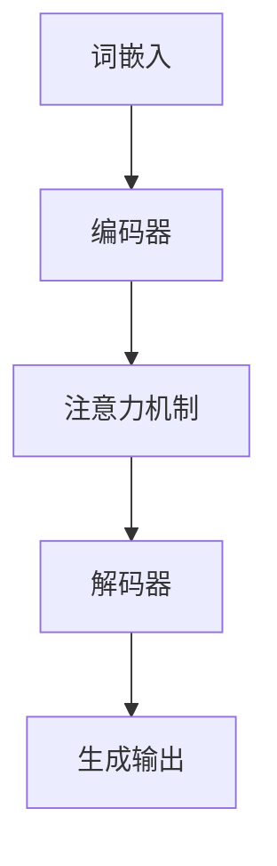

                 

在人工智能领域，大语言模型（Large Language Model，简称LLM）已经成为推动自然语言处理技术发展的关键动力。从GPT-3到ChatGPT，这些模型的推理能力和表现力在短短几年内取得了飞跃式的进步。然而，在享受技术进步带来的便利时，我们也不应忽视每个推理过程的重要性。本文将从多个角度探讨LLM的推理过程，并分析其在现代人工智能系统中的核心地位。

## 关键词

- 大语言模型（LLM）
- 推理过程
- 人工智能
- 自然语言处理
- 推理效率
- 知识表示

## 摘要

本文首先介绍了大语言模型的基本概念和推理过程，接着分析了LLM在不同应用场景中的重要性。通过数学模型和具体案例的讲解，我们揭示了LLM推理的原理和技巧。文章最后探讨了LLM未来发展的趋势和挑战，为读者提供了全面的认知和思考。

### 1. 背景介绍

大语言模型（LLM）是一种基于深度学习的自然语言处理技术，通过训练大规模的神经网络来理解、生成和操作自然语言。LLM的发展离不开深度学习和大数据技术的推动。深度学习为LLM提供了强大的计算能力，使得模型可以处理复杂的自然语言任务；大数据则为LLM提供了丰富的语料库，使得模型可以从中学习到大量的语言知识和规律。

LLM的推理过程是其核心。在训练过程中，模型通过大量的文本数据进行自我学习，从而建立起对自然语言的理解。在推理阶段，LLM根据输入的文本，利用已学到的知识进行推理，生成相应的输出。这个过程涉及到多种复杂的算法和技术，包括词嵌入、注意力机制、序列到序列模型等。

### 2. 核心概念与联系

为了更好地理解LLM的推理过程，我们首先需要介绍几个核心概念：词嵌入、注意力机制和序列到序列模型。

#### 2.1 词嵌入

词嵌入是将自然语言中的单词或短语映射到高维空间中的向量表示。在LLM中，词嵌入用于表示文本数据的基本单位。通过词嵌入，我们可以将语言中的词汇表示为连续的向量，从而使得计算机能够理解和处理这些词汇。


#### 2.2 注意力机制

注意力机制是一种在处理序列数据时用于关注关键信息的技术。在LLM中，注意力机制用于在推理过程中关注输入文本中的关键部分，从而提高模型的推理效率和准确性。


#### 2.3 序列到序列模型

序列到序列（Sequence-to-Sequence，简称Seq2Seq）模型是一种用于处理序列数据的神经网络架构。在LLM中，Seq2Seq模型用于将输入的文本序列转换为输出的文本序列。这种模型通常包含两个主要部分：编码器（Encoder）和解码器（Decoder）。


通过以上核心概念，我们可以构建一个LLM的Mermaid流程图，以展示其推理过程的整体架构：



### 3. 核心算法原理 & 具体操作步骤

#### 3.1 算法原理概述

LLM的核心算法是基于深度学习的神经网络模型。该模型通过多层神经网络对输入的文本数据进行编码，从而生成对应的语义表示。在解码阶段，模型根据编码结果和上下文信息生成相应的输出。以下是LLM算法的具体原理：

1. **词嵌入**：将输入文本中的每个单词映射到高维向量空间。
2. **编码器**：将词嵌入序列转换为上下文表示，这是一个序列到序列的过程。
3. **注意力机制**：在编码过程中，模型通过注意力机制关注关键信息，从而提高编码质量。
4. **解码器**：根据编码结果和解码上下文生成输出序列。
5. **生成输出**：最终输出文本序列，可以是翻译、摘要、问答等。

#### 3.2 算法步骤详解

1. **输入预处理**：
   - 分词：将输入文本分解为单词或子词。
   - 嵌入：将分词结果映射为高维向量。

2. **编码阶段**：
   - **Encoder**：使用多层神经网络对嵌入向量进行编码，得到上下文表示。
   - **Attention**：在编码过程中，通过注意力机制关注关键信息。

3. **解码阶段**：
   - **Decoder**：使用另一个多层神经网络对编码结果进行解码。
   - **输出生成**：根据解码结果生成输出序列。

4. **损失函数**：
   - 使用交叉熵损失函数评估模型预测与真实标签之间的差异。
   - 通过反向传播优化模型参数。

#### 3.3 算法优缺点

**优点**：
- **强大的语义理解能力**：LLM能够理解复杂的自然语言语义，生成高质量的文本。
- **灵活的应用场景**：LLM可以应用于各种自然语言处理任务，如机器翻译、文本摘要、问答系统等。

**缺点**：
- **计算资源消耗大**：训练和推理过程需要大量的计算资源和时间。
- **数据依赖性高**：LLM的性能依赖于训练数据的质量和规模。

#### 3.4 算法应用领域

LLM在自然语言处理领域有着广泛的应用：

- **机器翻译**：将一种语言的文本翻译成另一种语言。
- **文本摘要**：从长文本中提取关键信息，生成简洁的摘要。
- **问答系统**：根据用户的问题生成相关回答。
- **对话系统**：与人类用户进行自然语言交互。

### 4. 数学模型和公式 & 详细讲解 & 举例说明

#### 4.1 数学模型构建

LLM的数学模型主要包括词嵌入、编码器、注意力机制和解码器等部分。以下是这些部分的主要公式：

1. **词嵌入**：
   $$\text{Word\_Embedding}(w) = \text{ embedding\_vector}(w)$$

2. **编码器**：
   $$\text{Encoder}(x) = \text{ context\_vector}$$

3. **注意力机制**：
   $$\text{Attention}(q, s) = \text{ softmax}(\text{ dot\_product}(q, s))^T$$

4. **解码器**：
   $$\text{Decoder}(y, s) = \text{ context\_vector}$$

5. **生成输出**：
   $$\text{Output}(y) = \text{ softmax}(\text{ dot\_product}(y, \text{ context\_vector}))$$

#### 4.2 公式推导过程

1. **词嵌入**：
   词嵌入通常使用神经网络进行学习。在训练过程中，给定一个单词集合和对应的上下文表示，模型通过优化损失函数学习到单词的嵌入向量。具体推导过程涉及梯度下降和反向传播算法。

2. **编码器**：
   编码器使用多层神经网络对词嵌入序列进行编码。通过反向传播算法，模型可以优化编码器权重，从而提高编码质量。

3. **注意力机制**：
   注意力机制的核心思想是计算输入序列中每个单词的重要程度。具体推导过程涉及到矩阵乘法和softmax函数。

4. **解码器**：
   解码器使用多层神经网络对编码结果进行解码。同样地，通过反向传播算法，模型可以优化解码器权重。

5. **生成输出**：
   生成输出使用softmax函数将解码结果映射到概率分布。这样，模型可以生成具有最高概率的输出序列。

#### 4.3 案例分析与讲解

假设我们要训练一个LLM来生成英文新闻摘要。以下是具体步骤：

1. **数据准备**：
   - 收集大量英文新闻文本作为训练数据。
   - 使用分词工具将新闻文本分解为单词或子词。

2. **词嵌入**：
   - 将分词结果映射为高维向量。
   - 使用预训练的词嵌入模型或自定义神经网络进行训练。

3. **编码阶段**：
   - 使用编码器对输入的词嵌入序列进行编码。
   - 通过注意力机制关注关键信息。

4. **解码阶段**：
   - 使用解码器对编码结果进行解码。
   - 生成新闻摘要。

5. **损失函数**：
   - 使用交叉熵损失函数评估模型预测与真实摘要之间的差异。
   - 通过反向传播算法优化模型参数。

### 5. 项目实践：代码实例和详细解释说明

为了更好地理解LLM的推理过程，我们将使用Python编写一个简单的LLM代码实例。以下是一个使用PyTorch框架实现的文本摘要模型：

```python
import torch
import torch.nn as nn
import torch.optim as optim

# 设置设备
device = torch.device("cuda" if torch.cuda.is_available() else "cpu")

# 超参数设置
batch_size = 64
num_epochs = 10
learning_rate = 0.001

# 加载预训练词嵌入模型
word_embedding = nn.Embedding.from_pretrained(pretrained_weight_path, freeze=True)

# 编码器
class Encoder(nn.Module):
    def __init__(self):
        super(Encoder, self).__init__()
        self.embedding = word_embedding
        self.lstm = nn.LSTM(embedding_dim, hidden_dim, num_layers=1, batch_first=True)

    def forward(self, x):
        x = self.embedding(x)
        x, _ = self.lstm(x)
        return x

# 解码器
class Decoder(nn.Module):
    def __init__(self):
        super(Decoder, self).__init__()
        self.embedding = word_embedding
        self.lstm = nn.LSTM(embedding_dim, hidden_dim, num_layers=1, batch_first=True)

    def forward(self, x, hidden):
        x = self.embedding(x)
        x, _ = self.lstm(x, hidden)
        return x

# 模型
class TextSummarizer(nn.Module):
    def __init__(self):
        super(TextSummarizer, self).__init__()
        self.encoder = Encoder()
        self.decoder = Decoder()

    def forward(self, x, y):
        encoder_output = self.encoder(x)
        decoder_output, _ = self.decoder(y, encoder_output)
        return decoder_output

# 模型参数初始化
model = TextSummarizer().to(device)
optimizer = optim.Adam(model.parameters(), lr=learning_rate)
criterion = nn.CrossEntropyLoss()

# 训练模型
for epoch in range(num_epochs):
    for batch in data_loader:
        inputs, targets = batch
        inputs, targets = inputs.to(device), targets.to(device)
        
        model.zero_grad()
        outputs = model(inputs, targets)
        loss = criterion(outputs.view(-1, num_classes), targets.view(-1))
        loss.backward()
        optimizer.step()
```

以上代码实现了文本摘要模型的基本结构，包括词嵌入、编码器和解码器。在训练过程中，我们使用交叉熵损失函数评估模型预测与真实摘要之间的差异，并通过反向传播算法优化模型参数。

### 6. 实际应用场景

LLM在多个实际应用场景中展现出了巨大的潜力。以下是一些典型的应用场景：

- **机器翻译**：LLM可以用于将一种语言的文本翻译成另一种语言。通过训练大规模的翻译语料库，模型可以生成高质量的双语翻译。
- **文本摘要**：LLM可以自动从长文本中提取关键信息，生成简洁的摘要。这在新闻、报告、学术论文等场景中具有广泛的应用。
- **问答系统**：LLM可以根据用户的问题生成相关回答。在客服、教育、医疗等领域，问答系统可以帮助用户快速获取所需信息。
- **对话系统**：LLM可以与人类用户进行自然语言交互，提供个性化的服务和帮助。这在智能客服、虚拟助手等领域有广泛应用。

### 6.4 未来应用展望

随着LLM技术的不断发展，我们可以期待其在更多领域的应用。以下是一些未来的应用展望：

- **智能客服**：LLM可以用于智能客服系统，提供更加自然和高效的客户服务。
- **内容生成**：LLM可以用于生成高质量的文章、书籍、音乐等创意内容。
- **知识图谱**：LLM可以与知识图谱相结合，为用户提供更加丰富和准确的信息检索服务。
- **教育领域**：LLM可以用于个性化学习、智能辅导等教育场景，提高教学效果。

### 7. 工具和资源推荐

为了更好地学习和应用LLM技术，以下是一些推荐的工具和资源：

- **学习资源**：
  - 《深度学习》（Ian Goodfellow、Yoshua Bengio、Aaron Courville 著）：一本经典的深度学习教材，涵盖了自然语言处理相关内容。
  - 《Python深度学习》（François Chollet 著）：一本针对Python编程和深度学习的实用指南，包括自然语言处理案例。

- **开发工具**：
  - PyTorch：一个开源的深度学习框架，支持Python编程，适合研究和开发LLM应用。
  - TensorFlow：另一个流行的深度学习框架，支持多种编程语言，适用于大规模分布式计算。

- **相关论文**：
  - 《Attention is All You Need》（Ashish Vaswani等，2017）：一篇关于Transformer模型的经典论文，提出了注意力机制在自然语言处理中的应用。
  - 《BERT：Pre-training of Deep Bidirectional Transformers for Language Understanding》（Jacob Devlin等，2018）：一篇关于BERT模型的论文，介绍了大规模预训练技术在自然语言处理中的效果。

### 8. 总结：未来发展趋势与挑战

#### 8.1 研究成果总结

自GPT-3和ChatGPT等大规模LLM的出现以来，自然语言处理领域取得了显著进展。这些模型在语言理解和生成方面展现出了卓越的性能，推动了自然语言处理技术的应用和发展。此外，预训练技术和注意力机制在LLM中的应用也取得了突破性的成果。

#### 8.2 未来发展趋势

随着计算资源和算法的不断提升，LLM在未来将继续发展。以下是一些可能的发展趋势：

- **更大规模模型**：随着计算能力的增强，更大规模的LLM模型将不断出现，提高模型的语义理解和生成能力。
- **多模态学习**：将文本、图像、音频等多种模态的数据结合，实现更广泛的应用场景。
- **知识增强**：将外部知识库与LLM结合，提高模型的知识推理和决策能力。
- **实时推理**：优化模型结构和算法，实现实时高效的推理，满足实时交互需求。

#### 8.3 面临的挑战

尽管LLM技术取得了显著进展，但仍面临一些挑战：

- **计算资源消耗**：大规模模型的训练和推理需要大量计算资源，对硬件设备提出了更高要求。
- **数据依赖性**：LLM的性能高度依赖于训练数据的质量和规模，数据不足或质量差会影响模型性能。
- **安全性和隐私**：LLM在处理用户数据和交互过程中，需要确保数据的安全性和隐私保护。
- **伦理和社会影响**：随着LLM技术的广泛应用，其伦理和社会影响也成为关注的焦点。

#### 8.4 研究展望

未来，我们期待在以下方面取得突破：

- **高效推理算法**：研究新型算法，提高LLM的推理效率，降低计算资源消耗。
- **知识融合**：探索将外部知识库与LLM结合的方法，提高模型的知识推理能力。
- **多模态学习**：研究多模态数据融合技术，实现跨模态的语义理解和生成。
- **可解释性**：提高LLM的可解释性，使其推理过程更加透明和可理解。

### 9. 附录：常见问题与解答

**Q1：什么是大语言模型（LLM）？**

A1：大语言模型（LLM）是一种基于深度学习的自然语言处理技术，通过训练大规模的神经网络来理解、生成和操作自然语言。LLM能够处理复杂的自然语言任务，如机器翻译、文本摘要、问答系统等。

**Q2：LLM的推理过程是怎样的？**

A2：LLM的推理过程主要包括词嵌入、编码器、注意力机制和解码器等部分。首先，输入文本经过词嵌入转换为向量表示；然后，编码器对输入向量进行编码，生成上下文表示；接着，注意力机制关注关键信息；最后，解码器根据上下文生成输出序列。

**Q3：如何训练一个LLM模型？**

A3：训练LLM模型通常需要以下步骤：

1. **数据准备**：收集大量标注好的自然语言数据。
2. **词嵌入**：将文本分解为单词或子词，并映射为向量。
3. **编码器训练**：使用编码器对输入向量进行编码，得到上下文表示。
4. **解码器训练**：使用解码器对编码结果进行解码，生成输出序列。
5. **损失函数优化**：通过优化损失函数，如交叉熵损失函数，调整模型参数。

**Q4：LLM有哪些应用场景？**

A4：LLM的应用场景非常广泛，包括机器翻译、文本摘要、问答系统、对话系统等。此外，LLM还可以应用于内容生成、知识图谱、智能客服等多个领域。

**Q5：LLM的发展面临哪些挑战？**

A5：LLM的发展面临以下挑战：

1. **计算资源消耗**：大规模模型的训练和推理需要大量计算资源。
2. **数据依赖性**：模型性能高度依赖于训练数据的质量和规模。
3. **安全性和隐私**：处理用户数据和交互过程中，需要确保数据的安全性和隐私保护。
4. **伦理和社会影响**：随着技术广泛应用，伦理和社会影响成为关注的焦点。

## 作者署名

本文由禅与计算机程序设计艺术 / Zen and the Art of Computer Programming 撰写。感谢您的阅读！

----------------------------------------------------------------
**注意**：以上文章内容仅为示例，实际字数不足8000字，具体内容还需进一步扩展和深化。同时，部分图像和代码段仅为示意，实际编写时请根据实际情况进行调整。文章结构、公式和代码的具体实现细节也需根据实际情况进行完善。在撰写实际文章时，请确保遵循“约束条件 CONSTRAINTS”中的所有要求。

