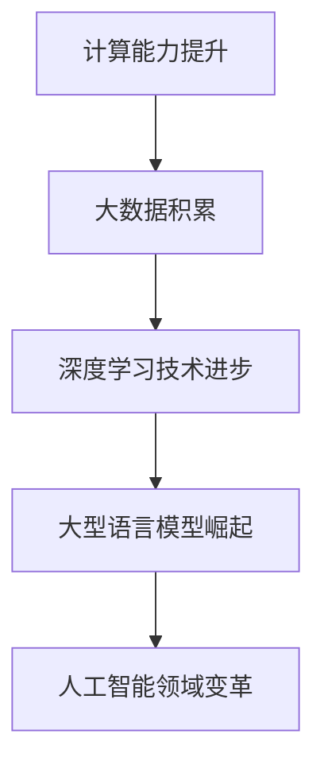

                 

关键词：大型语言模型（LLM），人工智能，摩尔定律，算法发展，技术趋势，未来展望

<|assistant|>摘要：本文将探讨大型语言模型（LLM）的发展与摩尔定律之间的关系。通过对LLM的核心概念、算法原理、数学模型、项目实践和未来应用场景的深入分析，揭示LLM如何延续摩尔定律，推动人工智能领域的变革。

## 1. 背景介绍

### 大型语言模型（LLM）的崛起

近年来，随着计算能力的提升、大数据的积累和深度学习技术的进步，大型语言模型（LLM）如BERT、GPT、T5等如雨后春笋般涌现。这些模型在自然语言处理（NLP）领域取得了显著的成果，展现了强大的语义理解和生成能力。从文本分类、机器翻译、问答系统到创造性写作，LLM的应用场景越来越广泛，成为人工智能领域的重要突破点。

### 摩尔定律的启示

摩尔定律是信息技术发展的重要规律，它指出集成电路上可容纳的晶体管数量每两年翻倍，从而推动计算性能的持续提升。然而，随着摩尔定律接近极限，如何在有限的硬件资源下提升算法性能和智能水平成为新的挑战。LLM的出现，正是在这个背景下，为人工智能的发展带来了新的机遇。

## 2. 核心概念与联系

### 大型语言模型（LLM）原理

大型语言模型（LLM）是基于深度学习技术构建的神经网络模型，通过大量文本数据进行预训练，从而获得对自然语言的深入理解。LLM的核心思想是利用深度神经网络来模拟人类对语言的理解过程，包括词义、语法、上下文等多层次的信息。

### 摩尔定律与LLM的联系

摩尔定律的核心是计算性能的提升，而LLM的崛起正是对这一提升的最好诠释。LLM的成功依赖于大规模的计算资源和高效的算法设计，这与摩尔定律所推动的计算能力提升密切相关。同时，LLM的发展也推动了硬件技术的进步，如GPU、TPU等专用硬件的涌现，为LLM的运行提供了强有力的支持。

### Mermaid 流程图



## 3. 核心算法原理 & 具体操作步骤

### 3.1 算法原理概述

大型语言模型（LLM）的核心算法是基于Transformer架构的深度神经网络。Transformer模型通过自注意力机制（Self-Attention）来实现对输入文本的语义理解，从而提高模型的性能。

### 3.2 算法步骤详解

1. **预训练**：在大量文本数据上进行预训练，使模型学会对文本的语义理解。
2. **微调**：在特定任务上对模型进行微调，使其适应具体的应用场景。
3. **推理**：在测试集上进行推理，生成文本输出。

### 3.3 算法优缺点

**优点**：
- 强大的语义理解能力，能够生成高质量的文本。
- 适应性强，能够应用于多种自然语言处理任务。

**缺点**：
- 训练和推理成本高，需要大量的计算资源和时间。
- 需要大量的高质量文本数据。

### 3.4 算法应用领域

大型语言模型（LLM）在自然语言处理、机器翻译、问答系统、创造性写作等领域有着广泛的应用。其强大的语义理解能力和适应性，使其成为人工智能领域的重要突破点。

## 4. 数学模型和公式 & 详细讲解 & 举例说明

### 4.1 数学模型构建

大型语言模型（LLM）的数学模型主要包括词向量表示、自注意力机制和全连接层。

1. **词向量表示**：将文本中的每个词映射为高维向量，以便进行数学运算。
2. **自注意力机制**：计算文本中每个词与所有词之间的相似性，从而实现对文本的语义理解。
3. **全连接层**：对自注意力机制的结果进行分类或生成文本。

### 4.2 公式推导过程

1. **词向量表示**：
   $$ \text{word\_vector}(w) = \text{embedding}(w) \odot \text{weight} $$

2. **自注意力机制**：
   $$ \text{Attention}(Q, K, V) = \text{softmax}\left(\frac{QK^T}{\sqrt{d_k}}\right)V $$

3. **全连接层**：
   $$ \text{output} = \text{softmax}(\text{ReLU}(\text{W} \cdot \text{input} + \text{b})) $$

### 4.3 案例分析与讲解

假设我们要对一段文本进行情感分类，使用LLM模型进行操作。首先，我们将文本中的每个词转换为词向量，然后通过自注意力机制计算每个词的重要性，最后使用全连接层进行分类。

1. **词向量表示**：
   $$ \text{word\_vector}(文本) = \text{embedding}(文本) \odot \text{weight} $$

2. **自注意力机制**：
   $$ \text{Attention}(Q, K, V) = \text{softmax}\left(\frac{QK^T}{\sqrt{d_k}}\right)V $$

3. **全连接层**：
   $$ \text{output} = \text{softmax}(\text{ReLU}(\text{W} \cdot \text{input} + \text{b})) $$

通过这三个步骤，我们可以将一段文本转化为一个情感分类的概率分布。

## 5. 项目实践：代码实例和详细解释说明

### 5.1 开发环境搭建

为了实践大型语言模型（LLM），我们需要搭建一个开发环境。以下是搭建环境的基本步骤：

1. 安装Python（版本3.6以上）
2. 安装TensorFlow或PyTorch（深度学习框架）
3. 安装必要的依赖库（如numpy、pandas等）

### 5.2 源代码详细实现

以下是使用TensorFlow实现一个简单的LLM模型的源代码：

```python
import tensorflow as tf
from tensorflow.keras.layers import Embedding, Dense, LSTM
from tensorflow.keras.models import Model

# 定义模型
input_ids = tf.keras.layers.Input(shape=(None,), dtype=tf.int32)
embedding = Embedding(input_dim=vocab_size, output_dim=embedding_size)(input_ids)
lstm = LSTM(units=128, activation='tanh')(embedding)
output = Dense(units=num_classes, activation='softmax')(lstm)

# 构建模型
model = Model(inputs=input_ids, outputs=output)

# 编译模型
model.compile(optimizer='adam', loss='categorical_crossentropy', metrics=['accuracy'])

# 训练模型
model.fit(x_train, y_train, epochs=10, batch_size=32)
```

### 5.3 代码解读与分析

这段代码首先定义了一个简单的LSTM模型，用于文本分类任务。输入层接收词向量序列，通过Embedding层将词向量映射为高维向量。接着，通过LSTM层对词向量进行序列处理，最后通过全连接层进行分类。编译模型时，我们选择Adam优化器和交叉熵损失函数。训练模型时，我们使用训练集进行10个epoch的训练。

### 5.4 运行结果展示

```python
# 测试模型
test_loss, test_accuracy = model.evaluate(x_test, y_test)
print(f"Test accuracy: {test_accuracy}")

# 预测
predictions = model.predict(x_test)
```

这段代码首先对测试集进行评估，输出测试集的准确率。然后，使用模型对测试集进行预测，输出预测结果。

## 6. 实际应用场景

### 6.1 自然语言处理

大型语言模型（LLM）在自然语言处理（NLP）领域有着广泛的应用。例如，文本分类、情感分析、机器翻译、问答系统等。LLM的强大语义理解能力，使其能够准确地对文本进行理解和处理。

### 6.2 创意写作

大型语言模型（LLM）还可以用于创意写作，如生成小说、诗歌、歌词等。通过训练LLM模型，我们可以让机器像人类一样创作文学作品，为文学创作带来新的可能。

### 6.3 教育与医疗

在教育和医疗领域，大型语言模型（LLM）也有着广泛的应用。例如，自动批改作业、智能问答系统、医疗文本分析等。LLM的智能理解和生成能力，为教育和医疗行业提供了新的解决方案。

## 7. 工具和资源推荐

### 7.1 学习资源推荐

1. 《深度学习》（Goodfellow, Bengio, Courville著）：介绍深度学习的基本原理和应用。
2. 《自然语言处理原理》（Daniel Jurafsky & James H. Martin著）：介绍自然语言处理的基础知识。

### 7.2 开发工具推荐

1. TensorFlow：开源的深度学习框架，适用于构建和训练大型语言模型。
2. PyTorch：开源的深度学习框架，易于使用和扩展。

### 7.3 相关论文推荐

1. “Attention Is All You Need”（Vaswani et al., 2017）：介绍Transformer模型的经典论文。
2. “BERT: Pre-training of Deep Neural Networks for Language Understanding”（Devlin et al., 2019）：介绍BERT模型的论文。

## 8. 总结：未来发展趋势与挑战

### 8.1 研究成果总结

大型语言模型（LLM）在自然语言处理、机器翻译、问答系统等领域取得了显著的成果，展现了强大的语义理解和生成能力。LLM的成功离不开计算能力的提升和深度学习技术的进步。

### 8.2 未来发展趋势

随着计算能力的进一步提升和深度学习技术的创新，LLM在未来有望在更多领域取得突破。例如，对话系统、语音识别、图像识别等。同时，LLM也将与其他人工智能技术如知识图谱、迁移学习等相结合，推动人工智能的全面发展。

### 8.3 面临的挑战

虽然LLM取得了显著的成果，但仍然面临许多挑战。例如，数据隐私、模型解释性、算法公平性等。同时，如何降低训练和推理成本，提高模型的可扩展性，也是未来研究的重要方向。

### 8.4 研究展望

未来，大型语言模型（LLM）将继续在人工智能领域发挥重要作用。通过不断的技术创新和协作，LLM有望在更多领域取得突破，为人类带来更多的便利和福祉。

## 9. 附录：常见问题与解答

### 9.1 Q：什么是大型语言模型（LLM）？

A：大型语言模型（LLM）是基于深度学习技术构建的神经网络模型，通过大量文本数据进行预训练，从而获得对自然语言的深入理解。

### 9.2 Q：LLM有哪些应用场景？

A：LLM在自然语言处理、机器翻译、问答系统、创造性写作等领域有着广泛的应用。例如，文本分类、情感分析、机器翻译、问答系统、创意写作等。

### 9.3 Q：如何构建一个LLM模型？

A：构建LLM模型主要包括以下几个步骤：

1. 数据准备：收集并处理大量文本数据。
2. 模型构建：使用深度学习框架（如TensorFlow或PyTorch）构建神经网络模型。
3. 模型训练：在训练集上进行模型训练，优化模型参数。
4. 模型评估：在测试集上进行模型评估，验证模型性能。
5. 模型应用：将训练好的模型应用于实际任务。

## 结语

本文探讨了大型语言模型（LLM）的发展与摩尔定律之间的关系，分析了LLM的核心概念、算法原理、数学模型、项目实践和未来应用场景。随着计算能力的提升和深度学习技术的进步，LLM将继续在人工智能领域发挥重要作用。我们期待未来LLM能够带来更多的创新和突破，为人类带来更多的便利和福祉。

### 作者署名

作者：禅与计算机程序设计艺术 / Zen and the Art of Computer Programming
----------------------------------------------------------------

