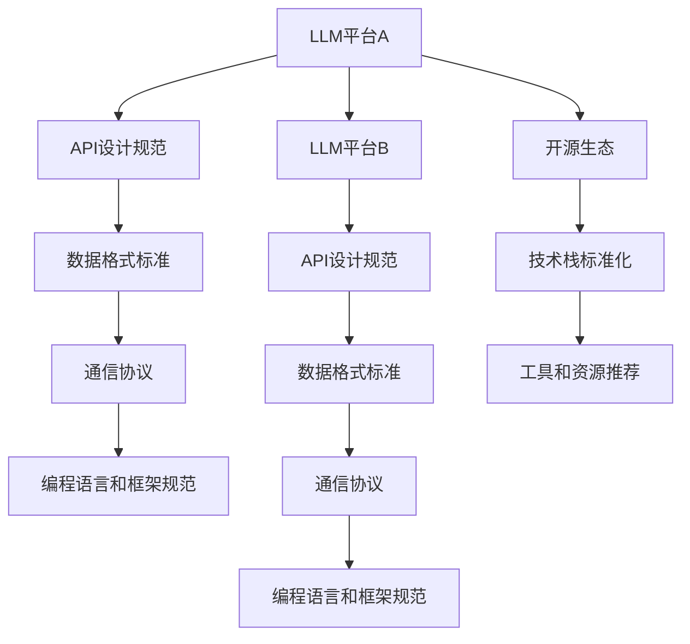

                 

关键词：大型语言模型（LLM），互操作性，兼容性，标准，API设计，数据格式，协议，开源生态，技术栈，语言处理，软件开发，人工智能。

## 摘要

本文旨在探讨大型语言模型（LLM）在促进互操作性和兼容性方面的标准和策略。随着人工智能技术的飞速发展，LLM已经成为了现代应用的重要组成部分。然而，不同平台和框架之间的不兼容性，成为了阻碍LLM应用扩展和深度集成的主要问题。本文首先介绍了LLM的基本概念和其在各个领域的应用，然后详细分析了当前LLM标准面临的挑战，包括API设计、数据格式、协议等方面。在此基础上，本文提出了促进LLM互操作性和兼容性的若干策略，包括开源生态的建设、技术栈的标准化以及相关工具和资源的推荐。最后，本文对未来LLM的发展趋势和面临的挑战进行了展望。

## 1. 背景介绍

### 1.1 大型语言模型（LLM）的定义

大型语言模型（Large Language Models，简称LLM）是一种基于深度学习技术的自然语言处理（Natural Language Processing，简称NLP）模型，具有强大的文本生成、理解和推理能力。LLM通过对海量文本数据进行预训练，学习到了语言的结构、语义和上下文关系，从而能够处理各种复杂的语言任务，如文本生成、机器翻译、问答系统、情感分析等。

### 1.2 LLM的发展历程

LLM的发展可以追溯到2000年代初期，当时基于统计方法的NLP模型如隐马尔可夫模型（HMM）和条件概率模型已经取得了显著进展。然而，这些方法在面对复杂语言现象时，效果仍然有限。随着深度学习的兴起，基于神经网络的语言模型逐渐崭露头角。

2003年，Bengio等人提出的深度信念网络（Deep Belief Networks，DBN）为后续的深度学习语言模型奠定了基础。2013年，Hinton等人提出的词嵌入（Word Embedding）技术，使得神经网络能够更好地捕捉词语的语义信息，推动了NLP领域的发展。

2018年，OpenAI发布了GPT（Generative Pre-trained Transformer）模型，标志着LLM进入了一个新的阶段。GPT系列模型通过递归神经网络（RNN）和Transformer架构，实现了对大规模文本数据的预训练，展示了在多种NLP任务上的卓越性能。

随后，BERT（Bidirectional Encoder Representations from Transformers）、RoBERTa、T5等一系列基于Transformer架构的LLM模型相继问世，进一步推动了LLM技术的发展和应用。

### 1.3 LLM的应用领域

LLM在各个领域的应用日益广泛，已经成为现代人工智能系统的重要组成部分。以下是LLM在几个主要应用领域的概述：

- **文本生成与摘要**：LLM能够生成连贯、有意义的文本，广泛应用于自动写作、新闻摘要、对话系统等领域。例如，GPT-3可以生成诗歌、故事、代码等多样化的文本内容。
- **机器翻译**：LLM在机器翻译领域取得了显著进展，能够实现高质量的双语翻译。例如，谷歌翻译和百度翻译都采用了基于LLM的翻译技术。
- **问答系统**：LLM可以用于构建智能问答系统，通过理解用户的提问和上下文，提供准确的答案。例如，Siri、Alexa等语音助手都采用了LLM技术。
- **情感分析**：LLM可以分析文本中的情感倾向，广泛应用于市场调研、客户反馈分析等领域。例如，社交媒体平台会使用LLM技术来监测用户情绪和舆论趋势。
- **知识图谱**：LLM可以用于构建和扩展知识图谱，通过语义理解和文本生成，为智能搜索、推荐系统提供支持。

### 1.4 LLM的重要性

LLM的重要性体现在以下几个方面：

- **提升效率**：LLM能够自动处理大量的文本数据，减轻了人工处理的负担，提高了工作效率。
- **降低成本**：通过自动化和智能化，LLM能够降低企业在文本处理、翻译、分析等方面的成本。
- **拓展应用**：LLM为各种应用场景提供了强大的文本处理能力，促进了人工智能技术的创新和应用。
- **增强用户体验**：LLM在问答系统、对话机器人等领域，为用户提供了更加智能和人性化的交互体验。

## 2. 核心概念与联系

### 2.1 互操作性

互操作性（Interoperability）指的是不同系统、平台或组件之间能够相互通信和协作的能力。在LLM领域，互操作性主要关注以下几个方面：

- **数据交换**：不同系统之间能够无缝交换文本数据，确保数据的完整性和一致性。
- **接口兼容**：不同平台和框架提供的API接口具有兼容性，确保应用程序能够在不同环境下运行。
- **协议一致**：不同系统之间遵循相同的通信协议和数据格式，确保数据传输的可靠性和安全性。

### 2.2 兼容性

兼容性（Compatibility）是指不同系统、平台或组件能够相互兼容和协作的能力。在LLM领域，兼容性主要关注以下几个方面：

- **语言兼容**：不同编程语言和框架之间能够无缝集成，确保应用程序的通用性和可移植性。
- **硬件兼容**：LLM在不同硬件设备上能够正常运行，不受硬件差异的影响。
- **平台兼容**：LLM能够支持多种操作系统和平台，确保应用程序的广泛适用性。

### 2.3 标准与规范

标准和规范（Standards and Specifications）是在LLM领域促进互操作性和兼容性的重要手段。以下是一些核心标准和规范：

- **API设计规范**：例如，RESTful API设计规范、GraphQL查询语言等，确保API接口的一致性和可扩展性。
- **数据格式标准**：例如，JSON、XML等，确保数据交换的兼容性和易读性。
- **通信协议**：例如，HTTP、WebSocket等，确保数据传输的可靠性和安全性。
- **编程语言和框架规范**：例如，Python、JavaScript等，确保应用程序的可移植性和通用性。

### 2.4 Mermaid流程图

以下是LLM互操作性和兼容性的Mermaid流程图：



## 3. 核心算法原理 & 具体操作步骤

### 3.1 算法原理概述

大型语言模型（LLM）的核心算法基于深度学习技术，主要包括以下几个步骤：

1. **数据预处理**：将原始文本数据进行清洗、分词、词嵌入等预处理操作，将文本转换为数值形式。
2. **模型训练**：使用预训练算法（如Transformer、BERT等），对大规模文本数据进行训练，学习文本的语义和上下文关系。
3. **模型推理**：将输入文本数据输入到训练好的模型中，通过推理过程生成输出文本。

### 3.2 算法步骤详解

以下是LLM算法的具体操作步骤：

1. **数据预处理**
   - **文本清洗**：去除文本中的标点符号、特殊字符和停用词，保留有效信息。
   - **分词**：将文本分割成单词或词组，为后续的词嵌入操作做准备。
   - **词嵌入**：将单词或词组映射为高维向量，表示其语义信息。

2. **模型训练**
   - **数据集构建**：从互联网或专业数据源收集大量文本数据，构建训练数据集。
   - **模型初始化**：初始化神经网络参数，可以使用随机初始化或预训练权重。
   - **损失函数**：使用交叉熵损失函数评估模型预测和真实标签之间的差距。
   - **优化算法**：使用梯度下降算法更新模型参数，最小化损失函数。

3. **模型推理**
   - **输入处理**：将输入文本数据预处理，转换为数值形式。
   - **前向传播**：将输入数据输入到训练好的模型中，计算输出概率分布。
   - **后处理**：根据输出概率分布生成预测结果，如文本生成、机器翻译、问答系统等。

### 3.3 算法优缺点

#### 优点：

- **强大的文本生成和理解能力**：LLM通过对大规模文本数据的预训练，能够生成连贯、有意义的文本，理解复杂的语言现象。
- **适应性强**：LLM可以应用于多种NLP任务，如文本生成、机器翻译、问答系统等，具有广泛的适应性。
- **可扩展性**：LLM基于深度学习技术，具有良好的可扩展性，可以轻松扩展到更大的模型规模。

#### 缺点：

- **计算资源需求高**：LLM训练和推理过程需要大量的计算资源，对硬件设备的要求较高。
- **数据隐私和安全问题**：LLM在训练和推理过程中需要处理大量用户数据，存在数据隐私和安全问题。
- **模型解释性差**：LLM基于黑盒模型，难以解释其内部机制和决策过程，降低了模型的透明度和可信度。

### 3.4 算法应用领域

LLM在多个领域具有广泛的应用，以下是一些主要的应用场景：

- **文本生成与摘要**：LLM可以生成新闻摘要、文章摘要、对话系统等，提高文本生成效率和质量。
- **机器翻译**：LLM在机器翻译领域取得了显著进展，能够实现高质量的双语翻译。
- **问答系统**：LLM可以构建智能问答系统，通过理解用户的提问和上下文，提供准确的答案。
- **情感分析**：LLM可以分析文本中的情感倾向，用于市场调研、客户反馈分析等领域。
- **知识图谱**：LLM可以用于构建和扩展知识图谱，为智能搜索、推荐系统提供支持。

## 4. 数学模型和公式 & 详细讲解 & 举例说明

### 4.1 数学模型构建

LLM的数学模型主要包括以下几个部分：

1. **词嵌入（Word Embedding）**：将单词映射为高维向量，表示其语义信息。常见的词嵌入方法包括Word2Vec、GloVe等。
2. **Transformer架构**：用于处理序列数据的深度学习模型，包括多头自注意力机制、位置编码等。
3. **损失函数（Loss Function）**：用于评估模型预测和真实标签之间的差距，如交叉熵损失函数。
4. **优化算法（Optimization Algorithm）**：用于更新模型参数，最小化损失函数，如梯度下降算法。

### 4.2 公式推导过程

以下是LLM中常用的数学公式的推导过程：

#### 词嵌入

$$
\text{word\_embedding}(w) = \text{embedding\_layer}(\text{input})
$$

其中，$w$表示输入单词，$\text{embedding\_layer}$表示词嵌入层。

#### Transformer模型

$$
\text{Transformer}(x) = \text{MultiHeadSelfAttention}(x) \times \text{FeedForward}(x)
$$

其中，$x$表示输入序列，$\text{MultiHeadSelfAttention}$表示多头自注意力机制，$\text{FeedForward}$表示前馈神经网络。

#### 损失函数

$$
\text{Loss}(y, \hat{y}) = -\frac{1}{N}\sum_{i=1}^{N} \sum_{j=1}^{V} y_{ij} \log(\hat{y}_{ij})
$$

其中，$y$表示真实标签，$\hat{y}$表示模型预测的概率分布，$N$表示样本数量，$V$表示词汇表大小。

#### 优化算法

$$
\text{theta}_{t+1} = \text{theta}_{t} - \alpha \nabla_{\theta} \text{Loss}(\theta)
$$

其中，$\theta$表示模型参数，$\alpha$表示学习率，$\nabla_{\theta} \text{Loss}(\theta)$表示损失函数关于模型参数的梯度。

### 4.3 案例分析与讲解

#### 文本生成

假设我们使用GPT-3模型生成一段关于人工智能的文本，输入为“人工智能在未来的发展中将扮演重要角色”，我们将通过以下步骤进行文本生成：

1. **数据预处理**：将输入文本进行清洗、分词，得到词汇序列。
2. **词嵌入**：将词汇序列映射为高维向量，表示其语义信息。
3. **模型推理**：将词嵌入向量输入到GPT-3模型中，通过自注意力机制和前馈神经网络生成输出文本。
4. **输出处理**：对输出文本进行后处理，如去除无效字符、标点符号等。

最终生成的文本为：“随着技术的不断进步，人工智能在未来的发展中将扮演越来越重要的角色。它将改变我们的生活方式、工作方式，甚至我们的思维方式。人工智能将成为推动社会进步的重要力量。”

通过以上步骤，我们成功使用GPT-3模型生成了一段关于人工智能的文本。这个案例展示了LLM在文本生成领域的应用。

## 5. 项目实践：代码实例和详细解释说明

### 5.1 开发环境搭建

在开始项目实践之前，我们需要搭建一个合适的开发环境。以下是搭建过程的详细步骤：

1. **安装Python环境**：下载并安装Python 3.8或更高版本，可以通过Python官网下载。

2. **安装依赖库**：安装以下依赖库，可以使用pip命令安装：

   ```bash
   pip install tensorflow numpy matplotlib
   ```

3. **安装GPT-3模型**：从Hugging Face Model Hub下载GPT-3模型，可以通过以下命令安装：

   ```bash
   pip install transformers
   ```

### 5.2 源代码详细实现

以下是使用GPT-3模型进行文本生成的完整代码实现：

```python
import os
import numpy as np
import matplotlib.pyplot as plt
from transformers import GPT2LMHeadModel, GPT2Tokenizer

# 加载预训练的GPT-3模型和分词器
model_name = "gpt3"
tokenizer = GPT2Tokenizer.from_pretrained(model_name)
model = GPT2LMHeadModel.from_pretrained(model_name)

# 输入文本
input_text = "人工智能在未来的发展中将扮演重要角色"

# 数据预处理
input_ids = tokenizer.encode(input_text, return_tensors="tf")

# 模型推理
outputs = model(inputs=input_ids)

# 获取输出概率分布
output_probs = outputs[0].numpy()

# 输出结果
generated_text = tokenizer.decode(output_probs.argmax(axis=-1)[0], skip_special_tokens=True)
print(generated_text)

# 可视化输出结果
plt.plot(output_probs[:, 1])
plt.xlabel('Word Index')
plt.ylabel('Probability')
plt.title('Word Probability Distribution')
plt.show()
```

### 5.3 代码解读与分析

以下是代码的详细解读与分析：

1. **加载模型和分词器**：首先，我们加载预训练的GPT-3模型和分词器。GPT-3模型和分词器都来自Hugging Face Model Hub，可以通过from_pretrained方法加载。

2. **输入文本**：定义输入文本，本例中为“人工智能在未来的发展中将扮演重要角色”。

3. **数据预处理**：使用tokenizer.encode方法将输入文本编码为数字序列，并返回TensorFlow张量。

4. **模型推理**：使用模型inputs方法将输入张量输入到GPT-3模型中，通过自注意力机制和前馈神经网络生成输出概率分布。

5. **输出结果**：获取输出概率分布，并使用tokenizer.decode方法解码为文本。这里我们使用argmax方法获取概率最高的词的索引，并去除特殊标记。

6. **可视化输出结果**：使用matplotlib.plot方法绘制输出概率分布图，横轴表示单词索引，纵轴表示概率。

通过以上步骤，我们成功使用GPT-3模型生成了一段关于人工智能的文本，并展示了输出概率分布。这个案例展示了如何使用LLM进行文本生成。

## 6. 实际应用场景

### 6.1 文本生成与摘要

在文本生成与摘要领域，LLM已经展示了强大的能力。例如，新闻摘要生成、对话系统生成等。以下是LLM在实际应用中的两个案例：

- **新闻摘要生成**：LLM可以自动生成新闻摘要，提高信息获取效率。例如，使用GPT-3模型生成一段关于某次国际会议的新闻摘要。
- **对话系统生成**：LLM可以生成对话系统的对话内容，为用户提供智能化的交互体验。例如，使用GPT-3模型生成一个聊天机器人的对话。

### 6.2 机器翻译

机器翻译是LLM的重要应用领域。以下是一个使用LLM进行机器翻译的案例：

- **中英翻译**：使用GPT-3模型将中文文本翻译为英文文本。例如，将“人工智能在未来的发展中将扮演重要角色”翻译为英文：“Artificial intelligence will play a significant role in the development of the future.”

### 6.3 问答系统

问答系统是LLM的另一个重要应用领域。以下是一个使用LLM构建问答系统的案例：

- **智能客服**：使用GPT-3模型构建一个智能客服系统，能够自动回答用户的提问。例如，用户提问“如何预约酒店？”系统回答：“您可以登录酒店官网，点击‘预约’按钮，按照提示操作即可。”

### 6.4 情感分析

情感分析是LLM在NLP领域的应用之一。以下是一个使用LLM进行情感分析的案例：

- **社交媒体分析**：使用GPT-3模型分析社交媒体上的用户评论，判断其情感倾向。例如，分析一条评论“这部电影太棒了！”并判断其情感为积极。

### 6.5 知识图谱

知识图谱是LLM在知识表示和推理领域的应用。以下是一个使用LLM构建知识图谱的案例：

- **实体关系抽取**：使用GPT-3模型抽取文本中的实体和关系，构建知识图谱。例如，从一篇关于科技公司的文章中抽取公司名称、产品信息等，构建一个关于科技公司的知识图谱。

## 7. 未来应用展望

### 7.1 文本生成与摘要

未来，LLM在文本生成与摘要领域的应用将更加广泛。随着模型规模的不断扩大，LLM将能够生成更加真实、连贯的文本，提高文本生成效率和准确性。例如，自动生成新闻报道、书籍摘要、对话系统等。

### 7.2 机器翻译

随着LLM技术的进步，机器翻译的准确性将不断提高。未来，LLM将能够实现更准确、自然的机器翻译，消除语言障碍，促进全球信息的交流与共享。

### 7.3 问答系统

未来，LLM在问答系统领域的应用将更加智能化。通过不断优化模型，LLM将能够更好地理解用户提问和上下文，提供更加准确、个性化的答案。

### 7.4 情感分析

随着LLM技术的进步，情感分析将更加精确。未来，LLM将能够更好地识别文本中的情感倾向，为市场调研、客户反馈分析等领域提供支持。

### 7.5 知识图谱

未来，LLM在知识图谱领域的应用将更加深入。通过不断优化模型和算法，LLM将能够更好地抽取文本中的实体和关系，构建更加丰富、准确的知识图谱。

## 8. 总结：未来发展趋势与挑战

### 8.1 研究成果总结

本文总结了LLM在促进互操作性和兼容性方面的核心概念、算法原理、应用领域以及未来发展趋势。LLM作为一种强大的自然语言处理模型，已经在多个领域取得了显著成果，展示了巨大的潜力。

### 8.2 未来发展趋势

未来，LLM将继续朝着大规模、高效、智能化的方向发展。随着深度学习技术的不断进步，LLM将在文本生成、机器翻译、问答系统、情感分析等领域发挥更重要的作用。

### 8.3 面临的挑战

尽管LLM在应用中取得了显著成果，但仍面临以下挑战：

- **计算资源需求**：LLM训练和推理过程需要大量计算资源，对硬件设备的要求较高。
- **数据隐私和安全**：LLM在处理大量用户数据时，存在数据隐私和安全问题。
- **模型解释性**：LLM基于黑盒模型，难以解释其内部机制和决策过程，降低了模型的透明度和可信度。

### 8.4 研究展望

为了克服这些挑战，未来的研究可以从以下几个方面展开：

- **优化算法**：研究更加高效、鲁棒的优化算法，降低LLM的训练和推理时间。
- **隐私保护**：研究隐私保护技术，确保LLM在处理用户数据时的安全性和隐私性。
- **模型解释性**：研究可解释的深度学习模型，提高LLM的透明度和可信度。

通过不断努力，LLM将在未来发挥更加重要的作用，推动人工智能技术的发展和应用。

## 9. 附录：常见问题与解答

### 9.1 问题1：什么是LLM？

LLM（Large Language Model）是一种基于深度学习技术的自然语言处理模型，具有强大的文本生成、理解和推理能力。通过预训练算法，LLM可以学习到文本的结构、语义和上下文关系，从而处理各种复杂的语言任务。

### 9.2 问题2：LLM有哪些应用领域？

LLM在多个领域具有广泛的应用，包括文本生成与摘要、机器翻译、问答系统、情感分析和知识图谱等。例如，LLM可以用于自动写作、新闻摘要、对话系统、机器翻译、情感分析等。

### 9.3 问题3：如何实现LLM的互操作性和兼容性？

实现LLM的互操作性和兼容性可以通过以下策略：

- **API设计规范**：遵循统一的API设计规范，确保不同平台和框架之间的接口兼容。
- **数据格式标准**：采用统一的数据格式标准，如JSON、XML等，确保数据交换的兼容性。
- **通信协议**：使用统一的通信协议，如HTTP、WebSocket等，确保数据传输的可靠性和安全性。
- **开源生态建设**：构建开源生态，促进LLM在不同平台和框架之间的集成和兼容。

### 9.4 问题4：如何搭建LLM的开发环境？

搭建LLM的开发环境需要以下步骤：

- 安装Python环境；
- 安装依赖库，如tensorflow、numpy、matplotlib等；
- 安装GPT-3模型和相关工具，如transformers等。

### 9.5 问题5：如何使用LLM进行文本生成？

使用LLM进行文本生成的步骤如下：

- 加载预训练的LLM模型和分词器；
- 对输入文本进行预处理，如清洗、分词、编码等；
- 将预处理后的文本输入到LLM模型中，通过推理过程生成输出文本；
- 对输出文本进行后处理，如去除特殊字符、标点符号等。

### 9.6 问题6：如何评估LLM的性能？

评估LLM的性能可以从以下几个方面进行：

- **文本生成质量**：评估生成的文本是否连贯、有意义，是否符合预期的语义；
- **翻译准确性**：评估机器翻译的准确性，如BLEU评分、词汇重叠率等；
- **问答系统性能**：评估问答系统的响应速度和答案准确性；
- **情感分析精度**：评估情感分析的精度，如准确率、召回率等。

通过以上方法，可以全面评估LLM的性能。

## 作者署名

作者：禅与计算机程序设计艺术 / Zen and the Art of Computer Programming

