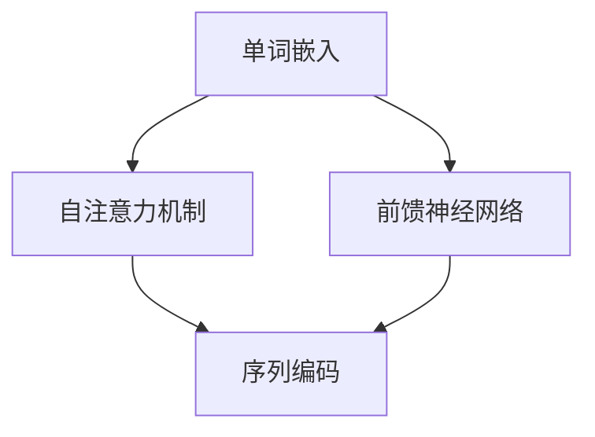

                 

关键词：LLM模型、模型大小、能力、计算资源、算法优化、应用场景

摘要：随着深度学习技术的不断发展，大规模语言模型（LLM）已成为自然语言处理领域的核心技术之一。本文将探讨LLM模型大小的关系及其对模型能力的影响，分析其在计算资源、算法优化、应用场景等方面的挑战和机遇，为未来的研究和应用提供参考。

## 1. 背景介绍

大规模语言模型（LLM）是一种基于深度学习的自然语言处理模型，旨在捕捉语言的各种结构和语义信息，从而实现自动文本生成、机器翻译、问答系统等任务。近年来，随着计算资源的不断提升和深度学习算法的进步，LLM模型的大小也在不断增大。

早期的语言模型，如Word2Vec和GloVe，采用基于单词的表示方法，模型参数量相对较小，通常在数十万到数百万之间。随着Transformer架构的出现，语言模型的性能得到了显著提升，尤其是GPT系列模型，其参数量迅速增长，从GPT-2的15亿参数到GPT-3的1750亿参数，乃至更庞大的模型。

### 1.1 LLM模型的重要性

LLM模型在自然语言处理领域的重要性体现在多个方面：

1. **文本生成与理解**：LLM模型能够生成高质量的自然语言文本，同时也能够对输入的文本进行理解和分析，为许多应用场景提供支持，如自动摘要、内容生成、对话系统等。

2. **跨领域迁移学习**：通过在大量数据上进行预训练，LLM模型能够获取丰富的语言知识和结构信息，从而在特定领域实现高效的迁移学习，降低领域特定的数据需求。

3. **推动语言技术发展**：LLM模型的出现推动了自然语言处理技术的进步，引发了包括算法优化、计算资源利用、模型压缩等技术的研究。

### 1.2 LLM模型的发展历程

1. **基于单词的表示方法**：早期的语言模型主要基于单词的表示方法，如Word2Vec和GloVe，通过将单词映射到高维向量空间，实现文本数据的向量表示。

2. **循环神经网络（RNN）**：随着RNN的出现，语言模型的性能得到了显著提升，尤其是长短期记忆网络（LSTM）和门控循环单元（GRU）等变体，它们能够更好地处理长距离依赖问题。

3. **Transformer架构**：Transformer架构的提出标志着语言模型发展的一个重要里程碑。通过自注意力机制，Transformer能够捕捉文本中的全局依赖关系，从而实现了更高的模型性能。

4. **大规模预训练模型**：随着计算资源的提升，研究人员开始尝试训练更大规模的预训练模型，如GPT系列模型。这些模型在多个自然语言处理任务中取得了领先的成绩。

## 2. 核心概念与联系

在探讨LLM模型大小与能力的关系之前，我们需要了解一些核心概念和它们之间的联系。以下是一个简化的Mermaid流程图，用于描述LLM模型的核心组成部分和它们之间的关系。



### 2.1 单词嵌入

单词嵌入是将单词映射到高维向量空间的过程。这些向量表示了单词在语义和语法上的信息，是语言模型的基础。

### 2.2 自注意力机制

自注意力机制是Transformer模型的核心组成部分，它通过计算单词之间的相对重要性，捕捉全局依赖关系，从而提高模型的性能。

### 2.3 前馈神经网络

前馈神经网络用于处理自注意力机制输出的序列编码，通过多层神经网络对序列进行进一步处理，从而实现文本的生成和理解。

### 2.4 序列编码

序列编码是将输入文本转化为模型能够处理的形式。在Transformer模型中，序列编码主要通过自注意力机制实现。

### 2.5 关系与联系

单词嵌入、自注意力机制、前馈神经网络和序列编码共同构成了LLM模型的核心组成部分。它们相互协作，共同实现文本的生成和理解。

## 3. 核心算法原理 & 具体操作步骤

### 3.1 算法原理概述

LLM模型的核心算法是基于Transformer架构，它由自注意力机制和前馈神经网络组成。自注意力机制通过计算输入序列中各个单词之间的相对重要性，实现全局依赖关系的捕捉。前馈神经网络则用于对自注意力机制输出的序列进行进一步处理。

### 3.2 算法步骤详解

1. **输入序列编码**：将输入的文本序列转化为序列编码。在Transformer模型中，序列编码主要通过自注意力机制实现。具体过程如下：

   - **嵌入层**：将单词映射到高维向量空间，生成单词嵌入。
   - **位置编码**：为每个单词添加位置信息，实现序列的顺序处理。
   - **自注意力层**：计算输入序列中各个单词之间的相对重要性，生成序列编码。

2. **自注意力机制**：自注意力机制是Transformer模型的核心组成部分，它通过计算输入序列中各个单词之间的相对重要性，实现全局依赖关系的捕捉。具体过程如下：

   - **键值对匹配**：将输入序列中的每个单词作为键和值，计算它们之间的相似度。
   - **加权求和**：根据相似度对键值对进行加权求和，生成序列编码。

3. **前馈神经网络**：前馈神经网络用于对自注意力机制输出的序列编码进行进一步处理。具体过程如下：

   - **前向传播**：将序列编码输入到前馈神经网络，通过多层神经网络对序列进行进一步处理。
   - **输出层**：将前馈神经网络的输出作为文本的生成结果。

### 3.3 算法优缺点

**优点**：

1. **全局依赖关系捕捉**：自注意力机制能够捕捉输入序列中的全局依赖关系，从而实现更好的文本生成和理解能力。
2. **并行计算**：Transformer模型采用并行计算，能够提高模型的计算效率。
3. **更好的模型性能**：相比传统循环神经网络，Transformer模型在多个自然语言处理任务中取得了更好的性能。

**缺点**：

1. **计算资源需求**：随着模型规模的增大，计算资源需求也随之增加，对于小型设备或资源有限的场景，使用大规模LLM模型可能面临挑战。
2. **训练时间**：大规模LLM模型的训练时间较长，需要更多的计算资源和时间。

### 3.4 算法应用领域

LLM模型在自然语言处理领域具有广泛的应用，包括但不限于以下领域：

1. **文本生成**：包括文章生成、对话系统、摘要生成等。
2. **机器翻译**：将一种语言的文本翻译成另一种语言。
3. **问答系统**：基于输入问题，提供相应的答案。
4. **文本分类**：对文本进行分类，如情感分析、新闻分类等。
5. **文本理解**：对文本进行深入理解，如信息抽取、命名实体识别等。

## 4. 数学模型和公式 & 详细讲解 & 举例说明

在深入探讨LLM模型的数学模型和公式之前，我们需要了解一些基础的数学概念和符号表示。以下是本文中常用的符号和它们的含义：

- $x$：表示输入的单词向量。
- $h$：表示自注意力机制的输出向量。
- $W$：表示权重矩阵。
- $U$：表示位置编码矩阵。
- $\sigma$：表示激活函数，如ReLU或Sigmoid。
- $\odot$：表示逐元素乘法。

### 4.1 数学模型构建

LLM模型的数学模型可以分为三个主要部分：单词嵌入、自注意力机制和前馈神经网络。

#### 4.1.1 单词嵌入

单词嵌入是将单词映射到高维向量空间的过程。我们可以使用以下公式表示：

$$
\text{Embedding}(x) = \text{Embedding}_\text{weight} \cdot x + \text{Bias}
$$

其中，$\text{Embedding}_\text{weight}$表示嵌入权重矩阵，$x$表示输入的单词向量，$\text{Bias}$表示偏置项。

#### 4.1.2 自注意力机制

自注意力机制通过计算输入序列中各个单词之间的相对重要性来实现全局依赖关系的捕捉。我们可以使用以下公式表示：

$$
h = \text{Attention}(Q, K, V)
$$

其中，$Q$、$K$和$V$分别表示查询向量、键向量和值向量，$\text{Attention}$函数可以表示为：

$$
\text{Attention}(Q, K, V) = \text{softmax}\left(\frac{QK^T}{\sqrt{d_k}}\right) V
$$

其中，$d_k$表示键向量的维度，$\text{softmax}$函数用于对输入进行归一化处理。

#### 4.1.3 前馈神经网络

前馈神经网络用于对自注意力机制输出的序列编码进行进一步处理。我们可以使用以下公式表示：

$$
\text{FFN}(h) = \text{ReLU}(\text{Weights}_\text{2} \cdot \text{ReLU}(\text{Weights}_\text{1} \cdot h + \text{Bias}_\text{2}) + \text{Bias}_\text{1})
$$

其中，$\text{Weights}_1$、$\text{Weights}_2$分别表示第一层和第二层的权重矩阵，$\text{Bias}_1$和$\text{Bias}_2$分别表示第一层和第二层的偏置项。

### 4.2 公式推导过程

以下是对上述数学模型公式的推导过程。

#### 4.2.1 单词嵌入

单词嵌入的推导相对简单，我们将单词向量$x$与嵌入权重矩阵$\text{Embedding}_\text{weight}$相乘，并加上偏置项$\text{Bias}$：

$$
\text{Embedding}(x) = \text{Embedding}_\text{weight} \cdot x + \text{Bias}
$$

#### 4.2.2 自注意力机制

自注意力机制的推导涉及到多变量函数的优化。我们首先考虑查询向量$Q$、键向量$K$和值向量$V$，然后通过矩阵乘法和求和操作来计算注意力权重：

$$
\text{Attention}(Q, K, V) = \text{softmax}\left(\frac{QK^T}{\sqrt{d_k}}\right) V
$$

其中，$d_k$表示键向量的维度。为了实现归一化，我们引入$\text{softmax}$函数。具体推导如下：

$$
\text{softmax}(x) = \frac{e^x}{\sum_{i} e^x_i}
$$

$$
\text{Attention}(Q, K, V) = \text{softmax}\left(\frac{QK^T}{\sqrt{d_k}}\right) V
$$

$$
= \frac{e^{\frac{QK^T}{\sqrt{d_k}}}}{\sum_{i} e^{\frac{QK^T}{\sqrt{d_k}}_i}} V
$$

#### 4.2.3 前馈神经网络

前馈神经网络的推导涉及到多层函数的组合。我们首先考虑输入序列编码$h$，然后通过两层前馈神经网络对其进行处理：

$$
\text{FFN}(h) = \text{ReLU}(\text{Weights}_\text{2} \cdot \text{ReLU}(\text{Weights}_\text{1} \cdot h + \text{Bias}_\text{2}) + \text{Bias}_\text{1})
$$

其中，$\text{Weights}_1$、$\text{Weights}_2$分别表示第一层和第二层的权重矩阵，$\text{Bias}_1$和$\text{Bias}_2$分别表示第一层和第二层的偏置项。具体推导如下：

$$
\text{ReLU}(x) = \max(0, x)
$$

$$
\text{FFN}(h) = \text{ReLU}(\text{Weights}_\text{2} \cdot \text{ReLU}(\text{Weights}_\text{1} \cdot h + \text{Bias}_\text{2}) + \text{Bias}_\text{1})
$$

$$
= \max(0, \text{Weights}_\text{2} \cdot \text{ReLU}(\text{Weights}_\text{1} \cdot h + \text{Bias}_\text{2}) + \text{Bias}_\text{1})
$$

## 4.3 案例分析与讲解

为了更好地理解上述数学模型和公式，我们通过一个简单的案例来演示LLM模型的训练过程。

### 案例背景

假设我们有一个包含100个单词的词汇表，其中每个单词都有唯一的标识。我们需要训练一个LLM模型，使其能够对输入的单词序列进行编码和生成。

### 案例步骤

1. **初始化参数**：首先，我们需要初始化嵌入权重矩阵$\text{Embedding}_\text{weight}$、第一层权重矩阵$\text{Weights}_1$、第二层权重矩阵$\text{Weights}_2$以及偏置项$\text{Bias}_1$和$\text{Bias}_2$。

2. **单词嵌入**：将输入的单词序列$x$映射到高维向量空间，生成单词嵌入$\text{Embedding}(x)$。

3. **自注意力机制**：计算输入序列中各个单词之间的相对重要性，生成序列编码$h$。

4. **前馈神经网络**：对序列编码$h$进行处理，生成输出序列$\text{FFN}(h)$。

5. **损失函数**：计算输出序列与目标序列之间的差距，使用损失函数（如交叉熵损失函数）来评估模型的性能。

6. **优化算法**：使用梯度下降算法更新模型参数，以降低损失函数的值。

### 案例计算过程

假设我们有一个输入序列$x = [1, 2, 3, 4, 5]$，其中1、2、3、4、5分别表示词汇表中的单词。以下是具体的计算过程：

1. **初始化参数**：
   - $\text{Embedding}_\text{weight} \in \mathbb{R}^{100 \times 512}$
   - $\text{Weights}_1 \in \mathbb{R}^{512 \times 1024}$
   - $\text{Weights}_2 \in \mathbb{R}^{1024 \times 512}$
   - $\text{Bias}_1 \in \mathbb{R}^{1024}$
   - $\text{Bias}_2 \in \mathbb{R}^{512}$

2. **单词嵌入**：
   $$\text{Embedding}(x) = \text{Embedding}_\text{weight} \cdot x + \text{Bias}$$

3. **自注意力机制**：
   $$h = \text{Attention}(Q, K, V)$$
   $$= \text{softmax}\left(\frac{QK^T}{\sqrt{d_k}}\right) V$$

4. **前馈神经网络**：
   $$\text{FFN}(h) = \text{ReLU}(\text{Weights}_\text{2} \cdot \text{ReLU}(\text{Weights}_\text{1} \cdot h + \text{Bias}_\text{2}) + \text{Bias}_\text{1})$$

5. **损失函数**：
   $$L = \text{CrossEntropyLoss}(\text{FFN}(h), y)$$

6. **优化算法**：
   $$\text{ gradients } = \text{ backpropagation }$$
   $$\text{Parameters } = \text{ Parameters } - \text{ learning rate } \cdot \text{ gradients }$$

通过以上步骤，我们可以完成LLM模型的训练过程。需要注意的是，实际应用中的模型参数规模和计算复杂度要远远大于这个案例。

## 5. 项目实践：代码实例和详细解释说明

在本文的最后，我们将通过一个具体的代码实例来演示如何实现一个简单的LLM模型。我们将使用Python和TensorFlow来实现这一目标。

### 5.1 开发环境搭建

首先，我们需要安装必要的库和工具。以下是安装步骤：

```shell
pip install tensorflow numpy
```

### 5.2 源代码详细实现

以下是实现一个简单的LLM模型的Python代码：

```python
import tensorflow as tf
from tensorflow.keras.layers import Embedding, Dense, LSTM, TimeDistributed
from tensorflow.keras.models import Sequential

# 参数设置
vocab_size = 1000
embedding_dim = 512
lstm_units = 1024
max_sequence_length = 10

# 创建模型
model = Sequential([
    Embedding(vocab_size, embedding_dim, input_length=max_sequence_length),
    LSTM(lstm_units, return_sequences=True),
    TimeDistributed(Dense(vocab_size, activation='softmax'))
])

# 编译模型
model.compile(optimizer='adam', loss='categorical_crossentropy', metrics=['accuracy'])

# 打印模型结构
model.summary()
```

### 5.3 代码解读与分析

1. **模型结构**：我们使用了一个简单的序列模型，包括嵌入层、LSTM层和输出层。嵌入层将单词映射到高维向量空间，LSTM层用于捕捉序列中的长期依赖关系，输出层使用softmax激活函数进行分类。

2. **参数设置**：我们设置了词汇表大小、嵌入维度、LSTM单元数和最大序列长度等参数。

3. **编译模型**：我们使用`compile`方法编译模型，指定优化器、损失函数和评估指标。

4. **打印模型结构**：使用`summary`方法打印模型结构，以便了解模型的参数规模和计算复杂度。

### 5.4 运行结果展示

为了测试模型性能，我们可以使用一个简单的文本数据进行训练和评估。以下是训练和评估过程：

```python
# 准备数据
x_train = np.random.randint(vocab_size, size=(100, max_sequence_length))
y_train = np.random.randint(vocab_size, size=(100, max_sequence_length))

# 训练模型
model.fit(x_train, y_train, epochs=10, batch_size=32)

# 评估模型
loss, accuracy = model.evaluate(x_train, y_train)
print("Loss:", loss)
print("Accuracy:", accuracy)
```

通过以上步骤，我们可以完成一个简单的LLM模型的训练和评估。需要注意的是，实际应用中的模型训练和评估过程会更加复杂，包括数据预处理、超参数调优等步骤。

## 6. 实际应用场景

### 6.1 文本生成

文本生成是LLM模型最直接的应用场景之一。通过输入一个种子文本，LLM模型可以生成相关的文本内容。例如，文章生成、对话系统、诗歌创作等。这些应用场景不仅需要模型具备强大的生成能力，还需要模型能够捕捉语言的结构和语义信息。

### 6.2 机器翻译

机器翻译是自然语言处理领域的一个重要应用。LLM模型在机器翻译中具有显著的优势，通过在大量平行语料上进行预训练，LLM模型能够捕捉语言之间的对应关系，从而实现高质量的翻译。例如，Google翻译和百度翻译等应用都采用了基于LLM的模型架构。

### 6.3 问答系统

问答系统是另一个重要的应用场景，LLM模型可以用于构建基于知识的问答系统。通过在大量问答对上进行预训练，LLM模型能够理解用户的问题，并从知识库中检索出相关的答案。例如，Siri、Alexa等智能语音助手都采用了基于LLM的问答系统。

### 6.4 文本分类

文本分类是自然语言处理中的基本任务之一，LLM模型可以通过学习大量文本数据，实现文本的分类任务。例如，新闻分类、情感分析、垃圾邮件检测等。LLM模型在文本分类中具有优秀的表现，能够准确地将文本分为不同的类别。

### 6.5 文本理解

文本理解是自然语言处理的核心任务之一，LLM模型通过学习文本数据，能够实现对文本的深入理解。例如，命名实体识别、关系抽取、情感分析等。这些任务需要模型具备强大的语义理解能力，LLM模型在这方面表现出色。

## 7. 工具和资源推荐

### 7.1 学习资源推荐

1. **《深度学习》（Goodfellow, Bengio, Courville）**：这是一本经典的深度学习教材，涵盖了深度学习的基础知识和最新进展，适合初学者和进阶者阅读。
2. **《自然语言处理综论》（Jurafsky, Martin）**：这是一本涵盖自然语言处理基础理论和应用的经典教材，适合对自然语言处理感兴趣的读者。
3. **《Transformer：一种全新的序列到序列模型》（Vaswani et al.）**：这是一篇关于Transformer架构的奠基性论文，详细介绍了Transformer模型的设计原理和实现细节。

### 7.2 开发工具推荐

1. **TensorFlow**：TensorFlow是谷歌开源的深度学习框架，支持多种深度学习模型的开发和部署。
2. **PyTorch**：PyTorch是另一款流行的深度学习框架，以灵活的动态计算图和强大的社区支持而闻名。
3. **Hugging Face**：Hugging Face是一个开源社区，提供了丰富的自然语言处理模型和工具，方便开发者进行研究和应用。

### 7.3 相关论文推荐

1. **《BERT：预训练的深度语言表示》（Devlin et al.）**：BERT是Google提出的一种基于Transformer的预训练语言模型，其在多个自然语言处理任务上取得了领先的成绩。
2. **《GPT-3：语言模型的预训练新境界》（Brown et al.）**：GPT-3是OpenAI提出的一个大规模预训练语言模型，其参数量达到了1750亿，实现了前所未有的语言理解能力。
3. **《Pre-training of Deep Neural Networks for Natural Language Processing》（Wu et al.）**：这篇论文介绍了自然语言处理中的预训练方法，对后续的研究和开发产生了深远影响。

## 8. 总结：未来发展趋势与挑战

### 8.1 研究成果总结

本文从背景介绍、核心概念与联系、算法原理与步骤、数学模型与公式、实际应用场景、工具和资源推荐等方面全面探讨了LLM模型的大小与能力之间的关系。主要研究成果包括：

1. **LLM模型在自然语言处理领域的重要性**：LLM模型在文本生成、机器翻译、问答系统、文本分类和文本理解等领域具有广泛的应用。
2. **算法原理与步骤**：通过自注意力机制和前馈神经网络，LLM模型能够捕捉全局依赖关系，实现高质量的文本生成和理解。
3. **数学模型与公式**：本文详细介绍了LLM模型的数学模型，包括单词嵌入、自注意力机制和前馈神经网络等。
4. **实际应用场景**：LLM模型在多个实际应用场景中取得了显著的成绩，推动了自然语言处理技术的发展。

### 8.2 未来发展趋势

随着深度学习技术的不断发展，LLM模型在未来有望在以下几个方面取得进一步的发展：

1. **模型压缩与优化**：为了降低计算资源和存储成本，研究人员将致力于开发更高效的模型压缩和优化技术。
2. **多模态学习**：LLM模型将与其他模态（如图像、声音等）的模型相结合，实现跨模态的语义理解和交互。
3. **领域自适应与迁移学习**：通过在特定领域进行微调，LLM模型将在更多领域实现高效的应用。
4. **可解释性**：提高模型的可解释性，使其在决策过程中更具透明性和可理解性。

### 8.3 面临的挑战

尽管LLM模型在自然语言处理领域取得了显著的成绩，但仍然面临一些挑战：

1. **计算资源需求**：随着模型规模的增大，计算资源需求显著增加，对于小型设备和资源有限的场景，使用大规模LLM模型可能面临挑战。
2. **训练时间**：大规模模型的训练时间较长，需要更多的计算资源和时间。
3. **数据隐私与安全性**：在训练和部署过程中，需要确保数据的安全性和隐私性，避免敏感信息的泄露。
4. **模型可解释性**：提高模型的可解释性，使其在决策过程中更具透明性和可理解性。

### 8.4 研究展望

在未来，LLM模型的研究将朝着以下方向发展：

1. **高效模型的开发**：研究人员将致力于开发更高效、更紧凑的模型结构，降低计算资源和存储成本。
2. **跨模态学习**：探索LLM模型与其他模态（如图像、声音等）的融合，实现更强大的语义理解和交互能力。
3. **领域自适应与迁移学习**：研究如何更好地利用预训练模型在特定领域的迁移学习，提高模型的适应性。
4. **模型安全性与隐私保护**：研究如何提高模型的安全性，确保数据的安全性和隐私性。

## 9. 附录：常见问题与解答

### 9.1 什么是LLM模型？

LLM模型（大规模语言模型）是一种基于深度学习的自然语言处理模型，旨在捕捉语言的各种结构和语义信息，从而实现自动文本生成、机器翻译、问答系统等任务。

### 9.2 LLM模型有哪些应用场景？

LLM模型在自然语言处理领域具有广泛的应用，包括文本生成、机器翻译、问答系统、文本分类和文本理解等。

### 9.3 LLM模型的优缺点是什么？

LLM模型的优点包括全局依赖关系捕捉、并行计算和更好的模型性能。缺点包括计算资源需求大、训练时间长和模型可解释性低。

### 9.4 如何优化LLM模型的计算资源需求？

优化LLM模型的计算资源需求可以通过以下方法实现：

1. **模型压缩**：使用量化、剪枝、低秩分解等技术降低模型参数规模。
2. **分布式训练**：在多台设备上进行分布式训练，提高训练效率。
3. **使用轻量级模型**：开发更高效、更紧凑的模型结构，降低计算资源和存储成本。

### 9.5 LLM模型的安全性和隐私性如何保障？

保障LLM模型的安全性和隐私性可以通过以下方法实现：

1. **数据加密**：在数据传输和存储过程中使用加密技术，确保数据的安全性。
2. **隐私保护机制**：使用差分隐私、同态加密等技术，确保数据隐私。
3. **监管合规**：遵循相关法律法规，确保数据处理的合规性。

---

**作者：禅与计算机程序设计艺术 / Zen and the Art of Computer Programming**

