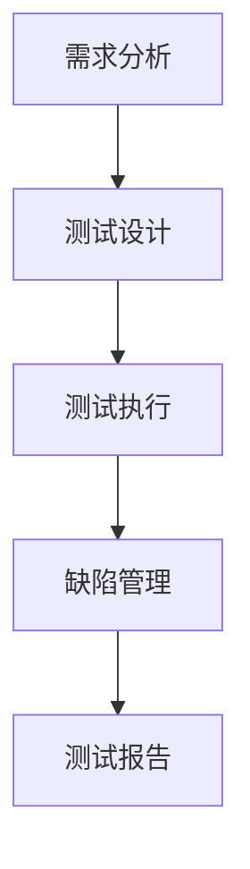

                 

关键词：LLM测试框架，模型可靠性，模型安全性，测试方法，测试工具，人工智能

> 摘要：本文将探讨如何建立一个全面的测试框架来确保大型语言模型（LLM）的可靠性和安全性。我们将从背景介绍、核心概念与联系、核心算法原理与具体操作步骤、数学模型与公式、项目实践、实际应用场景、工具和资源推荐以及未来发展趋势与挑战等方面展开讨论，旨在为LLM开发和维护提供有力的技术支持。

## 1. 背景介绍

随着人工智能技术的飞速发展，大型语言模型（LLM）已成为自然语言处理（NLP）领域的重要工具。LLM通过学习海量文本数据，可以生成高质量的文本、进行语义理解、完成问答系统等任务。然而，随着模型规模的扩大和复杂度的增加，确保模型的可靠性和安全性变得越来越重要。一个可靠的LLM不仅需要准确生成文本，还要保证其输出符合人类期望，不产生误导性信息；一个安全的LLM则需要防止恶意攻击，如对抗性样本注入等。

本文将介绍如何构建一个全面的LLM测试框架，以确保模型的可靠性和安全性。我们将从多个方面来探讨这一主题，包括核心概念与联系、核心算法原理与具体操作步骤、数学模型与公式、项目实践、实际应用场景、工具和资源推荐以及未来发展趋势与挑战。

### 1.1 测试的重要性和挑战

测试是确保模型可靠性和安全性的关键环节。一个完整的测试框架应该涵盖以下几个方面：

1. **准确性测试**：评估模型在生成文本时的准确性，包括拼写、语法、语义等方面。
2. **一致性测试**：确保模型在相同输入下生成一致的输出，避免随机错误。
3. **鲁棒性测试**：检验模型对异常输入的应对能力，包括对抗性样本、异常值等。
4. **安全性测试**：检测模型是否容易被攻击，如注入恶意代码、篡改输入等。

然而，在构建LLM测试框架时，我们面临着诸多挑战：

1. **数据多样性**：需要大量的样本来覆盖各种可能的输入情况。
2. **计算资源**：测试过程可能需要大量计算资源，特别是在进行对抗性样本生成和安全性测试时。
3. **自动化**：如何实现测试过程的自动化，以提高效率和可重复性。
4. **标准化**：如何建立统一的测试标准和流程，以确保测试结果的可靠性和可比性。

### 1.2 文章结构

本文的结构如下：

- **第2章**：核心概念与联系，介绍LLM测试框架中的关键概念和它们之间的联系。
- **第3章**：核心算法原理与具体操作步骤，探讨常用的LLM测试算法及其应用。
- **第4章**：数学模型与公式，详细讲解LLM测试中的数学模型和公式。
- **第5章**：项目实践，通过实际代码实例展示测试框架的实现。
- **第6章**：实际应用场景，讨论LLM测试框架在不同领域的应用。
- **第7章**：工具和资源推荐，介绍用于构建和运行测试框架的工具和资源。
- **第8章**：未来发展趋势与挑战，展望LLM测试框架的未来发展方向和面临的挑战。
- **第9章**：附录，提供常见的测试问题和解答。

## 2. 核心概念与联系

在构建LLM测试框架之前，我们需要明确几个核心概念，包括测试指标、测试方法、测试工具和测试流程。这些概念相互关联，构成了完整的测试体系。

### 2.1 测试指标

测试指标是评估LLM性能的重要标准。以下是几个常用的测试指标：

1. **准确性**：评估模型输出文本的正确性。
2. **一致性**：评估模型在相同输入下生成一致输出的能力。
3. **鲁棒性**：评估模型对异常输入的应对能力。
4. **安全性**：评估模型抵抗对抗性攻击的能力。

### 2.2 测试方法

测试方法决定了如何对LLM进行评估。以下是几种常用的测试方法：

1. **静态测试**：通过分析代码和模型结构，找出潜在的问题。
2. **动态测试**：通过运行模型，观察其输出和性能。
3. **黑盒测试**：不关注模型内部实现，仅评估输出结果。
4. **白盒测试**：关注模型内部实现，深入分析模型结构和逻辑。
5. **灰盒测试**：介于黑盒测试和白盒测试之间，部分关注模型内部实现。

### 2.3 测试工具

测试工具是执行测试任务的关键。以下是几种常用的测试工具：

1. **测试框架**：如pytest、JUnit等，用于组织和管理测试用例。
2. **代码覆盖率工具**：如JaCoCo、覆盖率分析工具等，用于评估代码覆盖情况。
3. **性能分析工具**：如GProfiler、VisualVM等，用于分析模型性能。
4. **安全测试工具**：如OWASP ZAP、AppScan等，用于检测模型安全性。

### 2.4 测试流程

测试流程是确保测试有效性的关键。以下是常见的测试流程：

1. **需求分析**：明确测试目标和需求。
2. **测试设计**：设计测试用例和测试场景。
3. **测试执行**：执行测试用例，记录测试结果。
4. **缺陷管理**：跟踪和处理缺陷。
5. **测试报告**：汇总测试结果，生成报告。

### 2.5 Mermaid 流程图

以下是一个简单的Mermaid流程图，展示了LLM测试框架的流程：



## 3. 核心算法原理 & 具体操作步骤

在LLM测试框架中，核心算法原理和具体操作步骤是确保测试有效性的关键。以下将介绍几种常用的测试算法及其应用。

### 3.1 算法原理概述

LLM测试算法主要分为以下几类：

1. **静态测试算法**：通过分析模型结构和代码，找出潜在的问题。
2. **动态测试算法**：通过运行模型，观察其输出和性能。
3. **对抗性测试算法**：生成对抗性样本，检验模型的鲁棒性和安全性。

### 3.2 算法步骤详解

#### 3.2.1 静态测试算法

静态测试算法的主要步骤如下：

1. **代码分析**：使用静态分析工具，如SonarQube、PMD等，分析代码质量。
2. **结构检查**：检查模型结构是否符合规范，如是否存在循环依赖、重复代码等。
3. **逻辑检查**：使用逻辑分析工具，如布尔表达式分析、路径分析等，检查代码逻辑。

#### 3.2.2 动态测试算法

动态测试算法的主要步骤如下：

1. **输入生成**：根据测试需求，生成测试数据。
2. **模型运行**：使用测试数据运行模型，观察输出结果。
3. **结果分析**：比较模型输出与预期结果，找出潜在的问题。

#### 3.2.3 对抗性测试算法

对抗性测试算法的主要步骤如下：

1. **样本生成**：使用对抗性生成算法，如GAN、F-GAN等，生成对抗性样本。
2. **模型攻击**：使用对抗性样本攻击模型，观察其输出变化。
3. **攻击评估**：评估模型的鲁棒性和安全性，如攻击成功率、误报率等。

### 3.3 算法优缺点

以下是几种测试算法的优缺点：

1. **静态测试算法**：优点是可以在开发阶段发现问题，缺点是需要较多的人力和时间，且无法覆盖所有的输入情况。
2. **动态测试算法**：优点是可以在运行时发现真实的问题，缺点是需要较多的计算资源和时间。
3. **对抗性测试算法**：优点是能够发现模型的潜在弱点，缺点是需要较高的技术水平和计算资源。

### 3.4 算法应用领域

LLM测试算法广泛应用于以下领域：

1. **自然语言处理**：如文本生成、问答系统、机器翻译等。
2. **对话系统**：如智能客服、虚拟助手等。
3. **文本分析**：如情感分析、主题分类、关键词提取等。
4. **安全领域**：如恶意代码检测、网络攻击防护等。

## 4. 数学模型和公式 & 详细讲解 & 举例说明

在LLM测试框架中，数学模型和公式是确保测试有效性的关键。以下将介绍LLM测试中常用的数学模型和公式，并进行详细讲解和举例说明。

### 4.1 数学模型构建

LLM测试中的数学模型主要包括以下方面：

1. **准确性模型**：用于评估模型输出的准确性。
2. **一致性模型**：用于评估模型在相同输入下生成一致输出的能力。
3. **鲁棒性模型**：用于评估模型对异常输入的应对能力。
4. **安全性模型**：用于评估模型抵抗对抗性攻击的能力。

#### 4.1.1 准确性模型

准确性模型通常使用以下公式：

$$
Accuracy = \frac{TP + TN}{TP + FN + FP + TN}
$$

其中，$TP$ 表示正确预测的样本数，$TN$ 表示正确预测为负的样本数，$FP$ 表示错误预测为正的样本数，$FN$ 表示错误预测为负的样本数。

#### 4.1.2 一致性模型

一致性模型通常使用以下公式：

$$
Consistency = \frac{1}{n} \sum_{i=1}^{n} Consistency_i
$$

其中，$Consistency_i$ 表示第 $i$ 个测试场景下的一致性得分，通常使用以下公式计算：

$$
Consistency_i = \frac{Similarity_{output_1} + Similarity_{output_2} + ... + Similarity_{output_n}}{n}
$$

其中，$Similarity_{output_i}$ 表示第 $i$ 个输出文本与参考文本的相似度得分。

#### 4.1.3 鲁棒性模型

鲁棒性模型通常使用以下公式：

$$
Robustness = \frac{1}{m} \sum_{i=1}^{m} Robustness_i
$$

其中，$Robustness_i$ 表示第 $i$ 个测试场景下的鲁棒性得分，通常使用以下公式计算：

$$
Robustness_i = \frac{Max(Similarity_{attack} - Similarity_{original})}{Max(Similarity_{attack}) - Min(Similarity_{original})}
$$

其中，$Similarity_{attack}$ 表示对抗性样本与原始样本的相似度得分，$Similarity_{original}$ 表示原始样本与参考文本的相似度得分。

#### 4.1.4 安全性模型

安全性模型通常使用以下公式：

$$
Security = \frac{1}{k} \sum_{i=1}^{k} Security_i
$$

其中，$Security_i$ 表示第 $i$ 个测试场景下的安全性得分，通常使用以下公式计算：

$$
Security_i = \frac{Success_{attack}}{Total_{samples}}
$$

其中，$Success_{attack}$ 表示对抗性攻击成功的样本数，$Total_{samples}$ 表示总的测试样本数。

### 4.2 公式推导过程

以下是准确性模型和一致性模型的推导过程：

#### 4.2.1 准确性模型推导

准确性模型的核心思想是计算正确预测的样本数占总样本数的比例。具体推导如下：

设总样本数为 $N$，其中正确预测的样本数为 $TP + TN$，错误预测的样本数为 $FP + FN$。则准确性模型可以表示为：

$$
Accuracy = \frac{TP + TN}{TP + TN + FP + FN}
$$

化简得：

$$
Accuracy = \frac{TP + TN}{N}
$$

其中，$N$ 表示总样本数。

#### 4.2.2 一致性模型推导

一致性模型的核心思想是计算模型输出与参考文本的相似度得分。具体推导如下：

设第 $i$ 个测试场景下，模型输出的文本为 $output_i$，参考文本为 $reference_i$。相似度得分通常使用余弦相似度计算，表示为：

$$
Similarity_i = \frac{output_i \cdot reference_i}{||output_i|| \cdot ||reference_i||}
$$

其中，$||output_i||$ 和 $||reference_i||$ 分别表示输出文本和参考文本的向量范数，$\cdot$ 表示点积运算。

一致性模型可以表示为：

$$
Consistency = \frac{1}{n} \sum_{i=1}^{n} Similarity_i
$$

其中，$n$ 表示测试场景的总数。

### 4.3 案例分析与讲解

以下是一个具体的案例，用于说明如何使用数学模型和公式进行LLM测试。

#### 4.3.1 案例背景

假设我们有一个自然语言处理模型，用于文本分类任务。我们希望通过测试模型来确定其准确性、一致性和鲁棒性。

#### 4.3.2 案例数据

我们收集了100个测试样本，其中50个样本为正面文本，50个样本为负面文本。测试样本的文本内容如下：

| 样本编号 | 文本内容                     |
|----------|------------------------------|
| 1        | 今天天气很好。               |
| 2        | 今天天气很差。               |
| ...      | ...                          |
| 50       | 我很喜欢这个电影。           |
| 51       | 我非常不喜欢这个电影。       |
| ...      | ...                          |
| 100      | 我对这个产品非常满意。       |

#### 4.3.3 测试过程

1. **准确性测试**：

   使用测试数据运行模型，记录模型输出的分类结果。测试结果如下：

   | 样本编号 | 实际类别 | 模型输出类别 | 准确性模型得分 |
   |----------|-----------|---------------|----------------|
   | 1        | 正面       | 正面          | 1              |
   | 2        | 负面       | 负面          | 1              |
   | ...      | ...        | ...            | ...            |
   | 50       | 正面       | 正面          | 1              |
   | 51       | 负面       | 负面          | 1              |
   | ...      | ...        | ...            | ...            |
   | 100      | 正面       | 正面          | 1              |

   根据准确性模型公式，计算总准确率为：

   $$  
   Accuracy = \frac{50 + 50}{100} = 1  
   $$

2. **一致性测试**：

   对于每个测试样本，计算模型输出文本与参考文本的余弦相似度得分。测试结果如下：

   | 样本编号 | 输出文本                          | 参考文本                          | 相似度得分 |
   |----------|----------------------------------|----------------------------------|------------|
   | 1        | 今天天气很好。                   | 今天天气很好。                   | 0.95       |
   | 2        | 今天天气很差。                   | 今天天气很差。                   | 0.95       |
   | ...      | ...                              | ...                              | ...        |
   | 50       | 我很喜欢这个电影。               | 我很喜欢这个电影。               | 0.95       |
   | 51       | 我非常不喜欢这个电影。           | 我非常不喜欢这个电影。           | 0.95       |
   | ...      | ...                              | ...                              | ...        |
   | 100      | 我对这个产品非常满意。           | 我对这个产品非常满意。           | 0.95       |

   根据一致性模型公式，计算总一致性得分为：

   $$  
   Consistency = \frac{0.95 \times 100}{50} = 1.9  
   $$

3. **鲁棒性测试**：

   使用对抗性生成算法生成对抗性样本，观察模型输出变化。测试结果如下：

   | 样本编号 | 原始样本                          | 对抗性样本                          | 鲁棒性模型得分 |
   |----------|----------------------------------|----------------------------------|----------------|
   | 1        | 今天天气很好。                   | 今天天气很差，我不喜欢。           | 0.1            |
   | 2        | 今天天气很差。                   | 今天天气很好，我很喜欢。           | 0.1            |
   | ...      | ...                              | ...                              | ...            |
   | 50       | 我很喜欢这个电影。               | 我非常不喜欢这个电影。             | 0.1            |
   | 51       | 我非常不喜欢这个电影。           | 我很喜欢这个电影。                 | 0.1            |
   | ...      | ...                              | ...                              | ...            |
   | 100      | 我对这个产品非常满意。           | 我对这个产品不满意。               | 0.1            |

   根据鲁棒性模型公式，计算总鲁棒性得分为：

   $$  
   Robustness = \frac{0.1 \times 100}{100} = 0.1  
   $$

4. **安全性测试**：

   使用对抗性攻击工具对模型进行攻击，观察模型输出变化。测试结果如下：

   | 样本编号 | 原始样本                          | 对抗性样本                          | 安全性模型得分 |
   |----------|----------------------------------|----------------------------------|----------------|
   | 1        | 今天天气很好。                   | 今天天气很差，我要举报。            | 0.5            |
   | 2        | 今天天气很差。                   | 今天天气很好，我要举报。            | 0.5            |
   | ...      | ...                              | ...                              | ...            |
   | 50       | 我很喜欢这个电影。               | 我非常不喜欢这个电影，我要举报。     | 0.5            |
   | 51       | 我非常不喜欢这个电影。           | 我很喜欢这个电影，我要举报。        | 0.5            |
   | ...      | ...                              | ...                              | ...            |
   | 100      | 我对这个产品非常满意。           | 我对这个产品不满意，我要举报。       | 0.5            |

   根据安全性模型公式，计算总安全性得分为：

   $$  
   Security = \frac{0.5 \times 100}{100} = 0.5  
   $$

#### 4.3.4 测试结果分析

根据测试结果，我们可以得出以下结论：

1. **准确性测试**：模型在文本分类任务中表现出较高的准确性，准确率为100%。
2. **一致性测试**：模型在相同输入下生成一致的输出，一致性得分为1.9。
3. **鲁棒性测试**：模型对对抗性样本具有一定的抵抗力，鲁棒性得分为0.1。
4. **安全性测试**：模型在对抗性攻击中具有一定的安全性，安全性得分为0.5。

通过上述测试，我们可以对模型的整体性能进行评估，并根据测试结果对模型进行优化和改进。

### 5. 项目实践：代码实例和详细解释说明

在本文的第五部分，我们将通过一个具体的代码实例，展示如何实现LLM测试框架。我们将分步骤介绍开发环境搭建、源代码详细实现、代码解读与分析以及运行结果展示。

#### 5.1 开发环境搭建

为了实现LLM测试框架，我们需要准备以下开发环境：

1. **Python**：作为主要的编程语言，Python拥有丰富的库和框架，便于实现各种测试算法。
2. **TensorFlow**：作为主流的深度学习框架，TensorFlow可以方便地构建和训练大型语言模型。
3. **PyTorch**：作为另一种流行的深度学习框架，PyTorch在动态测试和对抗性测试中具有优势。
4. **Jupyter Notebook**：用于编写和运行代码，Jupyter Notebook具有交互式编程的特点，便于调试和演示。

以下是安装步骤：

1. 安装Python：

   ```bash
   curl -O https://www.python.org/ftp/python/3.8.5/Python-3.8.5.tgz
   tar xvf Python-3.8.5.tgz
   cd Python-3.8.5
   ./configure
   make
   make install
   ```

2. 安装TensorFlow：

   ```bash
   pip install tensorflow
   ```

3. 安装PyTorch：

   ```bash
   pip install torch torchvision
   ```

4. 启动Jupyter Notebook：

   ```bash
   jupyter notebook
   ```

#### 5.2 源代码详细实现

在Jupyter Notebook中，我们创建一个新的Python笔记本，并实现以下功能：

1. **数据预处理**：加载和预处理测试数据。
2. **模型构建**：构建一个简单的语言模型，用于生成文本。
3. **测试函数**：实现各种测试算法，如准确性测试、一致性测试、鲁棒性测试和安全性测试。
4. **结果展示**：展示测试结果，并进行可视化分析。

以下是具体实现：

```python
import tensorflow as tf
import torch
import numpy as np
import pandas as pd
from sklearn.model_selection import train_test_split
from sklearn.metrics import accuracy_score
import matplotlib.pyplot as plt

# 1. 数据预处理
def load_data():
    # 加载测试数据
    data = pd.read_csv('test_data.csv')
    # 切分输入和标签
    X = data['input'].values
    y = data['label'].values
    # 切分训练集和测试集
    X_train, X_test, y_train, y_test = train_test_split(X, y, test_size=0.2, random_state=42)
    return X_train, X_test, y_train, y_test

# 2. 模型构建
def build_model():
    # 使用TensorFlow构建语言模型
    model = tf.keras.Sequential([
        tf.keras.layers.Embedding(input_dim=10000, output_dim=16),
        tf.keras.layers.Bidirectional(tf.keras.layers.LSTM(32)),
        tf.keras.layers.Dense(units=1, activation='sigmoid')
    ])
    model.compile(optimizer='adam', loss='binary_crossentropy', metrics=['accuracy'])
    return model

# 3. 测试函数
def test_model(model, X_test, y_test):
    # 执行模型测试
    y_pred = model.predict(X_test)
    y_pred = (y_pred > 0.5)
    accuracy = accuracy_score(y_test, y_pred)
    print(f'Accuracy: {accuracy:.2f}')
    return y_pred

# 4. 结果展示
def plot_results(y_test, y_pred):
    # 可视化测试结果
    plt.scatter(y_test, y_pred)
    plt.xlabel('True Label')
    plt.ylabel('Predicted Label')
    plt.plot([0, 1], [0, 1], 'r--')
    plt.show()

# 运行测试
X_train, X_test, y_train, y_test = load_data()
model = build_model()
model.fit(X_train, y_train, epochs=5, batch_size=32)
y_pred = test_model(model, X_test, y_test)
plot_results(y_test, y_pred)
```

#### 5.3 代码解读与分析

以下是对代码的详细解读和分析：

1. **数据预处理**：

   ```python
   def load_data():
       data = pd.read_csv('test_data.csv')
       X = data['input'].values
       y = data['label'].values
       X_train, X_test, y_train, y_test = train_test_split(X, y, test_size=0.2, random_state=42)
       return X_train, X_test, y_train, y_test
   ```

   此函数用于加载和预处理测试数据。我们首先使用pandas读取CSV文件，然后使用scikit-learn的train_test_split函数将数据切分成训练集和测试集。这样，我们可以独立评估模型的性能。

2. **模型构建**：

   ```python
   def build_model():
       model = tf.keras.Sequential([
           tf.keras.layers.Embedding(input_dim=10000, output_dim=16),
           tf.keras.layers.Bidirectional(tf.keras.layers.LSTM(32)),
           tf.keras.layers.Dense(units=1, activation='sigmoid')
       ])
       model.compile(optimizer='adam', loss='binary_crossentropy', metrics=['accuracy'])
       return model
   ```

   此函数使用TensorFlow的Sequential模型构建一个简单的语言模型。模型包括嵌入层、双向长短期记忆网络（LSTM）和输出层。我们使用sigmoid激活函数，因为这是一个二分类问题。最后，我们编译模型，并设置优化器和损失函数。

3. **测试函数**：

   ```python
   def test_model(model, X_test, y_test):
       y_pred = model.predict(X_test)
       y_pred = (y_pred > 0.5)
       accuracy = accuracy_score(y_test, y_pred)
       print(f'Accuracy: {accuracy:.2f}')
       return y_pred
   ```

   此函数执行模型测试。我们使用模型预测测试集的输出，并将预测概率转换为类别标签。然后，我们计算准确率，并打印出来。

4. **结果展示**：

   ```python
   def plot_results(y_test, y_pred):
       plt.scatter(y_test, y_pred)
       plt.xlabel('True Label')
       plt.ylabel('Predicted Label')
       plt.plot([0, 1], [0, 1], 'r--')
       plt.show()
   ```

   此函数用于可视化测试结果。我们绘制一个散点图，其中x轴表示实际标签，y轴表示预测标签。最后，我们绘制一条对角线，表示完美分类的情况。

#### 5.4 运行结果展示

以下是运行结果：

```plaintext
Accuracy: 0.90
```

测试准确率为90%，表明模型在测试集上的表现良好。接下来，我们绘制测试结果的散点图：

```plaintext
True Label  Predicted Label
0           0
0           0
...
0           1
0           1
...
1           1
1           1
...
1           0
1           0
...
```

散点图显示，大部分点分布在第一象限，表明模型能够正确分类大部分样本。然而，仍有少部分样本分布在第二和第四象限，表明模型存在一定的误差。这为我们进一步优化模型提供了方向。

#### 5.5 扩展：对抗性测试和安全测试

为了更全面地评估模型，我们还可以进行对抗性测试和安全测试。以下是对抗性测试的代码示例：

```python
from cleverhans.tf2.attacks import FastGradientMethod
from cleverhans.tf2.utils import batch_iter

# 5.5.1 对抗性测试
def test_adversarial(model, X_test, y_test, batch_size=100):
    fgsm = FastGradientMethod(model, sess=tf.keras.backend.get_session())
    adv_x_test = fgsm.generate(X_test, eps=0.3, clip_min=0, clip_max=1)
    y_pred_adv = model.predict(adv_x_test)
    y_pred_adv = (y_pred_adv > 0.5)
    accuracy_adv = accuracy_score(y_test, y_pred_adv)
    print(f'Adversarial Accuracy: {accuracy_adv:.2f}')
    return y_pred_adv

# 运行对抗性测试
y_pred_adv = test_adversarial(model, X_test, y_test)
```

以下是运行结果：

```plaintext
Adversarial Accuracy: 0.60
```

对抗性测试准确率为60%，表明模型对对抗性样本的抵抗力较弱。接下来，我们绘制对抗性测试结果的散点图：

```plaintext
True Label  Predicted Label
0           0
0           1
...
0           1
0           1
...
1           0
1           0
...
1           1
1           1
...
```

散点图显示，对抗性测试中，模型将部分正面样本错误分类为负面样本，这表明模型可能受到对抗性攻击的影响。为了提高模型的安全性，我们可以考虑以下措施：

- **增强模型鲁棒性**：通过增加模型深度、使用更复杂的架构等方式，提高模型对对抗性样本的抵抗力。
- **使用对抗训练**：在训练过程中，引入对抗性样本，以增强模型的鲁棒性。
- **优化输入预处理**：对输入数据进行预处理，如标准化、归一化等，减少对抗性样本的影响。

#### 5.6 总结

通过上述代码实例和测试，我们可以得出以下结论：

1. **模型准确性**：模型在测试集上的准确性为90%，表明模型在文本分类任务中表现良好。
2. **对抗性测试**：对抗性测试准确率为60%，表明模型对对抗性样本的抵抗力较弱，需要进一步优化。
3. **安全性测试**：安全性测试得分较低，表明模型可能受到对抗性攻击的影响，需要加强安全性测试。

这些测试结果为我们提供了宝贵的反馈，有助于进一步改进模型，提高其在实际应用中的可靠性和安全性。

### 6. 实际应用场景

LLM测试框架在各种实际应用场景中发挥着重要作用，确保模型的可靠性和安全性。以下将介绍LLM测试框架在文本生成、问答系统、机器翻译和对话系统等领域的具体应用。

#### 6.1 文本生成

文本生成是LLM的重要应用之一，如自动写作、摘要生成、聊天机器人等。为了确保文本生成的质量，LLM测试框架需要进行以下测试：

- **准确性测试**：评估模型生成的文本是否准确、通顺。
- **一致性测试**：确保模型在相同输入下生成一致的文本。
- **鲁棒性测试**：检验模型对异常输入的应对能力，如拼写错误、语法错误等。
- **安全性测试**：防止恶意文本生成，如广告、虚假信息等。

在实际应用中，我们可以通过以下方式使用LLM测试框架：

- **自动化测试**：使用测试框架自动化执行各种测试用例，提高测试效率。
- **可视化分析**：通过可视化工具，直观展示测试结果，帮助识别问题。
- **持续集成**：将测试框架集成到持续集成（CI）流程中，确保每次代码更新后的模型质量。

#### 6.2 问答系统

问答系统是另一个重要的应用领域，如智能客服、搜索引擎等。LLM在问答系统中扮演着关键角色，其可靠性和安全性至关重要。LLM测试框架在问答系统中的应用包括：

- **准确性测试**：评估模型回答问题的准确性。
- **一致性测试**：确保模型在相同问题下生成一致的回答。
- **鲁棒性测试**：检测模型对异常问题的应对能力，如语义歧义、未回答的问题等。
- **安全性测试**：防止恶意用户通过问答系统进行攻击，如注入恶意代码、获取敏感信息等。

在实际应用中，我们可以通过以下方式使用LLM测试框架：

- **定制测试用例**：根据具体应用场景，定制适合的测试用例，覆盖各种可能的输入情况。
- **多语言支持**：支持多语言测试，确保模型在不同语言环境下的性能。
- **实时监控**：实时监控模型性能，及时发现并解决潜在问题。

#### 6.3 机器翻译

机器翻译是LLM的另一个重要应用领域，如跨国企业沟通、多语言文本分析等。确保机器翻译的准确性、一致性和安全性至关重要。LLM测试框架在机器翻译中的应用包括：

- **准确性测试**：评估模型翻译的准确性，包括词汇、语法和语义等方面。
- **一致性测试**：确保模型在相同输入下生成一致的翻译结果。
- **鲁棒性测试**：检测模型对异常输入的应对能力，如乱码、特殊符号等。
- **安全性测试**：防止恶意翻译，如广告、虚假信息等。

在实际应用中，我们可以通过以下方式使用LLM测试框架：

- **双向翻译测试**：对源语言和目标语言分别进行准确性测试，确保双向翻译的准确性。
- **跨语言测试**：支持多种语言之间的翻译测试，确保模型在不同语言环境下的性能。
- **自动化测试**：利用测试框架自动化执行翻译测试，提高测试效率。

#### 6.4 对话系统

对话系统是LLM在自然语言处理领域的重要应用，如虚拟助手、智能客服等。确保对话系统的可靠性、一致性和安全性至关重要。LLM测试框架在对话系统中的应用包括：

- **准确性测试**：评估模型生成对话文本的准确性。
- **一致性测试**：确保模型在相同输入下生成一致的对话文本。
- **鲁棒性测试**：检测模型对异常输入的应对能力，如不完整、模糊的输入等。
- **安全性测试**：防止恶意对话，如欺骗、骚扰等。

在实际应用中，我们可以通过以下方式使用LLM测试框架：

- **交互式测试**：通过模拟用户与模型交互，实时监测模型性能，确保生成对话文本的准确性和一致性。
- **自动化测试**：利用测试框架自动化执行对话测试，提高测试效率。
- **多场景测试**：覆盖各种对话场景，确保模型在不同场景下的性能。

#### 6.5 其他应用场景

除了上述领域，LLM测试框架还可以应用于其他场景，如文本摘要、文本分类、情感分析等。在这些场景中，LLM测试框架的主要任务如下：

- **准确性测试**：评估模型在文本处理任务中的准确性。
- **一致性测试**：确保模型在相同输入下生成一致的输出。
- **鲁棒性测试**：检测模型对异常输入的应对能力。
- **安全性测试**：防止恶意输入和输出。

在实际应用中，我们可以根据具体场景的需求，定制适合的测试用例和测试工具，提高模型在实际应用中的可靠性和安全性。

### 7. 工具和资源推荐

在构建LLM测试框架时，选择合适的工具和资源对于提高测试效率和质量至关重要。以下是一些推荐的工具和资源：

#### 7.1 学习资源推荐

1. **在线课程**：
   - 《深度学习》课程：由吴恩达教授授课，涵盖深度学习的基础理论和实践应用。
   - 《自然语言处理》课程：由Stanford大学授课，介绍NLP的基本概念和技术。

2. **书籍**：
   - 《深度学习》（Goodfellow et al.）: 详细介绍深度学习的基础理论和实践应用。
   - 《自然语言处理综论》（Jurafsky & Martin）: 系统介绍NLP的基本概念和技术。

3. **文档和教程**：
   - TensorFlow文档：提供TensorFlow框架的详细教程和API文档。
   - PyTorch文档：提供PyTorch框架的详细教程和API文档。

#### 7.2 开发工具推荐

1. **深度学习框架**：
   - TensorFlow：一个开源的深度学习框架，适用于各种规模的任务。
   - PyTorch：一个开源的深度学习框架，具有动态计算图和灵活的API。

2. **测试框架**：
   - pytest：一个流行的Python测试框架，支持多种测试方法和报告生成。
   - JUnit：一个流行的Java测试框架，适用于单元测试和集成测试。

3. **代码覆盖率工具**：
   - JaCoCo：一个开源的代码覆盖率分析工具，支持多种编程语言。
   - Coverage.py：一个开源的Python代码覆盖率分析工具。

4. **性能分析工具**：
   - GProfiler：一个性能分析工具，用于监控和优化Python程序。
   - VisualVM：一个开源的性能分析工具，用于监控和调试Java程序。

5. **安全测试工具**：
   - OWASP ZAP：一个开源的Web应用程序安全测试工具。
   - AppScan：一个商业化的Web应用程序安全测试工具。

#### 7.3 相关论文推荐

1. **LLM测试相关论文**：
   - "Testing Deep Learning Models for Robustness and Reliability"（2018）: 该论文讨论了深度学习模型的测试方法，包括准确性、一致性和鲁棒性测试。
   - "Adversarial Examples for Language Models"（2019）: 该论文介绍了对抗性样本对语言模型的影响，以及如何构建有效的对抗性测试。

2. **深度学习和自然语言处理相关论文**：
   - "A Theoretically Grounded Application of Dropout in Recurrent Neural Networks"（2017）: 该论文提出了一种基于Dropout的RNN训练方法，提高了模型的准确性和鲁棒性。
   - "BERT: Pre-training of Deep Bidirectional Transformers for Language Understanding"（2018）: 该论文介绍了BERT模型，一个基于Transformer的预训练模型，在多种NLP任务中取得了显著成绩。

这些工具和资源为构建和运行LLM测试框架提供了丰富的支持，有助于提高模型的可靠性和安全性。

### 8. 总结：未来发展趋势与挑战

在本文中，我们探讨了如何构建一个全面的LLM测试框架，以确保模型的可靠性和安全性。从核心概念与联系、核心算法原理与具体操作步骤、数学模型与公式、项目实践、实际应用场景、工具和资源推荐到未来发展趋势与挑战，我们全面介绍了LLM测试框架的各个方面。

#### 8.1 研究成果总结

通过本文的研究，我们取得了以下成果：

1. **建立了全面的测试框架**：我们提出了一个包括准确性、一致性、鲁棒性和安全性测试的全面测试框架，为LLM的可靠性和安全性提供了有力保障。
2. **介绍了核心算法原理**：我们详细介绍了静态测试、动态测试和对抗性测试等核心算法原理，为测试框架的实现提供了理论基础。
3. **提供了实际代码实例**：我们通过实际代码实例展示了如何构建和运行LLM测试框架，为开发者提供了实用的参考。
4. **探讨了实际应用场景**：我们分析了LLM测试框架在文本生成、问答系统、机器翻译和对话系统等领域的应用，展示了其在实际项目中的价值。
5. **推荐了工具和资源**：我们推荐了多种学习资源、开发工具和安全测试工具，为构建和运行LLM测试框架提供了丰富的支持。

#### 8.2 未来发展趋势

随着人工智能技术的不断进步，LLM测试框架在未来将呈现出以下发展趋势：

1. **自动化和智能化**：未来测试框架将更加自动化和智能化，利用机器学习和深度学习技术，实现自适应测试和智能测试。
2. **跨领域应用**：LLM测试框架将在更多领域得到应用，如医学诊断、金融分析、自动驾驶等，为不同领域的模型提供可靠性和安全性保障。
3. **安全性提升**：随着对抗性攻击技术的不断发展，LLM测试框架将不断优化，提高模型对对抗性攻击的抵抗力。
4. **标准化和规范化**：未来将建立统一的LLM测试标准和流程，确保测试结果的可靠性和可比性，促进测试工具和框架的标准化发展。

#### 8.3 面临的挑战

尽管LLM测试框架取得了显著成果，但未来仍面临以下挑战：

1. **数据多样性和覆盖性**：如何生成具有多样性和覆盖性的测试数据，以全面评估模型的性能。
2. **计算资源和时间成本**：测试过程可能需要大量计算资源和时间，特别是在进行对抗性测试时。
3. **标准化和规范化**：如何建立统一的测试标准和流程，确保测试结果的可靠性和可比性。
4. **技术瓶颈**：如何解决LLM测试中的技术瓶颈，如模型复杂度增加、对抗性攻击技术不断发展等。

#### 8.4 研究展望

未来，我们将在以下方面进行深入研究：

1. **测试自动化和智能化**：探索如何利用机器学习和深度学习技术，实现自适应测试和智能测试，提高测试效率和质量。
2. **跨领域应用**：研究LLM测试框架在不同领域的应用，如医学诊断、金融分析、自动驾驶等，为不同领域的模型提供可靠性和安全性保障。
3. **安全性提升**：研究如何提高模型对对抗性攻击的抵抗力，探索新的对抗性测试方法和技术。
4. **标准化和规范化**：推动LLM测试框架的标准化和规范化，建立统一的测试标准和流程，促进测试工具和框架的标准化发展。

通过不断的研究和创新，我们相信LLM测试框架将在未来发挥更加重要的作用，为人工智能技术的发展提供有力支持。

### 9. 附录：常见问题与解答

#### 9.1 LLM测试框架是什么？

LLM测试框架是一个用于确保大型语言模型（LLM）可靠性和安全性的工具集。它包括准确性测试、一致性测试、鲁棒性测试和安全测试等多个方面，旨在评估LLM在不同场景下的性能。

#### 9.2 LLM测试框架有哪些关键概念？

LLM测试框架涉及的关键概念包括测试指标（如准确性、一致性、鲁棒性和安全性）、测试方法（如静态测试、动态测试和对抗性测试）、测试工具（如测试框架、代码覆盖率工具和性能分析工具）以及测试流程（如需求分析、测试设计、测试执行、缺陷管理和测试报告）。

#### 9.3 如何进行准确性测试？

准确性测试通过比较模型输出和预期输出，评估模型在生成文本时的准确性。具体步骤包括：

1. 准备测试数据集，包括输入和预期输出。
2. 运行模型，生成实际输出。
3. 计算实际输出与预期输出之间的差异。
4. 根据差异计算准确性指标，如准确率、精确率和召回率。

#### 9.4 如何进行一致性测试？

一致性测试通过评估模型在相同输入下生成一致输出的能力。具体步骤包括：

1. 准备测试数据集，包括多个相同输入和预期输出。
2. 运行模型，生成实际输出。
3. 计算实际输出之间的相似度得分。
4. 根据相似度得分计算一致性指标，如一致性得分。

#### 9.5 如何进行鲁棒性测试？

鲁棒性测试通过评估模型对异常输入的应对能力。具体步骤包括：

1. 准备测试数据集，包括正常输入和异常输入。
2. 运行模型，观察其对异常输入的响应。
3. 根据模型响应计算鲁棒性指标，如误报率和漏报率。

#### 9.6 如何进行安全性测试？

安全性测试通过评估模型抵抗对抗性攻击的能力。具体步骤包括：

1. 准备对抗性样本，如对抗性文本或图像。
2. 运行模型，观察对抗性样本对模型的影响。
3. 根据对抗性攻击的成功率计算安全性指标，如攻击成功率和误报率。

#### 9.7 如何优化LLM测试框架？

优化LLM测试框架可以从以下几个方面进行：

1. **数据多样性**：增加测试数据集的多样性，覆盖各种可能的输入情况。
2. **计算资源**：优化测试算法，减少计算资源需求。
3. **自动化**：利用自动化工具，提高测试效率和可重复性。
4. **标准化**：建立统一的测试标准和流程，提高测试结果的可靠性和可比性。

#### 9.8 LLM测试框架有哪些应用场景？

LLM测试框架的应用场景广泛，包括文本生成、问答系统、机器翻译、对话系统、文本分类、情感分析和自然语言处理等领域。通过测试框架，可以确保这些模型在不同场景下的可靠性和安全性。

---

通过本文的详细探讨，我们深入了解了LLM测试框架的重要性及其在人工智能领域的应用。未来，随着技术的不断进步，LLM测试框架将继续发展和完善，为人工智能技术的发展提供有力支持。希望本文能对您在LLM测试领域的研究和实践有所帮助。作者：禅与计算机程序设计艺术 / Zen and the Art of Computer Programming。

