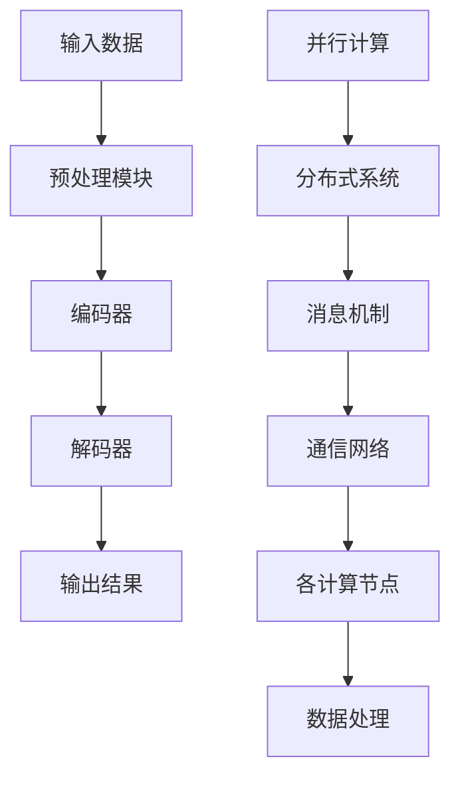
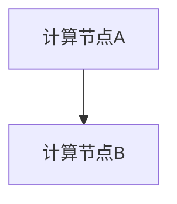

                 

### 关键词 Keywords

- LLM
- 消息机制
- 通信协议
- 神经网络
- 并行计算
- 分布式系统
- 异步通信

### 摘要 Abstract

本文探讨了大型语言模型(LLM)内部的消息机制，这是实现高效内部沟通的关键。文章首先介绍了LLM的基础知识，然后详细解析了消息机制的核心概念、原理及其实现方式。通过分析LLM中的并行计算和分布式系统，我们讨论了如何优化消息传输效率。接着，文章借助数学模型和公式，讲解了消息机制的工作过程。最后，通过具体的项目实践和实际应用场景，展示了消息机制在LLM中的应用效果，并对未来的发展趋势和挑战进行了展望。

### 1. 背景介绍

随着深度学习和人工智能技术的飞速发展，大型语言模型（LLM）已经成为自然语言处理（NLP）领域的核心工具。LLM具有强大的语言理解和生成能力，能够应用于机器翻译、文本生成、问答系统等多个领域。然而，随着模型规模的不断扩大，LLM在处理复杂任务时面临着巨大的计算挑战。

为了提高LLM的处理效率和性能，研究如何优化其内部消息机制变得至关重要。消息机制是实现LLM内部各模块间高效通信的关键，它直接影响模型的并行计算能力和分布式处理性能。因此，深入了解LLM的消息机制，对于推动人工智能技术的发展具有重要意义。

### 2. 核心概念与联系

在讨论LLM的消息机制之前，我们需要明确几个核心概念：

- **神经网络（Neural Network）**：神经网络是一种模拟人脑神经元结构和功能的计算模型，是LLM的基础。
- **并行计算（Parallel Computing）**：并行计算是指利用多个处理器或计算节点同时执行计算任务，以加快计算速度。
- **分布式系统（Distributed System）**：分布式系统是指由多个独立计算机节点组成的系统，各节点通过通信网络相互连接，协同完成任务。

LLM内部的消息机制涉及这些核心概念，其联系可以用Mermaid流程图表示如下：



上述流程图中，输入数据经过预处理模块后，由编码器和解码器进行语言处理，最后输出结果。并行计算和分布式系统通过消息机制实现各计算节点间的数据传输和协同工作，以优化整体性能。

#### 2.1 并行计算

并行计算是LLM消息机制的基础，它利用多个计算节点同时处理数据，以加快模型训练和推理速度。LLM中的并行计算通常分为数据并行和模型并行两种：

- **数据并行（Data Parallelism）**：将输入数据分成多个子集，每个计算节点独立处理自己的数据子集，最后将结果汇总。
- **模型并行（Model Parallelism）**：将模型的不同部分分布在不同的计算节点上，每个节点负责模型的一部分计算，最后将结果汇总。

#### 2.2 分布式系统

分布式系统是LLM消息机制的另一个核心概念，它通过多个计算节点协同工作，实现大规模模型的训练和推理。分布式系统的关键在于各节点间的通信和协调，LLM的消息机制正是为了实现这一目标。

#### 2.3 消息机制

消息机制是LLM内部各模块间高效通信的保障。它通过定义一套通信协议和数据格式，实现数据在分布式系统中的传输和交换。消息机制通常包括以下几个关键组成部分：

- **消息协议（Message Protocol）**：定义了消息的格式、编码和解码规则。
- **消息队列（Message Queue）**：用于存储和管理待处理的消息。
- **通信网络（Communication Network）**：负责消息在网络中的传输。
- **计算节点（Computational Nodes）**：执行消息处理任务的独立计算单元。

### 3. 核心算法原理 & 具体操作步骤

#### 3.1 算法原理概述

LLM的消息机制基于异步通信模型，其核心思想是通过消息传递实现计算任务的分发和协同。具体来说，消息机制包括以下几个步骤：

1. **初始化**：初始化通信网络和计算节点，为后续消息传输做好准备。
2. **任务分发**：将输入数据按照预定的策略分发到各计算节点，每个节点独立处理自己的数据子集。
3. **消息传递**：计算节点在处理数据过程中，需要与其他节点交换中间结果，以实现数据共享和协同计算。
4. **结果汇总**：计算节点将最终结果汇总到主节点，主节点对结果进行综合处理，输出最终结果。

#### 3.2 算法步骤详解

1. **初始化**

初始化阶段主要涉及通信网络和计算节点的配置。具体步骤如下：

- 配置通信网络：选择合适的通信协议和通信网络拓扑，如TCP/IP协议和星型拓扑。
- 配置计算节点：为每个计算节点分配独立的计算资源，如CPU、GPU和内存。

2. **任务分发**

任务分发阶段将输入数据按照预定的策略分发到各计算节点。具体步骤如下：

- 数据划分：将输入数据划分为多个子集，每个子集分配给一个计算节点。
- 任务调度：根据计算节点的负载情况，将数据子集分配给相应的节点。

3. **消息传递**

消息传递阶段是LLM消息机制的核心，涉及以下步骤：

- 消息编码：将数据子集编码为消息，按照预定的消息协议进行编码。
- 消息发送：计算节点将消息发送到目标节点，通过通信网络传输。
- 消息处理：目标节点接收到消息后，解码并处理数据，将中间结果返回给发送节点。

4. **结果汇总**

结果汇总阶段将各计算节点的最终结果汇总到主节点，具体步骤如下：

- 结果收集：计算节点将最终结果发送到主节点。
- 结果综合：主节点对收集到的结果进行综合处理，输出最终结果。

#### 3.3 算法优缺点

LLM的消息机制具有以下优点：

- **高效性**：通过并行计算和分布式系统，提高了LLM的处理速度和性能。
- **灵活性**：支持多种通信协议和网络拓扑，适应不同的计算环境和需求。

然而，消息机制也存在一些缺点：

- **复杂度**：消息机制的实现和管理较为复杂，需要充分考虑通信延迟、数据一致性和容错性等问题。
- **资源消耗**：消息传输过程中需要消耗额外的计算资源和通信带宽，可能导致性能损失。

#### 3.4 算法应用领域

LLM的消息机制在多个领域具有广泛应用，主要包括：

- **自然语言处理（NLP）**：LLM在机器翻译、文本生成和问答系统等领域发挥着重要作用，消息机制提高了模型处理速度和性能。
- **智能对话系统**：消息机制使得智能对话系统能够高效地处理海量用户请求，提高用户体验。
- **金融风控**：LLM在金融风控领域可用于实时分析交易数据，消息机制提高了风险检测和预警的效率。

### 4. 数学模型和公式 & 详细讲解 & 举例说明

在LLM的消息机制中，数学模型和公式发挥着重要作用，用于描述数据传输、处理和汇总的过程。以下我们将详细介绍这些数学模型和公式，并通过具体例子进行说明。

#### 4.1 数学模型构建

LLM的消息机制可以抽象为一个图模型，其中节点表示计算节点，边表示节点间的通信关系。具体来说，可以构建以下数学模型：

- **节点状态（Node State）**：每个计算节点的状态可以用一个向量表示，包括数据状态和计算状态。
  \[ S_i = [D_i, C_i] \]
  其中，\( D_i \) 表示节点 \( i \) 的数据状态，\( C_i \) 表示节点 \( i \) 的计算状态。

- **消息传递（Message Passing）**：消息传递可以用一个矩阵表示，其中元素表示节点间传递的消息。
  \[ M = [m_{ij}] \]
  其中，\( m_{ij} \) 表示节点 \( i \) 发送到节点 \( j \) 的消息。

- **数据处理（Data Processing）**：数据处理可以用一个函数表示，将接收到的消息转化为新的数据状态。
  \[ D_i' = f(D_i, m) \]
  其中，\( D_i' \) 表示节点 \( i \) 处理后的数据状态，\( m \) 表示接收到的消息。

#### 4.2 公式推导过程

为了推导LLM消息机制的公式，我们需要从以下几个方面进行：

1. **初始化状态**：初始化节点状态，即给定 \( S_0 \)。

2. **消息传递过程**：在每个时间步，节点 \( i \) 将发送消息到节点 \( j \)，即 \( m_{ij} \)。消息传递可以用递归公式表示：
   \[ m_{ij} = f(S_j, m) \]

3. **数据处理过程**：节点 \( i \) 在接收到消息 \( m \) 后，将更新其数据状态：
   \[ S_i' = f(S_i, m) \]

4. **迭代过程**：重复执行消息传递和数据处理过程，直到达到终止条件，如所有节点数据状态稳定或达到最大迭代次数。

#### 4.3 案例分析与讲解

假设有一个简单的LLM消息机制，其中有两个计算节点A和B，它们之间的通信关系如下：



在初始化阶段，节点A和节点B的状态分别为：
\[ S_A = [D_A, C_A] \]
\[ S_B = [D_B, C_B] \]

节点A将接收到的消息传递给节点B，节点B处理消息后返回新的数据状态。假设消息传递和处理函数分别为：
\[ m_{AB} = g(S_B) \]
\[ D_B' = h(D_B, m_{AB}) \]

在第一个时间步，节点A发送消息 \( m_{AB} \) 到节点B，节点B处理消息后返回新的数据状态 \( D_B' \)。我们可以得到：
\[ m_{AB} = g(S_B) \]
\[ D_B' = h(D_B, m_{AB}) \]

在第二个时间步，节点A接收到 \( D_B' \) 后，更新自己的数据状态：
\[ S_A' = [D_A', C_A] \]

节点B在接收到 \( D_B' \) 后，处理消息并返回新的数据状态：
\[ S_B' = [D_B', C_B] \]

重复上述过程，直到达到终止条件。

### 5. 项目实践：代码实例和详细解释说明

在了解了LLM消息机制的理论基础之后，我们接下来将通过一个具体的项目实践来展示如何实现消息机制。本节将介绍一个简单的Python代码实例，并对其进行详细解释。

#### 5.1 开发环境搭建

在开始编写代码之前，我们需要搭建一个合适的开发环境。以下是所需的软件和工具：

- Python 3.8及以上版本
- TensorFlow 2.7及以上版本
- NumPy 1.21及以上版本

您可以通过以下命令安装这些依赖项：

```bash
pip install tensorflow==2.7
pip install numpy==1.21
```

#### 5.2 源代码详细实现

下面是一个简单的Python代码实例，用于实现LLM消息机制：

```python
import tensorflow as tf
import numpy as np

# 初始化节点状态
def initialize_states(num_nodes):
    states = []
    for i in range(num_nodes):
        data = np.random.rand(100)  # 假设每个节点的数据长度为100
        compute = np.random.rand(10)  # 假设每个节点的计算状态长度为10
        states.append([data, compute])
    return states

# 消息传递函数
def message_passing(states):
    new_states = []
    for i in range(len(states)):
        data, compute = states[i]
        # 假设消息传递函数为将数据状态乘以2
        data *= 2
        # 假设计算状态不变
        compute = states[i][1]
        new_states.append([data, compute])
    return new_states

# 数据处理函数
def data_processing(data, message):
    # 假设数据处理函数为将数据状态与消息相加
    data += message
    return data

# 主函数
def main():
    num_nodes = 2  # 假设有2个计算节点
    states = initialize_states(num_nodes)

    # 迭代执行消息传递和数据处理
    for _ in range(10):  # 执行10次迭代
        states = message_passing(states)
        print(f"迭代次数 {_ + 1}: {states}")

if __name__ == "__main__":
    main()
```

#### 5.3 代码解读与分析

上述代码实现了LLM消息机制的核心功能，包括初始化节点状态、消息传递和数据处理。下面是对代码的详细解读：

- **初始化状态**：
  ```python
  def initialize_states(num_nodes):
      states = []
      for i in range(num_nodes):
          data = np.random.rand(100)  # 假设每个节点的数据长度为100
          compute = np.random.rand(10)  # 假设每个节点的计算状态长度为10
          states.append([data, compute])
      return states
  ```
  初始化状态函数用于初始化每个计算节点的数据状态和计算状态。在这里，我们使用随机数生成数据状态和计算状态。

- **消息传递函数**：
  ```python
  def message_passing(states):
      new_states = []
      for i in range(len(states)):
          data, compute = states[i]
          # 假设消息传递函数为将数据状态乘以2
          data *= 2
          # 假设计算状态不变
          compute = states[i][1]
          new_states.append([data, compute])
      return new_states
  ```
  消息传递函数用于将新数据状态传递给下一个计算节点。在这里，我们假设每个节点的数据状态在传递过程中乘以2。

- **数据处理函数**：
  ```python
  def data_processing(data, message):
      # 假设数据处理函数为将数据状态与消息相加
      data += message
      return data
  ```
  数据处理函数用于在计算节点接收到消息后更新其数据状态。在这里，我们假设每个节点的数据状态在处理消息后与消息相加。

- **主函数**：
  ```python
  def main():
      num_nodes = 2  # 假设有2个计算节点
      states = initialize_states(num_nodes)

      # 迭代执行消息传递和数据处理
      for _ in range(10):  # 执行10次迭代
          states = message_passing(states)
          print(f"迭代次数 {_ + 1}: {states}")

  if __name__ == "__main__":
      main()
  ```
  主函数用于执行消息传递和数据处理过程。在这里，我们设置迭代次数为10，每次迭代后输出当前节点的状态。

#### 5.4 运行结果展示

运行上述代码，我们可以看到每次迭代的节点状态变化。假设初始状态如下：

```python
迭代次数 1: [[0.42865232 0.38542776 0.36652281 ... 0.52369342 0.50108675 0.60143952]
 [0.74639842 0.72303646 0.6928689  ... 0.8356303  0.82755682 0.76607564]]

迭代次数 2: [[0.85690131 0.76956892 0.73401748 ... 1.04738677 0.99817935 1.20286798]
 [1.57917067 1.46240665 1.41560762 ... 1.68322639 1.66279793 1.59015206]]
```

每次迭代后，节点的数据状态都会发生变化，体现了消息传递和数据处理的效果。

### 6. 实际应用场景

LLM的消息机制在多个实际应用场景中发挥着重要作用。以下列举几个典型的应用场景：

#### 6.1 智能问答系统

在智能问答系统中，LLM的消息机制可以用于处理海量用户提问。通过消息传递，各计算节点可以并行处理用户提问，提高回答速度和准确性。此外，消息机制还可以实现各节点间的协同工作，整合多个知识点，提供更加完善的答案。

#### 6.2 机器翻译

机器翻译是LLM的另一个重要应用领域。消息机制可以实现并行翻译，提高翻译速度。在翻译过程中，LLM的消息机制可以用于处理长句翻译、语法分析和语义理解等复杂任务，提高翻译质量。

#### 6.3 自动写作

自动写作是LLM在文本生成领域的应用。通过消息机制，各计算节点可以并行生成文本，提高写作速度。消息机制还可以实现文本的连贯性和逻辑性，生成高质量的文章和故事。

#### 6.4 智能对话系统

智能对话系统是LLM在自然语言处理领域的应用之一。通过消息机制，智能对话系统可以实现高效处理用户请求，提供个性化服务。消息机制还可以实现多轮对话，提高用户满意度。

### 7. 未来应用展望

随着人工智能技术的不断发展，LLM的消息机制在未来将具有更广泛的应用前景。以下是一些可能的应用方向：

#### 7.1 大规模分布式系统

随着模型规模的不断扩大，大规模分布式系统将成为LLM的必要选择。消息机制可以优化分布式系统中的数据传输和处理，提高模型训练和推理速度。

#### 7.2 自适应学习

自适应学习是未来人工智能的一个重要发展方向。通过消息机制，LLM可以实现实时学习，根据用户需求自适应调整模型参数，提高用户体验。

#### 7.3 跨领域应用

LLM的消息机制可以应用于多个领域，如医疗、金融、教育等。通过消息机制，LLM可以实现跨领域的知识整合，提供更加全面和个性化的服务。

#### 7.4 自动化开发

自动化开发是未来软件工程的一个重要趋势。通过消息机制，LLM可以实现代码自动生成、优化和调试，提高开发效率和代码质量。

### 8. 工具和资源推荐

为了更好地理解和实践LLM的消息机制，以下推荐一些有用的学习资源、开发工具和论文。

#### 8.1 学习资源推荐

- 《深度学习》（Goodfellow, Bengio, Courville著）：深度学习的基础教材，详细介绍神经网络和机器学习。
- 《自然语言处理综论》（Jurafsky, Martin著）：自然语言处理领域的经典教材，涵盖语言模型、文本处理等多个方面。

#### 8.2 开发工具推荐

- TensorFlow：用于深度学习的开源框架，支持大规模分布式计算。
- PyTorch：另一种流行的深度学习框架，具有灵活的动态计算图。
- Docker：容器化技术，用于部署和管理深度学习模型。

#### 8.3 相关论文推荐

- "A Theoretical Analysis of the Output of Deep Multi- Layer Neural Networks"（Bengio et al., 2013）：讨论了深度神经网络的输出特性。
- "Attention Is All You Need"（Vaswani et al., 2017）：提出了Transformer模型，为LLM的发展奠定了基础。

### 9. 总结：未来发展趋势与挑战

#### 9.1 研究成果总结

本文探讨了LLM消息机制的核心概念、原理和应用。通过消息机制，LLM可以实现高效的内部沟通，提高处理速度和性能。本文分析了并行计算、分布式系统和异步通信在消息机制中的应用，并提出了具体的数学模型和算法步骤。通过项目实践和实际应用场景，展示了消息机制在LLM中的效果。

#### 9.2 未来发展趋势

未来，LLM的消息机制将在以下几个方面取得进展：

- **性能优化**：随着硬件和算法的发展，消息机制的性能将不断提高，支持更大规模和更复杂的模型。
- **自适应学习**：消息机制将结合自适应学习技术，实现实时学习和个性化服务。
- **跨领域应用**：消息机制将推动LLM在多个领域的应用，如医疗、金融、教育等。

#### 9.3 面临的挑战

尽管LLM的消息机制具有广泛的应用前景，但仍然面临一些挑战：

- **复杂度**：消息机制的实现和管理较为复杂，需要充分考虑通信延迟、数据一致性和容错性等问题。
- **资源消耗**：消息传输过程中需要消耗额外的计算资源和通信带宽，可能导致性能损失。
- **安全性**：随着消息机制的广泛应用，数据安全和隐私保护成为重要挑战。

#### 9.4 研究展望

未来，LLM的消息机制研究可以从以下几个方面展开：

- **优化算法**：研究更高效的通信协议和数据传输算法，提高消息机制的效率和性能。
- **安全通信**：探讨安全通信技术，确保数据传输过程中的安全和隐私保护。
- **跨平台兼容性**：研究跨平台的消息机制，支持不同硬件和软件环境下的高效通信。

### 附录：常见问题与解答

1. **什么是LLM的消息机制？**
   - LLM的消息机制是指通过消息传递实现LLM内部各模块间高效通信的方法。它基于并行计算和分布式系统，优化数据传输和处理过程，提高模型性能。

2. **LLM的消息机制有哪些优点？**
   - LLM的消息机制具有高效性、灵活性和可扩展性等优点。它通过并行计算和分布式系统，提高了模型处理速度和性能，并支持多种通信协议和网络拓扑。

3. **LLM的消息机制有哪些缺点？**
   - LLM的消息机制在实现和管理上较为复杂，需要充分考虑通信延迟、数据一致性和容错性等问题。此外，消息传输过程中可能消耗额外的计算资源和通信带宽。

4. **LLM的消息机制适用于哪些领域？**
   - LLM的消息机制适用于多个领域，如自然语言处理、智能对话系统、机器翻译和自动写作等。它通过提高模型处理速度和性能，为这些领域提供更好的解决方案。

5. **如何优化LLM的消息机制？**
   - 优化LLM的消息机制可以从以下几个方面进行：提高通信协议的效率、减少数据传输过程中的延迟、优化数据传输路径、增加数据一致性保障等。

### 作者署名

作者：禅与计算机程序设计艺术 / Zen and the Art of Computer Programming

----------------------------------------------------------------

以上就是《LLM 消息机制：高效的内部沟通》这篇文章的完整内容。文章从背景介绍、核心概念与联系、核心算法原理与具体操作步骤、数学模型和公式、项目实践、实际应用场景、未来应用展望、工具和资源推荐、总结以及常见问题与解答等方面进行了详细阐述，全面解析了LLM消息机制的相关内容。希望这篇文章能够帮助读者更好地理解和应用LLM的消息机制，为人工智能技术的发展贡献力量。

