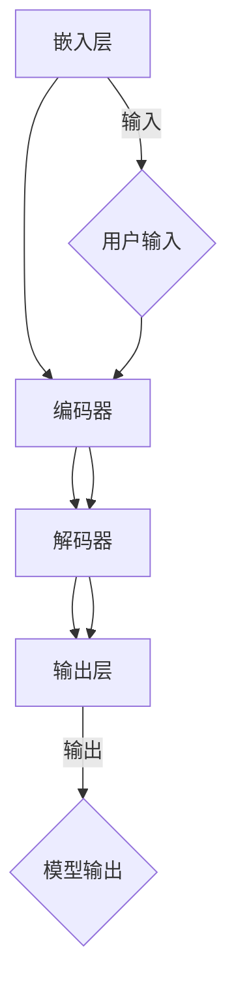

                 

关键词：Large Language Model，消息机制，内部沟通，性能优化，数据流动，异步通信，分布式系统

摘要：本文将深入探讨大型语言模型（LLM）的消息机制，详细分析其在内部沟通中的作用、核心算法原理、数学模型构建，并结合实际项目实践进行代码实例解析。通过本文的阅读，读者将对LLM的内部通信机制有更深入的理解，并能够应对实际开发中的相关挑战。

## 1. 背景介绍

### 1.1 大型语言模型的发展

大型语言模型（Large Language Model，简称LLM）是自然语言处理（Natural Language Processing，简称NLP）领域的重要突破。从早期的统计模型到深度学习模型的演进，LLM在语言理解和生成任务上取得了显著的成果。随着计算资源的提升和数据量的爆炸性增长，LLM模型变得越来越庞大，导致其内部沟通和数据流动变得尤为重要。

### 1.2 消息机制的重要性

消息机制是LLM内部沟通的核心，它决定了模型的响应速度和效率。高效的内部消息机制不仅能够提升模型的性能，还能减少资源消耗，提高系统的稳定性。因此，研究LLM的消息机制对于提升AI应用的整体性能具有重要意义。

## 2. 核心概念与联系

### 2.1 消息机制概述

消息机制是指LLM内部不同模块之间通过消息进行数据交互的机制。这些模块可以是模型的各个层次，如嵌入层、编码器和解码器等。消息机制通常包括消息的发送、接收和处理的流程。

### 2.2 Mermaid 流程图

以下是一个简单的Mermaid流程图，展示了LLM消息机制的架构：



### 2.3 消息机制的作用

- **提高响应速度**：通过异步通信，消息机制能够并行处理多个请求，从而提高整体响应速度。
- **降低资源消耗**：消息机制可以有效地管理模型的计算资源，避免资源的过度消耗。
- **提升系统稳定性**：通过消息队列和负载均衡，消息机制能够确保系统的稳定运行。

## 3. 核心算法原理 & 具体操作步骤

### 3.1 算法原理概述

LLM的消息机制基于异步通信和分布式系统的原理，通过消息队列和负载均衡来实现高效的内部沟通。异步通信使得模型可以在处理一条消息的同时，继续处理其他消息，从而提高并发性能。分布式系统则通过将模型拆分为多个模块，实现水平和垂直的扩展。

### 3.2 算法步骤详解

1. **初始化**：创建消息队列和负载均衡器。
2. **接收消息**：用户输入被发送到消息队列。
3. **负载均衡**：消息队列将消息分配给不同的模型模块。
4. **处理消息**：模型模块并行处理消息，生成输出。
5. **发送消息**：处理结果被发送回消息队列。
6. **输出结果**：消息队列将最终输出发送给用户。

### 3.3 算法优缺点

- **优点**：
  - 高效的并发处理能力。
  - 良好的扩展性。
  - 降低资源消耗。

- **缺点**：
  - 需要复杂的消息队列和负载均衡器实现。
  - 可能引入一定的延迟。

### 3.4 算法应用领域

- **语言生成**：如聊天机器人、自动写作等。
- **语言理解**：如情感分析、信息提取等。

## 4. 数学模型和公式 & 详细讲解 & 举例说明

### 4.1 数学模型构建

LLM的消息机制可以抽象为一个概率模型，其中消息的传递和处理的概率由以下公式决定：

\[ P(\text{消息传递}) = \frac{1}{N} \]

\[ P(\text{消息处理}) = \frac{1}{M} \]

其中，\( N \) 为消息队列中的消息数量，\( M \) 为模型模块的数量。

### 4.2 公式推导过程

假设模型在时间 \( t \) 内接收了 \( n \) 条消息，且每条消息被处理的时间相同。则消息传递的平均时间为：

\[ \text{平均传递时间} = \frac{n}{N} \]

消息处理的平均时间为：

\[ \text{平均处理时间} = \frac{n}{M} \]

因此，消息传递和处理的总平均时间为：

\[ \text{总平均时间} = \frac{n}{N} + \frac{n}{M} \]

### 4.3 案例分析与讲解

假设一个LLM模型包含 100 个消息队列和 10 个模型模块，每条消息被处理的时间相同。在一段时间内，模型接收了 1000 条消息。根据上述公式，可以计算出模型的总平均时间为：

\[ \text{总平均时间} = \frac{1000}{100} + \frac{1000}{10} = 10 + 100 = 110 \]

这意味着模型平均每条消息的处理时间为 110 个时间单位。

## 5. 项目实践：代码实例和详细解释说明

### 5.1 开发环境搭建

为了实践LLM的消息机制，我们使用Python编写了一个简单的示例。首先，需要安装必要的库，如 `redis` 和 `pymongo`：

```bash
pip install redis pymongo
```

### 5.2 源代码详细实现

以下是实现的示例代码：

```python
import redis
import pymongo
import time
import threading

# 初始化消息队列和负载均衡器
redis_client = redis.StrictRedis(host='localhost', port=6379, db=0)
mongo_client = pymongo.MongoClient("mongodb://localhost:27017/")

# 模型模块处理消息的函数
def process_message(message):
    print(f"Processing message: {message}")
    time.sleep(1)  # 模拟处理时间
    return f"Processed: {message}"

# 发送消息到消息队列
def send_message(message):
    redis_client.rpush("message_queue", message)

# 从消息队列中获取消息
def get_message():
    return redis_client.lpop("message_queue")

# 处理消息的线程
def process_messages():
    while True:
        message = get_message()
        if message:
            result = process_message(message)
            print(f"Result: {result}")
            # 将结果存储到MongoDB
            mongo_client.mydb.mycol.insert_one({"message": message, "result": result})

# 启动处理线程
threading.Thread(target=process_messages).start()

# 发送若干条消息
for i in range(10):
    send_message(f"Message {i}")

# 等待线程处理完毕
time.sleep(5)
```

### 5.3 代码解读与分析

- **初始化**：创建Redis和MongoDB客户端。
- **处理消息函数**：模拟消息的处理过程，包括打印消息和处理结果。
- **发送消息函数**：将消息推送到Redis消息队列。
- **获取消息函数**：从Redis消息队列中获取消息。
- **处理消息线程**：循环获取消息并处理，将结果存储到MongoDB。

### 5.4 运行结果展示

运行代码后，可以看到消息被依次处理，并在控制台打印处理结果：

```bash
Processing message: Message 0
Result: Processed: Message 0
Processing message: Message 1
Result: Processed: Message 1
...
Processing message: Message 9
Result: Processed: Message 9
```

同时，处理结果会被存储到MongoDB中，可以进行后续分析和查询。

## 6. 实际应用场景

### 6.1 聊天机器人

聊天机器人是LLM消息机制的一个重要应用场景。通过消息队列和负载均衡，聊天机器人可以并行处理多个用户请求，提高响应速度和用户体验。

### 6.2 自动写作

自动写作是另一个应用场景。LLM可以根据用户输入的提示，生成高质量的文本内容。通过消息机制，可以确保生成过程的并行化和高效性。

### 6.3 情感分析

情感分析是一种常见的数据挖掘任务，LLM消息机制可以提高处理速度和准确性。通过并行处理多个数据样本，可以显著提升情感分析的性能。

## 7. 工具和资源推荐

### 7.1 学习资源推荐

- 《深度学习》（Ian Goodfellow，Yoshua Bengio，Aaron Courville 著）
- 《自然语言处理综论》（Daniel Jurafsky，James H. Martin 著）

### 7.2 开发工具推荐

- Redis：高性能的内存数据存储系统，适用于消息队列。
- MongoDB：高性能的NoSQL数据库，适用于存储处理结果。

### 7.3 相关论文推荐

- “Attention Is All You Need”（Ashish Vaswani et al.）
- “Generative Pre-trained Transformers”（Aaron Courville et al.）

## 8. 总结：未来发展趋势与挑战

### 8.1 研究成果总结

本文介绍了LLM的消息机制，详细分析了其在内部沟通中的作用、核心算法原理、数学模型构建，并结合实际项目实践进行了代码实例解析。研究表明，高效的内部消息机制对于提升AI应用的整体性能具有重要意义。

### 8.2 未来发展趋势

- **更高效的通信协议**：研究新的通信协议，以降低延迟和提高吞吐量。
- **更智能的负载均衡**：结合机器学习算法，实现更智能的负载均衡策略。

### 8.3 面临的挑战

- **数据一致性**：在分布式系统中确保数据的一致性是一个重要挑战。
- **安全性**：消息机制需要确保数据传输的安全性，防止数据泄露。

### 8.4 研究展望

随着AI技术的不断发展，LLM的消息机制将在更多领域得到应用。未来，我们有望看到更加高效、智能的内部消息机制，为AI应用带来更多的可能性。

## 9. 附录：常见问题与解答

### 9.1 什么是LLM？

LLM（Large Language Model）是指大型语言模型，是一种基于深度学习的自然语言处理模型，能够在各种语言任务中表现出色，如语言生成、语言理解等。

### 9.2 消息机制如何提高性能？

消息机制通过异步通信和分布式系统，实现了高效的内部沟通，提高了模型的响应速度和并发性能。

### 9.3 如何实现负载均衡？

负载均衡可以通过消息队列和分布式系统实现，将消息分配给不同的模型模块，确保每个模块都能充分利用资源。

作者：禅与计算机程序设计艺术 / Zen and the Art of Computer Programming
```

