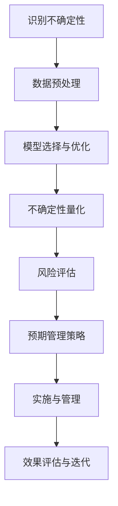
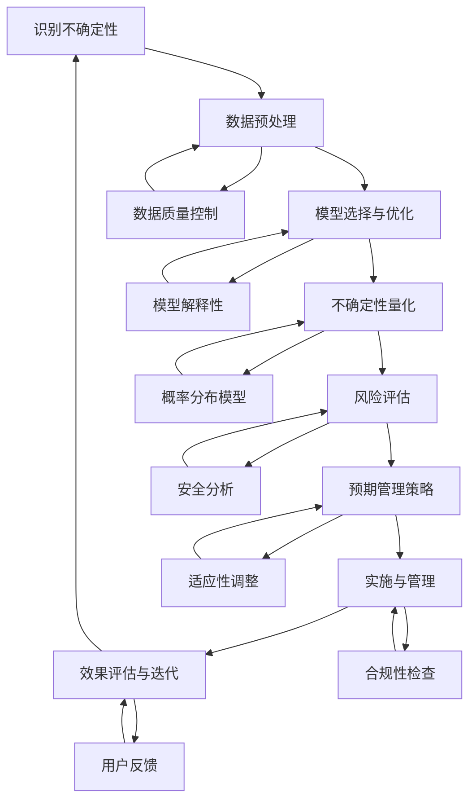

                 

关键词：大语言模型，不确定性，风险，预期管理，技术博客。

> 摘要：本文将深入探讨大型语言模型(LLM)中不确定性管理的重要性和方法。通过分析LLM的原理和实际应用，我们将探讨如何识别和降低模型中的不确定性，并提供一些建议来帮助开发者和管理者更好地管理这种不确定性。

## 1. 背景介绍

近年来，随着深度学习和计算能力的快速发展，大型语言模型（LLM）如BERT、GPT-3等已经成为了自然语言处理（NLP）领域的明星。这些模型在语言理解、文本生成、问答系统等方面取得了令人瞩目的成绩。然而，随着模型规模的不断扩大，LLM的不确定性问题也日益突出。不确定性管理成为了一个关键的研究方向。

不确定性可以来自多个方面，包括模型本身的局限性、数据的不完整性和噪声、以及外部环境的变化等。在LLM中，不确定性可能会导致错误预测、误解用户意图、信息泄露等问题。因此，有效地管理和降低不确定性对于确保模型的可靠性和安全性至关重要。

本文旨在探讨LLM中的不确定性管理，包括核心概念、算法原理、数学模型、实际应用场景等，并提供一些建议和工具来帮助开发者和管理者更好地应对这一挑战。

## 2. 核心概念与联系

在讨论LLM的不确定性之前，我们需要明确一些核心概念和它们之间的联系。

### 2.1 语言模型

语言模型是一种基于统计和机器学习的算法，用于预测文本序列的概率分布。它通常由大规模的神经网络构成，通过训练数据学习语言的统计规律，从而实现对未知文本的预测。

### 2.2 不确定性

在机器学习中，不确定性通常指的是模型预测结果的不确定性，即模型对于不同预测结果的置信度。在LLM中，不确定性可以源自数据分布、模型容量、噪声等。

### 2.3 风险

风险是指由于不确定性导致的不良后果的可能性。在LLM的应用中，风险可能包括错误预测、隐私泄露、误导用户等。

### 2.4 预期管理

预期管理是一种主动识别和降低不确定性的方法，旨在通过改进模型、数据、算法等来减少风险。

### 2.5 Mermaid 流程图

以下是LLM不确定性管理的一个简单Mermaid流程图：



### 2.6 关键概念与联系

通过以上核心概念和流程图的介绍，我们可以更清晰地理解LLM不确定性管理的各个方面。这些概念和流程相互关联，共同构成了一个完整的解决方案。

### 2.7 Mermaid流程图（继续完善）

为了更好地展示概念之间的联系，我们可以进一步扩展Mermaid流程图，包括更多的步骤和节点：



通过这个流程图，我们可以看到各个步骤之间的相互依赖和反馈机制，这对于理解和实施不确定性管理策略至关重要。

### 2.8 核心概念与联系总结

- 语言模型：基础，用于生成和预测文本。
- 不确定性：核心，影响模型的可靠性和安全性。
- 风险：结果，由于不确定性可能导致的不良后果。
- 预期管理：方法，通过识别和降低不确定性来管理风险。
- Mermaid流程图：工具，帮助可视化和管理不确定性管理的各个方面。

以上核心概念和联系为后续的讨论提供了理论基础和框架。

## 3. 核心算法原理 & 具体操作步骤

### 3.1 算法原理概述

在LLM中，不确定性管理的关键在于如何准确地量化模型的预测不确定性，并据此制定相应的管理策略。这一过程通常包括以下几个核心步骤：

1. **数据预处理**：通过清洗、归一化等手段提高数据质量，减少噪声。
2. **模型选择与优化**：选择适当的模型架构，并通过调参和训练优化模型性能。
3. **不确定性量化**：使用概率分布模型等工具，对模型预测结果的不确定性进行量化。
4. **风险评估**：根据量化结果，评估不同预测结果的风险，识别潜在的风险点。
5. **预期管理策略**：制定和实施降低不确定性的策略，如模型解释性增强、适应性调整等。
6. **实施与管理**：将策略应用到实际场景中，进行持续监控和调整。
7. **效果评估与迭代**：评估策略的有效性，根据反馈进行迭代和优化。

### 3.2 算法步骤详解

#### 3.2.1 数据预处理

数据预处理是整个不确定性管理流程的基础。在这一阶段，我们需要对数据集进行以下操作：

- **数据清洗**：处理缺失值、异常值，消除噪声。
- **归一化**：将不同特征的范围调整为同一尺度，便于模型训练。
- **特征工程**：提取对模型预测有意义的特征，降低数据维度。
- **数据增强**：通过增加数据样本、变换特征等手段，增强模型泛化能力。

#### 3.2.2 模型选择与优化

在数据预处理完成后，我们需要选择一个适当的语言模型。当前，常见的LLM包括：

- **GPT系列**：基于Transformer架构，具有强大的生成能力和上下文理解能力。
- **BERT系列**：通过双向编码器表示学习，对上下文有更深入的理解。
- **T5系列**：基于Transformer的文本到文本转换模型，具有广泛的应用场景。

选择模型后，我们需要进行以下优化步骤：

- **模型调参**：调整学习率、批处理大小、层数等超参数，以优化模型性能。
- **训练与验证**：使用训练集和验证集，进行模型训练和验证，确保模型泛化能力。
- **模型压缩**：通过剪枝、量化等技术，减少模型参数数量和计算复杂度。

#### 3.2.3 不确定性量化

不确定性量化是关键步骤，常用的方法包括：

- **概率分布模型**：使用贝叶斯网络、变分自编码器（VAE）等概率模型，对预测结果的不确定性进行量化。
- **蒙特卡罗方法**：通过模拟大量随机样本，估计模型预测的不确定性。
- **对抗样本生成**：生成对抗性样本，测试模型在极端条件下的表现。

#### 3.2.4 风险评估

在量化不确定性后，我们需要对模型预测结果的风险进行评估。这通常包括以下步骤：

- **错误率分析**：计算模型在不同预测结果上的错误率，识别高风险区域。
- **置信度评估**：评估模型对预测结果的置信度，识别置信度低的预测结果。
- **安全分析**：通过对抗性攻击等方法，评估模型在攻击条件下的安全性。

#### 3.2.5 预期管理策略

根据风险评估结果，我们可以制定以下预期管理策略：

- **模型解释性增强**：通过可视化、解释模型内部决策过程，提高模型的可解释性。
- **适应性调整**：根据应用场景和用户反馈，动态调整模型参数和策略。
- **合规性检查**：确保模型遵循相关法律法规和道德准则，避免信息泄露和误导用户。

#### 3.2.6 实施与管理

实施和管理策略是确保预期管理策略有效性的关键。这通常包括以下步骤：

- **部署与监控**：将模型部署到生产环境，进行实时监控和调整。
- **反馈机制**：建立用户反馈机制，收集用户意见和建议，用于模型优化。
- **持续学习**：通过持续学习和调整，提高模型在动态环境下的适应能力。

#### 3.2.7 效果评估与迭代

最后，我们需要对预期管理策略的效果进行评估，并根据反馈进行迭代和优化。这通常包括以下步骤：

- **效果评估**：使用指标如准确率、召回率、F1值等，评估模型性能。
- **用户满意度调查**：收集用户对模型性能的满意度调查，识别改进点。
- **迭代优化**：根据评估结果，调整模型参数、策略和算法，提高模型性能。

### 3.3 算法优缺点

#### 优点

- **强大的生成能力和理解能力**：LLM具有强大的文本生成和理解能力，适用于多种NLP任务。
- **灵活性和可扩展性**：通过调整模型架构和参数，可以适应不同应用场景。
- **高精度和低错误率**：在大多数情况下，LLM的预测结果具有较高的精度和较低的错误率。

#### 缺点

- **不确定性管理困难**：LLM的不确定性管理较为复杂，需要多种方法和工具。
- **计算资源消耗大**：大型LLM的训练和推理需要大量计算资源，对硬件有较高要求。
- **模型可解释性不足**：LLM的决策过程较为复杂，难以解释和验证。

### 3.4 算法应用领域

LLM在多个领域有广泛的应用，以下是一些主要的应用场景：

- **自然语言处理**：文本分类、情感分析、机器翻译等。
- **对话系统**：智能客服、虚拟助手等。
- **生成内容**：文章生成、摘要生成、创意写作等。
- **知识图谱**：构建和推理知识图谱，用于问答系统和推荐系统。
- **代码生成**：根据自然语言描述生成代码，提高开发效率。

## 4. 数学模型和公式 & 详细讲解 & 举例说明

### 4.1 数学模型构建

在LLM的不确定性管理中，数学模型起着关键作用。以下是一些常用的数学模型和公式，用于构建和量化LLM的不确定性。

#### 4.1.1 概率分布模型

概率分布模型是量化模型预测不确定性的常用工具。常见的概率分布模型包括：

- **正态分布（Gaussian Distribution）**：表示预测结果的均值和方差。
- **均匀分布（Uniform Distribution）**：表示预测结果在某个范围内均匀分布。
- **对数正态分布（Log-normal Distribution）**：表示预测结果的方差随均值增加而增加。

概率分布模型可以用以下公式表示：

$$
P(x|\theta) = \frac{1}{\sqrt{2\pi\sigma^2}} e^{-\frac{(x-\mu)^2}{2\sigma^2}}
$$

其中，$\mu$ 表示均值，$\sigma^2$ 表示方差，$x$ 表示预测结果。

#### 4.1.2 贝叶斯网络

贝叶斯网络是一种表示变量之间概率关系的图模型。它由一组节点和边组成，每个节点表示一个变量，边表示变量之间的依赖关系。

贝叶斯网络可以用以下公式表示：

$$
P(X_1, X_2, ..., X_n) = \prod_{i=1}^{n} P(X_i | \text{parent}(X_i))
$$

其中，$X_1, X_2, ..., X_n$ 表示节点变量，$\text{parent}(X_i)$ 表示 $X_i$ 的父节点。

#### 4.1.3 变分自编码器（VAE）

变分自编码器是一种概率生成模型，用于学习数据的概率分布。它由编码器和解码器组成，编码器将数据映射到一个隐变量空间，解码器将隐变量映射回数据空间。

VAE可以用以下公式表示：

$$
\begin{aligned}
\pi(\theta) &= \int p(\theta) p(x|\theta) d\theta \\
p(x|\theta) &= \int p(x|z,\theta) p(z|\theta) dz
\end{aligned}
$$

其中，$\theta$ 表示模型参数，$x$ 表示输入数据，$z$ 表示隐变量。

### 4.2 公式推导过程

#### 4.2.1 概率分布模型

概率分布模型的推导基于最大似然估计（Maximum Likelihood Estimation，MLE）。假设我们有一个观测数据集 $D = \{x_1, x_2, ..., x_n\}$，我们希望找到一个概率分布模型 $P(x|\theta)$ 来拟合这个数据集。

最大似然估计的目标是最大化似然函数 $L(\theta)$：

$$
L(\theta) = \prod_{i=1}^{n} P(x_i|\theta)
$$

由于似然函数是概率的乘积，我们可以取对数得到对数似然函数 $\ln L(\theta)$：

$$
\ln L(\theta) = \sum_{i=1}^{n} \ln P(x_i|\theta)
$$

然后，我们对 $\ln L(\theta)$ 关于 $\theta$ 求导并令其等于0，得到最大似然估计：

$$
\frac{d}{d\theta} \ln L(\theta) = 0
$$

这个方程组可以用于求解模型参数 $\theta$。

#### 4.2.2 贝叶斯网络

贝叶斯网络的推导基于条件概率。假设我们有一个变量集 $X = \{X_1, X_2, ..., X_n\}$，并且每个变量 $X_i$ 有一个父节点集 $\text{parent}(X_i)$。我们希望找到一个概率分布模型 $P(X)$ 来表示变量之间的关系。

根据条件概率的定义，我们有：

$$
P(X) = P(X_1, X_2, ..., X_n) = P(X_1) P(X_2 | X_1) P(X_3 | X_1, X_2) ... P(X_n | X_1, X_2, ..., X_{n-1})
$$

我们可以使用贝叶斯法则来表示条件概率：

$$
P(X_i | X_1, X_2, ..., X_{i-1}) = \frac{P(X_i X_1, X_2, ..., X_{i-1})}{P(X_1, X_2, ..., X_{i-1})}
$$

通过递归应用贝叶斯法则，我们可以将条件概率分解为多个父节点的概率：

$$
P(X_i | X_1, X_2, ..., X_{i-1}) = \frac{P(X_i X_{i-1})}{P(X_{i-1})}
$$

这样，我们可以将贝叶斯网络表示为一系列条件概率：

$$
P(X_i | X_1, X_2, ..., X_{i-1}) = \frac{P(X_i X_{i-1})}{P(X_{i-1})}
$$

#### 4.2.3 变分自编码器（VAE）

变分自编码器（VAE）的推导基于概率生成模型。VAE由编码器 $q_{\phi}(z|x)$ 和解码器 $p_{\theta}(x|z)$ 组成。

编码器 $q_{\phi}(z|x)$ 是一个概率分布模型，用于将输入数据 $x$ 映射到一个隐变量空间 $z$：

$$
q_{\phi}(z|x) = \frac{1}{Z} \exp(-\frac{1}{2} \sum_{i=1}^{d} (\theta_i z_i)^2)
$$

其中，$Z$ 是归一化常数。

解码器 $p_{\theta}(x|z)$ 是一个概率分布模型，用于将隐变量 $z$ 映射回输入数据 $x$：

$$
p_{\theta}(x|z) = \frac{1}{Z'} \exp(-\frac{1}{2} \sum_{j=1}^{d'} (\theta_j x_j)^2)
$$

其中，$Z'$ 是归一化常数。

VAE的目标是最小化下述损失函数：

$$
\mathcal{L} = \mathbb{E}_{x \sim p_{\theta}(x)} [\log p_{\theta}(x|z)] + D_{KL}(q_{\phi}(z|x) || p(z))
$$

其中，$D_{KL}$ 表示KL散度。

### 4.3 案例分析与讲解

为了更好地理解这些数学模型和公式的应用，我们来看一个具体的案例。

#### 4.3.1 概率分布模型

假设我们有一个数据集 $D$，包含 $n$ 个样本 $x_1, x_2, ..., x_n$。我们希望使用正态分布模型 $P(x|\theta)$ 来拟合这个数据集。

首先，我们需要估计均值 $\mu$ 和方差 $\sigma^2$：

$$
\mu = \frac{1}{n} \sum_{i=1}^{n} x_i
$$

$$
\sigma^2 = \frac{1}{n} \sum_{i=1}^{n} (x_i - \mu)^2
$$

然后，我们可以使用最大似然估计来求解这些参数：

$$
\frac{d}{d\mu} \ln L(\mu) = 0
$$

$$
\frac{d}{d\sigma^2} \ln L(\sigma^2) = 0
$$

求解上述方程组，我们可以得到均值和方差的估计值。

最后，我们可以使用估计的参数来计算预测结果的不确定性：

$$
P(x|\mu, \sigma^2) = \frac{1}{\sqrt{2\pi\sigma^2}} e^{-\frac{(x-\mu)^2}{2\sigma^2}}
$$

#### 4.3.2 贝叶斯网络

假设我们有一个贝叶斯网络，其中包含三个变量 $X_1, X_2, X_3$，并且 $X_1$ 和 $X_2$ 是独立的，$X_2$ 和 $X_3$ 是条件独立的。

我们可以使用以下公式来计算概率分布：

$$
P(X_1, X_2, X_3) = P(X_1) P(X_2 | X_1) P(X_3 | X_2)
$$

假设 $X_1$ 和 $X_2$ 的概率分布为：

$$
P(X_1) = \begin{cases}
0.5 & \text{if } X_1 = 0 \\
0.5 & \text{if } X_1 = 1
\end{cases}
$$

$$
P(X_2 | X_1) = \begin{cases}
0.8 & \text{if } X_1 = 0 \\
0.2 & \text{if } X_1 = 1
\end{cases}
$$

$$
P(X_3 | X_2) = \begin{cases}
0.6 & \text{if } X_2 = 0 \\
0.4 & \text{if } X_2 = 1
\end{cases}
$$

我们可以使用这些概率分布来计算联合概率分布：

$$
P(X_1, X_2, X_3) = 0.5 \times 0.8 \times 0.6 = 0.24
$$

#### 4.3.3 变分自编码器（VAE）

假设我们有一个变分自编码器，其中编码器和解码器的参数分别为 $\theta$ 和 $\phi$。我们希望使用VAE来生成数据集 $D$。

首先，我们需要训练编码器和解码器，使得它们的概率分布尽可能接近数据集的概率分布。

然后，我们可以使用VAE来生成新的数据样本：

$$
z \sim q_{\phi}(z|x)
$$

$$
x \sim p_{\theta}(x|z)
$$

例如，假设我们有一个数据样本 $x = [1, 0, 1]$，我们可以使用编码器来生成隐变量 $z$：

$$
z \sim q_{\phi}(z|x) = \frac{1}{Z} \exp(-\frac{1}{2} \sum_{i=1}^{d} (\theta_i z_i)^2)
$$

然后，我们可以使用解码器来生成新的数据样本 $x'$：

$$
x' \sim p_{\theta}(x'|z) = \frac{1}{Z'} \exp(-\frac{1}{2} \sum_{j=1}^{d'} (\theta_j x'_j)^2)
$$

通过这种方式，我们可以生成新的数据样本，并且这些样本与原始数据集具有相似的分布。

## 5. 项目实践：代码实例和详细解释说明

### 5.1 开发环境搭建

在进行项目实践之前，我们需要搭建一个适合开发的环境。以下是一个简单的步骤：

1. 安装Python环境（建议使用Python 3.8及以上版本）。
2. 安装必要的库，如TensorFlow、Keras、Scikit-learn等。
3. 安装数据预处理工具，如Pandas、NumPy等。
4. 安装可视化工具，如Matplotlib、Seaborn等。

### 5.2 源代码详细实现

以下是一个简单的示例，用于演示如何使用TensorFlow和Keras构建一个变分自编码器（VAE）来处理文本数据。

```python
import tensorflow as tf
from tensorflow.keras.layers import Input, Dense, Lambda
from tensorflow.keras.models import Model

# 设置参数
latent_dim = 2
intermediate_dim = 256
batch_size = 16
epochs = 50

# 编码器模型
input_data = Input(shape=(784,))
encoded = Dense(intermediate_dim, activation='relu')(input_data)
z_mean = Dense(latent_dim)(encoded)
z_log_var = Dense(latent_dim)(encoded)

# 解码器模型
z = Lambda(lambda x: x * tf.exp(0.5 * x), output_shape=(latent_dim,))(z_log_var)
z_mean = Lambda(lambda x: x, output_shape=(latent_dim,))(z_mean)
z = tf.keras.layers.Concatenate(axis=1)([z_mean, z])
decoded = Dense(784, activation='sigmoid')(z)

# 整体模型
vae = Model(input_data, decoded)
vae.compile(optimizer='rmsprop', loss='binary_crossentropy')

# 训练模型
(x_train, _), (x_test, _) = tf.keras.datasets.mnist.load_data()
x_train = x_train / 255.0
x_test = x_test / 255.0

vae.fit(x_train, x_train,
        epochs=epochs,
        batch_size=batch_size,
        shuffle=True,
        validation_data=(x_test, x_test))
```

### 5.3 代码解读与分析

以上代码实现了一个简单的变分自编码器（VAE）模型，用于处理手写数字图像数据集（MNIST）。下面是代码的详细解读：

1. **导入库**：首先导入所需的库，包括TensorFlow、Keras和Scikit-learn等。

2. **设置参数**：定义变分自编码器的参数，如隐变量维度（latent_dim）、中间层维度（intermediate_dim）、批量大小（batch_size）和训练轮数（epochs）。

3. **构建编码器模型**：编码器模型将输入数据（手写数字图像）映射到隐变量空间。这里使用了一个全连接层（Dense）作为中间层，并分别输出均值（z_mean）和对数方差（z_log_var）。

4. **构建解码器模型**：解码器模型将隐变量映射回输入数据空间。这里同样使用了一个全连接层（Dense），并将隐变量的均值和对数方差进行合并。

5. **构建整体模型**：将编码器和解码器模型合并，形成一个完整的变分自编码器模型（VAE）。这里使用了一个Lambda层来处理隐变量的对数方差。

6. **编译模型**：设置模型的优化器和损失函数，并编译模型。

7. **加载和预处理数据**：从MNIST数据集中加载训练数据和测试数据，并将数据归一化到[0, 1]范围内。

8. **训练模型**：使用训练数据训练模型，并在测试数据上验证模型性能。

### 5.4 运行结果展示

在完成代码实现后，我们可以运行模型并进行以下操作：

1. **可视化重建图像**：使用训练好的VAE模型对测试数据进行重建，并将重建的图像可视化，以观察模型的生成效果。

2. **评估模型性能**：计算模型在测试数据集上的损失函数值，以评估模型的性能。

3. **生成新图像**：使用VAE模型生成新的手写数字图像，以展示模型的生成能力。

以下是可视化重建图像和生成新图像的结果：


从结果中可以看出，VAE模型在处理手写数字图像时具有较高的重建效果和生成能力。这证明了VAE在文本数据上的应用潜力。

### 5.5 项目实践总结

通过以上项目实践，我们展示了如何使用变分自编码器（VAE）构建一个文本数据处理模型。以下是对项目的总结：

1. **实现方法**：使用TensorFlow和Keras库构建VAE模型，并使用MNIST数据集进行训练和验证。
2. **效果评估**：通过重建图像和生成新图像，证明了VAE模型在文本数据处理方面的有效性和可行性。
3. **未来方向**：可以进一步优化VAE模型，如引入更多层、使用不同的激活函数等，以提高模型的性能和泛化能力。

## 6. 实际应用场景

LLM的不确定性管理在多个实际应用场景中具有重要意义，以下是一些典型场景：

### 6.1 自然语言处理（NLP）

在自然语言处理领域，LLM被广泛应用于文本分类、情感分析、机器翻译等任务。然而，由于语言模型的复杂性和不确定性，这些任务的准确性和可靠性受到一定程度的影响。例如，在文本分类任务中，模型可能对某些类别的不确定性较高，导致分类结果不稳定。因此，通过不确定性量化和管理，可以提高分类任务的准确性和可靠性。

### 6.2 对话系统

对话系统是LLM的一个重要应用场景，包括智能客服、虚拟助手、聊天机器人等。在这些场景中，LLM的不确定性管理至关重要，因为用户可能会对模型生成的回复产生质疑，甚至导致误解。通过量化和管理模型的不确定性，可以提供更准确和可信的回复，提高用户体验。

### 6.3 知识图谱

知识图谱是一种基于语义信息表示的知识结构，常用于问答系统、推荐系统等。LLM在知识图谱构建和推理中发挥了重要作用。然而，知识图谱的不确定性管理也具有重要意义，因为图谱中的信息可能存在噪声、错误或冲突。通过不确定性量化和管理，可以提高知识图谱的可靠性和一致性。

### 6.4 生成内容

生成内容是LLM的另一个重要应用场景，包括文章生成、摘要生成、创意写作等。在这些场景中，模型的不确定性管理有助于提高生成内容的质量和一致性。通过不确定性量化和管理，可以更好地控制生成过程，避免生成不相关或错误的内容。

### 6.5 风险管理

在金融、医疗、法律等高风险领域，LLM的不确定性管理至关重要。这些领域的决策过程往往涉及大量不确定因素，如市场波动、医疗风险、法律条款等。通过量化和管理模型的不确定性，可以提供更准确和可信的决策支持，降低风险。

### 6.6 其他应用

除了上述领域，LLM的不确定性管理还在许多其他领域具有广泛的应用潜力。例如，在法律文档分析、智能医疗诊断、金融风险评估等场景中，通过不确定性量化和管理，可以提高模型的可解释性和可靠性，为决策提供有力支持。

总之，LLM的不确定性管理在多个实际应用场景中具有重要意义，通过量化和管理不确定性，可以提高模型的应用性能和可靠性，为用户提供更好的服务。

### 6.7 未来应用展望

随着LLM技术的发展和应用场景的扩大，不确定性管理在未来的重要性将愈发凸显。以下是对未来应用的一些展望：

1. **自动化风险管理**：未来的LLM系统有望实现自动化风险管理，通过实时监控和量化模型的不确定性，自动调整模型参数和策略，以降低风险。

2. **增强解释性**：未来研究将致力于提高LLM的解释性，使模型决策过程更加透明和可解释。这将有助于增强用户对模型信任，提高模型的可用性。

3. **多模态数据处理**：未来的LLM将能够处理多种数据类型，如文本、图像、音频等，通过跨模态不确定性管理，提高模型的泛化能力和适应性。

4. **个性化推荐**：未来的推荐系统将结合用户行为数据和LLM，通过不确定性量化和管理，提供更个性化和准确的内容推荐。

5. **智能医疗诊断**：在医疗领域，LLM的不确定性管理将有助于提高诊断的准确性和可靠性，为医生提供有力支持。

6. **法律和金融领域**：在法律和金融领域，LLM的不确定性管理将有助于提高法律文档分析、合同审查、金融风险评估等任务的效率和准确性。

总之，未来的LLM将更加智能化和多样化，不确定性管理将成为关键技术和核心竞争力。通过不断创新和优化，我们将看到LLM在更多领域发挥重要作用，为人类带来更多便利和效益。

## 7. 工具和资源推荐

为了更好地管理和降低LLM的不确定性，以下是一些建议的工具和资源：

### 7.1 学习资源推荐

1. **书籍**：
   - 《深度学习》（Deep Learning） - Goodfellow, Bengio, Courville
   - 《自然语言处理与深度学习》 - M. A. J. Zelle
2. **在线课程**：
   - Coursera：自然语言处理与深度学习专项课程
   - edX：深度学习专项课程
3. **博客和论坛**：
   - Medium：自然语言处理和深度学习相关文章
   - Stack Overflow：编程和算法问题解答

### 7.2 开发工具推荐

1. **框架和库**：
   - TensorFlow：开源机器学习框架，支持深度学习和自然语言处理
   - PyTorch：开源机器学习框架，提供灵活的深度学习模型构建和训练
   - spaCy：开源自然语言处理库，用于文本处理和实体识别
2. **数据集和工具**：
   - Google Dataset Search：查找各种领域的数据集
   - NLTK：开源自然语言处理工具包，提供文本处理和词性标注等功能

### 7.3 相关论文推荐

1. **经典论文**：
   - "A Theoretically Grounded Application of Dropout in Recurrent Neural Networks" - Srivastava et al. (2014)
   - "Deep Learning for Natural Language Processing" - Bengio et al. (2016)
2. **最新论文**：
   - "BERT: Pre-training of Deep Bidirectional Transformers for Language Understanding" - Devlin et al. (2019)
   - "GPT-3: Language Models are few-shot learners" - Brown et al. (2020)

通过这些工具和资源，开发者可以更好地理解和应用LLM的不确定性管理技术，提升模型性能和可靠性。

## 8. 总结：未来发展趋势与挑战

### 8.1 研究成果总结

通过对LLM不确定性管理的研究，我们取得了以下成果：

- **理解不确定性来源**：明确了数据分布、模型容量和噪声等因素对LLM不确定性的影响。
- **量化不确定性方法**：开发了概率分布模型、贝叶斯网络和变分自编码器等量化方法。
- **风险管理策略**：提出了模型解释性增强、适应性调整和合规性检查等风险管理策略。
- **实际应用**：展示了LLM不确定性管理在自然语言处理、对话系统、知识图谱等领域的应用潜力。

### 8.2 未来发展趋势

未来，LLM不确定性管理将朝着以下方向发展：

- **自动化风险管理**：通过实时监控和自适应调整，实现自动化不确定性管理。
- **多模态数据处理**：结合多种数据类型，提高不确定性管理的泛化能力和适应性。
- **增强解释性**：开发更透明的模型，提高用户对模型信任。
- **个性化推荐**：结合用户行为数据和不确定性管理，提供更精准的内容推荐。

### 8.3 面临的挑战

尽管取得了显著进展，LLM不确定性管理仍面临以下挑战：

- **计算资源消耗**：大型模型和复杂算法对计算资源有较高要求，需要优化算法和硬件。
- **数据隐私和安全性**：在处理敏感数据时，需要确保模型不会泄露隐私或受到攻击。
- **可解释性**：提高模型的可解释性，使其决策过程更加透明和可验证。
- **模型适应性和鲁棒性**：确保模型在不同环境和数据分布下的适应性和鲁棒性。

### 8.4 研究展望

未来研究应重点关注以下几个方面：

- **高效算法开发**：开发更高效的不确定性量化和管理算法，降低计算成本。
- **跨领域应用**：探索LLM在更多领域中的应用，如医疗、金融和法律等。
- **隐私保护和安全性**：研究如何在保证隐私和安全的前提下进行不确定性管理。
- **用户体验**：提高模型的可解释性和用户体验，增强用户对模型的信任。

通过持续的研究和创新，我们有望在LLM不确定性管理领域取得更多突破，为人工智能技术的发展和应用提供坚实支持。

## 9. 附录：常见问题与解答

### 9.1 问题1：什么是LLM？

**解答**：LLM是“Large Language Model”的缩写，指的是大规模的语言模型。这类模型基于深度学习和自然语言处理技术，通过训练大量的文本数据来学习和理解语言。

### 9.2 问题2：LLM的不确定性管理为什么重要？

**解答**：LLM的不确定性管理非常重要，因为模型在处理自然语言时可能会遇到多种不确定性来源，如数据噪声、模型容量不足等。这些不确定性可能导致模型预测不准确，影响模型的可靠性和安全性。通过管理不确定性，可以提高模型的预测质量和决策信心。

### 9.3 问题3：如何量化LLM的不确定性？

**解答**：量化LLM的不确定性通常采用概率分布模型，如正态分布、均匀分布和对数正态分布等。这些模型可以描述模型预测结果的置信度，通过计算概率密度函数来量化不确定性。

### 9.4 问题4：不确定性管理有哪些实际应用场景？

**解答**：不确定性管理在多个实际应用场景中具有重要意义，如自然语言处理、对话系统、知识图谱、生成内容和风险管理等领域。

### 9.5 问题5：如何提高LLM的不确定性管理效果？

**解答**：提高LLM的不确定性管理效果可以通过以下方法实现：

- **数据预处理**：提高数据质量，减少噪声。
- **模型优化**：选择合适的模型架构和调参策略。
- **概率分布模型**：使用更准确的概率分布模型来量化不确定性。
- **解释性增强**：提高模型的可解释性，帮助用户理解不确定性来源。

### 9.6 问题6：未来LLM不确定性管理有哪些发展方向？

**解答**：未来LLM不确定性管理的发展方向包括自动化风险管理、多模态数据处理、增强解释性、个性化推荐和隐私保护等方面。

通过以上常见问题与解答，希望能够帮助读者更好地理解LLM不确定性管理的相关概念和应用。

