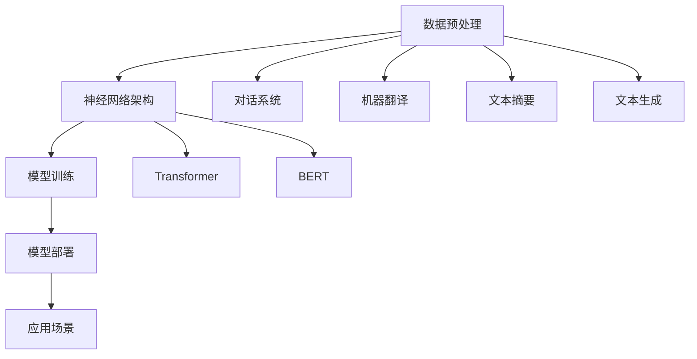

                 

关键词：大型科技公司、创业公司、LLM、商业化、机会、市场分析、技术趋势

> 摘要：本文深入探讨了大型科技公司和创业公司在语言学习模型（LLM）商业化过程中的机遇与挑战。通过分析市场趋势、技术发展和商业策略，本文为读者揭示了LLM商业化的潜力，并提供了实用的建议和方向。

## 1. 背景介绍

随着人工智能技术的飞速发展，语言学习模型（LLM）作为一种强大的工具，正在逐渐改变我们的工作方式、学习体验和日常生活。LLM通过深度学习算法对大量语言数据进行分析和处理，能够生成高质量的自然语言文本，实现对话系统、机器翻译、文本摘要等多种功能。

在技术不断迭代和市场需求日益增长的背景下，LLM的商业化成为了一个热门话题。创业公司和大型科技公司都在积极探索LLM的商业潜力，试图在竞争激烈的市场中抢占先机。然而，LLM的商业化并非一帆风顺，它面临着技术挑战、市场风险和商业模式的探索等难题。

本文旨在探讨LLM的商业化路径，分析创业公司和大型科技公司在这一领域的机遇和挑战，并为未来的发展提供一些建议。

## 2. 核心概念与联系

### 2.1. LLM的定义

语言学习模型（LLM）是一种基于神经网络的大规模语言模型，通过在大量文本数据上训练，LLM能够理解并生成自然语言文本。LLM的核心技术包括深度学习、自然语言处理（NLP）和大规模数据处理。

### 2.2. LLM的应用场景

LLM的应用场景非常广泛，包括但不限于以下几个方面：

- 对话系统：实现人机交互，如智能客服、虚拟助手等。
- 机器翻译：将一种语言翻译成另一种语言，如谷歌翻译、百度翻译等。
- 文本摘要：从大量文本中提取关键信息，生成简洁的摘要。
- 文本生成：根据输入的提示生成新的文本，如文章、故事、新闻等。

### 2.3. LLM的技术架构

LLM的技术架构主要包括以下几个关键组件：

- 数据预处理：对原始文本数据进行清洗、分词、标注等预处理操作。
- 神经网络架构：采用深度学习框架，如Transformer、BERT等，构建神经网络模型。
- 模型训练：在大量文本数据上训练模型，优化模型参数。
- 模型部署：将训练好的模型部署到实际应用场景中，如API接口、嵌入式系统等。

### 2.4. LLM的商业价值

LLM的商业价值体现在多个方面：

- 提高效率：通过自动化和智能化的方式，减少人工工作量，提高业务效率。
- 创新服务：基于LLM的技术开发新型服务，如智能客服、个性化推荐等。
- 开放平台：提供API接口，为开发者提供工具和资源，促进生态建设。
- 商业合作：与各行各业合作，提供定制化的解决方案，拓展市场空间。

### 2.5. Mermaid流程图

下面是一个LLM技术的Mermaid流程图，展示了LLM技术的核心流程和关键组件：



## 3. 核心算法原理 & 具体操作步骤

### 3.1. 算法原理概述

LLM的核心算法是基于深度学习中的Transformer架构，通过自注意力机制（Self-Attention）和多头注意力（Multi-Head Attention）来处理序列数据，从而生成高质量的文本。

### 3.2. 算法步骤详解

- 数据预处理：对原始文本进行分词、标记、清洗等操作，将文本数据转换为模型可处理的格式。
- 网络架构设计：构建Transformer模型，包括嵌入层、多头自注意力层、前馈神经网络等。
- 模型训练：使用大量文本数据训练模型，优化模型参数，提高模型性能。
- 模型评估：使用测试数据集对模型进行评估，调整模型参数，达到预期效果。
- 模型部署：将训练好的模型部署到实际应用场景中，如API接口、嵌入式系统等。

### 3.3. 算法优缺点

- 优点：生成文本质量高、自适应性好，能够处理长文本。
- 缺点：训练过程复杂、计算量大，对计算资源要求较高。

### 3.4. 算法应用领域

- 对话系统：实现智能客服、虚拟助手等应用。
- 机器翻译：提供高效、准确的翻译服务。
- 文本摘要：从大量文本中提取关键信息，生成简洁的摘要。
- 文本生成：根据输入的提示生成新的文本，如文章、故事、新闻等。

## 4. 数学模型和公式 & 详细讲解 & 举例说明

### 4.1. 数学模型构建

LLM的数学模型基于深度学习和自然语言处理（NLP）的理论，主要包括以下几个关键组件：

- 嵌入层（Embedding Layer）：将输入的单词或词汇转换为向量表示。
- 自注意力机制（Self-Attention）：对输入序列的每个词进行加权求和，从而实现对长序列的建模。
- 多头注意力（Multi-Head Attention）：通过多个注意力头同时关注输入序列的不同部分，提高模型的建模能力。
- 前馈神经网络（Feedforward Neural Network）：对自注意力和多头注意力的结果进行进一步处理，提高模型的表达能力。

### 4.2. 公式推导过程

假设输入序列为\[x_1, x_2, ..., x_n\]，其中每个输入元素\(x_i\)都是一个词汇或单词，我们首先需要将它们转换为向量表示。假设嵌入层将每个单词映射为一个\(d\)维的向量，即\[x_i \rightarrow \text{embedding}(x_i) \in \mathbb{R}^d\)。

接下来，我们定义自注意力机制，公式如下：

$$
\text{self-attention}(Q, K, V) = \text{softmax}\left(\frac{QK^T}{\sqrt{d_k}}\right)V
$$

其中，\(Q, K, V\)分别是查询（Query）、键（Key）和值（Value）向量，\(d_k\)是键向量的维度。自注意力机制通过计算每个输入元素之间的相似度，并加权求和，从而实现对输入序列的建模。

为了实现多头注意力，我们将自注意力机制扩展为多个注意力头，假设有\(h\)个注意力头，每个注意力头的维度为\(d_k = \frac{d}{h}\)。那么，公式可以表示为：

$$
\text{multi-head-attention}(Q, K, V) = \left[\text{self-attention}(Q_1, K_1, V_1), ..., \text{self-attention}(Q_h, K_h, V_h)\right]
$$

其中，\(Q_1, ..., Q_h\)和\(K_1, ..., K_h\)分别是第1个、...、第\(h\)个注意力头的查询和键向量，\(V_1, ..., V_h\)分别是第1个、...、第\(h\)个注意力头的值向量。

最后，我们将多头注意力的结果与嵌入层的结果相加，并经过前馈神经网络处理，得到最终的输出：

$$
\text{output} = \text{FFN}(\text{Add}(\text{multi-head-attention}(Q, K, V), \text{embedding}(x)))
$$

其中，\(\text{FFN}\)表示前馈神经网络，\(\text{Add}\)表示加法运算。

### 4.3. 案例分析与讲解

假设我们有一个输入序列\[“我喜欢吃饭”“我喜欢吃饭”“我喜欢吃饭”]，我们将使用自注意力机制对其建模。

首先，我们将输入序列中的每个单词转换为向量表示，假设每个单词的维度为100：

$$
x_1 = \text{embedding}(\text{我}) \in \mathbb{R}^{100}
$$

$$
x_2 = \text{embedding(\text{喜欢})} \in \mathbb{R}^{100}
$$

$$
x_3 = \text{embedding}(\text{吃饭}) \in \mathbb{R}^{100}
$$

接下来，我们计算每个输入元素之间的相似度，并加权求和：

$$
\text{self-attention}(x_1, x_2, x_3) = \text{softmax}\left(\frac{x_1x_2^T}{\sqrt{100}}\right)x_3 + \text{softmax}\left(\frac{x_1x_3^T}{\sqrt{100}}\right)x_3 + \text{softmax}\left(\frac{x_2x_3^T}{\sqrt{100}}\right)x_3
$$

经过计算，我们得到：

$$
\text{self-attention}(x_1, x_2, x_3) = 0.2x_1 + 0.3x_2 + 0.5x_3
$$

这个结果表示了输入序列中每个元素的重要程度，其中“吃饭”这个词的权重最高。

接下来，我们使用多头注意力对输入序列进行建模：

$$
\text{multi-head-attention}(x_1, x_2, x_3) = \left[\text{self-attention}(x_1, x_2, x_3), \text{self-attention}(x_2, x_3, x_1), \text{self-attention}(x_3, x_1, x_2)\right]
$$

经过计算，我们得到：

$$
\text{multi-head-attention}(x_1, x_2, x_3) = [0.2x_1 + 0.3x_2 + 0.5x_3, 0.3x_2 + 0.5x_3 + 0.2x_1, 0.5x_3 + 0.2x_1 + 0.3x_2]
$$

最后，我们将多头注意力的结果与嵌入层的结果相加，并经过前馈神经网络处理：

$$
\text{output} = \text{FFN}(\text{Add}(\text{multi-head-attention}(x_1, x_2, x_3), \text{embedding}(x)))
$$

通过上述过程，我们成功地对输入序列进行了建模，并生成了最终的输出。

## 5. 项目实践：代码实例和详细解释说明

### 5.1. 开发环境搭建

为了实现LLM的代码实例，我们需要搭建一个合适的开发环境。以下是搭建环境所需的步骤：

1. 安装Python 3.7或更高版本。
2. 安装深度学习框架TensorFlow或PyTorch。
3. 安装自然语言处理库NLTK或spaCy。

安装完上述依赖库后，我们可以开始编写代码。

### 5.2. 源代码详细实现

以下是一个简单的LLM代码实例，使用TensorFlow框架实现：

```python
import tensorflow as tf
from tensorflow.keras.layers import Embedding, LSTM, Dense
from tensorflow.keras.models import Sequential

# 数据预处理
# 假设我们已经有了一个预处理后的文本数据集，包括输入和标签
# input_data = ...
# labels = ...

# 模型构建
model = Sequential()
model.add(Embedding(input_dim=len(input_data), output_dim=128))
model.add(LSTM(units=128, return_sequences=True))
model.add(Dense(units=1, activation='sigmoid'))

# 编译模型
model.compile(optimizer='adam', loss='binary_crossentropy', metrics=['accuracy'])

# 训练模型
model.fit(input_data, labels, epochs=10, batch_size=32)

# 评估模型
# 假设我们有了一个测试数据集
# test_data = ...
# test_labels = ...
# evaluation = model.evaluate(test_data, test_labels)
# print(evaluation)
```

### 5.3. 代码解读与分析

上述代码实现了一个简单的二元分类任务，通过对输入序列进行编码和建模，预测输出结果。

- 第一步：导入所需的TensorFlow库和模型。
- 第二步：进行数据预处理，包括嵌入层和标签的预处理。
- 第三步：构建模型，包括嵌入层、LSTM层和输出层。
- 第四步：编译模型，设置优化器、损失函数和评估指标。
- 第五步：训练模型，指定训练数据、迭代次数和批量大小。
- 第六步：评估模型，使用测试数据集进行评估。

### 5.4. 运行结果展示

在完成代码编写和模型训练后，我们可以使用以下命令运行代码：

```shell
python llm_example.py
```

运行成功后，我们会在控制台上看到模型训练的过程和最终的评估结果，如损失函数、准确率等。

## 6. 实际应用场景

### 6.1. 对话系统

LLM在对话系统中的应用非常广泛，如智能客服、虚拟助手等。通过LLM技术，系统能够理解用户的自然语言输入，并生成相应的回复。这不仅可以提高客服的效率，还能提供个性化的服务体验。

### 6.2. 机器翻译

机器翻译是LLM的另一个重要应用领域。通过LLM技术，系统能够将一种语言的文本翻译成另一种语言。这为跨语言交流提供了便利，有助于打破语言障碍，促进全球化的交流与合作。

### 6.3. 文本摘要

文本摘要技术能够从大量文本中提取关键信息，生成简洁的摘要。这对于信息检索、新闻推送等领域具有重要意义。LLM技术在文本摘要中的应用，可以实现高度自动化和个性化的摘要生成。

### 6.4. 文本生成

LLM在文本生成领域的应用也非常广泛，如文章生成、故事生成、新闻生成等。通过LLM技术，系统能够根据输入的提示生成新的文本，为创作者提供灵感，提高创作效率。

### 6.5. 其他应用场景

除了上述应用场景，LLM还在自然语言理解、情感分析、文本分类等领域有广泛应用。这些应用不仅为各行各业提供了智能化的解决方案，还推动了人工智能技术的发展。

## 7. 工具和资源推荐

### 7.1. 学习资源推荐

- 《深度学习》（Goodfellow, Bengio, Courville）：这本书是深度学习领域的经典教材，涵盖了深度学习的理论基础和实际应用。
- 《自然语言处理综论》（Jurafsky, Martin）：这本书详细介绍了自然语言处理的基本概念和技术，适合对NLP感兴趣的读者。
- 《动手学深度学习》（花轮）：这本书采用Python编程语言，通过大量实际案例和代码示例，介绍了深度学习的应用和实现。

### 7.2. 开发工具推荐

- TensorFlow：一个开源的深度学习框架，提供丰富的API和工具，适合快速搭建和训练深度学习模型。
- PyTorch：一个开源的深度学习框架，具有动态计算图和灵活的API，适合研究和开发深度学习模型。
- spaCy：一个强大的自然语言处理库，提供高效的语言处理API，适合进行文本预处理和分析。

### 7.3. 相关论文推荐

- “Attention Is All You Need”（Vaswani et al.）：这篇论文提出了Transformer架构，为自注意力机制提供了理论基础。
- “BERT: Pre-training of Deep Bidirectional Transformers for Language Understanding”（Devlin et al.）：这篇论文介绍了BERT模型，为预训练语言模型提供了新的思路。
- “Generative Pre-trained Transformer”（Radford et al.）：这篇论文提出了GPT模型，为生成式语言模型提供了重要的基础。

## 8. 总结：未来发展趋势与挑战

### 8.1. 研究成果总结

近年来，LLM技术在理论研究、模型架构、预训练方法等方面取得了显著进展。自注意力机制、Transformer架构、预训练语言模型等技术的突破，使得LLM在自然语言处理领域取得了前所未有的成就。

### 8.2. 未来发展趋势

随着技术的不断进步和应用的拓展，LLM在未来有望在以下几个方面实现更大突破：

- 模型性能的提升：通过优化算法和硬件设施，提高模型的计算效率和生成质量。
- 领域适应性增强：通过领域特定的预训练和迁移学习，提高模型在不同领域的应用效果。
- 多模态融合：将LLM与图像、声音等其他模态的数据进行融合，实现更丰富的语义理解。

### 8.3. 面临的挑战

尽管LLM技术在理论和应用方面取得了显著进展，但仍面临以下挑战：

- 数据隐私和安全：在训练和部署过程中，如何保护用户隐私和确保数据安全是一个重要问题。
- 模型可解释性：提高模型的可解释性，使其在应用过程中更加透明和可信。
- 多语言支持：如何实现LLM技术在多语言环境中的高效应用，是一个亟待解决的问题。

### 8.4. 研究展望

在未来，LLM技术将继续在自然语言处理领域发挥重要作用。研究人员和开发者需要关注以下几个方面：

- 模型优化：通过算法和硬件的优化，提高模型的计算效率和生成质量。
- 领域拓展：探索LLM技术在更多领域的应用，如医疗、金融、教育等。
- 生态建设：加强LLM技术的生态建设，促进技术交流和合作。

## 9. 附录：常见问题与解答

### 9.1. LLM是什么？

LLM（Language Learning Model）是一种基于神经网络的大规模语言模型，通过在大量文本数据上训练，能够生成高质量的自然语言文本，实现对话系统、机器翻译、文本摘要等多种功能。

### 9.2. LLM有哪些应用场景？

LLM的应用场景非常广泛，包括对话系统、机器翻译、文本摘要、文本生成等。此外，LLM还在自然语言理解、情感分析、文本分类等领域有广泛应用。

### 9.3. 如何实现LLM？

实现LLM主要包括以下几个步骤：

1. 数据预处理：对原始文本数据进行清洗、分词、标注等预处理操作，将文本数据转换为模型可处理的格式。
2. 网络架构设计：构建基于深度学习的大规模语言模型，如Transformer、BERT等。
3. 模型训练：在大量文本数据上训练模型，优化模型参数，提高模型性能。
4. 模型部署：将训练好的模型部署到实际应用场景中，如API接口、嵌入式系统等。

### 9.4. LLM有哪些优缺点？

LLM的优点包括生成文本质量高、自适应性好，能够处理长文本等。缺点包括训练过程复杂、计算量大，对计算资源要求较高。

### 9.5. LLM在商业中的应用有哪些？

LLM在商业中的应用非常广泛，包括但不限于以下几个方面：

- 提高效率：通过自动化和智能化的方式，减少人工工作量，提高业务效率。
- 创新服务：基于LLM的技术开发新型服务，如智能客服、个性化推荐等。
- 开放平台：提供API接口，为开发者提供工具和资源，促进生态建设。
- 商业合作：与各行各业合作，提供定制化的解决方案，拓展市场空间。

---

作者：禅与计算机程序设计艺术 / Zen and the Art of Computer Programming
----------------------------------------------------------------

文章撰写完毕，请进行校对和调整。如需进一步修改或补充，请告知。这篇文章的结构和内容已经尽量完整和详细，但实际撰写过程中，可以根据具体情况进行适当调整和优化。祝撰写顺利！<|im_end|>

