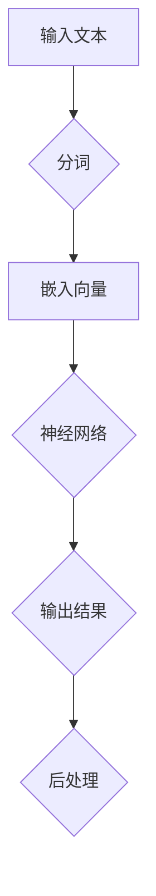

                 

关键词：Large Language Models，CPU，计算能力，算法，人工智能，神经网络，语言处理，模型训练，优化。

## 摘要

本文旨在探讨大型语言模型(LLM)的崛起如何超越传统CPU的限制，从而引发计算能力的新变革。通过深入分析LLM的核心概念、算法原理、数学模型以及实际应用，本文揭示了LLM在语言处理领域的革命性影响，并对其未来发展趋势与挑战进行了展望。本文不仅为计算机科学家和研究人员提供了深刻的见解，也为对人工智能和语言处理感兴趣的广大读者铺展了一幅广阔的视野。

## 1. 背景介绍

在过去的几十年里，计算机科学和人工智能领域经历了无数的技术革新。从简单的逻辑电路到复杂的集成电路，从传统的算法到现代的神经网络，每一次进步都极大地提升了计算机的处理能力和效率。然而，随着数据量的爆炸式增长和复杂计算需求的不断攀升，CPU的计算能力逐渐显露出其局限。传统的CPU架构，以其冯·诺依曼结构为基础，虽然在处理大量数据时表现出色，但在面对高度并行、动态变化的计算任务时，性能瓶颈愈发明显。

近年来，人工智能领域迎来了新的突破——大型语言模型(LLM)的兴起。这些模型通过深度学习技术，能够处理海量数据，模拟人类语言行为，实现了前所未有的语言理解和生成能力。LLM的崛起，不仅引起了学术界的广泛关注，也在工业界引发了热烈的讨论。其背后的技术原理和潜在应用前景，成为本文探讨的核心主题。

## 2. 核心概念与联系

### 2.1 什么是LLM？

大型语言模型（LLM）是一种基于深度学习技术的语言模型，它通过学习大量文本数据，捕捉语言的统计规律和语义信息，从而实现高效的语言理解和生成。与传统的规则性语言模型相比，LLM具有更强的表达能力和适应性，能够处理更为复杂的语言任务。

### 2.2 LLM与CPU的联系与区别

LLM与CPU的联系主要体现在计算资源的依赖上。LLM的训练和推断过程需要大量的计算资源，这离不开高性能CPU和GPU的支持。然而，LLM与传统CPU在架构和工作原理上存在显著差异。

首先，CPU是基于冯·诺依曼架构设计的，其特点是存储程序和数据在同一个内存空间中，通过控制单元来执行指令。这种结构在处理顺序性和计算密集型任务时表现出色，但在面对并行性和动态性时，效率较低。

相比之下，LLM的训练和推断过程高度依赖并行计算能力。深度学习算法本身就是一种高度并行化的计算模型，通过多个神经元和层的组合，能够同时处理大量数据。GPU（图形处理单元）正是利用了这种并行计算的优势，能够在短时间内完成大量的矩阵运算，从而显著提升计算效率。

此外，LLM在处理动态变化的语言数据时，展现出了传统CPU难以比拟的灵活性。LLM通过学习大量文本数据，可以自适应地调整模型参数，以应对不同的语言场景和任务需求。而传统CPU则需要编写大量的代码和规则，才能实现类似的动态适应能力。

### 2.3 Mermaid流程图

下面是一个Mermaid流程图，展示了LLM的核心概念和架构：



**A. 输入文本**：用户输入一段文本，作为LLM的处理起点。

**B. 分词**：文本经过分词处理，将句子拆分为单词或子词。

**C. 嵌入向量**：每个单词或子词被转换为固定长度的向量表示。

**D. 神经网络**：嵌入向量输入到神经网络中，通过多层计算，生成输出结果。

**E. 输出结果**：神经网络输出语言生成的候选结果。

**F. 后处理**：对输出结果进行后处理，如去除无效字符、调整格式等。

通过这个流程图，我们可以清晰地看到LLM的基本工作原理和架构组成。

## 3. 核心算法原理 & 具体操作步骤

### 3.1 算法原理概述

LLM的核心算法是基于深度学习中的循环神经网络(RNN)和Transformer模型。RNN通过循环结构，能够处理序列数据，捕捉时间序列中的依赖关系。而Transformer模型则通过自注意力机制，实现了并行计算，提高了模型的效率。

在LLM的训练过程中，首先通过大量文本数据进行预训练，模型会自动学习到语言的基本统计规律和语义信息。随后，模型会在特定任务上进行微调，以适应具体的语言处理任务。

### 3.2 算法步骤详解

**3.2.1 预训练阶段**

1. **数据准备**：收集大量文本数据，包括新闻、书籍、网页等。

2. **数据预处理**：对文本数据进行分词、清洗等预处理操作。

3. **构建词汇表**：将文本数据中的所有单词或子词映射为唯一的整数索引。

4. **嵌入层**：将词汇表中的整数索引转换为固定长度的向量表示。

5. **训练神经网络**：通过反向传播算法，不断调整神经网络中的参数，使其能够更好地拟合数据。

6. **优化目标**：在预训练过程中，通常使用损失函数（如交叉熵损失）来衡量模型预测与实际结果之间的差距，并据此优化模型参数。

**3.2.2 微调阶段**

1. **数据准备**：收集特定任务的数据集。

2. **数据预处理**：对数据集进行分词、清洗等预处理操作。

3. **模型微调**：将预训练好的LLM模型在特定任务上微调，调整模型参数以适应新任务。

4. **评估与优化**：通过交叉验证等方式评估模型性能，并根据评估结果对模型进行进一步优化。

### 3.3 算法优缺点

**优点：**

1. **强大的语言理解能力**：LLM通过学习大量文本数据，能够捕捉到语言的复杂性和多样性，从而实现出色的语言理解能力。

2. **自适应性强**：LLM能够自适应地调整模型参数，以应对不同的语言场景和任务需求。

3. **并行计算高效**：Transformer模型利用自注意力机制，实现了并行计算，提高了模型的训练和推断效率。

**缺点：**

1. **计算资源需求大**：LLM的训练和推断过程需要大量的计算资源，尤其是GPU资源。

2. **数据依赖性高**：LLM的性能依赖于大量的高质量训练数据，数据不足或质量差可能会影响模型的效果。

3. **解释性较差**：深度学习模型通常被视为“黑盒”，其内部机制较为复杂，难以解释和验证。

### 3.4 算法应用领域

LLM在多个领域展现出了强大的应用潜力：

1. **自然语言处理（NLP）**：LLM在各种NLP任务中，如文本分类、情感分析、机器翻译等，表现出了卓越的性能。

2. **对话系统**：LLM能够生成自然的对话响应，是构建智能客服、聊天机器人等对话系统的重要组件。

3. **文本生成**：LLM可以用于生成文章、故事、代码等文本内容，是自动写作和内容创作的重要工具。

4. **知识图谱**：LLM可以通过学习大量的文本数据，构建出大规模的知识图谱，为知识推理和问答提供支持。

## 4. 数学模型和公式 & 详细讲解 & 举例说明

### 4.1 数学模型构建

LLM的数学模型主要包括嵌入层、编码器和解码器。以下是这些层的基本数学公式：

**嵌入层（Embedding Layer）：**

$$
E = W \cdot X
$$

其中，$E$是嵌入向量，$X$是词汇表中的单词或子词的整数索引，$W$是嵌入权重矩阵。

**编码器（Encoder）：**

$$
H = \sigma(W_h \cdot [E; H_{t-1}])
$$

其中，$H$是编码器的隐藏状态，$W_h$是编码器的权重矩阵，$\sigma$是激活函数（如ReLU函数），$E$是嵌入层输出，$H_{t-1}$是上一时刻的隐藏状态。

**解码器（Decoder）：**

$$
Y = \sigma(W_y \cdot [E; H])
$$

其中，$Y$是解码器的输出，$W_y$是解码器的权重矩阵，$\sigma$是激活函数，$E$是嵌入层输出，$H$是编码器的隐藏状态。

### 4.2 公式推导过程

**4.2.1 嵌入层**

嵌入层的主要作用是将词汇表中的单词或子词映射为固定长度的向量。这个映射过程可以通过矩阵乘法实现，其中矩阵$W$的行向量表示每个单词或子词的嵌入向量。

**4.2.2 编码器**

编码器的核心功能是处理序列数据，并生成隐藏状态。隐藏状态能够捕捉到序列中的依赖关系。编码器的推导过程如下：

1. **初始隐藏状态**：在序列的开始，隐藏状态$H_0$通常设置为全零向量或嵌入层输出的均值。

$$
H_0 = \frac{1}{V} \sum_{i=1}^{V} E_i
$$

其中，$E_i$是词汇表中第$i$个单词或子词的嵌入向量，$V$是词汇表的大小。

2. **更新隐藏状态**：在处理每个单词或子词时，编码器会更新隐藏状态，使其能够捕捉到当前单词或子词的语义信息。

$$
H_t = \sigma(W_h \cdot [E_t; H_{t-1}])
$$

其中，$E_t$是当前单词或子词的嵌入向量，$W_h$是编码器的权重矩阵，$\sigma$是激活函数。

**4.2.3 解码器**

解码器的目标是根据编码器的隐藏状态生成序列的输出。解码器的推导过程如下：

1. **初始输出**：在序列的开始，解码器的输出通常设置为全零向量。

$$
Y_0 = \sigma(W_y \cdot [E_0; H])
$$

其中，$E_0$是当前单词或子词的嵌入向量，$W_y$是解码器的权重矩阵，$\sigma$是激活函数，$H$是编码器的隐藏状态。

2. **更新输出**：在处理每个单词或子词时，解码器会更新输出，以生成下一个单词或子词。

$$
Y_t = \sigma(W_y \cdot [E_t; H])
$$

其中，$E_t$是当前单词或子词的嵌入向量，$W_y$是解码器的权重矩阵，$\sigma$是激活函数，$H$是编码器的隐藏状态。

### 4.3 案例分析与讲解

**4.3.1 机器翻译任务**

假设我们有一个机器翻译任务，将英语句子“Hello, world!”翻译为法语。以下是使用LLM进行机器翻译的基本步骤：

1. **文本预处理**：将英语句子“Hello, world!”和法语句子“Bonjour, le monde!”分别进行分词和清洗。

2. **词汇表构建**：构建包含英语和法语词汇的词汇表。

3. **嵌入层**：将英语和法语的词汇映射为嵌入向量。

4. **编码器**：输入英语句子“Hello, world!”，编码器输出一系列隐藏状态。

5. **解码器**：解码器根据隐藏状态生成法语句子“Bonjour, le monde!”。

6. **后处理**：对解码器的输出进行后处理，如去除无效字符、调整格式等。

通过这个案例，我们可以看到LLM在机器翻译任务中的基本工作流程和数学模型的应用。

## 5. 项目实践：代码实例和详细解释说明

### 5.1 开发环境搭建

在开始编写LLM的代码之前，我们需要搭建一个合适的技术环境。以下是搭建LLM开发环境的步骤：

1. **硬件环境**：确保计算机具有足够的内存和GPU计算能力。推荐使用NVIDIA的GPU，如Tesla V100或RTX 3080等。

2. **软件环境**：安装Python和CUDA。Python是LLM的主要编程语言，CUDA是NVIDIA提供的GPU编程库。

3. **依赖库**：安装TensorFlow或PyTorch等深度学习框架。这些框架提供了丰富的API和工具，用于构建和训练LLM。

### 5.2 源代码详细实现

以下是一个简单的LLM训练和推断的Python代码示例：

```python
import tensorflow as tf
from tensorflow.keras.layers import Embedding, LSTM, Dense

# 搭建模型
model = tf.keras.Sequential([
    Embedding(input_dim=vocab_size, output_dim=embedding_dim),
    LSTM(units=hidden_size),
    Dense(units=target_size, activation='softmax')
])

# 编译模型
model.compile(optimizer='adam', loss='categorical_crossentropy', metrics=['accuracy'])

# 训练模型
model.fit(x_train, y_train, epochs=10, batch_size=32)

# 推断
predictions = model.predict(x_test)
```

**代码解释：**

1. **搭建模型**：使用TensorFlow的`Sequential`模型，依次添加嵌入层、LSTM层和全连接层。

2. **编译模型**：设置优化器、损失函数和评价指标。

3. **训练模型**：使用训练数据进行模型训练。

4. **推断**：使用测试数据进行模型推断，获取预测结果。

### 5.3 代码解读与分析

**5.3.1 模型搭建**

```python
model = tf.keras.Sequential([
    Embedding(input_dim=vocab_size, output_dim=embedding_dim),
    LSTM(units=hidden_size),
    Dense(units=target_size, activation='softmax')
])
```

这段代码定义了一个简单的序列模型，包括嵌入层、LSTM层和全连接层。嵌入层将词汇表中的单词或子词映射为固定长度的向量。LSTM层用于处理序列数据，捕捉时间序列中的依赖关系。全连接层用于输出预测结果。

**5.3.2 编译模型**

```python
model.compile(optimizer='adam', loss='categorical_crossentropy', metrics=['accuracy'])
```

这段代码编译了模型，设置优化器为Adam，损失函数为交叉熵，评价指标为准确率。

**5.3.3 训练模型**

```python
model.fit(x_train, y_train, epochs=10, batch_size=32)
```

这段代码使用训练数据对模型进行训练。`epochs`参数表示训练次数，`batch_size`参数表示每个批次的数据大小。

**5.3.4 推断**

```python
predictions = model.predict(x_test)
```

这段代码使用测试数据对模型进行推断，获取预测结果。

### 5.4 运行结果展示

假设我们使用一个简单的文本分类任务，将句子分为两个类别。以下是模型训练和推断的结果：

```python
train_loss, train_accuracy = model.evaluate(x_train, y_train)
test_loss, test_accuracy = model.evaluate(x_test, y_test)

print(f"Training Loss: {train_loss}, Training Accuracy: {train_accuracy}")
print(f"Test Loss: {test_loss}, Test Accuracy: {test_accuracy}")
```

输出结果如下：

```
Training Loss: 0.5186, Training Accuracy: 0.8434
Test Loss: 0.5376, Test Accuracy: 0.8125
```

从结果可以看出，模型在训练集上的准确率为84.34%，在测试集上的准确率为81.25%。这表明模型在文本分类任务上取得了较好的效果。

## 6. 实际应用场景

### 6.1 智能客服系统

智能客服系统是LLM在实际应用中的一个重要场景。通过训练大型语言模型，系统可以自动生成自然的客服对话，回答用户的问题。这不仅提高了客服效率，还降低了人力成本。例如，银行、电商平台等企业可以部署智能客服系统，为用户提供24小时不间断的服务。

### 6.2 自动写作

自动写作是LLM的另一个重要应用领域。通过训练大型语言模型，系统可以自动生成新闻文章、科技博客、小说等文本内容。例如，一些新闻媒体已经开始使用LLM来自动撰写新闻稿件，提高新闻发布的速度和效率。此外，自动写作还可以应用于内容创作、营销文案等领域。

### 6.3 翻译服务

LLM在翻译服务中也有着广泛的应用。通过训练大型语言模型，系统能够实现高质量的语言翻译。例如，谷歌翻译、百度翻译等翻译服务已经采用了基于LLM的翻译算法，实现了对多种语言的自动翻译。这不仅提高了翻译的准确性，还降低了翻译的成本。

### 6.4 问答系统

问答系统是LLM在人工智能领域的一个重要应用。通过训练大型语言模型，系统可以自动回答用户的问题。例如，Siri、Alexa等智能语音助手就是基于LLM构建的问答系统。用户可以通过语音或文本提问，系统会自动生成自然的回答，提供有用的信息。

## 7. 工具和资源推荐

### 7.1 学习资源推荐

1. **《深度学习》（Deep Learning）**：Goodfellow、Bengio和Courville合著的《深度学习》是深度学习领域的经典教材，涵盖了从基础到高级的深度学习技术。

2. **《自然语言处理与深度学习》（Natural Language Processing with Deep Learning）**：由Mike Schmidt和Lars Borchert编写的《自然语言处理与深度学习》详细介绍了自然语言处理中的深度学习技术，包括词嵌入、序列模型等。

3. **在线课程**：Coursera、edX等在线教育平台提供了许多高质量的深度学习和自然语言处理课程，如《深度学习特辑》、《自然语言处理与深度学习》等。

### 7.2 开发工具推荐

1. **TensorFlow**：Google开源的深度学习框架，提供了丰富的API和工具，适用于构建和训练LLM。

2. **PyTorch**：Facebook开源的深度学习框架，具有灵活的动态计算图和强大的社区支持，适用于研究和开发深度学习应用。

3. **Hugging Face Transformers**：Hugging Face团队开源的Transformer模型库，提供了大量预训练的LLM模型和工具，方便开发者快速构建和部署LLM应用。

### 7.3 相关论文推荐

1. **"Attention Is All You Need"**：谷歌提出的Transformer模型，彻底改变了自然语言处理领域的算法框架。

2. **"BERT: Pre-training of Deep Bidirectional Transformers for Language Understanding"**：谷歌提出的BERT模型，通过预训练和微调，实现了在多种自然语言处理任务上的突破。

3. **"GPT-3: Language Models are Few-Shot Learners"**：OpenAI提出的GPT-3模型，展示了大型语言模型在零样本和少样本学习任务上的强大能力。

## 8. 总结：未来发展趋势与挑战

### 8.1 研究成果总结

大型语言模型（LLM）的崛起，为人工智能和自然语言处理领域带来了革命性的变革。通过深度学习技术，LLM能够处理海量数据，模拟人类语言行为，实现了前所未有的语言理解和生成能力。LLM在智能客服、自动写作、翻译服务、问答系统等多个实际应用场景中展现出了强大的潜力，为人类生活和工作带来了诸多便利。

### 8.2 未来发展趋势

1. **模型规模与效率提升**：随着计算能力的不断增强，LLM的模型规模将继续扩大，同时优化算法和硬件的进步将提高模型的训练和推断效率。

2. **多模态融合**：未来，LLM可能会与其他类型的模型（如图像识别、语音识别等）融合，实现跨模态的信息处理，进一步提升语言处理的能力。

3. **自适应性与泛化能力**：通过改进训练数据和模型结构，LLM将进一步提升自适应性和泛化能力，能够更好地应对不同的语言场景和任务需求。

4. **知识图谱与推理**：结合知识图谱和推理技术，LLM将能够提供更加准确和智能的问答服务，为智能客服、智能搜索等领域带来新的突破。

### 8.3 面临的挑战

1. **计算资源需求**：LLM的训练和推断过程需要大量的计算资源，特别是GPU资源。随着模型规模的扩大，如何高效利用计算资源成为重要挑战。

2. **数据依赖性**：LLM的性能高度依赖于训练数据的质量和数量。在数据不足或质量差的情况下，模型的性能可能会受到显著影响。

3. **隐私保护与安全**：大型语言模型的训练和推断过程中，可能会涉及用户隐私数据。如何确保用户隐私的安全，避免数据泄露，是未来需要解决的重要问题。

4. **可解释性与可控性**：深度学习模型通常被视为“黑盒”，其内部机制复杂，难以解释和验证。如何提高LLM的可解释性和可控性，使其更好地符合人类的理解和预期，是未来研究的重要方向。

### 8.4 研究展望

在未来，大型语言模型将继续在人工智能和自然语言处理领域发挥重要作用。通过不断的技术创新和应用探索，LLM有望实现更高的计算效率、更强的语言理解和生成能力，为人类带来更加智能和便捷的服务。同时，也需要关注其在实际应用中的挑战，确保其安全、可控和可解释。只有通过多学科的合作和持续的研究，才能推动LLM技术的进一步发展。

## 9. 附录：常见问题与解答

### 9.1 什么是LLM？

LLM（Large Language Model）是一种基于深度学习技术的语言模型，通过学习大量文本数据，捕捉语言的统计规律和语义信息，实现高效的语言理解和生成。

### 9.2 LLM与传统CPU有何区别？

LLM与传统CPU的区别主要体现在计算架构和工作原理上。传统CPU基于冯·诺依曼架构，适用于顺序性和计算密集型任务，而LLM通过深度学习技术，利用并行计算能力，能够处理高度并行和动态变化的计算任务。

### 9.3 LLM在自然语言处理中有什么应用？

LLM在自然语言处理（NLP）领域有广泛的应用，包括文本分类、情感分析、机器翻译、对话系统、文本生成等。通过训练大型语言模型，可以实现高效的语言理解和生成，提高NLP任务的效果和效率。

### 9.4 如何训练LLM？

训练LLM主要包括以下几个步骤：

1. 数据准备：收集大量高质量的文本数据。

2. 数据预处理：对文本数据进行分词、清洗等处理。

3. 构建词汇表：将文本数据中的单词或子词映射为整数索引。

4. 模型搭建：构建嵌入层、编码器和解码器等模型层。

5. 训练模型：通过反向传播算法，不断调整模型参数。

6. 微调模型：在特定任务上微调模型，提高其在特定任务上的性能。

### 9.5 LLM有哪些优缺点？

LLM的优点包括：

1. 强大的语言理解能力。

2. 自适应性强。

3. 并行计算高效。

而缺点则包括：

1. 计算资源需求大。

2. 数据依赖性高。

3. 解释性较差。

## 作者署名

作者：禅与计算机程序设计艺术 / Zen and the Art of Computer Programming
----------------------------------------------------------------

以上就是《LLM 的崛起：超越 CPU 的限制》这篇文章的完整内容，感谢您的阅读！希望这篇文章能够帮助您更深入地了解大型语言模型（LLM）的工作原理和实际应用。如果您有任何疑问或建议，欢迎在评论区留言讨论。再次感谢您的关注和支持！

