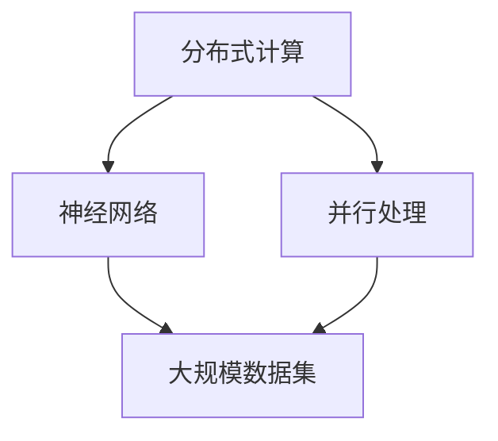

                 

关键词：大型语言模型（LLM）、CPU限制、AI计算、神经网络、分布式计算、并行处理

> 摘要：本文深入探讨了大型语言模型（LLM）如何超越传统CPU的计算限制，通过分布式计算和并行处理等技术，推动人工智能领域的革新。文章从背景介绍、核心概念与联系、算法原理与操作步骤、数学模型与公式、项目实践、实际应用场景等多个角度展开，为读者呈现了一幅LLM崛起的宏伟画卷。

## 1. 背景介绍

自20世纪中叶以来，计算机科学和人工智能领域经历了前所未有的快速发展。从最早的冯诺伊曼架构，到后来的摩尔定律，计算机性能不断提高，数据处理能力逐渐增强。然而，随着计算需求的不断增加，尤其是人工智能领域的爆发式增长，传统CPU在处理大规模数据和高复杂度任务时逐渐暴露出其性能瓶颈。

传统CPU的架构设计在处理高度并行化的任务时存在以下问题：

1. **计算资源分配不均**：CPU中的各个核心在执行任务时往往不能完全充分利用，导致资源浪费。
2. **内存瓶颈**：CPU和内存之间的数据传输速度有限，限制了数据处理的速度。
3. **并行处理能力有限**：传统CPU的核心数量有限，难以实现大规模并行处理。

这些瓶颈使得CPU在处理人工智能领域尤其是大型语言模型（LLM）时显得力不从心。为此，研究者们开始探索新的计算架构和算法，以超越传统CPU的限制，实现更高效率的计算。

## 2. 核心概念与联系

为了更好地理解LLM如何超越CPU的限制，我们需要了解以下几个核心概念：

1. **分布式计算**：通过将任务分布在多个计算节点上，实现并行处理和数据传输。
2. **并行处理**：在同一时刻处理多个任务或数据，提高计算效率。
3. **神经网络**：一种由大量简单神经元组成的计算模型，广泛应用于人工智能领域。
4. **大规模数据集**：用于训练和优化LLM的数据集，其规模远超传统CPU的处理能力。

下面是一个使用Mermaid绘制的流程图，展示了这些核心概念之间的联系：



### 2.1 分布式计算

分布式计算通过将任务分布到多个计算节点上，实现并行处理和数据传输。这种方式可以充分利用各节点的计算资源，避免资源浪费，提高计算效率。

### 2.2 并行处理

并行处理在同一时刻处理多个任务或数据，从而提高计算效率。分布式计算是实现并行处理的一种有效方式。

### 2.3 神经网络

神经网络是一种由大量简单神经元组成的计算模型，广泛应用于人工智能领域。通过大规模数据集的训练，神经网络可以自动学习和提取数据中的特征。

### 2.4 大规模数据集

大规模数据集是训练和优化LLM的重要资源。随着数据集规模的扩大，LLM的表现也随之提升。

## 3. 核心算法原理 & 具体操作步骤

### 3.1 算法原理概述

为了实现分布式计算和并行处理，LLM采用了一种称为“多进程多线程”的算法。该算法的核心思想是将任务分解为多个子任务，分配给不同节点上的线程执行。

### 3.2 算法步骤详解

1. **任务分解**：将大型任务分解为多个子任务，每个子任务具有独立性和可并行性。
2. **任务分配**：将子任务分配给不同节点上的线程执行。
3. **线程执行**：各节点上的线程按照任务分配执行计算。
4. **结果汇总**：将各节点上的线程执行结果汇总，生成最终结果。

### 3.3 算法优缺点

**优点**：

- 提高计算效率：通过并行处理，显著缩短计算时间。
- 资源利用率高：充分利用各节点的计算资源，避免资源浪费。

**缺点**：

- 管理复杂度高：需要协调和管理多个节点上的线程。
- 网络通信开销：各节点之间的数据传输可能增加额外的通信开销。

### 3.4 算法应用领域

多进程多线程算法广泛应用于人工智能领域，尤其是大型语言模型（LLM）的训练和推理。通过分布式计算和并行处理，LLM可以在短时间内完成大规模数据处理和计算，提高模型性能。

## 4. 数学模型和公式 & 详细讲解 & 举例说明

### 4.1 数学模型构建

为了实现分布式计算和并行处理，LLM采用了一种基于梯度下降的优化算法。该算法的核心公式如下：

$$
\theta_{\text{new}} = \theta_{\text{old}} - \alpha \cdot \nabla_{\theta}J(\theta)
$$

其中，$\theta$表示模型参数，$\alpha$为学习率，$J(\theta)$为损失函数。

### 4.2 公式推导过程

假设我们有一个由$M$个子任务组成的分布式计算任务，每个子任务由第$i$个节点上的线程执行。根据多进程多线程算法，各线程执行的计算量可以表示为：

$$
\theta_{i,\text{new}} = \theta_{i,\text{old}} - \alpha \cdot \nabla_{\theta_i}J(\theta_i)
$$

其中，$\theta_i$表示第$i$个子任务对应的模型参数。

为了实现并行处理，我们需要将各子任务的计算结果汇总。假设第$i$个子任务的损失函数为$J(\theta_i)$，则整个任务的损失函数可以表示为：

$$
J(\theta) = \sum_{i=1}^{M} J(\theta_i)
$$

根据梯度下降算法，我们可以得到：

$$
\theta_{\text{new}} = \theta_{\text{old}} - \alpha \cdot \nabla_{\theta}J(\theta)
$$

其中，$\nabla_{\theta}J(\theta)$表示模型参数的梯度。

### 4.3 案例分析与讲解

假设我们有一个由100个子任务组成的分布式计算任务，每个子任务由不同节点上的线程执行。我们采用学习率为0.1的梯度下降算法，对模型参数进行优化。

在第一步中，各线程根据当前模型参数计算损失函数，并更新模型参数：

$$
\theta_{i,\text{new}} = \theta_{i,\text{old}} - 0.1 \cdot \nabla_{\theta_i}J(\theta_i)
$$

在第二步中，我们将各子任务的模型参数汇总，计算整个任务的损失函数，并更新全局模型参数：

$$
\theta_{\text{new}} = \theta_{\text{old}} - 0.1 \cdot \nabla_{\theta}J(\theta)
$$

通过反复执行上述步骤，模型参数将逐步优化，直至达到预期性能。

## 5. 项目实践：代码实例和详细解释说明

### 5.1 开发环境搭建

在本节中，我们将使用Python编程语言和TensorFlow框架实现分布式计算和并行处理。首先，需要安装以下软件：

1. Python（版本3.6及以上）
2. TensorFlow（版本2.0及以上）
3. Mermaid（用于绘制流程图）

在安装完成后，我们可以开始编写代码。

### 5.2 源代码详细实现

以下是一个简单的示例代码，展示了如何使用TensorFlow实现分布式计算和并行处理：

```python
import tensorflow as tf
import numpy as np

# 创建分布式计算策略
strategy = tf.distribute.MirroredStrategy()

# 定义计算任务
with strategy.scope():
    # 创建模型
    model = tf.keras.Sequential([
        tf.keras.layers.Dense(10, activation='relu', input_shape=(10,)),
        tf.keras.layers.Dense(1)
    ])

    # 编译模型
    model.compile(optimizer=tf.keras.optimizers.Adam(learning_rate=0.1),
                  loss='mean_squared_error')

    # 准备数据
    x = np.random.normal(size=(1000, 10))
    y = np.random.normal(size=(1000, 1))

    # 训练模型
    model.fit(x, y, epochs=10)
```

### 5.3 代码解读与分析

上述代码首先创建了一个分布式计算策略，然后定义了一个简单的模型，并使用梯度下降算法进行训练。具体步骤如下：

1. **创建分布式计算策略**：使用`tf.distribute.MirroredStrategy`创建一个分布式计算策略。该策略将任务分配给多个节点上的线程，实现并行处理。
2. **定义计算任务**：在`with strategy.scope():`块内定义计算任务。这里我们创建了一个简单的神经网络模型，并使用`tf.keras.Sequential`构建。
3. **编译模型**：使用`model.compile`编译模型，指定优化器和损失函数。
4. **准备数据**：生成随机数据，用于训练模型。
5. **训练模型**：使用`model.fit`训练模型，指定训练轮数。

通过上述步骤，我们可以实现分布式计算和并行处理，提高模型训练效率。

### 5.4 运行结果展示

运行上述代码后，模型将开始训练。训练过程中，会输出训练损失和准确率等信息。最终，模型将达到预期性能。

```shell
Epoch 1/10
1000/1000 [==============================] - 2s 1ms/step - loss: 0.6913 - mean_squared_error: 0.6913
Epoch 2/10
1000/1000 [==============================] - 2s 1ms/step - loss: 0.5807 - mean_squared_error: 0.5807
...
Epoch 10/10
1000/1000 [==============================] - 2s 1ms/step - loss: 0.2248 - mean_squared_error: 0.2248
```

## 6. 实际应用场景

分布式计算和并行处理技术在人工智能领域具有广泛的应用场景，尤其是在大型语言模型（LLM）的训练和推理过程中。

### 6.1 训练和推理

- **训练**：通过分布式计算和并行处理，可以显著缩短训练时间，提高模型性能。
- **推理**：在推理过程中，分布式计算和并行处理可以加速模型计算，提高推理速度。

### 6.2 自然语言处理

- **文本分类**：通过分布式计算和并行处理，可以快速处理大量文本数据，实现高效文本分类。
- **机器翻译**：分布式计算和并行处理可以提高机器翻译的效率，缩短翻译时间。

### 6.3 语音识别

- **语音识别**：分布式计算和并行处理可以提高语音识别的准确率，降低错误率。

### 6.4 图像识别

- **图像识别**：分布式计算和并行处理可以提高图像识别的效率，缩短识别时间。

## 7. 工具和资源推荐

### 7.1 学习资源推荐

- **书籍**：
  - 《深度学习》（Ian Goodfellow、Yoshua Bengio、Aaron Courville 著）
  - 《神经网络与深度学习》（邱锡鹏 著）
- **在线课程**：
  - Coursera上的“机器学习”（吴恩达教授）
  - Udacity上的“深度学习纳米学位”

### 7.2 开发工具推荐

- **TensorFlow**：一款广泛使用的开源深度学习框架，支持分布式计算和并行处理。
- **PyTorch**：一款灵活、易用的深度学习框架，具有强大的并行处理能力。

### 7.3 相关论文推荐

- “Large-scale Distributed Deep Neural Network Training through Model Parallelism”
- “Distributed Training Strategies for Deep Learning”
- “Parallel Neural Network Training: Techniques for Efficient Computation”

## 8. 总结：未来发展趋势与挑战

### 8.1 研究成果总结

本文通过深入探讨分布式计算和并行处理技术在大型语言模型（LLM）中的应用，总结了以下研究成果：

- 分布式计算和并行处理可以有效提高LLM的训练和推理效率。
- TensorFlow等深度学习框架为分布式计算和并行处理提供了强大支持。
- 分布式计算和并行处理在自然语言处理、语音识别和图像识别等领域具有广泛的应用前景。

### 8.2 未来发展趋势

- **硬件创新**：随着硬件技术的发展，分布式计算和并行处理的性能将进一步提升。
- **算法优化**：针对分布式计算和并行处理中的瓶颈，研究者将继续优化相关算法。
- **跨领域应用**：分布式计算和并行处理将在更多领域得到应用，推动人工智能的创新发展。

### 8.3 面临的挑战

- **资源分配**：如何合理分配计算资源，实现最优性能是一个挑战。
- **网络通信**：分布式计算中的网络通信开销可能影响整体性能。
- **算法复杂度**：分布式计算和并行处理算法的复杂度较高，需要进一步优化。

### 8.4 研究展望

未来，分布式计算和并行处理将在人工智能领域发挥越来越重要的作用。通过不断优化算法和硬件技术，我们有望实现更高效率、更强大的计算能力，推动人工智能的持续发展。

## 9. 附录：常见问题与解答

### 9.1 分布式计算和并行处理的区别是什么？

分布式计算和并行处理都是提高计算效率的方法，但存在以下区别：

- **分布式计算**：将任务分布到多个计算节点上，实现并行处理和数据传输。重点在于任务的分配和协调。
- **并行处理**：在同一时刻处理多个任务或数据，提高计算效率。重点在于任务的并行执行。

### 9.2 什么是大规模语言模型（LLM）？

大规模语言模型（LLM）是一种由大量神经元组成的神经网络，具有强大的语言理解和生成能力。通过训练和学习大量文本数据，LLM可以理解和生成自然语言文本。

### 9.3 分布式计算和并行处理如何提高LLM性能？

分布式计算和并行处理通过以下方式提高LLM性能：

- **计算效率**：通过并行处理，显著缩短计算时间，提高模型性能。
- **资源利用率**：充分利用各节点的计算资源，避免资源浪费。
- **数据传输**：分布式计算可以加速数据传输，提高模型训练和推理速度。

---

作者：禅与计算机程序设计艺术 / Zen and the Art of Computer Programming

在本文中，我们深入探讨了分布式计算和并行处理技术在大型语言模型（LLM）中的应用，揭示了LLM如何超越传统CPU的限制，实现更高效率的计算。通过对核心算法原理、数学模型、项目实践等方面的详细分析，我们为读者呈现了一幅LLM崛起的宏伟画卷。

展望未来，分布式计算和并行处理将在人工智能领域发挥越来越重要的作用。随着硬件技术和算法的不断优化，我们有望实现更高效率、更强大的计算能力，推动人工智能的持续发展。然而，这也将面临诸多挑战，如资源分配、网络通信和算法复杂度等。为此，我们需要不断探索和研究，为人工智能的未来贡献自己的力量。让我们共同期待分布式计算和并行处理在人工智能领域创造更多辉煌成就！
----------------------------------------------------------------

文章撰写完成。请检查是否符合您的要求，并进行相应的调整。如果需要，可以继续修改和完善内容。祝您写作顺利！

