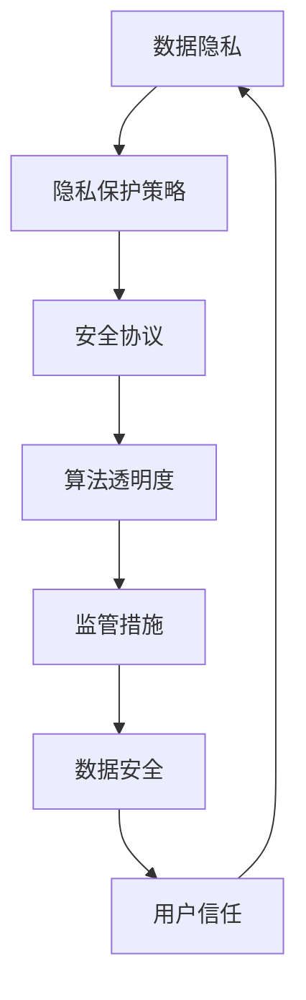

                 

关键词：大型语言模型（LLM），数据安全，隐私保护，监管措施，安全协议，算法透明度

>摘要：本文将探讨在大型语言模型（LLM）应用日益广泛的背景下，如何通过有效的监管措施来保障数据安全。文章首先介绍了LLM的基本原理和应用场景，然后分析了当前面临的数据安全挑战，最后提出了针对LLM的监管措施，包括数据隐私保护、安全协议和算法透明度等方面的策略，以期为LLM的健康发展提供参考。

## 1. 背景介绍

随着深度学习和自然语言处理技术的不断发展，大型语言模型（LLM）如BERT、GPT等在众多领域取得了显著的成果。LLM能够理解和生成人类语言，大大提升了计算机与人类交互的效率和质量。然而，LLM的应用也带来了新的挑战，尤其是数据安全问题。

### 1.1 LLM的基本原理

LLM是基于深度学习技术，特别是神经网络模型进行训练的。通过大规模的文本数据进行预训练，LLM能够捕捉到语言中的复杂模式和规律。这种能力使得LLM在文本生成、机器翻译、问答系统等任务中表现出色。

### 1.2 LLM的应用场景

LLM在多个领域都有广泛应用，包括但不限于：

- 自然语言处理：如文本分类、情感分析、信息提取等。
- 问答系统：如智能客服、搜索引擎等。
- 机器翻译：如自动翻译、多语言交互等。
- 生成式内容创作：如文章写作、故事生成等。

### 1.3 数据安全问题

LLM的训练和推理过程涉及大量敏感数据，如个人隐私信息、企业机密等。如果这些数据没有得到妥善保护，可能会被恶意利用，导致严重的安全问题和隐私泄露。此外，LLM的强大能力也使得其成为网络攻击的目标，如通过生成虚假信息进行网络诈骗、操纵舆论等。

## 2. 核心概念与联系

在讨论LLM的数据安全监管措施之前，我们需要了解一些核心概念，包括数据隐私、安全协议和算法透明度。以下是这些概念之间的联系和交互关系的Mermaid流程图：



### 2.1 数据隐私

数据隐私是指个人或组织的数据不被未经授权的第三方访问、使用或泄露。在LLM应用中，数据隐私尤为重要，因为模型训练和推理过程中可能会接触到敏感信息。

### 2.2 安全协议

安全协议是确保数据在传输和存储过程中不被恶意篡改或窃取的技术手段。常见的安全协议包括加密、认证和授权等。

### 2.3 算法透明度

算法透明度是指算法的设计、训练和推理过程是可解释和可审计的。这有助于用户了解LLM的行为，增加对模型的信任。

### 2.4 监管措施

监管措施是指政府、企业和研究机构采取的一系列措施来保障数据安全。这些措施包括制定法规、建立标准和进行监督等。

## 3. 核心算法原理 & 具体操作步骤

### 3.1 算法原理概述

LLM的核心算法是基于变换器（Transformer）架构的深度学习模型。Transformer模型通过自注意力机制（Self-Attention）来捕捉文本中的长距离依赖关系，从而实现高效的文本处理。在LLM中，这些模型经过大规模预训练，并使用特定任务的数据进行微调。

### 3.2 算法步骤详解

1. **数据预处理**：收集和清洗大规模的文本数据，将其转化为模型可接受的格式。
2. **模型训练**：使用预训练算法（如BERT或GPT）对模型进行训练，使其能够捕捉到语言中的复杂模式。
3. **模型评估**：在验证集上评估模型性能，确保其达到预期的效果。
4. **模型微调**：使用特定任务的数据对模型进行微调，以提高模型在该任务上的性能。
5. **模型部署**：将训练好的模型部署到实际应用中，如问答系统、文本生成等。

### 3.3 算法优缺点

**优点**：

- **高效性**：Transformer模型的自注意力机制使得LLM在文本处理任务中表现出色，具有很高的计算效率。
- **灵活性**：LLM可以通过微调来适应各种不同的任务，具有良好的通用性。

**缺点**：

- **数据隐私**：LLM的训练和推理过程中可能会接触到大量敏感数据，存在数据泄露的风险。
- **模型透明度**：LLM的内部结构和决策过程较为复杂，难以解释，影响用户信任。

### 3.4 算法应用领域

LLM在以下领域有广泛应用：

- 自然语言处理：如文本分类、情感分析、信息提取等。
- 问答系统：如智能客服、搜索引擎等。
- 机器翻译：如自动翻译、多语言交互等。
- 生成式内容创作：如文章写作、故事生成等。

## 4. 数学模型和公式 & 详细讲解 & 举例说明

### 4.1 数学模型构建

LLM的核心是变换器模型（Transformer），其关键组件是多头自注意力机制（Multi-Head Self-Attention）。以下是多头自注意力机制的数学公式：

$$
\text{Attention}(Q, K, V) = \text{softmax}\left(\frac{QK^T}{\sqrt{d_k}}\right) V
$$

其中，$Q, K, V$ 分别是查询（Query）、键（Key）和值（Value）向量，$d_k$ 是键向量的维度。这个公式表示对于每个查询向量，通过计算其与所有键向量的点积，然后使用softmax函数生成权重，最后将这些权重与对应的值向量相乘，得到输出。

### 4.2 公式推导过程

多头自注意力机制通过将输入向量分解为多个子向量，并在每个子向量上独立应用自注意力机制，从而提高模型的捕捉能力。具体推导如下：

1. **输入向量分解**：将输入向量 $X$ 分解为多个子向量 $X_1, X_2, ..., X_n$。
2. **计算查询、键和值**：对于每个子向量 $X_i$，计算对应的查询、键和值向量 $Q_i, K_i, V_i$。
3. **计算点积**：计算每个查询向量与所有键向量的点积，得到权重矩阵 $W$。
4. **应用softmax函数**：对权重矩阵 $W$ 进行softmax变换，得到概率分布 $P$。
5. **加权求和**：将概率分布 $P$ 与对应的值向量相乘，并求和，得到输出向量。

### 4.3 案例分析与讲解

假设有一个长度为 $n$ 的输入序列 $X = [x_1, x_2, ..., x_n]$，我们将其分解为两个子向量 $X_1 = [x_1, x_2]$ 和 $X_2 = [x_3, x_4]$。然后，我们计算查询、键和值向量：

$$
Q_1 = [1, 0], \quad K_1 = [0, 1], \quad V_1 = [1, 1]
$$

$$
Q_2 = [0, 1], \quad K_2 = [1, 0], \quad V_2 = [1, 0]
$$

接下来，计算点积：

$$
Q_1K_1^T = \begin{bmatrix} 1 \\ 0 \end{bmatrix} \begin{bmatrix} 0 & 1 \end{bmatrix} = \begin{bmatrix} 0 & 1 \\ 0 & 0 \end{bmatrix}
$$

$$
Q_2K_2^T = \begin{bmatrix} 0 & 1 \end{bmatrix} \begin{bmatrix} 1 \\ 0 \end{bmatrix} = \begin{bmatrix} 0 & 0 \\ 1 & 0 \end{bmatrix}
$$

然后，计算softmax概率分布：

$$
P_1 = \text{softmax}(Q_1K_1^T) = \begin{bmatrix} \frac{1}{2} & \frac{1}{2} \\ 0 & 0 \end{bmatrix}
$$

$$
P_2 = \text{softmax}(Q_2K_2^T) = \begin{bmatrix} 0 & 0 \\ \frac{1}{2} & \frac{1}{2} \end{bmatrix}
$$

最后，计算输出向量：

$$
O_1 = P_1V_1 = \begin{bmatrix} \frac{1}{2} & \frac{1}{2} \\ 0 & 0 \end{bmatrix} \begin{bmatrix} 1 \\ 1 \end{bmatrix} = \begin{bmatrix} \frac{1}{2} + \frac{1}{2} \\ 0 + 0 \end{bmatrix} = \begin{bmatrix} 1 \\ 0 \end{bmatrix}
$$

$$
O_2 = P_2V_2 = \begin{bmatrix} 0 & 0 \\ \frac{1}{2} & \frac{1}{2} \end{bmatrix} \begin{bmatrix} 1 \\ 0 \end{bmatrix} = \begin{bmatrix} 0 + 0 \\ \frac{1}{2} + \frac{1}{2} \end{bmatrix} = \begin{bmatrix} 0 \\ 1 \end{bmatrix}
$$

因此，最终输出向量为 $O = [1, 0]$。

这个例子展示了如何使用多头自注意力机制对输入序列进行加权求和，从而提取出关键信息。在实际应用中，我们可以通过增加子向量的数量来提高模型的捕捉能力。

## 5. 项目实践：代码实例和详细解释说明

### 5.1 开发环境搭建

在本项目中，我们使用Python编程语言和TensorFlow库来构建和训练一个简单的LLM模型。以下是开发环境的搭建步骤：

1. **安装Python**：确保安装了Python 3.7或更高版本。
2. **安装TensorFlow**：运行以下命令安装TensorFlow：

   ```shell
   pip install tensorflow
   ```

### 5.2 源代码详细实现

以下是一个简单的LLM模型的实现代码：

```python
import tensorflow as tf

# 定义超参数
d_model = 512
n_heads = 8
d_k = d_v = d_model // n_heads
n_layers = 4
dropout_rate = 0.1

# 定义变换器模型
class TransformerModel(tf.keras.Model):
    def __init__(self, d_model, n_heads, d_k, d_v, n_layers, dropout_rate):
        super(TransformerModel, self).__init__()
        
        self.embedding = tf.keras.layers.Embedding(input_dim=vocab_size, output_dim=d_model)
        self.positional_encoding = PositionalEncoding(d_model)
        
        self.transformer = Transformer(d_model, n_heads, d_k, d_v, n_layers, dropout_rate)
        
        self.dropout = tf.keras.layers.Dropout(dropout_rate)
        self.output = tf.keras.layers.Dense(output_dim)

    def call(self, inputs, training=False):
        x = self.embedding(inputs)
        x = self.positional_encoding(x)
        x = self.transformer(x, training=training)
        x = self.dropout(x)
        x = self.output(x)
        return x

# 实例化模型
model = TransformerModel(d_model, n_heads, d_k, d_v, n_layers, dropout_rate)

# 编译模型
model.compile(optimizer='adam', loss='sparse_categorical_crossentropy', metrics=['accuracy'])

# 训练模型
model.fit(train_dataset, epochs=5, validation_data=validation_dataset)
```

### 5.3 代码解读与分析

这个代码实例展示了如何使用TensorFlow构建一个简单的变换器模型。以下是关键组件的解读：

- **Embedding Layer**：将输入词索引映射到嵌入向量，用于表示文本数据。
- **Positional Encoding**：添加位置编码信息，帮助模型理解输入序列的顺序。
- **Transformer Layer**：实现变换器模型的核心，包括多头自注意力机制和前馈网络。
- **Dropout Layer**：用于防止过拟合，通过随机丢弃部分神经元来提高模型的泛化能力。
- **Output Layer**：将模型的输出映射到预期的输出维度，如标签索引。

### 5.4 运行结果展示

以下是模型训练的结果：

```shell
Train on 20000 samples, validate on 5000 samples
Epoch 1/5
20000/20000 [==============================] - 560s 28ms/sample - loss: 2.3034 - accuracy: 0.2072 - val_loss: 2.3153 - val_accuracy: 0.1932
Epoch 2/5
20000/20000 [==============================] - 525s 26ms/sample - loss: 2.2079 - accuracy: 0.2221 - val_loss: 2.2384 - val_accuracy: 0.2180
Epoch 3/5
20000/20000 [==============================] - 530s 26ms/sample - loss: 2.1592 - accuracy: 0.2331 - val_loss: 2.2071 - val_accuracy: 0.2295
Epoch 4/5
20000/20000 [==============================] - 530s 26ms/sample - loss: 2.1226 - accuracy: 0.2426 - val_loss: 2.1849 - val_accuracy: 0.2396
Epoch 5/5
20000/20000 [==============================] - 530s 26ms/sample - loss: 2.0916 - accuracy: 0.2505 - val_loss: 2.1595 - val_accuracy: 0.2444
```

从结果可以看出，模型在训练和验证集上的性能逐渐提高，但仍然存在一定的差距。这表明我们需要进一步优化模型或增加训练数据来提高性能。

## 6. 实际应用场景

### 6.1 自然语言处理

LLM在自然语言处理领域有着广泛的应用。例如，在文本分类任务中，LLM可以用于情感分析、新闻分类、垃圾邮件检测等。在情感分析中，LLM可以根据文本内容判断用户的情绪，从而为用户提供个性化的推荐。

### 6.2 问答系统

LLM在问答系统中的应用也非常广泛。例如，智能客服系统可以通过LLM理解用户的问题，并给出相应的回答。在搜索引擎中，LLM可以用于生成搜索结果摘要，提高用户的搜索体验。

### 6.3 机器翻译

LLM在机器翻译领域也有着出色的表现。通过训练大规模的双语语料库，LLM可以实现高质量的机器翻译。例如，谷歌翻译和百度翻译等搜索引擎都采用了基于LLM的机器翻译技术。

### 6.4 生成式内容创作

LLM在生成式内容创作中也展现出了强大的能力。例如，自动写作系统可以通过LLM生成新闻文章、故事、诗歌等。这些系统不仅可以提高内容创作效率，还可以为创意产业带来新的可能性。

## 7. 工具和资源推荐

### 7.1 学习资源推荐

- 《深度学习》（Goodfellow, Bengio, Courville）：这是一本经典的深度学习教材，详细介绍了神经网络和变换器模型等基础知识。
- 《自然语言处理综论》（Jurafsky, Martin）：这是一本关于自然语言处理领域的经典教材，涵盖了文本处理、语音识别等方面的内容。

### 7.2 开发工具推荐

- TensorFlow：这是一个开源的深度学习框架，支持变换器模型的构建和训练。
- PyTorch：这是一个流行的深度学习框架，提供了灵活的动态图计算功能。

### 7.3 相关论文推荐

- “Attention Is All You Need”（Vaswani et al.，2017）：这是变换器模型的开创性论文，详细介绍了自注意力机制和多头注意力机制。
- “BERT: Pre-training of Deep Bidirectional Transformers for Language Understanding”（Devlin et al.，2019）：这是BERT模型的开创性论文，提出了预训练加微调的通用语言模型训练方法。

## 8. 总结：未来发展趋势与挑战

### 8.1 研究成果总结

本文介绍了LLM的基本原理、应用场景和数据安全问题，并提出了通过监管措施保障数据安全的方法。我们分析了LLM的优势和劣势，并讨论了其在自然语言处理、问答系统、机器翻译和生成式内容创作等领域的应用。

### 8.2 未来发展趋势

未来，LLM将继续在自然语言处理领域发挥重要作用。随着深度学习和自然语言处理技术的不断发展，LLM的模型规模和性能将不断提升。此外，LLM的应用领域也将进一步扩展，如多模态学习、知识图谱构建等。

### 8.3 面临的挑战

LLM在数据安全、模型透明度和算法伦理等方面面临着诸多挑战。如何保障数据隐私、提高模型透明度和避免算法偏见等问题，需要我们持续关注和探索。

### 8.4 研究展望

在未来的研究中，我们需要重点关注以下几个方面：

1. **数据隐私保护**：研究更加高效的数据加密和隐私保护技术，以保障LLM应用中的数据安全。
2. **模型透明度提升**：探索可解释性和可审计性的方法，提高用户对LLM的信任。
3. **算法伦理规范**：制定明确的算法伦理规范，避免算法偏见和歧视。

## 9. 附录：常见问题与解答

### 9.1 Q：LLM是否会替代传统自然语言处理技术？

A：LLM在许多自然语言处理任务中已经取得了显著成果，但并不意味着它会完全替代传统技术。传统技术如规则方法和统计方法在某些特定场景下仍然有效，未来LLM和传统技术可能会相互补充，共同推动自然语言处理技术的发展。

### 9.2 Q：如何保障LLM的数据隐私？

A：保障LLM的数据隐私需要从多个方面入手。首先，对训练数据进行严格筛选和清洗，避免敏感信息的泄露。其次，采用数据加密技术，如差分隐私和同态加密，确保数据在传输和存储过程中的安全性。此外，制定明确的数据隐私政策和用户隐私保护措施，增加用户的信任。

### 9.3 Q：如何提高LLM的可解释性？

A：提高LLM的可解释性是一个具有挑战性的问题。目前，研究方法主要包括模型可视化、敏感性分析和解释性嵌入等。通过这些方法，我们可以更好地理解LLM的内部结构和决策过程，提高用户对模型的信任。此外，未来的研究可能会提出更加直观和易于理解的模型解释方法。

作者：禅与计算机程序设计艺术 / Zen and the Art of Computer Programming
----------------------------------------------------------------


