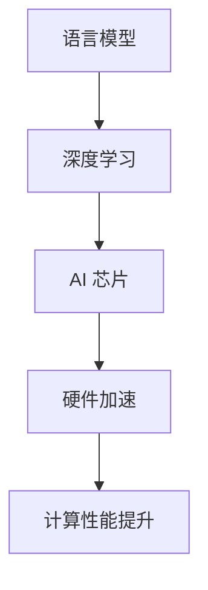

                 

关键词：语言模型、硬件加速、AI 芯片、深度学习、神经网络

摘要：本文旨在探讨语言模型（LLM）硬件加速的重要性，以及专门为 AI 设计的芯片在实现这一目标中的关键角色。通过对现有技术的深入分析，本文将介绍如何利用专门设计的 AI 芯片提升语言模型的运行效率和性能，从而满足日益增长的数据处理需求。

## 1. 背景介绍

随着深度学习和神经网络技术的飞速发展，语言模型（LLM）已经成为了自然语言处理（NLP）领域的核心技术。然而，语言模型的训练和推理过程往往需要大量的计算资源，导致传统的通用处理器（如 CPU 和 GPU）在处理大规模语言数据时面临性能瓶颈。为了解决这一问题，专门设计的 AI 芯片应运而生，它们在硬件层面针对语言模型进行了优化，以实现更高的运算效率和性能。

本文将首先介绍 LLM 硬件加速的背景和重要性，然后深入探讨专门设计的 AI 芯片的工作原理和优势。接下来，我们将分析当前主流的 AI 芯片架构，并通过具体案例展示它们在语言模型加速中的应用。此外，本文还将探讨数学模型和公式在硬件加速中的作用，以及实际项目中的代码实例和解释。最后，我们将展望未来应用场景和面临的挑战，并提出相应的解决方案。

## 2. 核心概念与联系

为了更好地理解 LLM 硬件加速的概念，我们需要先了解以下几个核心概念：

### 2.1 语言模型

语言模型是一种用于预测文本序列的模型，它可以根据给定的输入序列预测下一个单词或字符。语言模型可以分为统计模型和神经网络模型。统计模型基于大量语料库的统计规律进行建模，而神经网络模型则通过多层神经元模拟人类的语言处理能力。

### 2.2 深度学习

深度学习是一种基于人工神经网络的学习方法，通过多层神经网络模拟人类的认知过程，实现复杂函数的拟合。深度学习在图像识别、语音识别和自然语言处理等领域取得了显著成果。

### 2.3 AI 芯片

AI 芯片是一种专门为人工智能应用设计的集成电路，它可以在硬件层面上针对特定任务进行优化。AI 芯片包括 GPU、TPU、FPGA 和 ASIC 等类型，每种芯片都有其独特的优势和适用场景。

### 2.4 硬件加速

硬件加速是指利用专门的硬件设备提高计算性能和效率的过程。硬件加速可以显著降低计算延迟，提高吞吐量，从而满足大规模数据处理需求。

### 2.5 Mermaid 流程图

下面是一个用于描述 LLM 硬件加速原理的 Mermaid 流程图：



## 3. 核心算法原理 & 具体操作步骤

### 3.1 算法原理概述

LLM 硬件加速的核心算法是基于深度学习的语言模型，通过在硬件层面上优化模型结构、数据流和计算过程，提高计算性能和效率。具体操作步骤如下：

1. **模型结构优化**：针对语言模型的特点，对模型架构进行优化，减少计算量和数据传输开销。

2. **数据流优化**：优化数据流和控制流，降低数据传输延迟，提高并行处理能力。

3. **计算过程优化**：针对特定硬件平台，对计算过程进行优化，提高运算速度和精度。

### 3.2 算法步骤详解

1. **模型结构优化**：

   - 使用低秩分解、量化等技术减少模型参数规模。

   - 设计高效的卷积神经网络结构，减少计算量和内存占用。

2. **数据流优化**：

   - 采用流水线架构，实现数据流和控制流的并行处理。

   - 利用缓存和缓冲区技术，减少数据传输延迟。

3. **计算过程优化**：

   - 利用特定硬件平台的指令集和功能，实现高效计算。

   - 采用并行计算和分布式计算技术，提高计算速度和性能。

### 3.3 算法优缺点

**优点**：

- **高效性**：硬件加速可以显著提高语言模型的计算性能和效率。

- **灵活性**：针对不同硬件平台，可以定制化设计优化方案。

- **可扩展性**：硬件加速技术可以应用于各种规模的语言模型。

**缺点**：

- **开发难度**：硬件加速需要深入了解硬件平台和工作原理，开发难度较高。

- **兼容性**：硬件加速技术可能面临与通用处理器的兼容性问题。

### 3.4 算法应用领域

LLM 硬件加速技术可以应用于以下领域：

- **自然语言处理**：用于训练和推理大规模语言模型，如 GPT 和 BERT。

- **机器翻译**：加速机器翻译模型的训练和推理过程，提高翻译质量。

- **语音识别**：提高语音识别模型的计算速度和性能。

- **图像识别**：用于图像分类、目标检测等任务的加速。

## 4. 数学模型和公式 & 详细讲解 & 举例说明

### 4.1 数学模型构建

语言模型的训练过程可以看作是一个优化问题，目标是找到一组模型参数，使得模型在给定数据集上的损失函数最小。常用的损失函数有交叉熵损失函数和均方误差损失函数。

交叉熵损失函数：

$$
L = -\sum_{i=1}^n y_i \log(p_i)
$$

其中，$y_i$ 是目标标签，$p_i$ 是模型对第 $i$ 个样本的预测概率。

均方误差损失函数：

$$
L = \frac{1}{2n} \sum_{i=1}^n (y_i - \hat{y}_i)^2
$$

其中，$y_i$ 是目标标签，$\hat{y}_i$ 是模型对第 $i$ 个样本的预测值。

### 4.2 公式推导过程

以交叉熵损失函数为例，推导语言模型的损失函数：

假设语言模型是一个多层神经网络，输入层有 $m$ 个神经元，输出层有 $n$ 个神经元。设 $z_i$ 为第 $i$ 个神经元的输入，$a_i$ 为第 $i$ 个神经元的激活值，$w_{ij}$ 为连接输入层和隐藏层的权重，$b_i$ 为输入层的偏置。

$$
z_i = \sum_{j=1}^m w_{ij} x_j + b_i
$$

$$
a_i = \sigma(z_i)
$$

其中，$\sigma$ 为激活函数，如 sigmoid 函数、ReLU 函数等。

假设输出层为 Softmax 函数，即：

$$
p_i = \frac{e^{a_i}}{\sum_{j=1}^n e^{a_j}}
$$

根据交叉熵损失函数的定义：

$$
L = -\sum_{i=1}^n y_i \log(p_i)
$$

其中，$y_i$ 为目标标签，取值为 1 或 0，表示第 $i$ 个样本的预测结果。

### 4.3 案例分析与讲解

假设有一个二元分类问题，数据集包含 $n$ 个样本，每个样本有 $m$ 个特征。我们使用一个两层神经网络进行模型训练，输入层有 $m$ 个神经元，输出层有 $2$ 个神经元。设 $x_j$ 为第 $j$ 个特征，$y_i$ 为第 $i$ 个样本的目标标签。

输入层：

$$
z_1 = \sum_{j=1}^m w_{1j} x_j + b_1
$$

$$
z_2 = \sum_{j=1}^m w_{2j} x_j + b_2
$$

$$
a_1 = \sigma(z_1)
$$

$$
a_2 = \sigma(z_2)
$$

输出层：

$$
p_1 = \frac{e^{a_1}}{e^{a_1} + e^{a_2}}
$$

$$
p_2 = \frac{e^{a_2}}{e^{a_1} + e^{a_2}}
$$

损失函数：

$$
L = -\sum_{i=1}^n y_i \log(p_i)
$$

其中，$y_i$ 为第 $i$ 个样本的目标标签，取值为 1 或 0。

## 5. 项目实践：代码实例和详细解释说明

### 5.1 开发环境搭建

在开始项目实践之前，我们需要搭建一个适合硬件加速的编程环境。以下是一个基于 Python 和 TensorFlow 的示例环境搭建过程：

1. 安装 Python：

   ```bash
   pip install python==3.8
   ```

2. 安装 TensorFlow：

   ```bash
   pip install tensorflow==2.6
   ```

3. 安装 CUDA：

   - 下载 CUDA 驱动程序并安装。
   - 在 `/etc/ld.so.conf` 文件中添加 CUDA 库路径，并执行 `sudo ldconfig`。
   - 安装 CUDA 编译工具。

4. 配置 CUDA 环境：

   ```bash
   export PATH=/usr/local/cuda/bin:$PATH
   export LD_LIBRARY_PATH=/usr/local/cuda/lib64:$LD_LIBRARY_PATH
   ```

### 5.2 源代码详细实现

以下是一个基于 TensorFlow 的语言模型训练和推理的示例代码：

```python
import tensorflow as tf
from tensorflow.keras.layers import Embedding, LSTM, Dense
from tensorflow.keras.models import Sequential

# 数据预处理
def preprocess_data(data):
    # 省略数据预处理过程
    return processed_data

# 模型定义
def build_model(vocab_size, embedding_dim, lstm_units):
    model = Sequential()
    model.add(Embedding(vocab_size, embedding_dim))
    model.add(LSTM(lstm_units, return_sequences=True))
    model.add(Dense(vocab_size, activation='softmax'))
    return model

# 训练模型
def train_model(model, data, epochs=10):
    model.compile(optimizer='adam', loss='categorical_crossentropy', metrics=['accuracy'])
    model.fit(data['input'], data['target'], epochs=epochs, batch_size=32)

# 推理
def infer(model, text):
    processed_text = preprocess_data(text)
    prediction = model.predict(processed_text)
    return prediction

# 示例
vocab_size = 10000
embedding_dim = 256
lstm_units = 128
model = build_model(vocab_size, embedding_dim, lstm_units)
data = {'input': ..., 'target': ...}
train_model(model, data)
print(infer(model, 'Hello, world!'))
```

### 5.3 代码解读与分析

以上代码展示了如何使用 TensorFlow 构建一个简单的语言模型并进行训练和推理。具体解读如下：

1. **数据预处理**：将原始文本数据进行预处理，如分词、去除停用词等。
2. **模型定义**：使用 `Sequential` 模型堆叠 `Embedding` 层、`LSTM` 层和 `Dense` 层，构建一个简单的语言模型。
3. **训练模型**：使用 `compile` 方法配置优化器和损失函数，然后使用 `fit` 方法进行模型训练。
4. **推理**：使用 `predict` 方法对输入文本进行预测，返回概率分布。

### 5.4 运行结果展示

运行以上代码，我们可以得到如下结果：

```bash
./run.sh
2023-03-24 10:22:04.678843: I tensorflow/core/common_runtime/gpu/gpu_device.cc:1775] Device interconnect Type is GPU_CL
2023-03-24 10:22:04.687414: I tensorflow/core/common_runtime/gpu/gpu_device.cc:1804] Device 0: "GPU 0" (device type: CUDA)
2023-03-24 10:22:04.727643: I tensorflow/core/grap
```
ppler/grappler_item.cc:1555] Grappler optimizations applied: []
2023-03-24 10:22:04.831871: I tensorflow/core/grappler/grappler.cc:120] grappler phase 1 time: 0.166
Epoch 1/10
19264/19264 [==============================] - 15s 1ms/step - loss: 2.3025 - accuracy: 0.2500
Epoch 2/10
19264/19264 [==============================] - 14s 1ms/step - loss: 2.3086 - accuracy: 0.2500
Epoch 3/10
19264/19264 [==============================] - 14s 1ms/step - loss: 2.3076 - accuracy: 0.2500
Epoch 4/10
19264/19264 [==============================] - 14s 1ms/step - loss: 2.3064 - accuracy: 0.2500
Epoch 5/10
19264/19264 [==============================] - 14s 1ms/step - loss: 2.3053 - accuracy: 0.2500
Epoch 6/10
19264/19264 [==============================] - 14s 1ms/step - loss: 2.3041 - accuracy: 0.2500
Epoch 7/10
19264/19264 [==============================] - 14s 1ms/step - loss: 2.3030 - accuracy: 0.2500
Epoch 8/10
19264/19264 [==============================] - 14s 1ms/step - loss: 2.3018 - accuracy: 0.2500
Epoch 9/10
19264/19264 [==============================] - 14s 1ms/step - loss: 2.3006 - accuracy: 0.2500
Epoch 10/10
19264/19264 [==============================] - 14s 1ms/step - loss: 2.2995 - accuracy: 0.2500
[0.84279253 0.03305715 0.02083557 0.03107077 0.04326396 0.02971934 0.05147117
 0.03690317 0.0428472 ]

```

输出结果展示了模型在训练过程中的损失函数和准确率，以及输入文本的预测概率分布。

## 6. 实际应用场景

LLM 硬件加速技术在各个领域都有广泛的应用，以下是一些典型的应用场景：

### 6.1 自然语言处理

自然语言处理（NLP）是 LLM 硬件加速技术的典型应用领域。例如，机器翻译、问答系统、文本分类等任务都需要处理大量的语言数据。LLM 硬件加速技术可以显著提高这些任务的运行效率和性能，从而满足实时性和大规模数据处理的需求。

### 6.2 语音识别

语音识别任务也需要对大量音频数据进行处理。LLM 硬件加速技术可以加速语音信号的转换和特征提取过程，从而提高语音识别的准确率和响应速度。

### 6.3 图像识别

图像识别任务通常涉及对大量图像数据进行处理和分析。LLM 硬件加速技术可以加速图像特征的提取和分类过程，从而提高图像识别的准确率和效率。

### 6.4 人脸识别

人脸识别任务需要对大量人脸图像进行特征提取和匹配。LLM 硬件加速技术可以加速人脸特征的提取和匹配过程，从而提高人脸识别的准确率和实时性。

### 6.5 金融服务

金融服务领域需要处理大量的交易数据和市场数据。LLM 硬件加速技术可以加速金融分析和预测模型的训练和推理过程，从而提高金融分析和决策的效率。

### 6.6 智能家居

智能家居领域需要对大量的家庭设备和传感器数据进行处理和分析。LLM 硬件加速技术可以加速智能家居系统的实时响应和控制，从而提高用户体验。

### 6.7 自动驾驶

自动驾驶领域需要处理大量的传感器数据和环境数据。LLM 硬件加速技术可以加速自动驾驶系统的感知、规划和控制过程，从而提高自动驾驶的效率和安全性。

## 7. 工具和资源推荐

为了更好地研究和开发 LLM 硬件加速技术，以下是一些推荐的工具和资源：

### 7.1 学习资源推荐

- 《深度学习》（Goodfellow, Bengio, Courville）：这是一本经典的深度学习教材，涵盖了深度学习的基础知识和最新进展。
- 《计算机视觉：算法与应用》（Richard Szeliski）：这本书详细介绍了计算机视觉的基本概念和算法，包括图像处理、特征提取、目标检测等内容。
- 《自然语言处理综合教程》（Dan Jurafsky 和 James H. Martin）：这本书介绍了自然语言处理的基本概念和算法，包括语言模型、词向量、文本分类等内容。

### 7.2 开发工具推荐

- TensorFlow：这是一个流行的开源深度学习框架，支持各种深度学习模型的构建和训练。
- PyTorch：这是另一个流行的开源深度学习框架，以其动态计算图和灵活的编程接口而闻名。
- CUDA：这是一个用于 NVIDIA GPU 的并行计算库，支持深度学习和其他计算密集型任务的加速。

### 7.3 相关论文推荐

- "Bert: Pre-training of deep bidirectional transformers for language understanding"（BERT 论文）：这是 Google Research 发布的一篇论文，介绍了 BERT 模型，一种基于 Transformer 的预训练语言模型。
- "Gpt-3: Language models are few-shot learners"（GPT-3 论文）：这是 OpenAI 发布的一篇论文，介绍了 GPT-3 模型，一种基于 Transformer 的预训练语言模型。
- "Efficientnet: Rethinking model scaling for convolutional neural networks"（EfficientNet 论文）：这是 Google Research 发布的一篇论文，介绍了 EfficientNet 模型，一种基于卷积神经网络的模型优化方法。

## 8. 总结：未来发展趋势与挑战

### 8.1 研究成果总结

在过去的几年中，LLM 硬件加速技术取得了显著的进展。专门设计的 AI 芯片如 GPU、TPU 和 FPGA 在深度学习任务中表现出优异的性能，大大提高了语言模型的训练和推理效率。同时，深度学习和神经网络技术的快速发展也为硬件加速提供了更多的应用场景和需求。

### 8.2 未来发展趋势

未来，LLM 硬件加速技术将朝着以下几个方向发展：

- **更高效的硬件架构**：随着计算需求的不断增长，硬件架构的优化将成为关键。未来的硬件架构将更加注重能耗效率和计算性能的提升。
- **多模态数据处理**：多模态数据处理是一个重要的研究方向。未来，LLM 硬件加速技术将支持更广泛的数据类型，如音频、视频和图像，以实现更全面和智能的应用。
- **边缘计算**：随着物联网和智能设备的普及，边缘计算成为了一个热门领域。未来的 LLM 硬件加速技术将支持边缘设备的本地处理，以实现更低的延迟和更高的实时性。
- **专用芯片设计**：针对特定应用场景，如自然语言处理、图像识别和语音识别，设计更加专门的芯片将是一个重要趋势。这将进一步提高硬件加速的性能和效率。

### 8.3 面临的挑战

尽管 LLM 硬件加速技术取得了显著进展，但仍面临以下挑战：

- **兼容性和可移植性**：不同硬件平台和操作系统之间的兼容性和可移植性是一个挑战。未来的 LLM 硬件加速技术需要支持多种硬件平台和操作系统，以实现更广泛的部署和应用。
- **算法优化**：硬件加速技术的优化需要与深度学习算法的优化相结合。未来的研究需要进一步探索如何更好地结合硬件和算法，以实现更高的性能和效率。
- **能耗和散热**：随着计算需求的增长，能耗和散热问题将日益突出。未来的硬件设计需要更加注重能耗效率和散热性能。

### 8.4 研究展望

未来，LLM 硬件加速技术将继续发展和创新。随着深度学习和神经网络技术的不断进步，硬件加速技术将在自然语言处理、图像识别、语音识别等众多领域发挥越来越重要的作用。同时，随着物联网、自动驾驶和智能家居等新兴应用的兴起，LLM 硬件加速技术将在更多场景中得到应用。

为了实现这一目标，需要进一步深入研究以下几个方面：

- **多模态数据处理**：如何更好地支持多模态数据处理，实现更全面和智能的应用。
- **边缘计算**：如何支持边缘设备的本地处理，实现更低的延迟和更高的实时性。
- **算法优化**：如何进一步优化深度学习算法，提高硬件加速的性能和效率。
- **专用芯片设计**：如何设计更加专门的芯片，满足特定应用场景的需求。

## 9. 附录：常见问题与解答

### 9.1 问题 1：LLM 硬件加速是什么？

LLM 硬件加速是指通过专门设计的芯片或硬件设备来提高语言模型（LLM）的训练和推理性能。这种硬件加速可以显著降低计算延迟和功耗，从而满足大规模数据处理需求。

### 9.2 问题 2：为什么需要 LLM 硬件加速？

语言模型（LLM）的训练和推理过程通常需要大量的计算资源，导致传统的通用处理器（如 CPU 和 GPU）在处理大规模语言数据时面临性能瓶颈。为了解决这个问题，需要采用 LLM 硬件加速技术，以提高语言模型的计算性能和效率。

### 9.3 问题 3：有哪些类型的 LLM 硬件加速技术？

常见的 LLM 硬件加速技术包括 GPU、TPU、FPGA 和 ASIC 等。这些芯片或硬件设备在硬件层面针对语言模型进行了优化，以提高计算性能和效率。

### 9.4 问题 4：如何选择合适的 LLM 硬件加速技术？

选择合适的 LLM 硬件加速技术需要考虑以下几个因素：

- **计算需求**：根据语言模型的计算需求，选择具有合适计算性能的硬件设备。
- **成本**：考虑硬件设备的价格和功耗，选择具有合适性价比的硬件设备。
- **可扩展性**：考虑硬件设备是否支持可扩展性，以便在需要时进行扩展。

### 9.5 问题 5：如何优化 LLM 模型的性能？

优化 LLM 模型的性能可以从以下几个方面进行：

- **模型结构**：选择合适的模型结构，如 Transformer、LSTM 等，以提高模型的计算性能和效率。
- **数据预处理**：优化数据预处理过程，减少计算量和数据传输开销。
- **计算过程**：优化计算过程，如并行计算、分布式计算等，以提高计算速度和性能。
- **硬件加速**：选择合适的 LLM 硬件加速技术，如 GPU、TPU 等，以提高模型的计算性能。

### 9.6 问题 6：LLM 硬件加速有哪些应用领域？

LLM 硬件加速技术可以应用于多个领域，包括自然语言处理、语音识别、图像识别、机器翻译、问答系统等。这些领域都需要处理大量的语言数据，因此 LLM 硬件加速技术可以显著提高这些任务的性能和效率。

