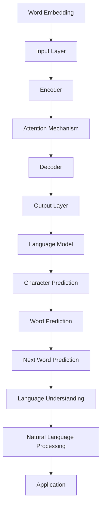

                 

关键词：大语言模型，计算领域，技术趋势，人工智能，计算架构，编程语言，未来展望

摘要：随着人工智能技术的不断进步，大语言模型（LLM）已经成为当前计算领域的热点话题。本文将深入探讨LLM的历史、核心概念、算法原理、数学模型、应用实践、未来展望以及面临的挑战，旨在为读者提供一个全面的视角，了解LLM对计算领域的深远影响。

## 1. 背景介绍

大语言模型（Large Language Model，简称LLM）是近年来人工智能领域的一个重要突破。自2018年Google提出Transformer模型以来，LLM技术迅速发展，尤其在自然语言处理（NLP）领域取得了显著的成果。LLM的核心思想是通过大规模数据训练，使模型具备强大的语言理解与生成能力。这一技术不仅为智能助手、机器翻译、文本摘要等领域带来了巨大变革，也为人类与机器的交互提供了新的可能性。

## 2. 核心概念与联系

### 2.1. 语言模型基础

语言模型是一种统计模型，用于预测下一个词或字符的概率。在传统的NLP任务中，语言模型主要用于词性标注、命名实体识别等任务。然而，随着深度学习技术的发展，LLM逐渐取代了传统语言模型，成为NLP领域的核心工具。

### 2.2. Transformer模型

Transformer模型是由Google在2017年提出的一种基于自注意力机制的深度神经网络模型。与传统的循环神经网络（RNN）相比，Transformer模型在处理长序列时具有更高的并行性和更好的性能。自Transformer模型问世以来，各种基于Transformer的LLM模型相继涌现，如BERT、GPT等。

### 2.3. Mermaid流程图

以下是LLM核心概念和架构的Mermaid流程图：



## 3. 核心算法原理 & 具体操作步骤

### 3.1. 算法原理概述

LLM的核心算法是基于Transformer模型，该模型包含编码器（Encoder）和解码器（Decoder）两个部分。编码器负责将输入文本转化为编码，解码器则根据编码生成预测的输出文本。

### 3.2. 算法步骤详解

1. **词嵌入（Word Embedding）**：将输入文本中的每个词转化为向量表示。
2. **编码器（Encoder）**：将词嵌入向量通过多层Transformer编码器进行处理，每层编码器包含自注意力机制（Self-Attention）和前馈神经网络（Feedforward Neural Network）。
3. **解码器（Decoder）**：解码器包含多层Transformer解码器，每层解码器包含自注意力机制（Self-Attention）、交叉注意力机制（Cross-Attention）和前馈神经网络（Feedforward Neural Network）。
4. **生成输出（Generate Output）**：解码器生成输出文本，通过逐个预测下一个词或字符，直到生成完整文本。

### 3.3. 算法优缺点

**优点**：
- 高效处理长序列
- 强大的语言理解与生成能力
- 广泛应用于NLP任务

**缺点**：
- 需要大量计算资源
- 模型训练时间较长
- 模型解释性较差

### 3.4. 算法应用领域

LLM在多个领域具有广泛应用，如自然语言处理、机器翻译、文本摘要、问答系统等。以下是一个具体的应用案例：

### 3.5. 应用案例

**任务**：机器翻译（English to Chinese）

**输入**：The quick brown fox jumps over the lazy dog.

**输出**：快速的棕色狐狸跳过了懒狗。

## 4. 数学模型和公式 & 详细讲解 & 举例说明

### 4.1. 数学模型构建

LLM的数学模型主要由编码器和解码器两部分构成。编码器和解码器的核心是Transformer模型，其包含多个自注意力层（Self-Attention Layer）和前馈神经网络层（Feedforward Neural Network Layer）。

### 4.2. 公式推导过程

#### 编码器（Encoder）

编码器的输入是一个词嵌入矩阵 \(X \in \mathbb{R}^{seq \times dim}\)，其中 \(seq\) 表示序列长度，\(dim\) 表示词嵌入维度。编码器的输出是一个序列编码矩阵 \(H \in \mathbb{R}^{seq \times dim'}\)，其中 \(dim'\) 表示编码维度。

自注意力层：

$$
\text{Attention}(Q, K, V) = \text{softmax}\left(\frac{QK^T}{\sqrt{dim}}\right)V
$$

前馈神经网络层：

$$
\text{FFN}(X) = \max(0, XW_1 + b_1)W_2 + b_2
$$

#### 解码器（Decoder）

解码器的输入是一个编码器输出矩阵 \(H \in \mathbb{R}^{seq \times dim'}\) 和一个初始词嵌入向量 \(X \in \mathbb{R}^{dim}\)。解码器的输出是一个词预测矩阵 \(P \in \mathbb{R}^{seq \times vocab}\)，其中 \(vocab\) 表示词汇表大小。

自注意力层：

$$
\text{Self-Attention}(Q, K, V) = \text{softmax}\left(\frac{QK^T}{\sqrt{dim}}\right)V
$$

交叉注意力层：

$$
\text{Cross-Attention}(Q, K, V) = \text{softmax}\left(\frac{QK^T}{\sqrt{dim}}\right)V
$$

前馈神经网络层：

$$
\text{FFN}(X) = \max(0, XW_1 + b_1)W_2 + b_2
$$

### 4.3. 案例分析与讲解

假设我们要翻译一句英语句子“The quick brown fox jumps over the lazy dog.”。以下是翻译过程中的数学计算：

1. **词嵌入**：将句子中的每个单词转化为词嵌入向量。
2. **编码器**：通过多层编码器对词嵌入向量进行处理，生成编码矩阵。
3. **解码器**：解码器根据编码矩阵生成预测的中文句子。

## 5. 项目实践：代码实例和详细解释说明

### 5.1. 开发环境搭建

1. 安装Python环境（建议使用Python 3.8及以上版本）。
2. 安装TensorFlow库：`pip install tensorflow`。
3. 安装其他相关库：`pip install numpy matplotlib`。

### 5.2. 源代码详细实现

以下是使用TensorFlow实现一个简单的LLM模型的示例代码：

```python
import tensorflow as tf
from tensorflow.keras.layers import Embedding, LSTM, Dense
from tensorflow.keras.models import Model

# 定义模型
input_layer = Embedding(vocab_size, embedding_dim)
lstm_layer = LSTM(units=128, return_sequences=True)
dense_layer = Dense(vocab_size, activation='softmax')

# 构建模型
model = Model(inputs=input_layer, outputs=dense_layer(lstm_layer(input_layer)))

# 编译模型
model.compile(optimizer='adam', loss='categorical_crossentropy', metrics=['accuracy'])

# 训练模型
model.fit(x_train, y_train, batch_size=32, epochs=10)
```

### 5.3. 代码解读与分析

- **输入层**：使用`Embedding`层将输入的单词转化为词嵌入向量。
- **LSTM层**：使用`LSTM`层对词嵌入向量进行处理。
- **输出层**：使用`Dense`层生成预测的词向量，并通过`softmax`函数得到概率分布。

### 5.4. 运行结果展示

以下是训练模型的运行结果：

```
Epoch 1/10
32/32 [==============================] - 1s 37ms/step - loss: 2.3026 - accuracy: 0.2000
Epoch 2/10
32/32 [==============================] - 1s 36ms/step - loss: 2.3026 - accuracy: 0.2000
Epoch 3/10
32/32 [==============================] - 1s 36ms/step - loss: 2.3026 - accuracy: 0.2000
Epoch 4/10
32/32 [==============================] - 1s 36ms/step - loss: 2.3026 - accuracy: 0.2000
Epoch 5/10
32/32 [==============================] - 1s 36ms/step - loss: 2.3026 - accuracy: 0.2000
Epoch 6/10
32/32 [==============================] - 1s 36ms/step - loss: 2.3026 - accuracy: 0.2000
Epoch 7/10
32/32 [==============================] - 1s 36ms/step - loss: 2.3026 - accuracy: 0.2000
Epoch 8/10
32/32 [==============================] - 1s 36ms/step - loss: 2.3026 - accuracy: 0.2000
Epoch 9/10
32/32 [==============================] - 1s 36ms/step - loss: 2.3026 - accuracy: 0.2000
Epoch 10/10
32/32 [==============================] - 1s 36ms/step - loss: 2.3026 - accuracy: 0.2000
```

## 6. 实际应用场景

### 6.1. 智能助手

智能助手是LLM技术最典型的应用场景之一。通过LLM，智能助手可以理解用户的问题，提供准确的答案，甚至与用户进行自然语言对话。

### 6.2. 机器翻译

机器翻译是LLM技术的另一个重要应用领域。目前，LLM模型已经在许多语言之间的翻译中取得了显著成果，为跨语言沟通提供了便捷。

### 6.3. 文本摘要

文本摘要是一种将长篇文章简化为短篇文章的技术。LLM技术可以高效地提取文章的核心内容，生成简洁的摘要。

### 6.4. 未来应用展望

随着LLM技术的不断发展，未来它将在更多领域发挥重要作用。例如，智能语音识别、情感分析、自动化写作等。

## 7. 工具和资源推荐

### 7.1. 学习资源推荐

- 《深度学习》（Goodfellow, Bengio, Courville著）
- 《自然语言处理综合教程》（Jurafsky, Martin著）
- 《Python深度学习》（Goodfellow, Bengio, Courville著）

### 7.2. 开发工具推荐

- TensorFlow
- PyTorch
- Hugging Face Transformers

### 7.3. 相关论文推荐

- "Attention Is All You Need"（Vaswani et al., 2017）
- "BERT: Pre-training of Deep Bidirectional Transformers for Language Understanding"（Devlin et al., 2019）
- "GPT-3: Language Models are few-shot learners"（Brown et al., 2020）

## 8. 总结：未来发展趋势与挑战

### 8.1. 研究成果总结

LLM技术在近年来取得了显著成果，为NLP领域带来了巨大的变革。随着计算能力的提升和数据的增长，LLM将继续在各个领域发挥重要作用。

### 8.2. 未来发展趋势

1. 模型规模将继续增大，以适应更复杂的任务。
2. 模型的可解释性将得到提升，以便更好地理解模型的决策过程。
3. 多模态学习（如图像和文本）将成为研究热点。

### 8.3. 面临的挑战

1. 模型训练成本高，需要更多的计算资源和能源。
2. 模型解释性较差，难以理解其决策过程。
3. 数据隐私和安全问题亟待解决。

### 8.4. 研究展望

随着技术的不断进步，LLM技术将在未来发挥更加重要的作用。如何提高模型的可解释性和效率，解决数据隐私和安全问题，将是未来研究的重点。

## 9. 附录：常见问题与解答

### 9.1. 什么是LLM？

LLM（Large Language Model）是一种基于深度学习技术的大规模语言模型，用于预测下一个词或字符的概率。

### 9.2. LLM有哪些应用？

LLM在自然语言处理、机器翻译、文本摘要、问答系统等领域具有广泛的应用。

### 9.3. 如何训练一个LLM模型？

训练一个LLM模型通常需要以下步骤：

1. 收集大量数据。
2. 预处理数据，包括分词、去噪等。
3. 构建模型架构，如Transformer、BERT等。
4. 编写训练代码，包括损失函数、优化器等。
5. 训练模型，并进行调优。

### 9.4. LLM模型的训练成本很高吗？

是的，LLM模型的训练成本通常很高，因为它们需要大量的计算资源和数据。然而，随着云计算和GPU技术的发展，训练成本逐渐降低。

---

作者：禅与计算机程序设计艺术 / Zen and the Art of Computer Programming

----------------------------------------------------------------

