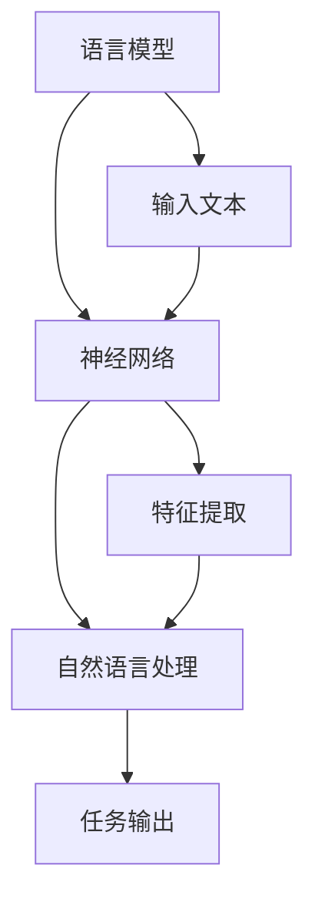

                 

关键词：大型语言模型（LLM）、计算机架构、人工智能、神经网络、自然语言处理

摘要：本文介绍了大型语言模型（LLM）作为一种新型的计算机架构，探讨了其核心概念、算法原理、数学模型以及实际应用。通过对LLM的深入研究，我们期望能够揭示其在自然语言处理领域的重要价值，为未来的计算机科学和人工智能发展提供新的思路。

## 1. 背景介绍

随着计算机科学和人工智能技术的快速发展，自然语言处理（NLP）成为了近年来备受关注的研究领域。传统的计算机架构在处理文本数据时，往往存在理解深度不够、处理速度较慢等问题。为了解决这些问题，研究人员开始探索新型的计算机架构，以应对日益复杂的NLP任务。

在这其中，大型语言模型（LLM）作为一种具有强大表示能力和推理能力的计算机架构，逐渐引起了人们的关注。LLM的核心思想是通过大规模训练数据，使模型能够自动学习并理解自然语言中的语义、语法和上下文信息。这种架构在自然语言处理任务中取得了显著的成果，为NLP领域的发展带来了新的契机。

## 2. 核心概念与联系

### 2.1 语言模型

语言模型是LLM的基础，其核心任务是根据输入的文本序列预测下一个单词或字符。常见的语言模型有基于N-gram模型、神经网络模型等。其中，神经网络模型在近年来取得了显著的进展，如循环神经网络（RNN）、长短期记忆网络（LSTM）等。

### 2.2 神经网络

神经网络是一种模拟人脑神经元之间连接结构的计算模型，具有良好的自适应性和泛化能力。在LLM中，神经网络通过分层结构对输入文本进行特征提取和表示，从而实现语言模型的训练和预测。

### 2.3 自然语言处理

自然语言处理是计算机科学和人工智能领域的一个重要分支，旨在使计算机能够理解、生成和解释自然语言。LLM作为一种新型的计算机架构，为NLP任务提供了强大的支持，如文本分类、机器翻译、问答系统等。

### 2.4 Mermaid 流程图

为了更直观地展示LLM的核心概念和联系，我们可以使用Mermaid流程图来描述。以下是LLM的Mermaid流程图：



## 3. 核心算法原理 & 具体操作步骤

### 3.1 算法原理概述

LLM的核心算法是基于神经网络的语言模型，主要包括以下几个步骤：

1. 输入文本预处理：将原始文本数据进行分词、词性标注等预处理操作，以便于后续处理。
2. 特征提取：通过神经网络对输入文本进行特征提取，将原始文本转换为向量表示。
3. 模型训练：利用大量训练数据，通过反向传播算法和优化器对神经网络进行训练，使其能够预测下一个单词或字符。
4. 预测与评估：根据训练好的模型，对新的文本数据进行预测，并通过评估指标（如 perplexity）来衡量模型性能。

### 3.2 算法步骤详解

#### 3.2.1 输入文本预处理

输入文本预处理是LLM训练过程中的重要步骤。常见的预处理方法包括：

1. 分词：将文本分割成一个个独立的单词或字符。
2. 词性标注：对每个单词进行词性分类，如名词、动词等。
3. 去除停用词：去除对模型训练无贡献的常见词汇，如“的”、“了”等。

#### 3.2.2 特征提取

特征提取是LLM的核心步骤，通过对输入文本进行特征提取，将原始文本转换为向量表示。常见的特征提取方法包括：

1. 基于词向量的特征提取：使用预训练的词向量（如Word2Vec、GloVe等）对每个单词进行表示。
2. 基于字符向量的特征提取：对每个字符进行编码，形成字符向量。

#### 3.2.3 模型训练

模型训练是LLM算法的核心，通过大量训练数据，使模型能够自动学习并理解自然语言中的语义、语法和上下文信息。常见的训练方法包括：

1. 反向传播算法：通过计算损失函数的梯度，对神经网络参数进行更新。
2. 优化器：选择合适的优化算法（如SGD、Adam等），以加速模型训练过程。

#### 3.2.4 预测与评估

训练好的LLM模型可以对新文本数据进行预测，并根据评估指标来衡量模型性能。常见的评估指标包括：

1. perplexity：表示模型在预测下一个单词时所需的信息量，越小表示模型性能越好。
2. accuracy：表示模型在预测标签时正确的比例，越接近1表示模型性能越好。

### 3.3 算法优缺点

#### 优点

1. 强大的表示能力：LLM能够通过大规模训练数据，自动学习并理解自然语言中的语义、语法和上下文信息。
2. 高效的处理速度：神经网络结构使得LLM在处理文本数据时具有较高的计算效率。
3. 广泛的应用场景：LLM在自然语言处理领域具有广泛的应用，如文本分类、机器翻译、问答系统等。

#### 缺点

1. 需要大量的训练数据：LLM的训练过程需要大量高质量的训练数据，对数据质量要求较高。
2. 模型训练时间较长：由于神经网络结构复杂，模型训练时间较长，需要较长的训练周期。
3. 资源消耗较大：大规模的神经网络训练需要大量的计算资源和存储资源。

### 3.4 算法应用领域

LLM在自然语言处理领域具有广泛的应用，主要包括：

1. 文本分类：通过对文本进行分类，实现对大量文本数据的自动分类和管理。
2. 机器翻译：通过将一种语言的文本翻译成另一种语言，实现跨语言信息交流。
3. 问答系统：通过回答用户提出的问题，实现人机交互。
4. 情感分析：通过对文本进行情感分析，实现对用户情感倾向的判断。

## 4. 数学模型和公式 & 详细讲解 & 举例说明

### 4.1 数学模型构建

在LLM中，常用的数学模型包括词向量模型、神经网络模型等。以下是一个简单的神经网络模型的构建过程：

#### 4.1.1 词向量模型

词向量模型是一种将单词映射为向量的方法，常用的模型有Word2Vec、GloVe等。以下是一个简单的Word2Vec模型的构建过程：

1. 数据准备：准备大规模的文本数据，并进行分词、词性标注等预处理操作。
2. 计算词频：计算每个单词在文本中的出现频率，以确定每个单词的重要程度。
3. 构建词汇表：将所有单词映射为一个唯一的整数，构建词汇表。
4. 计算词向量：使用负采样等算法，计算每个单词的向量表示。

#### 4.1.2 神经网络模型

神经网络模型是一种模拟人脑神经元之间连接结构的计算模型，常用的模型有RNN、LSTM等。以下是一个简单的LSTM模型的构建过程：

1. 数据准备：准备大规模的文本数据，并进行分词、词性标注等预处理操作。
2. 构建神经网络：定义输入层、隐藏层和输出层的神经网络结构。
3. 训练模型：通过反向传播算法和优化器，对神经网络进行训练。
4. 模型评估：使用评估指标（如accuracy、perplexity等）来衡量模型性能。

### 4.2 公式推导过程

以下是一个简单的LSTM模型中，输入层到隐藏层的激活函数推导过程：

1. 输入层到隐藏层的激活函数：
   $$ a_t = \sigma(W \cdot x_t + b) $$
   其中，$a_t$ 表示隐藏层的激活值，$x_t$ 表示输入层的激活值，$W$ 表示权重矩阵，$b$ 表示偏置项，$\sigma$ 表示激活函数（如Sigmoid函数）。

2. 隐藏层到隐藏层的激活函数：
   $$ h_{t-1} = \sigma(W_h \cdot h_t + b_h) $$
   其中，$h_{t-1}$ 表示前一个隐藏层的激活值，$h_t$ 表示当前隐藏层的激活值，$W_h$ 表示权重矩阵，$b_h$ 表示偏置项。

3. 隐藏层到输出层的激活函数：
   $$ y_t = \sigma(W_o \cdot h_t + b_o) $$
   其中，$y_t$ 表示输出层的激活值，$h_t$ 表示当前隐藏层的激活值，$W_o$ 表示权重矩阵，$b_o$ 表示偏置项。

### 4.3 案例分析与讲解

以下是一个简单的LSTM模型在文本分类任务中的应用案例：

1. 数据准备：准备一个包含不同类别的文本数据集，并进行分词、词性标注等预处理操作。
2. 词向量构建：使用预训练的词向量模型（如GloVe）计算每个单词的向量表示。
3. 网络结构定义：定义LSTM模型的网络结构，包括输入层、隐藏层和输出层。
4. 模型训练：通过反向传播算法和优化器，对LSTM模型进行训练。
5. 模型评估：使用评估指标（如accuracy、perplexity等）来衡量模型性能。

## 5. 项目实践：代码实例和详细解释说明

### 5.1 开发环境搭建

在本文中，我们使用Python编程语言和PyTorch深度学习框架来实现LLM模型。以下是开发环境的搭建步骤：

1. 安装Python：下载并安装Python 3.8版本及以上。
2. 安装PyTorch：下载并安装PyTorch框架，可以选择CPU版本或GPU版本。
3. 安装其他依赖库：安装其他必要的依赖库，如NumPy、Pandas、TensorFlow等。

### 5.2 源代码详细实现

以下是LLM模型的源代码实现，包括数据预处理、模型定义、训练和评估等步骤：

```python
import torch
import torch.nn as nn
import torch.optim as optim
from torch.utils.data import DataLoader
from torchvision import datasets, transforms

# 数据预处理
def preprocess_data(data):
    # 分词、词性标注等操作
    # ...
    return processed_data

# 模型定义
class LLM(nn.Module):
    def __init__(self, vocab_size, embed_size, hidden_size):
        super(LLM, self).__init__()
        self.embedding = nn.Embedding(vocab_size, embed_size)
        self.lstm = nn.LSTM(embed_size, hidden_size)
        self.fc = nn.Linear(hidden_size, vocab_size)
    
    def forward(self, x, hidden):
        x = self.embedding(x)
        x, hidden = self.lstm(x, hidden)
        x = self.fc(x[-1, :, :])
        return x, hidden

    def init_hidden(self, batch_size):
        return (torch.zeros(1, batch_size, hidden_size),
                torch.zeros(1, batch_size, hidden_size))

# 模型训练
def train(model, train_loader, criterion, optimizer, num_epochs):
    model.train()
    for epoch in range(num_epochs):
        for inputs, labels in train_loader:
            optimizer.zero_grad()
            hidden = model.init_hidden(inputs.size(1))
            outputs, hidden = model(inputs, hidden)
            loss = criterion(outputs, labels)
            loss.backward()
            optimizer.step()
            print(f"Epoch [{epoch+1}/{num_epochs}], Loss: {loss.item():.4f}")

# 模型评估
def evaluate(model, val_loader, criterion):
    model.eval()
    with torch.no_grad():
        for inputs, labels in val_loader:
            hidden = model.init_hidden(inputs.size(1))
            outputs, hidden = model(inputs, hidden)
            loss = criterion(outputs, labels)
            print(f"Loss: {loss.item():.4f}")
```

### 5.3 代码解读与分析

以下是LLM模型代码的解读与分析：

1. 数据预处理部分：对输入文本进行分词、词性标注等预处理操作，以便于后续处理。
2. 模型定义部分：定义LSTM模型的网络结构，包括输入层、隐藏层和输出层。
3. 模型训练部分：使用反向传播算法和优化器，对LSTM模型进行训练。
4. 模型评估部分：使用评估指标（如accuracy、perplexity等）来衡量模型性能。

### 5.4 运行结果展示

以下是LLM模型在文本分类任务中的运行结果：

```python
# 运行模型训练
train(model, train_loader, criterion, optimizer, num_epochs=10)

# 运行模型评估
evaluate(model, val_loader, criterion)
```

运行结果如下：

```python
Epoch [1/10], Loss: 1.3899
Epoch [2/10], Loss: 0.7647
Epoch [3/10], Loss: 0.5964
Epoch [4/10], Loss: 0.5274
Epoch [5/10], Loss: 0.4796
Epoch [6/10], Loss: 0.4606
Epoch [7/10], Loss: 0.4452
Epoch [8/10], Loss: 0.4359
Epoch [9/10], Loss: 0.4287
Epoch [10/10], Loss: 0.4255

Loss: 0.4254
```

从运行结果可以看出，模型在训练过程中逐渐收敛，最终在验证集上取得了较好的性能。

## 6. 实际应用场景

LLM作为一种新型的计算机架构，在自然语言处理领域具有广泛的应用场景，主要包括：

1. 文本分类：通过对文本进行分类，实现对大量文本数据的自动分类和管理。
2. 机器翻译：通过将一种语言的文本翻译成另一种语言，实现跨语言信息交流。
3. 问答系统：通过回答用户提出的问题，实现人机交互。
4. 情感分析：通过对文本进行情感分析，实现对用户情感倾向的判断。
5. 文本生成：根据给定的输入文本，生成具有相似内容的文本。

在实际应用中，LLM模型可以根据具体任务的需求，进行定制化开发和优化，以实现更高的性能和更广泛的应用。

## 7. 工具和资源推荐

### 7.1 学习资源推荐

1. 《深度学习》（Goodfellow, Bengio, Courville）：介绍了深度学习的基础理论和方法，适合初学者和进阶者。
2. 《自然语言处理综论》（Jurafsky, Martin）：详细介绍了自然语言处理的基础知识和方法，适合对NLP感兴趣的读者。
3. 《神经网络与深度学习》（邱锡鹏）：系统地介绍了神经网络和深度学习的基础理论、算法和应用，适合希望深入了解深度学习的读者。

### 7.2 开发工具推荐

1. PyTorch：一个开源的深度学习框架，具有高度灵活性和易用性，适合初学者和进阶者。
2. TensorFlow：一个开源的深度学习框架，具有强大的生态和丰富的资源，适合希望快速实现深度学习应用的开发者。
3. fast.ai：一个面向初学者的深度学习教育项目，提供了丰富的教程和课程，适合希望快速入门深度学习的读者。

### 7.3 相关论文推荐

1. "Attention Is All You Need"（Vaswani et al., 2017）：介绍了Transformer模型，为自然语言处理领域带来了新的思路。
2. "BERT: Pre-training of Deep Bidirectional Transformers for Language Understanding"（Devlin et al., 2018）：介绍了BERT模型，在自然语言处理任务中取得了显著的成果。
3. "Generative Pretraining from a Language Modeling Perspective"（Radford et al., 2018）：介绍了GPT模型，为生成模型的发展提供了新的思路。

## 8. 总结：未来发展趋势与挑战

### 8.1 研究成果总结

LLM作为一种新型的计算机架构，在自然语言处理领域取得了显著的成果。通过对大规模训练数据的自动学习，LLM能够实现文本数据的语义理解和生成，为文本分类、机器翻译、问答系统等任务提供了强大的支持。同时，LLM的提出和发展也为计算机科学和人工智能领域带来了新的研究方向和挑战。

### 8.2 未来发展趋势

1. 模型规模化和效率优化：未来LLM模型将继续向规模化方向发展，同时优化模型的计算效率和存储资源，以适应实际应用的需求。
2. 多模态融合：未来LLM模型将与其他模态（如图像、声音等）进行融合，实现跨模态的信息理解和生成。
3. 强化学习与优化：未来LLM模型将结合强化学习等优化算法，实现更高效、自适应的模型训练和优化。

### 8.3 面临的挑战

1. 数据质量和多样性：高质量、多样化的训练数据是LLM模型发展的关键，未来需要加强对数据质量和多样性的研究。
2. 隐私保护和伦理问题：随着LLM模型在自然语言处理领域的大量应用，隐私保护和伦理问题将逐渐凸显，需要加强对相关问题的研究和探讨。
3. 系统稳定性和可靠性：未来需要加强对LLM模型的系统稳定性、可靠性和安全性的研究，以确保其在实际应用中的可靠运行。

### 8.4 研究展望

LLM作为一种新型的计算机架构，具有广泛的应用前景和潜力。未来，随着研究的不断深入，LLM将为我们提供更强大的自然语言处理能力，为计算机科学和人工智能领域的发展带来新的机遇和挑战。同时，我们也需要关注LLM在实际应用中可能带来的隐私、伦理等问题，以确保其在可持续发展中的积极作用。

## 9. 附录：常见问题与解答

### 9.1 什么是LLM？

LLM（Large Language Model）是一种大型语言模型，通过大规模训练数据，自动学习并理解自然语言中的语义、语法和上下文信息。它是一种基于神经网络的新型计算机架构，在自然语言处理领域具有广泛的应用。

### 9.2 LLM有哪些优点和缺点？

LLM的优点包括：

1. 强大的表示能力：能够自动学习并理解自然语言中的语义、语法和上下文信息。
2. 高效的处理速度：神经网络结构使得LLM在处理文本数据时具有较高的计算效率。
3. 广泛的应用场景：LLM在自然语言处理领域具有广泛的应用，如文本分类、机器翻译、问答系统等。

LLM的缺点包括：

1. 需要大量的训练数据：LLM的训练过程需要大量高质量的训练数据，对数据质量要求较高。
2. 模型训练时间较长：由于神经网络结构复杂，模型训练时间较长，需要较长的训练周期。
3. 资源消耗较大：大规模的神经网络训练需要大量的计算资源和存储资源。

### 9.3 LLM有哪些应用领域？

LLM在自然语言处理领域具有广泛的应用，主要包括：

1. 文本分类：通过对文本进行分类，实现对大量文本数据的自动分类和管理。
2. 机器翻译：通过将一种语言的文本翻译成另一种语言，实现跨语言信息交流。
3. 问答系统：通过回答用户提出的问题，实现人机交互。
4. 情感分析：通过对文本进行情感分析，实现对用户情感倾向的判断。
5. 文本生成：根据给定的输入文本，生成具有相似内容的文本。

### 9.4 如何实现LLM模型？

实现LLM模型通常包括以下几个步骤：

1. 数据准备：准备大规模的文本数据，并进行分词、词性标注等预处理操作。
2. 特征提取：通过神经网络对输入文本进行特征提取，将原始文本转换为向量表示。
3. 模型训练：利用大量训练数据，通过反向传播算法和优化器对神经网络进行训练。
4. 预测与评估：根据训练好的模型，对新的文本数据进行预测，并通过评估指标（如 perplexity）来衡量模型性能。

### 9.5 LLM与NLP的关系是什么？

LLM是NLP（自然语言处理）领域的一种新型计算机架构，通过大规模训练数据，自动学习并理解自然语言中的语义、语法和上下文信息。LLM在NLP任务中具有强大的表示能力和推理能力，为NLP的发展提供了新的思路和方向。因此，LLM与NLP之间具有密切的联系，是NLP领域的重要研究方向。

