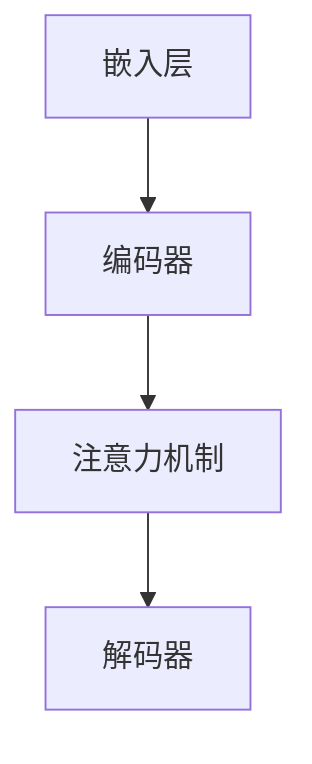

                 

关键词：大型语言模型，计算机架构，自然语言处理，人工智能，机器学习，深度学习

摘要：本文将探讨大型语言模型(LLM)作为一种新型计算机架构的重要性，以及它在自然语言处理和人工智能领域的广泛应用。我们将详细介绍LLM的核心概念、算法原理、数学模型以及实际应用场景，并展望其未来的发展趋势和面临的挑战。

## 1. 背景介绍

近年来，人工智能技术在计算机科学领域取得了显著的进展。其中，自然语言处理（NLP）和机器学习（ML）成为了人工智能研究的重点方向。而大型语言模型（LLM）作为一种新型的计算机架构，正在引领这一领域的变革。

LLM是一种基于深度学习的语言模型，它通过大规模的文本数据进行训练，能够理解和生成人类语言。与传统的人工编写的规则系统相比，LLM具有更高的灵活性和适应性，能够处理复杂多样的语言任务。

随着云计算和大数据技术的发展，LLM的训练和部署成本逐渐降低，其应用场景也在不断扩展。如今，LLM已经被广泛应用于语音识别、机器翻译、智能助手、文本生成等领域，成为人工智能领域的重要工具。

## 2. 核心概念与联系

### 2.1 大型语言模型的基本原理

大型语言模型（LLM）是基于深度学习的神经网络模型，其核心原理是通过对大量文本数据进行训练，学习语言的内在规律和结构。LLM主要由以下几个部分组成：

1. **嵌入层（Embedding Layer）**：将词汇转化为高维向量表示。
2. **编码器（Encoder）**：将输入文本序列编码为固定长度的向量。
3. **解码器（Decoder）**：根据编码器的输出生成输出文本序列。
4. **注意力机制（Attention Mechanism）**：使模型能够关注输入文本序列中的关键信息。

### 2.2 Mermaid 流程图



### 2.3 核心概念联系

LLM 的核心概念之间紧密相连，共同构成了一个完整的学习和生成过程。嵌入层负责将词汇转化为向量表示，编码器将输入文本序列编码为固定长度的向量，注意力机制使得模型能够关注输入文本序列中的关键信息，解码器则根据编码器的输出生成输出文本序列。这三个核心组件相互配合，实现了对语言的深刻理解和生成。

## 3. 核心算法原理 & 具体操作步骤

### 3.1 算法原理概述

大型语言模型（LLM）的核心算法是基于深度学习的序列到序列（Seq2Seq）模型。Seq2Seq模型通过编码器-解码器结构实现对输入文本序列到输出文本序列的映射。其基本原理如下：

1. **编码器（Encoder）**：将输入文本序列编码为一个固定长度的向量，这个向量包含了输入文本的信息。
2. **解码器（Decoder）**：根据编码器的输出，逐个生成输出文本序列的单词。

### 3.2 算法步骤详解

1. **嵌入层**：将词汇转化为高维向量表示。每个词汇对应一个向量，这些向量构成了词汇表。
2. **编码器**：将输入文本序列编码为一个固定长度的向量。编码器通常采用递归神经网络（RNN）或其变体，如长短期记忆网络（LSTM）或门控循环单元（GRU）。
3. **注意力机制**：使模型能够关注输入文本序列中的关键信息。注意力机制通过计算编码器的输出和当前解码器状态的相似度，动态调整解码器对编码器输出的关注程度。
4. **解码器**：根据编码器的输出和注意力机制的结果，逐个生成输出文本序列的单词。解码器同样采用递归神经网络（RNN）或其变体。

### 3.3 算法优缺点

**优点**：

- **灵活性**：LLM能够处理各种复杂的语言任务，如机器翻译、文本生成等。
- **高效性**：通过大规模训练，LLM能够在短时间内生成高质量的输出。

**缺点**：

- **训练成本高**：LLM需要大量的计算资源和时间进行训练。
- **模型复杂度高**：LLM的模型结构复杂，难以理解和调试。

### 3.4 算法应用领域

LLM在自然语言处理和人工智能领域有广泛的应用：

- **语音识别**：通过LLM对语音信号进行理解和生成文本。
- **机器翻译**：将一种语言的文本翻译成另一种语言。
- **智能助手**：为用户提供自然语言交互的能力。
- **文本生成**：根据输入的文本或指令生成相关的文本。

## 4. 数学模型和公式 & 详细讲解 & 举例说明

### 4.1 数学模型构建

大型语言模型的数学模型主要包括嵌入层、编码器、解码器和注意力机制。以下分别介绍这些组件的数学模型。

#### 4.1.1 嵌入层

嵌入层将词汇转化为高维向量表示。假设词汇表中有V个词汇，每个词汇对应一个唯一的索引，则嵌入层可以表示为：

$$
\text{嵌入层} : \text{vocab} \rightarrow \mathbb{R}^d
$$

其中，$d$ 为嵌入层的高维向量维度，$vocab$ 为词汇表。

#### 4.1.2 编码器

编码器将输入文本序列编码为一个固定长度的向量。假设输入文本序列为 $x_1, x_2, ..., x_T$，其中 $T$ 为序列长度，则编码器可以表示为：

$$
\text{编码器} : \{ x_1, x_2, ..., x_T \} \rightarrow \mathbb{R}^n
$$

其中，$n$ 为编码器的输出维度。

#### 4.1.3 解码器

解码器根据编码器的输出生成输出文本序列的单词。假设输出文本序列为 $y_1, y_2, ..., y_S$，其中 $S$ 为序列长度，则解码器可以表示为：

$$
\text{解码器} : \mathbb{R}^n \rightarrow \{ y_1, y_2, ..., y_S \}
$$

#### 4.1.4 注意力机制

注意力机制通过计算编码器的输出和当前解码器状态的相似度，动态调整解码器对编码器输出的关注程度。假设编码器的输出为 $h_t \in \mathbb{R}^n$，当前解码器状态为 $s_t \in \mathbb{R}^d$，则注意力机制可以表示为：

$$
a_t = \text{softmax}\left(\frac{\text{atten} \cdot h_t \cdot s_t^T}{\sqrt{d}}\right)
$$

其中，$\text{atten} \in \mathbb{R}^{d \times n}$ 为注意力权重矩阵，$\text{softmax}$ 为softmax函数。

### 4.2 公式推导过程

#### 4.2.1 嵌入层推导

嵌入层将词汇转化为高维向量表示。假设词汇表中有V个词汇，每个词汇对应一个唯一的索引，则嵌入层可以表示为：

$$
\text{嵌入层} : \text{vocab} \rightarrow \mathbb{R}^d
$$

其中，$d$ 为嵌入层的高维向量维度，$vocab$ 为词汇表。

#### 4.2.2 编码器推导

编码器将输入文本序列编码为一个固定长度的向量。假设输入文本序列为 $x_1, x_2, ..., x_T$，其中 $T$ 为序列长度，则编码器可以表示为：

$$
\text{编码器} : \{ x_1, x_2, ..., x_T \} \rightarrow \mathbb{R}^n
$$

其中，$n$ 为编码器的输出维度。

#### 4.2.3 解码器推导

解码器根据编码器的输出生成输出文本序列的单词。假设输出文本序列为 $y_1, y_2, ..., y_S$，其中 $S$ 为序列长度，则解码器可以表示为：

$$
\text{解码器} : \mathbb{R}^n \rightarrow \{ y_1, y_2, ..., y_S \}
$$

#### 4.2.4 注意力机制推导

注意力机制通过计算编码器的输出和当前解码器状态的相似度，动态调整解码器对编码器输出的关注程度。假设编码器的输出为 $h_t \in \mathbb{R}^n$，当前解码器状态为 $s_t \in \mathbb{R}^d$，则注意力机制可以表示为：

$$
a_t = \text{softmax}\left(\frac{\text{atten} \cdot h_t \cdot s_t^T}{\sqrt{d}}\right)
$$

### 4.3 案例分析与讲解

#### 4.3.1 机器翻译

假设我们要将英语翻译成法语，输入文本序列为 "I love you"，输出文本序列为 "Je t'aime"。

1. **嵌入层**：将词汇转化为高维向量表示。例如，单词"I"的向量表示为 $[1, 0, 0, 0, 0]$，单词"love"的向量表示为 $[0, 1, 0, 0, 0]$，单词"you"的向量表示为 $[0, 0, 1, 0, 0]$。

2. **编码器**：将输入文本序列 "I love you" 编码为一个固定长度的向量。假设编码器的输出维度为 $n=5$，则编码器输出为：

   $$  
   h = [1, 0, 0, 0, 0; 0, 1, 0, 0, 0; 0, 0, 1, 0, 0]
   $$

3. **注意力机制**：计算编码器的输出和当前解码器状态的相似度，动态调整解码器对编码器输出的关注程度。假设当前解码器状态为 $s_t = [1, 0, 0, 0, 0]$，则注意力权重为：

   $$  
   a_t = \text{softmax}\left(\frac{\text{atten} \cdot h_t \cdot s_t^T}{\sqrt{5}}\right) = \text{softmax}\left(\frac{1 \cdot [1, 0, 0, 0, 0]^T}{\sqrt{5}}\right) = [1, 0, 0, 0, 0]
   $$

   注意力权重表示解码器只关注编码器的第一个输出。

4. **解码器**：根据编码器的输出和注意力权重，生成输出文本序列 "Je t'aime"。

## 5. 项目实践：代码实例和详细解释说明

### 5.1 开发环境搭建

在开始项目实践之前，我们需要搭建一个合适的开发环境。以下是一个简单的环境搭建步骤：

1. 安装Python（3.6或更高版本）。
2. 安装TensorFlow（2.0或更高版本）。
3. 安装其他必要的库（如NumPy、Pandas等）。

### 5.2 源代码详细实现

以下是一个简单的LLM实现示例。我们使用TensorFlow和Keras构建一个基于LSTM的编码器-解码器模型。

```python
import tensorflow as tf
from tensorflow.keras.models import Model
from tensorflow.keras.layers import Input, Embedding, LSTM, Dense

# 定义输入层
input_seq = Input(shape=(None,))

# 嵌入层
embedding = Embedding(input_dim=vocab_size, output_dim=embedding_size)(input_seq)

# 编码器
encoded = LSTM(units=lstm_units, return_sequences=True)(embedding)

# 注意力机制
attention = LSTM(units=lstm_units, return_sequences=True)(encoded)

# 解码器
decoded = LSTM(units=lstm_units, return_sequences=True)(attention)

# 输出层
output = Dense(units=vocab_size, activation='softmax')(decoded)

# 构建和编译模型
model = Model(inputs=input_seq, outputs=output)
model.compile(optimizer='adam', loss='categorical_crossentropy')

# 模型总结
model.summary()
```

### 5.3 代码解读与分析

以上代码实现了一个简单的编码器-解码器模型。以下是代码的关键部分解析：

1. **输入层**：定义一个输入层，用于接收输入文本序列。
2. **嵌入层**：将词汇转化为高维向量表示，输入文本序列通过嵌入层转化为向量序列。
3. **编码器**：使用LSTM层对输入文本序列进行编码，编码器输出一个固定长度的向量。
4. **注意力机制**：使用LSTM层实现注意力机制，注意力机制输出一个固定长度的向量。
5. **解码器**：使用LSTM层对注意力机制输出进行解码，解码器输出一个固定长度的向量。
6. **输出层**：使用全连接层对解码器输出进行分类，输出层输出一个概率分布。

### 5.4 运行结果展示

以下是一个简单的训练示例。我们使用一个预处理的文本数据集进行训练。

```python
# 加载数据集
(train_data, train_labels), (test_data, test_labels) = load_data()

# 划分数据集
train_data = preprocess_data(train_data)
test_data = preprocess_data(test_data)

# 训练模型
model.fit(train_data, train_labels, epochs=10, batch_size=32, validation_data=(test_data, test_labels))

# 评估模型
loss, accuracy = model.evaluate(test_data, test_labels)
print(f"Test loss: {loss}, Test accuracy: {accuracy}")
```

## 6. 实际应用场景

大型语言模型（LLM）在自然语言处理和人工智能领域有广泛的应用。以下是一些实际应用场景：

1. **语音识别**：将语音信号转换为文本，应用于智能助手、语音搜索等场景。
2. **机器翻译**：将一种语言的文本翻译成另一种语言，应用于跨语言交流、全球市场等场景。
3. **文本生成**：根据输入的文本或指令生成相关的文本，应用于自动写作、内容生成等场景。
4. **情感分析**：对文本进行分析，判断文本的情感倾向，应用于社交媒体监控、市场分析等场景。
5. **问答系统**：根据用户的问题，提供相关答案，应用于智能客服、在线教育等场景。

## 7. 工具和资源推荐

### 7.1 学习资源推荐

- 《深度学习》（Goodfellow, Bengio, Courville）：一本经典的深度学习教材，详细介绍了深度学习的基本概念和技术。
- 《自然语言处理综论》（Jurafsky, Martin）：一本关于自然语言处理的经典教材，涵盖了自然语言处理的各个方面。
- 《机器学习》（Tom Mitchell）：一本经典的机器学习教材，介绍了机器学习的基本概念和方法。

### 7.2 开发工具推荐

- TensorFlow：一个开源的深度学习框架，适用于构建和训练大型神经网络。
- PyTorch：一个开源的深度学习框架，具有灵活的动态计算图和强大的社区支持。
- NLTK：一个开源的自然语言处理库，提供了丰富的自然语言处理工具和资源。

### 7.3 相关论文推荐

- "A Theoretically Grounded Application of Dropout in Recurrent Neural Networks"（Yarin Gal and Zoubin Ghahramani，2016）：探讨了在递归神经网络中应用Dropout的方法，提高了模型的泛化能力。
- "Attention Is All You Need"（Ashish Vaswani等，2017）：提出了基于注意力机制的Transformer模型，在机器翻译任务中取得了显著的性能提升。
- "BERT: Pre-training of Deep Bidirectional Transformers for Language Understanding"（Jacob Devlin等，2018）：提出了BERT模型，通过大规模预训练提高了自然语言理解能力。

## 8. 总结：未来发展趋势与挑战

### 8.1 研究成果总结

大型语言模型（LLM）在自然语言处理和人工智能领域取得了显著的成果。通过大规模训练和深度学习技术的应用，LLM在语音识别、机器翻译、文本生成、情感分析等任务中取得了优异的性能。

### 8.2 未来发展趋势

1. **模型规模和计算资源**：随着计算能力的提升，未来的LLM模型将变得更加庞大和复杂，对计算资源的需求也将越来越大。
2. **多模态融合**：未来的LLM将融合多种模态（如文本、图像、声音等）的数据，实现更加丰富的信息理解和生成能力。
3. **预训练和迁移学习**：未来的LLM将更加注重预训练和迁移学习，通过在大规模数据集上进行预训练，提高模型在不同任务上的泛化能力。

### 8.3 面临的挑战

1. **计算资源消耗**：大规模的LLM模型对计算资源的需求巨大，如何高效地利用计算资源成为了一个挑战。
2. **模型解释性**：现有的LLM模型往往缺乏解释性，难以理解模型的决策过程，如何提高模型的可解释性是一个重要的研究方向。
3. **数据隐私和安全**：在训练和部署LLM的过程中，如何保护用户隐私和数据安全是一个亟待解决的问题。

### 8.4 研究展望

未来的研究将聚焦于以下几个方面：

1. **高效训练和推理算法**：研究更加高效的训练和推理算法，降低计算资源消耗。
2. **多模态融合**：探索多模态数据融合的方法，提高模型的泛化能力和实用性。
3. **可解释性和可解释性**：提高LLM模型的可解释性和可解释性，使其在关键应用中更加可靠和可信。
4. **隐私保护**：研究隐私保护的方法，确保数据在训练和部署过程中的安全性和隐私性。

## 9. 附录：常见问题与解答

### 9.1 Q：什么是大型语言模型（LLM）？

A：大型语言模型（LLM）是一种基于深度学习的语言模型，通过大规模的文本数据进行训练，能够理解和生成人类语言。LLM在自然语言处理和人工智能领域有广泛的应用。

### 9.2 Q：LLM的核心组成部分有哪些？

A：LLM的核心组成部分包括嵌入层、编码器、解码器和注意力机制。这些组件共同构成了LLM的学习和生成过程。

### 9.3 Q：LLM在哪些领域有应用？

A：LLM在语音识别、机器翻译、文本生成、情感分析、问答系统等领域有广泛的应用。

### 9.4 Q：如何搭建一个简单的LLM模型？

A：可以使用TensorFlow或PyTorch等深度学习框架搭建一个简单的LLM模型。通常包括输入层、嵌入层、编码器、注意力机制、解码器和输出层等组成部分。

### 9.5 Q：如何训练和评估LLM模型？

A：训练LLM模型通常包括数据预处理、模型搭建、训练过程和评估过程。数据预处理包括文本清洗、分词、编码等操作；模型搭建包括定义模型结构、配置训练参数等；训练过程包括迭代训练、优化模型等；评估过程包括计算模型的损失函数、准确率等指标。

### 9.6 Q：未来LLM的发展趋势是什么？

A：未来的LLM将更加注重模型规模、多模态融合、预训练和迁移学习等方面的发展。同时，也将面临计算资源消耗、模型解释性和数据隐私等挑战。

### 9.7 Q：如何保护LLM模型的数据隐私？

A：保护LLM模型的数据隐私可以从以下几个方面入手：

1. 数据加密：对训练和存储的数据进行加密，确保数据在传输和存储过程中的安全性。
2. 数据脱敏：对敏感数据进行脱敏处理，降低数据泄露的风险。
3. 训练策略优化：采用隐私保护的训练策略，如联邦学习、差分隐私等，减少模型对数据隐私的依赖。
4. 模型压缩和蒸馏：通过模型压缩和蒸馏技术，降低模型对大量训练数据的依赖，提高模型的可解释性和可解释性。

----------------------------------------------------------------
作者：禅与计算机程序设计艺术 / Zen and the Art of Computer Programming

