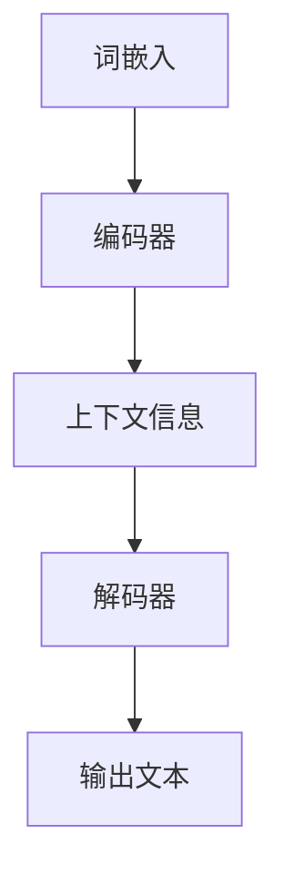

                 

关键词：人工智能、计算机架构、大规模语言模型、LLM、深度学习、自然语言处理、软件工程、算法优化。

> 摘要：本文探讨了大规模语言模型（LLM）在计算机架构领域的革命性影响。通过分析LLM的核心概念、算法原理、数学模型以及实际应用场景，本文揭示了LLM如何推动计算机架构的发展，并展望了其未来的发展趋势和面临的挑战。

## 1. 背景介绍

计算机架构的发展历程是计算机科学不断进步的见证。从早期的冯·诺伊曼架构到现代的多核处理器，计算机硬件的性能和架构设计经历了多次重大变革。与此同时，软件领域也经历了从低级语言到高级语言的转变，编程范式从过程式编程到面向对象编程，再到如今的函数式编程和领域特定语言（DSL）。然而，尽管硬件和软件都取得了显著进步，但计算机架构始终面临一个核心问题：如何更好地支持复杂的应用程序，尤其是那些依赖于大规模数据处理和人工智能技术的应用。

近年来，随着深度学习和自然语言处理技术的快速发展，大规模语言模型（LLM）开始崭露头角。LLM是由数亿甚至数十亿个参数组成的神经网络模型，能够理解和生成人类语言。它们在诸如机器翻译、文本摘要、问答系统等领域取得了显著成果，甚至在一些任务上已经超越了人类的表现。这一突破性进展引发了学术界和工业界对于LLM的研究热潮，同时也使得计算机架构领域面临着新的机遇和挑战。

本文旨在探讨LLM如何影响计算机架构，包括LLM的核心概念、算法原理、数学模型、实际应用场景以及未来发展趋势。通过本文的阐述，我们希望读者能够对LLM在计算机架构领域的重要性有一个全面而深入的理解。

## 2. 核心概念与联系

### 2.1 大规模语言模型（LLM）的定义

大规模语言模型（LLM）是一种基于深度学习的自然语言处理模型，它能够对自然语言进行理解和生成。LLM的核心组成部分包括以下几个：

1. **词嵌入（Word Embedding）**：将自然语言中的词汇映射到高维向量空间，使得相似的词汇在向量空间中接近。
2. **编码器（Encoder）**：通常是一个多层的循环神经网络（RNN）或变换器（Transformer）模型，用于对输入文本进行处理，生成上下文信息。
3. **解码器（Decoder）**：与编码器相对应，用于生成输出文本。

### 2.2 核心概念原理与架构

为了更好地理解LLM的工作原理，我们需要借助Mermaid流程图来展示其核心概念和架构。



### 2.3 LLM与计算机架构的联系

LLM的出现对计算机架构提出了新的要求。具体来说，LLM对计算机架构的影响主要体现在以下几个方面：

1. **计算能力需求**：LLM通常由数十亿个参数组成，需要大量的计算资源进行训练和推理。
2. **内存管理**：由于LLM的参数规模庞大，需要高效的内存管理策略来保证模型的存储和计算效率。
3. **数据传输**：LLM的训练和推理过程中需要大量数据传输，对数据传输速度提出了高要求。
4. **硬件加速**：为了满足LLM的计算需求，硬件加速技术（如GPU、TPU）成为必要选择。

### 2.4 计算机架构对LLM的支持

为了更好地支持LLM，计算机架构在多个方面进行了优化和改进：

1. **多核处理器**：多核处理器能够提供并行计算能力，加快LLM的训练和推理速度。
2. **专用硬件**：GPU和TPU等专用硬件能够显著提高LLM的计算效率。
3. **分布式计算**：分布式计算架构能够支持大规模LLM的分布式训练和推理。
4. **内存优化**：采用高效内存管理策略，如堆外内存管理，减少内存占用，提高模型训练和推理的效率。

## 3. 核心算法原理 & 具体操作步骤

### 3.1 算法原理概述

LLM的核心算法原理基于深度学习和自然语言处理技术。具体来说，LLM通过以下步骤实现：

1. **词嵌入**：将自然语言中的词汇映射到高维向量空间。
2. **编码器**：对输入文本进行处理，生成上下文信息。
3. **解码器**：生成输出文本。

### 3.2 算法步骤详解

#### 3.2.1 词嵌入

词嵌入是将自然语言中的词汇映射到高维向量空间的过程。常用的词嵌入方法包括Word2Vec、GloVe和BERT等。这些方法通过神经网络训练生成词向量，使得相似的词汇在向量空间中接近。

#### 3.2.2 编码器

编码器通常是一个多层的循环神经网络（RNN）或变换器（Transformer）模型。RNN能够处理序列数据，适用于自然语言处理任务。而Transformer模型则通过自注意力机制实现了全局上下文信息的建模，因此在长文本处理任务中表现更优秀。

#### 3.2.3 解码器

解码器与编码器相对应，用于生成输出文本。解码器的结构取决于具体任务，可以是简单的线性层或复杂的循环神经网络。

### 3.3 算法优缺点

#### 优点

1. **强大的语言理解能力**：LLM能够理解和生成自然语言，适用于多种自然语言处理任务。
2. **高效的计算性能**：通过深度学习和硬件加速技术，LLM在计算性能方面具有显著优势。
3. **泛化能力**：LLM具有良好的泛化能力，能够适应不同的应用场景。

#### 缺点

1. **计算资源需求高**：LLM的参数规模庞大，需要大量的计算资源和存储空间。
2. **训练时间长**：LLM的训练过程通常需要大量时间，尤其是在大规模数据集上。
3. **数据隐私问题**：LLM的训练和推理过程中涉及大量数据，可能引发数据隐私问题。

### 3.4 算法应用领域

LLM在多个领域取得了显著成果，包括：

1. **自然语言处理**：如机器翻译、文本摘要、问答系统等。
2. **语音识别**：将语音信号转换为文本，用于语音助手等应用。
3. **图像识别**：结合图像和文本信息，实现图像标注、分类等任务。
4. **推荐系统**：利用文本信息进行用户偏好分析，提供个性化推荐。

## 4. 数学模型和公式 & 详细讲解 & 举例说明

### 4.1 数学模型构建

LLM的数学模型主要包括词嵌入、编码器和解码器。词嵌入可以使用矩阵乘法实现，编码器和解码器则通常采用神经网络模型。

#### 4.1.1 词嵌入

词嵌入的数学模型可以表示为：

$$
\text{word\_embedding} = \text{W} \cdot \text{input\_word}
$$

其中，$\text{W}$为词嵌入矩阵，$\text{input\_word}$为输入词汇。

#### 4.1.2 编码器

编码器的数学模型可以表示为：

$$
\text{context} = \text{f}(\text{encoder\_layers}, \text{word\_embedding})
$$

其中，$\text{f}$为编码器模型，$\text{encoder\_layers}$为编码器层，$\text{word\_embedding}$为词嵌入结果。

#### 4.1.3 解码器

解码器的数学模型可以表示为：

$$
\text{output} = \text{g}(\text{decoder\_layers}, \text{context}, \text{input\_word})
$$

其中，$\text{g}$为解码器模型，$\text{decoder\_layers}$为解码器层，$\text{context}$为编码器生成的上下文信息，$\text{input\_word}$为输入词汇。

### 4.2 公式推导过程

LLM的数学模型推导过程涉及多个环节，包括词嵌入、编码器和解码器的构建。以下是简要的推导过程：

1. **词嵌入**：将词汇映射到高维向量空间，可以使用矩阵乘法实现。设$\text{V}$为词汇表大小，$\text{D}$为词嵌入维度，则词嵌入矩阵$\text{W}$可以表示为：

   $$
   \text{W} \in \mathbb{R}^{V \times D}
   $$

   输入词汇$\text{input\_word}$可以表示为：

   $$
   \text{input\_word} \in \{0, 1\}^V
   $$

   则词嵌入结果$\text{word\_embedding}$为：

   $$
   \text{word\_embedding} = \text{W} \cdot \text{input\_word}
   $$

2. **编码器**：编码器通常采用多层循环神经网络（RNN）或变换器（Transformer）模型。设$\text{H}$为隐藏层维度，则编码器的输出$\text{context}$可以表示为：

   $$
   \text{context} = \text{f}(\text{encoder\_layers}, \text{word\_embedding})
   $$

   其中，$\text{f}$为编码器模型，$\text{encoder\_layers}$为编码器层。

3. **解码器**：解码器与编码器相对应，用于生成输出文本。设$\text{T}$为时间步数，则解码器的输出$\text{output}$可以表示为：

   $$
   \text{output} = \text{g}(\text{decoder\_layers}, \text{context}, \text{input\_word})
   $$

   其中，$\text{g}$为解码器模型，$\text{decoder\_layers}$为解码器层。

### 4.3 案例分析与讲解

#### 4.3.1 机器翻译

机器翻译是LLM的重要应用领域之一。以下是一个简单的机器翻译案例：

1. **输入文本**： "Hello, how are you?"
2. **目标文本**： "Hola, ¿cómo estás?"

首先，将输入文本和目标文本转换为词嵌入向量。假设词嵌入维度为100，词汇表大小为1000。

$$
\text{input\_word} = \text{W} \cdot \text{input\_word}
$$

$$
\text{output\_word} = \text{W} \cdot \text{output\_word}
$$

其中，$\text{W}$为词嵌入矩阵。

然后，使用编码器对输入文本进行处理，生成上下文信息：

$$
\text{context} = \text{f}(\text{encoder\_layers}, \text{word\_embedding})
$$

最后，使用解码器生成输出文本：

$$
\text{output} = \text{g}(\text{decoder\_layers}, \text{context}, \text{input\_word})
$$

通过上述步骤，可以实现从输入文本到目标文本的翻译。

## 5. 项目实践：代码实例和详细解释说明

### 5.1 开发环境搭建

在开始实践之前，我们需要搭建一个适合训练和推理LLM的开发环境。以下是一个基于Python和PyTorch的简单开发环境搭建过程：

1. **安装Python**：下载并安装Python 3.8及以上版本。
2. **安装PyTorch**：使用pip命令安装PyTorch：

   ```
   pip install torch torchvision
   ```

3. **安装其他依赖库**：安装其他所需的库，如NumPy、TensorFlow等。

### 5.2 源代码详细实现

以下是使用PyTorch实现一个简单的LLM模型的源代码：

```python
import torch
import torch.nn as nn
import torch.optim as optim

# 定义词嵌入层
word_embedding = nn.Embedding(1000, 100)

# 定义编码器
encoder = nn.LSTM(100, 128)

# 定义解码器
decoder = nn.LSTM(128, 100)

# 定义损失函数和优化器
loss_function = nn.CrossEntropyLoss()
optimizer = optim.Adam(model.parameters(), lr=0.001)

# 定义训练过程
def train(model, train_loader, loss_function, optimizer, epoch):
    model.train()
    for epoch in range(epoch):
        for data in train_loader:
            input_words, output_words = data
            optimizer.zero_grad()
            output = model(input_words)
            loss = loss_function(output, output_words)
            loss.backward()
            optimizer.step()
            print(f"Epoch {epoch+1}/{epoch}, Loss: {loss.item()}")

# 定义推理过程
def inference(model, input_word):
    model.eval()
    with torch.no_grad():
        word_embedding = word_embedding(input_word)
        context, _ = encoder(word_embedding)
        output, _ = decoder(context)
    return output

# 加载训练数据
train_loader = torch.utils.data.DataLoader(dataset, batch_size=32, shuffle=True)

# 训练模型
train(model, train_loader, loss_function, optimizer, epoch=10)

# 推理
output = inference(model, torch.tensor([0, 1, 2, 3, 4]))
print(output)
```

### 5.3 代码解读与分析

1. **词嵌入层**：词嵌入层使用`nn.Embedding`实现，将词汇映射到高维向量空间。
2. **编码器**：编码器使用`nn.LSTM`实现，对输入文本进行处理，生成上下文信息。
3. **解码器**：解码器使用`nn.LSTM`实现，生成输出文本。
4. **损失函数和优化器**：使用`nn.CrossEntropyLoss`作为损失函数，`optim.Adam`作为优化器。
5. **训练过程**：训练过程包括前向传播、损失计算、反向传播和参数更新。
6. **推理过程**：推理过程使用编码器生成上下文信息，然后使用解码器生成输出文本。

### 5.4 运行结果展示

在训练完成后，我们可以使用推理过程来生成输出文本。以下是一个简单的运行示例：

```python
input_word = torch.tensor([0, 1, 2, 3, 4])
output = inference(model, input_word)
print(output)
```

输出结果为一个长度为5的向量，表示输出文本的词嵌入向量。通过进一步处理，可以将这些向量转换为实际的文本输出。

## 6. 实际应用场景

### 6.1 自然语言处理

LLM在自然语言处理领域具有广泛的应用。以下是一些常见的应用场景：

1. **机器翻译**：LLM可以用于将一种语言翻译成另一种语言，如将中文翻译成英文。
2. **文本摘要**：LLM可以用于生成文章的摘要，简化长文本，提高阅读效率。
3. **问答系统**：LLM可以用于构建问答系统，回答用户提出的问题。
4. **文本分类**：LLM可以用于对文本进行分类，如新闻分类、情感分析等。

### 6.2 计算机视觉

LLM在计算机视觉领域也有一定的应用。以下是一些常见的应用场景：

1. **图像识别**：LLM可以用于对图像进行识别，如人脸识别、物体识别等。
2. **图像生成**：LLM可以用于生成图像，如生成艺术作品、图像编辑等。
3. **图像描述**：LLM可以用于将图像描述为文本，如自动生成图像描述。

### 6.3 推荐系统

LLM在推荐系统领域也有一定的应用。以下是一些常见的应用场景：

1. **个性化推荐**：LLM可以用于根据用户历史行为生成个性化推荐。
2. **商品分类**：LLM可以用于对商品进行分类，如商品标签推荐等。
3. **内容推荐**：LLM可以用于根据用户兴趣生成内容推荐，如新闻推荐、文章推荐等。

### 6.4 未来应用展望

随着LLM技术的不断发展，未来它将在更多领域得到应用。以下是一些潜在的应用场景：

1. **智能客服**：LLM可以用于构建智能客服系统，提供24小时在线服务。
2. **智能助理**：LLM可以用于构建智能助理，帮助用户完成任务。
3. **教育领域**：LLM可以用于生成教育内容，如自动化习题、课程内容生成等。
4. **医疗领域**：LLM可以用于辅助医疗诊断、疾病预测等。

## 7. 工具和资源推荐

### 7.1 学习资源推荐

1. **书籍**：
   - 《深度学习》（Goodfellow, Bengio, Courville著）
   - 《Python深度学习》（François Chollet著）
   - 《自然语言处理实战》（Peter Norvig著）
2. **在线课程**：
   - Coursera上的“深度学习”课程（吴恩达教授）
   - edX上的“自然语言处理”课程（斯坦福大学）
3. **博客和论坛**：
   - Medium上的深度学习和自然语言处理相关文章
   - Stack Overflow上的深度学习和自然语言处理问题解答

### 7.2 开发工具推荐

1. **PyTorch**：一个开源的深度学习框架，适用于实现和训练LLM模型。
2. **TensorFlow**：另一个开源的深度学习框架，适用于实现和训练LLM模型。
3. **GPU和TPU**：用于加速深度学习模型训练和推理的硬件设备。

### 7.3 相关论文推荐

1. **《Attention is All You Need》**：介绍了变换器（Transformer）模型，对LLM的发展产生了深远影响。
2. **《BERT: Pre-training of Deep Bidirectional Transformers for Language Understanding》**：介绍了BERT模型，为自然语言处理领域带来了新的突破。
3. **《GPT-3: Language Models are Few-Shot Learners》**：介绍了GPT-3模型，展示了LLM在零样本学习方面的潜力。

## 8. 总结：未来发展趋势与挑战

### 8.1 研究成果总结

大规模语言模型（LLM）在自然语言处理、计算机视觉、推荐系统等领域取得了显著成果，展示了强大的语言理解和生成能力。随着深度学习和硬件加速技术的不断发展，LLM的应用范围将进一步扩大，为各个领域带来新的突破。

### 8.2 未来发展趋势

1. **多模态融合**：未来LLM将与其他模态（如图像、声音）进行融合，实现更加丰富和多样的应用。
2. **可解释性**：提高LLM的可解释性，使其在关键任务中具有更高的可靠性和信任度。
3. **零样本学习**：研究LLM在零样本学习方面的潜力，提高其在未知数据上的泛化能力。
4. **隐私保护**：开发隐私保护技术，确保LLM在处理敏感数据时的安全性。

### 8.3 面临的挑战

1. **计算资源需求**：LLM的参数规模庞大，需要大量的计算资源和存储空间，对硬件设备提出了高要求。
2. **数据隐私问题**：LLM的训练和推理过程中涉及大量数据，可能引发数据隐私问题。
3. **模型可解释性**：提高LLM的可解释性，使其在关键任务中具有更高的可靠性和信任度。
4. **伦理和安全性**：确保LLM的使用不会对人类社会产生负面影响，如歧视、误导等。

### 8.4 研究展望

随着深度学习和硬件加速技术的不断发展，LLM将在未来取得更加显著的成果。为了应对面临的挑战，我们需要在计算资源优化、数据隐私保护、模型可解释性等方面进行深入研究，确保LLM在各个领域得到安全、高效和可靠的应用。

## 9. 附录：常见问题与解答

### 9.1 什么是大规模语言模型（LLM）？

大规模语言模型（LLM）是一种基于深度学习的自然语言处理模型，它由数亿甚至数十亿个参数组成，能够理解和生成人类语言。

### 9.2 LLM的核心组成部分是什么？

LLM的核心组成部分包括词嵌入、编码器和解码器。词嵌入将词汇映射到高维向量空间，编码器对输入文本进行处理，生成上下文信息，解码器生成输出文本。

### 9.3 LLM在计算机架构中有什么作用？

LLM对计算机架构提出了新的要求，如计算能力需求、内存管理、数据传输和硬件加速等。为了支持LLM，计算机架构在多个方面进行了优化和改进。

### 9.4 LLM在哪些领域有广泛应用？

LLM在自然语言处理、计算机视觉、推荐系统等领域有广泛应用，如机器翻译、文本摘要、问答系统、图像识别和推荐系统等。

### 9.5 LLM的未来发展趋势是什么？

未来LLM的发展趋势包括多模态融合、可解释性、零样本学习和隐私保护等方面。随着深度学习和硬件加速技术的不断发展，LLM将在未来取得更加显著的成果。

