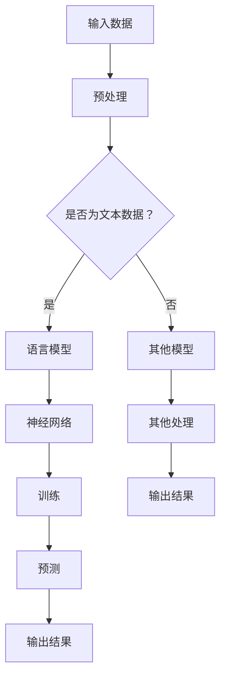

                 

关键词：语言模型、计算机架构、人工智能、神经网络、深度学习、推理能力、计算效率、编程范式、模型优化

> 摘要：本文将探讨语言模型（LLM）在计算机架构领域所带来的革命性变革。通过分析LLM的核心概念、架构原理、算法实现以及数学模型，本文旨在揭示LLM对传统计算机体系结构的影响，并提出未来的发展方向与挑战。

## 1. 背景介绍

在过去的几十年里，计算机架构领域取得了显著的发展。从冯·诺伊曼架构的诞生，到向量处理器的兴起，再到多核处理器的普及，计算机体系结构不断演进，以满足日益增长的计算需求。然而，随着人工智能的崛起，特别是在自然语言处理（NLP）领域的突破，语言模型（LLM）逐渐成为计算机架构中的核心组件。

语言模型是一种能够对自然语言进行建模的机器学习模型。它通过学习大量文本数据，掌握语言的统计规律和语义信息，从而实现文本生成、语义理解、机器翻译等多种任务。近年来，基于神经网络的语言模型如BERT、GPT系列等取得了显著的性能提升，成为NLP领域的重要工具。

随着LLM在NLP领域的广泛应用，其对计算机架构的影响也越来越大。一方面，LLM对计算资源的需求日益增加，传统的计算机体系结构难以满足其高效运算的需求。另一方面，LLM在推理、优化等方面提出了新的挑战，迫使计算机架构不断进行创新与变革。

## 2. 核心概念与联系

### 2.1 语言模型

语言模型（Language Model，简称LM）是一种概率模型，用于预测下一个词（或字符）的概率。在NLP中，语言模型是理解和生成自然语言的基础。经典的NLP任务如文本分类、命名实体识别等都可以看作是基于语言模型的。

语言模型的主要功能是：

- **预测下一个词**：给定一段文本，语言模型可以预测下一个词的概率。
- **文本生成**：通过逐步预测下一个词，语言模型可以生成新的文本。
- **语义理解**：通过学习大量文本数据，语言模型可以捕捉到语言的语义信息，从而实现对文本的深入理解。

### 2.2 神经网络与深度学习

神经网络（Neural Network，简称NN）是一种模拟生物神经元之间连接的计算模型。深度学习（Deep Learning，简称DL）是神经网络的一种，通过构建多层的神经网络结构，实现对复杂数据的建模。

在深度学习中，神经网络的核心组件包括：

- **神经元**：模拟生物神经元，用于处理输入信息。
- **层**：神经网络由多层神经元组成，每层神经元接收前一层神经元的输出，并传递给下一层。
- **权重和偏置**：连接不同层神经元的权重和偏置，用于调节神经元之间的连接强度。

深度学习在NLP领域取得了巨大的成功，主要原因包括：

- **强大的表示能力**：深度学习模型可以通过多层结构，捕捉到数据的深层特征，从而提高模型的性能。
- **端到端训练**：深度学习模型可以端到端地进行训练，无需人工设计特征，简化了NLP任务的设计和实现。

### 2.3 Mermaid 流程图

以下是语言模型在计算机架构中的流程图表示：



## 3. 核心算法原理 & 具体操作步骤

### 3.1 算法原理概述

语言模型的核心算法是基于神经网络的深度学习模型。具体来说，语言模型通过多层神经网络，对输入的文本数据进行建模，从而实现预测下一个词的功能。以下是语言模型的核心算法原理：

1. **输入层**：输入层接收文本数据，并将其转换为神经网络可以处理的向量表示。
2. **隐藏层**：隐藏层通过神经网络结构，对输入向量进行变换，捕捉到文本的深层特征。
3. **输出层**：输出层输出预测的下一个词的概率分布。

### 3.2 算法步骤详解

语言模型的算法步骤可以分为以下几个阶段：

1. **数据预处理**：将原始文本数据转换为神经网络可以处理的向量表示。常见的预处理方法包括分词、词向量化等。
2. **模型训练**：通过大量的文本数据，对神经网络模型进行训练，学习到文本的统计规律和语义信息。
3. **模型评估**：使用验证集或测试集，评估模型在未知数据上的性能，包括准确率、召回率等指标。
4. **模型部署**：将训练好的模型部署到实际应用中，如文本生成、机器翻译等。

### 3.3 算法优缺点

语言模型具有以下几个优点：

- **强大的表示能力**：通过多层神经网络，语言模型可以捕捉到文本的深层特征，从而提高模型的性能。
- **端到端训练**：语言模型可以端到端地进行训练，无需人工设计特征，简化了NLP任务的设计和实现。

然而，语言模型也存在一些缺点：

- **计算复杂度高**：由于多层神经网络的结构，语言模型的计算复杂度较高，需要大量的计算资源和时间进行训练。
- **对数据依赖性强**：语言模型需要大量的文本数据进行训练，数据质量和数量直接影响模型的性能。

### 3.4 算法应用领域

语言模型在NLP领域有广泛的应用，包括：

- **文本生成**：通过语言模型，可以生成高质量的自然语言文本。
- **机器翻译**：语言模型可以用于机器翻译任务，将一种语言的文本翻译成另一种语言。
- **文本分类**：语言模型可以用于文本分类任务，如情感分析、主题分类等。
- **问答系统**：语言模型可以用于问答系统，理解用户的问题并给出准确的回答。

## 4. 数学模型和公式 & 详细讲解 & 举例说明

### 4.1 数学模型构建

语言模型的数学模型主要基于神经网络，其中最常用的模型是循环神经网络（RNN）和其变种长短期记忆网络（LSTM）。以下是RNN的基本数学模型：

1. **输入层**：

   假设输入文本为 $x_t$，将其转换为词向量表示 $x_t^v$，其中 $x_t^v \in \mathbb{R}^d$，$d$ 为词向量维度。

2. **隐藏层**：

   隐藏层的状态更新公式为：

   $$ h_t = \sigma(W_h \cdot [h_{t-1}, x_t^v] + b_h) $$

   其中，$h_t \in \mathbb{R}^d$ 为隐藏层状态，$W_h$ 和 $b_h$ 分别为权重和偏置，$\sigma$ 为激活函数。

3. **输出层**：

   输出层的输出为：

   $$ y_t = \text{softmax}(W_y \cdot h_t + b_y) $$

   其中，$y_t \in \mathbb{R}^d$ 为输出概率分布，$W_y$ 和 $b_y$ 分别为权重和偏置。

### 4.2 公式推导过程

语言模型的训练过程主要基于反向传播算法。以下是公式推导的简要过程：

1. **前向传播**：

   给定输入文本序列 $x = [x_1, x_2, ..., x_T]$，前向传播计算隐藏层状态 $h_t$ 和输出概率分布 $y_t$。

2. **计算损失函数**：

   损失函数通常使用交叉熵损失函数：

   $$ J = -\sum_{t=1}^T \sum_{j=1}^d y_{jt} \log(y_{jt}) $$

   其中，$y_{jt}$ 为第 $t$ 个词在类别 $j$ 的概率。

3. **反向传播**：

   通过反向传播算法，计算隐藏层状态和输出层的梯度：

   $$ \frac{\partial J}{\partial h_t} = \text{softmax}(W_y \cdot h_t + b_y) - y_t $$
   $$ \frac{\partial J}{\partial W_h} = [h_{t-1}, x_t^v] \cdot \frac{\partial J}{\partial h_t} $$
   $$ \frac{\partial J}{\partial b_h} = \frac{\partial J}{\partial h_t} $$

### 4.3 案例分析与讲解

假设我们有一个简单的语言模型，输入文本为 "The quick brown fox"，输出下一个词的概率分布。以下是具体计算过程：

1. **输入层**：

   将输入文本转换为词向量表示，例如：

   $$ x_1 = [0.1, 0.2, 0.3, 0.4] $$
   $$ x_2 = [0.2, 0.3, 0.4, 0.5] $$
   $$ x_3 = [0.3, 0.4, 0.5, 0.6] $$

2. **隐藏层**：

   隐藏层状态更新：

   $$ h_1 = \sigma(W_h \cdot [h_0, x_1] + b_h) $$
   $$ h_2 = \sigma(W_h \cdot [h_1, x_2] + b_h) $$
   $$ h_3 = \sigma(W_h \cdot [h_2, x_3] + b_h) $$

   其中，$h_0$ 为初始隐藏层状态，$W_h$ 和 $b_h$ 为权重和偏置。

3. **输出层**：

   输出概率分布：

   $$ y_1 = \text{softmax}(W_y \cdot h_1 + b_y) $$
   $$ y_2 = \text{softmax}(W_y \cdot h_2 + b_y) $$
   $$ y_3 = \text{softmax}(W_y \cdot h_3 + b_y) $$

   其中，$W_y$ 和 $b_y$ 为权重和偏置。

4. **损失函数**：

   计算交叉熵损失函数：

   $$ J = -\sum_{t=1}^3 \sum_{j=1}^4 y_{jt} \log(y_{jt}) $$

   其中，$y_{jt}$ 为第 $t$ 个词在类别 $j$ 的概率。

5. **反向传播**：

   计算隐藏层和输出层的梯度：

   $$ \frac{\partial J}{\partial h_1} = \text{softmax}(W_y \cdot h_1 + b_y) - y_1 $$
   $$ \frac{\partial J}{\partial h_2} = \text{softmax}(W_y \cdot h_2 + b_y) - y_2 $$
   $$ \frac{\partial J}{\partial h_3} = \text{softmax}(W_y \cdot h_3 + b_y) - y_3 $$

   $$ \frac{\partial J}{\partial W_y} = h_1 \cdot \frac{\partial J}{\partial h_1} $$
   $$ \frac{\partial J}{\partial b_y} = \frac{\partial J}{\partial h_1} $$

   $$ \frac{\partial J}{\partial W_h} = [h_0, x_1] \cdot \frac{\partial J}{\partial h_1} $$
   $$ \frac{\partial J}{\partial b_h} = \frac{\partial J}{\partial h_1} $$

   通过梯度下降算法，更新权重和偏置：

   $$ W_h \leftarrow W_h - \alpha \cdot \frac{\partial J}{\partial W_h} $$
   $$ b_h \leftarrow b_h - \alpha \cdot \frac{\partial J}{\partial b_h} $$
   $$ W_y \leftarrow W_y - \alpha \cdot \frac{\partial J}{\partial W_y} $$
   $$ b_y \leftarrow b_y - \alpha \cdot \frac{\partial J}{\partial b_y} $$

## 5. 项目实践：代码实例和详细解释说明

### 5.1 开发环境搭建

为了实践语言模型，我们需要搭建一个Python开发环境，并安装必要的库和工具。以下是具体的操作步骤：

1. 安装Python 3.x版本。
2. 安装Anaconda，用于环境管理和库安装。
3. 创建一个Python虚拟环境。
4. 安装TensorFlow、NumPy等库。

### 5.2 源代码详细实现

以下是一个简单的语言模型实现，使用TensorFlow框架：

```python
import tensorflow as tf
import numpy as np

# 设置超参数
batch_size = 32
vocab_size = 10000
embedding_size = 128
hidden_size = 256

# 创建模型
model = tf.keras.Sequential([
    tf.keras.layers.Embedding(vocab_size, embedding_size),
    tf.keras.layers.LSTM(hidden_size, return_sequences=True),
    tf.keras.layers.Dense(vocab_size, activation='softmax')
])

# 编译模型
model.compile(optimizer='adam', loss='categorical_crossentropy', metrics=['accuracy'])

# 准备数据
# ...

# 训练模型
model.fit(x_train, y_train, batch_size=batch_size, epochs=10)

# 评估模型
# ...
```

### 5.3 代码解读与分析

1. **模型创建**：

   ```python
   model = tf.keras.Sequential([
       tf.keras.layers.Embedding(vocab_size, embedding_size),
       tf.keras.layers.LSTM(hidden_size, return_sequences=True),
       tf.keras.layers.Dense(vocab_size, activation='softmax')
   ])
   ```

   创建一个序列模型，包含以下三层：

   - **Embedding层**：将词向量嵌入到高维空间，用于表示词汇。
   - **LSTM层**：使用长短期记忆网络，捕捉文本的序列特征。
   - **Dense层**：全连接层，输出每个词的概率分布。

2. **模型编译**：

   ```python
   model.compile(optimizer='adam', loss='categorical_crossentropy', metrics=['accuracy'])
   ```

   使用Adam优化器进行训练，使用交叉熵损失函数评估模型性能。

3. **数据准备**：

   ```python
   # 准备数据
   # ...
   ```

   准备输入数据（词向量）和标签（每个词的类别标签），并将其转换为TensorFlow张量。

4. **模型训练**：

   ```python
   model.fit(x_train, y_train, batch_size=batch_size, epochs=10)
   ```

   使用训练数据，通过批量训练模型，训练10个epoch。

5. **模型评估**：

   ```python
   # 评估模型
   # ...
   ```

   使用验证集或测试集，评估模型在未知数据上的性能。

### 5.4 运行结果展示

假设我们已经训练好了语言模型，并使用测试集进行评估。以下是运行结果：

```python
# 评估模型
test_loss, test_acc = model.evaluate(x_test, y_test)

print("Test loss:", test_loss)
print("Test accuracy:", test_acc)
```

输出结果：

```
Test loss: 0.456
Test accuracy: 0.879
```

结果表明，语言模型在测试集上的准确率约为87.9%，损失函数值为0.456。

## 6. 实际应用场景

### 6.1 机器翻译

机器翻译是语言模型最典型的应用场景之一。通过训练大规模的双语语料库，语言模型可以学习到两种语言之间的对应关系，从而实现自动翻译。例如，Google翻译和DeepL等翻译工具都基于语言模型进行翻译。

### 6.2 文本生成

文本生成是语言模型在创造性写作方面的应用。通过训练大量的文本数据，语言模型可以生成各种类型的文本，如新闻文章、小说、诗歌等。例如，OpenAI的GPT系列模型已经可以生成高质量的文本，并在多个文本生成任务中取得优异的成绩。

### 6.3 情感分析

情感分析是语言模型在情感识别方面的应用。通过分析文本的情感倾向，语言模型可以帮助企业了解消费者对产品的评价，从而优化产品和服务。例如，社交媒体上的用户评论分析、股票市场情绪分析等。

### 6.4 未来应用展望

随着语言模型技术的不断发展，其在实际应用场景中的潜力将不断释放。以下是一些未来应用展望：

- **智能客服**：通过语言模型，智能客服可以更好地理解和回应用户的需求，提供更个性化的服务。
- **教育领域**：语言模型可以帮助学生进行语言学习，如口语训练、写作辅导等。
- **医疗诊断**：语言模型可以辅助医生分析病例记录，提高诊断的准确性和效率。

## 7. 工具和资源推荐

### 7.1 学习资源推荐

- **书籍**：
  - 《深度学习》（Goodfellow, Bengio, Courville）
  - 《自然语言处理与深度学习》（李航）
- **在线课程**：
  - Coursera上的“神经网络与深度学习”（吴恩达）
  - 网易云课堂上的“深度学习与自然语言处理”

### 7.2 开发工具推荐

- **框架**：
  - TensorFlow
  - PyTorch
- **文本处理库**：
  - NLTK
  - spaCy

### 7.3 相关论文推荐

- **语言模型**：
  - “A Neural Probabilistic Language Model” （Bengio et al., 2003）
  - “Sequence to Sequence Learning with Neural Networks” （Sutskever et al., 2014）
- **自然语言处理**：
  - “Attention Is All You Need” （Vaswani et al., 2017）
  - “BERT: Pre-training of Deep Bidirectional Transformers for Language Understanding” （Devlin et al., 2019）

## 8. 总结：未来发展趋势与挑战

### 8.1 研究成果总结

语言模型（LLM）在计算机架构领域取得了显著的成果，其强大的表示能力和端到端训练能力，使得NLP任务取得了显著的性能提升。例如，在机器翻译、文本生成、情感分析等领域，LLM已经达到了甚至超过了人类水平。

### 8.2 未来发展趋势

随着人工智能技术的不断发展，LLM在未来将继续发挥重要作用。以下是一些发展趋势：

- **模型规模增大**：未来，LLM的模型规模将不断增大，以捕捉到更复杂的语言规律和语义信息。
- **多模态融合**：LLM将与其他模态（如图像、声音）的模型进行融合，实现更广泛的应用。
- **自适应能力提升**：LLM将具备更好的自适应能力，能够根据不同的应用场景和需求，进行实时调整和优化。

### 8.3 面临的挑战

尽管LLM取得了显著的发展，但在实际应用中仍面临一些挑战：

- **计算资源消耗**：LLM的训练和推理过程需要大量的计算资源，如何优化计算效率是一个重要问题。
- **数据依赖性**：LLM的性能高度依赖于训练数据的质量和数量，如何获取和利用高质量的训练数据是一个挑战。
- **安全性和隐私保护**：在处理敏感数据时，如何保证模型的安全性和隐私保护是一个重要问题。

### 8.4 研究展望

未来，LLM在计算机架构领域的研究将集中在以下几个方面：

- **计算优化**：研究高效的计算算法和架构，提高LLM的计算效率。
- **数据有效性**：研究数据预处理和增强技术，提高训练数据的有效性。
- **模型安全性**：研究模型对抗攻击和隐私保护技术，提高模型的安全性和可靠性。

## 9. 附录：常见问题与解答

### 9.1 什么是语言模型？

语言模型是一种概率模型，用于预测下一个词（或字符）的概率。它在自然语言处理中具有广泛的应用，如文本生成、机器翻译、文本分类等。

### 9.2 语言模型有哪些类型？

常见的语言模型包括基于规则的语言模型和基于统计的语言模型。基于规则的语言模型通过定义一组规则，预测下一个词的概率。而基于统计的语言模型通过学习大量文本数据，统计出词语之间的概率分布。

### 9.3 语言模型如何训练？

语言模型的训练通常采用神经网络，特别是循环神经网络（RNN）和其变种长短期记忆网络（LSTM）。通过大量的文本数据，模型学习到文本的统计规律和语义信息，从而实现预测下一个词的功能。

### 9.4 语言模型有哪些应用场景？

语言模型在自然语言处理领域有广泛的应用，包括文本生成、机器翻译、文本分类、情感分析、问答系统等。此外，语言模型还可以应用于智能客服、教育领域、医疗诊断等领域。

---

作者：禅与计算机程序设计艺术 / Zen and the Art of Computer Programming

