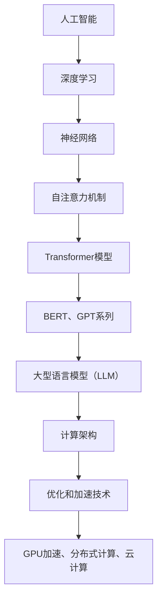

                 

关键词：大型语言模型，计算架构，深度学习，神经网络，Transformer，自然语言处理，计算优化，硬件加速，分布式计算，云计算

> 摘要：本文将探讨大型语言模型（LLM）在计算架构领域的革命性突破。通过分析LLM的兴起、核心算法原理、数学模型、实际应用以及未来展望，本文旨在为读者提供一个全面深入的理解，帮助他们在这一快速发展的领域中把握机遇，应对挑战。

## 1. 背景介绍

近年来，人工智能（AI）领域取得了显著的进展，其中以大型语言模型（LLM）为代表的技术尤为引人注目。LLM是基于深度学习和神经网络构建的复杂模型，它们能够对大量文本数据进行处理，从而实现自然语言理解、生成和翻译等任务。这一技术的突破不仅改变了自然语言处理（NLP）的格局，还对整个计算架构领域产生了深远影响。

LLM的兴起可以追溯到2018年，当时谷歌推出了Transformer模型，该模型采用了自注意力机制，相较于传统的循环神经网络（RNN）在处理长文本方面具有显著优势。此后，以BERT、GPT系列为代表的一系列大型语言模型相继问世，进一步推动了NLP技术的发展。这些模型通过训练数以万亿计的参数，能够达到前所未有的准确性和泛化能力。

计算架构领域的变革同样不容忽视。随着LLM的复杂性不断提升，传统的计算架构难以满足其计算需求。为了应对这一挑战，研究人员和工程师们开始探索各种优化和加速技术，如GPU加速、分布式计算和云计算等。这些技术的应用不仅提升了LLM的训练和推理效率，也为未来的计算架构创新提供了新的思路。

## 2. 核心概念与联系

为了更好地理解LLM在计算架构中的革命性突破，我们需要先了解其核心概念和联系。以下是LLM、深度学习和神经网络等概念之间的Mermaid流程图：



### 2.1 大型语言模型（LLM）

LLM是一种能够对大量文本数据进行处理的大型神经网络模型。它们通过学习语言模式，实现自然语言理解、生成和翻译等任务。LLM的主要特点是参数规模庞大，通常需要数以万亿计的参数。这使得LLM在处理复杂语言任务时具有显著的性能优势。

### 2.2 深度学习

深度学习是一种基于神经网络的学习方法，通过多层神经元的堆叠，实现对复杂数据特征的自动提取和表示。深度学习在图像识别、语音识别和自然语言处理等领域取得了显著成果，成为人工智能研究的重要方向。

### 2.3 神经网络

神经网络是一种由大量神经元组成的计算模型，通过前向传播和反向传播算法，实现数据的输入、处理和输出。神经网络的核心思想是通过学习数据中的特征，实现对未知数据的预测和分类。

### 2.4 自注意力机制

自注意力机制是一种用于处理序列数据的注意力机制，通过对序列中的每个元素赋予不同的权重，实现对序列的建模。自注意力机制在Transformer模型中被广泛应用，成为NLP领域的重要技术。

### 2.5 Transformer模型

Transformer模型是一种基于自注意力机制的深度学习模型，最初由Vaswani等人于2017年提出。该模型通过多头自注意力机制和前馈神经网络，实现对序列数据的建模，从而在NLP任务中取得了显著性能。

### 2.6 BERT、GPT系列

BERT（Bidirectional Encoder Representations from Transformers）和GPT（Generative Pre-trained Transformer）系列是两种具有代表性的大型语言模型。BERT通过预训练和微调，实现了对自然语言的理解和生成；而GPT则通过生成式建模，实现了对文本的自动生成。

## 3. 核心算法原理 & 具体操作步骤

### 3.1 算法原理概述

大型语言模型的训练过程主要包括两个阶段：预训练和微调。预训练阶段，模型在大量无标签文本数据上进行训练，学习语言的基础知识；微调阶段，模型在特定任务上有标签数据上进行训练，优化模型的性能。

### 3.2 算法步骤详解

#### 3.2.1 预训练阶段

1. **数据预处理**：对原始文本数据（如维基百科、新闻、小说等）进行清洗、分词和编码，将文本转化为模型可处理的格式。

2. **词嵌入**：将文本中的每个词转化为向量表示，通常使用Word2Vec、BERT等预训练词向量模型。

3. **模型初始化**：初始化大型语言模型，包括词嵌入层、多头自注意力机制、前馈神经网络等。

4. **损失函数**：使用交叉熵损失函数，计算模型输出的概率分布与真实标签之间的差异。

5. **反向传播**：通过反向传播算法，计算模型参数的梯度，并更新模型参数。

6. **迭代训练**：重复上述步骤，逐步优化模型性能。

#### 3.2.2 微调阶段

1. **数据预处理**：与预训练阶段类似，对有标签的文本数据进行清洗、分词和编码。

2. **模型加载**：加载预训练阶段训练好的模型，并调整部分参数，以适应特定任务。

3. **损失函数**：根据任务类型，选择适当的损失函数，如分类任务的交叉熵损失函数。

4. **反向传播**：通过反向传播算法，计算模型参数的梯度，并更新模型参数。

5. **迭代微调**：重复上述步骤，逐步优化模型在特定任务上的性能。

### 3.3 算法优缺点

#### 优点

1. **强大的语言理解能力**：大型语言模型通过预训练和微调，能够对大量文本数据进行处理，从而实现强大的语言理解能力。

2. **多任务处理**：大型语言模型在预训练阶段学习了丰富的语言知识，可以应用于多种自然语言处理任务，如文本分类、机器翻译、情感分析等。

3. **高泛化能力**：由于预训练阶段使用了大量无标签数据，大型语言模型具有较好的泛化能力，可以在不同领域和任务上取得良好的性能。

#### 缺点

1. **计算资源需求大**：大型语言模型的训练和推理需要大量的计算资源和时间，对硬件性能和能耗提出了较高要求。

2. **数据依赖性**：大型语言模型在预训练阶段依赖于大量的文本数据，数据质量和多样性对模型性能有较大影响。

3. **可解释性差**：大型语言模型内部结构复杂，难以解释其决策过程，这在某些应用场景中可能带来安全隐患。

### 3.4 算法应用领域

大型语言模型在多个领域取得了显著成果，以下是一些主要应用领域：

1. **自然语言处理**：文本分类、机器翻译、情感分析、问答系统等。

2. **信息检索**：搜索引擎优化、推荐系统、信息抽取等。

3. **对话系统**：智能客服、聊天机器人、虚拟助手等。

4. **文本生成**：文章写作、摘要生成、对话生成等。

5. **知识图谱**：实体关系抽取、知识推理、推理引擎等。

## 4. 数学模型和公式 & 详细讲解 & 举例说明

### 4.1 数学模型构建

大型语言模型通常采用深度学习框架，如TensorFlow、PyTorch等。在构建数学模型时，主要涉及以下几个关键组件：

1. **输入层**：将文本转化为向量表示，通常使用词嵌入层。

2. **隐藏层**：采用多头自注意力机制和前馈神经网络，实现对序列数据的建模。

3. **输出层**：根据任务类型，选择适当的输出层，如分类任务的softmax层。

以下是一个简化的数学模型示例：

```latex
\begin{equation}
\begin{aligned}
\text{Input} &= \text{Token Embeddings} \\
\text{Hidden} &= \text{Multi-Head Attention}(\text{Input}) \\
               &+ \text{Feedforward Layer}(\text{Hidden}) \\
\text{Output} &= \text{Softmax}(\text{Hidden})
\end{aligned}
\end{equation}
```

### 4.2 公式推导过程

在推导大型语言模型的数学模型时，我们需要关注以下几个方面：

1. **词嵌入**：将文本中的每个词转化为向量表示，通常使用Word2Vec、BERT等预训练词向量模型。

2. **多头自注意力机制**：多头自注意力机制是一种用于处理序列数据的注意力机制，通过对序列中的每个元素赋予不同的权重，实现对序列的建模。

3. **前馈神经网络**：前馈神经网络是一种简单的神经网络结构，通过多层神经元的堆叠，实现数据的输入、处理和输出。

以下是一个简化的推导过程：

```latex
\begin{equation}
\begin{aligned}
\text{Input} &= \text{Token Embeddings} \\
\text{Hidden} &= \text{Multi-Head Attention}(\text{Input}) \\
               &+ \text{Feedforward Layer}(\text{Hidden}) \\
\text{Output} &= \text{Softmax}(\text{Hidden})
\end{aligned}
\end{equation}

\begin{equation}
\begin{aligned}
\text{Multi-Head Attention} &= \text{Concat}(\text{Head}_1, \text{Head}_2, \ldots, \text{Head}_h) \\
\text{Head}_i &= \text{Attention}(\text{Query}, \text{Key}, \text{Value})
\end{aligned}
\end{equation}

\begin{equation}
\begin{aligned}
\text{Attention} &= \text{Scale dot-product attention} \\
\text{Query} &= \text{W}_Q \text{Input} \\
\text{Key} &= \text{W}_K \text{Input} \\
\text{Value} &= \text{W}_V \text{Input} \\
\text{Attention} &= \text{softmax}(\text{score}) \odot \text{Value}
\end{aligned}
\end{equation}

\begin{equation}
\begin{aligned}
\text{Feedforward Layer} &= \text{FFN}(\text{Hidden}) \\
\text{FFN} &= \text{Relu}(\text{W}_1 \text{Hidden} + \text{b}_1) \\
            &+ \text{Relu}(\text{W}_2 \text{Hidden} + \text{b}_2)
\end{aligned}
\end{equation}
```

### 4.3 案例分析与讲解

以下是一个关于大型语言模型在文本分类任务中的实际案例：

#### 案例背景

假设我们需要对一组新闻文章进行分类，将其分为政治、经济、体育等类别。我们使用一个预训练的BERT模型进行微调，以实现文本分类任务。

#### 数据预处理

1. **数据集划分**：将新闻文章数据集划分为训练集、验证集和测试集。

2. **文本预处理**：对新闻文章进行清洗、分词和编码，将其转化为BERT模型可处理的输入格式。

3. **标签处理**：将类别标签编码为整数，用于模型的训练和评估。

#### 模型微调

1. **加载预训练模型**：加载预训练的BERT模型，包括词嵌入层、多头自注意力机制和前馈神经网络。

2. **调整部分参数**：根据分类任务的需求，调整部分参数，如输出层的维度和损失函数。

3. **训练过程**：使用训练集数据进行训练，同时监控验证集上的性能，以避免过拟合。

#### 模型评估

1. **准确率**：计算模型在测试集上的分类准确率。

2. **召回率**：计算模型在测试集上的召回率。

3. **F1分数**：计算模型在测试集上的F1分数，综合评估模型的分类性能。

## 5. 项目实践：代码实例和详细解释说明

### 5.1 开发环境搭建

为了实现大型语言模型在文本分类任务中的项目实践，我们需要搭建以下开发环境：

1. **操作系统**：Linux或macOS。

2. **编程语言**：Python 3.7及以上版本。

3. **深度学习框架**：TensorFlow 2.0及以上版本或PyTorch 1.0及以上版本。

4. **依赖库**：Numpy、Pandas、Scikit-learn等。

5. **GPU**：NVIDIA GPU（推荐使用CUDA 10.0及以上版本）。

### 5.2 源代码详细实现

以下是一个基于TensorFlow实现的文本分类项目的源代码示例：

```python
import tensorflow as tf
from tensorflow.keras.preprocessing.text import Tokenizer
from tensorflow.keras.preprocessing.sequence import pad_sequences
from tensorflow.keras.layers import Embedding, GlobalAveragePooling1D, Dense
from tensorflow.keras.models import Model

# 数据预处理
train_texts = ["This is a political article.", "This is an economic article.", "..."]
train_labels = [0, 1, ...]  # 类别标签

tokenizer = Tokenizer(num_words=10000)
tokenizer.fit_on_texts(train_texts)
train_sequences = tokenizer.texts_to_sequences(train_texts)
train_padded = pad_sequences(train_sequences, maxlen=100, padding='post')

# 构建模型
input_ids = tf.keras.layers.Input(shape=(100,), dtype=tf.int32)
embedding = Embedding(input_dim=10000, output_dim=16)(input_ids)
pooling = GlobalAveragePooling1D()(embedding)
output = Dense(2, activation='softmax')(pooling)
model = Model(inputs=input_ids, outputs=output)

# 编译模型
model.compile(optimizer='adam', loss='categorical_crossentropy', metrics=['accuracy'])

# 训练模型
model.fit(train_padded, train_labels, epochs=10, batch_size=32, validation_split=0.2)
```

### 5.3 代码解读与分析

以上代码实现了一个简单的文本分类项目，主要分为以下几个步骤：

1. **数据预处理**：使用`Tokenizer`类对训练文本数据进行分词和编码，然后使用`pad_sequences`函数将序列数据填充为固定长度。

2. **模型构建**：使用`Input`层接收输入序列，通过`Embedding`层对输入序列进行词嵌入，然后使用`GlobalAveragePooling1D`层对嵌入后的序列进行全局平均池化，最后使用`Dense`层实现分类任务。

3. **模型编译**：使用`compile`函数编译模型，指定优化器、损失函数和评估指标。

4. **模型训练**：使用`fit`函数训练模型，在训练过程中使用验证集进行性能监控，以避免过拟合。

### 5.4 运行结果展示

在完成模型训练后，我们可以在测试集上评估模型性能：

```python
test_texts = ["This is a sports article.", "This is a technology article.", "..."]
test_sequences = tokenizer.texts_to_sequences(test_texts)
test_padded = pad_sequences(test_sequences, maxlen=100, padding='post')
predictions = model.predict(test_padded)
print(predictions)
```

运行结果为一个二维数组，每个元素表示模型对测试文本分类结果的概率分布。例如，一个测试文本可能被分类为政治类别的概率为0.7，经济类别的概率为0.3。

## 6. 实际应用场景

### 6.1 文本分类

文本分类是大型语言模型在自然语言处理领域的主要应用之一。通过将文本数据分类为不同的类别，如新闻文章、社交媒体评论、邮件等，文本分类技术可以帮助企业和组织更好地理解和利用其数据。实际应用场景包括：

1. **新闻分类**：将新闻文章自动分类为政治、经济、体育等类别。

2. **社交媒体监控**：对社交媒体评论进行情感分析和分类，以识别负面言论和潜在风险。

3. **邮件分类**：将用户收到的邮件分类为工作邮件、促销邮件、垃圾邮件等。

### 6.2 机器翻译

机器翻译是大型语言模型的另一个重要应用领域。通过训练大型语言模型，可以实现高质量的自然语言翻译，如中英翻译、日英翻译等。实际应用场景包括：

1. **跨境电子商务**：为国际卖家提供自动翻译服务，帮助他们更好地与全球客户沟通。

2. **旅游服务**：为游客提供多语言翻译服务，帮助他们更好地了解当地文化和信息。

3. **多语言文档处理**：为企业提供多语言文档的自动翻译和整合服务，提高工作效率。

### 6.3 对话系统

对话系统是大型语言模型在人工智能领域的重要应用之一。通过训练大型语言模型，可以实现智能客服、聊天机器人、虚拟助手等功能，为企业和用户提供便捷的服务。实际应用场景包括：

1. **智能客服**：为企业提供24/7自动回复客户问题的服务，提高客户满意度。

2. **聊天机器人**：为用户提供实时对话服务，解答用户疑问，提供个性化建议。

3. **虚拟助手**：为用户提供日常事务管理、日程安排、信息查询等服务，提高用户生活品质。

## 6.4 未来应用展望

随着大型语言模型技术的不断发展和完善，其在实际应用场景中的潜力将得到进一步挖掘。以下是一些未来应用展望：

### 6.4.1 智能医疗

智能医疗是大型语言模型在医疗领域的重要应用之一。通过训练大型语言模型，可以实现医疗文本数据的自动处理和分析，如病历记录、医学文献、临床指南等。未来，大型语言模型有望在智能诊断、药物研发、健康监测等方面发挥重要作用。

### 6.4.2 教育智能

教育智能是大型语言模型在教育领域的重要应用之一。通过训练大型语言模型，可以实现个性化学习、智能辅导、在线教育平台等功能，为教师和学生提供更好的学习体验。未来，大型语言模型有望在智能教育、教育数据分析和教育资源共享等方面发挥重要作用。

### 6.4.3 智能金融

智能金融是大型语言模型在金融领域的重要应用之一。通过训练大型语言模型，可以实现金融文本数据的自动处理和分析，如股票预测、金融新闻分析、信用评估等。未来，大型语言模型有望在智能投资、金融风险管理、智能客服等方面发挥重要作用。

### 6.4.4 智能交通

智能交通是大型语言模型在交通领域的重要应用之一。通过训练大型语言模型，可以实现交通数据的自动处理和分析，如路况预测、智能导航、交通信号控制等。未来，大型语言模型有望在智能交通系统、智能停车场管理、自动驾驶等方面发挥重要作用。

## 7. 工具和资源推荐

为了更好地了解和学习大型语言模型和计算架构的相关知识，以下是一些建议的工具和资源：

### 7.1 学习资源推荐

1. **论文推荐**：
   - "Attention Is All You Need"：介绍了Transformer模型及其在NLP领域的应用。
   - "BERT: Pre-training of Deep Bidirectional Transformers for Language Understanding"：介绍了BERT模型及其在NLP领域的应用。
   - "Generative Pre-trained Transformers"：介绍了GPT系列模型及其在NLP领域的应用。

2. **书籍推荐**：
   - 《深度学习》（Ian Goodfellow、Yoshua Bengio、Aaron Courville 著）：系统介绍了深度学习的理论基础和应用。
   - 《Python深度学习》（François Chollet 著）：通过实例讲解了深度学习在Python中的应用。

### 7.2 开发工具推荐

1. **深度学习框架**：
   - TensorFlow：谷歌开发的深度学习框架，功能强大，适用于各种场景。
   - PyTorch：Facebook开发的深度学习框架，易于使用，适合快速原型设计。

2. **文本处理库**：
   - NLTK：用于自然语言处理的开源库，功能丰富，适用于各种文本处理任务。
   - spaCy：用于自然语言处理的开源库，速度快，性能优异，适用于各种文本处理任务。

### 7.3 相关论文推荐

1. "An Overview of Large-scale Language Modeling", by Noam Shazeer et al.
2. "Pre-training Large Language Models from Scratch", by Tom B. Brown et al.
3. "Outrageously Large Neural Networks: The Sparsity Case", by Ziang Xie et al.

## 8. 总结：未来发展趋势与挑战

### 8.1 研究成果总结

自2018年Transformer模型问世以来，大型语言模型在计算架构领域取得了显著的成果。通过预训练和微调技术，大型语言模型在自然语言处理、机器翻译、对话系统等任务上取得了前所未有的性能。同时，计算架构领域的优化和加速技术，如GPU加速、分布式计算和云计算等，也为大型语言模型的训练和推理提供了强大的支持。

### 8.2 未来发展趋势

未来，大型语言模型将继续在计算架构领域发挥重要作用，主要发展趋势包括：

1. **模型规模和计算复杂度的提升**：随着计算资源和算法优化的不断进步，大型语言模型的规模和计算复杂度将不断提升，实现更强大的语言理解和生成能力。

2. **多模态数据处理**：未来，大型语言模型将逐渐从单一文本数据扩展到多模态数据，如图像、声音、视频等，实现跨模态的信息理解和生成。

3. **高效硬件和分布式计算**：为了应对大型语言模型对计算资源的高需求，高效硬件和分布式计算技术将得到进一步发展，提高模型的训练和推理效率。

4. **隐私保护和安全性**：随着大型语言模型在实际应用中的广泛应用，隐私保护和安全性问题将受到更多关注，研究如何保护用户隐私和确保模型安全运行将成为重要研究方向。

### 8.3 面临的挑战

尽管大型语言模型在计算架构领域取得了显著成果，但仍然面临一些挑战：

1. **计算资源需求**：大型语言模型的训练和推理需要大量的计算资源和时间，这对硬件性能和能耗提出了较高要求。

2. **数据依赖性**：大型语言模型在预训练阶段依赖于大量的文本数据，数据质量和多样性对模型性能有较大影响。

3. **可解释性**：大型语言模型内部结构复杂，难以解释其决策过程，这在某些应用场景中可能带来安全隐患。

4. **公平性和偏见**：由于训练数据的不平衡和偏差，大型语言模型在处理某些任务时可能存在公平性和偏见问题，需要研究如何降低偏见和提升公平性。

### 8.4 研究展望

未来，大型语言模型在计算架构领域的研究将继续深入，以下是一些展望：

1. **模型优化和压缩**：研究如何通过模型优化和压缩技术，降低大型语言模型对计算资源和存储空间的需求，提高模型的可扩展性。

2. **自适应训练**：研究如何设计自适应训练算法，使大型语言模型能够根据不同任务和应用场景自动调整模型结构和参数。

3. **跨模态学习**：研究如何实现跨模态信息融合和建模，使大型语言模型能够更好地处理多模态数据，提高其在实际应用中的表现。

4. **隐私保护和安全**：研究如何设计隐私保护和安全机制，确保大型语言模型在实际应用中能够保护用户隐私和确保模型安全运行。

## 9. 附录：常见问题与解答

### 9.1 什么是大型语言模型（LLM）？

大型语言模型（LLM）是一种基于深度学习和神经网络的复杂模型，通过学习大量文本数据，实现对自然语言理解、生成和翻译等任务的自动化处理。

### 9.2 大型语言模型的核心算法是什么？

大型语言模型的核心算法是Transformer模型，它采用了多头自注意力机制和前馈神经网络，实现对序列数据的建模。

### 9.3 大型语言模型在计算架构中的应用有哪些？

大型语言模型在计算架构中的应用包括自然语言处理、机器翻译、对话系统、文本分类、信息检索等。

### 9.4 如何优化大型语言模型的训练和推理性能？

优化大型语言模型的训练和推理性能可以从以下几个方面入手：

1. **模型优化**：通过模型剪枝、量化、蒸馏等技术，降低模型对计算资源和存储空间的需求。

2. **硬件加速**：利用GPU、TPU等硬件加速技术，提高模型的训练和推理速度。

3. **分布式计算**：通过分布式训练和推理技术，实现模型在多台设备上的并行计算，提高计算效率。

4. **数据预处理**：通过数据预处理技术，提高数据质量和多样性，增强模型性能。

### 9.5 大型语言模型在自然语言处理领域有哪些挑战？

大型语言模型在自然语言处理领域面临的主要挑战包括计算资源需求大、数据依赖性、可解释性差和公平性等问题。

### 9.6 如何缓解大型语言模型的偏见和公平性问题？

缓解大型语言模型的偏见和公平性问题可以从以下几个方面入手：

1. **数据清洗**：对训练数据进行清洗，去除偏见和歧视性的数据。

2. **模型训练**：采用对抗性训练、多样性增强等技术，提高模型对不同人群和场景的公平性。

3. **模型评估**：在模型评估过程中，关注不同群体和场景的性能，确保模型在不同群体和场景上的公平性。

4. **政策监管**：制定相关政策法规，规范大型语言模型的应用场景和责任归属，确保模型在社会中的公平应用。

