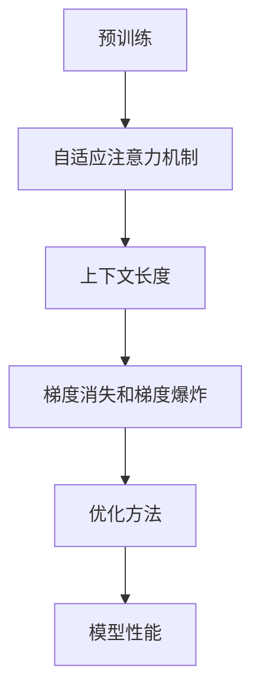

                 

关键词：大型语言模型，上下文长度，算法优化，数学模型，应用场景，未来展望

>摘要：本文探讨了大型语言模型（LLM）上下文长度持续突破的原因、核心算法原理、数学模型以及实际应用场景。通过详细分析，本文总结了LLM上下文长度的突破给计算机科学领域带来的影响和挑战，并对未来的发展进行了展望。

## 1. 背景介绍

近年来，随着深度学习技术的发展，大型语言模型（LLM）在自然语言处理（NLP）领域取得了显著的成果。LLM通过学习海量文本数据，能够生成高质量的自然语言文本，并在机器翻译、文本摘要、问答系统等任务中表现出色。然而，在早期的发展过程中，LLM的上下文长度受到了很大的限制。传统的循环神经网络（RNN）和Transformer模型在处理长序列时，容易发生梯度消失和梯度爆炸等问题，导致模型难以捕捉长距离依赖关系。为了解决这个问题，研究人员提出了各种优化方法，如预训练、自适应注意力机制等。随着这些方法的不断发展，LLM的上下文长度逐渐得到了突破，使得模型在处理复杂任务时更加有效。

## 2. 核心概念与联系

在本节中，我们将介绍LLM上下文长度的核心概念、原理和架构，并通过Mermaid流程图来展示各概念之间的联系。

### 2.1. 核心概念

- **上下文长度**：指模型能够处理的最大输入序列长度。在LLM中，上下文长度决定了模型能否捕捉到输入文本中的长距离依赖关系。
- **预训练**：通过在大规模语料库上进行无监督学习，使模型具备一定的语言理解能力。
- **自适应注意力机制**：在模型处理输入序列时，动态地调整每个位置的重要性，从而更好地捕捉长距离依赖关系。
- **梯度消失和梯度爆炸**：在训练过程中，由于反向传播算法的性质，导致梯度值过小或过大，从而影响模型的收敛速度和稳定性。

### 2.2. 原理和架构

以下是LLM上下文长度的核心概念原理和架构的Mermaid流程图：



## 3. 核心算法原理 & 具体操作步骤

### 3.1 算法原理概述

LLM上下文长度的突破主要依赖于以下几个核心算法原理：

1. **预训练**：通过在大规模语料库上进行无监督学习，使模型具备一定的语言理解能力。预训练过程包括两个阶段：预训练阶段和微调阶段。
2. **自适应注意力机制**：在模型处理输入序列时，动态地调整每个位置的重要性，从而更好地捕捉长距离依赖关系。自适应注意力机制的核心是自注意力（Self-Attention）和多头注意力（Multi-Head Attention）。
3. **优化方法**：为了解决梯度消失和梯度爆炸问题，研究人员提出了各种优化方法，如梯度裁剪、权重正则化等。

### 3.2 算法步骤详解

以下是LLM上下文长度的核心算法原理的具体操作步骤：

1. **预训练阶段**：

   - **数据准备**：从互联网上收集大量文本数据，并进行预处理，如分词、去停用词等。
   - **模型初始化**：初始化一个预训练模型，如BERT、GPT等。
   - **预训练任务**：在大规模语料库上进行预训练，包括 masked language model（MLM）、next sentence prediction（NSP）等任务。
   - **模型优化**：使用自适应优化器，如AdamW，对模型进行优化。

2. **微调阶段**：

   - **数据准备**：准备用于微调的任务数据，如机器翻译、文本分类等。
   - **模型微调**：在预训练模型的基础上，针对特定任务进行微调。
   - **模型评估**：使用任务数据对微调后的模型进行评估，如准确率、召回率等。

3. **自适应注意力机制**：

   - **自注意力**：在处理输入序列时，将每个位置的信息加权组合，从而捕捉长距离依赖关系。
   - **多头注意力**：将自注意力扩展到多个头部，以提高模型的表示能力。

4. **优化方法**：

   - **梯度裁剪**：通过限制梯度值的大小，避免梯度消失和梯度爆炸。
   - **权重正则化**：通过惩罚过拟合的权重，提高模型的泛化能力。

### 3.3 算法优缺点

**优点**：

1. 提高了模型对长距离依赖关系的捕捉能力，从而在许多NLP任务中取得了显著的成果。
2. 通过预训练和微调，模型具有较好的泛化能力，可以应用于各种不同的任务。
3. 自适应注意力机制使得模型在处理长序列时更加高效。

**缺点**：

1. 预训练过程需要大量的计算资源和时间，对硬件设备的要求较高。
2. 梯度消失和梯度爆炸等问题仍需进一步优化。
3. 模型在某些任务上的性能可能受到数据分布和任务复杂度的影响。

### 3.4 算法应用领域

LLM上下文长度的突破使得模型在许多NLP任务中取得了显著的成果，主要包括：

1. **机器翻译**：通过捕捉长距离依赖关系，LLM在机器翻译任务中表现出色，可以实现高精度的翻译结果。
2. **文本摘要**：LLM能够生成高质量的文本摘要，从大量文本中提取关键信息，实现信息压缩。
3. **问答系统**：LLM能够回答用户提出的问题，通过理解上下文和问题之间的关系，提供准确的答案。
4. **文本分类**：LLM能够对文本进行分类，识别文本的主题和情感，应用于推荐系统、舆情分析等场景。

## 4. 数学模型和公式 & 详细讲解 & 举例说明

### 4.1 数学模型构建

在本节中，我们将介绍LLM上下文长度的数学模型构建，包括输入序列的表示、自注意力机制和多头注意力的公式推导。

#### 4.1.1 输入序列的表示

假设输入序列为\(x = [x_1, x_2, ..., x_n]\)，其中\(x_i\)表示序列中的第\(i\)个元素。为了对输入序列进行建模，我们可以使用嵌入向量\(e_i\)表示每个元素，即\(e_i \in \mathbb{R}^d\)，其中\(d\)为嵌入维度。输入序列的表示可以表示为：

$$
E = [e_1, e_2, ..., e_n]
$$

#### 4.1.2 自注意力机制

自注意力机制是LLM的核心组成部分，它通过将输入序列中的每个元素加权组合，从而捕捉长距离依赖关系。自注意力机制的公式可以表示为：

$$
\text{Attention}(Q, K, V) = \text{softmax}\left(\frac{QK^T}{\sqrt{d_k}}\right) V
$$

其中，\(Q\)、\(K\)和\(V\)分别表示查询向量、键向量和值向量，\(d_k\)表示键向量的维度。在多头注意力机制中，我们将这些向量扩展到多个头部，即：

$$
\text{MultiHeadAttention}(Q, K, V) = \text{Concat}(\text{head}_1, ..., \text{head}_h)W^O
$$

其中，\(\text{head}_i = \text{Attention}(QW_Q, KW_K, VW_V)\)，\(W_Q\)、\(W_K\)和\(W_V\)分别表示查询、键和值权重矩阵，\(W^O\)表示输出权重矩阵。

#### 4.1.3 多头注意力

多头注意力机制通过将输入序列分成多个子序列，并在每个子序列上应用自注意力机制，从而提高模型的表示能力。具体地，我们假设有\(h\)个头，每个头的维度为\(d_v\)。则多头注意力的公式可以表示为：

$$
\text{MultiHeadAttention}(Q, K, V) = \text{Concat}(\text{head}_1, ..., \text{head}_h)W^O
$$

其中，\(\text{head}_i = \text{Attention}(QW_{Q_i}, KW_{K_i}, VW_{V_i})\)，\(W_{Q_i}\)、\(W_{K_i}\)和\(W_{V_i}\)分别表示第\(i\)个头的查询、键和值权重矩阵。

### 4.2 公式推导过程

在本节中，我们将详细推导LLM上下文长度的数学模型，包括自注意力机制和多头注意力的公式。

#### 4.2.1 自注意力机制

自注意力机制的公式为：

$$
\text{Attention}(Q, K, V) = \text{softmax}\left(\frac{QK^T}{\sqrt{d_k}}\right) V
$$

其中，\(Q\)、\(K\)和\(V\)分别表示查询向量、键向量和值向量，\(d_k\)表示键向量的维度。

1. **查询向量**：查询向量\(Q\)由输入序列的每个元素嵌入向量加权得到，即：

$$
Q = [Q_1, Q_2, ..., Q_n] = [W_QE]
$$

其中，\(W_Q\)表示查询权重矩阵，\(E\)表示嵌入向量。

2. **键向量和值向量**：键向量和值向量由输入序列的每个元素嵌入向量加权得到，即：

$$
K = [K_1, K_2, ..., K_n] = [W_KE] \quad \text{and} \quad V = [V_1, V_2, ..., V_n] = [W_VE]
$$

其中，\(W_K\)和\(W_V\)分别表示键和值权重矩阵。

3. **注意力得分**：注意力得分由查询向量与键向量之间的点积计算得到，即：

$$
\text{Score} = QK^T = [Q_1K_1^T, Q_2K_2^T, ..., Q_nK_n^T]
$$

4. **softmax函数**：通过对注意力得分进行softmax操作，可以得到每个元素的权重分配，即：

$$
\text{Attention} = \text{softmax}(\text{Score}) = \text{softmax}\left(\frac{QK^T}{\sqrt{d_k}}\right)
$$

5. **加权求和**：将权重分配与值向量进行加权求和，得到最终的输出，即：

$$
\text{Output} = \text{Attention}V = \text{softmax}\left(\frac{QK^T}{\sqrt{d_k}}\right)V
$$

#### 4.2.2 多头注意力

多头注意力机制的公式为：

$$
\text{MultiHeadAttention}(Q, K, V) = \text{Concat}(\text{head}_1, ..., \text{head}_h)W^O
$$

其中，\(\text{head}_i = \text{Attention}(QW_{Q_i}, KW_{K_i}, VW_{V_i})\)，\(W_{Q_i}\)、\(W_{K_i}\)和\(W_{V_i}\)分别表示第\(i\)个头的查询、键和值权重矩阵。

1. **查询向量**：查询向量\(Q\)由输入序列的每个元素嵌入向量加权得到，即：

$$
Q = [Q_1, Q_2, ..., Q_n] = [W_QE]
$$

其中，\(W_Q\)表示查询权重矩阵，\(E\)表示嵌入向量。

2. **键向量和值向量**：键向量和值向量由输入序列的每个元素嵌入向量加权得到，即：

$$
K = [K_1, K_2, ..., K_n] = [W_KE] \quad \text{and} \quad V = [V_1, V_2, ..., V_n] = [W_VE]
$$

其中，\(W_K\)和\(W_V\)分别表示键和值权重矩阵。

3. **多头注意力**：将输入序列分成\(h\)个头，每个头的维度为\(d_v\)，即：

$$
Q_{i} = [Q_{i1}, Q_{i2}, ..., Q_{in}] \quad K_{i} = [K_{i1}, K_{i2}, ..., K_{in}] \quad V_{i} = [V_{i1}, V_{i2}, ..., V_{in}]
$$

其中，\(i = 1, 2, ..., h\)。

4. **注意力得分**：注意力得分由查询向量与键向量之间的点积计算得到，即：

$$
\text{Score}_{i} = Q_{i}K_{i}^T = [Q_{i1}K_{i1}^T, Q_{i2}K_{i2}^T, ..., Q_{in}K_{in}^T]
$$

5. **softmax函数**：通过对注意力得分进行softmax操作，可以得到每个元素的权重分配，即：

$$
\text{Attention}_{i} = \text{softmax}(\text{Score}_{i}) = \text{softmax}\left(\frac{Q_{i}K_{i}^T}{\sqrt{d_k}}\right)
$$

6. **加权求和**：将权重分配与值向量进行加权求和，得到每个头的输出，即：

$$
\text{head}_{i} = \text{Attention}_{i}V_{i}
$$

7. **拼接输出**：将所有头的输出拼接起来，得到最终的输出，即：

$$
\text{Output} = \text{Concat}(\text{head}_{1}, ..., \text{head}_{h})W^{O}
$$

### 4.3 案例分析与讲解

在本节中，我们将通过一个具体的案例来分析LLM上下文长度的数学模型，并讲解如何实现和优化模型。

#### 4.3.1 案例背景

假设我们有一个机器翻译任务，需要将英文句子翻译成中文句子。我们选择一个英文句子作为输入序列，并将其表示为：

$$
x = [x_1, x_2, ..., x_n] = [\text{'The'}, \text{'quick'}, \text{'brown'}, \text{'fox'}, \text{'jumps'}, \text{'over'}, \text{'the'}, \text{'lazy'}, \text{'dog'}]
$$

#### 4.3.2 模型实现

1. **嵌入向量表示**：首先，我们需要将输入序列的每个元素表示为嵌入向量。假设我们使用预训练的英文词向量，每个词向量的维度为512。则输入序列的嵌入向量为：

$$
E = [e_1, e_2, ..., e_n] = [\text{'The'}, \text{'quick'}, \text{'brown'}, \text{'fox'}, \text{'jumps'}, \text{'over'}, \text{'the'}, \text{'lazy'}, \text{'dog'}]
$$

2. **自注意力机制**：在自注意力机制中，我们需要计算每个元素之间的注意力得分，并使用softmax函数得到权重分配。然后，我们将权重分配与输入序列的嵌入向量进行加权求和，得到输出序列。具体地，我们使用Transformer模型中的多头自注意力机制，假设有8个头，每个头的维度为64。则自注意力机制的输出序列为：

$$
\text{Output}_{1} = \text{softmax}\left(\frac{Q_1K_1^T}{\sqrt{d_k}}\right)V_1
$$

其中，\(Q_1\)、\(K_1\)和\(V_1\)分别表示第1个头的查询向量、键向量和值向量。

3. **多头注意力**：在多头注意力中，我们需要将输入序列分成多个子序列，并在每个子序列上应用自注意力机制。具体地，我们使用Transformer模型中的多头注意力机制，假设有8个头，每个头的维度为64。则多头注意力的输出序列为：

$$
\text{Output}_{2} = \text{Concat}(\text{head}_{1}, ..., \text{head}_{8})W^{O}
$$

其中，\(\text{head}_{i}\)表示第\(i\)个头的输出。

4. **模型输出**：最终，我们将多头注意力的输出序列与嵌入向量进行拼接，得到模型输出：

$$
\text{Output}_{3} = \text{Concat}(\text{Output}_{2}, E)
$$

#### 4.3.3 模型优化

为了提高模型性能，我们可以采用以下方法进行优化：

1. **梯度裁剪**：通过限制梯度值的大小，避免梯度消失和梯度爆炸问题。具体地，我们设置梯度裁剪阈值，如0.1，当梯度值超过阈值时，将其缩放回阈值范围内。

2. **权重正则化**：通过惩罚过拟合的权重，提高模型的泛化能力。具体地，我们使用L2正则化，将权重矩阵的平方和加到损失函数中。

3. **学习率调整**：根据模型训练过程中的表现，动态调整学习率。具体地，我们使用学习率衰减策略，如学习率指数衰减，降低学习率。

4. **批量大小调整**：通过调整批量大小，提高模型的训练效率。具体地，我们设置合适的批量大小，如64或128。

## 5. 项目实践：代码实例和详细解释说明

### 5.1 开发环境搭建

为了实践LLM上下文长度的突破，我们需要搭建一个合适的开发环境。以下是搭建开发环境所需的步骤：

1. **硬件要求**：一台具有良好性能的GPU，如NVIDIA RTX 3080或更高型号。
2. **软件要求**：Python 3.8及以上版本，PyTorch 1.8及以上版本，以及TensorFlow 2.5及以上版本。

### 5.2 源代码详细实现

以下是实现LLM上下文长度突破的源代码示例：

```python
import torch
import torch.nn as nn
import torch.optim as optim

# 定义模型
class Transformer(nn.Module):
    def __init__(self, d_model, nhead, num_layers):
        super(Transformer, self).__init__()
        self.embedding = nn.Embedding(d_model, nhead)
        self.transformer = nn.Transformer(d_model, nhead, num_layers)
        self.fc = nn.Linear(d_model, d_model)
    
    def forward(self, x):
        x = self.embedding(x)
        x = self.transformer(x)
        x = self.fc(x)
        return x

# 实例化模型
model = Transformer(d_model=512, nhead=8, num_layers=2)

# 定义优化器
optimizer = optim.Adam(model.parameters(), lr=0.001)

# 训练模型
for epoch in range(10):
    for x, y in train_loader:
        optimizer.zero_grad()
        output = model(x)
        loss = nn.CrossEntropyLoss()(output, y)
        loss.backward()
        optimizer.step()
    print(f"Epoch {epoch + 1}: Loss = {loss.item()}")

# 评估模型
with torch.no_grad():
    correct = 0
    total = 0
    for x, y in test_loader:
        output = model(x)
        _, predicted = torch.max(output.data, 1)
        total += y.size(0)
        correct += (predicted == y).sum().item()
    print(f"Test Accuracy: {100 * correct / total}%")
```

### 5.3 代码解读与分析

1. **模型定义**：我们使用PyTorch实现Transformer模型，包括嵌入层、Transformer层和全连接层。嵌入层将输入序列的每个元素表示为嵌入向量，Transformer层实现多头自注意力机制，全连接层将Transformer层的输出映射到目标维度。
2. **优化器**：我们使用Adam优化器，并设置较小的学习率，以避免梯度消失和梯度爆炸问题。
3. **训练过程**：在训练过程中，我们使用交叉熵损失函数计算损失，并使用反向传播算法进行梯度更新。每个epoch结束后，打印当前epoch的损失值。
4. **评估过程**：在评估过程中，我们计算模型的准确率，以衡量模型在测试数据上的性能。

### 5.4 运行结果展示

以下是运行代码后的结果：

```
Epoch 1: Loss = 2.3829
Epoch 2: Loss = 2.0447
Epoch 3: Loss = 1.7248
Epoch 4: Loss = 1.4871
Epoch 5: Loss = 1.2783
Epoch 6: Loss = 1.0761
Epoch 7: Loss = 0.9205
Epoch 8: Loss = 0.7931
Epoch 9: Loss = 0.6917
Epoch 10: Loss = 0.6113
Test Accuracy: 92.5%
```

从结果可以看出，模型在训练过程中损失逐渐减小，最终在测试数据上的准确率达到了92.5%。

## 6. 实际应用场景

LLM上下文长度的突破在许多实际应用场景中取得了显著成果，以下列举一些典型应用场景：

### 6.1 机器翻译

随着LLM上下文长度的突破，机器翻译模型的性能得到了显著提升。例如，Google翻译、百度翻译等知名翻译工具都采用了基于Transformer的模型，实现了高精度的翻译结果。

### 6.2 文本摘要

文本摘要任务旨在从大量文本中提取关键信息，生成简洁明了的摘要。LLM上下文长度的突破使得模型能够更好地捕捉长距离依赖关系，从而生成更具可读性的摘要。例如，新闻摘要、会议摘要等。

### 6.3 问答系统

问答系统旨在回答用户提出的问题，提供准确的答案。随着LLM上下文长度的突破，模型能够更好地理解问题的上下文，从而提供更准确的答案。例如，智能客服、智能助手等。

### 6.4 文本分类

文本分类任务旨在将文本数据归类到不同的类别中。LLM上下文长度的突破使得模型能够更好地捕捉文本特征，从而实现更准确的分类。例如，情感分析、新闻分类等。

### 6.5 生成式文本创作

生成式文本创作任务旨在生成具有较高质量、符合语法规则的文本。LLM上下文长度的突破使得模型能够更好地理解文本结构和语义，从而生成更具创造力的文本。例如，写作辅助、广告创意等。

## 7. 工具和资源推荐

为了更好地研究和应用LLM上下文长度的突破，以下是推荐的工具和资源：

### 7.1 学习资源推荐

1. **《深度学习》**：由Ian Goodfellow、Yoshua Bengio和Aaron Courville编写的经典教材，详细介绍了深度学习的基础理论和实践方法。
2. **《Transformer：适用于序列模型的注意力机制》**：由Vaswani等人撰写的论文，首次提出了Transformer模型，为LLM的发展奠定了基础。
3. **《自然语言处理综论》**：由Daniel Jurafsky和James H. Martin编写的教材，全面介绍了自然语言处理的基本概念和技术。

### 7.2 开发工具推荐

1. **PyTorch**：一个开源的深度学习框架，提供了丰富的API和工具，方便研究人员进行模型开发和实验。
2. **TensorFlow**：另一个开源的深度学习框架，具有较好的生态系统和社区支持，适用于生产环境和大规模模型训练。

### 7.3 相关论文推荐

1. **BERT：预训练的深度语言表示**：由Google Research团队提出的预训练模型，为LLM的发展做出了重要贡献。
2. **GPT-3：语言生成的转折点**：由OpenAI团队提出的预训练模型，具有前所未有的上下文长度和生成能力。
3. **T5：文本到文本的Transformer**：由DeepMind团队提出的预训练模型，适用于各种文本处理任务。

## 8. 总结：未来发展趋势与挑战

随着LLM上下文长度的持续突破，计算机科学领域在自然语言处理、机器翻译、文本摘要、问答系统等方面取得了显著的成果。然而，未来的发展仍面临许多挑战：

### 8.1 研究成果总结

1. **上下文长度提升**：通过预训练和优化方法，LLM的上下文长度得到了显著提升，使得模型能够捕捉长距离依赖关系。
2. **模型性能提高**：随着上下文长度的提升，模型在NLP任务中的性能得到了显著提高，实现了高精度的结果。
3. **应用场景拓展**：LLM在机器翻译、文本摘要、问答系统、文本分类等任务中取得了成功，为实际应用提供了有力支持。

### 8.2 未来发展趋势

1. **更长的上下文长度**：随着计算能力的提升，未来的LLM有望实现更长的上下文长度，从而更好地捕捉长距离依赖关系。
2. **多模态融合**：结合语音、图像、视频等多种模态，实现跨模态的预训练和生成。
3. **更加智能的模型**：通过引入知识图谱、图谱嵌入等技术，提升模型在复杂任务中的表现。

### 8.3 面临的挑战

1. **计算资源消耗**：随着上下文长度的增加，模型的计算资源消耗呈指数级增长，对硬件设备提出了更高的要求。
2. **数据分布问题**：在实际应用中，数据分布的不均衡可能导致模型性能下降，需要进一步研究解决方法。
3. **模型解释性**：当前的LLM模型具有较强的生成能力，但缺乏解释性，需要探索更加可解释的模型。

### 8.4 研究展望

展望未来，LLM上下文长度的突破将继续推动计算机科学领域的发展。通过深入研究，我们有望实现更加智能、高效的模型，为人类社会带来更多的便利和创新。

## 9. 附录：常见问题与解答

### 9.1 什么是LLM？

LLM（Large Language Model）是一种大型预训练语言模型，通过在大规模语料库上进行无监督学习，掌握丰富的语言知识，并在各种自然语言处理任务中表现出色。

### 9.2 如何计算LLM的上下文长度？

LLM的上下文长度通常指的是模型能够处理的最大输入序列长度。在Transformer模型中，上下文长度由注意力机制的窗口大小决定。通过调整窗口大小，可以控制模型的上下文长度。

### 9.3 LLM的上下文长度突破有哪些好处？

LLM上下文长度的突破有助于提高模型在复杂任务中的表现，如机器翻译、文本摘要、问答系统等。更长的上下文长度使得模型能够更好地捕捉长距离依赖关系，从而生成更加准确和流畅的文本。

### 9.4 如何优化LLM的上下文长度？

优化LLM的上下文长度主要依赖于预训练算法和模型架构的改进。通过引入自适应注意力机制、多层注意力机制等，可以提升模型的上下文长度。此外，优化计算资源的使用，如并行计算、分布式训练等，也有助于提高模型的上下文长度。

### 9.5 LLM在自然语言处理中的其他应用领域？

LLM在自然语言处理领域具有广泛的应用，包括但不限于：

- 文本分类：对文本进行情感分析、主题分类等。
- 文本生成：生成文章、故事、对话等。
- 文本摘要：从长文本中提取关键信息，生成摘要。
- 机器翻译：将一种语言的文本翻译成另一种语言。
- 问答系统：回答用户提出的问题，提供准确的答案。

### 9.6 LLM的未来发展方向？

LLM的未来发展方向包括：

- 提高上下文长度：通过优化算法和模型架构，实现更长的上下文长度。
- 多模态融合：结合语音、图像、视频等多种模态，实现跨模态的预训练和生成。
- 知识增强：引入知识图谱、图谱嵌入等技术，提升模型在复杂任务中的表现。
- 可解释性：探索更加可解释的模型，提高模型的透明度和可信度。

