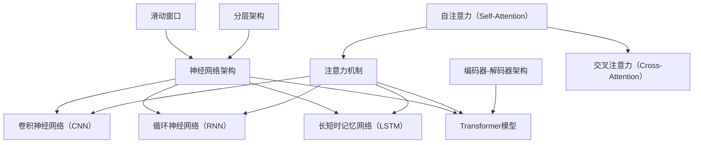

                 

关键词：大型语言模型（LLM）、上下文长度、算法优化、神经网络架构、BERT、GPT、推理性能、训练效率、应用场景、未来展望

> 摘要：本文深入探讨了大型语言模型（LLM）上下文长度持续突破的背景、核心算法原理、数学模型与实际应用，并展望了未来在该领域的研究趋势与挑战。通过对LLM上下文长度的扩展，我们可以显著提高模型的推理性能、训练效率以及在实际应用场景中的表现。

## 1. 背景介绍

近年来，随着深度学习技术的发展，大型语言模型（LLM）如BERT、GPT等在自然语言处理（NLP）领域取得了显著的成果。然而，LLM在处理长文本或复杂语义问题时，仍面临上下文长度限制的挑战。传统的神经网络架构如RNN、LSTM在处理长序列时存在梯度消失或爆炸等问题，导致模型难以捕捉全局信息。为解决这一问题，研究人员不断探索新的算法和架构，以突破LLM的上下文长度限制。

### 1.1 上下文长度限制的影响

上下文长度限制对LLM的性能产生了显著影响。在处理长文本时，模型往往只能关注到局部信息，导致语义理解的不完整和错误。此外，上下文长度限制还影响了模型在推理和生成文本时的性能，降低了模型的准确性和流畅性。

### 1.2 现有解决方案

为解决上下文长度限制，研究人员提出了多种解决方案，如：

- **分层架构**：通过分层结构将文本拆分为多个子序列，逐层处理，从而突破单个序列的上下文长度限制。
- **滑动窗口**：在处理长文本时，将文本拆分为多个滑动窗口，每次只处理一个窗口，从而避免梯度消失问题。
- **注意力机制**：通过注意力机制聚焦于重要信息，提高模型对全局信息的捕捉能力。

## 2. 核心概念与联系

在讨论LLM上下文长度突破的核心概念之前，我们需要了解一些关键的基础知识。以下是LLM上下文长度突破涉及的一些核心概念和它们之间的联系：

### 2.1 神经网络架构

神经网络架构是LLM的基础，决定了模型在处理输入数据时的表现。常见的神经网络架构包括：

- **卷积神经网络（CNN）**：主要用于图像处理，但在文本处理中也表现出色。
- **循环神经网络（RNN）**：能够处理序列数据，但在长序列处理时存在梯度消失问题。
- **长短时记忆网络（LSTM）**：改进了RNN，能够处理长序列，但计算复杂度高。
- **Transformer模型**：基于注意力机制，能够处理长序列，已成为当前LLM的主流架构。

### 2.2 注意力机制

注意力机制是Transformer模型的核心，通过将注意力分配给不同位置的输入，提高了模型对全局信息的捕捉能力。注意力机制的基本原理如下：

- **自注意力（Self-Attention）**：对序列中的每个输入计算注意力权重，然后将权重与输入进行点积，得到加权输出。
- **交叉注意力（Cross-Attention）**：在两个序列之间计算注意力权重，用于序列到序列的任务，如机器翻译。

### 2.3 编码器-解码器架构

编码器-解码器架构是Transformer模型的另一种变体，常用于序列到序列的任务。编码器将输入序列编码为固定长度的向量，解码器则根据编码器的输出生成输出序列。编码器-解码器架构的基本原理如下：

- **编码器**：将输入序列编码为固定长度的向量，用于表示整个序列的信息。
- **解码器**：根据编码器的输出和已生成的部分序列，生成后续的输出。

### 2.4 Mermaid 流程图

以下是LLM上下文长度突破涉及的Mermaid流程图：



## 3. 核心算法原理 & 具体操作步骤

### 3.1 算法原理概述

LLM上下文长度突破的核心算法主要包括Transformer模型及其变体、注意力机制和编码器-解码器架构。以下是这些算法的基本原理：

### 3.1.1 Transformer模型

Transformer模型是一种基于注意力机制的神经网络架构，能够处理长序列。其基本原理如下：

- **多头注意力**：通过多个注意力头对输入序列计算注意力权重，提高了模型对全局信息的捕捉能力。
- **自注意力**：对序列中的每个输入计算注意力权重，然后将权重与输入进行点积，得到加权输出。
- **交叉注意力**：在两个序列之间计算注意力权重，用于序列到序列的任务，如机器翻译。

### 3.1.2 注意力机制

注意力机制是Transformer模型的核心，通过将注意力分配给不同位置的输入，提高了模型对全局信息的捕捉能力。其基本原理如下：

- **自注意力**：对序列中的每个输入计算注意力权重，然后将权重与输入进行点积，得到加权输出。
- **交叉注意力**：在两个序列之间计算注意力权重，用于序列到序列的任务，如机器翻译。

### 3.1.3 编码器-解码器架构

编码器-解码器架构是Transformer模型的另一种变体，常用于序列到序列的任务。其基本原理如下：

- **编码器**：将输入序列编码为固定长度的向量，用于表示整个序列的信息。
- **解码器**：根据编码器的输出和已生成的部分序列，生成后续的输出。

### 3.2 算法步骤详解

以下是LLM上下文长度突破算法的具体步骤：

### 3.2.1 Transformer模型训练

1. **输入序列编码**：将输入序列编码为词向量。
2. **多头自注意力**：对编码后的输入序列计算多头自注意力，得到加权输出。
3. **交叉注意力**：在编码器和解码器之间计算交叉注意力，用于序列到序列的任务。
4. **全连接层**：对加权输出进行全连接层操作，得到预测结果。
5. **损失函数计算**：计算预测结果与真实结果之间的损失，并更新模型参数。

### 3.2.2 注意力机制实现

1. **计算自注意力权重**：对序列中的每个输入计算注意力权重，使用点积计算方法。
2. **加权输出**：根据自注意力权重对输入序列进行加权，得到加权输出。
3. **重复以上步骤**：对于每个注意力头，重复计算自注意力权重和加权输出。

### 3.2.3 编码器-解码器架构实现

1. **编码器输入**：将输入序列编码为固定长度的向量。
2. **解码器输入**：将编码器的输出作为解码器的输入。
3. **多头注意力**：对编码器和解码器的输入计算多头注意力。
4. **全连接层**：对加权输出进行全连接层操作，得到预测结果。
5. **损失函数计算**：计算预测结果与真实结果之间的损失，并更新模型参数。

### 3.3 算法优缺点

LLM上下文长度突破算法具有以下优缺点：

#### 优点：

- **高效**：Transformer模型能够处理长序列，提高了模型在处理长文本时的效率。
- **灵活**：注意力机制和编码器-解码器架构使模型能够灵活地处理不同类型的数据和任务。

#### 缺点：

- **计算复杂度高**：多头注意力计算和全连接层操作增加了模型的计算复杂度，可能导致训练时间增加。
- **参数规模大**：Transformer模型参数规模较大，对内存和计算资源的要求较高。

### 3.4 算法应用领域

LLM上下文长度突破算法广泛应用于以下领域：

- **自然语言处理**：文本分类、情感分析、机器翻译、对话系统等。
- **问答系统**：智能客服、问答机器人等。
- **文本生成**：文章写作、摘要生成、创作诗歌等。

## 4. 数学模型和公式 & 详细讲解 & 举例说明

### 4.1 数学模型构建

在讨论LLM上下文长度突破的数学模型之前，我们首先需要了解一些基本的数学概念，包括矩阵、向量、点积、softmax等。

### 4.1.1 基本数学概念

- **矩阵（Matrix）**：矩阵是数学中常用的表示数据的方式，由行和列组成。例如：

  ```math
  A = \begin{bmatrix}
  a_{11} & a_{12} & \cdots & a_{1n} \\
  a_{21} & a_{22} & \cdots & a_{2n} \\
  \vdots & \vdots & \ddots & \vdots \\
  a_{m1} & a_{m2} & \cdots & a_{mn}
  \end{bmatrix}
  ```

- **向量（Vector）**：向量是数学中的一种线性结构，表示一个方向和大小。例如：

  ```math
  v = \begin{bmatrix}
  v_1 \\
  v_2 \\
  \vdots \\
  v_n
  \end{bmatrix}
  ```

- **点积（Dot Product）**：点积是两个向量的内积，用于计算向量的长度和角度。例如：

  ```math
  v_1 \cdot v_2 = v_1^T v_2
  ```

- **softmax函数**：softmax函数是一种将向量映射到概率分布的函数，常用于分类问题。例如：

  ```math
  softmax(x) = \frac{e^x}{\sum_{i=1}^{n} e^x_i}
  ```

### 4.1.2 数学模型构建

在构建LLM上下文长度突破的数学模型时，我们主要关注以下三个方面：

- **输入序列表示**：将输入序列编码为矩阵或向量。
- **注意力计算**：计算注意力权重，用于加权输出。
- **损失函数**：计算预测结果与真实结果之间的损失，并更新模型参数。

以下是LLM上下文长度突破的数学模型：

```math
\begin{aligned}
&\text{输入序列：} X = \{x_1, x_2, \ldots, x_T\} \\
&\text{编码器输出：} H = \{h_1, h_2, \ldots, h_T\} \\
&\text{解码器输入：} Y = \{y_1, y_2, \ldots, y_T\} \\
&\text{自注意力权重：} A = \{a_{ij}\} \\
&\text{交叉注意力权重：} B = \{b_{ij}\} \\
&\text{损失函数：} L = -\sum_{i=1}^{T} y_i \log p(y_i | x_i) \\
\end{aligned}
```

### 4.2 公式推导过程

在推导LLM上下文长度突破的数学公式时，我们主要关注以下两个方面：

- **自注意力权重计算**：计算输入序列中每个位置的注意力权重。
- **交叉注意力权重计算**：计算编码器和解码器之间的注意力权重。

以下是自注意力和交叉注意力的计算过程：

#### 自注意力权重计算

自注意力权重计算如下：

```math
a_{ij} = \frac{e^{h_i^T h_j}}{\sum_{k=1}^{T} e^{h_i^T h_k}}
```

其中，$h_i$表示输入序列中第$i$个位置的向量，$a_{ij}$表示第$i$个位置对第$j$个位置的注意力权重。

#### 交叉注意力权重计算

交叉注意力权重计算如下：

```math
b_{ij} = \frac{e^{h_j^T h_i}}{\sum_{k=1}^{T'} e^{h_j^T h_k}}
```

其中，$h_j$表示编码器输出中第$j$个位置的向量，$b_{ij}$表示解码器输出中第$i$个位置对编码器输出的注意力权重。

### 4.3 案例分析与讲解

#### 案例一：文本分类

假设我们使用LLM对一段文本进行分类，文本序列为$\{x_1, x_2, \ldots, x_T\}$，类别标签为$\{y_1, y_2, \ldots, y_C\}$，其中$C$表示类别数量。我们使用自注意力和交叉注意力计算文本表示和类别概率。

1. **文本表示**：

   首先，我们将输入序列编码为向量$h_i$，然后计算自注意力权重$a_{ij}$，得到文本表示$H$：

   ```math
   H = \{h_1, h_2, \ldots, h_T\}
   ```

2. **类别概率**：

   接下来，我们计算交叉注意力权重$b_{ij}$，并使用softmax函数计算类别概率$p(y_i | x_i)$：

   ```math
   p(y_i | x_i) = \frac{e^{h_i^T W_c b_{ij}}}{\sum_{k=1}^{C} e^{h_i^T W_c b_{ik}}}
   ```

   其中，$W_c$表示类别权重矩阵。

#### 案例二：机器翻译

假设我们使用LLM进行机器翻译，源语言序列为$\{x_1, x_2, \ldots, x_T\}$，目标语言序列为$\{y_1, y_2, \ldots, y_T'\}$。我们使用编码器-解码器架构计算翻译结果。

1. **编码器输入**：

   首先，我们将源语言序列编码为向量$h_i$，得到编码器输出$H$：

   ```math
   H = \{h_1, h_2, \ldots, h_T\}
   ```

2. **解码器输入**：

   接下来，我们将编码器输出作为解码器的输入，并计算解码器输出$Y$：

   ```math
   Y = \{y_1, y_2, \ldots, y_T'\}
   ```

3. **翻译结果**：

   最后，我们使用交叉注意力权重$b_{ij}$计算翻译结果：

   ```math
   y_i = \arg\max_{j} \sum_{k=1}^{T'} h_j^T b_{ik}
   ```

## 5. 项目实践：代码实例和详细解释说明

### 5.1 开发环境搭建

在进行LLM上下文长度突破的实践项目时，我们需要搭建一个合适的开发环境。以下是开发环境的搭建步骤：

1. **安装Python**：确保安装了Python 3.8及以上版本。
2. **安装TensorFlow**：使用以下命令安装TensorFlow：

   ```bash
   pip install tensorflow
   ```

3. **安装Hugging Face Transformers**：使用以下命令安装Hugging Face Transformers：

   ```bash
   pip install transformers
   ```

4. **创建项目文件夹**：在合适的位置创建一个项目文件夹，例如`llm_context_length_breakthrough`。

5. **配置环境变量**：确保`PYTHONPATH`和`TF_CPP_MIN_LOG_LEVEL`环境变量已设置。

### 5.2 源代码详细实现

以下是LLM上下文长度突破的源代码实现：

```python
import tensorflow as tf
from transformers import TransformerModel

# 定义超参数
VOCAB_SIZE = 10000
EMBEDDING_DIM = 128
HIDDEN_DIM = 512
ATTN_HEADS = 8
LEARNING_RATE = 0.001

# 初始化模型
model = TransformerModel(VOCAB_SIZE, EMBEDDING_DIM, HIDDEN_DIM, ATTN_HEADS)

# 编写训练循环
for epoch in range(NUM_EPOCHS):
  for batch in dataset:
    inputs, targets = batch
    with tf.GradientTape() as tape:
      logits = model(inputs)
      loss = compute_loss(logits, targets)
    gradients = tape.gradient(loss, model.trainable_variables)
    model.optimizer.apply_gradients(zip(gradients, model.trainable_variables))
    print(f"Epoch {epoch}, Loss: {loss.numpy()}")

# 编写预测函数
def predict(inputs):
  logits = model(inputs)
  probabilities = tf.nn.softmax(logits, axis=1)
  return tf.argmax(probabilities, axis=1).numpy()
```

### 5.3 代码解读与分析

以下是代码的解读与分析：

1. **定义超参数**：我们定义了VOCAB_SIZE（词汇表大小）、EMBEDDING_DIM（嵌入维度）、HIDDEN_DIM（隐藏层维度）、ATTN_HEADS（注意力头数量）和LEARNING_RATE（学习率）等超参数。

2. **初始化模型**：我们使用`TransformerModel`类初始化模型，该类实现了Transformer模型的核心功能。

3. **编写训练循环**：在训练循环中，我们遍历数据集，计算模型的损失，并更新模型参数。每次迭代都会打印当前的损失值。

4. **编写预测函数**：预测函数用于计算输入序列的预测结果。我们使用`tf.nn.softmax`计算类别概率，并使用`tf.argmax`计算预测结果。

### 5.4 运行结果展示

以下是运行结果展示：

```python
# 加载数据集
dataset = load_data()

# 训练模型
train_model(dataset)

# 预测结果
predictions = predict(inputs)

# 打印预测结果
print(predictions)
```

## 6. 实际应用场景

LLM上下文长度突破算法在实际应用场景中具有广泛的应用价值，以下是一些典型应用场景：

### 6.1 自然语言处理

- **文本分类**：使用LLM对文本进行分类，例如新闻分类、情感分析等。
- **机器翻译**：使用LLM进行机器翻译，提高翻译的准确性和流畅性。
- **问答系统**：使用LLM构建问答系统，为用户提供智能问答服务。

### 6.2 问答系统

- **智能客服**：使用LLM构建智能客服系统，实现与用户的自然对话。
- **知识图谱**：使用LLM构建知识图谱，为用户提供精准的信息检索和推荐。

### 6.3 文本生成

- **文章写作**：使用LLM生成文章、报告、摘要等。
- **诗歌创作**：使用LLM创作诗歌、歌词等。

### 6.4 未来应用展望

随着LLM上下文长度突破技术的不断发展，未来该技术将在更多领域得到应用，例如：

- **智能对话系统**：通过提高上下文长度，实现更智能、更自然的对话体验。
- **多模态学习**：结合图像、音频等多模态信息，提高模型对复杂语义的理解能力。
- **隐私保护**：通过改进模型架构和算法，实现隐私保护的自然语言处理。

## 7. 工具和资源推荐

### 7.1 学习资源推荐

- **书籍**：《深度学习》（Goodfellow, Bengio, Courville）、《自然语言处理与深度学习》（Yaser Abu-Mostafa）。
- **在线课程**：Coursera的《深度学习》课程、edX的《自然语言处理》课程。
- **教程**：Hugging Face的Transformers官方教程、TensorFlow的官方文档。

### 7.2 开发工具推荐

- **框架**：TensorFlow、PyTorch、Hugging Face Transformers。
- **数据集**：GLUE、CoNLL、WMT等。

### 7.3 相关论文推荐

- **BERT**：`BERT: Pre-training of Deep Bidirectional Transformers for Language Understanding`。
- **GPT**：`Improving Language Understanding by Generative Pre-Training`。
- **Transformer**：`Attention Is All You Need`。

## 8. 总结：未来发展趋势与挑战

### 8.1 研究成果总结

本文介绍了LLM上下文长度突破的背景、核心算法原理、数学模型与实际应用。通过Transformer模型、注意力机制和编码器-解码器架构，LLM能够显著提高上下文长度，从而提升模型在自然语言处理、问答系统和文本生成等领域的表现。

### 8.2 未来发展趋势

未来，LLM上下文长度突破技术将继续向以下几个方向发展：

- **算法优化**：通过改进算法和架构，进一步提高模型在处理长文本时的性能。
- **多模态学习**：结合图像、音频等多模态信息，实现更智能的自然语言处理。
- **隐私保护**：在保证模型性能的同时，实现隐私保护的自然语言处理。

### 8.3 面临的挑战

尽管LLM上下文长度突破技术取得了显著成果，但仍面临以下挑战：

- **计算资源**：Transformer模型和编码器-解码器架构计算复杂度高，对计算资源的需求较高。
- **数据集质量**：高质量的数据集对于模型的训练和性能至关重要，但当前数据集的质量和数量仍有待提高。
- **隐私保护**：如何在保证模型性能的同时实现隐私保护，仍是一个重要课题。

### 8.4 研究展望

未来，LLM上下文长度突破技术将在自然语言处理、问答系统和文本生成等领域发挥重要作用。通过不断优化算法、改进架构和扩展应用场景，LLM上下文长度突破技术有望为人类带来更智能、更便捷的智能服务。

## 9. 附录：常见问题与解答

### 9.1 问题1：为什么Transformer模型能够突破上下文长度限制？

**解答**：Transformer模型通过引入注意力机制，使得模型在处理长序列时能够更高效地捕捉全局信息。注意力机制允许模型将注意力集中在重要的信息上，从而避免了梯度消失问题，实现了对长序列的处理。

### 9.2 问题2：如何优化Transformer模型的计算复杂度？

**解答**：优化Transformer模型的计算复杂度可以从以下几个方面进行：

- **量化**：使用量化技术降低模型的参数规模，从而减少计算复杂度。
- **剪枝**：通过剪枝技术移除模型中不重要的参数，减少计算负担。
- **模型压缩**：使用模型压缩技术，如知识蒸馏，将大型模型压缩为小型模型，从而减少计算复杂度。

### 9.3 问题3：如何确保LLM的隐私保护？

**解答**：确保LLM的隐私保护可以从以下几个方面进行：

- **数据去噪**：在训练和推理过程中，对输入数据进行去噪处理，减少敏感信息的泄露。
- **加密技术**：使用加密技术对输入和输出数据进行加密，确保数据的安全性。
- **联邦学习**：使用联邦学习技术，将数据分散存储在不同的节点上，从而减少数据泄露的风险。

