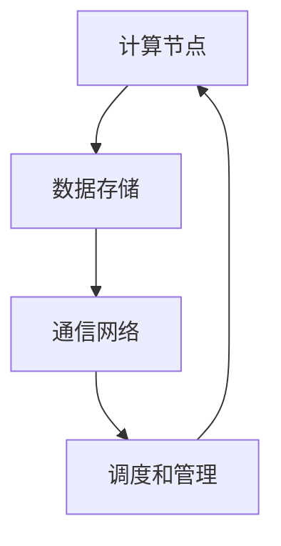

                 

关键词：大型语言模型(LLM)、云计算、分布式AI、技术趋势、未来展望

> 摘要：本文探讨了大型语言模型(LLM)与云计算的深度融合，分析了分布式AI在云计算平台上的应用及其带来的技术革新。通过介绍核心概念、算法原理、数学模型以及实际应用场景，本文旨在为读者提供关于分布式AI在云计算时代的发展趋势和挑战的全面视角。

## 1. 背景介绍

### 1.1 大型语言模型(LLM)

大型语言模型(LLM)，如GPT-3、ChatGPT和BERT，是自然语言处理(NLP)领域的革命性突破。这些模型具有数十亿个参数，能够理解和生成高质量的自然语言文本。它们在语言翻译、文本摘要、问答系统等方面表现出色，大大提升了AI应用的效果和用户体验。

### 1.2 云计算

云计算是一种通过互联网提供计算资源和服务的方式。它具有灵活性、可扩展性和成本效益等优点，使得企业能够更快速地部署和扩展应用程序。云计算的普及为分布式AI提供了基础设施支持，使得大规模AI模型的训练和部署成为可能。

### 1.3 分布式AI

分布式AI是指将AI模型分布在多个计算节点上，通过协同工作来实现高效训练和推理。分布式AI解决了单机训练资源受限的问题，使得大规模模型训练成为可能，同时也提高了系统的可用性和可靠性。

## 2. 核心概念与联系

### 2.1 大型语言模型(LLM)架构

大型语言模型(LLM)通常采用Transformer架构，这是一种基于自注意力机制的深度神经网络。LLM通过预训练和微调来学习语言模式和结构，从而实现高质量的自然语言生成和理解。

### 2.2 云计算与分布式AI的融合

云计算平台提供了高性能计算资源、海量存储和网络带宽，为分布式AI提供了基础设施支持。分布式AI在云计算平台上可以通过多租户架构、容器化和自动化管理等方式实现高效训练和部署。

### 2.3 分布式AI架构

分布式AI架构通常包括以下几个关键组件：

1. **计算节点**：负责执行模型训练和推理任务的计算资源。
2. **数据存储**：用于存储大规模训练数据和模型参数。
3. **通信网络**：负责在计算节点之间传输数据和同步信息。
4. **调度和管理**：负责任务调度、资源管理和故障恢复等。

### 2.4 Mermaid流程图



## 3. 核心算法原理 & 具体操作步骤

### 3.1 算法原理概述

分布式AI的核心算法原理主要包括分布式训练和分布式推理：

1. **分布式训练**：通过将模型参数分布在多个计算节点上，并行计算梯度并更新模型参数，从而提高训练效率。
2. **分布式推理**：通过将输入数据分布到多个计算节点上，并行执行推理任务并汇总结果，从而提高推理速度。

### 3.2 算法步骤详解

1. **初始化**：将模型参数随机初始化并分布在多个计算节点上。
2. **数据划分**：将训练数据划分为多个批次，分配给不同的计算节点。
3. **前向传播**：计算每个计算节点的输出并计算损失函数。
4. **反向传播**：计算每个计算节点的梯度并汇总到全局梯度。
5. **参数更新**：使用全局梯度更新模型参数。
6. **通信同步**：在分布式训练过程中，需要定期同步计算节点的模型参数，以保持一致性。

### 3.3 算法优缺点

**优点**：
- 提高训练和推理效率。
- 资源利用率高。
- 可扩展性强。

**缺点**：
- 需要复杂的通信和同步机制。
- 可能引入同步误差和非一致性。

### 3.4 算法应用领域

分布式AI算法在以下领域具有广泛的应用：

1. **大规模语言模型训练**：如GPT-3、BERT等。
2. **图像识别和语音识别**：如卷积神经网络(CNN)和循环神经网络(RNN)的分布式训练。
3. **推荐系统**：通过分布式训练提高推荐系统的准确性和响应速度。
4. **金融风控**：利用分布式AI进行实时风险分析和预测。

## 4. 数学模型和公式 & 详细讲解 & 举例说明

### 4.1 数学模型构建

分布式AI的数学模型主要包括以下部分：

1. **损失函数**：用于评估模型预测与真实标签之间的差距。
2. **梯度计算**：用于计算模型参数的更新方向。
3. **参数同步**：用于保持不同计算节点之间的模型参数一致性。

### 4.2 公式推导过程

假设我们有一个分布式训练任务，其中模型参数分布在不同计算节点上，损失函数为$$L(\theta)$$，其中$$\theta$$为模型参数。

1. **前向传播**：对于输入数据$$x$$，计算每个计算节点的输出$$y_i$$，其中$$i$$表示第$$i$$个计算节点。
2. **损失计算**：计算每个计算节点的损失$$L_i = L(y_i, y)$$，其中$$y$$为真实标签。
3. **反向传播**：计算每个计算节点的梯度$$\frac{\partial L_i}{\partial \theta}$$。
4. **参数同步**：将不同计算节点的梯度汇总并更新全局模型参数。

### 4.3 案例分析与讲解

假设我们有一个简单的分布式训练任务，其中模型参数分布在一个包含两个计算节点的集群上。

1. **初始化**：随机初始化模型参数$$\theta$$。
2. **数据划分**：将训练数据划分为两个批次，分别分配给两个计算节点。
3. **前向传播**：计算每个计算节点的输出$$y_1$$和$$y_2$$。
4. **损失计算**：计算每个计算节点的损失$$L_1$$和$$L_2$$。
5. **反向传播**：计算每个计算节点的梯度$$\frac{\partial L_1}{\partial \theta}$$和$$\frac{\partial L_2}{\partial \theta}$$。
6. **参数同步**：将两个计算节点的梯度汇总并更新全局模型参数$$\theta$$。

## 5. 项目实践：代码实例和详细解释说明

### 5.1 开发环境搭建

在开始项目实践之前，我们需要搭建一个适合分布式AI训练的开发环境。这里我们使用Python和TensorFlow作为主要工具。

1. 安装Python环境：确保Python版本在3.6以上。
2. 安装TensorFlow：运行命令`pip install tensorflow`。
3. 配置分布式训练环境：使用TensorFlow的分布式训练API，配置计算节点和通信网络。

### 5.2 源代码详细实现

以下是一个简单的分布式训练代码示例：

```python
import tensorflow as tf

# 初始化模型参数
theta = tf.Variable([1.0, 2.0], dtype=tf.float32)

# 定义损失函数
loss = tf.reduce_mean(tf.square(theta - 2.0))

# 定义优化器
optimizer = tf.keras.optimizers.Adam()

# 分布式训练
with tf.distribute.MirroredStrategy().scope():
  for i in range(1000):
    with tf.GradientTape() as tape:
      y_pred = theta * x
      loss_value = tf.reduce_mean(tf.square(y_pred - y))
    grads = tape.gradient(loss_value, [theta])
    optimizer.apply_gradients(zip(grads, [theta]))

# 输出最终结果
print("Final value of theta:", theta.numpy())
```

### 5.3 代码解读与分析

1. **初始化模型参数**：随机初始化模型参数`theta`。
2. **定义损失函数**：使用均方误差(MSE)作为损失函数。
3. **定义优化器**：使用Adam优化器。
4. **分布式训练**：使用`MirroredStrategy`实现分布式训练，将模型参数复制到多个计算节点上。
5. **前向传播和反向传播**：计算预测值和损失值，计算梯度并更新模型参数。
6. **输出最终结果**：输出训练完成后模型参数的值。

## 6. 实际应用场景

分布式AI在云计算平台上具有广泛的应用场景：

1. **大规模语言模型训练**：通过分布式AI训练，可以更快地训练出高质量的LLM模型。
2. **图像识别和语音识别**：分布式AI可以提高图像识别和语音识别任务的训练和推理速度。
3. **推荐系统**：分布式AI可以帮助推荐系统实时更新和优化推荐结果。
4. **金融风控**：分布式AI可以实时监测和预测金融风险，提高风险管理效率。

## 7. 工具和资源推荐

### 7.1 学习资源推荐

1. **《深度学习》**：Goodfellow、Bengio和Courville所著的深度学习经典教材，详细介绍了深度学习的理论和实践。
2. **《分布式系统原理与范型》**：Maarten van Steen和Andrew S. Tanenbaum所著的分布式系统经典教材，讲解了分布式系统的基本原理和设计方法。

### 7.2 开发工具推荐

1. **TensorFlow**：Google开发的深度学习框架，支持分布式训练和推理。
2. **PyTorch**：Facebook开发的深度学习框架，提供灵活的动态计算图和分布式训练支持。

### 7.3 相关论文推荐

1. **"Attention Is All You Need"**：Vaswani等人提出的Transformer模型，彻底改变了自然语言处理领域的算法架构。
2. **"Distributed Deep Learning: Overcoming the Limitations of Single-Node Models"**：Chen等人提出的分布式深度学习综述，详细介绍了分布式训练的方法和挑战。

## 8. 总结：未来发展趋势与挑战

### 8.1 研究成果总结

分布式AI在云计算平台上的应用取得了显著成果，使得大规模模型训练和推理成为可能。通过分布式训练，我们可以更快地训练出高质量的AI模型，从而提高应用效果和用户体验。

### 8.2 未来发展趋势

1. **更高效的分布式算法**：研究更高效的分布式算法，降低通信和同步开销，提高训练和推理速度。
2. **异构计算**：利用异构计算资源（如GPU、FPGA等），实现更高效的分布式AI训练和推理。
3. **隐私保护**：研究隐私保护的方法，确保分布式AI训练过程中的数据安全和隐私。

### 8.3 面临的挑战

1. **通信和同步开销**：分布式训练过程中，通信和同步开销较大，需要优化分布式算法和通信协议。
2. **异构计算资源管理**：异构计算资源的管理和调度复杂，需要研究高效的资源分配和调度策略。
3. **数据隐私和安全**：分布式AI训练过程中，数据隐私和安全是重要的挑战，需要采取有效的隐私保护措施。

### 8.4 研究展望

分布式AI在云计算平台上的应用前景广阔，随着技术的不断发展，我们将看到更多高效的分布式算法和更强大的分布式AI模型。未来，分布式AI将推动人工智能技术向更广泛的应用领域发展，为人类带来更多便利和进步。

## 9. 附录：常见问题与解答

### 9.1 什么是分布式AI？

分布式AI是指将AI模型分布在多个计算节点上，通过协同工作来实现高效训练和推理的技术。它解决了单机训练资源受限的问题，提高了训练和推理的效率。

### 9.2 分布式AI有哪些应用场景？

分布式AI在以下领域具有广泛的应用：

- **大规模语言模型训练**：如GPT-3、BERT等。
- **图像识别和语音识别**：如卷积神经网络(CNN)和循环神经网络(RNN)的分布式训练。
- **推荐系统**：通过分布式训练提高推荐系统的准确性和响应速度。
- **金融风控**：利用分布式AI进行实时风险分析和预测。

### 9.3 分布式AI有哪些挑战？

分布式AI面临的主要挑战包括：

- **通信和同步开销**：分布式训练过程中，通信和同步开销较大，需要优化分布式算法和通信协议。
- **异构计算资源管理**：异构计算资源的管理和调度复杂，需要研究高效的资源分配和调度策略。
- **数据隐私和安全**：分布式AI训练过程中，数据隐私和安全是重要的挑战，需要采取有效的隐私保护措施。

### 9.4 如何优化分布式AI训练？

优化分布式AI训练的方法包括：

- **选择合适的分布式算法**：选择适合特定应用场景的分布式算法，降低通信和同步开销。
- **使用高效的通信协议**：优化通信协议，减少通信开销，提高训练速度。
- **异构计算资源管理**：研究高效的资源分配和调度策略，充分利用异构计算资源。
- **数据隐私保护**：采取有效的隐私保护措施，确保数据安全和隐私。

### 9.5 分布式AI与云计算的关系是什么？

分布式AI与云计算密切相关。云计算提供了分布式AI所需的高性能计算资源、海量存储和网络带宽，为分布式AI提供了基础设施支持。分布式AI在云计算平台上可以通过多租户架构、容器化和自动化管理等方式实现高效训练和部署。

