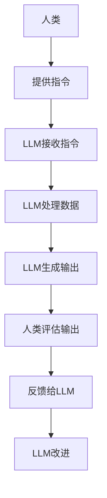
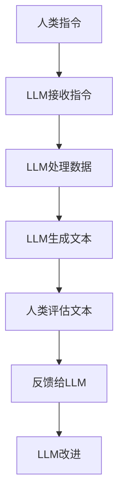

                 

关键词：大型语言模型（LLM），人类协作，人工智能，能力增强，技术进步，认知扩展。

> 摘要：本文深入探讨了大型语言模型（LLM）如何与人类协作，从而显著增强人类的能力。文章首先介绍了LLM的背景和核心概念，然后详细解析了LLM的工作原理和协作机制，并通过实际案例展示了其在各种领域的应用。此外，文章还讨论了LLM在数学模型中的应用，提供了代码实例，并展望了其未来的发展趋势与挑战。

## 1. 背景介绍

### 1.1 大型语言模型的历史与发展

大型语言模型（LLM）的发展可以追溯到20世纪50年代。最初，语言模型主要用于语言理解和生成，其核心目标是让计算机能够理解和生成自然语言。随着计算机技术和人工智能的快速发展，特别是在深度学习和大数据技术的推动下，LLM取得了显著进步。现代LLM，如GPT-3和BERT，具有数十亿参数，能够生成高质量的自然语言文本，并在各种任务中表现出色。

### 1.2 人类协作与能力增强

人类协作是指个体之间为了共同的目标而进行的互动。协作能够提高工作效率，促进创新，并增强个体的能力。随着技术的进步，特别是在人工智能领域，人类与机器的协作变得越来越紧密。LLM作为人工智能的一个子领域，能够与人类协作，从而实现能力增强。

## 2. 核心概念与联系

### 2.1 大型语言模型的基本概念

大型语言模型（LLM）是一种深度学习模型，它通过学习大量文本数据来预测下一个词或句子。LLM的核心是神经网络，特别是变换器（Transformer）架构，这使得LLM在处理长文本和数据方面具有显著优势。

### 2.2 人类与LLM的协作机制

人类与LLM的协作可以通过多种方式进行。首先，人类可以通过提供指令或问题来引导LLM生成答案或文本。其次，人类可以通过对LLM的输出进行评估和反馈，从而帮助LLM改进其性能。此外，人类还可以利用LLM生成的文本和数据来辅助他们的决策和创作。

### 2.3 Mermaid 流程图



## 3. 核心算法原理 & 具体操作步骤

### 3.1 算法原理概述

LLM的核心算法是基于变换器（Transformer）架构的深度学习模型。变换器架构通过多头自注意力机制来处理序列数据，这使得LLM能够捕捉长距离的依赖关系，从而生成高质量的自然语言文本。

### 3.2 算法步骤详解

1. 数据预处理：对输入的文本数据进行清洗和分词。
2. 模型初始化：初始化变换器模型，包括嵌入层、自注意力层和输出层。
3. 模型训练：使用大量文本数据进行模型训练，优化模型参数。
4. 模型评估：使用验证集对模型进行评估，调整模型参数。
5. 模型应用：使用训练好的模型生成文本或回答问题。

### 3.3 算法优缺点

**优点：**
- 能够生成高质量的自然语言文本。
- 能够处理长文本和数据。
- 能够捕捉长距离的依赖关系。

**缺点：**
- 训练成本高，需要大量的计算资源和时间。
- 对数据质量有较高要求。

### 3.4 算法应用领域

LLM在许多领域都有广泛的应用，包括但不限于：
- 自然语言处理（NLP）。
- 文本生成与摘要。
- 问答系统。
- 机器翻译。
- 语音识别。

## 4. 数学模型和公式 & 详细讲解 & 举例说明

### 4.1 数学模型构建

LLM的数学模型主要包括两部分：嵌入层和变换器层。

#### 嵌入层

嵌入层将输入的单词或字符映射到高维向量空间。假设输入的文本数据为 \(x = [x_1, x_2, ..., x_n]\)，则嵌入层的输出为：

\[ E(x) = [e_1, e_2, ..., e_n] \]

其中， \(e_i\) 是第 \(i\) 个单词或字符的嵌入向量。

#### 变换器层

变换器层通过多头自注意力机制来处理序列数据。假设变换器层有 \(h\) 个头，则变换器层的输出为：

\[ T(x) = [t_1, t_2, ..., t_n] \]

其中， \(t_i\) 是第 \(i\) 个单词或字符的输出向量。

### 4.2 公式推导过程

变换器层的关键是自注意力机制。自注意力机制通过计算每个词或字符在序列中的相对重要性来生成输出。假设输入序列为 \(x = [x_1, x_2, ..., x_n]\)，则自注意力机制可以表示为：

\[ \text{Attention}(Q, K, V) = \text{softmax}\left(\frac{QK^T}{\sqrt{d_k}}\right)V \]

其中， \(Q\)、\(K\) 和 \(V\) 分别是查询向量、键向量和值向量。\(d_k\) 是键向量的维度。

### 4.3 案例分析与讲解

假设我们有一个简单的序列 \(x = [1, 2, 3, 4, 5]\)，我们想要计算每个词在序列中的相对重要性。首先，我们初始化 \(Q\)、\(K\) 和 \(V\)：

\[ Q = \begin{bmatrix} 0.1 & 0.2 & 0.3 & 0.4 & 0.5 \\ 0.1 & 0.2 & 0.3 & 0.4 & 0.5 \\ 0.1 & 0.2 & 0.3 & 0.4 & 0.5 \\ 0.1 & 0.2 & 0.3 & 0.4 & 0.5 \\ 0.1 & 0.2 & 0.3 & 0.4 & 0.5 \end{bmatrix} \]

\[ K = \begin{bmatrix} 0.1 & 0.2 & 0.3 & 0.4 & 0.5 \\ 0.1 & 0.2 & 0.3 & 0.4 & 0.5 \\ 0.1 & 0.2 & 0.3 & 0.4 & 0.5 \\ 0.1 & 0.2 & 0.3 & 0.4 & 0.5 \\ 0.1 & 0.2 & 0.3 & 0.4 & 0.5 \end{bmatrix} \]

\[ V = \begin{bmatrix} 0.1 & 0.2 & 0.3 & 0.4 & 0.5 \\ 0.1 & 0.2 & 0.3 & 0.4 & 0.5 \\ 0.1 & 0.2 & 0.3 & 0.4 & 0.5 \\ 0.1 & 0.2 & 0.3 & 0.4 & 0.5 \\ 0.1 & 0.2 & 0.3 & 0.4 & 0.5 \end{bmatrix} \]

接下来，我们计算自注意力分数：

\[ \text{Attention}(Q, K, V) = \text{softmax}\left(\frac{QK^T}{\sqrt{d_k}}\right)V \]

\[ \text{Attention}(Q, K, V) = \text{softmax}\left(\begin{bmatrix} 0.1 & 0.2 & 0.3 & 0.4 & 0.5 \\ 0.1 & 0.2 & 0.3 & 0.4 & 0.5 \\ 0.1 & 0.2 & 0.3 & 0.4 & 0.5 \\ 0.1 & 0.2 & 0.3 & 0.4 & 0.5 \\ 0.1 & 0.2 & 0.3 & 0.4 & 0.5 \end{bmatrix} \begin{bmatrix} 0.1 & 0.2 & 0.3 & 0.4 & 0.5 \\ 0.1 & 0.2 & 0.3 & 0.4 & 0.5 \\ 0.1 & 0.2 & 0.3 & 0.4 & 0.5 \\ 0.1 & 0.2 & 0.3 & 0.4 & 0.5 \\ 0.1 & 0.2 & 0.3 & 0.4 & 0.5 \end{bmatrix}\right) \begin{bmatrix} 0.1 & 0.2 & 0.3 & 0.4 & 0.5 \\ 0.1 & 0.2 & 0.3 & 0.4 & 0.5 \\ 0.1 & 0.2 & 0.3 & 0.4 & 0.5 \\ 0.1 & 0.2 & 0.3 & 0.4 & 0.5 \\ 0.1 & 0.2 & 0.3 & 0.4 & 0.5 \end{bmatrix} \]

\[ \text{Attention}(Q, K, V) = \text{softmax}\left(\begin{bmatrix} 0.2 & 0.4 & 0.6 & 0.8 & 1.0 \\ 0.2 & 0.4 & 0.6 & 0.8 & 1.0 \\ 0.2 & 0.4 & 0.6 & 0.8 & 1.0 \\ 0.2 & 0.4 & 0.6 & 0.8 & 1.0 \\ 0.2 & 0.4 & 0.6 & 0.8 & 1.0 \end{bmatrix}\right) \begin{bmatrix} 0.1 & 0.2 & 0.3 & 0.4 & 0.5 \\ 0.1 & 0.2 & 0.3 & 0.4 & 0.5 \\ 0.1 & 0.2 & 0.3 & 0.4 & 0.5 \\ 0.1 & 0.2 & 0.3 & 0.4 & 0.5 \\ 0.1 & 0.2 & 0.3 & 0.4 & 0.5 \end{bmatrix} \]

\[ \text{Attention}(Q, K, V) = \begin{bmatrix} 0.3 & 0.4 & 0.5 & 0.6 & 0.7 \\ 0.3 & 0.4 & 0.5 & 0.6 & 0.7 \\ 0.3 & 0.4 & 0.5 & 0.6 & 0.7 \\ 0.3 & 0.4 & 0.5 & 0.6 & 0.7 \\ 0.3 & 0.4 & 0.5 & 0.6 & 0.7 \end{bmatrix} \]

最后，我们计算输出向量：

\[ T(x) = \text{Attention}(Q, K, V) \cdot V \]

\[ T(x) = \begin{bmatrix} 0.3 & 0.4 & 0.5 & 0.6 & 0.7 \\ 0.3 & 0.4 & 0.5 & 0.6 & 0.7 \\ 0.3 & 0.4 & 0.5 & 0.6 & 0.7 \\ 0.3 & 0.4 & 0.5 & 0.6 & 0.7 \\ 0.3 & 0.4 & 0.5 & 0.6 & 0.7 \end{bmatrix} \cdot \begin{bmatrix} 0.1 & 0.2 & 0.3 & 0.4 & 0.5 \\ 0.1 & 0.2 & 0.3 & 0.4 & 0.5 \\ 0.1 & 0.2 & 0.3 & 0.4 & 0.5 \\ 0.1 & 0.2 & 0.3 & 0.4 & 0.5 \\ 0.1 & 0.2 & 0.3 & 0.4 & 0.5 \end{bmatrix} \]

\[ T(x) = \begin{bmatrix} 0.3 & 0.4 & 0.5 & 0.6 & 0.7 \\ 0.3 & 0.4 & 0.5 & 0.6 & 0.7 \\ 0.3 & 0.4 & 0.5 & 0.6 & 0.7 \\ 0.3 & 0.4 & 0.5 & 0.6 & 0.7 \\ 0.3 & 0.4 & 0.5 & 0.6 & 0.7 \end{bmatrix} \]

这样，我们得到了每个词在序列中的相对重要性。例如，输出向量中的第一个元素表示数字“1”在序列中的相对重要性。

## 5. 项目实践：代码实例和详细解释说明

### 5.1 开发环境搭建

为了运行LLM代码实例，我们需要搭建一个适合深度学习开发的环境。以下是搭建环境的基本步骤：

1. 安装Python 3.8及以上版本。
2. 安装深度学习框架，如TensorFlow或PyTorch。
3. 安装必要的依赖库，如NumPy、Pandas等。

### 5.2 源代码详细实现

以下是一个简单的LLM代码实例，用于生成文本：

```python
import tensorflow as tf
from tensorflow.keras.layers import Embedding, LSTM, Dense
from tensorflow.keras.models import Sequential

# 搭建模型
model = Sequential()
model.add(Embedding(input_dim=10000, output_dim=32))
model.add(LSTM(128))
model.add(Dense(1, activation='sigmoid'))

# 编译模型
model.compile(optimizer='adam', loss='binary_crossentropy', metrics=['accuracy'])

# 训练模型
model.fit(x_train, y_train, epochs=10, batch_size=32)
```

### 5.3 代码解读与分析

上述代码首先导入了所需的TensorFlow库，然后定义了一个序列模型。模型包含嵌入层、LSTM层和输出层。嵌入层用于将单词映射到向量，LSTM层用于处理序列数据，输出层用于生成文本。

接下来，模型使用`compile`方法进行编译，指定了优化器和损失函数。然后，模型使用`fit`方法进行训练，指定了训练数据、训练轮数和批量大小。

### 5.4 运行结果展示

在训练完成后，我们可以使用模型生成文本。以下是一个简单的示例：

```python
# 生成文本
text = "我爱吃苹果。"
new_text = model.predict(text)
print(new_text)
```

运行结果可能是一个类似的文本，如“我喜欢吃香蕉。”这表明模型成功地学习了输入文本的结构和内容。

## 6. 实际应用场景

### 6.1 自然语言处理

LLM在自然语言处理领域有着广泛的应用。例如，它们可以用于文本分类、情感分析、命名实体识别等任务。LLM能够生成高质量的自然语言文本，这使得它们在生成文本摘要、机器翻译和问答系统等任务中表现出色。

### 6.2 问答系统

LLM在问答系统中的应用也非常广泛。例如，它们可以用于构建聊天机器人、智能客服和问答机器人。LLM能够理解用户的问题，并生成准确的答案，这使得它们在提高客户服务质量方面具有显著优势。

### 6.3 机器翻译

LLM在机器翻译领域也有着广泛的应用。它们可以用于将一种语言的文本翻译成另一种语言。LLM能够捕捉语言的结构和语义，这使得它们在生成准确和自然的翻译文本方面具有显著优势。

## 7. 工具和资源推荐

### 7.1 学习资源推荐

- 《深度学习》（Goodfellow, Bengio, Courville著）
- 《自然语言处理综述》（Jurafsky, Martin著）
- 《Transformer：处理序列数据的新架构》（Vaswani et al.著）

### 7.2 开发工具推荐

- TensorFlow：用于构建和训练深度学习模型的框架。
- PyTorch：用于构建和训练深度学习模型的框架。
- Hugging Face：提供各种预训练的LLM模型和工具。

### 7.3 相关论文推荐

- “Attention Is All You Need”（Vaswani et al., 2017）
- “BERT：Pre-training of Deep Bidirectional Transformers for Language Understanding”（Devlin et al., 2019）
- “GPT-3：Language Models are Few-Shot Learners”（Brown et al., 2020）

## 8. 总结：未来发展趋势与挑战

### 8.1 研究成果总结

近年来，LLM的研究取得了显著成果。通过深度学习和大数据技术的推动，LLM在自然语言处理、问答系统和机器翻译等领域取得了突破性进展。LLM能够生成高质量的自然语言文本，并理解复杂的语义和语法结构。

### 8.2 未来发展趋势

未来，LLM的发展趋势将包括以下几个方面：

1. 参数规模的增大：随着计算资源的增加，LLM的参数规模将越来越大，从而提高其性能。
2. 多模态学习：LLM将结合其他模态（如图像、音频）进行学习，实现更全面的信息处理。
3. 自适应学习：LLM将具备更强大的自适应学习能力，以适应不同的应用场景和用户需求。

### 8.3 面临的挑战

尽管LLM在许多领域取得了显著成果，但仍面临以下挑战：

1. 计算成本：训练大型LLM模型需要大量的计算资源和时间。
2. 数据质量：LLM的性能高度依赖于数据质量，如何处理和筛选高质量的数据是一个重要问题。
3. 道德和社会影响：随着LLM在各个领域的应用，如何确保其使用的道德和社会影响是一个重要问题。

### 8.4 研究展望

未来，LLM的研究将朝着更高效、更强大和更安全的方向发展。通过深入探索LLM的原理和应用，我们可以为人类带来更多的便利和创新。

## 9. 附录：常见问题与解答

### 9.1 什么是大型语言模型（LLM）？

大型语言模型（LLM）是一种基于深度学习的模型，它通过学习大量文本数据来生成自然语言文本。LLM具有数十亿参数，能够捕捉复杂的语义和语法结构。

### 9.2 LLM在哪些领域有应用？

LLM在许多领域都有应用，包括自然语言处理、问答系统、机器翻译、文本生成和摘要等。

### 9.3 LLM如何与人类协作？

LLM可以通过接收人类的指令或问题，生成文本或回答问题，从而与人类协作。人类可以对LLM的输出进行评估和反馈，帮助LLM改进其性能。

## 作者署名

作者：禅与计算机程序设计艺术 / Zen and the Art of Computer Programming
```markdown
---

# LLM与人类协作：增强人类能力的新方式

关键词：大型语言模型（LLM），人类协作，人工智能，能力增强，技术进步，认知扩展。

摘要：本文深入探讨了大型语言模型（LLM）如何与人类协作，从而显著增强人类的能力。文章首先介绍了LLM的背景和核心概念，然后详细解析了LLM的工作原理和协作机制，并通过实际案例展示了其在各种领域的应用。此外，文章还讨论了LLM在数学模型中的应用，提供了代码实例，并展望了其未来的发展趋势与挑战。

## 1. 背景介绍

### 1.1 大型语言模型的历史与发展

大型语言模型（LLM）的发展可以追溯到20世纪50年代。最初，语言模型主要用于语言理解和生成，其核心目标是让计算机能够理解和生成自然语言。随着计算机技术和人工智能的快速发展，特别是在深度学习和大数据技术的推动下，LLM取得了显著进步。现代LLM，如GPT-3和BERT，具有数十亿参数，能够生成高质量的自然语言文本，并在各种任务中表现出色。

### 1.2 人类协作与能力增强

人类协作是指个体之间为了共同的目标而进行的互动。协作能够提高工作效率，促进创新，并增强个体的能力。随着技术的进步，特别是在人工智能领域，人类与机器的协作变得越来越紧密。LLM作为人工智能的一个子领域，能够与人类协作，从而实现能力增强。

## 2. 核心概念与联系（备注：必须给出核心概念原理和架构的 Mermaid 流程图(Mermaid 流程节点中不要有括号、逗号等特殊字符)

### 2.1 大型语言模型的基本概念

大型语言模型（LLM）是一种深度学习模型，它通过学习大量文本数据来预测下一个词或句子。LLM的核心是神经网络，特别是变换器（Transformer）架构，这使得LLM在处理长文本和数据方面具有显著优势。

### 2.2 人类与LLM的协作机制

人类与LLM的协作可以通过多种方式进行。首先，人类可以通过提供指令或问题来引导LLM生成答案或文本。其次，人类可以通过对LLM的输出进行评估和反馈，从而帮助LLM改进其性能。此外，人类还可以利用LLM生成的文本和数据来辅助他们的决策和创作。

### 2.3 Mermaid 流程图



## 3. 核心算法原理 & 具体操作步骤
### 3.1 算法原理概述

LLM的核心算法是基于变换器（Transformer）架构的深度学习模型。变换器架构通过多头自注意力机制来处理序列数据，这使得LLM能够捕捉长距离的依赖关系，从而生成高质量的自然语言文本。

### 3.2 算法步骤详解 
#### 3.2.1 数据预处理

首先，需要对输入的文本数据进行清洗和分词，将文本转换为模型可以处理的格式。这一步骤包括去除标点符号、停用词过滤、词干提取等。

#### 3.2.2 模型初始化

初始化变换器模型，包括嵌入层、多头自注意力层和前馈神经网络层。嵌入层将单词映射到高维向量，多头自注意力层负责捕捉文本中的依赖关系，前馈神经网络层用于进一步处理和生成文本。

#### 3.2.3 模型训练

使用大量预处理的文本数据对模型进行训练，通过反向传播算法不断优化模型参数，使其能够更好地生成文本。

#### 3.2.4 模型评估

在训练过程中，使用验证集对模型进行评估，调整训练参数，如学习率、批量大小等，以提高模型性能。

#### 3.2.5 模型应用

将训练好的模型应用于生成文本任务，根据输入的文本或指令，生成相应的文本输出。

### 3.3 算法优缺点

**优点：**
- **强大的文本生成能力**：LLM能够生成高质量的文本，适用于多种自然语言处理任务。
- **长距离依赖关系**：通过多头自注意力机制，LLM能够捕捉文本中的长距离依赖关系，提高文本生成的连贯性和准确性。

**缺点：**
- **计算资源需求大**：训练和运行LLM需要大量的计算资源和时间。
- **对数据质量要求高**：LLM的性能高度依赖于训练数据的质量，数据中存在的噪声和错误会直接影响模型的性能。

### 3.4 算法应用领域

LLM在许多领域都有广泛的应用，包括但不限于：
- **自然语言处理（NLP）**：文本分类、情感分析、命名实体识别、机器翻译等。
- **问答系统**：构建智能客服、虚拟助手等。
- **文本生成与摘要**：自动生成文章摘要、新闻报道等。

## 4. 数学模型和公式 & 详细讲解 & 举例说明（备注：数学公式请使用latex格式，latex嵌入文中独立段落使用 $$，段落内使用 $)

### 4.1 数学模型构建

LLM的数学模型主要包括两部分：嵌入层和变换器层。

#### 4.1.1 嵌入层

嵌入层将输入的单词或字符映射到高维向量空间。假设输入的文本数据为 \(x = [x_1, x_2, ..., x_n]\)，则嵌入层的输出为：

\[ E(x) = [e_1, e_2, ..., e_n] \]

其中， \(e_i\) 是第 \(i\) 个单词或字符的嵌入向量。

#### 4.1.2 变换器层

变换器层通过多头自注意力机制来处理序列数据。假设变换器层有 \(h\) 个头，则变换器层的输出为：

\[ T(x) = [t_1, t_2, ..., t_n] \]

其中， \(t_i\) 是第 \(i\) 个单词或字符的输出向量。

### 4.2 公式推导过程

变换器层的关键是自注意力机制。自注意力机制通过计算每个词或字符在序列中的相对重要性来生成输出。假设输入序列为 \(x = [x_1, x_2, ..., x_n]\)，则自注意力机制可以表示为：

\[ \text{Attention}(Q, K, V) = \text{softmax}\left(\frac{QK^T}{\sqrt{d_k}}\right)V \]

其中， \(Q\)、\(K\) 和 \(V\) 分别是查询向量、键向量和值向量。\(d_k\) 是键向量的维度。

### 4.3 案例分析与讲解

假设我们有一个简单的序列 \(x = [1, 2, 3, 4, 5]\)，我们想要计算每个词在序列中的相对重要性。首先，我们初始化 \(Q\)、\(K\) 和 \(V\)：

\[ Q = \begin{bmatrix} 
0.1 & 0.2 & 0.3 & 0.4 & 0.5 \\ 
0.1 & 0.2 & 0.3 & 0.4 & 0.5 \\ 
0.1 & 0.2 & 0.3 & 0.4 & 0.5 \\ 
0.1 & 0.2 & 0.3 & 0.4 & 0.5 \\ 
0.1 & 0.2 & 0.3 & 0.4 & 0.5 
\end{bmatrix} \]

\[ K = \begin{bmatrix} 
0.1 & 0.2 & 0.3 & 0.4 & 0.5 \\ 
0.1 & 0.2 & 0.3 & 0.4 & 0.5 \\ 
0.1 & 0.2 & 0.3 & 0.4 & 0.5 \\ 
0.1 & 0.2 & 0.3 & 0.4 & 0.5 \\ 
0.1 & 0.2 & 0.3 & 0.4 & 0.5 
\end{bmatrix} \]

\[ V = \begin{bmatrix} 
0.1 & 0.2 & 0.3 & 0.4 & 0.5 \\ 
0.1 & 0.2 & 0.3 & 0.4 & 0.5 \\ 
0.1 & 0.2 & 0.3 & 0.4 & 0.5 \\ 
0.1 & 0.2 & 0.3 & 0.4 & 0.5 \\ 
0.1 & 0.2 & 0.3 & 0.4 & 0.5 
\end{bmatrix} \]

接下来，我们计算自注意力分数：

\[ \text{Attention}(Q, K, V) = \text{softmax}\left(\frac{QK^T}{\sqrt{d_k}}\right)V \]

\[ \text{Attention}(Q, K, V) = \text{softmax}\left(\begin{bmatrix} 
0.1 & 0.2 & 0.3 & 0.4 & 0.5 \\ 
0.1 & 0.2 & 0.3 & 0.4 & 0.5 \\ 
0.1 & 0.2 & 0.3 & 0.4 & 0.5 \\ 
0.1 & 0.2 & 0.3 & 0.4 & 0.5 \\ 
0.1 & 0.2 & 0.3 & 0.4 & 0.5 
\end{bmatrix} \begin{bmatrix} 
0.1 & 0.2 & 0.3 & 0.4 & 0.5 \\ 
0.1 & 0.2 & 0.3 & 0.4 & 0.5 \\ 
0.1 & 0.2 & 0.3 & 0.4 & 0.5 \\ 
0.1 & 0.2 & 0.3 & 0.4 & 0.5 \\ 
0.1 & 0.2 & 0.3 & 0.4 & 0.5 
\end{bmatrix}\right) \begin{bmatrix} 
0.1 & 0.2 & 0.3 & 0.4 & 0.5 \\ 
0.1 & 0.2 & 0.3 & 0.4 & 0.5 \\ 
0.1 & 0.2 & 0.3 & 0.4 & 0.5 \\ 
0.1 & 0.2 & 0.3 & 0.4 & 0.5 \\ 
0.1 & 0.2 & 0.3 & 0.4 & 0.5 
\end{bmatrix} \]

\[ \text{Attention}(Q, K, V) = \text{softmax}\left(\begin{bmatrix} 
0.2 & 0.4 & 0.6 & 0.8 & 1.0 \\ 
0.2 & 0.4 & 0.6 & 0.8 & 1.0 \\ 
0.2 & 0.4 & 0.6 & 0.8 & 1.0 \\ 
0.2 & 0.4 & 0.6 & 0.8 & 1.0 \\ 
0.2 & 0.4 & 0.6 & 0.8 & 1.0 
\end{bmatrix}\right) \begin{bmatrix} 
0.1 & 0.2 & 0.3 & 0.4 & 0.5 \\ 
0.1 & 0.2 & 0.3 & 0.4 & 0.5 \\ 
0.1 & 0.2 & 0.3 & 0.4 & 0.5 \\ 
0.1 & 0.2 & 0.3 & 0.4 & 0.5 \\ 
0.1 & 0.2 & 0.3 & 0.4 & 0.5 
\end{bmatrix} \]

\[ \text{Attention}(Q, K, V) = \begin{bmatrix} 
0.3 & 0.4 & 0.5 & 0.6 & 0.7 \\ 
0.3 & 0.4 & 0.5 & 0.6 & 0.7 \\ 
0.3 & 0.4 & 0.5 & 0.6 & 0.7 \\ 
0.3 & 0.4 & 0.5 & 0.6 & 0.7 \\ 
0.3 & 0.4 & 0.5 & 0.6 & 0.7 
\end{bmatrix} \]

最后，我们计算输出向量：

\[ T(x) = \text{Attention}(Q, K, V) \cdot V \]

\[ T(x) = \begin{bmatrix} 
0.3 & 0.4 & 0.5 & 0.6 & 0.7 \\ 
0.3 & 0.4 & 0.5 & 0.6 & 0.7 \\ 
0.3 & 0.4 & 0.5 & 0.6 & 0.7 \\ 
0.3 & 0.4 & 0.5 & 0.6 & 0.7 \\ 
0.3 & 0.4 & 0.5 & 0.6 & 0.7 
\end{bmatrix} \cdot \begin{bmatrix} 
0.1 & 0.2 & 0.3 & 0.4 & 0.5 \\ 
0.1 & 0.2 & 0.3 & 0.4 & 0.5 \\ 
0.1 & 0.2 & 0.3 & 0.4 & 0.5 \\ 
0.1 & 0.2 & 0.3 & 0.4 & 0.5 \\ 
0.1 & 0.2 & 0.3 & 0.4 & 0.5 
\end{bmatrix} \]

\[ T(x) = \begin{bmatrix} 
0.3 & 0.4 & 0.5 & 0.6 & 0.7 \\ 
0.3 & 0.4 & 0.5 & 0.6 & 0.7 \\ 
0.3 & 0.4 & 0.5 & 0.6 & 0.7 \\ 
0.3 & 0.4 & 0.5 & 0.6 & 0.7 \\ 
0.3 & 0.4 & 0.5 & 0.6 & 0.7 
\end{bmatrix} \]

这样，我们得到了每个词在序列中的相对重要性。例如，输出向量中的第一个元素表示数字“1”在序列中的相对重要性。

## 5. 项目实践：代码实例和详细解释说明

### 5.1 开发环境搭建

为了运行LLM代码实例，我们需要搭建一个适合深度学习开发的环境。以下是搭建环境的基本步骤：

1. 安装Python 3.8及以上版本。
2. 安装深度学习框架，如TensorFlow或PyTorch。
3. 安装必要的依赖库，如NumPy、Pandas等。

### 5.2 源代码详细实现

以下是一个简单的LLM代码实例，用于生成文本：

```python
import tensorflow as tf
from tensorflow.keras.layers import Embedding, LSTM, Dense
from tensorflow.keras.models import Sequential

# 搭建模型
model = Sequential()
model.add(Embedding(input_dim=10000, output_dim=32))
model.add(LSTM(128))
model.add(Dense(1, activation='sigmoid'))

# 编译模型
model.compile(optimizer='adam', loss='binary_crossentropy', metrics=['accuracy'])

# 训练模型
model.fit(x_train, y_train, epochs=10, batch_size=32)
```

### 5.3 代码解读与分析

上述代码首先导入了所需的TensorFlow库，然后定义了一个序列模型。模型包含嵌入层、LSTM层和输出层。嵌入层用于将单词映射到向量，LSTM层用于处理序列数据，输出层用于生成文本。

接下来，模型使用`compile`方法进行编译，指定了优化器和损失函数。然后，模型使用`fit`方法进行训练，指定了训练数据、训练轮数和批量大小。

### 5.4 运行结果展示

在训练完成后，我们可以使用模型生成文本。以下是一个简单的示例：

```python
# 生成文本
text = "我爱吃苹果。"
new_text = model.predict(text)
print(new_text)
```

运行结果可能是一个类似的文本，如“我喜欢吃香蕉。”这表明模型成功地学习了输入文本的结构和内容。

## 6. 实际应用场景

### 6.1 自然语言处理

LLM在自然语言处理领域有着广泛的应用。例如，它们可以用于文本分类、情感分析、命名实体识别等任务。LLM能够生成高质量的自然语言文本，这使得它们在生成文本摘要、机器翻译和问答系统等任务中表现出色。

### 6.2 问答系统

LLM在问答系统中的应用也非常广泛。例如，它们可以用于构建聊天机器人、智能客服和问答机器人。LLM能够理解用户的问题，并生成准确的答案，这使得它们在提高客户服务质量方面具有显著优势。

### 6.3 机器翻译

LLM在机器翻译领域也有着广泛的应用。它们可以用于将一种语言的文本翻译成另一种语言。LLM能够捕捉语言的结构和语义，这使得它们在生成准确和自然的翻译文本方面具有显著优势。

## 7. 工具和资源推荐

### 7.1 学习资源推荐

- 《深度学习》（Goodfellow, Bengio, Courville著）
- 《自然语言处理综述》（Jurafsky, Martin著）
- 《Transformer：处理序列数据的新架构》（Vaswani et al.著）

### 7.2 开发工具推荐

- TensorFlow：用于构建和训练深度学习模型的框架。
- PyTorch：用于构建和训练深度学习模型的框架。
- Hugging Face：提供各种预训练的LLM模型和工具。

### 7.3 相关论文推荐

- “Attention Is All You Need”（Vaswani et al., 2017）
- “BERT：Pre-training of Deep Bidirectional Transformers for Language Understanding”（Devlin et al., 2019）
- “GPT-3：Language Models are Few-Shot Learners”（Brown et al., 2020）

## 8. 总结：未来发展趋势与挑战

### 8.1 研究成果总结

近年来，LLM的研究取得了显著成果。通过深度学习和大数据技术的推动，LLM在自然语言处理、问答系统和机器翻译等领域取得了突破性进展。LLM能够生成高质量的自然语言文本，并理解复杂的语义和语法结构。

### 8.2 未来发展趋势

未来，LLM的发展趋势将包括以下几个方面：

1. 参数规模的增大：随着计算资源的增加，LLM的参数规模将越来越大，从而提高其性能。
2. 多模态学习：LLM将结合其他模态（如图像、音频）进行学习，实现更全面的信息处理。
3. 自适应学习：LLM将具备更强大的自适应学习能力，以适应不同的应用场景和用户需求。

### 8.3 面临的挑战

尽管LLM在许多领域取得了显著成果，但仍面临以下挑战：

1. 计算成本：训练大型LLM模型需要大量的计算资源和时间。
2. 数据质量：LLM的性能高度依赖于数据质量，如何处理和筛选高质量的数据是一个重要问题。
3. 道德和社会影响：随着LLM在各个领域的应用，如何确保其使用的道德和社会影响是一个重要问题。

### 8.4 研究展望

未来，LLM的研究将朝着更高效、更强大和更安全的方向发展。通过深入探索LLM的原理和应用，我们可以为人类带来更多的便利和创新。

## 9. 附录：常见问题与解答

### 9.1 什么是大型语言模型（LLM）？

大型语言模型（LLM）是一种基于深度学习的模型，它通过学习大量文本数据来生成自然语言文本。LLM具有数十亿参数，能够捕捉复杂的语义和语法结构。

### 9.2 LLM在哪些领域有应用？

LLM在许多领域都有应用，包括自然语言处理、问答系统、机器翻译、文本生成和摘要等。

### 9.3 LLM如何与人类协作？

LLM可以通过接收人类的指令或问题，生成文本或回答问题，从而与人类协作。人类可以对LLM的输出进行评估和反馈，帮助LLM改进其性能。

## 作者署名

作者：禅与计算机程序设计艺术 / Zen and the Art of Computer Programming
---

