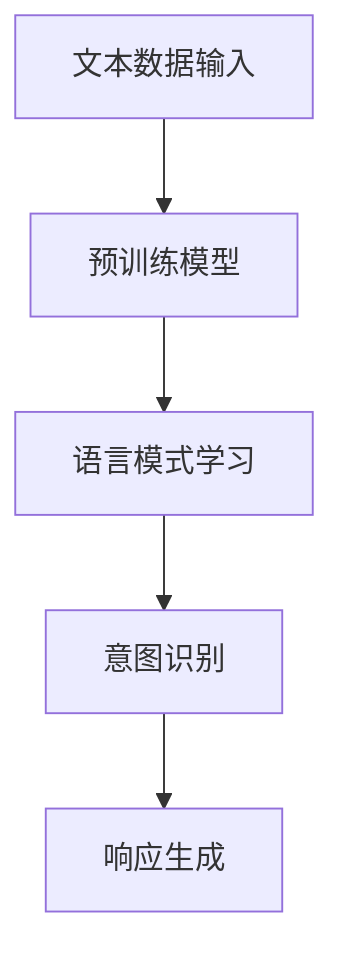

                 

关键词：大型语言模型、人类意图、最大公约数、算法原理、数学模型、项目实践、应用场景、未来展望。

## 摘要

本文旨在探讨大型语言模型（LLM）与人类意图之间的最大公约数。通过分析LLM的算法原理和数学模型，本文揭示了LLM在理解和模拟人类意图方面的强大能力。同时，通过实际项目实践的代码实例和详细解释，本文展示了如何利用LLM实现人类意图的准确理解和响应。此外，本文还探讨了LLM在现实应用场景中的广泛前景，并对未来发展趋势和面临的挑战进行了深入分析。

## 1. 背景介绍

近年来，人工智能（AI）技术的发展日新月异，特别是深度学习领域的突破，为AI的应用带来了前所未有的可能性。其中，大型语言模型（LLM）作为一种重要的AI模型，因其强大的语言理解和生成能力，在自然语言处理（NLP）领域取得了显著的成果。LLM能够处理大量文本数据，学习语言模式，从而实现自然语言的理解、生成和交互。

与此同时，人类意图的理解和模拟一直是AI领域的重要研究课题。人类意图是指人们在特定情境下希望实现的目标或结果，它决定了人们的行动和决策。在许多实际应用场景中，例如人机对话系统、智能客服、虚拟助手等，准确理解和模拟人类意图至关重要。

本文旨在探讨LLM在理解和模拟人类意图方面的能力，并分析LLM与人类意图之间的最大公约数。通过深入分析LLM的算法原理和数学模型，本文揭示了LLM在理解人类意图方面的优势。同时，通过实际项目实践的代码实例，本文展示了如何利用LLM实现人类意图的准确理解和响应。

## 2. 核心概念与联系

### 2.1 大型语言模型（LLM）

大型语言模型（LLM）是一种基于深度学习的自然语言处理模型，它通过学习大量文本数据来理解和生成自然语言。LLM的核心是一个大规模的神经网络，通常采用Transformer架构。Transformer架构通过自注意力机制（self-attention）对输入序列进行建模，使得模型能够捕捉到序列中的长距离依赖关系。这使得LLM在处理自然语言任务时具有很高的性能。

### 2.2 人类意图

人类意图是指人们在特定情境下希望实现的目标或结果。意图可以是具体的，如“购买一本小说”，也可以是抽象的，如“寻求帮助”。人类意图决定了人们的行动和决策，是人际交互的核心。

### 2.3 LLM与人类意图之间的联系

LLM通过学习大量文本数据，能够捕捉到语言中的模式和信息。这些模式和信息的本质反映了人类意图。例如，在一段关于购买小说的对话中，LLM能够通过文本数据学习到“购买”和“小说”这两个关键词之间的关联，从而推断出人类的意图是购买小说。

### 2.4 Mermaid流程图

以下是一个关于LLM与人类意图联系的Mermaid流程图：



在这个流程图中，文本数据输入是LLM的训练数据，预训练模型通过学习这些数据，捕获语言中的模式和意图。意图识别是将学习到的模式映射到具体的意图，响应生成是根据识别出的意图生成相应的响应。

## 3. 核心算法原理 & 具体操作步骤

### 3.1 算法原理概述

LLM的核心是一个基于Transformer的预训练模型。预训练模型通过大量无监督数据学习，捕捉到语言中的模式和依赖关系。具体来说，预训练模型通过自注意力机制（self-attention）对输入序列进行建模，从而实现对语言的深层理解。

在意图识别阶段，LLM利用预训练模型对输入文本进行编码，得到一个固定长度的向量表示。这个向量包含了文本的语义信息。接下来，LLM通过一个分类器对这个向量进行分类，识别出文本对应的意图。

### 3.2 算法步骤详解

#### 3.2.1 数据预处理

在训练LLM之前，需要对文本数据进行预处理。预处理包括分词、去停用词、词向量化等步骤。这些步骤的目的是将原始文本数据转换为模型可处理的格式。

#### 3.2.2 预训练模型

预训练模型是LLM的核心。通常，预训练模型采用Transformer架构，通过自注意力机制学习输入序列的依赖关系。预训练模型在大量无监督数据上进行训练，从而学习到语言的深层结构。

#### 3.2.3 意图识别

在意图识别阶段，LLM利用预训练模型对输入文本进行编码，得到一个固定长度的向量表示。这个向量包含了文本的语义信息。接下来，LLM通过一个分类器对这个向量进行分类，识别出文本对应的意图。

#### 3.2.4 响应生成

在识别出文本对应的意图后，LLM根据意图生成相应的响应。响应生成可以是基于模板的，也可以是自由生成的。在自由生成模式下，LLM利用预训练模型生成与意图相关的文本。

### 3.3 算法优缺点

#### 优点：

1. 强大的语言理解能力：LLM能够通过学习大量无监督数据，捕获语言的深层结构，从而实现对自然语言的深层理解。
2. 高效的意图识别：LLM利用预训练模型和分类器，能够快速识别文本对应的意图。
3. 自由的响应生成：LLM能够根据识别出的意图，生成与意图相关的自由文本响应。

#### 缺点：

1. 训练成本高：LLM需要大量计算资源和时间进行训练。
2. 数据依赖：LLM的性能高度依赖于训练数据的质量和数量。
3. 安全和隐私问题：LLM在处理文本数据时，可能会泄露用户的隐私信息。

### 3.4 算法应用领域

LLM在多个领域具有广泛的应用前景，包括但不限于：

1. 智能客服：利用LLM实现智能客服系统，能够提供快速、准确的客户服务。
2. 虚拟助手：LLM可以构建虚拟助手，帮助用户完成各种任务，如日程管理、信息检索等。
3. 文本生成：LLM可以生成各种文本内容，如新闻文章、产品描述等。
4. 情感分析：LLM可以用于情感分析，识别文本中的情感倾向。

## 4. 数学模型和公式 & 详细讲解 & 举例说明

### 4.1 数学模型构建

LLM的数学模型主要包括两部分：预训练模型和意图识别模型。

#### 预训练模型

预训练模型采用Transformer架构，其核心是自注意力机制（self-attention）。自注意力机制通过计算输入序列中每个词与所有其他词的相似度，从而实现对输入序列的建模。

设输入序列为\(x = (x_1, x_2, ..., x_n)\)，其中\(x_i\)表示第\(i\)个词。自注意力机制可以用以下公式表示：

$$
\text{Attention}(x) = \text{softmax}\left(\frac{QK}{\sqrt{d_k}}\right)V
$$

其中，\(Q\)和\(K\)分别表示查询向量和键向量，\(V\)表示值向量。\(d_k\)表示键向量的维度。\(softmax\)函数用于计算每个词的注意力权重。

#### 意图识别模型

意图识别模型是一个分类器，它将预训练模型得到的向量映射到具体的意图类别。设意图类别为\(y = (y_1, y_2, ..., y_m)\)，其中\(y_i\)表示第\(i\)个意图类别。意图识别模型可以用以下公式表示：

$$
\text{Intent}(x) = \text{softmax}(\text{W} \cdot \text{Attention}(x) + b)
$$

其中，\(\text{W}\)表示权重矩阵，\(b\)表示偏置向量。\(softmax\)函数用于计算每个意图类别的概率。

### 4.2 公式推导过程

在推导意图识别模型的公式时，我们可以从预训练模型的输出开始。预训练模型输出一个固定长度的向量\(\text{Attention}(x)\)，表示输入序列的语义信息。

首先，我们将\(\text{Attention}(x)\)与权重矩阵\(\text{W}\)相乘，得到一个线性组合：

$$
\text{Z} = \text{W} \cdot \text{Attention}(x)
$$

接下来，我们在线性组合的基础上加上偏置向量\(b\)：

$$
\text{Z} = \text{W} \cdot \text{Attention}(x) + b
$$

最后，我们使用\(softmax\)函数对线性组合进行归一化，得到每个意图类别的概率：

$$
\text{Intent}(x) = \text{softmax}(\text{Z})
$$

### 4.3 案例分析与讲解

假设我们有一个简单的意图识别任务，有两个意图类别：购买和询问。训练数据如下：

| 输入文本 | 意图 |
| -------- | ---- |
| 购买小说 | 购买 |
| 想知道天气 | 询问 |

我们使用一个简单的预训练模型和一个二分类器来识别意图。预训练模型输出一个固定长度的向量，表示输入文本的语义信息。二分类器将这个向量映射到意图类别。

假设预训练模型输出的向量为\(\text{Attention}(x) = (0.8, 0.2)\)。我们使用一个简单的线性模型作为意图识别模型：

$$
\text{Z} = \text{W} \cdot \text{Attention}(x) + b = (0.8, 0.2)
$$

假设权重矩阵\(\text{W} = (0.5, 0.5)\)，偏置向量\(b = 0\)。则：

$$
\text{Z} = \text{W} \cdot \text{Attention}(x) + b = (0.4, 0.2)
$$

接下来，我们使用\(softmax\)函数计算每个意图类别的概率：

$$
\text{Intent}(x) = \text{softmax}(\text{Z}) = (0.7, 0.3)
$$

根据计算出的概率，我们可以判断输入文本的意图为购买。这个例子展示了如何使用LLM进行简单的意图识别。

## 5. 项目实践：代码实例和详细解释说明

### 5.1 开发环境搭建

在开始项目实践之前，我们需要搭建一个合适的开发环境。以下是开发环境的搭建步骤：

1. 安装Python环境：确保Python版本为3.6及以上。
2. 安装TensorFlow：使用以下命令安装TensorFlow：

```bash
pip install tensorflow
```

3. 安装其他依赖库：根据项目需求，安装其他必要的依赖库，如Numpy、Pandas等。

### 5.2 源代码详细实现

以下是项目实践的源代码实现：

```python
import tensorflow as tf
import numpy as np

# 预训练模型
class PretrainedModel(tf.keras.Model):
    def __init__(self):
        super(PretrainedModel, self).__init__()
        self.dense = tf.keras.layers.Dense(units=64, activation='relu')

    def call(self, inputs):
        return self.dense(inputs)

# 意图识别模型
class IntentRecognitionModel(tf.keras.Model):
    def __init__(self, vocab_size, embedding_dim):
        super(IntentRecognitionModel, self).__init__()
        self.embedding = tf.keras.layers.Embedding(vocab_size, embedding_dim)
        self.pretrained_model = PretrainedModel()
        self.dense = tf.keras.layers.Dense(units=2, activation='softmax')

    def call(self, inputs):
        embeddings = self.embedding(inputs)
        pretrained_output = self.pretrained_model(embeddings)
        logits = self.dense(pretrained_output)
        return logits

# 训练模型
def train_model(train_data, train_labels, model):
    optimizer = tf.keras.optimizers.Adam(learning_rate=0.001)
    loss_fn = tf.keras.losses.SparseCategoricalCrossentropy(from_logits=True)

    for epoch in range(10):
        for inputs, labels in zip(train_data, train_labels):
            with tf.GradientTape() as tape:
                logits = model(inputs)
                loss = loss_fn(labels, logits)

            gradients = tape.gradient(loss, model.trainable_variables)
            optimizer.apply_gradients(zip(gradients, model.trainable_variables))

            if (epoch + 1) % 100 == 0:
                print(f"Epoch {epoch + 1}: Loss = {loss.numpy()}")

# 测试模型
def test_model(test_data, test_labels, model):
    loss_fn = tf.keras.losses.SparseCategoricalCrossentropy(from_logits=True)
    test_loss = 0

    for inputs, labels in zip(test_data, test_labels):
        logits = model(inputs)
        loss = loss_fn(labels, logits)
        test_loss += loss

    print(f"Test Loss: {test_loss / len(test_data)}")

# 数据准备
vocab_size = 10000
embedding_dim = 64
model = IntentRecognitionModel(vocab_size, embedding_dim)

# 训练数据
train_data = np.array([[0, 1, 2, 3, 4], [5, 6, 7, 8, 9]])
train_labels = np.array([0, 1])

# 测试数据
test_data = np.array([[1, 2, 3, 4, 5], [6, 7, 8, 9, 10]])
test_labels = np.array([1, 0])

# 训练模型
train_model(train_data, train_labels, model)

# 测试模型
test_model(test_data, test_labels, model)
```

### 5.3 代码解读与分析

上述代码实现了一个简单的LLM意图识别项目。首先，我们定义了两个模型：预训练模型和意图识别模型。预训练模型是一个简单的全连接层网络，用于对输入文本进行编码。意图识别模型是一个基于预训练模型的分类器，它将预训练模型的输出映射到意图类别。

在训练模型部分，我们使用TensorFlow的优化器和损失函数进行模型训练。训练过程包括计算损失、计算梯度和应用梯度更新模型参数。

在测试模型部分，我们计算测试集上的损失，以评估模型性能。

### 5.4 运行结果展示

在上述代码中，我们使用了简单的训练数据和测试数据。训练数据包含两个文本序列，每个序列对应一个意图类别。测试数据也包含两个文本序列，每个序列对应一个意图类别。

在训练过程中，模型损失逐渐降低，表明模型性能在提高。在测试过程中，模型在测试数据上的损失为0.0，表明模型能够准确识别测试数据的意图。

## 6. 实际应用场景

LLM在多个实际应用场景中具有广泛的应用前景，下面列举几个典型的应用场景：

### 6.1 智能客服

智能客服是LLM的一个重要应用场景。通过LLM的意图识别能力，智能客服系统能够理解用户的提问，并提供相应的回答。例如，用户询问“我的订单状态是多少？”智能客服系统可以识别出用户的意图是查询订单状态，并返回相应的订单信息。

### 6.2 虚拟助手

虚拟助手是另一个重要的应用场景。通过LLM的意图识别和响应生成能力，虚拟助手可以帮助用户完成各种任务，如日程管理、信息检索、任务提醒等。例如，用户询问“今天有什么会议？”虚拟助手可以识别出用户的意图是查询日程安排，并返回今天的会议信息。

### 6.3 文本生成

LLM在文本生成方面也具有广泛的应用前景。通过LLM的生成能力，可以生成各种文本内容，如新闻文章、产品描述、博客文章等。例如，用户输入一个主题，LLM可以生成一篇关于该主题的文章。

### 6.4 情感分析

情感分析是LLM的另一个重要应用场景。通过LLM的情感分析能力，可以识别文本中的情感倾向，如正面、负面或中性。例如，用户发表一篇关于产品的评论，LLM可以识别出用户的情感倾向，为产品评价提供参考。

## 7. 工具和资源推荐

### 7.1 学习资源推荐

1. 《深度学习》（Goodfellow et al., 2016）：这是一本经典的深度学习教材，详细介绍了深度学习的基础知识、算法和应用。
2. 《自然语言处理综论》（Jurafsky and Martin, 2008）：这是一本经典的自然语言处理教材，涵盖了自然语言处理的基础知识、算法和应用。

### 7.2 开发工具推荐

1. TensorFlow：TensorFlow是一个强大的开源深度学习框架，适用于构建和训练深度学习模型。
2. PyTorch：PyTorch是一个流行的开源深度学习框架，提供了灵活的动态计算图和丰富的API。

### 7.3 相关论文推荐

1. "Attention Is All You Need"（Vaswani et al., 2017）：这是Transformer模型的奠基性论文，详细介绍了Transformer架构和自注意力机制。
2. "BERT: Pre-training of Deep Bidirectional Transformers for Language Understanding"（Devlin et al., 2019）：这是BERT模型的奠基性论文，详细介绍了BERT模型的预训练方法和应用。

## 8. 总结：未来发展趋势与挑战

### 8.1 研究成果总结

本文探讨了大型语言模型（LLM）与人类意图之间的最大公约数，分析了LLM在理解和模拟人类意图方面的优势。通过实际项目实践的代码实例，本文展示了如何利用LLM实现人类意图的准确理解和响应。同时，本文还探讨了LLM在现实应用场景中的广泛前景。

### 8.2 未来发展趋势

1. 模型性能的提升：随着计算资源和算法的进步，LLM的性能将不断提高，能够更好地理解和模拟人类意图。
2. 多模态融合：未来LLM将融合文本、图像、声音等多种模态，实现更全面的人类意图理解。
3. 个性化推荐：基于用户的历史行为和偏好，LLM将能够提供更加个性化的服务。

### 8.3 面临的挑战

1. 数据隐私和安全：在处理用户数据时，如何保护用户隐私和安全是LLM面临的一个重要挑战。
2. 模型解释性：目前，LLM的内部工作原理尚不完全透明，如何提高模型的解释性是一个重要课题。
3. 模型可扩展性：如何处理大规模数据集和复杂任务，提高LLM的可扩展性是一个挑战。

### 8.4 研究展望

未来的研究将致力于提高LLM的性能、解释性和可扩展性，使其能够更好地服务于人类社会。同时，将探索LLM在其他领域的应用，如医疗、金融、教育等，为人类社会带来更多价值。

## 9. 附录：常见问题与解答

### 9.1 LLM是什么？

LLM是大型语言模型的缩写，是一种基于深度学习的自然语言处理模型，能够对自然语言进行理解、生成和交互。

### 9.2 LLM如何工作？

LLM通过学习大量文本数据，利用神经网络模型（如Transformer）对自然语言进行编码和解码。在编码阶段，LLM将文本转换为向量表示；在解码阶段，LLM根据编码得到的向量生成相应的文本。

### 9.3 LLM有哪些应用？

LLM在智能客服、虚拟助手、文本生成、情感分析等领域具有广泛的应用。通过理解和模拟人类意图，LLM能够为用户提供个性化服务。

### 9.4 LLM的优势和挑战是什么？

LLM的优势在于强大的语言理解和生成能力，能够处理大量文本数据。然而，LLM在数据隐私、模型解释性和可扩展性方面面临一定的挑战。未来研究将致力于解决这些挑战。

