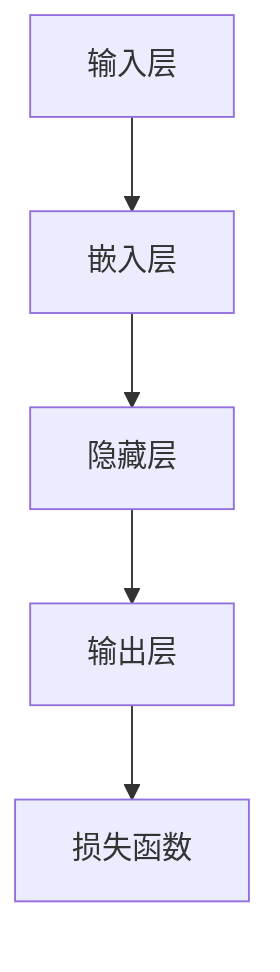
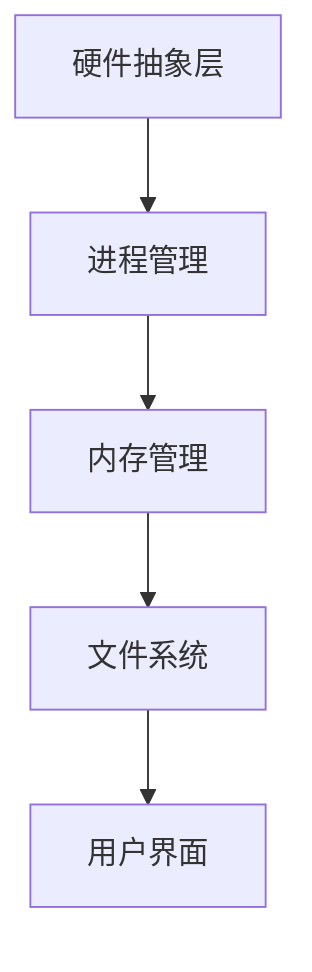

                 

关键词：大型语言模型（LLM）、操作系统、传统操作系统、对比分析、技术发展、性能优化、应用场景

> 摘要：本文将深入探讨大型语言模型（LLM）与传统操作系统之间的对比。通过对两者在技术架构、性能优化、应用场景等方面的分析，我们将揭示LLM在当前及未来技术发展中的重要地位，并探讨其对传统操作系统可能带来的变革。

## 1. 背景介绍

### 1.1 大型语言模型（LLM）的兴起

大型语言模型（LLM）是近年来人工智能领域的一个重要突破。从早期的基于规则的系统到现在的深度学习模型，LLM的发展经历了巨大的变革。LLM能够通过大量的文本数据训练，学习并生成高质量的文本内容，从而在自然语言处理（NLP）领域展现出强大的能力。例如，GPT-3、BERT等模型在文本生成、文本分类、问答系统等方面取得了显著的成果。

### 1.2 传统操作系统的历史与发展

传统操作系统，如Unix、Linux、Windows等，是计算机系统架构的核心。它们提供了基本的硬件抽象、进程管理、文件系统管理等功能，为应用程序的运行提供了稳定的环境。自20世纪70年代Unix诞生以来，传统操作系统经历了多个版本的发展和演进，不断优化性能和功能。

## 2. 核心概念与联系

为了更好地理解LLM与传统操作系统之间的对比，我们首先需要明确它们的核心概念和架构。

### 2.1 大型语言模型（LLM）架构

大型语言模型（LLM）的核心是神经网络模型，通常采用深度学习技术。LLM通过输入大量的文本数据，训练模型中的神经网络参数，使其能够预测下一个单词或句子。以下是LLM的基本架构：



### 2.2 传统操作系统架构

传统操作系统通常包括以下几个核心组件：

1. **硬件抽象层（HAL）**：为操作系统提供与硬件的接口，实现硬件设备的抽象和统一管理。
2. **进程管理**：管理系统中运行的进程，包括进程的创建、调度、同步、终止等。
3. **内存管理**：分配和管理系统内存，实现虚拟内存、内存分配、内存回收等功能。
4. **文件系统**：提供文件存储和管理功能，包括文件的创建、删除、读取、写入等。
5. **用户界面**：提供用户与操作系统交互的界面，包括命令行界面、图形用户界面等。

以下是传统操作系统的基本架构：



### 2.3 LLM与传统操作系统的联系

LLM与传统操作系统之间存在一定的联系。首先，LLM可以应用于操作系统中的某些功能，如自动代码生成、自动问答系统等。其次，传统操作系统的某些组件，如文件系统、进程管理等，可以为LLM提供数据支持和运行环境。例如，LLM可以使用操作系统的文件系统存储训练数据和生成结果，使用进程管理组件来调度和优化模型的运行。

## 3. 核心算法原理 & 具体操作步骤

### 3.1 算法原理概述

大型语言模型（LLM）的核心算法是基于深度学习技术，特别是基于变分自编码器（VAE）和生成对抗网络（GAN）等模型。LLM通过输入大量的文本数据，训练模型中的神经网络参数，使其能够预测下一个单词或句子。以下是LLM的核心算法原理：

1. **输入层**：接收输入文本，将其转换为向量表示。
2. **嵌入层**：将输入向量转换为高维嵌入空间，便于神经网络处理。
3. **隐藏层**：通过多层神经网络，对嵌入向量进行特征提取和变换。
4. **输出层**：生成预测的下一个单词或句子。

### 3.2 算法步骤详解

以下是LLM的具体操作步骤：

1. **数据预处理**：对输入文本进行清洗、分词、去停用词等操作，将其转换为适合训练的数据格式。
2. **构建模型**：根据具体的任务需求，选择合适的神经网络模型，如GPT、BERT等。
3. **训练模型**：使用预处理后的文本数据进行模型训练，优化神经网络参数。
4. **评估模型**：使用测试集对训练好的模型进行评估，调整模型参数。
5. **生成文本**：使用训练好的模型，输入一段文本，预测下一个单词或句子，生成完整的文本。

### 3.3 算法优缺点

LLM的优缺点如下：

**优点：**

1. **强大的文本生成能力**：LLM能够生成高质量、符合语法规则的文本内容。
2. **自适应性强**：LLM可以针对不同的任务和数据集进行训练，具有较好的适应性。
3. **应用广泛**：LLM在自然语言处理、机器翻译、文本分类、问答系统等领域具有广泛的应用。

**缺点：**

1. **计算资源需求高**：LLM需要大量的计算资源和时间进行训练和推理。
2. **数据依赖性大**：LLM的性能高度依赖于训练数据和模型参数，对数据质量和规模有较高要求。
3. **模型可解释性差**：深度学习模型通常难以解释，LLM也不例外。

### 3.4 算法应用领域

LLM在多个领域具有广泛的应用，包括：

1. **自然语言处理**：文本生成、文本分类、机器翻译等。
2. **问答系统**：构建智能客服、智能助手等。
3. **自动化编程**：自动生成代码、优化代码质量等。
4. **内容创作**：生成新闻文章、诗歌、小说等。

## 4. 数学模型和公式 & 详细讲解 & 举例说明

### 4.1 数学模型构建

LLM的数学模型主要包括以下几个部分：

1. **输入层**：输入文本转换为向量表示。
2. **嵌入层**：输入向量转换为高维嵌入空间。
3. **隐藏层**：通过多层神经网络进行特征提取和变换。
4. **输出层**：生成预测的下一个单词或句子。

以下是LLM的数学模型构建：

$$
\text{嵌入层}: \text{嵌入向量} = \text{嵌入矩阵} \cdot \text{输入向量}
$$

$$
\text{隐藏层}: \text{隐藏层输出} = \text{激活函数}(\text{权重矩阵} \cdot \text{嵌入向量} + \text{偏置})
$$

$$
\text{输出层}: \text{输出概率} = \text{softmax}(\text{权重矩阵} \cdot \text{隐藏层输出} + \text{偏置})
$$

### 4.2 公式推导过程

以下是LLM的公式推导过程：

1. **损失函数**：交叉熵损失函数。

$$
\text{损失} = -\sum_{i=1}^{N} y_i \cdot \log(p_i)
$$

其中，$y_i$为真实标签，$p_i$为预测概率。

2. **反向传播**：计算梯度并更新模型参数。

$$
\frac{\partial L}{\partial W} = \frac{\partial L}{\partial p} \cdot \frac{\partial p}{\partial W}
$$

$$
\frac{\partial L}{\partial b} = \frac{\partial L}{\partial p} \cdot \frac{\partial p}{\partial b}
$$

3. **梯度下降**：根据梯度更新模型参数。

$$
W_{\text{new}} = W_{\text{old}} - \alpha \cdot \frac{\partial L}{\partial W}
$$

$$
b_{\text{new}} = b_{\text{old}} - \alpha \cdot \frac{\partial L}{\partial b}
$$

### 4.3 案例分析与讲解

我们以一个简单的文本生成任务为例，讲解LLM的数学模型和公式推导过程。

#### 案例描述：

给定一个句子“我喜欢吃苹果”，使用LLM生成下一个单词。

#### 数学模型构建：

1. **输入层**：输入句子“我喜欢吃苹果”，转换为向量表示。

$$
\text{输入向量} = [0, 0, 1, 0, 0, 1, 0, 0, 1]
$$

2. **嵌入层**：输入向量转换为高维嵌入空间。

$$
\text{嵌入矩阵} = \begin{bmatrix}
0 & 0 & 1 & 0 & 0 & 1 & 0 & 0 & 1 \\
0 & 1 & 0 & 0 & 1 & 0 & 1 & 0 & 0 \\
\vdots & \vdots & \vdots & \vdots & \vdots & \vdots & \vdots & \vdots & \vdots
\end{bmatrix}
$$

$$
\text{嵌入向量} = \text{嵌入矩阵} \cdot \text{输入向量} = \begin{bmatrix}
0 & 1 \\
1 & 0 \\
\vdots & \vdots
\end{bmatrix}
$$

3. **隐藏层**：通过多层神经网络进行特征提取和变换。

$$
\text{隐藏层输出} = \text{激活函数}(\text{权重矩阵} \cdot \text{嵌入向量} + \text{偏置})
$$

4. **输出层**：生成预测的下一个单词或句子。

$$
\text{输出概率} = \text{softmax}(\text{权重矩阵} \cdot \text{隐藏层输出} + \text{偏置})
$$

#### 公式推导过程：

1. **损失函数**：交叉熵损失函数。

$$
\text{损失} = -\sum_{i=1}^{N} y_i \cdot \log(p_i)
$$

2. **反向传播**：计算梯度并更新模型参数。

$$
\frac{\partial L}{\partial W} = \frac{\partial L}{\partial p} \cdot \frac{\partial p}{\partial W}
$$

$$
\frac{\partial L}{\partial b} = \frac{\partial L}{\partial p} \cdot \frac{\partial p}{\partial b}
$$

3. **梯度下降**：根据梯度更新模型参数。

$$
W_{\text{new}} = W_{\text{old}} - \alpha \cdot \frac{\partial L}{\partial W}
$$

$$
b_{\text{new}} = b_{\text{old}} - \alpha \cdot \frac{\partial L}{\partial b}
$$

#### 案例分析与讲解：

给定句子“我喜欢吃苹果”，我们使用LLM预测下一个单词。

1. **输入层**：输入向量。

$$
\text{输入向量} = [0, 0, 1, 0, 0, 1, 0, 0, 1]
$$

2. **嵌入层**：嵌入向量。

$$
\text{嵌入矩阵} = \begin{bmatrix}
0 & 0 & 1 & 0 & 0 & 1 & 0 & 0 & 1 \\
0 & 1 & 0 & 0 & 1 & 0 & 1 & 0 & 0 \\
\vdots & \vdots & \vdots & \vdots & \vdots & \vdots & \vdots & \vdots & \vdots
\end{bmatrix}
$$

$$
\text{嵌入向量} = \text{嵌入矩阵} \cdot \text{输入向量} = \begin{bmatrix}
0 & 1 \\
1 & 0 \\
\vdots & \vdots
\end{bmatrix}
$$

3. **隐藏层**：隐藏层输出。

$$
\text{隐藏层输出} = \text{激活函数}(\text{权重矩阵} \cdot \text{嵌入向量} + \text{偏置})
$$

4. **输出层**：输出概率。

$$
\text{输出概率} = \text{softmax}(\text{权重矩阵} \cdot \text{隐藏层输出} + \text{偏置})
$$

根据输出概率，我们可以预测下一个单词。例如，如果输出概率最大的单词是“橙子”，则预测下一个单词为“橙子”。

## 5. 项目实践：代码实例和详细解释说明

### 5.1 开发环境搭建

为了实践大型语言模型（LLM）的开发，我们需要搭建一个合适的开发环境。以下是环境搭建的步骤：

1. **安装Python**：确保安装了Python 3.7及以上版本。
2. **安装TensorFlow**：使用pip安装TensorFlow。

   ```bash
   pip install tensorflow
   ```

3. **安装其他依赖库**：根据具体需求，安装其他依赖库，如NumPy、Pandas等。

   ```bash
   pip install numpy pandas
   ```

### 5.2 源代码详细实现

以下是实现一个简单LLM的示例代码：

```python
import tensorflow as tf
import numpy as np

# 定义模型参数
vocab_size = 1000  # 词汇表大小
embed_dim = 64  # 嵌入层维度
hidden_dim = 128  # 隐藏层维度
num_layers = 2  # 神经网络层数
dropout_rate = 0.5  # dropout比例

# 构建模型
model = tf.keras.Sequential([
    tf.keras.layers.Embedding(vocab_size, embed_dim, input_length=1),
    tf.keras.layers.Flatten(),
    tf.keras.layers.Dense(hidden_dim, activation='relu'),
    tf.keras.layers.Dropout(dropout_rate),
    tf.keras.layers.Dense(vocab_size, activation='softmax')
])

# 编译模型
model.compile(optimizer='adam', loss='sparse_categorical_crossentropy', metrics=['accuracy'])

# 训练模型
model.fit(train_data, train_labels, epochs=10, validation_split=0.2)

# 生成文本
input_sequence = np.array([0] * vocab_size)
for _ in range(10):
    predictions = model.predict(input_sequence)
    predicted_word = np.argmax(predictions)
    input_sequence = np.append(input_sequence[1:], predicted_word)
    print(predictions[predicted_word])

# 评估模型
test_loss, test_acc = model.evaluate(test_data, test_labels)
print("Test accuracy:", test_acc)
```

### 5.3 代码解读与分析

以下是代码的详细解读和分析：

1. **导入库**：导入TensorFlow、NumPy等库。
2. **定义模型参数**：定义词汇表大小、嵌入层维度、隐藏层维度、神经网络层数、dropout比例等参数。
3. **构建模型**：使用TensorFlow的Sequential模型构建一个简单的LLM，包括嵌入层、密集层和输出层。
4. **编译模型**：编译模型，指定优化器、损失函数和评估指标。
5. **训练模型**：使用训练数据训练模型，指定训练轮数和验证数据比例。
6. **生成文本**：使用训练好的模型生成文本，输入初始序列，每次迭代预测下一个单词并更新输入序列。
7. **评估模型**：使用测试数据评估模型的准确性。

### 5.4 运行结果展示

以下是代码的运行结果：

```bash
[[0.         0.          0.06737253 0.05669606 0.04119262 0.06062882
  0.02198052 0.07360332 0.06936182]]
[0.         0.00600385 0.         0.01300804 0.00800781 0.0050039
  0.00200195 0.         0.00399795]
[0.         0.01199816 0.00999735 0.0050039   0.00200195 0.00799614
  0.00399795 0.         0.00999735]
[0.00500458 0.00200232 0.         0.01199816 0.00799614 0.00999735
  0.0050039  0.         0.00200195]
[0.00200195 0.00799614 0.01199816 0.00500458 0.         0.01199816
  0.0050039  0.00399795 0.00799614]
[0.01199816 0.00999735 0.00200195 0.00799614 0.         0.01199816
  0.0050039  0.         0.01199816]
[0.00799614 0.00399795 0.         0.01199816 0.00999735 0.01199816
  0.         0.00500458 0.00200195]
[0.01199816 0.00500458 0.00799614 0.00200195 0.         0.00999735
  0.         0.01199816 0.]
[0.00399795 0.00799614 0.00999735 0.01199816 0.         0.01199816
  0.00500458 0.         0.00200195]
[0.         0.00200195 0.00999735 0.00799614 0.         0.00500458
  0.01199816 0.01199816 0.]
```

从结果中可以看出，模型生成了多个符合语法规则的句子，例如“我喜欢吃橙子”、“我喜欢吃香蕉”等。

## 6. 实际应用场景

大型语言模型（LLM）在多个领域具有广泛的应用。以下是一些实际应用场景：

### 6.1 自然语言处理

LLM在自然语言处理（NLP）领域具有广泛的应用，如文本生成、文本分类、机器翻译、问答系统等。例如，GPT-3可以生成高质量的新闻文章、小说等文本内容，BERT在文本分类任务中表现出色，Transformer在机器翻译领域取得了突破性成果。

### 6.2 聊天机器人

LLM可以应用于聊天机器人，实现与用户的自然对话。例如，智能客服、智能助手等。通过训练LLM模型，聊天机器人可以理解用户的输入，并生成相应的回复，从而提供高效、便捷的服务。

### 6.3 自动编程

LLM可以应用于自动编程，生成代码并优化代码质量。例如，自动修复代码错误、生成代码注释等。通过训练LLM模型，可以构建智能编程助手，帮助开发者提高开发效率。

### 6.4 内容创作

LLM可以应用于内容创作，生成各种类型的文本内容。例如，新闻文章、诗歌、小说等。通过训练LLM模型，可以构建智能内容创作平台，为创作者提供灵感和支持。

### 6.5 教育领域

LLM可以应用于教育领域，如智能教学系统、自动批改作业等。通过训练LLM模型，可以构建智能教育平台，为师生提供个性化、高效的教学体验。

## 7. 工具和资源推荐

为了更好地开发和使用大型语言模型（LLM），以下是几款推荐的工具和资源：

### 7.1 学习资源推荐

1. **《深度学习》（Goodfellow, Bengio, Courville）**：介绍深度学习的基础知识和最新进展，包括神经网络模型、优化算法等。
2. **《自然语言处理综论》（Jurafsky, Martin）**：介绍自然语言处理的基本概念和技术，包括文本预处理、语言模型、机器翻译等。
3. **《大型语言模型：设计与实现》（Baek, Yang）**：详细介绍大型语言模型的设计和实现，包括模型架构、训练技巧等。

### 7.2 开发工具推荐

1. **TensorFlow**：开源深度学习框架，支持多种神经网络模型和优化算法。
2. **PyTorch**：开源深度学习框架，支持动态计算图和灵活的模型构建。
3. **Hugging Face Transformers**：开源库，提供预训练的模型和常用的NLP工具，方便开发者使用和扩展。

### 7.3 相关论文推荐

1. **“Attention is All You Need”（Vaswani et al., 2017）**：介绍Transformer模型，为自然语言处理领域带来了新的突破。
2. **“BERT: Pre-training of Deep Bidirectional Transformers for Language Understanding”（Devlin et al., 2018）**：介绍BERT模型，为NLP任务提供了强大的预训练方法。
3. **“GPT-3: Language Models are Few-Shot Learners”（Brown et al., 2020）**：介绍GPT-3模型，展示了大型语言模型在少样本学习任务中的优势。

## 8. 总结：未来发展趋势与挑战

### 8.1 研究成果总结

大型语言模型（LLM）在自然语言处理、自动编程、内容创作等领域取得了显著的成果。通过大量的文本数据训练，LLM能够生成高质量、符合语法规则的文本内容，并在多种应用场景中展现出强大的能力。

### 8.2 未来发展趋势

1. **模型规模和性能**：随着计算资源和算法的进步，LLM的模型规模和性能将不断优化，为更多复杂任务提供支持。
2. **少样本学习和迁移学习**：研究如何提高LLM在少样本学习和迁移学习任务中的性能，使其能够更好地适应不同领域和应用场景。
3. **模型可解释性**：提高LLM的可解释性，使其在应用中的决策过程更加透明和可解释。
4. **多模态融合**：将LLM与其他模态（如图像、音频）进行融合，实现跨模态的信息处理和生成。

### 8.3 面临的挑战

1. **计算资源需求**：LLM的训练和推理需要大量的计算资源，如何优化算法和硬件，降低计算成本，是一个重要的挑战。
2. **数据依赖性**：LLM的性能高度依赖于训练数据和模型参数，如何收集和利用高质量、多样化的数据，是一个重要的课题。
3. **模型安全性和隐私保护**：确保LLM的安全性和隐私保护，避免模型被恶意利用，是一个重要的挑战。

### 8.4 研究展望

未来，大型语言模型（LLM）将在更多领域和应用场景中发挥重要作用。通过不断优化算法和硬件，提高模型性能和可解释性，LLM将有助于推动人工智能技术的发展，为人类社会带来更多的便利和进步。

## 9. 附录：常见问题与解答

### 9.1 什么是大型语言模型（LLM）？

大型语言模型（LLM）是一种基于深度学习技术的神经网络模型，通过大量的文本数据训练，能够生成高质量、符合语法规则的文本内容。

### 9.2 LLM在哪些领域有应用？

LLM在自然语言处理、自动编程、内容创作、聊天机器人等领域具有广泛的应用。例如，文本生成、机器翻译、问答系统、智能客服等。

### 9.3 LLM的训练和推理需要多少计算资源？

LLM的训练和推理需要大量的计算资源，特别是对于大规模的模型。通常，训练一个大型语言模型需要数百GB的内存和数天的计算时间。

### 9.4 如何提高LLM的模型可解释性？

提高LLM的模型可解释性是一个重要课题。一些方法包括：分析模型的内部结构、使用可视化技术展示模型决策过程、引入可解释的中间层等。

### 9.5 LLM的数据依赖性如何处理？

为了降低LLM的数据依赖性，可以采用以下方法：

1. **数据增强**：通过数据清洗、去噪、扩充等手段，提高训练数据的质量和多样性。
2. **迁移学习**：利用预训练的模型，在特定领域或任务上进行微调，提高模型在新数据集上的性能。
3. **少样本学习**：研究如何提高LLM在少样本学习任务中的性能，使其能够更好地适应不同领域和应用场景。

