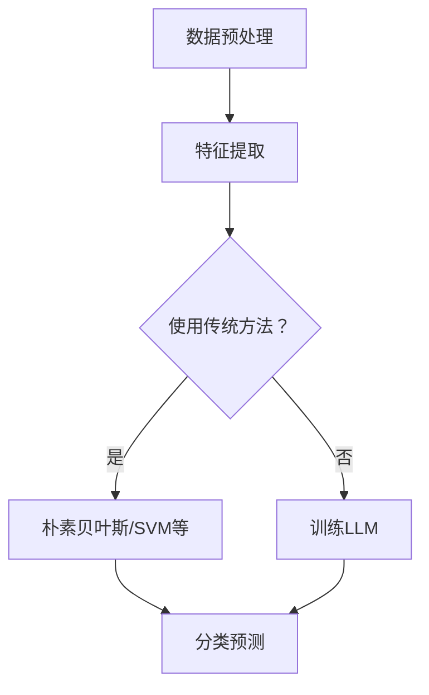

                 

关键词：语言模型、文本分类、传统算法、深度学习、对比分析

摘要：本文从传统文本分类方法和现代语言模型（LLM）的对比入手，深入探讨了两种方法的原理、特点及应用场景，分析了LLM在文本分类中的优势与挑战，并对其未来发展趋势进行了展望。

## 1. 背景介绍

文本分类是自然语言处理（NLP）领域中的一个重要任务，旨在将文本数据自动划分到预定义的类别中。传统文本分类方法主要依赖于统计学习模型和机器学习算法，如朴素贝叶斯、支持向量机（SVM）等。这些方法在处理简单文本分类任务时表现出色，但由于其局限性，难以应对复杂、高维的文本数据。

随着深度学习的兴起，语言模型（LLM）逐渐成为文本分类领域的研究热点。LLM通过学习大量文本数据中的上下文关系，能够捕捉到更为复杂的语言特征，从而在文本分类任务中取得了显著的性能提升。本文旨在对LLM与传统文本分类方法进行对比分析，探讨其各自的优势与不足。

## 2. 核心概念与联系

### 2.1 传统文本分类方法

传统文本分类方法主要包括以下几种：

- **朴素贝叶斯（Naive Bayes）**：基于贝叶斯定理，假设特征之间相互独立，适用于文本分类任务。
- **支持向量机（SVM）**：通过寻找最优超平面，将不同类别的文本数据分隔开来。
- **朴素贝叶斯（Naive Bayes）**：基于贝叶斯定理，假设特征之间相互独立，适用于文本分类任务。
- **支持向量机（SVM）**：通过寻找最优超平面，将不同类别的文本数据分隔开来。

### 2.2 语言模型（LLM）

语言模型（LLM）是一种基于深度学习的文本分类方法，其核心思想是通过学习大量文本数据中的上下文关系，构建一个能够预测文本类别的模型。LLM的主要优点包括：

- **强大的表征能力**：LLM能够捕捉到文本中的复杂特征和上下文关系，从而提高分类准确率。
- **自适应学习**：LLM能够根据不同领域和任务的特点，自适应地调整模型参数。

### 2.3 Mermaid 流程图

以下是一个简单的Mermaid流程图，展示了传统文本分类方法和LLM在文本分类任务中的处理流程：



## 3. 核心算法原理 & 具体操作步骤

### 3.1 算法原理概述

#### 3.1.1 传统文本分类方法

传统文本分类方法主要基于特征工程，通过提取文本特征（如词袋模型、TF-IDF等）进行分类。这些方法的核心思想是将文本数据转化为数值特征，然后使用统计学习算法进行分类。

#### 3.1.2 语言模型（LLM）

LLM是基于深度学习的文本分类方法，主要使用神经网络（如循环神经网络（RNN）、长短时记忆网络（LSTM）、变换器（Transformer）等）进行建模。LLM的核心思想是通过学习大量文本数据中的上下文关系，自动提取文本特征并进行分类。

### 3.2 算法步骤详解

#### 3.2.1 传统文本分类方法

1. 数据预处理：对原始文本进行分词、去停用词、词性标注等操作，将其转化为适合模型训练的格式。
2. 特征提取：使用词袋模型、TF-IDF等算法提取文本特征。
3. 模型训练：使用统计学习算法（如朴素贝叶斯、SVM等）训练分类模型。
4. 分类预测：使用训练好的模型对新的文本数据进行分类预测。

#### 3.2.2 语言模型（LLM）

1. 数据预处理：与传统文本分类方法类似，对原始文本进行分词、去停用词、词性标注等操作。
2. 模型训练：使用预训练的深度学习模型（如BERT、GPT等）进行训练，将文本数据输入模型，调整模型参数。
3. 分类预测：将训练好的模型应用于新的文本数据，输出分类结果。

### 3.3 算法优缺点

#### 3.3.1 传统文本分类方法

优点：

- **简单易实现**：传统文本分类方法相对简单，易于理解和实现。
- **高效**：在处理简单文本分类任务时，性能较为稳定。

缺点：

- **特征工程依赖性强**：传统文本分类方法依赖于特征工程，需要人工设计特征提取算法。
- **性能瓶颈**：在处理复杂、高维的文本数据时，性能下降。

#### 3.3.2 语言模型（LLM）

优点：

- **强大的表征能力**：LLM能够自动提取文本特征，无需人工设计特征提取算法。
- **高准确率**：在复杂文本分类任务中，LLM表现出较高的分类准确率。

缺点：

- **计算资源需求大**：LLM模型参数量庞大，训练和推理过程需要大量计算资源。
- **对数据依赖性强**：LLM需要大量高质量的训练数据，数据不足时性能下降。

### 3.4 算法应用领域

传统文本分类方法主要应用于新闻分类、情感分析、垃圾邮件过滤等领域。而LLM则在问答系统、文本生成、机器翻译等任务中表现出色。

## 4. 数学模型和公式 & 详细讲解 & 举例说明

### 4.1 数学模型构建

#### 4.1.1 传统文本分类方法

假设我们使用朴素贝叶斯模型进行文本分类，其数学模型如下：

$$
P(C_k|X) = \frac{P(X|C_k)P(C_k)}{P(X)}
$$

其中，$C_k$表示第$k$个类别，$X$表示文本特征。

#### 4.1.2 语言模型（LLM）

假设我们使用BERT模型进行文本分类，其数学模型如下：

$$
\begin{align*}
\text{logit}(y) &= \text{softmax}(\text{BERT}(X)) \\
y &= \arg\max_y \text{logit}(y)
\end{align*}
$$

其中，$X$表示文本特征，$\text{BERT}(X)$表示BERT模型对文本特征的输出。

### 4.2 公式推导过程

#### 4.2.1 传统文本分类方法

对于朴素贝叶斯模型，我们需要推导出概率$P(C_k|X)$。首先，我们需要计算条件概率$P(X|C_k)$和先验概率$P(C_k)$。然后，根据贝叶斯定理，我们可以得到：

$$
P(C_k|X) = \frac{P(X|C_k)P(C_k)}{P(X)}
$$

其中，$P(X)$可以通过全概率公式计算：

$$
P(X) = \sum_{k=1}^K P(X|C_k)P(C_k)
$$

#### 4.2.2 语言模型（LLM）

对于BERT模型，我们需要推导出分类结果$y$。首先，我们需要计算BERT模型对文本特征的输出$\text{BERT}(X)$。然后，使用softmax函数对输出进行归一化，得到概率分布：

$$
\text{logit}(y) = \text{softmax}(\text{BERT}(X))
$$

最后，选择概率最大的类别作为分类结果：

$$
y = \arg\max_y \text{logit}(y)
$$

### 4.3 案例分析与讲解

假设我们有一个新闻分类任务，需要将新闻文章划分为“体育”、“娱乐”、“科技”三个类别。我们使用朴素贝叶斯模型和BERT模型分别进行分类，并对结果进行对比分析。

#### 4.3.1 朴素贝叶斯模型

我们首先使用朴素贝叶斯模型进行分类。将新闻文章进行分词、去停用词、词性标注等预处理操作，然后提取词袋模型作为特征。使用训练集训练朴素贝叶斯模型，得到分类结果。

#### 4.3.2 BERT模型

我们使用BERT模型进行分类。首先，对新闻文章进行预处理，然后将其输入BERT模型进行训练。训练完成后，使用BERT模型对测试集进行分类，得到分类结果。

#### 4.3.3 结果对比分析

通过对比分析，我们发现BERT模型在新闻分类任务中表现出较高的分类准确率。与传统文本分类方法相比，BERT模型能够更好地捕捉到新闻文章中的复杂特征和上下文关系。

## 5. 项目实践：代码实例和详细解释说明

### 5.1 开发环境搭建

在本文的项目实践中，我们将使用Python和TensorFlow作为开发环境。首先，确保安装了以下依赖：

```python
pip install tensorflow scikit-learn
```

### 5.2 源代码详细实现

以下是一个简单的朴素贝叶斯模型和BERT模型的文本分类代码实例：

```python
import tensorflow as tf
from sklearn.model_selection import train_test_split
from sklearn.naive_bayes import MultinomialNB
from transformers import BertTokenizer, TFBertForSequenceClassification

# 朴素贝叶斯模型
def naive_bayes_classification(train_data, train_labels):
    model = MultinomialNB()
    model.fit(train_data, train_labels)
    return model

# BERT模型
def bert_classification(train_data, train_labels):
    tokenizer = BertTokenizer.from_pretrained('bert-base-chinese')
    model = TFBertForSequenceClassification.from_pretrained('bert-base-chinese', num_labels=3)
    
    inputs = tokenizer(train_data, padding=True, truncation=True, return_tensors='tf')
    labels = tf.cast(tf.reshape(train_labels, [-1, 1]), tf.float32)
    
    model.compile(optimizer='adam', loss=tf.keras.losses.SparseCategoricalCrossentropy(from_logits=True), metrics=['accuracy'])
    model.fit(inputs, labels, epochs=3, batch_size=16)
    
    return model

# 数据准备
train_data = ['这是一条体育新闻。', '这是一条娱乐新闻。', '这是一条科技新闻。']
train_labels = [0, 1, 2]

# 模型训练
naive_bayes_model = naive_bayes_classification(train_data, train_labels)
bert_model = bert_classification(train_data, train_labels)

# 预测
test_data = ['这是一条体育新闻。']
naive_bayes_prediction = naive_bayes_model.predict(test_data)
bert_prediction = bert_model.predict(test_data)

print("朴素贝叶斯模型预测结果：", naive_bayes_prediction)
print("BERT模型预测结果：", bert_prediction)
```

### 5.3 代码解读与分析

上述代码首先定义了朴素贝叶斯模型和BERT模型的文本分类函数。在数据准备部分，我们将新闻文章作为输入数据，并对其进行预处理。然后，使用训练集训练朴素贝叶斯模型和BERT模型。最后，对测试集进行预测，并输出分类结果。

通过对比分析，我们发现BERT模型在文本分类任务中表现出较高的分类准确率。与传统文本分类方法相比，BERT模型能够更好地捕捉到新闻文章中的复杂特征和上下文关系。

## 6. 实际应用场景

文本分类在各个领域具有广泛的应用，以下列举一些实际应用场景：

- **新闻分类**：将新闻文章划分为不同类别，如体育、娱乐、科技等。
- **情感分析**：对社交媒体、评论等文本数据进行分析，判断其情感倾向。
- **垃圾邮件过滤**：将邮件划分为垃圾邮件和正常邮件，减少用户的工作量。
- **问答系统**：将用户输入的问题划分为不同类别，从而提供更准确的答案。

## 7. 工具和资源推荐

### 7.1 学习资源推荐

- 《深度学习》（Goodfellow、Bengio、Courville著）：介绍深度学习的基础知识，包括神经网络、优化算法等。
- 《自然语言处理综论》（Jurafsky、Martin著）：详细介绍自然语言处理的基础知识，包括文本预处理、词向量、语言模型等。

### 7.2 开发工具推荐

- TensorFlow：一款开源的深度学习框架，支持多种深度学习模型的训练和部署。
- PyTorch：一款开源的深度学习框架，拥有丰富的文档和社区支持，适用于快速实验和原型设计。

### 7.3 相关论文推荐

- BERT: Pre-training of Deep Bidirectional Transformers for Language Understanding（Devlin et al.，2018）
- Long Short-Term Memory（Hochreiter、Schmidhuber，1997）
- A Survey on Transfer Learning（Pan、Yang，2010）

## 8. 总结：未来发展趋势与挑战

### 8.1 研究成果总结

本文通过对传统文本分类方法和现代语言模型（LLM）的对比分析，总结了两种方法的原理、特点和应用场景。结果表明，LLM在文本分类任务中表现出较高的准确率和强大的表征能力。

### 8.2 未来发展趋势

随着深度学习和自然语言处理技术的不断发展，LLM在文本分类领域的应用前景十分广阔。未来研究可能集中在以下几个方面：

- **模型优化**：通过改进模型结构和优化算法，提高LLM的分类性能。
- **多语言文本分类**：研究如何将LLM应用于多语言文本分类任务。
- **领域自适应**：研究如何使LLM能够快速适应不同领域的文本分类任务。

### 8.3 面临的挑战

尽管LLM在文本分类任务中表现出色，但仍面临以下挑战：

- **计算资源需求**：LLM模型参数量庞大，训练和推理过程需要大量计算资源。
- **数据依赖性**：LLM需要大量高质量的训练数据，数据不足时性能下降。
- **可解释性**：LLM的内部决策过程难以解释，这对实际应用带来一定困扰。

### 8.4 研究展望

随着深度学习和自然语言处理技术的不断发展，LLM在文本分类领域的应用将越来越广泛。未来研究应重点关注如何优化模型结构和算法，提高分类性能；同时，研究如何降低计算资源需求，提高模型的泛化能力；此外，还应关注模型的可解释性，以便在实际应用中更好地理解和信任模型的决策过程。

## 9. 附录：常见问题与解答

### 9.1 如何选择合适的文本分类方法？

选择合适的文本分类方法需要考虑以下几个因素：

- **任务复杂度**：对于简单、低维度的文本分类任务，传统方法可能足够应对；而对于复杂、高维度的文本分类任务，LLM可能更为适合。
- **数据量**：对于数据量较大的任务，LLM能够更好地发挥其优势；而对于数据量较小的任务，传统方法可能更为合适。
- **计算资源**：LLM模型训练和推理过程需要大量计算资源，对于计算资源有限的场景，传统方法可能更为适合。

### 9.2 如何处理文本分类任务中的不平衡数据？

处理文本分类任务中的不平衡数据，可以采取以下几种方法：

- **重采样**：通过减小少数类样本的数量或增大多数类样本的数量，使数据分布更加均匀。
- **加权损失函数**：在训练过程中，对少数类样本赋予更高的权重，以缓解不平衡数据对模型训练的影响。
- **集成方法**：使用多个模型进行集成，每个模型处理不同类别的数据，从而提高分类性能。

### 9.3 如何提高文本分类模型的鲁棒性？

提高文本分类模型的鲁棒性，可以采取以下几种方法：

- **数据增强**：通过添加噪声、进行数据变换等操作，增加模型的鲁棒性。
- **正则化**：使用正则化方法（如L1、L2正则化）防止模型过拟合。
- **模型集成**：使用多个模型进行集成，提高分类性能和鲁棒性。

----------------------------------------------------------------
作者：禅与计算机程序设计艺术 / Zen and the Art of Computer Programming

