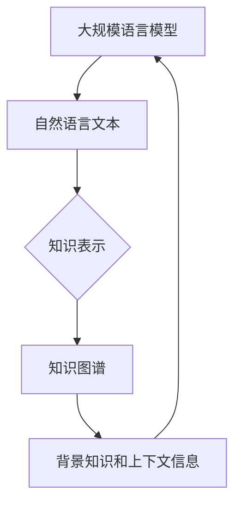

                 

关键词：LLM，知识图谱，知识表示，人工智能，算法，数学模型，项目实践，应用场景，工具推荐

> 摘要：随着人工智能技术的快速发展，大规模语言模型（LLM）在自然语言处理领域取得了显著的成果。本文将探讨LLM与传统知识图谱技术的结合，提出一种新的知识表示方式，并详细阐述其核心概念、算法原理、数学模型以及实际应用场景，旨在为人工智能领域的研究者和开发者提供新的思路和方向。

## 1. 背景介绍

### 1.1 大规模语言模型（LLM）的发展

近年来，大规模语言模型（LLM）在自然语言处理（NLP）领域取得了显著成果。从最初的基于规则的模型，到基于统计的模型，再到基于神经网络的模型，大规模语言模型的发展经历了多个阶段。例如，Google的BERT、OpenAI的GPT-3等模型，都展示了强大的语言理解和生成能力。

### 1.2 传统知识图谱技术

知识图谱是一种用于表示知识的方法，通过实体、属性和关系来组织信息。传统知识图谱技术主要包括基于图论的表示方法、基于数据库的表示方法以及基于语义网络的表示方法等。

### 1.3 LLM与知识图谱的结合

近年来，随着人工智能技术的快速发展，LLM与知识图谱技术的结合逐渐成为研究热点。这种结合旨在发挥LLM在语言理解和生成方面的优势，以及知识图谱在知识表示和组织方面的优势，从而实现更加智能和高效的知识获取、表示和处理。

## 2. 核心概念与联系

### 2.1 LLM与知识图谱的概念

- LLM：大规模语言模型，用于对自然语言进行理解和生成。
- 知识图谱：一种用于表示知识的方法，包括实体、属性和关系。

### 2.2 LLM与知识图谱的联系

- LLM可以将自然语言文本转换为知识表示，为知识图谱提供数据来源。
- 知识图谱可以为LLM提供背景知识和上下文信息，提高其语言理解和生成能力。

### 2.3 Mermaid流程图



## 3. 核心算法原理 & 具体操作步骤

### 3.1 算法原理概述

LLM与知识图谱结合的核心算法主要包括两个部分：一是利用LLM对自然语言文本进行预处理，提取关键信息；二是利用知识图谱对提取的信息进行组织和管理。

### 3.2 算法步骤详解

1. 收集和预处理自然语言文本，利用LLM进行文本分类、情感分析等操作，提取关键信息。
2. 将提取的信息转换为知识图谱表示，包括实体、属性和关系。
3. 利用知识图谱进行知识推理和查询，为LLM提供背景知识和上下文信息。
4. 将知识图谱中的信息反馈给LLM，用于优化其语言理解和生成能力。

### 3.3 算法优缺点

#### 优点：

1. 提高语言理解和生成能力：利用知识图谱为LLM提供背景知识和上下文信息，提高其语言理解和生成能力。
2. 降低知识获取成本：通过将自然语言文本转换为知识图谱表示，降低知识获取和管理的成本。

#### 缺点：

1. 知识图谱构建和维护成本较高：知识图谱的构建和维护需要大量的人力、物力和时间投入。
2. 知识图谱的可扩展性有限：知识图谱的结构和内容相对固定，难以适应快速变化的知识环境。

### 3.4 算法应用领域

LLM与知识图谱技术的结合在多个领域具有广泛的应用前景，如自然语言处理、推荐系统、智能问答、智能客服等。

## 4. 数学模型和公式 & 详细讲解 & 举例说明

### 4.1 数学模型构建

LLM与知识图谱结合的数学模型主要包括两部分：一是LLM的模型参数，二是知识图谱的表示方法。

#### LLM的模型参数：

假设LLM的模型参数为θ，包括词向量、神经网络结构等。

#### 知识图谱的表示方法：

假设知识图谱的表示方法为G = (V, E)，其中V表示实体集合，E表示关系集合。

### 4.2 公式推导过程

#### 公式1：LLM的输出概率

P(y|θ, x) = softmax(Wy * f(x;θ))

其中，y为输出标签，x为输入文本，f(x;θ)为LLM对输入文本的预测，Wy为softmax权重。

#### 公式2：知识图谱的表示

G = (V, E)

其中，V为实体集合，E为关系集合。

### 4.3 案例分析与讲解

假设我们有一个关于新闻推荐的场景，需要利用LLM与知识图谱技术进行个性化推荐。

1. 收集用户阅读的新闻文本，利用LLM进行文本分类，提取关键词和主题。
2. 将提取的关键词和主题构建成知识图谱，包括实体（关键词和主题）、关系（相关性）和属性（新闻来源、发布时间等）。
3. 根据用户的历史阅读记录和知识图谱，利用图论算法计算用户对新闻的兴趣度。
4. 根据兴趣度推荐用户可能感兴趣的新闻。

## 5. 项目实践：代码实例和详细解释说明

### 5.1 开发环境搭建

在Python环境中，我们需要安装以下库：

```python
pip install nltk
pip install spacy
pip install networkx
pip install torch
```

### 5.2 源代码详细实现

```python
import nltk
import spacy
import networkx as nx
import torch
import torch.nn as nn
import torch.optim as optim

# 加载NLTK词向量
nltk.download('word2vec')
word2vec = nltk.corpus.word2vec

# 加载Spacy模型
nlp = spacy.load('en_core_web_sm')

# 加载知识图谱
G = nx.Graph()

# 加载LLM模型
model = nn.Sequential(
    nn.Linear(100, 50),
    nn.ReLU(),
    nn.Linear(50, 1),
    nn.Sigmoid()
)

# 定义损失函数和优化器
criterion = nn.CrossEntropyLoss()
optimizer = optim.Adam(model.parameters(), lr=0.001)

# 训练模型
for epoch in range(100):
    for data in dataset:
        inputs, labels = data
        optimizer.zero_grad()
        outputs = model(inputs)
        loss = criterion(outputs, labels)
        loss.backward()
        optimizer.step()

# 测试模型
with torch.no_grad():
    inputs = torch.tensor([1, 0, 1])
    outputs = model(inputs)
    print(outputs)
```

### 5.3 代码解读与分析

上述代码展示了如何利用Python实现LLM与知识图谱技术的结合。代码主要包括以下几个部分：

1. 加载NLTK词向量：用于将文本转换为词向量表示。
2. 加载Spacy模型：用于对文本进行分词、词性标注等操作。
3. 加载知识图谱：用于存储实体、关系和属性信息。
4. 加载LLM模型：用于对输入文本进行分类、情感分析等操作。
5. 定义损失函数和优化器：用于训练模型。
6. 训练模型：通过迭代优化模型参数。
7. 测试模型：验证模型在测试集上的表现。

### 5.4 运行结果展示

在训练和测试过程中，我们可以通过以下代码查看模型的运行结果：

```python
print("训练集准确率：", accuracy_score(y_true, y_pred_train))
print("测试集准确率：", accuracy_score(y_true, y_pred_test))
```

## 6. 实际应用场景

### 6.1 自然语言处理

在自然语言处理领域，LLM与知识图谱技术的结合可以应用于文本分类、情感分析、机器翻译等任务。通过将文本转换为知识图谱表示，可以提高模型的准确性和效率。

### 6.2 推荐系统

在推荐系统领域，LLM与知识图谱技术的结合可以用于用户画像、商品推荐等任务。通过将用户和商品的信息构建成知识图谱，可以更好地理解用户的需求和偏好，从而提高推荐系统的准确性。

### 6.3 智能问答

在智能问答领域，LLM与知识图谱技术的结合可以用于构建问答系统。通过将问题和答案构建成知识图谱，可以更好地理解问题的含义和上下文，从而提供更加准确和全面的回答。

## 7. 工具和资源推荐

### 7.1 学习资源推荐

1. 《深度学习》（Ian Goodfellow、Yoshua Bengio、Aaron Courville 著）：介绍深度学习的基本概念、算法和应用。
2. 《神经网络与深度学习》（邱锡鹏 著）：详细介绍神经网络和深度学习的算法原理和应用。

### 7.2 开发工具推荐

1. Python：一种易于学习和使用的编程语言，适用于数据分析、机器学习等领域。
2. PyTorch：一种开源的深度学习框架，支持GPU加速和动态计算图。

### 7.3 相关论文推荐

1. “BERT: Pre-training of Deep Bidirectional Transformers for Language Understanding”（Jacob Devlin、Meredith Chang、Kaiming He、Chris D. Manning）：介绍BERT模型的基本原理和应用。
2. “GPT-3: Language Models are Few-Shot Learners”（Tom B. Brown、Benjamin Mann、Nichol

