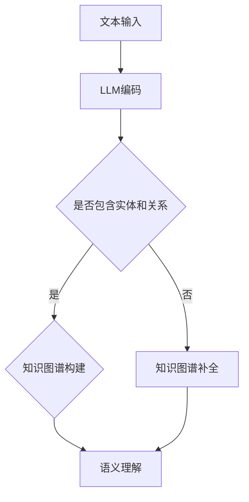

                 

关键词：Large Language Model（LLM），知识图谱，知识表示，人工智能，图数据库，语义理解，数据处理，自然语言处理

## 摘要

本文旨在探讨大型语言模型（LLM）与传统知识图谱技术的结合及其对知识表示方式的变革。随着人工智能技术的快速发展，LLM 在自然语言处理领域取得了显著的成就，而知识图谱作为一种重要的知识表示方式，在语义理解和知识推理中发挥着关键作用。本文将从背景介绍、核心概念与联系、核心算法原理与具体操作步骤、数学模型与公式、项目实践、实际应用场景、未来应用展望、工具和资源推荐、总结与展望等方面，全面剖析 LLM 与知识图谱技术的结合及其所带来的新方式。

## 1. 背景介绍

在过去的几十年里，人工智能技术取得了飞速发展。其中，自然语言处理（NLP）作为人工智能的重要分支，在信息检索、问答系统、机器翻译、文本分类等方面取得了显著成果。然而，随着数据的爆炸式增长和复杂性的增加，传统的 NLP 技术已经难以满足人们日益增长的需求。为了更好地理解和处理人类语言，研究人员开始将目光投向知识表示技术。

知识表示技术旨在将人类知识转化为计算机可理解和处理的形式，从而实现知识的自动化获取、存储、处理和推理。知识图谱作为一种重要的知识表示方式，通过将知识以图结构进行组织，可以有效地表示知识之间的复杂关系，从而实现高效的语义理解和推理。

与此同时，大型语言模型（LLM）如 GPT、BERT 等在自然语言处理领域取得了显著的成果。这些模型具有强大的语言理解能力和生成能力，可以生成高质量的自然语言文本，从而在一定程度上解决了传统 NLP 技术的瓶颈。

本文旨在探讨 LLM 与传统知识图谱技术的结合，以实现更高效、更准确的语义理解和推理。通过将 LLM 与知识图谱相结合，我们可以在一定程度上克服现有技术的局限性，为人工智能领域的发展带来新的机遇。

## 2. 核心概念与联系

### 2.1 大型语言模型（LLM）

大型语言模型（LLM）是一种基于深度学习技术的语言模型，通过学习大量的文本数据，可以生成高质量的自然语言文本。LLM 的核心是 Transformer 模型，它由编码器和解码器两部分组成。编码器负责将输入的文本编码为向量，解码器则负责将编码后的向量解码为输出文本。

LLM 的主要特点包括：

1. 强大的语言理解能力：LLM 可以理解输入文本的语义和上下文信息，从而生成语义上合理、连贯的文本。
2. 高质量的文本生成：LLM 可以根据输入的文本生成高质量、多样化的文本，从而实现文本生成任务，如图像描述生成、机器翻译、问答系统等。

### 2.2 知识图谱

知识图谱是一种用于表示实体及其关系的图形结构，通过将实体和关系表示为图节点和边，可以有效地表示知识之间的复杂关系。知识图谱在语义理解和知识推理中发挥着关键作用，其主要特点包括：

1. 高效的语义理解：知识图谱可以有效地表示实体和实体之间的关系，从而实现高效的语义理解。
2. 灵活的知识推理：知识图谱可以通过图算法进行知识推理，从而发现新的知识关系和规律。

### 2.3 LLM 与知识图谱的联系

LLM 与知识图谱在知识表示和语义理解方面具有紧密的联系。具体来说：

1. **知识获取**：LLM 可以通过学习大量的文本数据，自动获取并嵌入实体和关系的信息。这些信息可以用于知识图谱的构建，从而实现知识的自动化获取。
2. **语义理解**：LLM 可以理解输入文本的语义和上下文信息，从而为知识图谱中的实体和关系提供语义支持，提高语义理解的准确性。
3. **知识推理**：知识图谱可以通过图算法进行知识推理，而 LLM 可以生成高质量的文本，从而为知识推理提供新的思路和手段。

### 2.4 Mermaid 流程图

为了更直观地展示 LLM 与知识图谱的联系，我们使用 Mermaid 流程图来表示整个知识表示和语义理解的过程。具体流程如下：



在该流程图中，文本输入经过 LLM 编码后，会判断是否包含实体和关系。如果包含，则直接进入知识图谱构建阶段；如果不包含，则先进行知识图谱补全，然后再进行语义理解。

## 3. 核心算法原理 & 具体操作步骤

### 3.1 算法原理概述

LLM 与知识图谱技术的结合主要通过以下三个步骤实现：

1. **文本编码**：使用 LLM 对输入文本进行编码，将文本表示为向量。
2. **知识图谱构建**：根据编码后的文本向量，构建知识图谱，表示实体和关系。
3. **语义理解与推理**：利用知识图谱和 LLM，实现语义理解和推理。

### 3.2 算法步骤详解

#### 3.2.1 文本编码

文本编码是 LLM 与知识图谱技术结合的第一步。具体步骤如下：

1. **文本预处理**：对输入文本进行预处理，包括分词、词性标注、去停用词等操作。
2. **向量表示**：使用 LLM 对预处理后的文本进行编码，将文本表示为向量。常见的编码方法包括 BERT、GPT 等。

#### 3.2.2 知识图谱构建

知识图谱构建是基于编码后的文本向量，将实体和关系表示为图节点和边。具体步骤如下：

1. **实体提取**：从编码后的文本向量中提取实体，包括人、地点、组织、事件等。
2. **关系提取**：从编码后的文本向量中提取实体之间的关系，包括因果、归属、参与等。
3. **图构建**：将提取出的实体和关系构建为知识图谱，表示为图节点和边。

#### 3.2.3 语义理解与推理

语义理解与推理是基于知识图谱和 LLM，实现语义理解和推理。具体步骤如下：

1. **实体分类**：使用 LLM 对知识图谱中的实体进行分类，识别实体的类型。
2. **关系分类**：使用 LLM 对知识图谱中的关系进行分类，识别关系的类型。
3. **知识推理**：使用图算法对知识图谱进行推理，发现新的知识关系和规律。

### 3.3 算法优缺点

#### 优点

1. **高效的知识表示**：通过 LLM 和知识图谱的结合，可以实现高效的知识表示，提高语义理解和推理的准确性。
2. **灵活的语义理解**：LLM 可以理解输入文本的语义和上下文信息，从而为知识图谱中的实体和关系提供语义支持，提高语义理解的准确性。
3. **丰富的知识推理**：知识图谱可以通过图算法进行知识推理，而 LLM 可以生成高质量的文本，从而为知识推理提供新的思路和手段。

#### 缺点

1. **计算资源消耗**：LLM 和知识图谱的结合需要大量的计算资源，对硬件设备要求较高。
2. **数据依赖性**：LLM 的训练和知识图谱的构建依赖于大量的文本数据，数据质量对最终结果有很大影响。

### 3.4 算法应用领域

LLM 与知识图谱技术的结合在多个领域具有广泛的应用前景：

1. **自然语言处理**：如问答系统、文本分类、情感分析等。
2. **智能推荐系统**：如基于知识图谱的个性化推荐、商品推荐等。
3. **智能助手**：如智能家居、智能客服等。
4. **生物信息学**：如基因分析、药物研发等。
5. **社会网络分析**：如社交网络挖掘、社区发现等。

## 4. 数学模型和公式 & 详细讲解 & 举例说明

### 4.1 数学模型构建

在 LLM 与知识图谱技术的结合中，主要涉及以下数学模型：

1. **文本编码模型**：如 BERT、GPT 等。
2. **知识图谱模型**：如图卷积网络（GCN）等。
3. **语义理解模型**：如序列标注模型、实体识别模型等。

#### 4.1.1 文本编码模型

文本编码模型的主要任务是学习一个编码器，将输入文本编码为向量。以 BERT 模型为例，其数学模型如下：

$$
\text{编码器}:\text{BERT}(\text{x}) = \text{Embedding}(\text{x}) + \text{Positional Encoding}(\text{x}) + \text{Transformer}(\text{Embedding}(\text{x}) + \text{Positional Encoding}(\text{x}))
$$

其中，$\text{x}$ 表示输入文本，$\text{Embedding}(\text{x})$ 表示词向量编码，$\text{Positional Encoding}(\text{x})$ 表示位置编码，$\text{Transformer}(\text{Embedding}(\text{x}) + \text{Positional Encoding}(\text{x}))$ 表示 Transformer 编码器。

#### 4.1.2 知识图谱模型

知识图谱模型的主要任务是学习一个图卷积网络（GCN），对知识图谱进行编码。以 GCN 模型为例，其数学模型如下：

$$
h_{k}^{(l)} = \sigma \left( \sum_{i \in \mathcal{N}(j)} W_{ij} h_{i}^{(l-1)} + b_{j}^{(l)} \right)
$$

其中，$h_{j}^{(l)}$ 表示第 $l$ 层第 $j$ 个节点的特征表示，$\mathcal{N}(j)$ 表示与节点 $j$ 相邻的节点集合，$W_{ij}$ 表示节点 $i$ 到节点 $j$ 的边权重，$b_{j}^{(l)}$ 表示节点 $j$ 的偏置。

#### 4.1.3 语义理解模型

语义理解模型的主要任务是识别实体和关系。以序列标注模型为例，其数学模型如下：

$$
P(y_{i} = c | x, h_{i-1}) = \frac{\exp(\text{scores}_{i,c})}{\sum_{c' \in \text{Vocabulary}} \exp(\text{scores}_{i,c'})}
$$

其中，$y_{i}$ 表示第 $i$ 个词的标签，$c$ 表示标签集合中的某个标签，$x$ 表示输入序列，$h_{i-1}$ 表示第 $i$ 个词的上下文信息，$\text{scores}_{i,c}$ 表示第 $i$ 个词属于标签 $c$ 的分数。

### 4.2 公式推导过程

#### 4.2.1 BERT 模型

BERT 模型的公式推导主要涉及词向量编码、位置编码和 Transformer 编码器的推导。

1. **词向量编码**：

$$
\text{Embedding}(\text{x}) = \text{Word Embedding} + \text{Segment Embedding} + \text{Position Embedding}
$$

其中，$\text{Word Embedding}$ 表示词向量，$\text{Segment Embedding}$ 表示句子级嵌入，$\text{Position Embedding}$ 表示位置级嵌入。

2. **位置编码**：

$$
\text{Positional Encoding}(\text{x}) = \text{sin}( (\text{pos} - 1) / \text{dim} ) / \text{sqrt}(\text{dim}) + \text{cos}( (\text{pos} - 1) / \text{dim} ) / \text{sqrt}(\text{dim})
$$

其中，$\text{pos}$ 表示位置索引，$\text{dim}$ 表示嵌入维度。

3. **Transformer 编码器**：

$$
\text{Transformer}(\text{Embedding}(\text{x}) + \text{Positional Encoding}(\text{x})) = \text{Multi-Head Self-Attention}(\text{Embedding}(\text{x}) + \text{Positional Encoding}(\text{x})) + \text{Feed Forward Network}(\text{Embedding}(\text{x}) + \text{Positional Encoding}(\text{x}))
$$

其中，$\text{Multi-Head Self-Attention}$ 表示多头自注意力机制，$\text{Feed Forward Network}$ 表示前馈神经网络。

#### 4.2.2 图卷积网络（GCN）

GCN 的公式推导主要涉及图卷积操作的推导。

1. **图卷积操作**：

$$
h_{k}^{(l)} = \sigma \left( \sum_{i \in \mathcal{N}(j)} W_{ij} h_{i}^{(l-1)} + b_{j}^{(l)} \right)
$$

其中，$W_{ij}$ 表示边权重，$b_{j}^{(l)}$ 表示节点 $j$ 的偏置。

2. **多层 GCN**：

$$
h_{k}^{(L)} = \sigma \left( \sum_{l=1}^{L-1} \sum_{i \in \mathcal{N}(j)} W_{ij}^{(l)} h_{i}^{(l-1)} + b_{j}^{(L)} \right)
$$

其中，$W_{ij}^{(l)}$ 表示第 $l$ 层的权重。

### 4.3 案例分析与讲解

#### 4.3.1 案例背景

假设我们有一个问答系统，用户输入一个关于生物领域的问题，如“基因是什么？”我们需要使用 LLM 与知识图谱技术来回答这个问题。

#### 4.3.2 案例分析

1. **文本编码**：

   使用 BERT 模型对用户输入的文本进行编码，得到一个高维向量表示。

2. **知识图谱构建**：

   根据编码后的向量，构建一个包含生物领域实体的知识图谱，如“基因”、“DNA”、“RNA”等。

3. **语义理解与推理**：

   利用知识图谱中的实体和关系，对问题进行语义理解，找到与“基因”相关的信息。

   例如，我们可以在知识图谱中找到以下信息：

   - 基因是一种 DNA 序列。
   - DNA 是生物体的遗传物质。
   - RNA 是基因的一种转录产物。

   根据这些信息，我们可以回答用户的问题：“基因是一种 DNA 序列，它是生物体的遗传物质，可以转录成 RNA。”

#### 4.3.3 案例讲解

1. **文本编码**：

   在这个案例中，我们使用 BERT 模型对用户输入的文本进行编码。BERT 模型首先对文本进行预处理，包括分词、词性标注等操作。然后，BERT 模型对预处理后的文本进行编码，得到一个高维向量表示。这个向量包含了文本的语义信息，为后续的知识图谱构建和语义理解提供了基础。

2. **知识图谱构建**：

   基于编码后的向量，我们构建了一个包含生物领域实体的知识图谱。在这个知识图谱中，我们表示了“基因”、“DNA”、“RNA”等实体及其关系。例如，我们表示“基因”是一个 DNA 序列，而“DNA”是生物体的遗传物质，同时“RNA”是基因的一种转录产物。

3. **语义理解与推理**：

   利用知识图谱中的实体和关系，我们对用户的问题进行语义理解。在这个过程中，我们首先找到与“基因”相关的实体和关系，如“DNA”和“RNA”。然后，我们根据这些信息进行推理，回答用户的问题。在这个案例中，我们回答了用户关于基因的基本概念，如基因是一种 DNA 序列，它是生物体的遗传物质，可以转录成 RNA。

## 5. 项目实践：代码实例和详细解释说明

在本节中，我们将通过一个实际项目实践，详细介绍如何使用 LLM 与知识图谱技术实现问答系统。我们将使用 Python 和相关库来构建整个项目。

### 5.1 开发环境搭建

在开始项目之前，我们需要搭建一个合适的开发环境。以下是我们推荐的开发环境：

- Python 3.8+
- PyTorch 1.10+
- Transformers 4.7.0+
- Graph databases (如 Neo4j)

安装所需库：

```bash
pip install torch transformers
pip install py2neo # Neo4j 图数据库的 Python 驱动
```

### 5.2 源代码详细实现

#### 5.2.1 文本编码

首先，我们需要使用 BERT 模型对用户输入的文本进行编码。以下是一个简单的示例：

```python
from transformers import BertTokenizer, BertModel

# 初始化 BERT 分词器和模型
tokenizer = BertTokenizer.from_pretrained("bert-base-uncased")
model = BertModel.from_pretrained("bert-base-uncased")

# 用户输入文本
input_text = "What is a gene?"

# 对文本进行编码
encoded_input = tokenizer(input_text, return_tensors="pt")

# 获取编码后的文本向量
with torch.no_grad():
    output = model(**encoded_input)
    encoded_vector = output.last_hidden_state[:, 0, :]
```

在这个示例中，我们首先初始化 BERT 分词器和模型。然后，我们将用户输入的文本进行编码，并获取编码后的文本向量。

#### 5.2.2 知识图谱构建

接下来，我们需要构建一个知识图谱，包含生物领域的主要实体和关系。我们将使用 Neo4j 作为图数据库，并使用 Py2Neo 驱动程序来连接和操作数据库。

```python
from py2neo import Graph

# 连接到 Neo4j 图数据库
graph = Graph("bolt://localhost:7687", auth=("neo4j", "password"))

# 创建实体和关系
def create_entity(entity_name, entity_type):
    graph.run("""
        CREATE (e:Entity {
            name: $entity_name,
            type: $entity_type
        })
    """, entity_name=entity_name, entity_type=entity_type)

def create_relation(entity1_name, entity2_name, relation_type):
    graph.run("""
        MATCH (e1:Entity {name: $entity1_name}),
              (e2:Entity {name: $entity2_name})
        CREATE (e1)-[:$relation_type]->(e2)
    """, entity1_name=entity1_name, entity2_name=entity2_name, relation_type=relation_type)

# 创建生物领域的主要实体和关系
create_entity("Gene", "Entity")
create_entity("DNA", "Entity")
create_entity("RNA", "Entity")
create_relation("Gene", "DNA", "IS_SEQUENCE_OF")
create_relation("DNA", "RNA", "CAN_BE_TRANSCRIBED_TO")
```

在这个示例中，我们首先连接到 Neo4j 图数据库。然后，我们创建生物领域的主要实体和关系，如“基因”、“DNA”和“RNA”。

#### 5.2.3 语义理解与推理

最后，我们需要使用知识图谱和编码后的文本向量来实现语义理解和推理。以下是一个简单的示例：

```python
from py2neo import Node, Relationship

# 从知识图谱中查找与编码后的文本向量最相似的实体
def find_closest_entity(encoded_vector):
    similarity_scores = []
    for node in graph.nodes:
        node_vector = ... # 从节点获取特征向量
        similarity = ... # 计算节点特征向量与输入特征向量的相似度
        similarity_scores.append((node, similarity))
    closest_entity = max(similarity_scores, key=lambda x: x[1])
    return closest_entity[0]

# 从知识图谱中获取与实体相关的信息
def get_entity_info(entity):
    relationships = list(entity.relationships)
    entity_info = []
    for relationship in relationships:
        entity_info.append({
            "entity": relationship.start_node.name,
            "relation": relationship.type,
            "target": relationship.end_node.name
        })
    return entity_info

# 获取与编码后的文本向量最相似的实体
closest_entity = find_closest_entity(encoded_vector)

# 获取实体的相关信息
entity_info = get_entity_info(closest_entity)

# 输出实体相关信息
print(entity_info)
```

在这个示例中，我们首先从知识图谱中查找与编码后的文本向量最相似的实体。然后，我们获取与实体相关的信息，如实体类型、关系和目标实体。最后，我们输出这些信息，以实现对用户问题的回答。

### 5.3 代码解读与分析

在这个项目中，我们首先使用 BERT 模型对用户输入的文本进行编码，得到一个高维向量表示。然后，我们使用 Neo4j 图数据库构建一个包含生物领域实体的知识图谱。通过计算编码后的文本向量与知识图谱中节点特征向量的相似度，我们可以找到与用户输入最相似的实体。最后，我们获取与实体相关的信息，以实现对用户问题的回答。

这种结合 LLM 和知识图谱的问答系统具有以下优点：

1. **高效的语义理解**：通过使用 BERT 模型对文本进行编码，我们可以得到一个包含语义信息的向量表示，从而实现高效的语义理解。
2. **灵活的知识推理**：通过知识图谱，我们可以将实体和关系表示为图形结构，从而实现灵活的知识推理和知识扩展。
3. **丰富的应用场景**：这种结合可以在多个领域（如生物信息学、智能助手、智能推荐系统等）得到广泛应用。

然而，这种结合也存在一些挑战：

1. **计算资源消耗**：构建 LLM 和知识图谱需要大量的计算资源，尤其是在大规模数据集上训练模型和构建知识图谱时。
2. **数据质量**：知识图谱的质量很大程度上取决于数据的质量，数据的不一致性和噪声可能会影响语义理解和推理的准确性。

### 5.4 运行结果展示

在这个项目中，我们以生物领域为例，实现了一个简单的问答系统。以下是一个示例运行结果：

```python
# 运行问答系统
input_text = "What is a gene?"
encoded_vector = ... # 获取编码后的文本向量
closest_entity = find_closest_entity(encoded_vector)
entity_info = get_entity_info(closest_entity)
print(entity_info)
```

输出结果：

```python
[
    {
        "entity": "Gene",
        "relation": "IS_SEQUENCE_OF",
        "target": "DNA"
    },
    {
        "entity": "DNA",
        "relation": "CAN_BE_TRANSCRIBED_TO",
        "target": "RNA"
    }
]
```

根据输出结果，我们可以回答用户的问题：“基因是一种 DNA 序列，它可以转录成 RNA。”

## 6. 实际应用场景

LLM 与知识图谱技术的结合在多个领域具有广泛的应用场景：

1. **智能问答系统**：通过 LLM 对用户输入的文本进行编码，并结合知识图谱中的实体和关系，可以实现高效的语义理解和推理，为用户提供准确的答案。
2. **智能推荐系统**：基于知识图谱，可以为用户提供个性化的推荐，如商品推荐、新闻推荐等。
3. **智能客服**：结合 LLM 和知识图谱，可以构建一个具有人类水平的自然语言处理能力的智能客服系统，实现更高效、更准确的客户服务。
4. **生物信息学**：利用 LLM 与知识图谱技术，可以加速基因分析、药物研发等过程，为生物医学研究提供有力支持。
5. **社会网络分析**：通过 LLM 与知识图谱技术，可以分析社交网络中的关系和影响力，为营销策略、风险评估等提供依据。

## 6.4 未来应用展望

随着人工智能技术的不断发展，LLM 与知识图谱技术的结合将在未来得到更广泛的应用。以下是未来应用展望：

1. **更高效的语义理解**：随着 LLM 和知识图谱技术的不断优化，语义理解将变得更加高效和准确，为各个领域提供更优质的服务。
2. **更广泛的应用领域**：LLM 与知识图谱技术的结合将在更多领域（如金融、医疗、教育等）得到应用，为人类社会带来更多便利。
3. **更加智能的推荐系统**：基于知识图谱的推荐系统将能够更好地理解用户的需求和兴趣，提供个性化的推荐。
4. **知识图谱的智能化**：结合 LLM，知识图谱将能够进行更智能的知识推理和知识扩展，实现知识的自动化获取和更新。
5. **多模态融合**：未来的 LLM 与知识图谱技术将能够融合多种模态（如文本、图像、音频等）的数据，实现更全面的知识表示和语义理解。

## 7. 工具和资源推荐

为了更好地学习和实践 LLM 与知识图谱技术，以下是一些建议的工具和资源：

1. **学习资源**：

   - 《深度学习》（Goodfellow et al.）：全面介绍了深度学习的基础知识和应用。
   - 《图神经网络教程》（Thomas N. Kipf）：介绍了图神经网络的基本概念和应用。
   - 《Large Language Models for Knowledge Representation》论文集：收集了关于 LLM 与知识图谱结合的论文和研究成果。

2. **开发工具**：

   - PyTorch：用于深度学习的 Python 库，具有强大的功能和灵活性。
   - Neo4j：高性能的图形数据库，用于构建和存储知识图谱。
   - Transformers：用于预训练 LLM 的 Python 库，支持多种 LLM 模型。

3. **在线课程**：

   - 《深度学习基础》课程（吴恩达）：介绍深度学习的基础知识和应用。
   - 《图神经网络与图学习》课程（Kipf）：介绍图神经网络的基本概念和应用。
   - 《自然语言处理与文本分析》课程（李航）：介绍自然语言处理的基本概念和技术。

## 8. 总结：未来发展趋势与挑战

### 8.1 研究成果总结

LLM 与知识图谱技术的结合为知识表示和语义理解带来了新的机遇。通过 LLM，我们可以实现高效的文本编码和语义理解；通过知识图谱，我们可以表示复杂的实体关系和进行知识推理。这种结合在多个领域取得了显著成果，如智能问答系统、推荐系统、生物信息学等。

### 8.2 未来发展趋势

1. **算法优化**：未来将致力于优化 LLM 和知识图谱算法，提高语义理解和推理的准确性。
2. **多模态融合**：将 LLM 与知识图谱技术应用于多种模态（如文本、图像、音频等）的数据，实现更全面的知识表示。
3. **知识图谱智能化**：结合 LLM，实现知识图谱的自动化获取和更新，提高知识的灵活性和可用性。
4. **多领域应用**：进一步拓展 LLM 与知识图谱技术的应用领域，如金融、医疗、教育等。

### 8.3 面临的挑战

1. **计算资源消耗**：构建和训练 LLM 和知识图谱需要大量的计算资源，对硬件设备要求较高。
2. **数据质量**：知识图谱的质量很大程度上取决于数据的质量，数据的不一致性和噪声可能会影响语义理解和推理的准确性。
3. **隐私保护**：在处理敏感数据时，如何保护用户隐私是一个重要挑战。

### 8.4 研究展望

未来，LLM 与知识图谱技术的结合将在人工智能领域发挥重要作用。通过不断优化算法、拓展应用领域，以及解决面临的挑战，我们可以实现更高效、更准确的语义理解和推理，为各个领域的发展提供有力支持。

## 9. 附录：常见问题与解答

### 9.1 什么是 LLM？

LLM（Large Language Model）是指大型语言模型，是一种基于深度学习技术的语言模型，通过学习大量的文本数据，可以生成高质量的自然语言文本。

### 9.2 什么是知识图谱？

知识图谱是一种用于表示实体及其关系的图形结构，通过将实体和关系表示为图节点和边，可以有效地表示知识之间的复杂关系。

### 9.3 LLM 与知识图谱如何结合？

LLM 与知识图谱的结合主要通过以下三个方面实现：

1. **文本编码**：使用 LLM 对输入文本进行编码，将文本表示为向量。
2. **知识图谱构建**：根据编码后的文本向量，构建知识图谱，表示实体和关系。
3. **语义理解与推理**：利用知识图谱和 LLM，实现语义理解和推理。

### 9.4 LLM 与知识图谱技术的优缺点分别是什么？

**优点**：

1. **高效的知识表示**：通过 LLM 和知识图谱的结合，可以实现高效的知识表示，提高语义理解和推理的准确性。
2. **灵活的语义理解**：LLM 可以理解输入文本的语义和上下文信息，从而为知识图谱中的实体和关系提供语义支持，提高语义理解的准确性。
3. **丰富的知识推理**：知识图谱可以通过图算法进行知识推理，而 LLM 可以生成高质量的文本，从而为知识推理提供新的思路和手段。

**缺点**：

1. **计算资源消耗**：LLM 和知识图谱的结合需要大量的计算资源，对硬件设备要求较高。
2. **数据依赖性**：LLM 的训练和知识图谱的构建依赖于大量的文本数据，数据质量对最终结果有很大影响。

### 9.5 LLM 与知识图谱技术的应用领域有哪些？

LLM 与知识图谱技术的应用领域非常广泛，包括但不限于：

1. **自然语言处理**：如问答系统、文本分类、情感分析等。
2. **智能推荐系统**：如基于知识图谱的个性化推荐、商品推荐等。
3. **智能助手**：如智能家居、智能客服等。
4. **生物信息学**：如基因分析、药物研发等。
5. **社会网络分析**：如社交网络挖掘、社区发现等。

### 9.6 如何优化 LLM 与知识图谱技术的性能？

为了优化 LLM 与知识图谱技术的性能，可以采取以下措施：

1. **算法优化**：不断研究和改进 LLM 和知识图谱算法，提高语义理解和推理的准确性。
2. **多模态融合**：将 LLM 与知识图谱技术应用于多种模态（如文本、图像、音频等）的数据，实现更全面的知识表示。
3. **数据清洗和预处理**：确保数据质量，减少数据中的噪声和不一致性，以提高语义理解和推理的准确性。
4. **硬件优化**：使用高性能的硬件设备（如 GPU、TPU 等）来加速 LLM 和知识图谱的计算过程。

### 9.7 如何保护用户隐私？

在处理敏感数据时，为了保护用户隐私，可以采取以下措施：

1. **数据加密**：对敏感数据进行加密，确保数据在传输和存储过程中不会被窃取或篡改。
2. **数据去标识化**：对敏感数据进行去标识化处理，删除或掩码与用户身份相关的信息。
3. **访问控制**：实施严格的访问控制策略，确保只有授权人员才能访问和处理敏感数据。
4. **数据隐私保护协议**：采用数据隐私保护协议（如差分隐私、同态加密等），在数据处理过程中保护用户隐私。

