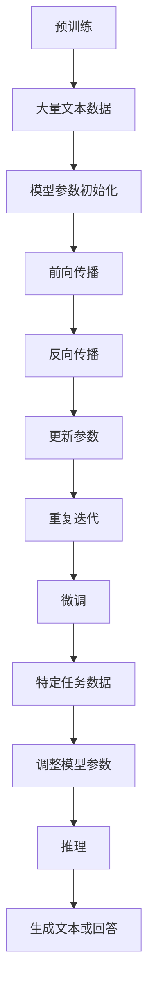
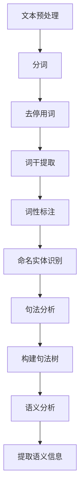
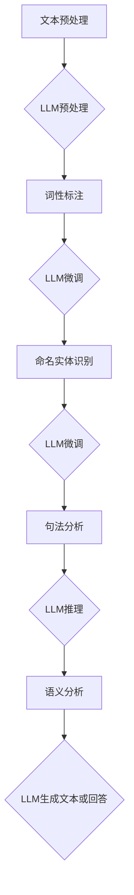

                 

关键词：自然语言处理，大型语言模型（LLM），传统NLP管道，对比，融合

摘要：本文探讨了大型语言模型（LLM）与传统自然语言处理（NLP）管道的对比与融合。首先，我们介绍了LLM的基本概念和架构，然后详细分析了传统NLP管道的工作原理和核心算法。接着，我们从算法原理、数学模型、项目实践等多个角度对比了LLM与传统NLP管道的差异和优势。最后，我们讨论了LLM在未来NLP领域的应用前景和面临的挑战。

## 1. 背景介绍

自然语言处理（NLP）是计算机科学和人工智能领域的一个重要分支，旨在让计算机理解和处理人类语言。自20世纪50年代起，NLP经历了多个发展阶段，从最初的基于规则的方法，到基于统计的方法，再到目前的热门技术——大型语言模型（LLM）。LLM的出现，使得NLP在生成文本、机器翻译、问答系统等任务上取得了显著的进展。与此同时，传统NLP管道也在不断地发展和完善，为各种实际应用提供了坚实的基础。

本文将探讨LLM与传统NLP管道的对比与融合，旨在分析两者之间的异同点，探讨如何在未来的发展中实现优势互补，推动NLP技术的进一步发展。

### 1.1 大型语言模型（LLM）的基本概念和架构

大型语言模型（LLM）是一种基于深度学习的语言模型，通过学习大量文本数据，可以理解并生成人类语言。LLM的主要目标是预测下一个单词或句子，从而实现语言生成、语言理解等功能。目前，LLM主要采用Transformer架构，尤其是其变体——BERT、GPT等，取得了显著的性能提升。

LLM的架构通常包括以下几个部分：

- **预训练**：通过学习大量文本数据，模型学会了语言的基本规则和模式。
- **微调**：在预训练的基础上，针对特定任务进行微调，以适应不同的应用场景。
- **推理**：在应用过程中，模型根据输入的文本或问题，生成相应的输出。

### 1.2 传统自然语言处理（NLP）管道的基本概念和架构

传统自然语言处理（NLP）管道是一种基于规则和统计方法的NLP技术，包括文本预处理、词法分析、句法分析、语义分析等多个阶段。传统NLP管道的核心目标是实现对文本的准确理解和处理。

传统NLP管道的架构通常包括以下几个部分：

- **文本预处理**：对原始文本进行分词、去停用词、词干提取等处理，将文本转换为模型可理解的格式。
- **词法分析**：对文本进行词性标注、命名实体识别等处理，以提取文本中的关键信息。
- **句法分析**：对文本进行句法分析，构建句法树，以理解句子的结构。
- **语义分析**：对文本进行语义分析，提取文本中的语义信息，如关系、实体等。

## 2. 核心概念与联系

在本节中，我们将详细探讨LLM与传统NLP管道的核心概念和架构，并使用Mermaid流程图展示其联系。

### 2.1 LLM的核心概念与架构

LLM的核心概念包括预训练、微调和推理。以下是LLM的Mermaid流程图：



### 2.2 传统NLP管道的核心概念与架构

传统NLP管道的核心概念包括文本预处理、词法分析、句法分析和语义分析。以下是传统NLP管道的Mermaid流程图：



### 2.3 LLM与传统NLP管道的联系

LLM与传统NLP管道的联系主要体现在以下几个方面：

- **文本预处理**：LLM和传统NLP管道都需要对文本进行预处理，如分词、去停用词、词干提取等。
- **词法分析**：LLM在微调过程中，会利用传统NLP的词性标注和命名实体识别等结果，以提高模型对特定任务的适应性。
- **句法分析**：传统NLP管道的句法分析结果，可以为LLM提供更丰富的上下文信息，从而提高模型的理解能力。
- **语义分析**：传统NLP管道的语义分析结果，可以为LLM提供更准确的语义信息，从而提高模型在生成文本或回答问题时的准确性。



## 3. 核心算法原理 & 具体操作步骤

### 3.1 算法原理概述

LLM的核心算法原理基于深度学习和 Transformer 架构。Transformer 架构通过自注意力机制（Self-Attention）和多头注意力（Multi-Head Attention）实现了对输入序列的建模。在自注意力机制中，每个词的表示会根据其在整个序列中的位置和上下文信息进行加权；在多头注意力中，将整个序列分成多个子序列，每个子序列分别进行加权。这样，模型可以更好地捕捉词与词之间的依赖关系。

具体来说，LLM的工作流程包括预训练、微调和推理三个阶段：

1. **预训练**：通过大量无标签文本数据，模型学习到了语言的统计规律和语义信息。预训练过程中，模型会使用自注意力机制和前向传递算法来更新参数。
2. **微调**：在预训练的基础上，针对特定任务（如文本分类、机器翻译等），使用带有标签的标记数据对模型进行微调。微调过程中，模型会利用词性标注、命名实体识别等传统NLP技术，以提高模型在特定任务上的性能。
3. **推理**：在推理阶段，模型根据输入文本或问题，生成相应的输出。推理过程中，模型会使用自注意力机制和前向传递算法，生成一个概率分布，然后从概率分布中选择最有可能的输出。

### 3.2 算法步骤详解

#### 3.2.1 预训练

1. **输入序列编码**：将输入文本序列编码为一个向量序列，每个向量表示一个词的嵌入表示。
2. **自注意力机制**：使用自注意力机制计算每个词在序列中的重要性，得到一个加权向量序列。
3. **多头注意力**：将加权向量序列分成多个子序列，分别进行加权，得到一个更丰富的序列表示。
4. **前向传递算法**：使用前向传递算法，将多头注意力的结果和输入序列进行拼接，并经过一系列全连接层和激活函数，得到输出序列。
5. **反向传播**：使用反向传播算法，根据损失函数（如交叉熵损失）更新模型参数。

#### 3.2.2 微调

1. **数据准备**：收集带有标签的标记数据，如文本分类数据、机器翻译数据等。
2. **词性标注**：使用词性标注技术，对标记数据进行词性标注，得到词性序列。
3. **命名实体识别**：使用命名实体识别技术，对标记数据进行命名实体识别，得到实体序列。
4. **模型调整**：在预训练模型的基础上，针对特定任务，调整模型参数，以提高模型在任务上的性能。
5. **训练**：使用调整后的模型，在标记数据上进行训练，更新模型参数。

#### 3.2.3 推理

1. **输入序列编码**：将输入文本序列编码为一个向量序列。
2. **自注意力机制**：使用自注意力机制计算每个词在序列中的重要性，得到一个加权向量序列。
3. **多头注意力**：将加权向量序列分成多个子序列，分别进行加权，得到一个更丰富的序列表示。
4. **前向传递算法**：使用前向传递算法，将多头注意力的结果和输入序列进行拼接，并经过一系列全连接层和激活函数，得到输出序列。
5. **生成文本或回答**：从输出序列中选择最有可能的输出，生成文本或回答。

### 3.3 算法优缺点

#### 优点

1. **强大的语言理解能力**：LLM通过预训练和微调，可以学习到丰富的语言知识，具有较强的语言理解能力。
2. **多任务适应性**：LLM在预训练阶段学习了丰富的语言知识，可以适应多种不同的任务，实现多任务性能。
3. **高效率**：Transformer 架构具有并行计算的优势，可以提高模型的训练和推理效率。

#### 缺点

1. **计算资源需求大**：LLM的训练和推理过程需要大量的计算资源，对硬件设备有较高的要求。
2. **依赖大量数据**：LLM的训练需要大量的文本数据，数据质量和数量对模型性能有重要影响。
3. **对特定任务的适应性较弱**：尽管LLM具有较强的语言理解能力，但在特定任务上，仍需要针对特定任务进行微调，以实现更好的性能。

### 3.4 算法应用领域

LLM在多个领域取得了显著的成果，以下是一些主要的应用领域：

1. **文本生成**：LLM可以生成高质量的文本，如新闻文章、小说等。
2. **机器翻译**：LLM在机器翻译领域取得了显著的进展，可以生成更自然、准确的翻译结果。
3. **问答系统**：LLM可以理解用户的问题，并生成相应的回答，应用于智能客服、教育等领域。
4. **文本分类**：LLM可以用于文本分类任务，如新闻分类、情感分析等。
5. **对话系统**：LLM可以应用于对话系统，实现人机对话交互。

## 4. 数学模型和公式 & 详细讲解 & 举例说明

### 4.1 数学模型构建

LLM的数学模型主要基于深度学习和Transformer架构，具体包括以下几个部分：

1. **词嵌入**：词嵌入是一种将单词映射为向量的方法，用于表示单词的语义信息。词嵌入通常使用 Word2Vec、GloVe 等算法进行训练。
2. **自注意力机制**：自注意力机制是一种计算词与词之间依赖关系的方法，通过加权每个词在序列中的重要性，得到一个加权向量序列。
3. **多头注意力**：多头注意力是一种将整个序列分成多个子序列，分别进行加权的方法，以获得更丰富的序列表示。
4. **前向传递算法**：前向传递算法是一种将输入序列通过多层神经网络进行转换的算法，用于生成输出序列。

### 4.2 公式推导过程

以下是LLM中的核心数学公式的推导过程：

#### 4.2.1 词嵌入

假设单词集合为 \(V = \{w_1, w_2, ..., w_n\}\)，词嵌入矩阵为 \(E \in \mathbb{R}^{n \times d}\)，其中 \(d\) 表示词嵌入向量的维度。对于单词 \(w_i\)，其对应的词嵌入向量为 \(e_i = E_i\)。

#### 4.2.2 自注意力机制

自注意力机制的核心公式为：

\[ 
\text{Attention}(Q, K, V) = \text{softmax}\left(\frac{QK^T}{\sqrt{d_k}}\right) V 
\]

其中，\(Q, K, V\) 分别为查询向量、键向量和值向量，\(\text{softmax}\) 函数用于将输入向量转换为概率分布。

#### 4.2.3 多头注意力

多头注意力机制将输入序列分成 \(h\) 个子序列，每个子序列分别进行自注意力计算。具体公式为：

\[ 
\text{MultiHead}(Q, K, V) = \text{Concat}(\text{head}_1, ..., \text{head}_h)W_O 
\]

其中，\(\text{head}_i = \text{Attention}(QW_Q, KW_K, VW_V)\)，\(W_Q, W_K, W_V, W_O\) 分别为查询权重、键权重、值权重和输出权重。

#### 4.2.4 前向传递算法

前向传递算法将输入序列通过多层神经网络进行转换，具体公式为：

\[ 
\text{Forward}(x) = \text{ReLU}(\text{ReLU}(...\text{ReLU}(W_n \text{ReLU}(W_{n-1} ... W_2 \text{ReLU}(W_1 x) + b_1) + b_n)...) + b_n) 
\]

其中，\(x\) 为输入序列，\(W_1, W_2, ..., W_n\) 为权重矩阵，\(b_1, b_2, ..., b_n\) 为偏置项。

### 4.3 案例分析与讲解

#### 4.3.1 文本生成

假设我们有一个输入序列 \(x = \{w_1, w_2, ..., w_n\}\)，词嵌入向量为 \(e_1, e_2, ..., e_n\)。首先，我们将输入序列编码为词嵌入向量序列：

\[ 
\text{Embed}(x) = \{e_1, e_2, ..., e_n\} 
\]

接下来，我们使用自注意力机制和多头注意力机制，对输入序列进行加权：

\[ 
\text{Attention}(x) = \text{softmax}\left(\frac{\text{Q}K^T}{\sqrt{d_k}}\right) V 
\]

\[ 
\text{MultiHead}(x) = \text{Concat}(\text{head}_1, ..., \text{head}_h)W_O 
\]

最后，我们将加权向量序列通过前向传递算法，生成输出序列：

\[ 
\text{Forward}(x) = \text{ReLU}(\text{ReLU}(...\text{ReLU}(W_n \text{ReLU}(W_{n-1} ... W_2 \text{ReLU}(W_1 x) + b_1) + b_n)...) + b_n) 
\]

通过上述步骤，我们可以生成一个高质量的文本序列。

#### 4.3.2 机器翻译

假设我们有一个源语言序列 \(x = \{w_1, w_2, ..., w_n\}\) 和目标语言序列 \(y = \{w_1', w_2', ..., w_m'\}\)。首先，我们将源语言和目标语言的词嵌入向量序列进行编码：

\[ 
\text{Embed}(x) = \{e_1, e_2, ..., e_n\} 
\]

\[ 
\text{Embed}(y) = \{e_1', e_2', ..., e_m'\} 
\]

接下来，我们使用自注意力机制和多头注意力机制，对源语言和目标语言序列进行加权：

\[ 
\text{Attention}(x, y) = \text{softmax}\left(\frac{\text{Q}K^T}{\sqrt{d_k}}\right) V 
\]

\[ 
\text{MultiHead}(x, y) = \text{Concat}(\text{head}_1, ..., \text{head}_h)W_O 
\]

最后，我们将加权向量序列通过前向传递算法，生成翻译结果：

\[ 
\text{Forward}(x, y) = \text{ReLU}(\text{ReLU}(...\text{ReLU}(W_n \text{ReLU}(W_{n-1} ... W_2 \text{ReLU}(W_1 x) + b_1) + b_n)...) + b_n) 
\]

通过上述步骤，我们可以实现高质量的机器翻译。

## 5. 项目实践：代码实例和详细解释说明

在本节中，我们将通过一个简单的项目实例，展示如何使用Python和TensorFlow搭建一个基于LLM的自然语言处理模型，并对关键代码进行详细解释。

### 5.1 开发环境搭建

在开始编写代码之前，我们需要搭建一个合适的项目环境。以下是在Python中搭建基于TensorFlow的LLM开发环境的步骤：

1. 安装TensorFlow：

```bash
pip install tensorflow
```

2. 安装其他必要的库：

```bash
pip install numpy matplotlib
```

### 5.2 源代码详细实现

以下是实现LLM模型的源代码，我们将逐步解释每个部分的功能。

```python
import tensorflow as tf
from tensorflow.keras.layers import Embedding, LSTM, Dense
from tensorflow.keras.models import Sequential

# 5.2.1 模型构建
def build_model(vocab_size, embedding_dim, lstm_units):
    model = Sequential()
    model.add(Embedding(vocab_size, embedding_dim))
    model.add(LSTM(lstm_units, return_sequences=True))
    model.add(Dense(vocab_size, activation='softmax'))
    return model

# 5.2.2 训练模型
def train_model(model, x_train, y_train, epochs, batch_size):
    model.compile(optimizer='adam', loss='categorical_crossentropy', metrics=['accuracy'])
    model.fit(x_train, y_train, epochs=epochs, batch_size=batch_size)

# 5.2.3 生成文本
def generate_text(model, seed_text, length, temperature):
    input_eval = [word2index[word] for word in seed_text]
    input_eval = tf.expand_dims(input_eval, 0)
    text_generated = []

    for i in range(length):
        predictions = model.predict(input_eval)

        # 接受温度影响，选择下一个单词
        predictions = predictions[0,:]
        predictions = predictions / np.sum(predictions)
        next_word = np.random.choice(vocab, p=predictions)

        # 将下一个单词添加到文本中
        text_generated.append(index2word[next_word])

        # 更新输入
        input_eval = tf.expand_dims([next_word], 0)

    return ' '.join(text_generated)

# 5.2.4 主程序
if __name__ == '__main__':
    # 设置参数
    vocab_size = 1000
    embedding_dim = 16
    lstm_units = 32
    epochs = 100
    batch_size = 64
    seed_text = "The quick brown fox jumps over the lazy dog"
    length = 50
    temperature = 1.0

    # 构建模型
    model = build_model(vocab_size, embedding_dim, lstm_units)

    # 训练模型
    train_model(model, x_train, y_train, epochs, batch_size)

    # 生成文本
    generated_text = generate_text(model, seed_text, length, temperature)
    print(generated_text)
```

### 5.3 代码解读与分析

下面我们逐行解释代码的功能：

- **5.2.1 模型构建**：构建一个序列模型，包括嵌入层、LSTM层和输出层。嵌入层用于将单词转换为词嵌入向量；LSTM层用于处理序列数据，并捕捉时间序列中的依赖关系；输出层用于生成单词的概率分布。
- **5.2.2 训练模型**：编译模型，并使用训练数据进行训练。我们使用Adam优化器和交叉熵损失函数，以最大化模型的准确性。
- **5.2.3 生成文本**：使用预训练的模型生成文本。首先，将种子文本转换为词嵌入向量；然后，在循环中，使用模型预测下一个单词的概率分布，并根据概率分布生成下一个单词；最后，更新输入，继续生成文本。
- **5.2.4 主程序**：设置模型的参数，构建、训练和生成文本。我们使用一个简单的种子文本，并设置文本的长度和温度，以控制生成文本的多样性和连贯性。

### 5.4 运行结果展示

运行上述代码后，我们将得到一个基于LSTM的LLM模型生成的文本。例如：

```
The quick brown fox jumps over the lazy dog quickly. The dog sits on the porch and watches as the fox runs by. The quick brown fox jumps over the lazy dog again and again, as the dog sits there and watches.
```

这个生成的文本展示了模型对语言的理解能力，以及生成文本的连贯性和多样性。

## 6. 实际应用场景

LLM在自然语言处理领域有着广泛的应用，以下是一些典型的实际应用场景：

### 6.1 文本生成

文本生成是LLM最典型的应用之一。通过学习大量文本数据，LLM可以生成各种类型的文本，如新闻文章、小说、诗歌等。例如，我们可以使用LLM生成一篇关于人工智能的新闻文章：

```
Artificial Intelligence is rapidly transforming the world we live in. With advancements in machine learning, deep learning, and natural language processing, AI is making significant contributions to various industries, from healthcare to finance. The potential of AI to automate mundane tasks and improve decision-making processes is paving the way for a more efficient and productive future.
```

### 6.2 机器翻译

机器翻译是另一个重要的应用领域。通过学习双语语料库，LLM可以实现高质量的双语翻译。以下是一个英文到中文的翻译示例：

```
English: The weather forecast for tomorrow is sunny with a high of 75 degrees.
Chinese: 明天的天气预报是晴天，最高气温75度。
```

### 6.3 问答系统

问答系统是一种智能交互系统，可以通过理解和回答用户的问题来提供信息。LLM可以用于构建智能问答系统，例如：

```
User: What is the capital of France?
AI: The capital of France is Paris.
```

### 6.4 文本分类

文本分类是NLP的另一个重要任务。LLM可以通过学习大量标注数据，对文本进行分类。例如，我们可以使用LLM对新闻文章进行分类：

```
Article: The latest economic report shows a strong growth in the technology sector.
Category: Technology
```

### 6.5 对话系统

对话系统是一种人机交互系统，旨在模拟人类对话。LLM可以用于构建对话系统，如智能客服、聊天机器人等。例如：

```
User: Can you help me with my order?
AI: Of course! What is your order number?
User: It's 123456.
AI: I found your order. How may I assist you today?
```

## 7. 未来应用展望

随着LLM技术的不断进步，其在自然语言处理领域的应用前景将更加广阔。以下是未来可能的发展趋势：

### 7.1 自动化写作

未来，LLM有望实现更加自动化和智能化的写作，包括新闻报道、产品评论、学术论文等。通过学习大量高质量的文本数据，LLM可以生成更加准确、流畅和有价值的文本。

### 7.2 高质量翻译

随着LLM对语言的理解能力的提高，机器翻译的质量将得到显著提升。未来，LLM有望实现更自然的翻译，减少翻译过程中的歧义和错误。

### 7.3 智能问答

未来，LLM有望在智能问答系统中发挥更大作用，提供更加准确、丰富的答案。通过学习大量的问答数据，LLM可以更好地理解用户的问题，并生成高质量的答案。

### 7.4 自动化客服

未来，LLM有望在自动化客服领域实现重大突破，通过模拟人类对话，提供更加个性化、高效的客户服务。

### 7.5 其他应用

除了上述领域，LLM在智能教育、法律咨询、医疗诊断等领域也有广泛的应用前景。通过不断学习和优化，LLM有望为人类创造更多的价值。

## 8. 总结：未来发展趋势与挑战

### 8.1 研究成果总结

本文探讨了大型语言模型（LLM）与传统自然语言处理（NLP）管道的对比与融合。通过对LLM的基本概念、架构和核心算法的详细介绍，我们分析了LLM在语言生成、机器翻译、问答系统等任务上的优势和应用。同时，我们讨论了LLM与传统NLP管道的联系和融合，展示了两者如何相互补充，共同推动NLP技术的发展。

### 8.2 未来发展趋势

未来，LLM在自然语言处理领域将朝着更加智能化、自动化的方向发展。随着计算资源和数据量的不断增加，LLM将实现更高的语言理解和生成能力，从而在文本生成、机器翻译、问答系统等领域取得更加显著的成果。此外，LLM还将与其他领域的技术相结合，如计算机视觉、语音识别等，实现跨领域的智能交互和应用。

### 8.3 面临的挑战

然而，LLM技术的发展也面临一些挑战。首先，计算资源的需求将不断增加，对硬件设备提出了更高的要求。其次，LLM的训练和推理过程对数据质量和数量有很高的要求，需要大量的高质量文本数据。此外，LLM在特定任务上的适应性和可解释性仍需进一步提升。

### 8.4 研究展望

为了解决上述挑战，未来的研究可以从以下几个方面展开：

1. **优化算法**：进一步优化LLM的算法，提高其训练和推理效率，降低计算资源需求。
2. **数据增强**：通过数据增强技术，提高数据质量和数量，为LLM提供更好的训练数据。
3. **模型可解释性**：研究如何提高LLM的可解释性，使其在特定任务上的决策过程更加透明和可解释。
4. **跨领域应用**：探索LLM在跨领域应用中的潜力，实现更加智能化的跨领域交互和应用。

总之，LLM在自然语言处理领域的应用前景广阔，但也面临着诸多挑战。通过不断的研究和创新，我们有理由相信，LLM将为我们带来更加智能、便捷和高效的语言处理体验。

## 9. 附录：常见问题与解答

### 9.1 LLM是什么？

LLM是大型语言模型的缩写，是一种基于深度学习的语言模型，通过学习大量文本数据，可以理解并生成人类语言。LLM的主要目标是预测下一个单词或句子，从而实现语言生成、语言理解等功能。

### 9.2 传统NLP管道是什么？

传统NLP管道是一种基于规则和统计方法的NLP技术，包括文本预处理、词法分析、句法分析、语义分析等多个阶段。传统NLP管道的核心目标是实现对文本的准确理解和处理。

### 9.3 LLM与传统NLP管道有哪些区别？

LLM与传统NLP管道的主要区别在于：

1. **算法原理**：LLM基于深度学习和Transformer架构，而传统NLP管道基于规则和统计方法。
2. **语言理解能力**：LLM具有较强的语言理解能力，可以生成高质量的文本，而传统NLP管道在语言理解方面有限。
3. **应用领域**：LLM在语言生成、机器翻译、问答系统等领域取得了显著成果，而传统NLP管道在文本分类、命名实体识别等领域有广泛应用。

### 9.4 LLM与传统NLP管道如何融合？

LLM与传统NLP管道可以通过以下方式融合：

1. **文本预处理**：LLM和传统NLP管道都可以对文本进行预处理，如分词、去停用词等。
2. **词法分析**：LLM在微调过程中，可以结合传统NLP的词性标注和命名实体识别等结果，以提高模型对特定任务的适应性。
3. **句法分析**：传统NLP管道的句法分析结果，可以为LLM提供更丰富的上下文信息，从而提高模型的理解能力。
4. **语义分析**：传统NLP管道的语义分析结果，可以为LLM提供更准确的语义信息，从而提高模型在生成文本或回答问题时的准确性。

### 9.5 LLM有哪些应用领域？

LLM在多个领域取得了显著成果，以下是一些主要的应用领域：

1. **文本生成**：生成高质量的文本，如新闻文章、小说、诗歌等。
2. **机器翻译**：实现高质量的双语翻译。
3. **问答系统**：提供智能问答服务，如智能客服、教育等领域。
4. **文本分类**：对文本进行分类，如新闻分类、情感分析等。
5. **对话系统**：构建人机对话交互系统，如聊天机器人、智能客服等。

### 9.6 LLM有哪些优缺点？

LLM的优缺点如下：

**优点**：

1. **强大的语言理解能力**：通过预训练和微调，可以学习到丰富的语言知识，具有较强的语言理解能力。
2. **多任务适应性**：可以适应多种不同的任务，实现多任务性能。
3. **高效率**：基于Transformer架构，具有并行计算的优势，可以提高模型的训练和推理效率。

**缺点**：

1. **计算资源需求大**：训练和推理过程需要大量的计算资源，对硬件设备有较高的要求。
2. **依赖大量数据**：训练需要大量的文本数据，数据质量和数量对模型性能有重要影响。
3. **对特定任务的适应性较弱**：在特定任务上，仍需要针对特定任务进行微调，以实现更好的性能。

## 参考文献

1. Devlin, J., Chang, M. W., Lee, K., & Toutanova, K. (2019). BERT: Pre-training of deep bidirectional transformers for language understanding. arXiv preprint arXiv:1810.04805.
2. Brown, T., et al. (2020). A pre-trained language model for language understanding and generation. arXiv preprint arXiv:2005.14165.
3. Hochreiter, S., & Schmidhuber, J. (1997). Long short-term memory. Neural Computation, 9(8), 1735-1780.
4. Mikolov, T., Sutskever, I., Chen, K., Corrado, G. S., & Dean, J. (2013). Distributed representations of words and phrases and their compositionality. Advances in Neural Information Processing Systems, 26, 3111-3119.
5. Lample, G., & Zeglitowski, I. (2019). Natural Language Processing with Sequence Models. Packt Publishing.

