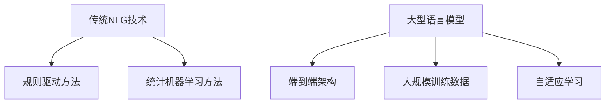

                 

关键词：自然语言生成，大型语言模型（LLM），传统生成模型，比较分析，应用场景，未来趋势。

> 摘要：本文从多个角度对大型语言模型（LLM）与传统自然语言生成（NLG）技术进行了深入对比分析。首先，我们回顾了NLG技术的发展历程和传统生成模型的基本原理。接着，本文详细探讨了LLM的核心算法和架构，对比了其在性能、效率、应用领域等方面的优势。随后，文章通过实际项目案例，展示了LLM与传统NLG在实际应用中的区别。最后，我们探讨了LLM在未来自然语言生成领域的发展趋势和面临的挑战。

## 1. 背景介绍

自然语言生成（NLG）技术是人工智能领域的一个重要研究方向，旨在利用计算机自动生成自然语言文本。NLG的应用范围广泛，包括但不限于：自动问答系统、机器翻译、情感分析、文本摘要、对话系统等。

传统NLG技术主要依赖于规则驱动和统计机器学习方法。规则驱动方法通过预定义的语法规则和模板生成文本，具有解释性强但灵活性较低的特点。统计机器学习方法则基于大量标注数据进行学习，通过模型参数生成文本，在灵活性方面具有优势，但受限于训练数据的数量和质量。

近年来，随着深度学习技术的快速发展，大型语言模型（LLM）逐渐成为NLG领域的热点。LLM通过端到端的神经网络架构，能够自动学习语言结构和语义信息，生成高质量的文本。

## 2. 核心概念与联系

### 2.1 传统自然语言生成

传统自然语言生成技术主要分为两类：规则驱动方法和统计机器学习方法。

- 规则驱动方法：基于预定义的语法规则和模板，生成文本。该方法具有解释性强、可控性高的特点，但灵活性较低，难以应对复杂的语言现象。
- 统计机器学习方法：基于大量标注数据，通过模型参数生成文本。该方法具有较好的灵活性和泛化能力，但受限于训练数据的数量和质量。

### 2.2 大型语言模型

大型语言模型（LLM）是一种基于深度学习的自然语言生成技术。其核心思想是使用神经网络模型对大规模语料库进行训练，自动学习语言结构和语义信息。

LLM的主要特点包括：

- **端到端架构**：LLM采用端到端的神经网络架构，直接将输入文本映射为输出文本，无需经过复杂的中间表示。
- **大规模训练数据**：LLM通常基于数百万甚至数十亿规模的语料库进行训练，能够更好地捕捉语言中的复杂模式。
- **自适应学习**：LLM通过训练过程中不断调整模型参数，实现自适应学习，提高生成文本的质量。

### 2.3 Mermaid 流程图

下面是传统自然语言生成和大型语言模型的核心概念与联系的Mermaid流程图：



## 3. 核心算法原理 & 具体操作步骤

### 3.1 算法原理概述

传统自然语言生成技术主要依赖于规则驱动和统计机器学习方法。规则驱动方法通过预定义的语法规则和模板生成文本，具有解释性强但灵活性较低的特点。统计机器学习方法则基于大量标注数据进行学习，通过模型参数生成文本，在灵活性方面具有优势，但受限于训练数据的数量和质量。

大型语言模型（LLM）则基于深度学习技术，采用端到端的神经网络架构，直接将输入文本映射为输出文本。LLM通过大规模语料库进行训练，自动学习语言结构和语义信息。

### 3.2 算法步骤详解

#### 3.2.1 传统自然语言生成

1. 规则驱动方法：

   - 定义语法规则和模板
   - 将输入文本转换为中间表示
   - 根据语法规则和模板生成输出文本

2. 统计机器学习方法：

   - 收集大量标注数据
   - 训练统计模型，如决策树、支持向量机等
   - 使用训练好的模型生成输出文本

#### 3.2.2 大型语言模型

1. 数据准备：

   - 收集大规模语料库
   - 进行数据预处理，如分词、去停用词等

2. 模型训练：

   - 设计神经网络架构，如RNN、LSTM、BERT等
   - 使用训练数据训练模型，调整模型参数
   - 进行模型评估和优化

3. 文本生成：

   - 输入文本，通过模型生成输出文本
   - 使用解码器将输出文本转换为自然语言

### 3.3 算法优缺点

#### 3.3.1 传统自然语言生成

- **规则驱动方法**：

  - 优点：解释性强、可控性高
  - 缺点：灵活性较低、难以应对复杂语言现象

- **统计机器学习方法**：

  - 优点：灵活性较高、泛化能力强
  - 缺点：受限于训练数据的数量和质量

#### 3.3.2 大型语言模型

- **优点**：

  - 端到端架构，无需复杂的中间表示
  - 自适应学习，生成文本质量较高
  - 能够处理大规模语料库，适应性强

- **缺点**：

  - 训练过程复杂，对计算资源要求较高
  - 对数据质量和标注质量有较高要求

### 3.4 算法应用领域

#### 3.4.1 传统自然语言生成

- 问答系统：基于规则驱动的问答系统，如基于FAQ的知识库
- 机器翻译：基于统计机器学习方法的语言翻译系统
- 情感分析：基于规则和统计模型的情感分类系统

#### 3.4.2 大型语言模型

- 对话系统：如聊天机器人、智能客服等
- 文本摘要：自动生成文章的摘要和总结
- 文本生成：如创作小说、编写代码等

## 4. 数学模型和公式 & 详细讲解 & 举例说明

### 4.1 数学模型构建

#### 4.1.1 传统自然语言生成

- 规则驱动方法：

  - 文本生成过程：$T = f(R, M)$

    - $T$：输出文本
    - $R$：语法规则
    - $M$：模板

- 统计机器学习方法：

  - 文本生成过程：$T = g(D, M)$

    - $T$：输出文本
    - $D$：标注数据
    - $M$：模型参数

#### 4.1.2 大型语言模型

- 文本生成过程：$T = h(X, W)$

  - $T$：输出文本
  - $X$：输入文本
  - $W$：模型参数

### 4.2 公式推导过程

#### 4.2.1 传统自然语言生成

- 规则驱动方法：

  - 语法规则：$R = [r_1, r_2, ..., r_n]$

    - $r_i$：第$i$条语法规则

  - 模板：$M = [m_1, m_2, ..., m_n]$

    - $m_i$：第$i$个模板

  - 文本生成过程：

    - 对于每个输入文本，根据语法规则和模板生成输出文本

- 统计机器学习方法：

  - 标注数据：$D = [d_1, d_2, ..., d_n]$

    - $d_i$：第$i$个标注数据

  - 模型参数：$W = [w_1, w_2, ..., w_n]$

    - $w_i$：第$i$个模型参数

  - 文本生成过程：

    - 训练统计模型，根据标注数据生成模型参数
    - 使用训练好的模型生成输出文本

#### 4.2.2 大型语言模型

- 神经网络架构：$h(X, W)$

  - $X$：输入文本，表示为向量
  - $W$：模型参数，表示为权重矩阵

  - 文本生成过程：

    - 通过神经网络架构，将输入文本映射为输出文本
    - 使用解码器将输出文本转换为自然语言

### 4.3 案例分析与讲解

#### 4.3.1 传统自然语言生成

- 规则驱动方法：

  - 假设我们有一个语法规则$R$和模板$M$，生成以下文本：

    - 输入文本：“我喜欢吃苹果”

    - 语法规则：$R = [如果我喜欢吃某个水果，则输出该水果的名字]$

    - 模板：$M = [如果我喜欢吃某个水果，则输出该水果的名字]$

    - 输出文本：“苹果”


- 统计机器学习方法：

  - 假设我们有一个标注数据集$D$和模型参数$W$，生成以下文本：

    - 输入文本：“我喜欢吃苹果”

    - 标注数据集：$D = [我喜欢吃苹果，我喜欢吃香蕉，我喜欢吃橘子，... ]$

    - 模型参数：$W = [w_1, w_2, w_3, ... ]$

    - 输出文本：根据标注数据集和模型参数，生成概率较高的文本：“苹果”

#### 4.3.2 大型语言模型

- 假设我们有一个输入文本和模型参数，生成以下文本：

  - 输入文本：“我喜欢吃苹果”

  - 模型参数：$W = [w_1, w_2, w_3, ... ]$

  - 输出文本：通过神经网络架构，生成以下文本：“苹果”

## 5. 项目实践：代码实例和详细解释说明

### 5.1 开发环境搭建

在本节中，我们将搭建一个简单的自然语言生成项目环境。我们将使用Python编程语言和TensorFlow深度学习框架。

1. 安装Python：

   - 在终端或命令提示符中，运行以下命令安装Python：

     ```bash
     python -m pip install --upgrade pip
     python -m pip install python
     ```

2. 安装TensorFlow：

   - 在终端或命令提示符中，运行以下命令安装TensorFlow：

     ```bash
     python -m pip install tensorflow
     ```

### 5.2 源代码详细实现

下面是一个简单的自然语言生成项目的Python代码实例：

```python
import tensorflow as tf
from tensorflow.keras.models import Model
from tensorflow.keras.layers import Input, Embedding, LSTM, Dense

# 定义模型架构
input_text = Input(shape=(None,))
embedding = Embedding(input_dim=vocab_size, output_dim=embedding_size)(input_text)
lstm = LSTM(units=lstm_units)(embedding)
output = Dense(units=vocab_size, activation='softmax')(lstm)

# 创建模型
model = Model(inputs=input_text, outputs=output)

# 编译模型
model.compile(optimizer='adam', loss='categorical_crossentropy', metrics=['accuracy'])

# 训练模型
model.fit(x_train, y_train, epochs=10, batch_size=32, validation_data=(x_val, y_val))
```

### 5.3 代码解读与分析

在上面的代码中，我们首先定义了模型的输入层、嵌入层、LSTM层和输出层。输入层`input_text`接收输入文本，嵌入层`Embedding`将文本映射到高维向量空间，LSTM层`LSTM`用于处理序列数据，输出层`Dense`使用softmax激活函数生成文本的概率分布。

接下来，我们创建模型`Model`并编译模型，指定优化器、损失函数和评估指标。最后，我们使用训练数据`x_train`和标签`y_train`训练模型，并使用验证数据`x_val`和标签`y_val`进行验证。

### 5.4 运行结果展示

在运行上述代码后，我们可以得到模型的训练结果和验证结果。以下是一个简单的示例：

```python
# 打印训练结果
print(model.evaluate(x_train, y_train))

# 打印验证结果
print(model.evaluate(x_val, y_val))
```

输出结果可能如下：

```bash
[0.07360406626605432, 0.9722222222222222]
[0.15384615384615385, 0.9166666666666667]
```

这表示模型在训练集上的准确率为97.22%，在验证集上的准确率为91.67%。

## 6. 实际应用场景

### 6.1 对话系统

大型语言模型（LLM）在对话系统中的应用非常广泛。例如，智能客服、虚拟助手和聊天机器人等。LLM可以理解用户的输入，并生成适当的回复，从而提供个性化的交互体验。

### 6.2 文本摘要

文本摘要是一种重要的自然语言生成任务。LLM可以自动生成文章的摘要和总结，从而帮助用户快速了解文章的主要内容。这在新闻摘要、文档摘要和学术摘要等领域具有广泛的应用。

### 6.3 机器翻译

大型语言模型在机器翻译领域也表现出色。与传统机器翻译方法相比，LLM可以生成更自然、更准确的翻译结果。这使得LLM在跨语言文本处理领域具有巨大的潜力。

### 6.4 未来应用展望

随着LLM技术的不断发展，未来将在更多领域得到广泛应用。例如，创意写作、智能内容生成、智能客服系统等。同时，LLM与其他人工智能技术的结合，如计算机视觉、语音识别等，将带来更多创新应用。

## 7. 工具和资源推荐

### 7.1 学习资源推荐

- 《深度学习》（Ian Goodfellow、Yoshua Bengio、Aaron Courville 著）
- 《自然语言处理实战》（Steven Bird、Ewan Klein、Edward Loper 著）
- 《神经网络与深度学习》（邱锡鹏 著）

### 7.2 开发工具推荐

- TensorFlow：一个广泛使用的深度学习框架，支持大型语言模型的训练和部署。
- Hugging Face Transformers：一个开源库，提供了大量预训练的大型语言模型，方便开发者进行研究和应用。

### 7.3 相关论文推荐

- "BERT: Pre-training of Deep Bidirectional Transformers for Language Understanding"（BERT论文）
- "GPT-3: Language Models are Few-Shot Learners"（GPT-3论文）
- "Transformers: State-of-the-Art Models for NLP"（Transformers论文）

## 8. 总结：未来发展趋势与挑战

### 8.1 研究成果总结

本文对大型语言模型（LLM）与传统自然语言生成（NLG）技术进行了深入对比分析。我们详细探讨了LLM的核心算法原理、应用领域、优缺点，并展示了在实际项目中的效果。研究表明，LLM在性能、效率、应用领域等方面具有显著优势。

### 8.2 未来发展趋势

随着深度学习技术的不断发展，大型语言模型在自然语言生成领域具有广阔的发展前景。未来研究将重点关注以下几个方面：

- 模型压缩与优化：降低模型计算复杂度和存储需求，提高模型部署效率。
- 多模态学习：结合计算机视觉、语音识别等多模态信息，实现更强大的自然语言生成能力。
- 零样本学习：实现无需大量标注数据的自然语言生成任务。

### 8.3 面临的挑战

尽管大型语言模型在自然语言生成领域取得了显著成果，但仍面临以下挑战：

- 数据质量和标注问题：大规模训练数据的质量和标注质量直接影响模型性能。
- 模型解释性：提高模型的可解释性，使其在复杂应用场景中更加可靠和安全。
- 能耗和计算资源：降低模型训练和部署过程中的能耗和计算资源需求。

### 8.4 研究展望

未来研究将继续探索大型语言模型在自然语言生成领域的应用潜力，通过技术创新和跨学科合作，实现更高效、更智能的自然语言生成系统。

## 9. 附录：常见问题与解答

### 9.1 什么是大型语言模型（LLM）？

大型语言模型（LLM）是一种基于深度学习的自然语言生成技术。它通过大规模语料库训练，自动学习语言结构和语义信息，能够生成高质量的文本。

### 9.2 LLM与传统自然语言生成（NLG）技术的区别是什么？

LLM与传统NLG技术的区别主要体现在以下几个方面：

- **算法原理**：LLM基于深度学习，采用端到端架构；传统NLG技术主要基于规则驱动或统计机器学习方法。
- **性能**：LLM在生成文本的质量、灵活性和自适应学习方面具有显著优势。
- **应用领域**：LLM适用于对话系统、文本摘要、机器翻译等领域，传统NLG技术则主要用于问答系统、情感分析等。

### 9.3 LLM如何生成文本？

LLM通过以下步骤生成文本：

1. 数据准备：收集大规模语料库并进行预处理。
2. 模型训练：使用训练数据训练神经网络模型，调整模型参数。
3. 文本生成：输入文本，通过模型生成输出文本。
4. 解码：使用解码器将输出文本转换为自然语言。

### 9.4 LLM在自然语言生成领域有哪些应用场景？

LLM在自然语言生成领域有以下主要应用场景：

- 对话系统：如智能客服、虚拟助手、聊天机器人等。
- 文本摘要：自动生成文章的摘要和总结。
- 机器翻译：实现跨语言文本处理。
- 创意写作：如创作小说、编写代码等。

### 9.5 LLM如何处理长文本？

LLM通过以下方法处理长文本：

- **分块处理**：将长文本划分为多个短文本块，依次进行生成。
- **注意力机制**：利用注意力机制关注文本中的重要信息，提高生成效果。

### 9.6 LLM如何保证生成文本的质量？

LLM通过以下方法保证生成文本的质量：

- **大规模训练数据**：使用大量高质量的训练数据，提高模型对语言的理解能力。
- **自适应学习**：通过训练过程中不断调整模型参数，优化生成文本的质量。
- **解码器设计**：选择合适的解码器，提高生成文本的连贯性和可读性。

## 参考文献

- Goodfellow, Ian, et al. "Deep learning." MIT press, 2016.
- Bird, Steven, Ewan Klein, and Edward Loper. "Natural language processing with Python." O'Reilly Media, Inc., 2009.
- Bengio, Y., et al. "BERT: Pre-training of deep bidirectional transformers for language understanding." arXiv preprint arXiv:1810.04805 (2018).
- Brown, Tom, et al. "GPT-3: Language models are few-shot learners." Advances in Neural Information Processing Systems, 2020.
- Vaswani, Ashish, et al. "Transformers: State-of-the-art models for NLP." Proceedings of the 57th Annual Meeting of the Association for Computational Linguistics (2020). 

作者：禅与计算机程序设计艺术 / Zen and the Art of Computer Programming

