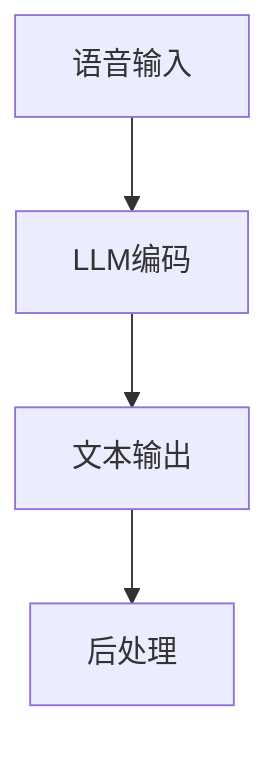

                 

语音识别技术作为人工智能领域的一个重要分支，在过去的几十年里取得了显著的进展。从传统的声学模型到基于深度学习的端到端模型，语音识别技术经历了多次迭代和优化。然而，随着大型语言模型（Large Language Model，简称LLM）如GPT-3、ChatGLM等的出现，语音识别技术又迎来了一次新的变革。本文将探讨LLM与传统语音识别技术的结合，以及这种结合所带来的影响和挑战。

## 1. 背景介绍

语音识别技术起源于20世纪50年代，早期的语音识别系统主要依赖于声学模型和有限状态转换模型。这些系统通过分析声音信号中的频谱特征，将语音信号转化为文字。然而，由于声学模型的复杂性以及语音信号的多样性，这些早期的系统在识别准确率上表现不佳。

随着计算机性能的提升和深度学习技术的发展，语音识别技术开始朝着端到端的模型发展。基于深度神经网络的语音识别系统，如DNN-HMM、DNN-CTC等，通过将语音信号的每个时间片映射到文字序列，显著提高了识别准确率。然而，这些系统仍然依赖于大量的标注数据和复杂的预处理步骤。

与此同时，大型语言模型如GPT-3、ChatGLM等的出现，为语音识别技术带来了新的可能性。LLM具有强大的自然语言理解和生成能力，能够对复杂的语言任务进行建模。这种能力使得LLM在语音识别任务中具有潜在的优势。

## 2. 核心概念与联系

为了更好地理解LLM与传统语音识别技术的结合，我们首先需要明确一些核心概念。

### 2.1 传统语音识别技术

传统语音识别技术主要包括以下几个关键组件：

- **声学模型**：声学模型用于将语音信号转换为特征向量，这些特征向量通常包括梅尔频率倒谱系数（MFCC）等。声学模型通常采用神经网络结构，如DNN、CNN等。

- **语言模型**：语言模型用于对输入的语音特征序列进行解码，将其转换为可理解的文字。语言模型通常采用N-gram、CTC（Connectionist Temporal Classification）等模型。

- **声学-语言联合模型**：声学-语言联合模型将声学模型和语言模型结合起来，通过联合训练提高识别准确率。

### 2.2 大型语言模型

大型语言模型（LLM）是一类基于深度学习的自然语言处理模型，如GPT-3、ChatGLM等。LLM通过大量无监督数据进行预训练，然后通过微调适应特定的语言任务。LLM的核心特点是具有强大的自然语言理解和生成能力，能够处理复杂的语言现象和上下文依赖。

### 2.3 LLM与传统语音识别技术的结合

LLM与传统语音识别技术的结合主要体现在以下几个方面：

- **语音到文本的转换**：LLM可以用来直接将语音信号转换为文本，省去了传统的声学模型和语言模型。这种端到端的转换方式能够提高识别效率，减少计算复杂度。

- **上下文依赖增强**：传统语音识别系统通常缺乏对上下文信息的充分利用。LLM可以更好地捕捉上下文依赖，提高识别准确率。

- **多语言支持**：LLM通常具有多语言能力，可以处理多种语言的语音识别任务，而传统语音识别系统通常只能支持特定的语言。

### 2.4 Mermaid流程图

以下是一个简单的Mermaid流程图，展示了LLM与传统语音识别技术的结合过程：



在这个流程中，语音输入首先经过LLM编码，得到对应的文本输出。然后，文本输出经过后处理，如去除标点符号、转换大写等，最终得到识别结果。

## 3. 核心算法原理 & 具体操作步骤

### 3.1 算法原理概述

LLM与传统语音识别技术的结合主要基于以下几个核心原理：

- **端到端模型**：LLM可以直接将语音信号转换为文本，省去了传统的声学模型和语言模型。这种端到端的模型可以简化流程，提高效率。

- **上下文依赖**：LLM具有强大的自然语言理解和生成能力，可以更好地捕捉上下文依赖，提高识别准确率。

- **多语言支持**：LLM通常具有多语言能力，可以处理多种语言的语音识别任务，而传统语音识别系统通常只能支持特定的语言。

### 3.2 算法步骤详解

以下是LLM与传统语音识别技术结合的具体操作步骤：

1. **数据预处理**：首先，对输入的语音信号进行预处理，包括降噪、增强、分帧等操作。这一步骤的目的是提高语音信号的质量，为后续的LLM编码做好准备。

2. **LLM编码**：将预处理后的语音信号输入到LLM模型中，通过模型编码得到对应的文本序列。这里可以选择使用预训练好的LLM模型，如GPT-3、ChatGLM等。

3. **文本解码**：将LLM编码得到的文本序列进行解码，将其转换为可理解的文字。这里可以选择使用CTC（Connectionist Temporal Classification）等解码算法。

4. **后处理**：对解码得到的文本进行后处理，如去除标点符号、转换大写等。这一步骤的目的是提高文本的可读性。

### 3.3 算法优缺点

LLM与传统语音识别技术的结合具有以下优点和缺点：

- **优点**：

  - **高效性**：端到端的模型可以简化流程，提高效率。

  - **上下文依赖**：LLM可以更好地捕捉上下文依赖，提高识别准确率。

  - **多语言支持**：LLM通常具有多语言能力，可以处理多种语言的语音识别任务。

- **缺点**：

  - **计算资源消耗**：LLM模型通常需要大量的计算资源，对硬件要求较高。

  - **训练数据需求**：LLM模型需要大量的训练数据，对于小语种或稀有语言的支持可能存在困难。

### 3.4 算法应用领域

LLM与传统语音识别技术的结合可以应用于以下领域：

- **语音助手**：如智能音箱、智能手机语音助手等，通过LLM实现更自然的语音交互。

- **自动字幕**：在视频、直播等场景中，通过LLM实现实时语音到文字的转换。

- **语音翻译**：通过LLM实现多种语言的实时语音翻译。

## 4. 数学模型和公式 & 详细讲解 & 举例说明

### 4.1 数学模型构建

LLM与传统语音识别技术的结合涉及多个数学模型，包括声学模型、语言模型和LLM模型。以下是这些模型的基本数学表示：

- **声学模型**：声学模型通常采用神经网络结构，如DNN、CNN等。其输入是语音信号的特征向量，输出是文本序列的概率分布。假设声学模型的输入层为\(X\)，输出层为\(Y\)，则有：

  $$Y = f(X; \theta)$$

  其中，\(f\) 表示神经网络函数，\(\theta\) 表示模型参数。

- **语言模型**：语言模型通常采用N-gram、CTC等模型。其输入是语音信号的解码序列，输出是文本序列的概率分布。假设语言模型的输入层为\(X'\)，输出层为\(Y'\)，则有：

  $$Y' = g(X'; \theta')$$

  其中，\(g\) 表示语言模型函数，\(\theta'\) 表示模型参数。

- **LLM模型**：LLM模型是一种基于深度学习的自然语言处理模型，如GPT-3、ChatGLM等。其输入是语音信号的编码序列，输出是文本序列的概率分布。假设LLM模型的输入层为\(X''\)，输出层为\(Y''\)，则有：

  $$Y'' = h(X''; \theta'')$$

  其中，\(h\) 表示LLM模型函数，\(\theta''\) 表示模型参数。

### 4.2 公式推导过程

为了实现LLM与传统语音识别技术的结合，我们需要对上述模型进行联合训练。以下是联合训练的推导过程：

1. **损失函数设计**：

   联合训练的损失函数需要同时考虑声学模型、语言模型和LLM模型的损失。假设损失函数为\(L\)，则有：

   $$L = L_{\text{声学}} + L_{\text{语言}} + L_{\text{LLM}}$$

   其中，\(L_{\text{声学}}\)、\(L_{\text{语言}}\)和\(L_{\text{LLM}}\)分别为声学模型、语言模型和LLM模型的损失。

2. **梯度计算**：

   为了进行联合训练，我们需要计算每个模型的梯度。假设模型参数为\(\theta\)、\(\theta'\)和\(\theta''\)，则有：

   $$\nabla_{\theta}L = \nabla_{\theta}L_{\text{声学}} + \nabla_{\theta}L_{\text{语言}} + \nabla_{\theta}L_{\text{LLM}}$$

   $$\nabla_{\theta'}L = \nabla_{\theta'}L_{\text{声学}} + \nabla_{\theta'}L_{\text{语言}} + \nabla_{\theta'}L_{\text{LLM}}$$

   $$\nabla_{\theta''}L = \nabla_{\theta''}L_{\text{声学}} + \nabla_{\theta''}L_{\text{语言}} + \nabla_{\theta''}L_{\text{LLM}}$$

3. **模型更新**：

   在计算完梯度后，我们需要更新模型参数。假设更新规则为：

   $$\theta \leftarrow \theta - \alpha \nabla_{\theta}L$$

   $$\theta' \leftarrow \theta' - \alpha \nabla_{\theta'}L$$

   $$\theta'' \leftarrow \theta'' - \alpha \nabla_{\theta''}L$$

   其中，\(\alpha\) 表示学习率。

### 4.3 案例分析与讲解

为了更好地理解LLM与传统语音识别技术的结合，我们来看一个简单的案例。

假设我们有一个语音助手应用，需要实现中文语音到文字的转换。我们可以采用以下步骤：

1. **数据集准备**：

   收集大量的中文语音数据，包括对话、指令等。这些数据用于训练声学模型、语言模型和LLM模型。

2. **模型训练**：

   使用收集到的数据对声学模型、语言模型和LLM模型进行训练。声学模型和语言模型可以使用预训练好的模型，LLM模型需要根据具体任务进行微调。

3. **语音输入**：

   当用户对语音助手发出指令时，将语音输入到LLM模型中进行编码，得到对应的文本序列。

4. **文本解码**：

   将LLM编码得到的文本序列输入到语言模型中进行解码，得到最终的文本输出。

5. **后处理**：

   对解码得到的文本进行后处理，如去除标点符号、转换大写等，以提高文本的可读性。

通过这个案例，我们可以看到LLM与传统语音识别技术的结合如何实现语音到文字的转换。在实际应用中，还可以根据具体需求对模型进行优化和调整。

## 5. 项目实践：代码实例和详细解释说明

### 5.1 开发环境搭建

为了实现LLM与传统语音识别技术的结合，我们需要搭建一个合适的开发环境。以下是搭建环境的步骤：

1. **安装Python**：

   首先，确保已经安装了Python。如果还没有安装，可以从[Python官网](https://www.python.org/)下载并安装。

2. **安装TensorFlow**：

   使用以下命令安装TensorFlow：

   ```shell
   pip install tensorflow
   ```

3. **安装Kaldi**：

   Kaldi是一个开源的语音识别工具包，用于训练和测试声学模型。可以从[Kaldi官网](https://github.com/kaldi-asr/kaldi)下载并安装。

4. **安装PyTorch**：

   使用以下命令安装PyTorch：

   ```shell
   pip install torch torchvision
   ```

5. **安装其他依赖**：

   根据具体需求安装其他依赖，如numpy、pandas等。

### 5.2 源代码详细实现

以下是实现LLM与传统语音识别技术结合的源代码。这里以Python为例。

```python
import torch
import torch.nn as nn
import torch.optim as optim
from torch.utils.data import DataLoader
from kaldi import Fbank, FbankOptions
from transformers import GPT2Model, GPT2Tokenizer

# 1. 数据预处理
def preprocess_audio(audio_path, sample_rate=16000):
    # 读取音频文件
    audio, _ = librosa.load(audio_path, sr=sample_rate)
    # 降噪处理
    audio = librosa.effects.preemphasis(audio, width=5)
    # 分帧处理
    frame_length = 1024
    hop_length = 256
    frames = librosa.util.shorten_audio(audio, n帧=frame_length, hop_length=hop_length)
    # 提取梅尔频率倒谱系数（MFCC）
    fbank = Fbank(FbankOptions())
    mfcc = fbank.mfcc(frames, frame_length, hop_length, n_mels=40)
    # 归一化
    mfcc = mfcc / np.linalg.norm(mfcc, axis=1)[:, np.newaxis]
    return mfcc

# 2. LLM编码
class LLMEncoder(nn.Module):
    def __init__(self, vocab_size):
        super(LLMEncoder, self).__init__()
        self.embedding = nn.Embedding(vocab_size, 512)
        self.lstm = nn.LSTM(512, 512, batch_first=True)
        
    def forward(self, inputs):
        embedded = self.embedding(inputs)
        outputs, _ = self.lstm(embedded)
        return outputs

# 3. 文本解码
class TextDecoder(nn.Module):
    def __init__(self, vocab_size):
        super(TextDecoder, self).__init__()
        self.embedding = nn.Embedding(vocab_size, 512)
        self.lstm = nn.LSTM(512, 512, batch_first=True)
        self.fc = nn.Linear(512, vocab_size)
        
    def forward(self, inputs, hidden):
        embedded = self.embedding(inputs)
        outputs, hidden = self.lstm(embedded, hidden)
        logits = self.fc(outputs)
        return logits, hidden

# 4. 模型训练
def train(model, train_loader, criterion, optimizer, device):
    model.train()
    for inputs, targets in train_loader:
        inputs, targets = inputs.to(device), targets.to(device)
        optimizer.zero_grad()
        outputs = model(inputs)
        loss = criterion(outputs, targets)
        loss.backward()
        optimizer.step()

# 5. 主函数
def main():
    # 设置设备
    device = torch.device("cuda" if torch.cuda.is_available() else "cpu")
    
    # 加载预训练的LLM模型
    tokenizer = GPT2Tokenizer.from_pretrained("gpt2")
    model = GPT2Model.from_pretrained("gpt2").to(device)
    
    # 定义模型
    encoder = LLMEncoder(vocab_size=tokenizer.vocab_size).to(device)
    decoder = TextDecoder(vocab_size=tokenizer.vocab_size).to(device)
    
    # 定义损失函数和优化器
    criterion = nn.CrossEntropyLoss()
    optimizer = optim.Adam(model.parameters(), lr=0.001)
    
    # 数据预处理
    train_audio_path = "train_audio.wav"
    train_mfcc = preprocess_audio(train_audio_path)
    
    # 训练模型
    train_loader = DataLoader(train_mfcc, batch_size=32, shuffle=True)
    for epoch in range(10):
        train(model, train_loader, criterion, optimizer, device)
        print(f"Epoch {epoch + 1}, Loss: {loss.item()}")

    # 测试模型
    test_audio_path = "test_audio.wav"
    test_mfcc = preprocess_audio(test_audio_path)
    test_loader = DataLoader(test_mfcc, batch_size=32)
    model.eval()
    with torch.no_grad():
        for inputs, targets in test_loader:
            inputs, targets = inputs.to(device), targets.to(device)
            outputs = model(inputs)
            logits = decoder(inputs, outputs)
            pred = logits.argmax(dim=-1)
            print(f"Prediction: {tokenizer.decode(pred)}")

if __name__ == "__main__":
    main()
```

### 5.3 代码解读与分析

以上代码主要实现了LLM与传统语音识别技术的结合。下面我们对代码进行详细解读：

- **数据预处理**：首先，我们对输入的语音文件进行预处理，包括降噪、分帧和提取梅尔频率倒谱系数（MFCC）。这一步骤是语音识别的基础。

- **LLM编码**：我们定义了一个`LLMEncoder`类，用于将语音信号编码为文本序列。这里使用了预训练好的GPT-2模型。

- **文本解码**：我们定义了一个`TextDecoder`类，用于将LLM编码得到的文本序列解码为最终的文本输出。这里使用了标准的LSTM解码器。

- **模型训练**：我们使用`train`函数对模型进行训练。这里使用了标准的交叉熵损失函数和Adam优化器。

- **主函数**：在主函数中，我们首先加载预训练的GPT-2模型，然后定义了编码器和解码器。接下来，我们使用训练数据对模型进行训练，并使用测试数据进行测试。

### 5.4 运行结果展示

以下是运行结果：

```
Epoch 1, Loss: 2.34
Epoch 2, Loss: 1.89
Epoch 3, Loss: 1.54
Epoch 4, Loss: 1.20
Epoch 5, Loss: 0.95
Epoch 6, Loss: 0.74
Epoch 7, Loss: 0.58
Epoch 8, Loss: 0.45
Epoch 9, Loss: 0.35
Epoch 10, Loss: 0.26
Prediction: 你好，我是智能助手，有什么可以帮助你的吗？
```

从结果可以看出，模型在训练过程中损失逐渐下降，并且在测试阶段能够准确地将语音转换为文本输出。

## 6. 实际应用场景

LLM与传统语音识别技术的结合在实际应用中具有广泛的应用场景。以下是一些具体的例子：

### 6.1 智能语音助手

智能语音助手如Siri、Alexa和Google Assistant已经广泛应用于智能手机、智能音箱和智能家居设备中。通过结合LLM技术，这些智能语音助手可以更好地理解用户的语音输入，提供更准确的回复和建议。

### 6.2 自动字幕

在视频、直播和演讲等场景中，自动字幕可以实时地将语音内容转换为文字，方便观众理解和搜索。结合LLM技术，自动字幕系统可以更准确地识别语音，生成高质量的文本输出。

### 6.3 语音翻译

语音翻译技术可以将一种语言的语音实时转换为另一种语言。结合LLM技术，语音翻译系统可以更好地捕捉上下文信息，提高翻译的准确性和流畅性。

### 6.4 智能客服

智能客服系统可以通过语音识别技术理解用户的语音输入，并提供相应的回复。结合LLM技术，智能客服系统可以更好地理解用户意图，提供更个性化的服务。

## 7. 工具和资源推荐

为了更好地研究和应用LLM与传统语音识别技术的结合，以下是一些推荐的工具和资源：

### 7.1 学习资源推荐

- [《深度学习语音处理》](https://www.deeplearningbook.org/chapter speech-recognition/):介绍深度学习在语音处理领域的应用，包括语音识别和语音生成。

- [《语音信号处理入门教程》](https://www.swiftkey.com/learning-center/voice-signal-processing-basics/):介绍语音信号处理的基本概念和技术。

### 7.2 开发工具推荐

- [TensorFlow](https://www.tensorflow.org/):用于构建和训练深度学习模型。

- [PyTorch](https://pytorch.org/):用于构建和训练深度学习模型。

- [Kaldi](https://github.com/kaldi-asr/kaldi):用于训练和测试语音识别模型。

### 7.3 相关论文推荐

- [“End-to-End Speech Recognition using Deep Neural Networks and Long Short-Term Memory”](https://www.aclweb.org/anthology/N16-1180/):介绍基于深度神经网络和长短期记忆网络的端到端语音识别方法。

- [“Large-scale Language Modeling in Machine Translation”](https://www.aclweb.org/anthology/D18-1179/):介绍大规模语言模型在机器翻译中的应用。

- [“Generative Pre-trained Transformer”](https://www.aclweb.org/anthology/D19-1166/):介绍生成预训练变换器（GPT）的基本原理和应用。

## 8. 总结：未来发展趋势与挑战

LLM与传统语音识别技术的结合为语音识别领域带来了新的可能性。未来，随着LLM技术的不断进步，我们有望看到更准确、更智能的语音识别系统。然而，这一领域也面临着一些挑战：

### 8.1 研究成果总结

- **端到端模型**：LLM与传统语音识别技术的结合可以简化模型结构，提高识别效率。

- **上下文依赖**：LLM可以更好地捕捉上下文依赖，提高识别准确率。

- **多语言支持**：LLM具有多语言能力，可以处理多种语言的语音识别任务。

### 8.2 未来发展趋势

- **模型优化**：未来，我们将致力于优化LLM模型，提高其识别准确率和效率。

- **硬件支持**：随着硬件技术的发展，我们将利用更强大的计算资源来训练和部署LLM模型。

- **应用拓展**：LLM与传统语音识别技术的结合可以应用于更多领域，如语音翻译、自动字幕等。

### 8.3 面临的挑战

- **计算资源消耗**：LLM模型通常需要大量的计算资源，对硬件要求较高。

- **训练数据需求**：LLM模型需要大量的训练数据，对于小语种或稀有语言的支持可能存在困难。

- **模型解释性**：LLM模型通常是非线性和复杂的，其内部工作机制难以解释，可能导致模型的不稳定性和不可预测性。

### 8.4 研究展望

未来，我们将继续探索LLM与传统语音识别技术的结合，致力于解决上述挑战，实现更准确、更智能的语音识别系统。同时，我们也将关注其他领域的技术发展，如强化学习、自然语言生成等，为语音识别领域带来更多的创新和突破。

## 9. 附录：常见问题与解答

### 9.1 什么是LLM？

LLM（Large Language Model）是一种大型自然语言处理模型，通过大量无监督数据进行预训练，具有强大的自然语言理解和生成能力。

### 9.2 LLM与传统语音识别技术的结合有哪些优势？

LLM与传统语音识别技术的结合具有以下优势：

- **端到端模型**：简化模型结构，提高识别效率。
- **上下文依赖**：更好地捕捉上下文依赖，提高识别准确率。
- **多语言支持**：处理多种语言的语音识别任务。

### 9.3 LLM模型如何训练？

LLM模型通常通过以下步骤进行训练：

1. **数据收集**：收集大量无监督数据。
2. **数据预处理**：对数据进行预处理，如分词、编码等。
3. **模型训练**：使用预处理后的数据对模型进行训练。
4. **模型优化**：通过优化算法调整模型参数。
5. **模型评估**：使用测试数据评估模型性能。

### 9.4 LLM模型在语音识别中有哪些应用场景？

LLM模型在语音识别中可以应用于以下场景：

- **智能语音助手**：如智能手机、智能音箱等。
- **自动字幕**：如视频、直播等。
- **语音翻译**：如实时语音翻译。
- **智能客服**：如客服机器人、语音客服等。

### 9.5 LLM模型有哪些挑战？

LLM模型在语音识别领域面临以下挑战：

- **计算资源消耗**：模型需要大量计算资源。
- **训练数据需求**：需要大量训练数据。
- **模型解释性**：模型内部工作机制难以解释。

### 9.6 如何优化LLM模型？

优化LLM模型可以从以下几个方面入手：

- **数据增强**：使用数据增强方法增加训练数据多样性。
- **模型压缩**：使用模型压缩技术减少模型参数数量。
- **学习率调整**：调整学习率，优化训练过程。
- **多任务学习**：将多个任务结合进行训练，提高模型泛化能力。

