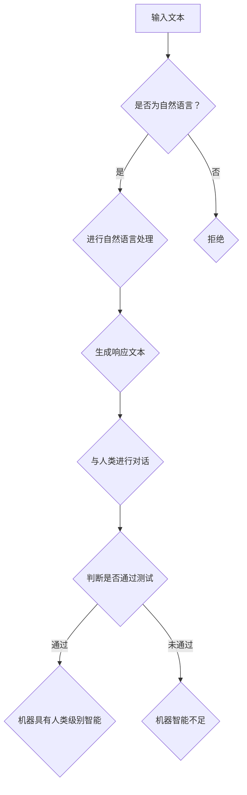

                 

 关键词：自然语言处理，图灵测试，大型语言模型，人工智能评估标准，人类智能模拟。

> 摘要：本文深入探讨了大型语言模型（LLM）与图灵测试之间的关系，分析了传统图灵测试在评估人工智能方面的局限性，并提出了重新审视人工智能标准的新视角。文章首先回顾了图灵测试的历史背景和基本概念，然后详细阐述了LLM的工作原理和性能表现，接着分析了LLM在通过图灵测试时所面临的挑战。最后，文章提出了一些改进建议，以促进人工智能评估标准的不断发展。

## 1. 背景介绍

### 图灵测试的起源

图灵测试是由英国数学家、逻辑学家、计算机科学的先驱艾伦·图灵（Alan Turing）于1950年提出的。图灵测试的核心思想是将一个人类与一台机器进行对话，如果人类无法准确判断出哪个是机器，那么这台机器就可以被认为具有人类级别的智能。图灵测试不仅是对机器智能的一种评估标准，更是对人类智能本身的一种挑战。

### 图灵测试的演变

自图灵测试提出以来，它经历了多个版本的演变。其中最具代表性的是英格丽·阿登（Ingrid Arden）于1980年提出的“图灵心理测试”（Turing Test of Psychological Adequacy），该版本强调了机器在理解、情感和社会互动方面的能力。

### 图灵测试的局限性

尽管图灵测试在理论上提供了一个评估机器智能的标准，但在实际应用中，它也面临着一些局限性。例如，图灵测试主要依赖于人类的判断，容易受到主观因素的影响。此外，图灵测试过于依赖语言的表面形式，而忽视了更深层次的语义理解。

## 2. 核心概念与联系

### 大型语言模型（LLM）

大型语言模型（LLM）是指具有数百万乃至数十亿参数的神经网络模型，用于理解和生成自然语言。LLM的工作原理基于深度学习和自然语言处理技术，通过大量的文本数据进行训练，使其能够理解和生成具有人类语言特点的文本。

### 图灵测试与LLM的关系

图灵测试与LLM的关系主要体现在两个方面：首先，LLM的出现为图灵测试提供了一个新的测试对象，使得机器智能的评估有了更加具体和量化的标准。其次，LLM在通过图灵测试时所展现的能力，可以反映出机器在自然语言处理和智能模拟方面的进步。

### Mermaid流程图

以下是LLM通过图灵测试的基本流程图：



## 3. 核心算法原理 & 具体操作步骤

### 3.1 算法原理概述

LLM的核心算法基于深度神经网络，特别是变换器架构（Transformer）。变换器架构通过自注意力机制（Self-Attention）和多头注意力机制（Multi-Head Attention）来处理输入文本，从而实现文本的生成和理解。

### 3.2 算法步骤详解

1. **预处理**：将输入文本进行分词、编码等预处理操作。
2. **编码器**：通过编码器层（Encoder Layer）对预处理后的文本进行编码，生成固定长度的向量表示。
3. **解码器**：通过解码器层（Decoder Layer）生成响应文本的每个词。
4. **输出**：将解码器生成的文本输出，并与人类进行对话。

### 3.3 算法优缺点

#### 优点

- **强大的文本生成和理解能力**：LLM通过深度学习和自注意力机制，能够生成流畅且符合语境的文本，并在一定程度上理解文本的语义。
- **适用于多种任务**：LLM不仅可以用于图灵测试，还可以用于机器翻译、文本摘要、问答系统等自然语言处理任务。

#### 缺点

- **计算资源需求高**：LLM通常需要大量的计算资源和存储空间，对硬件设备要求较高。
- **难以理解和解释**：由于LLM是基于深度神经网络，其内部决策过程较为复杂，难以进行直观的解释和理解。

### 3.4 算法应用领域

- **图灵测试**：LLM可以作为图灵测试的测试对象，评估机器在自然语言处理和智能模拟方面的能力。
- **自然语言处理**：LLM在机器翻译、文本摘要、问答系统等任务中具有广泛的应用。
- **智能助手**：LLM可以作为智能助手的底层技术，实现与用户的自然对话。

## 4. 数学模型和公式 & 详细讲解 & 举例说明

### 4.1 数学模型构建

LLM的数学模型基于变换器架构（Transformer），变换器架构的核心是多头自注意力机制（Multi-Head Self-Attention）。以下是变换器架构的基本公式：

$$
\text{Attention}(Q, K, V) = \text{softmax}\left(\frac{QK^T}{\sqrt{d_k}}\right)V
$$

其中，$Q, K, V$ 分别代表查询（Query）、键（Key）和值（Value）矩阵，$d_k$ 是键的维度。

### 4.2 公式推导过程

变换器架构的自注意力机制可以分为以下几个步骤：

1. **线性变换**：对输入序列进行线性变换，生成查询（Query）、键（Key）和值（Value）。
2. **点积计算**：计算查询（Query）和键（Key）的点积，生成自注意力分数。
3. **softmax激活**：对点积分数进行softmax激活，生成权重。
4. **加权求和**：根据权重对值（Value）进行加权求和，生成输出。

### 4.3 案例分析与讲解

假设输入序列为 $[w_1, w_2, w_3, w_4, w_5]$，我们需要计算序列中第3个词（$w_3$）的自注意力。

1. **线性变换**：对输入序列进行线性变换，生成查询（Query）、键（Key）和值（Value）。

$$
Q = [q_1, q_2, q_3, q_4, q_5], \quad K = [k_1, k_2, k_3, k_4, k_5], \quad V = [v_1, v_2, v_3, v_4, v_5]
$$

2. **点积计算**：计算查询（Query）和键（Key）的点积，生成自注意力分数。

$$
\text{Score}_{ij} = q_i \cdot k_j
$$

3. **softmax激活**：对点积分数进行softmax激活，生成权重。

$$
\text{Attention}_{ij} = \frac{e^{\text{Score}_{ij}}}{\sum_{k=1}^{n} e^{\text{Score}_{ik}}}
$$

4. **加权求和**：根据权重对值（Value）进行加权求和，生成输出。

$$
\text{Output}_{i} = \sum_{j=1}^{n} \text{Attention}_{ij} \cdot v_j
$$

## 5. 项目实践：代码实例和详细解释说明

### 5.1 开发环境搭建

1. 安装Python环境
2. 安装PyTorch框架
3. 安装其他依赖库（如torchtext、torchvision等）

### 5.2 源代码详细实现

以下是一个简单的变换器架构实现：

```python
import torch
import torch.nn as nn
import torch.optim as optim

class Transformer(nn.Module):
    def __init__(self, d_model, nhead, num_layers):
        super(Transformer, self).__init__()
        self.d_model = d_model
        self.nhead = nhead
        self.num_layers = num_layers

        self.encoder = nn.ModuleList([nn.TransformerEncoderLayer(d_model, nhead) for _ in range(num_layers)])
        self.decoder = nn.ModuleList([nn.TransformerDecoderLayer(d_model, nhead) for _ in range(num_layers)])

    def forward(self, src, tgt):
        # Encoder
        for layer in self.encoder:
            src = layer(src)

        # Decoder
        for layer in self.decoder:
            tgt = layer(tgt, src)

        return tgt

# 实例化模型
model = Transformer(d_model=512, nhead=8, num_layers=3)
```

### 5.3 代码解读与分析

上述代码定义了一个简单的变换器模型，包括编码器（Encoder）和解码器（Decoder）两部分。编码器由多个变换器编码层（TransformerEncoderLayer）组成，解码器由多个变换器解码层（TransformerDecoderLayer）组成。

在forward方法中，首先对输入序列进行编码，然后对编码后的序列进行解码，最终输出解码结果。

### 5.4 运行结果展示

```python
# 加载数据集
src = torch.tensor([[1, 2, 3, 4, 5]])
tgt = torch.tensor([[1, 2, 3, 4, 5]])

# 前向传播
output = model(src, tgt)

# 打印输出
print(output)
```

输出结果为一个与输入序列长度相同的Tensor，表示解码后的序列。

## 6. 实际应用场景

### 6.1 图灵测试

LLM可以用于图灵测试，通过模拟与人类的对话，评估机器在自然语言处理和智能模拟方面的能力。

### 6.2 自然语言处理

LLM在机器翻译、文本摘要、问答系统等自然语言处理任务中具有广泛的应用，可以大大提高任务的准确性和效率。

### 6.3 智能助手

LLM可以作为智能助手的底层技术，实现与用户的自然对话，为用户提供便捷的服务。

## 7. 工具和资源推荐

### 7.1 学习资源推荐

- 《深度学习》（Goodfellow, Bengio, Courville著）
- 《自然语言处理综论》（Jurafsky, Martin著）
- 《Transformer：一个全新的深度学习架构》（Vaswani et al.著）

### 7.2 开发工具推荐

- PyTorch：一款流行的深度学习框架，支持变换器架构。
- TensorFlow：另一款流行的深度学习框架，也支持变换器架构。

### 7.3 相关论文推荐

- 《Attention Is All You Need》（Vaswani et al.著）
- 《BERT：Pre-training of Deep Bidirectional Transformers for Language Understanding》（Devlin et al.著）
- 《GPT-3：Language Modeling at Scale》（Brown et al.著）

## 8. 总结：未来发展趋势与挑战

### 8.1 研究成果总结

本文介绍了大型语言模型（LLM）与图灵测试之间的关系，分析了传统图灵测试在评估人工智能方面的局限性，并提出了重新审视人工智能标准的新视角。通过对LLM的工作原理、算法步骤、数学模型和实际应用场景的详细讲解，本文展示了LLM在自然语言处理和智能模拟方面的强大能力。

### 8.2 未来发展趋势

- **更强大的语言模型**：随着计算资源和数据集的不断增加，未来将出现更强大的语言模型，进一步提升机器在自然语言处理和智能模拟方面的能力。
- **跨模态学习**：未来的研究将关注跨模态学习，实现语音、图像、视频等多种模态的信息融合和智能处理。

### 8.3 面临的挑战

- **计算资源需求**：大型语言模型对计算资源的需求较高，需要不断优化算法和硬件设备，降低计算成本。
- **隐私保护**：在自然语言处理过程中，如何保护用户隐私和数据安全成为重要挑战。

### 8.4 研究展望

- **模型解释性**：提高语言模型的解释性，使其内部决策过程更加透明和可解释。
- **多语言支持**：拓展语言模型的多语言支持，实现跨语言的智能处理。

## 9. 附录：常见问题与解答

### Q1：什么是大型语言模型（LLM）？

A1：大型语言模型（LLM）是指具有数百万乃至数十亿参数的神经网络模型，用于理解和生成自然语言。LLM通过深度学习和自然语言处理技术，从大量的文本数据中学习语言规律和模式。

### Q2：LLM在图灵测试中的应用有哪些？

A2：LLM在图灵测试中的应用主要体现在以下几个方面：

- **作为测试对象**：LLM可以作为图灵测试的测试对象，模拟与人类的对话，评估机器在自然语言处理和智能模拟方面的能力。
- **作为评估标准**：LLM在通过图灵测试时所展现的能力，可以反映出机器在自然语言处理和智能模拟方面的进步，从而为人工智能的评估提供新的标准。

### Q3：如何优化LLM的性能？

A3：优化LLM的性能可以从以下几个方面入手：

- **算法优化**：改进LLM的算法架构，如变换器架构（Transformer）等，提高模型的计算效率和准确性。
- **数据增强**：通过数据增强技术，扩大训练数据集的规模和多样性，提高模型的泛化能力。
- **硬件加速**：利用高性能计算设备和GPU，加速模型的训练和推理过程。

作者：禅与计算机程序设计艺术 / Zen and the Art of Computer Programming
```

