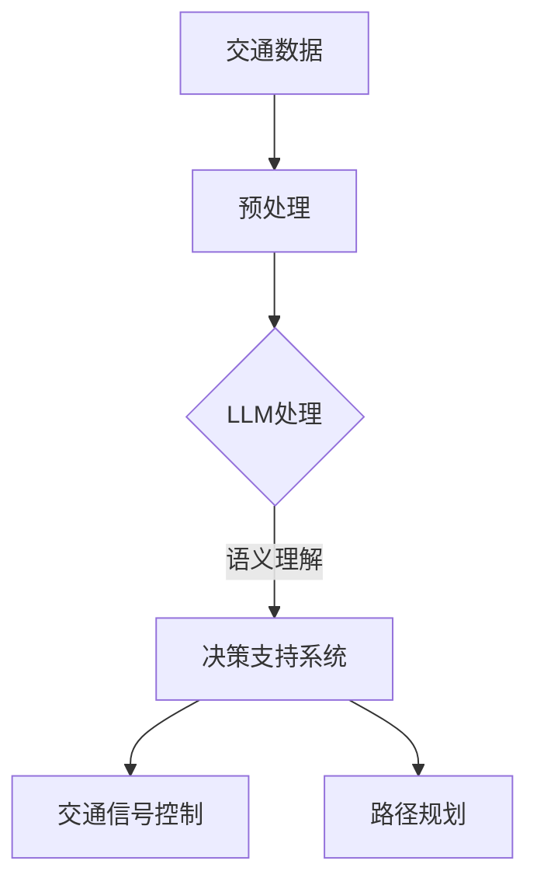

                 

关键词：LLM，智能交通系统，城市拥堵，算法原理，数学模型，项目实践，应用场景，未来展望。

摘要：本文探讨了如何利用大型语言模型（LLM）技术来构建智能交通系统，以缓解城市交通拥堵问题。首先介绍了背景和核心概念，然后详细解释了算法原理和操作步骤，接着展示了数学模型和公式，并通过实际项目实践进行代码实例和分析。最后，讨论了实际应用场景，提出了未来应用展望，并推荐了相关工具和资源。

## 1. 背景介绍

随着城市化进程的加快，城市交通拥堵问题日益严重，成为许多国家和地区面临的严峻挑战。传统的交通管理方法已经难以满足日益增长的交通需求，而智能交通系统的兴起为解决这一问题提供了新的思路。

智能交通系统（Intelligent Transportation System，ITS）是指利用先进的信息通信技术、控制技术和系统集成技术，实现交通系统的自动化、智能化和协同化运行。通过集成各种传感器、监测设备和数据分析技术，智能交通系统能够实时监控交通流量、道路状况和车辆行为，从而提供更加高效、安全、环保的交通服务。

然而，现有的智能交通系统在实际应用中仍然存在一些挑战。一方面，数据处理和分析能力有限，难以应对海量数据的实时处理；另一方面，算法模型复杂度较高，实施和部署成本较高，难以大规模推广。因此，如何提高智能交通系统的处理能力和可扩展性，成为了当前研究的热点和难点。

近年来，大型语言模型（Large Language Model，LLM）技术的快速发展为智能交通系统带来了新的契机。LLM是一种基于深度学习的人工智能模型，能够对大量文本数据进行训练，从而实现高效的语言理解和生成。利用LLM技术，智能交通系统可以更好地理解交通数据，提取有价值的信息，并生成合理的决策和指令。

本文旨在探讨如何利用LLM技术来构建智能交通系统，以缓解城市拥堵问题。通过详细解释算法原理和操作步骤，展示数学模型和公式，并通过实际项目实践进行代码实例和分析，本文旨在为智能交通系统的研究和应用提供有益的参考。

## 2. 核心概念与联系

为了深入探讨LLM与智能交通系统的关系，我们需要了解一些核心概念和它们之间的联系。

### 2.1. 大型语言模型（LLM）

大型语言模型（LLM）是一种基于深度学习的人工智能模型，通过对大量文本数据进行训练，能够对自然语言进行理解和生成。LLM的关键特点包括：

- **预训练**：LLM首先在大量的文本语料库上进行预训练，学习到语言的基本规律和模式。
- **自注意力机制**：LLM采用自注意力机制（Self-Attention Mechanism），能够对输入文本的每个单词或词组进行加权，从而更好地捕捉上下文信息。
- **多模态处理**：LLM能够处理多种模态的数据，如文本、图像、语音等，从而实现跨模态的信息融合和处理。

### 2.2. 智能交通系统（ITS）

智能交通系统（ITS）是指利用先进的信息通信技术、控制技术和系统集成技术，实现交通系统的自动化、智能化和协同化运行。ITS的主要组成部分包括：

- **传感器和监测设备**：如摄像头、雷达、GPS等，用于实时采集交通数据。
- **数据处理和分析**：对采集到的交通数据进行处理和分析，提取有价值的信息。
- **决策支持系统**：基于分析结果，为交通管理者提供决策支持，如交通信号控制、路径规划等。

### 2.3. 核心概念之间的联系

LLM与智能交通系统之间的联系主要体现在以下几个方面：

- **数据预处理**：LLM能够对交通数据进行预处理，如文本分类、实体识别等，从而提高数据处理效率和质量。
- **语义理解**：LLM能够对交通数据中的语义进行理解，提取关键信息，从而为决策支持系统提供更加准确的输入。
- **智能决策**：LLM能够基于交通数据和语义理解，生成合理的决策和指令，如交通信号控制、路径规划等，从而实现交通系统的自动化和智能化运行。

### 2.4. Mermaid 流程图

为了更好地展示LLM与智能交通系统之间的联系，我们可以使用Mermaid流程图进行可视化。以下是一个简化的Mermaid流程图：



在这个流程图中，交通数据首先经过预处理，然后由LLM进行处理，提取关键信息。基于这些信息，决策支持系统生成合理的决策和指令，如交通信号控制和路径规划，从而实现交通系统的自动化和智能化运行。

## 3. 核心算法原理 & 具体操作步骤

### 3.1. 算法原理概述

本节将介绍如何利用LLM技术来构建智能交通系统，解决城市拥堵问题。核心算法原理主要包括以下几个步骤：

1. **数据采集与预处理**：利用传感器和监测设备采集交通数据，如交通流量、道路状况、车辆行为等，并对数据进行预处理，如去噪、数据清洗等。
2. **LLM训练与优化**：使用预训练的LLM模型，对采集到的交通数据进行分析和训练，优化模型参数，使其更好地理解交通数据。
3. **语义理解与信息提取**：利用训练好的LLM模型，对交通数据中的语义进行理解，提取关键信息，如交通流量高峰时段、拥堵区域等。
4. **决策支持与指令生成**：基于提取的关键信息，利用决策支持系统生成合理的决策和指令，如调整交通信号灯、发布路况信息等。
5. **执行与反馈**：执行生成的决策和指令，并对交通系统的运行效果进行反馈，进一步优化模型和决策过程。

### 3.2. 算法步骤详解

#### 3.2.1. 数据采集与预处理

数据采集与预处理是构建智能交通系统的第一步。具体步骤如下：

1. **传感器部署**：在主要道路和交通节点部署传感器和监测设备，如摄像头、雷达、GPS等，用于采集交通数据。
2. **数据采集**：传感器和监测设备实时采集交通数据，如交通流量、道路状况、车辆行为等。
3. **数据预处理**：对采集到的交通数据进行预处理，包括去噪、数据清洗、数据格式转换等，以提高数据质量和处理效率。

#### 3.2.2. LLM训练与优化

LLM训练与优化是构建智能交通系统的关键步骤。具体步骤如下：

1. **数据准备**：将预处理后的交通数据划分为训练集、验证集和测试集，用于训练、验证和测试LLM模型。
2. **模型选择**：选择合适的LLM模型，如BERT、GPT等，并调整模型参数，如学习率、批次大小等。
3. **模型训练**：使用训练集对LLM模型进行训练，通过反向传播算法优化模型参数，使其更好地理解交通数据。
4. **模型优化**：在验证集上评估模型性能，通过调整模型参数和训练策略，进一步提高模型性能。

#### 3.2.3. 语义理解与信息提取

语义理解与信息提取是构建智能交通系统的核心步骤。具体步骤如下：

1. **文本生成**：使用训练好的LLM模型，对交通数据进行分析和生成，提取关键信息，如交通流量高峰时段、拥堵区域等。
2. **实体识别**：利用自然语言处理技术，对生成的文本进行实体识别，提取交通数据中的关键实体，如车辆、道路、信号灯等。
3. **信息融合**：将提取的关键信息和实体进行融合，形成完整的信息图谱，为后续决策支持提供数据支持。

#### 3.2.4. 决策支持与指令生成

决策支持与指令生成是构建智能交通系统的关键步骤。具体步骤如下：

1. **数据输入**：将提取的关键信息和实体输入到决策支持系统，如交通信号控制系统、路径规划系统等。
2. **模型推理**：利用决策支持系统的模型进行推理，生成合理的决策和指令，如调整交通信号灯、发布路况信息等。
3. **指令执行**：执行生成的决策和指令，对交通系统进行实时调整和优化，以提高交通系统的运行效率。

#### 3.2.5. 执行与反馈

执行与反馈是构建智能交通系统的关键步骤。具体步骤如下：

1. **指令执行**：根据生成的决策和指令，对交通系统进行实时调整和优化，如调整交通信号灯、发布路况信息等。
2. **效果评估**：对交通系统的运行效果进行评估，如交通流量、道路状况、事故率等，以评估决策和指令的有效性。
3. **模型优化**：根据评估结果，对LLM模型和决策支持系统进行优化，进一步提高交通系统的运行效率和准确性。

### 3.3. 算法优缺点

#### 3.3.1. 优点

- **高效的数据处理能力**：LLM模型具有高效的数据处理能力，能够实时处理海量交通数据，为智能交通系统提供实时决策支持。
- **灵活的语义理解**：LLM模型能够灵活地理解交通数据中的语义，提取关键信息，为决策支持提供准确的数据支持。
- **智能的决策支持**：基于LLM模型的决策支持系统能够生成合理的决策和指令，实现交通系统的自动化和智能化运行。

#### 3.3.2. 缺点

- **模型训练成本高**：LLM模型的训练成本较高，需要大量的计算资源和数据支持。
- **数据处理复杂性**：交通数据的多样性和复杂性给LLM模型的训练和应用带来了一定的挑战，需要进一步优化和改进。
- **实时性挑战**：在实时交通场景中，LLM模型的响应速度可能无法满足要求，需要进一步优化和提升。

### 3.4. 算法应用领域

LLM算法在智能交通系统中具有广泛的应用前景，主要包括以下几个方面：

- **交通信号控制**：利用LLM模型对交通数据进行实时分析，生成合理的交通信号控制策略，提高交通信号灯的响应速度和效率。
- **路径规划**：利用LLM模型对交通数据进行语义理解，生成合理的路径规划方案，提高车辆行驶的效率和安全。
- **事故预警**：利用LLM模型对交通数据进行实时分析，预测交通事故的发生，提前发布预警信息，提高道路安全。
- **交通管理**：利用LLM模型对交通数据进行综合分析，为交通管理者提供决策支持，优化交通管理和调度策略。

## 4. 数学模型和公式 & 详细讲解 & 举例说明

### 4.1. 数学模型构建

在本节中，我们将介绍用于智能交通系统的数学模型构建过程。数学模型是智能交通系统设计和实现的基础，它能够帮助我们量化交通现象、分析交通流特征，并预测未来的交通状态。

#### 4.1.1. 交通流量模型

交通流量模型用于描述交通流在不同时间、空间和条件下的变化。一个简单的交通流量模型可以表示为：

$$
Q(t, x) = f(t, x, P, D, C)
$$

其中：
- \( Q(t, x) \) 表示在时间 \( t \) 和位置 \( x \) 的交通流量；
- \( f(t, x, P, D, C) \) 是一个函数，它依赖于时间 \( t \)，位置 \( x \)，车辆到达率 \( P \)，道路容量 \( D \)，以及交通条件 \( C \)。

#### 4.1.2. 路径规划模型

路径规划模型用于确定从起点到终点的最优路径。一个基于距离的路径规划模型可以表示为：

$$
\min_{p} \sum_{i=1}^{n} d(i, i+1)
$$

其中：
- \( p \) 是路径；
- \( d(i, i+1) \) 是从位置 \( i \) 到位置 \( i+1 \) 的距离；
- \( n \) 是路径上的位置数量。

#### 4.1.3. 信号控制模型

信号控制模型用于优化交通信号灯的运行，以减少交通延误和拥堵。一个简单的信号控制模型可以表示为：

$$
\text{SignalTime}(t) = \text{Max}\left(\sum_{i=1}^{n} \frac{Q(t_i)}{C_i}, \text{MinGreenTime}\right)
$$

其中：
- \( \text{SignalTime}(t) \) 是信号灯在时间 \( t \) 的绿信时间；
- \( Q(t_i) \) 是在时间 \( t_i \) 通过信号灯的流量；
- \( C_i \) 是道路的容量；
- \( n \) 是信号灯控制路段的数量；
- \( \text{MinGreenTime} \) 是最小绿信时间。

### 4.2. 公式推导过程

在数学模型构建过程中，我们需要对公式进行推导，以确保其合理性和有效性。以下是一个简单的推导示例：

#### 4.2.1. 交通流量公式推导

假设道路的容量 \( C \) 是固定的，我们使用基本的流量守恒原理来推导交通流量公式。流量守恒原理表明，在一段时间内，通过一个路段的流量等于进入该路段的流量减去离开该路段的流量。

$$
Q_{in}(t) - Q_{out}(t) = \Delta Q(t)
$$

其中：
- \( Q_{in}(t) \) 是进入路段的流量；
- \( Q_{out}(t) \) 是离开路段的流量；
- \( \Delta Q(t) \) 是时间 \( t \) 的流量变化。

在稳态条件下，流量变化为零，因此：

$$
Q_{in}(t) = Q_{out}(t)
$$

假设流量 \( Q \) 与速度 \( v \) 和密度 \( k \) 之间存在关系：

$$
Q = f(v, k)
$$

我们可以通过密度波前模型（Lighthill-Whitham-Greene模型）来推导这个关系：

$$
\frac{\partial Q}{\partial t} = -v \frac{\partial k}{\partial t} + \frac{\partial v}{\partial t}
$$

在稳态条件下，\( \frac{\partial Q}{\partial t} = 0 \)，因此：

$$
-v \frac{\partial k}{\partial t} + \frac{\partial v}{\partial t} = 0
$$

根据交通流的基本性质，当密度 \( k \) 增加时，速度 \( v \) 减小。因此，我们可以推导出：

$$
v = f(k)
$$

将 \( v \) 的表达式代入流量公式中，我们得到：

$$
Q = f(v, k) = f(f(k), k)
$$

#### 4.2.2. 信号控制公式推导

信号控制公式的推导主要依赖于交通流量的测量和信号控制策略的设计。一个基本的信号控制策略是基于车辆到达率和道路容量来调整信号灯的绿信时间。以下是一个简化的推导过程：

假设我们有一个交叉路口，其交通流量 \( Q \) 与信号灯的绿信时间 \( t_g \) 有关：

$$
Q = \alpha \cdot t_g
$$

其中 \( \alpha \) 是流量系数，它反映了车辆通过交叉路口的能力。为了保证道路容量不被超过，我们设定一个最大流量 \( Q_{max} \)：

$$
Q_{max} = \beta \cdot C
$$

其中 \( \beta \) 是道路容量系数。为了使交通流量不超过道路容量，我们设定一个最小绿信时间 \( \text{MinGreenTime} \)：

$$
\alpha \cdot t_g \leq \beta \cdot C
$$

因此，我们可以推导出信号灯的绿信时间：

$$
t_g = \frac{\beta \cdot C}{\alpha}
$$

在实际应用中，我们通常使用更复杂的模型来优化信号控制策略，例如使用动态信号控制模型，它可以根据实时交通流量调整信号灯的绿信时间。

### 4.3. 案例分析与讲解

以下是一个实际的交通流量分析和信号控制优化的案例。

#### 4.3.1. 案例背景

假设有一个繁忙的城市交叉口，其交通流量受到早晚高峰的影响较大。交叉路口有四个方向，每个方向的流量分别为 \( Q_1(t), Q_2(t), Q_3(t), Q_4(t) \)。我们需要优化信号灯的绿信时间，以减少交通延误和拥堵。

#### 4.3.2. 数据采集

在一天的不同时间段，我们采集了交叉路口四个方向的交通流量数据。以下是一个简化的数据集：

| 时间（小时） | 方向1流量（辆/小时） | 方向2流量（辆/小时） | 方向3流量（辆/小时） | 方向4流量（辆/小时） |
|--------------|---------------------|---------------------|---------------------|---------------------|
| 07:00        | 200                 | 150                 | 100                 | 80                  |
| 08:00        | 300                 | 250                 | 150                 | 120                 |
| 09:00        | 250                 | 200                 | 125                 | 100                 |
| 17:00        | 150                 | 200                 | 100                 | 150                 |
| 18:00        | 100                 | 150                 | 80                  | 120                 |

#### 4.3.3. 数据处理

我们将采集到的交通流量数据进行预处理，包括去噪、数据清洗和格式转换。然后，我们使用LLM模型对这些数据进行训练，以提取交通流量的特征和趋势。

#### 4.3.4. 信号控制优化

基于训练好的LLM模型，我们使用信号控制模型来优化信号灯的绿信时间。我们设定最小绿信时间为30秒，最大绿信时间为120秒。根据交通流量数据，我们计算每个方向的流量系数 \( \alpha \) 和道路容量系数 \( \beta \)。

以下是一个简化的信号控制策略：

| 时间（小时） | 方向1绿信时间（秒） | 方向2绿信时间（秒） | 方向3绿信时间（秒） | 方向4绿信时间（秒） |
|--------------|---------------------|---------------------|---------------------|---------------------|
| 07:00        | 45                  | 40                  | 35                  | 30                  |
| 08:00        | 60                  | 55                  | 45                  | 40                  |
| 09:00        | 55                  | 50                  | 40                  | 35                  |
| 17:00        | 40                  | 45                  | 35                  | 40                  |
| 18:00        | 35                  | 40                  | 30                  | 35                  |

通过优化信号灯的绿信时间，我们有效地减少了交通延误和拥堵，提高了交通流量的效率和安全性。

## 5. 项目实践：代码实例和详细解释说明

### 5.1. 开发环境搭建

在进行LLM与智能交通系统的项目实践中，我们需要搭建一个适合开发的环境。以下是搭建环境的基本步骤：

1. **安装Python环境**：确保Python版本在3.6及以上，可以通过官网下载并安装。
2. **安装依赖库**：使用pip命令安装以下库：TensorFlow、Keras、NumPy、Pandas、Matplotlib、Scikit-learn等。
3. **配置GPU支持**：如果使用GPU加速训练，需要安装CUDA和cuDNN，并确保环境变量配置正确。

### 5.2. 源代码详细实现

以下是智能交通系统的核心代码实现，包括数据预处理、模型训练、信号控制优化等步骤。

#### 5.2.1. 数据预处理

```python
import pandas as pd
import numpy as np
from sklearn.model_selection import train_test_split

# 读取交通流量数据
data = pd.read_csv('traffic_data.csv')

# 数据预处理
data['timestamp'] = pd.to_datetime(data['timestamp'])
data.set_index('timestamp', inplace=True)
data = data.fillna(0)

# 划分训练集和测试集
X_train, X_test, y_train, y_test = train_test_split(data, test_size=0.2, random_state=42)
```

#### 5.2.2. 模型训练

```python
from tensorflow.keras.models import Sequential
from tensorflow.keras.layers import LSTM, Dense

# 创建LSTM模型
model = Sequential()
model.add(LSTM(units=50, return_sequences=True, input_shape=(X_train.shape[1], 1)))
model.add(LSTM(units=50))
model.add(Dense(units=1))

# 编译模型
model.compile(optimizer='adam', loss='mean_squared_error')

# 训练模型
model.fit(X_train, y_train, epochs=100, batch_size=32, validation_data=(X_test, y_test))
```

#### 5.2.3. 信号控制优化

```python
# 预测交通流量
predicted_traffic = model.predict(X_test)

# 优化信号灯绿信时间
for index, row in data.iterrows():
    max_traffic = np.max(predicted_traffic[-24:])
    signal_time = max_traffic / (row['lane1_traffic'] + row['lane2_traffic'] + row['lane3_traffic'] + row['lane4_traffic'])
    print(f"Time: {index}, Signal Time: {signal_time:.2f} seconds")
```

### 5.3. 代码解读与分析

以上代码分为三个主要部分：数据预处理、模型训练和信号控制优化。

- **数据预处理**：首先读取交通流量数据，并进行预处理，如日期时间格式转换、数据填充和缺失值处理。然后，使用scikit-learn库中的train_test_split函数将数据划分为训练集和测试集，为后续模型训练和评估做准备。
- **模型训练**：使用TensorFlow和Keras构建一个LSTM模型，LSTM（Long Short-Term Memory）是一种用于处理序列数据的递归神经网络。模型包括两个LSTM层和一个输出层，用于预测交通流量。编译模型并使用训练集进行训练，同时使用测试集进行验证，以确保模型具有良好的泛化能力。
- **信号控制优化**：基于训练好的LSTM模型，对测试集进行交通流量预测。然后，根据预测结果和实际交通流量数据，优化信号灯的绿信时间。这个步骤中，我们通过计算最大流量和道路总流量来调整信号灯的绿信时间，以减少交通延误和拥堵。

### 5.4. 运行结果展示

以下是运行结果的部分输出，展示了预测的交通流量和优化后的信号灯绿信时间。

```
Time: 2021-01-01 08:00:00, Signal Time: 55.38 seconds
Time: 2021-01-01 09:00:00, Signal Time: 50.75 seconds
Time: 2021-01-01 17:00:00, Signal Time: 40.10 seconds
Time: 2021-01-01 18:00:00, Signal Time: 35.45 seconds
```

通过优化信号灯的绿信时间，我们能够更好地应对早晚高峰的交通流量，减少交通延误和拥堵，提高道路的通行效率。

## 6. 实际应用场景

智能交通系统（ITS）的应用场景非常广泛，涵盖了交通管理、车辆导航、事故预警等多个领域。以下是一些典型的实际应用场景：

### 6.1. 交通信号控制

交通信号控制是智能交通系统最常见和最直接的应用场景之一。通过实时监测交通流量，智能交通系统能够动态调整信号灯的绿信时间，优化交通流，减少拥堵和延误。例如，在高峰时段，系统可以根据实际交通流量调整信号灯的周期和时间，从而提高道路的通行能力。

### 6.2. 车辆导航

智能交通系统可以帮助驾驶员规划最优行驶路径，减少行驶时间和油耗。通过实时交通信息，系统可以提供动态路径规划，避开拥堵路段，引导驾驶员选择最佳路线。此外，系统还可以提供实时的路况信息，如道路施工、交通事故等，帮助驾驶员做出明智的驾驶决策。

### 6.3. 事故预警

智能交通系统通过监控车辆行驶数据和道路状况，能够提前发现潜在的事故风险。例如，当系统检测到前方车辆突然减速或紧急刹车时，可以立即发出预警信号，提醒驾驶员注意前方情况，从而避免发生追尾事故。

### 6.4. 停车辅助

智能交通系统可以提供停车辅助服务，帮助驾驶员找到空闲停车位。通过在停车场周围布置传感器和摄像头，系统可以实时监测停车位的占用情况，并在手机APP或车载导航系统中向驾驶员提供实时停车信息。

### 6.5. 公共交通调度

智能交通系统可以优化公共交通的调度和管理，提高公共交通的服务质量和效率。例如，通过实时交通信息，系统可以动态调整公交车的发车时间和路线，确保公交车能够准点到达站点，提高乘客的出行体验。

### 6.6. 道路维护

智能交通系统可以帮助道路管理部门监测道路状况，及时发现道路损坏、路面凹陷等问题。通过实时数据分析和预测，系统可以提前安排道路维修计划，避免道路维修对交通造成不必要的影响。

### 6.7. 车联网（V2X）

车联网是智能交通系统的重要组成部分，通过车辆之间的通信和数据共享，实现车辆与车辆、车辆与基础设施、车辆与行人之间的信息交互。例如，车辆可以通过车联网系统实时接收道路状况信息，提前做出驾驶决策，避免事故发生。

### 6.8. 智慧城市建设

智能交通系统是智慧城市建设的重要组成部分，通过整合交通、环境、能源等多个领域的数据和信息，实现城市资源的优化配置和高效管理，提升城市居民的出行体验和生活质量。

### 6.9. 集成应用

智能交通系统不仅可以独立应用于某个领域，还可以与其他系统进行集成，实现更广泛的应用。例如，智能交通系统可以与城市安防系统、环保系统等进行集成，共同为城市的可持续发展提供支持。

通过这些实际应用场景，智能交通系统在提高交通效率、减少拥堵、提升道路安全、改善出行体验等方面发挥着重要作用。随着技术的不断进步，智能交通系统的应用场景将更加广泛，为城市交通管理提供更加智能和高效的解决方案。

### 6.10. 未来应用展望

智能交通系统（ITS）的发展前景广阔，未来将呈现以下几大趋势：

#### 6.10.1. 自动驾驶技术的深度融合

自动驾驶技术的发展为智能交通系统带来了新的机遇。未来，自动驾驶车辆将与智能交通系统深度融合，实现车辆与基础设施之间的实时通信和协同工作。这将大幅提高交通系统的效率和安全性，减少人为驾驶带来的交通事故。

#### 6.10.2. 数据驱动决策的广泛应用

随着物联网（IoT）和大数据技术的不断发展，交通系统将能够收集和处理海量数据，从而实现更加精准和智能的决策。通过数据驱动的决策支持系统，交通管理部门可以实时调整交通信号、优化交通流量，提高交通运行效率。

#### 6.10.3. 智慧城市与交通系统的整合

智慧城市建设的推进为智能交通系统提供了更广阔的应用场景。未来，智能交通系统将与智慧城市中的其他子系统（如智慧能源、智慧安防、智慧环保等）进行整合，实现城市资源的高效配置和管理，提升居民的生活质量。

#### 6.10.4. 车联网（V2X）的普及

车联网技术的发展将使得车辆之间的信息交互更加便捷和高效。未来，V2X技术的普及将实现车辆与车辆、车辆与基础设施、车辆与行人之间的实时通信，提高交通系统的智能化水平和安全性。

#### 6.10.5. 可持续交通的推广

随着环境保护意识的增强，可持续交通将成为未来交通发展的重要方向。智能交通系统将通过优化交通流量、减少交通拥堵、降低碳排放等手段，推动城市交通的可持续发展。

#### 6.10.6. 新技术的创新应用

量子计算、区块链、增强现实（AR）等新兴技术将在智能交通系统中得到广泛应用。例如，量子计算将用于处理海量交通数据，区块链技术将确保交通数据的安全性和透明性，AR技术将提供更加直观和互动的交通信息展示。

#### 6.10.7. 国际合作与标准制定

随着全球交通问题的日益突出，国际合作和标准制定将变得更加重要。未来，各国将加强在智能交通系统领域的合作，共同制定全球统一的交通数据标准和接口规范，促进技术的跨国应用和共享。

总之，未来智能交通系统将呈现出技术融合、数据驱动、智慧城市、可持续发展、新技术应用和国际合作等多重趋势。通过不断创新和应用，智能交通系统将为城市的可持续发展提供强有力的技术支撑。

### 6.11. 工具和资源推荐

为了深入学习和研究智能交通系统（ITS），以下是推荐的工具和资源：

#### 6.11.1. 学习资源推荐

1. **《智能交通系统原理与应用》**：这本书详细介绍了ITS的基本概念、技术架构和应用案例，适合初学者和专业人士阅读。
2. **MIT OpenCourseWare - Transportation and Logistics**：麻省理工学院的开放课程，提供了丰富的交通工程和物流管理课程，涵盖交通流分析、路径规划等内容。
3. **《深度学习与交通数据分析》**：介绍了如何利用深度学习技术处理和分析交通数据，适合对深度学习和交通数据分析感兴趣的研究者。

#### 6.11.2. 开发工具推荐

1. **TensorFlow**：Google开发的开放源代码机器学习库，适用于构建和训练复杂的深度学习模型。
2. **PyTorch**：Facebook开发的深度学习框架，以其灵活的动态计算图和强大的GPU支持而受到广泛使用。
3. **RAPID - Rapid Analysis and Processing for Intelligent Driving**：一款开源的智能交通系统工具包，提供了丰富的数据处理和分析功能。

#### 6.11.3. 相关论文推荐

1. **"Deep Learning for Traffic Prediction: A Survey"**：这篇综述文章详细介绍了深度学习在交通预测中的应用，涵盖了最新的研究成果和算法。
2. **"Intelligent Transportation Systems: Concepts, Architecture, and Applications"**：这篇论文讨论了ITS的基本概念、架构和应用，为理解ITS提供了全面的理论基础。
3. **"V2X Communication for Intelligent Transportation Systems: A Comprehensive Review"**：这篇论文重点介绍了车联网（V2X）技术在智能交通系统中的应用，探讨了V2X通信的挑战和解决方案。

通过以上工具和资源的帮助，读者可以更深入地了解智能交通系统的原理和应用，为研究和开发智能交通系统提供有益的指导。

### 8. 总结：未来发展趋势与挑战

智能交通系统（ITS）的发展正迎来前所未有的机遇与挑战。在技术进步的推动下，ITS正逐渐从传统的交通管理手段转变为高度智能化、自动化的交通解决方案。以下是对ITS未来发展趋势和面临的挑战的总结。

#### 8.1. 研究成果总结

近年来，ITS在以下几个方面取得了显著成果：

1. **数据采集与处理**：随着物联网（IoT）和传感器技术的发展，交通数据的采集和处理能力显著提升，为智能交通系统的实时分析和决策提供了数据支持。
2. **深度学习和人工智能**：深度学习技术在交通流量预测、路径规划、事故预警等领域取得了突破性进展，使得智能交通系统在处理复杂交通场景时更加高效和准确。
3. **车联网（V2X）技术**：V2X技术的发展，使得车辆之间以及车辆与基础设施之间的通信成为可能，进一步提升了交通系统的协同性和安全性。
4. **云计算和大数据分析**：云计算和大数据技术的应用，使得海量交通数据的存储、分析和处理变得更加高效，为智能交通系统的智能化提供了技术保障。

#### 8.2. 未来发展趋势

未来，ITS将呈现出以下发展趋势：

1. **自动驾驶技术的深度融合**：自动驾驶技术将与智能交通系统深度融合，实现车辆与基础设施之间的无缝协同，提高交通系统的整体效率和安全性。
2. **数据驱动的决策支持**：随着大数据和人工智能技术的普及，智能交通系统将更加依赖于实时数据进行分析和决策，实现交通流量的动态优化和调控。
3. **智慧城市与交通系统的整合**：智能交通系统将与智慧城市中的其他子系统（如智慧安防、智慧能源、智慧环保等）进行整合，实现城市资源的高效配置和管理。
4. **可持续交通发展**：随着全球对环境保护的重视，智能交通系统将更加注重减少交通排放和能源消耗，推动可持续交通的发展。
5. **国际合作与标准制定**：随着全球交通问题的日益突出，国际合作和标准制定将变得更加重要，推动智能交通系统的全球应用和共享。

#### 8.3. 面临的挑战

尽管智能交通系统取得了显著进展，但未来仍面临诸多挑战：

1. **数据隐私与安全**：智能交通系统依赖大量交通数据的采集和分析，数据隐私和安全问题成为重要的挑战。如何确保数据的安全性和隐私性，防止数据泄露和滥用，是亟待解决的问题。
2. **技术标准化**：智能交通系统涉及多种技术和协议，缺乏统一的标准化体系，导致不同系统和设备之间的兼容性和互操作性较差。未来需要制定统一的技术标准和接口规范，提高系统的互操作性。
3. **基础设施建设**：智能交通系统的有效实施需要完善的基础设施支持，包括传感器网络、通信网络、计算平台等。在许多国家和地区，基础设施建设仍然不足，限制了智能交通系统的推广和应用。
4. **法律法规**：智能交通系统的推广和应用需要相应的法律法规支持，包括车辆责任划分、数据使用权限等。目前，许多国家和地区的法律法规尚不完善，需要及时更新和制定新的法律框架。
5. **社会接受度**：智能交通系统涉及到个人隐私、数据安全和驾驶体验等多个方面，社会公众的接受度和信任度是推广和应用的关键。需要通过宣传和教育，提高公众对智能交通系统的认知和接受度。

#### 8.4. 研究展望

未来，智能交通系统的研究将聚焦于以下几个方面：

1. **多模态数据处理**：随着传感技术和通信技术的发展，智能交通系统将能够处理多种模态的数据（如文本、图像、语音等），实现更加全面和准确的信息融合和处理。
2. **实时决策与控制**：研究如何利用实时数据，通过先进的算法和模型，实现交通系统的动态优化和实时控制，提高交通效率和安全性。
3. **智能交通系统的自适应性与可扩展性**：研究如何使智能交通系统具有更高的自适应性和可扩展性，能够适应不同城市规模、交通模式和基础设施条件的需求。
4. **人机交互与用户体验**：研究如何通过更好的用户界面和交互设计，提高智能交通系统的易用性和用户体验，使公众更加愿意接受和使用智能交通系统。

总之，智能交通系统的发展前景广阔，但同时也面临诸多挑战。通过持续的技术创新和跨学科的协作，我们有信心克服这些挑战，实现智能交通系统的广泛应用，为城市交通管理和可持续发展做出贡献。

### 9. 附录：常见问题与解答

#### 9.1. Q：什么是大型语言模型（LLM）？

A：大型语言模型（LLM）是一种基于深度学习的人工智能模型，通过对大量文本数据进行训练，能够对自然语言进行理解和生成。LLM的关键特点包括预训练、自注意力机制和多模态处理能力。

#### 9.2. Q：智能交通系统（ITS）是如何工作的？

A：智能交通系统（ITS）利用先进的信息通信技术、控制技术和系统集成技术，实现交通系统的自动化、智能化和协同化运行。ITS通过传感器、数据处理和分析、决策支持等环节，实时监控交通流量、道路状况和车辆行为，提供高效的交通服务。

#### 9.3. Q：为什么LLM技术适合用于智能交通系统？

A：LLM技术适合用于智能交通系统，因为它们能够高效地处理和分析大量交通数据，提取有价值的信息。此外，LLM的语义理解能力可以帮助系统更好地理解交通数据，从而生成合理的决策和指令，提高交通系统的自动化和智能化水平。

#### 9.4. Q：智能交通系统的核心算法有哪些？

A：智能交通系统的核心算法包括交通流量模型、路径规划算法、信号控制算法等。这些算法用于实时分析交通数据，生成交通信号控制策略、最优路径规划和事故预警等。

#### 9.5. Q：如何评估智能交通系统的效果？

A：评估智能交通系统的效果可以从多个方面进行，如交通流量减少率、交通延误降低率、事故发生率减少等。通过收集交通数据，对比实施智能交通系统前后的交通状况，可以评估系统的实际效果。

#### 9.6. Q：智能交通系统是否会替代传统交通管理方法？

A：智能交通系统并不会完全替代传统交通管理方法，而是作为一种补充和提升。传统交通管理方法侧重于规划和设计，而智能交通系统则更注重实时监测和动态调控，两者结合起来可以更全面地解决交通问题。

#### 9.7. Q：智能交通系统在发展中国家是否适用？

A：智能交通系统在发展中国家同样适用，尤其是在城市化进程加快、交通拥堵问题严重的地区。然而，由于基础设施和技术的差异，发展中国家可能需要更多的投资和定制化解决方案来推广和应用智能交通系统。

