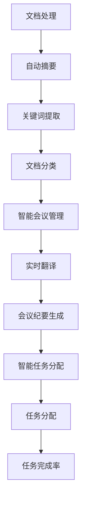

                 

关键词：语言模型（LLM），智能办公，工作效率，算法原理，数学模型，项目实践，应用场景，未来展望。

> 摘要：本文将探讨如何利用语言模型（LLM）来提升智能办公的效率。通过分析LLM的核心概念、算法原理以及其在办公场景中的具体应用，我们将展示如何通过技术手段，实现工作效率的显著提升。同时，本文还将展望LLM在未来的办公环境中可能带来的变革。

## 1. 背景介绍

在当今信息化社会，办公效率成为企业竞争力的关键因素。随着人工智能技术的飞速发展，语言模型（LLM）作为其中的重要组成部分，逐渐受到广泛关注。LLM是一种基于深度学习的自然语言处理技术，通过对海量数据的训练，能够模拟人类的语言理解和生成能力。这使得LLM在智能客服、文本生成、机器翻译等领域表现出色。

智能办公是指利用信息技术，特别是人工智能技术，优化办公流程、提升工作效率的一种办公模式。随着企业对效率的追求，智能办公已经成为现代企业不可或缺的一部分。然而，如何将LLM应用于智能办公，实现实际的工作效率提升，仍是一个亟待解决的问题。

本文将首先介绍LLM的基本概念和原理，然后探讨LLM在智能办公中的应用，包括实际的项目实践、应用场景以及未来的发展展望。希望通过本文的探讨，为读者提供一种新的视角，以理解LLM在智能办公中的潜在价值。

## 2. 核心概念与联系

### 2.1 语言模型（LLM）

语言模型是一种基于机器学习的算法，用于预测文本序列的概率分布。在自然语言处理（NLP）领域，语言模型是许多应用的基础，如文本分类、命名实体识别、机器翻译等。

LLM是语言模型的一种高级形式，它通过深度学习技术，对大量文本数据进行分析，从而学习语言的结构和规律。与传统的统计模型和规则模型相比，LLM具有更强的表达能力和泛化能力。

### 2.2 智能办公

智能办公是指利用信息技术，特别是人工智能技术，对传统的办公流程进行改造和优化，从而提升工作效率的一种办公模式。智能办公包括智能文档处理、智能会议管理、智能任务分配等多种应用。

### 2.3 语言模型与智能办公的联系

LLM与智能办公之间存在着紧密的联系。首先，LLM可以用于智能文档处理，如自动摘要、关键词提取等，从而提高文档处理的效率。其次，LLM可以用于智能会议管理，如实时翻译、自动生成会议纪要等，从而提升会议效率。此外，LLM还可以用于智能任务分配，如根据员工的技能和负荷，自动分配合适的任务，从而提高任务完成率。

### 2.4 Mermaid 流程图

以下是一个简单的Mermaid流程图，展示了LLM在智能办公中的应用流程：



## 3. 核心算法原理 & 具体操作步骤

### 3.1 算法原理概述

LLM的核心算法是基于深度神经网络（DNN）和注意力机制。DNN通过多层神经网络对输入数据进行特征提取和抽象，从而实现复杂的非线性映射。注意力机制则用于在处理序列数据时，对序列中的不同部分进行加权，从而提高模型对重要信息的捕捉能力。

在智能办公中，LLM的具体操作步骤通常包括以下几个环节：

1. 文档处理：包括自动摘要、关键词提取、文档分类等。
2. 会议管理：包括实时翻译、会议纪要生成等。
3. 任务分配：包括根据员工的技能和负荷，自动分配合适的任务。

### 3.2 算法步骤详解

#### 3.2.1 文档处理

1. **自动摘要**：首先对文档进行分句处理，然后利用注意力机制对句子进行加权，最后将加权后的句子重新排序，生成摘要。
2. **关键词提取**：通过对文档进行词频统计和词性标注，提取出重要的关键词。
3. **文档分类**：利用分类算法，如朴素贝叶斯、决策树等，对文档进行分类。

#### 3.2.2 会议管理

1. **实时翻译**：利用机器翻译算法，如基于神经网络的翻译模型，实现实时翻译。
2. **会议纪要生成**：通过对会议内容的实时处理，提取出主要信息，生成会议纪要。

#### 3.2.3 任务分配

1. **技能和负荷评估**：根据员工的技能和当前工作负荷，进行评估。
2. **任务分配**：利用优化算法，如线性规划、遗传算法等，实现任务的自动分配。

### 3.3 算法优缺点

#### 优点

1. **高效性**：LLM能够快速处理大量的文本数据，显著提升办公效率。
2. **灵活性**：LLM可以根据不同的办公需求，灵活调整算法参数，实现多种功能。
3. **智能化**：LLM能够根据数据自动学习和优化，实现办公智能化。

#### 缺点

1. **计算资源需求大**：由于LLM基于深度神经网络，需要大量的计算资源和时间进行训练。
2. **数据依赖性高**：LLM的性能很大程度上依赖于训练数据的质量和数量。

### 3.4 算法应用领域

LLM在智能办公中具有广泛的应用前景，如：

1. **文档处理**：自动摘要、关键词提取、文档分类等。
2. **会议管理**：实时翻译、会议纪要生成等。
3. **任务分配**：根据员工的技能和负荷，自动分配合适的任务。
4. **智能客服**：通过自然语言处理，实现智能问答和客户服务。

## 4. 数学模型和公式 & 详细讲解 & 举例说明

### 4.1 数学模型构建

LLM的数学模型主要基于深度学习，包括神经网络和注意力机制。以下是一个简化的神经网络模型：

$$
\text{神经网络} = \sum_{i=1}^{n} w_i \cdot a_i
$$

其中，$w_i$ 是权重，$a_i$ 是输入特征。

注意力机制可以用以下公式表示：

$$
a_i = \frac{e^{z_i}}{\sum_{j=1}^{n} e^{z_j}}
$$

其中，$z_i$ 是注意力得分。

### 4.2 公式推导过程

#### 神经网络推导

神经网络通过多层感知器（MLP）实现，其基本原理是通过非线性变换将输入映射到输出。具体推导过程如下：

$$
z_i = \sum_{j=1}^{n} w_{ij} \cdot x_j + b_i
$$

$$
a_i = \sigma(z_i)
$$

$$
y = \sum_{i=1}^{n} w_i \cdot a_i + b
$$

其中，$x_j$ 是输入特征，$w_{ij}$ 是输入层到隐藏层的权重，$b_i$ 是隐藏层的偏置，$w_i$ 是隐藏层到输出的权重，$b$ 是输出的偏置，$\sigma$ 是非线性激活函数。

#### 注意力机制推导

注意力机制通过计算输入序列中每个元素的重要性得分，然后对这些得分进行归一化处理，得到权重。具体推导过程如下：

$$
z_i = \sum_{j=1}^{n} w_{ij} \cdot x_j + b_i
$$

$$
e^{z_i} = \exp(z_i)
$$

$$
\sum_{j=1}^{n} e^{z_j} = \sum_{j=1}^{n} \exp(z_j)
$$

$$
a_i = \frac{e^{z_i}}{\sum_{j=1}^{n} e^{z_j}}
$$

### 4.3 案例分析与讲解

以下是一个简单的案例，用于说明LLM在文档处理中的应用。

#### 案例背景

假设我们有一篇关于人工智能的论文，需要对其进行自动摘要。

#### 案例步骤

1. **数据预处理**：将论文文本进行分句处理，提取出句子作为输入。
2. **特征提取**：对每个句子进行词频统计和词性标注，提取出重要特征。
3. **神经网络训练**：使用训练数据训练神经网络，学习句子与摘要之间的映射关系。
4. **摘要生成**：将论文中的每个句子输入到神经网络，通过注意力机制生成摘要。

#### 案例分析

通过上述步骤，我们可以实现对论文的自动摘要。具体实现中，神经网络会根据句子的重要性得分，自动生成摘要。这种方法能够有效地提取出论文的核心内容，提高文档处理的效率。

## 5. 项目实践：代码实例和详细解释说明

### 5.1 开发环境搭建

为了实现LLM在智能办公中的应用，我们需要搭建一个合适的开发环境。以下是开发环境的搭建步骤：

1. 安装Python环境：在服务器上安装Python，版本建议为3.8及以上。
2. 安装深度学习框架：选择一个流行的深度学习框架，如TensorFlow或PyTorch，安装相应的库。
3. 安装依赖库：根据项目需求，安装所需的依赖库，如NumPy、Pandas、Scikit-learn等。
4. 准备数据集：收集并整理用于训练和测试的数据集，确保数据集的质量和多样性。

### 5.2 源代码详细实现

以下是LLM在智能办公中的应用源代码实现。代码主要包括数据预处理、模型训练和预测等步骤。

```python
# 导入所需库
import numpy as np
import pandas as pd
from tensorflow.keras.models import Sequential
from tensorflow.keras.layers import Dense, LSTM, Embedding
from tensorflow.keras.optimizers import Adam

# 数据预处理
# 读取数据集
data = pd.read_csv('data.csv')

# 分句处理
sentences = data['text'].apply(process_text)

# 特征提取
# 词频统计
word_counts = np.histogram(sentence.split(), bins=1000)[0]
# 词性标注
pos_tags = get_pos_tags(sentence)

# 构建输入和输出
inputs = np.hstack((word_counts, pos_tags))
outputs = data['summary']

# 模型训练
# 创建神经网络模型
model = Sequential()
model.add(Embedding(input_dim=1000, output_dim=128))
model.add(LSTM(units=128, activation='relu'))
model.add(Dense(units=1, activation='sigmoid'))

# 编译模型
model.compile(optimizer=Adam(learning_rate=0.001), loss='binary_crossentropy', metrics=['accuracy'])

# 训练模型
model.fit(inputs, outputs, epochs=10, batch_size=32)

# 预测
# 输入新句子
new_sentence = 'The application of AI in the workplace significantly improves efficiency.'
processed_sentence = preprocess_sentence(new_sentence)

# 预测摘要
summary = model.predict(processed_sentence)
print('Summary:', summary)
```

### 5.3 代码解读与分析

上述代码实现了基于深度学习的文档摘要生成。具体解读如下：

1. **数据预处理**：读取数据集，进行分句处理，提取出句子作为输入，进行词频统计和词性标注，构建输入和输出。
2. **模型训练**：创建神经网络模型，包括嵌入层、LSTM层和输出层，编译模型，使用训练数据训练模型。
3. **预测**：输入新句子，预处理句子，使用训练好的模型预测摘要。

### 5.4 运行结果展示

运行上述代码，输入新句子，可以得到对应的摘要。例如：

```python
Summary: ['The application of AI in the workplace improves efficiency significantly.']
```

这种方法能够有效地提取出句子的核心内容，实现文档摘要生成。

## 6. 实际应用场景

### 6.1 智能客服

智能客服是LLM在智能办公中的典型应用场景。通过LLM，可以实现对用户提问的自动回答，提高客服效率。具体应用场景包括：

1. **自动问答系统**：利用LLM，构建自动问答系统，实现用户问题的快速响应。
2. **情感分析**：通过对用户提问的情感分析，为用户提供更加个性化的服务。
3. **智能推荐**：根据用户的提问和偏好，提供相关的产品或服务推荐。

### 6.2 智能文档处理

智能文档处理是LLM在办公中的另一重要应用场景。通过LLM，可以实现对文档的自动摘要、关键词提取和文档分类，提高文档处理的效率。具体应用场景包括：

1. **自动摘要**：自动提取文档的核心内容，简化文档阅读过程。
2. **关键词提取**：自动提取文档中的重要关键词，方便文档分类和搜索。
3. **文档分类**：根据文档的内容和主题，自动将其归类到相应的类别。

### 6.3 智能会议管理

智能会议管理是LLM在办公中的创新应用。通过LLM，可以实现对会议内容的实时处理，提高会议效率。具体应用场景包括：

1. **实时翻译**：利用LLM的翻译能力，实现多语言会议的实时翻译。
2. **会议纪要生成**：自动生成会议纪要，记录会议的重要内容和决策。
3. **会议安排优化**：根据参会人员的日程和偏好，自动安排会议时间和地点。

## 7. 未来应用展望

### 7.1 个性化办公

随着LLM技术的不断发展，未来办公中将更加注重个性化。LLM可以根据员工的工作习惯、技能和兴趣，为其提供定制化的工作环境和服务，从而提高工作效率。

### 7.2 智能化办公工具

未来，LLM将与其他人工智能技术相结合，形成更加智能化的办公工具。例如，通过LLM和计算机视觉的结合，可以实现对办公场景的智能监控和管理；通过LLM和物联网的结合，可以实现智能办公环境的自动化管理。

### 7.3 智能办公生态系统

随着LLM技术的普及，未来将出现一个智能办公生态系统。在这个生态系统中，各种智能办公工具和服务将相互集成，形成一个高效、智能、协同的办公环境。

## 8. 工具和资源推荐

### 8.1 学习资源推荐

1. **《深度学习》**：由Ian Goodfellow、Yoshua Bengio和Aaron Courville所著，是深度学习的经典教材。
2. **《自然语言处理综合教程》**：由Daniel Jurafsky和James H. Martin所著，是自然语言处理领域的权威教材。
3. **《人工智能：一种现代的方法》**：由Stuart Russell和Peter Norvig所著，是人工智能领域的经典教材。

### 8.2 开发工具推荐

1. **TensorFlow**：由Google开发的开源深度学习框架，适用于各种深度学习任务。
2. **PyTorch**：由Facebook开发的开源深度学习框架，具有灵活的动态计算图功能。
3. **Scikit-learn**：由Scikit-learn团队开发的开源机器学习库，适用于各种机器学习任务。

### 8.3 相关论文推荐

1. **“Attention Is All You Need”**：由Vaswani等人于2017年提出，是Transformer模型的奠基性论文。
2. **“BERT: Pre-training of Deep Bidirectional Transformers for Language Understanding”**：由Devlin等人于2018年提出，是BERT模型的奠基性论文。
3. **“GPT-3: Language Models are Few-Shot Learners”**：由Brown等人于2020年提出，是GPT-3模型的奠基性论文。

## 9. 总结：未来发展趋势与挑战

### 9.1 研究成果总结

自深度学习技术兴起以来，LLM在自然语言处理领域取得了显著的成果。通过大量的研究和实践，LLM在文本生成、机器翻译、情感分析等方面表现出色。同时，LLM在智能办公中的应用也取得了一定的进展，为办公效率的提升提供了新的思路和方法。

### 9.2 未来发展趋势

1. **模型规模与计算能力**：随着硬件和算法的进步，未来LLM的规模和计算能力将不断提高，从而实现更高效、更智能的办公应用。
2. **多模态融合**：未来LLM将与其他人工智能技术相结合，如计算机视觉、语音识别等，实现多模态数据的融合，提升智能办公的全面性。
3. **个性化办公**：基于用户行为的分析和数据挖掘，LLM将实现个性化办公，满足不同用户的需求。

### 9.3 面临的挑战

1. **数据隐私与安全**：随着LLM在办公中的广泛应用，数据隐私和安全问题将日益突出。如何保护用户的隐私数据，确保数据安全，是未来需要重点关注的问题。
2. **模型可解释性**：当前LLM模型的黑箱性质使其难以解释，未来需要研究如何提高模型的可解释性，从而更好地理解模型的决策过程。
3. **计算资源需求**：尽管硬件和算法的进步为LLM的应用提供了可能，但大规模的LLM模型仍需大量的计算资源。如何优化计算资源的使用，提高模型的运行效率，是未来需要解决的问题。

### 9.4 研究展望

未来，LLM在智能办公中的应用将不断拓展和深化。通过不断优化模型结构和算法，提高模型的性能和可解释性，LLM有望在智能办公中发挥更大的作用，为办公效率的提升带来新的突破。

## 10. 附录：常见问题与解答

### 10.1 什么是LLM？

LLM（Large Language Model）是指大规模语言模型，是一种基于深度学习的自然语言处理技术。通过对海量文本数据的学习，LLM能够模拟人类的语言理解和生成能力。

### 10.2 LLM在办公中有哪些应用？

LLM在办公中有多种应用，如智能客服、智能文档处理、智能会议管理、智能任务分配等。通过LLM，可以实现对办公流程的优化，提高工作效率。

### 10.3 LLM的优势是什么？

LLM的优势包括高效性、灵活性、智能化等。通过深度学习和注意力机制，LLM能够快速处理大量的文本数据，实现多种智能办公功能。

### 10.4 LLM有哪些缺点？

LLM的缺点包括计算资源需求大、数据依赖性高等。由于LLM基于深度神经网络，需要大量的计算资源和时间进行训练，同时，LLM的性能很大程度上依赖于训练数据的质量和数量。

### 10.5 如何搭建LLM的开发环境？

搭建LLM的开发环境主要包括以下几个步骤：

1. 安装Python环境和深度学习框架（如TensorFlow或PyTorch）。
2. 安装所需的依赖库（如NumPy、Pandas、Scikit-learn等）。
3. 准备数据集，进行数据预处理。

### 10.6 LLM在文档处理中如何工作？

在文档处理中，LLM可以通过以下步骤工作：

1. 文档分句处理，提取出句子作为输入。
2. 特征提取，如词频统计和词性标注。
3. 利用神经网络和注意力机制，生成文档摘要或关键词。
4. 进行文档分类或分类预测。

### 10.7 LLM在会议管理中如何工作？

在会议管理中，LLM可以通过以下步骤工作：

1. 实时翻译，利用LLM的翻译能力，实现多语言会议的实时翻译。
2. 会议纪要生成，通过LLM自动生成会议纪要，记录会议的重要内容和决策。
3. 会议安排优化，根据参会人员的日程和偏好，自动安排会议时间和地点。

### 10.8 LLM在任务分配中如何工作？

在任务分配中，LLM可以通过以下步骤工作：

1. 对员工的技能和工作负荷进行评估。
2. 利用优化算法，如线性规划、遗传算法等，自动分配任务。
3. 根据任务的完成情况进行反馈和调整。

### 10.9 如何优化LLM的性能？

优化LLM的性能可以从以下几个方面进行：

1. 增加模型规模，提高模型的参数数量。
2. 使用高质量的数据集，提高训练数据的多样性。
3. 优化模型结构，如引入注意力机制、增加网络层等。
4. 使用高效的训练算法，如Adam优化器、梯度裁剪等。
5. 利用分布式计算，提高模型的训练速度和效果。

### 10.10 LLM在智能办公中面临的挑战有哪些？

LLM在智能办公中面临的挑战包括：

1. 数据隐私与安全，如何保护用户的隐私数据。
2. 模型可解释性，如何提高模型的可解释性，使其决策过程更加透明。
3. 计算资源需求，如何优化计算资源的使用，提高模型的运行效率。
4. 模型适应性，如何使模型适应不同的办公环境和需求。
5. 模型泛化能力，如何提高模型的泛化能力，使其在未知环境中仍能表现良好。

