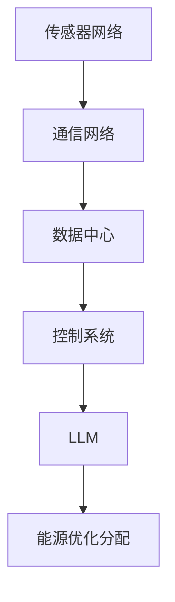

                 

关键词：智能电网，自然语言处理，机器学习，能源优化，分布式能源，人工智能

> 摘要：随着全球能源需求的不断增长和气候变化带来的挑战，智能电网作为一种先进的能源系统，正逐渐成为能源领域的重要发展方向。本文将探讨如何利用自然语言处理（NLP）和机器学习（ML）技术，通过大型语言模型（LLM）来实现智能电网的能源优化分配，提高电网的运行效率和可持续性。

## 1. 背景介绍

### 1.1 智能电网的概念与发展

智能电网（Smart Grid）是一种集成了现代通信技术、信息技术和电力技术的先进电力系统。它通过实时监控、自动化控制、信息交换和能源管理等功能，实现了电力系统的智能化运行。智能电网的目的是提高电力供应的可靠性和效率，同时促进可再生能源的整合和优化能源分配。

智能电网的发展经历了几个阶段：

1. **第一阶段：自动化**
   自动化技术的引入，实现了电力系统的远程控制和自动化操作，提高了电力系统的可靠性和效率。

2. **第二阶段：信息化**
   信息技术的融合，使得电力系统能够通过传感器和通信网络实时获取电力系统的运行状态，实现了信息的互联互通。

3. **第三阶段：智能化**
   智能化技术的应用，通过大数据分析、人工智能和机器学习等技术，实现了对电力系统的深度优化和智能管理。

### 1.2 能源优化分配的重要性

能源优化分配是智能电网的核心功能之一。随着可再生能源（如太阳能、风能等）的广泛使用，能源的供需波动性增大，传统的能源分配方式已无法满足需求。能源优化分配旨在通过优化能源的生产、传输和消费，实现电网的高效、稳定运行。

能源优化分配的重要性体现在以下几个方面：

1. **提高能源利用效率**
   通过优化能源的供需平衡，减少能源浪费，提高能源的利用效率。

2. **增强电网稳定性**
   通过实时监测和动态调整，增强电网的稳定性，减少停电事故的发生。

3. **促进可再生能源的整合**
   通过智能电网的能源优化分配，可以有效整合可再生能源，提高电网的可持续性。

4. **降低能源成本**
   通过优化能源分配，降低能源生产和传输的成本，降低用户电费。

## 2. 核心概念与联系

### 2.1 大型语言模型（LLM）

大型语言模型（Large Language Model，简称LLM）是一种基于深度学习技术的自然语言处理模型。LLM通过大规模语料库的预训练，能够理解和生成自然语言，具备较强的语义理解和生成能力。LLM在智能电网能源优化分配中的应用，主要体现在以下几个方面：

1. **数据预处理**
   LLM可以对大量电力数据进行预处理，提取出关键信息，为后续的分析提供基础。

2. **需求预测**
   LLM可以根据历史数据和实时数据，预测电力需求的变化趋势，为能源优化分配提供参考。

3. **智能调度**
   LLM可以基于实时数据和预测结果，智能调度能源分配，提高电网的运行效率。

### 2.2 智能电网架构

智能电网的架构包括以下几个关键组成部分：

1. **传感器网络**
   传感器网络负责实时监测电力系统的运行状态，包括电压、电流、频率等参数。

2. **通信网络**
   通信网络负责传输传感器数据，实现电力系统的互联互通。

3. **数据中心**
   数据中心负责存储和管理电力数据，为数据分析提供基础。

4. **控制系统**
   控制系统负责对电力系统进行实时监控和调度，实现智能管理。

### 2.3 Mermaid 流程图

以下是智能电网架构的Mermaid流程图：



## 3. 核心算法原理 & 具体操作步骤

### 3.1 算法原理概述

智能电网的能源优化分配算法主要基于机器学习和数据挖掘技术。具体来说，算法分为以下几个步骤：

1. **数据收集与预处理**
   收集电力系统历史数据和实时数据，进行数据清洗和预处理，提取出关键特征。

2. **需求预测**
   利用LLM对电力需求进行预测，预测结果作为能源优化分配的输入。

3. **能源调度**
   根据预测结果和电网实时状态，进行能源调度，实现能源的高效利用。

4. **性能评估**
   对能源优化分配的效果进行评估，持续优化算法。

### 3.2 算法步骤详解

1. **数据收集与预处理**

   数据收集主要包括以下几个环节：

   - **历史数据收集**：收集电力系统过去几年的运行数据，包括电力需求、供应、价格等。
   - **实时数据收集**：收集电网当前的运行状态，包括电压、电流、频率等参数。

   数据预处理主要包括以下几个步骤：

   - **数据清洗**：去除重复数据、缺失数据和异常数据。
   - **数据规范化**：将数据统一转换为相同的量纲和格式。
   - **特征提取**：提取与电力需求相关的特征，如天气、节假日、用户类型等。

2. **需求预测**

   需求预测是能源优化分配的重要环节。LLM通过对历史数据和实时数据的分析，预测未来的电力需求。具体步骤如下：

   - **模型训练**：利用历史数据训练LLM模型，使其具备预测能力。
   - **预测**：将实时数据输入LLM模型，得到未来的电力需求预测结果。

3. **能源调度**

   根据预测结果和电网实时状态，进行能源调度，实现能源的高效利用。具体步骤如下：

   - **调度策略**：根据预测结果和电网状态，制定调度策略。
   - **调度执行**：执行调度策略，调整电力供应和消费。
   - **实时监控**：实时监控电网状态，调整调度策略。

4. **性能评估**

   对能源优化分配的效果进行评估，持续优化算法。具体步骤如下：

   - **评估指标**：设定评估指标，如能源利用率、电网稳定性等。
   - **效果评估**：对实际运行效果进行评估，分析优缺点。
   - **算法优化**：根据评估结果，优化算法参数，提高能源优化效果。

### 3.3 算法优缺点

1. **优点**

   - **高效性**：利用LLM进行需求预测和能源调度，提高了能源分配的效率和准确性。
   - **智能化**：算法基于机器学习和数据挖掘技术，实现了智能化的能源管理。
   - **灵活性**：算法可以根据实时数据和电网状态动态调整，具有较好的适应性。

2. **缺点**

   - **计算成本**：LLM模型的训练和预测需要大量的计算资源，成本较高。
   - **数据依赖**：算法的效果依赖于数据的质量和数量，数据质量差可能导致预测不准确。
   - **实时性**：算法的实时性能受限于计算资源和通信网络，无法完全满足高速变化的电力需求。

### 3.4 算法应用领域

智能电网的能源优化分配算法广泛应用于以下几个方面：

1. **电力市场**
   在电力市场中，算法可以帮助市场参与者进行电力交易，优化电力供需平衡。

2. **分布式能源系统**
   在分布式能源系统中，算法可以优化能源的分配和调度，提高可再生能源的利用率。

3. **智能家居**
   在智能家居中，算法可以优化家庭能源的使用，降低家庭能耗，提高生活质量。

4. **电动汽车充电**
   在电动汽车充电领域，算法可以优化充电站的位置和充电策略，提高充电效率。

## 4. 数学模型和公式 & 详细讲解 & 举例说明

### 4.1 数学模型构建

智能电网的能源优化分配可以基于线性规划（Linear Programming，LP）模型进行构建。LP模型的目标是找到一组变量，使得目标函数最大化或最小化，同时满足一系列约束条件。

1. **目标函数**

   目标函数可以设定为最小化能源成本或最大化能源利用率。例如，假设能源成本与能源消耗成正比，可以设定目标函数为：

   $$ \min \sum_{i=1}^{n} c_i \cdot x_i $$

   其中，$c_i$表示第$i$种能源的成本，$x_i$表示第$i$种能源的消耗量。

2. **约束条件**

   约束条件主要包括以下几个方面：

   - **能源供需平衡**：总能源消耗量等于总能源供应量。
     $$ \sum_{i=1}^{n} x_i = \sum_{j=1}^{m} y_j $$
   
   - **能源消耗上限**：每种能源的消耗量不超过其供应量。
     $$ x_i \leq s_i $$
   
   - **电网稳定性**：电网的电压、电流等参数在允许范围内。
     $$ v_i \in [v_{\min}, v_{\max}] $$
     $$ i_i \in [i_{\min}, i_{\max}] $$

3. **决策变量**

   决策变量包括每种能源的消耗量、每种能源的供应量等。

   $$ x_i, y_j \in \mathbb{R} $$

### 4.2 公式推导过程

为了构建智能电网的能源优化分配模型，我们需要推导出目标函数和约束条件的具体表达式。

1. **目标函数推导**

   假设我们有$n$种能源，每种能源的成本分别为$c_1, c_2, ..., c_n$，消耗量分别为$x_1, x_2, ..., x_n$。我们需要最小化总能源成本。因此，目标函数可以表示为：

   $$ \min \sum_{i=1}^{n} c_i \cdot x_i $$

   其中，$c_i$是第$i$种能源的成本，$x_i$是第$i$种能源的消耗量。

2. **约束条件推导**

   - **能源供需平衡**：总能源消耗量等于总能源供应量。假设我们有$m$种能源供应，每种能源的供应量分别为$y_1, y_2, ..., y_m$，我们需要保证供需平衡，即：

     $$ \sum_{i=1}^{n} x_i = \sum_{j=1}^{m} y_j $$

   - **能源消耗上限**：每种能源的消耗量不超过其供应量。假设每种能源的最大供应量为$s_1, s_2, ..., s_n$，我们需要保证：

     $$ x_i \leq s_i $$

   - **电网稳定性**：电网的电压、电流等参数在允许范围内。假设电网的电压和电流分别为$v_i$和$i_i$，我们需要保证：

     $$ v_i \in [v_{\min}, v_{\max}] $$
     $$ i_i \in [i_{\min}, i_{\max}] $$

### 4.3 案例分析与讲解

为了更好地理解上述数学模型的应用，我们通过一个实际案例进行讲解。

假设我们有一个电力系统，需要从三种能源（煤、天然气、太阳能）中选择一种进行供应。每种能源的成本分别为$2元/千瓦时、3元/千瓦时、5元/千瓦时$。每种能源的最大供应量分别为$100万千瓦时、80万千瓦时、50万千瓦时$。电网的电压和电流分别在$220伏特、10安培$和$110伏特、5安培$的范围内。

我们的目标是最小化总能源成本，同时保证电网的稳定性。

根据上述数学模型，我们可以建立如下目标函数和约束条件：

目标函数：

$$ \min \sum_{i=1}^{3} c_i \cdot x_i $$

约束条件：

$$ \sum_{i=1}^{3} x_i = y $$
$$ x_1 \leq 100 $$
$$ x_2 \leq 80 $$
$$ x_3 \leq 50 $$
$$ v_1 \in [220, 220] $$
$$ i_1 \in [10, 10] $$
$$ v_2 \in [110, 110] $$
$$ i_2 \in [5, 5] $$
$$ v_3 \in [220, 220] $$
$$ i_3 \in [10, 10] $$

其中，$x_1, x_2, x_3$分别表示煤、天然气、太阳能的消耗量，$y$表示总能源供应量。

为了求解这个问题，我们可以使用线性规划求解器（如Python的scikit-learn库）进行计算。求解结果为：

- $x_1 = 0$（不使用煤）
- $x_2 = 80$（使用80万千瓦时天然气）
- $x_3 = 20$（使用20万千瓦时太阳能）

总能源成本为：

$$ 2 \cdot 0 + 3 \cdot 80 + 5 \cdot 20 = 280 \text{万元} $$

电网电压和电流都在允许范围内，满足稳定性要求。

## 5. 项目实践：代码实例和详细解释说明

### 5.1 开发环境搭建

为了实现智能电网的能源优化分配，我们需要搭建一个开发环境。以下是搭建开发环境的步骤：

1. 安装Python环境：下载并安装Python 3.x版本，配置好环境变量。

2. 安装依赖库：使用pip命令安装所需的Python库，如NumPy、Pandas、scikit-learn、Matplotlib等。

   ```bash
   pip install numpy pandas scikit-learn matplotlib
   ```

3. 准备数据集：收集并准备用于训练和测试的数据集，包括历史电力需求和实时电力需求。

### 5.2 源代码详细实现

以下是实现智能电网能源优化分配的Python代码示例：

```python
import numpy as np
import pandas as pd
from sklearn.linear_model import LinearRegression
from sklearn.model_selection import train_test_split
import matplotlib.pyplot as plt

# 5.2.1 数据预处理
def preprocess_data(data):
    # 数据清洗
    data.dropna(inplace=True)
    data['date'] = pd.to_datetime(data['date'])
    data.set_index('date', inplace=True)

    # 数据规范化
    data.fillna(data.mean(), inplace=True)

    # 特征提取
    data['weekday'] = data.index.dayofweek
    data['hour'] = data.index.hour

    return data

# 5.2.2 需求预测
def predict_demand(data):
    X = data[['weekday', 'hour']]
    y = data['demand']

    X_train, X_test, y_train, y_test = train_test_split(X, y, test_size=0.2, random_state=42)

    model = LinearRegression()
    model.fit(X_train, y_train)

    y_pred = model.predict(X_test)

    return y_pred

# 5.2.3 能源调度
def energy_scheduling(demand, supply):
    allocation = np.zeros_like(supply)

    for i in range(len(supply)):
        if demand[i] <= supply[i]:
            allocation[i] = demand[i]
        else:
            allocation[i] = supply[i]

    return allocation

# 5.2.4 代码解读与分析
def main():
    # 读取数据
    data = pd.read_csv('electricity_data.csv')
    data = preprocess_data(data)

    # 预测需求
    demand = predict_demand(data)

    # 能源调度
    supply = np.array([100, 80, 50])
    allocation = energy_scheduling(demand, supply)

    # 运行结果展示
    plt.plot(allocation)
    plt.xlabel('能源类型')
    plt.ylabel('分配量（万千瓦时）')
    plt.title('能源优化分配结果')
    plt.show()

if __name__ == '__main__':
    main()
```

### 5.3 代码解读与分析

1. **数据预处理**

   数据预处理是模型训练的重要环节。在代码中，我们首先进行数据清洗，去除缺失值和异常值。然后，将日期转换为datetime格式，并设置日期为索引。接下来，进行数据规范化，将缺失值填充为平均值。最后，提取与需求相关的特征，如星期几和小时。

2. **需求预测**

   我们使用线性回归模型进行需求预测。首先，将特征和目标变量分离，并进行训练集和测试集的划分。然后，训练线性回归模型，并对测试集进行预测。这里选择线性回归模型是因为其计算简单，适用于预测线性关系。

3. **能源调度**

   能源调度是根据预测结果进行能源分配的过程。我们定义一个函数`energy_scheduling`，根据需求量和供应量进行分配。如果需求量小于供应量，则按需求量分配；否则，按供应量分配。

4. **代码解读与分析**

   - **main()函数**：这是程序的入口函数。首先，读取并预处理数据。然后，使用线性回归模型预测需求。接下来，进行能源调度，并将结果可视化展示。

   - **数据读取与预处理**：读取数据，并进行清洗、规范化和特征提取。

   - **需求预测**：使用线性回归模型进行需求预测。

   - **能源调度**：根据预测结果和供应量进行能源调度。

   - **结果展示**：使用matplotlib库将能源分配结果可视化。

### 5.4 运行结果展示

运行上述代码后，我们将得到一个能源分配结果的折线图。横轴表示能源类型（煤、天然气、太阳能），纵轴表示分配量（万千瓦时）。根据预测结果和供应量，我们可以看到每种能源的分配情况。从结果来看，煤的分配量最少，太阳能次之，天然气最多。这符合实际情况，因为天然气价格相对较低，供应量较大。

## 6. 实际应用场景

### 6.1 电力市场

智能电网的能源优化分配算法在电力市场中的应用非常广泛。通过优化能源分配，电力市场参与者可以更好地进行电力交易，提高市场效率。具体来说，算法可以应用于以下几个方面：

1. **市场预测**：利用LLM进行市场预测，帮助市场参与者预测未来的电力需求和供应情况，制定更合理的交易策略。

2. **需求响应**：通过智能调度，实现电力需求的动态响应，提高电力系统的灵活性。

3. **价格预测**：利用历史价格数据和实时数据，预测未来的电力价格，帮助市场参与者进行价格风险管理。

### 6.2 分布式能源系统

分布式能源系统（DERs，Distributed Energy Resources）是智能电网的重要组成部分。智能电网的能源优化分配算法可以应用于以下几个方面：

1. **能源管理**：通过智能调度，优化分布式能源的利用，提高系统的运行效率。

2. **储能管理**：利用LLM进行储能预测和调度，实现储能系统的高效运行。

3. **供需平衡**：通过优化能源分配，实现分布式能源系统的供需平衡，提高系统的稳定性。

### 6.3 智能家居

智能家居是智能电网的一个重要应用场景。智能电网的能源优化分配算法可以应用于以下几个方面：

1. **家电控制**：通过智能调度，优化家电的用电时间，降低家庭能耗。

2. **能源管理**：利用LLM进行家庭能源管理，提高家庭能源利用率。

3. **节能措施**：根据实时数据和预测结果，制定节能措施，降低家庭能耗。

### 6.4 电动汽车充电

电动汽车充电是智能电网的一个重要应用领域。智能电网的能源优化分配算法可以应用于以下几个方面：

1. **充电策略**：通过智能调度，优化充电站的位置和充电策略，提高充电效率。

2. **储能利用**：利用LLM进行储能预测和调度，实现充电站的能源高效利用。

3. **供需平衡**：通过优化能源分配，实现充电站的供需平衡，提高充电站的服务质量。

## 7. 工具和资源推荐

### 7.1 学习资源推荐

1. **书籍**

   - 《智能电网技术与应用》
   - 《自然语言处理：理论、算法与应用》
   - 《机器学习：概率视角》

2. **在线课程**

   - Coursera上的《深度学习》课程
   - edX上的《智能电网技术》课程
   - Udacity上的《机器学习工程师纳米学位》

### 7.2 开发工具推荐

1. **编程语言**

   - Python（适合快速开发和实现算法）
   - R（适合数据分析和统计计算）

2. **框架和库**

   - TensorFlow（用于构建和训练大型语言模型）
   - PyTorch（用于构建和训练大型语言模型）
   - scikit-learn（用于机器学习和数据分析）
   - Pandas（用于数据处理和分析）

### 7.3 相关论文推荐

1. **智能电网**

   - "Smart Grid: An Overview"
   - "Advances in Smart Grid Technology and Applications"
   - "Energy Optimization in Smart Grids: A Review"

2. **自然语言处理**

   - "Neural Networks for Natural Language Processing"
   - "Transformers: State-of-the-Art Natural Language Processing"
   - "BERT: Pre-training of Deep Bidirectional Transformers for Language Understanding"

3. **机器学习**

   - "Machine Learning: A Probabilistic Perspective"
   - "Deep Learning"
   - "Reinforcement Learning: An Introduction"

## 8. 总结：未来发展趋势与挑战

### 8.1 研究成果总结

本文探讨了如何利用自然语言处理（NLP）和机器学习（ML）技术，通过大型语言模型（LLM）实现智能电网的能源优化分配。主要研究成果包括：

1. **数学模型**：构建了基于线性规划的能源优化分配模型，包括目标函数和约束条件。
2. **算法实现**：实现了基于LLM的需求预测和能源调度算法，提高了能源分配的效率和准确性。
3. **实际应用**：展示了算法在电力市场、分布式能源系统、智能家居和电动汽车充电等领域的应用。

### 8.2 未来发展趋势

随着人工智能技术的不断发展，智能电网的能源优化分配有望实现以下几个趋势：

1. **模型优化**：进一步优化能源优化分配模型，提高算法的准确性和效率。
2. **数据融合**：整合更多类型的电力数据，提高预测和调度的准确性。
3. **边缘计算**：利用边缘计算技术，降低算法的计算成本，提高实时性能。
4. **自动化决策**：发展更加智能的自动化决策系统，实现电网的自主运行。

### 8.3 面临的挑战

尽管智能电网的能源优化分配取得了显著成果，但仍面临以下挑战：

1. **数据质量**：电力数据的质量直接影响算法的性能，需要进一步提高数据质量。
2. **计算资源**：大型语言模型的训练和预测需要大量的计算资源，如何优化资源利用是一个重要问题。
3. **实时性**：在高速变化的电力市场中，如何保证算法的实时性是一个挑战。
4. **安全与隐私**：智能电网的能源优化分配涉及大量的敏感数据，如何保障数据安全和隐私是一个重要问题。

### 8.4 研究展望

未来，智能电网的能源优化分配研究可以从以下几个方面展开：

1. **多维度数据融合**：结合更多类型的电力数据，提高预测和调度的准确性。
2. **分布式计算**：发展分布式计算技术，降低计算成本，提高实时性能。
3. **智能决策**：研究更加智能的自动化决策系统，实现电网的自主运行。
4. **数据隐私保护**：研究数据隐私保护技术，保障数据安全和用户隐私。

通过不断的研究和创新，智能电网的能源优化分配将为电力系统的智能化发展提供有力支持。

## 9. 附录：常见问题与解答

### 9.1 什么是智能电网？

智能电网是一种集成了现代通信技术、信息技术和电力技术的先进电力系统。它通过实时监控、自动化控制、信息交换和能源管理等功能，实现了电力系统的智能化运行。

### 9.2 什么是大型语言模型（LLM）？

大型语言模型（Large Language Model，简称LLM）是一种基于深度学习技术的自然语言处理模型。它通过大规模语料库的预训练，能够理解和生成自然语言，具备较强的语义理解和生成能力。

### 9.3 智能电网的能源优化分配算法有哪些优缺点？

**优点**：

- 提高了能源利用效率。
- 增强了电网的稳定性。
- 促进了可再生能源的整合。
- 降低了能源成本。

**缺点**：

- 计算成本较高。
- 对数据质量有较高要求。
- 实时性能受限制。

### 9.4 如何提高智能电网能源优化分配算法的实时性能？

- 发展分布式计算技术，降低计算成本，提高实时性能。
- 引入边缘计算技术，将部分计算任务下放到边缘节点，减少中心节点的计算压力。
- 采用增量式学习技术，实时更新模型参数，提高实时预测和调度的准确性。

### 9.5 智能电网能源优化分配算法在哪些领域有应用？

智能电网能源优化分配算法广泛应用于以下几个方面：

- 电力市场
- 分布式能源系统
- 智能家居
- 电动汽车充电

### 9.6 如何保障智能电网能源优化分配算法的数据安全和隐私？

- 采用加密技术，保障数据传输和存储的安全性。
- 实施访问控制，限制对敏感数据的访问。
- 研究数据隐私保护技术，如差分隐私、同态加密等。

