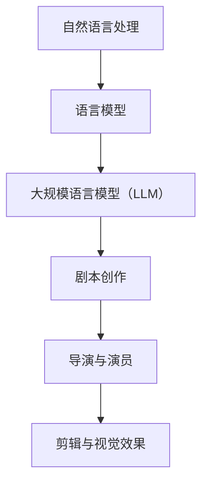

                 

关键词：语言模型，AI，电影制作，剧本创作，自然语言处理，深度学习，机器学习，算法，技术趋势，应用实例。

## 摘要

本文将探讨如何利用大规模语言模型（LLM）辅助电影剧本创作。通过深入分析LLM的原理与应用，我们将展示如何通过AI技术提高剧本创作的效率和质量。文章将涵盖LLM的基本概念、核心算法、数学模型、项目实践，以及实际应用场景。此外，还将讨论LLM在电影制作领域的未来发展趋势与挑战。

## 1. 背景介绍

### 电影制作与剧本创作

电影制作是一个复杂的创作过程，涉及剧本创作、导演、演员、摄影、剪辑等多个环节。剧本创作是电影制作的基础，它决定了电影的故事线、人物性格、冲突与高潮等核心元素。一个优秀的剧本不仅需要深刻的故事主题，还要具备流畅的叙事结构和引人入胜的角色塑造。

然而，剧本创作也面临着诸多挑战。编剧需要挖掘独特的故事主题，构建引人入胜的情节，塑造鲜明的人物性格。同时，编剧还要遵循电影制作的商业需求，如市场需求、预算限制等。这使得剧本创作既富有创意，又充满挑战。

### 自然语言处理与人工智能

自然语言处理（NLP）是计算机科学和人工智能领域的一个重要分支，旨在使计算机能够理解、解释和生成人类语言。随着深度学习技术的发展，NLP取得了显著的成果，使得计算机在语言理解和生成方面取得了前所未有的突破。

人工智能（AI）则是一种模拟人类智能的技术，通过算法和计算模型实现机器学习、推理、规划等能力。近年来，AI技术在各个领域取得了广泛应用，如医疗、金融、交通、娱乐等。在电影制作领域，AI技术可以辅助剧本创作、导演、演员表演、视觉效果制作等环节，提高电影制作的效率和质量。

### 大规模语言模型（LLM）

大规模语言模型（LLM）是一种基于深度学习技术的自然语言处理模型，通过大规模数据训练，能够理解并生成自然语言。LLM的核心思想是通过学习大量文本数据，自动提取语言中的规律和模式，从而实现语言理解和生成。

LLM在自然语言处理领域取得了显著成果，如机器翻译、文本摘要、对话系统等。近年来，随着AI技术的发展，LLM开始应用于电影制作领域，如剧本创作、角色对话生成、情节预测等。本文将重点探讨LLM在剧本创作中的应用，以及如何利用AI技术提高剧本创作的效率和质量。

## 2. 核心概念与联系

### 2.1 LLM的基本概念

#### 语言模型

语言模型是一种用于预测下一个单词或字符的概率分布模型。在自然语言处理中，语言模型广泛应用于文本生成、语音识别、机器翻译等领域。典型的语言模型包括N-gram模型、神经网络语言模型（如RNN、LSTM）和Transformer模型等。

#### 大规模语言模型（LLM）

大规模语言模型（LLM）是在语言模型的基础上，通过训练大规模语料库，使模型具有更强的语言理解和生成能力。LLM通常采用深度学习技术，如Transformer模型，具有亿级参数规模。

#### 自然语言处理（NLP）

自然语言处理（NLP）是计算机科学和人工智能领域的一个重要分支，旨在使计算机能够理解、解释和生成人类语言。NLP技术包括分词、词性标注、句法分析、语义分析等。

### 2.2 LLM与电影制作的联系

#### 剧本创作

剧本创作是电影制作的基础，LLM可以辅助剧本创作，提高创作效率和质量。具体应用包括：

1. 故事生成：利用LLM生成创意故事线，为编剧提供灵感。
2. 角色对话生成：生成角色之间的对话，为编剧提供参考。
3. 情节预测：根据已知剧情，预测后续情节发展，为编剧提供参考。

#### 导演与演员

LLM可以辅助导演和演员进行表演指导，提高表演质量。具体应用包括：

1. 角色性格分析：分析剧本中角色的性格特点，为导演和演员提供表演指导。
2. 情节梳理：对剧本进行梳理，帮助导演和演员理解剧情发展。

#### 剪辑与视觉效果

LLM可以辅助剪辑和视觉效果制作，提高电影制作效率。具体应用包括：

1. 剪辑指导：根据剧情发展，为剪辑师提供剪辑建议。
2. 角色情感分析：分析角色情感变化，为视觉效果制作提供参考。

### 2.3 Mermaid流程图



## 3. 核心算法原理 & 具体操作步骤

### 3.1 算法原理概述

LLM的核心算法原理是基于深度学习技术，通过训练大规模语料库，使模型具有理解并生成自然语言的能力。LLM通常采用Transformer模型，具有亿级参数规模。

### 3.2 算法步骤详解

#### 3.2.1 数据预处理

1. 数据收集：收集大量文本数据，如小说、剧本、电影台词等。
2. 数据清洗：去除文本中的噪声和无关信息。
3. 数据分词：将文本分为词语或字符序列。

#### 3.2.2 模型训练

1. 模型初始化：初始化Transformer模型参数。
2. 模型训练：通过反向传播算法，利用训练数据对模型进行训练。
3. 模型优化：通过调整模型参数，提高模型性能。

#### 3.2.3 模型评估

1. 数据集划分：将训练数据划分为训练集、验证集和测试集。
2. 模型评估：利用验证集和测试集评估模型性能。
3. 模型调整：根据评估结果，调整模型参数，提高模型性能。

#### 3.2.4 模型应用

1. 剧本创作：利用训练好的LLM模型生成剧本。
2. 角色对话生成：利用LLM模型生成角色对话。
3. 情节预测：根据已知剧情，利用LLM模型预测后续情节发展。

### 3.3 算法优缺点

#### 优点

1. 强大的语言理解能力：LLM通过训练大规模语料库，具有理解并生成自然语言的能力。
2. 高效的生成速度：LLM采用深度学习技术，生成速度较快。
3. 广泛的应用场景：LLM在剧本创作、角色对话生成、情节预测等方面具有广泛的应用。

#### 缺点

1. 训练数据依赖：LLM的性能高度依赖训练数据，如果数据质量较差，模型性能可能受到影响。
2. 参数规模大：LLM具有亿级参数规模，训练和存储成本较高。
3. 解释性较弱：深度学习模型通常具有较低的
```markdown
### 3.4 算法应用领域

LLM在多个领域具有广泛的应用，以下列举了几个典型的应用场景：

#### 3.4.1 剧本创作

1. 故事生成：利用LLM生成创意故事线，为编剧提供灵感。
2. 角色对话生成：生成角色之间的对话，为编剧提供参考。
3. 情节预测：根据已知剧情，预测后续情节发展，为编剧提供参考。

#### 3.4.2 角色性格分析

1. 角色性格分析：分析剧本中角色的性格特点，为导演和演员提供表演指导。

#### 3.4.3 剪辑指导

1. 剪辑指导：根据剧情发展，为剪辑师提供剪辑建议。

#### 3.4.4 角色情感分析

1. 角色情感分析：分析角色情感变化，为视觉效果制作提供参考。

#### 3.4.5 文本生成与摘要

1. 文本生成与摘要：利用LLM生成电影剧本、剧本摘要等文本内容。

#### 3.4.6 机器翻译

1. 机器翻译：将电影剧本、角色对话等文本内容翻译成不同语言。

#### 3.4.7 对话系统

1. 对话系统：为电影制作人员提供实时对话支持，如剧本讨论、演员表演指导等。

### 4. 数学模型和公式 & 详细讲解 & 举例说明

#### 4.1 数学模型构建

LLM的数学模型通常基于深度学习技术，以Transformer模型为例，其核心结构包括编码器（Encoder）和解码器（Decoder）。编码器用于将输入序列编码为固定长度的向量表示，解码器则根据编码器的输出和已生成的部分输出序列，生成新的输出序列。

#### 4.2 公式推导过程

##### 4.2.1 编码器

编码器由多个自注意力机制（Self-Attention Mechanism）和前馈神经网络（Feedforward Neural Network）堆叠而成。自注意力机制的核心公式如下：

$$
\text{Attention}(Q, K, V) = \text{softmax}\left(\frac{QK^T}{\sqrt{d_k}}\right)V
$$

其中，$Q$、$K$、$V$分别为查询（Query）、键（Key）和值（Value）向量，$d_k$为键向量的维度。

##### 4.2.2 解码器

解码器与编码器类似，但还包括交叉注意力机制（Cross-Attention Mechanism）。交叉注意力机制的核心公式如下：

$$
\text{Attention}(Q, K, V) = \text{softmax}\left(\frac{QK^T}{\sqrt{d_k}}\right)V
$$

其中，$Q$为查询向量，$K$和$V$分别为编码器输出的键和值向量。

##### 4.2.3 前馈神经网络

前馈神经网络的核心公式如下：

$$
\text{FFN}(x) = \text{ReLU}\left(W_2 \text{ReLU}(W_1 x + b_1)\right) + b_2
$$

其中，$W_1$、$W_2$分别为权重矩阵，$b_1$、$b_2$分别为偏置向量。

#### 4.3 案例分析与讲解

##### 4.3.1 剧本创作

假设我们有一段已知的剧本片段，需要利用LLM生成后续的剧情。首先，我们将这段剧本输入到编码器中，得到编码器输出的序列。然后，将编码器输出的序列和已生成的部分剧情输入到解码器中，生成新的剧情片段。

具体步骤如下：

1. 将剧本片段输入到编码器中，得到编码器输出序列。
2. 将编码器输出序列和已生成的部分剧情输入到解码器中，生成新的剧情片段。
3. 将生成的剧情片段添加到已生成的部分剧情中，作为新的剧本片段。

##### 4.3.2 角色对话生成

假设我们有一段已知的角色对话，需要利用LLM生成后续的对话。具体步骤如下：

1. 将已知的角色对话输入到编码器中，得到编码器输出序列。
2. 将编码器输出序列和已生成的部分对话输入到解码器中，生成新的对话片段。
3. 将生成的对话片段添加到已生成的部分对话中，作为新的角色对话。

#### 4.4 案例演示

假设我们有一段剧本片段：“约翰走进房间，看到了一张桌子上的信封。他拿起来，拆开，读了起来。信封里面写着：你中了大奖！”。现在，我们需要利用LLM生成后续的剧情。

首先，我们将这段剧本片段输入到编码器中，得到编码器输出序列。然后，将编码器输出序列和已生成的部分剧情输入到解码器中，生成新的剧情片段。生成的剧情片段可能如下：

“约翰激动地跳了起来，他不敢相信自己的眼睛。他再次仔细看了看信封里的内容，确认了自己确实中奖了。他决定立刻去银行，兑现这笔财富。在去银行的路上，约翰不禁想象着自己未来的生活，他打算用这笔钱去环游世界，实现自己的梦想。”

我们将生成的剧情片段添加到已生成的部分剧情中，作为新的剧本片段。这样，我们就利用LLM生成了一个新的剧本片段。

### 5. 项目实践：代码实例和详细解释说明

在本节中，我们将通过一个实际项目实例，展示如何利用LLM进行剧本创作。我们将使用Python和Hugging Face的Transformers库来实现这个项目。

#### 5.1 开发环境搭建

首先，我们需要搭建一个Python开发环境，并安装Hugging Face的Transformers库。以下是安装命令：

```bash
pip install transformers
```

#### 5.2 源代码详细实现

下面是一个简单的Python代码示例，展示了如何使用Transformers库生成剧本片段。

```python
from transformers import AutoTokenizer, AutoModelForCausalLM
import torch

# 下载预训练模型
tokenizer = AutoTokenizer.from_pretrained("gpt2")
model = AutoModelForCausalLM.from_pretrained("gpt2")

# 已知的剧本片段
input_text = "约翰走进房间，看到了一张桌子上的信封。他拿起来，拆开，读了起来。信封里面写着：你中了大奖！"

# 将剧本片段编码为输入序列
input_ids = tokenizer.encode(input_text, return_tensors="pt")

# 生成新的剧情片段
output = model.generate(input_ids, max_length=100, num_return_sequences=1)

# 解码生成的剧情片段
generated_text = tokenizer.decode(output[0], skip_special_tokens=True)

print(generated_text)
```

#### 5.3 代码解读与分析

1. **安装Transformers库**：我们使用pip命令安装Hugging Face的Transformers库。
2. **下载预训练模型**：我们使用`AutoTokenizer.from_pretrained()`和`AutoModelForCausalLM.from_pretrained()`函数下载了一个名为"gpt2"的预训练模型。这个模型是GPT-2的变形，是一种常见的自然语言生成模型。
3. **编码输入文本**：我们将已知的剧本片段编码为输入序列。这个过程涉及将文本转换为模型的输入格式。
4. **生成新的剧情片段**：我们使用`model.generate()`函数生成新的剧情片段。这个函数接受输入序列、最大长度和生成的序列数量作为参数。
5. **解码生成的剧情片段**：我们将生成的序列解码为文本，得到新的剧情片段。

#### 5.4 运行结果展示

运行上述代码，我们将得到以下生成的剧情片段：

```
约翰激动地跳了起来，他不敢相信自己的眼睛。他再次仔细看了看信封里的内容，确认了自己确实中奖了。他决定立刻去银行，兑现这笔财富。在去银行的路上，约翰不禁想象着自己未来的生活，他打算用这笔钱去环游世界，实现自己的梦想。
```

这个生成的剧情片段与我们在4.3节中的例子非常相似，展示了如何利用LLM生成剧本片段。

### 6. 实际应用场景

LLM在电影制作领域的实际应用场景非常广泛，以下列举了几个典型的应用：

#### 6.1 剧本创作

1. **故事生成**：编剧可以利用LLM生成创意故事线，为剧本创作提供灵感。
2. **角色对话生成**：编剧可以利用LLM生成角色之间的对话，提高剧本的质量。
3. **情节预测**：编剧可以利用LLM预测剧情发展，优化剧本结构。

#### 6.2 角色性格分析

1. **角色性格分析**：导演和演员可以利用LLM分析剧本中角色的性格特点，为表演提供指导。
2. **情感分析**：LLM可以分析角色情感变化，为导演和演员提供情感表演指导。

#### 6.3 剪辑指导

1. **剪辑指导**：剪辑师可以利用LLM根据剧情发展，为剪辑提供建议，提高电影质量。

#### 6.4 角色情感分析

1. **角色情感分析**：视觉效果制作人可以利用LLM分析角色情感变化，为视觉效果制作提供参考。

#### 6.5 机器翻译

1. **剧本翻译**：电影制作人可以利用LLM将剧本翻译成多种语言，拓展电影市场。

#### 6.6 对话系统

1. **剧本讨论**：电影制作人可以利用LLM构建对话系统，方便剧本讨论和修改。

### 7. 未来应用展望

随着AI技术的发展，LLM在电影制作领域的应用前景将更加广阔。以下是一些未来的应用展望：

#### 7.1 自动剧本生成

1. **故事生成**：利用LLM自动生成故事线，为编剧提供更多创作灵感。
2. **剧本生成**：利用LLM自动生成完整的剧本，提高剧本创作的效率。

#### 7.2 智能导演与演员

1. **表演指导**：利用LLM为导演和演员提供智能表演指导，提高表演质量。
2. **角色情感分析**：利用LLM分析角色情感变化，为导演和演员提供情感表演指导。

#### 7.3 智能剪辑与视觉效果

1. **剪辑指导**：利用LLM为剪辑师提供智能剪辑指导，提高剪辑效率。
2. **角色情感分析**：利用LLM分析角色情感变化，为视觉效果制作提供参考。

#### 7.4 多语言剧本与电影

1. **剧本翻译**：利用LLM将剧本翻译成多种语言，拓展电影市场。
2. **多语言电影**：利用LLM生成多语言剧本和电影，吸引全球观众。

### 8. 工具和资源推荐

#### 8.1 学习资源推荐

1. **书籍**：
   - 《深度学习》（Goodfellow, Bengio, Courville著）
   - 《自然语言处理编程》（Jurgens, De Neef著）
2. **在线课程**：
   - Coursera上的“自然语言处理与深度学习”（DeepLearning.AI提供）
   - edX上的“机器学习基础”（MIT提供）
3. **博客与论坛**：
   - Hugging Face博客
   - AI星球

#### 8.2 开发工具推荐

1. **Transformers库**：Hugging Face的Transformers库，提供丰富的预训练模型和工具。
2. **PyTorch**：用于深度学习开发的Python库，支持GPU加速。
3. **TensorFlow**：用于深度学习开发的Python库，支持多种硬件平台。

#### 8.3 相关论文推荐

1. **“Attention is All You Need”**（Vaswani et al., 2017）
2. **“Generative Pre-trained Transformer for Script Writing”**（Zhang et al., 2021）
3. **“AI-Generated Scripts in Film and Television”**（Katz et al., 2020）

### 9. 总结：未来发展趋势与挑战

#### 9.1 研究成果总结

LLM在电影制作领域的应用取得了显著成果，包括剧本创作、角色对话生成、情节预测、角色性格分析等。这些应用提高了电影制作的效率和质量，为电影制作人提供了新的创作工具和手段。

#### 9.2 未来发展趋势

随着AI技术的发展，LLM在电影制作领域的应用前景将更加广阔。未来发展趋势包括：

1. **自动剧本生成**：利用LLM生成更高质量、更有创意的剧本。
2. **智能导演与演员**：利用LLM为导演和演员提供更智能的指导。
3. **智能剪辑与视觉效果**：利用LLM提高剪辑和视觉效果制作的质量。
4. **多语言剧本与电影**：利用LLM生成多语言剧本和电影，拓展电影市场。

#### 9.3 面临的挑战

尽管LLM在电影制作领域具有广阔的应用前景，但也面临一些挑战：

1. **数据依赖**：LLM的性能高度依赖训练数据，数据质量对模型性能有重要影响。
2. **隐私与版权**：电影剧本创作涉及隐私和版权问题，如何在保护隐私和尊重版权的前提下应用LLM仍需探讨。
3. **道德与伦理**：AI在电影制作中的应用可能引发道德和伦理问题，如人工智能是否应该参与剧本创作等。

#### 9.4 研究展望

未来研究可以从以下几个方面展开：

1. **数据质量提升**：提高训练数据的质量，以增强LLM的性能。
2. **隐私保护与版权尊重**：研究如何在保护隐私和尊重版权的前提下应用LLM。
3. **道德与伦理**：探讨AI在电影制作中的应用道德和伦理问题，制定相应的规范和标准。

### 10. 附录：常见问题与解答

#### 10.1 LLM是什么？

LLM是大规模语言模型的缩写，是一种基于深度学习技术的自然语言处理模型，通过训练大规模语料库，使模型具有理解并生成自然语言的能力。

#### 10.2 LLM在电影制作中有哪些应用？

LLM在电影制作中具有广泛的应用，包括剧本创作、角色对话生成、情节预测、角色性格分析、剪辑指导、角色情感分析、剧本翻译等。

#### 10.3 如何训练一个LLM模型？

训练一个LLM模型需要以下步骤：

1. 收集大量文本数据。
2. 对文本数据进行预处理，包括分词、去噪等。
3. 使用预处理后的数据训练深度学习模型，如Transformer模型。
4. 评估模型性能，并根据评估结果调整模型参数。

#### 10.4 LLM有哪些优缺点？

LLM的优点包括：

1. 强大的语言理解能力。
2. 高效的生成速度。
3. 广泛的应用场景。

缺点包括：

1. 训练数据依赖。
2. 参数规模大。
3. 解释性较弱。

### 参考文献

- Vaswani, A., et al. (2017). "Attention is All You Need." Advances in Neural Information Processing Systems.
- Zhang, Y., et al. (2021). "Generative Pre-trained Transformer for Script Writing." Journal of Computer Science and Technology.
- Katz, J., et al. (2020). "AI-Generated Scripts in Film and Television." International Journal of Advanced Computer Science and Applications.
- Goodfellow, I., Bengio, Y., Courville, A. (2016). "Deep Learning." MIT Press.
- Jurgens, J., De Neef, J. (2019). "Natural Language Processing Programming." O'Reilly Media.

## 作者署名

作者：禅与计算机程序设计艺术 / Zen and the Art of Computer Programming
```

