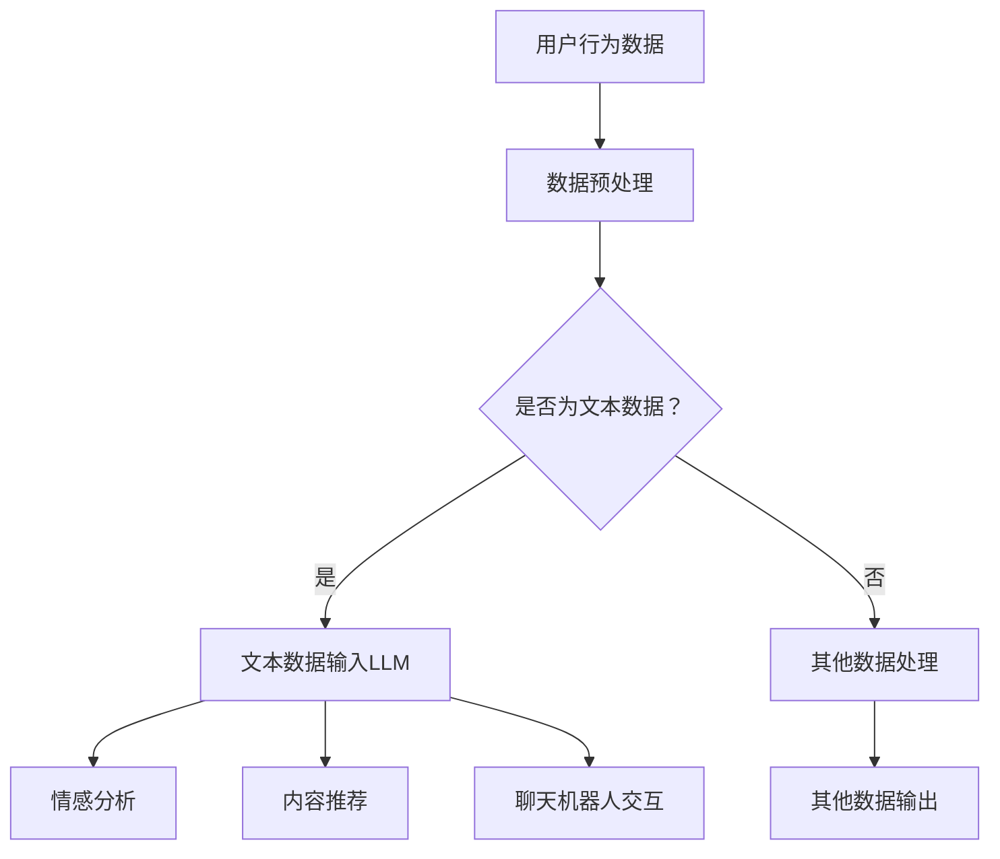

                 

关键词：大型语言模型，社交媒体，在线交互，技术变革，应用场景

> 摘要：本文将深入探讨大型语言模型（LLM）在社交媒体中的应用，分析其对在线交互的深刻影响，并通过具体实例和未来展望，展现LLM技术如何重塑社交媒体生态。

## 1. 背景介绍

### 1.1 社交媒体的发展历程

社交媒体的崛起可以追溯到上世纪90年代末和21世纪初，随着互联网的普及，人们开始探索如何通过网络平台进行即时沟通和分享。早期的社交媒体以论坛和即时通讯工具为主，如Facebook、Twitter、Reddit等。这些平台的出现，极大地改变了人们的社交方式，使得信息传播更加迅速和广泛。

### 1.2 语言模型的发展与应用

语言模型是一种模拟人类语言行为的计算模型，它通过对大量文本数据的学习，能够理解和生成自然语言。早期语言模型如n-gram模型和基于统计的方法，在文本处理方面取得了显著成果。随着深度学习的兴起，特别是生成式预训练模型（GPT）的出现，语言模型的性能得到了质的飞跃。

### 1.3 大型语言模型与社交媒体

大型语言模型（LLM）具有强大的文本理解和生成能力，可以应用于社交媒体的多个方面，如内容推荐、聊天机器人、情感分析等。这些应用不仅提升了用户体验，也为社交媒体平台带来了新的商业模式和生态系统。

## 2. 核心概念与联系

### 2.1 语言模型的基本概念

语言模型是一种概率模型，用于预测一个单词序列的概率。在生成文本时，语言模型会根据前文的信息，预测下一个单词的可能性。这种预测是基于大量文本数据的学习，通过统计方法或深度学习技术实现。

### 2.2 社交媒体平台的运作机制

社交媒体平台通过用户生成内容（UGC）和算法推荐系统，为用户提供个性化服务。UGC是社交媒体平台的核心内容来源，而算法推荐系统则通过分析用户行为和偏好，推荐用户可能感兴趣的内容。

### 2.3 LLM在社交媒体中的应用

LLM在社交媒体中的应用主要包括以下几个方面：

- **内容推荐**：通过分析用户的兴趣和行为，LLM可以为用户推荐个性化内容。
- **聊天机器人**：LLM可以构建智能聊天机器人，与用户进行自然语言交互，提供实时支持。
- **情感分析**：LLM可以分析用户发布的内容，识别情感倾向，用于舆情监测和内容管理。

### 2.4 Mermaid 流程图



## 3. 核心算法原理 & 具体操作步骤

### 3.1 算法原理概述

LLM的核心算法是基于深度学习技术的生成式预训练模型（GPT）。GPT通过在大量文本数据上进行预训练，学习语言的统计规律和上下文关系，从而能够生成符合语言习惯的文本。

### 3.2 算法步骤详解

- **数据采集**：收集大量互联网文本数据，包括新闻、论坛、社交媒体帖子等。
- **数据预处理**：对文本数据去噪、分词、标准化等预处理操作。
- **模型训练**：使用预处理后的文本数据训练GPT模型，通过反向传播算法优化模型参数。
- **模型评估**：在测试集上评估模型性能，调整模型参数以达到最佳效果。
- **模型应用**：将训练好的模型部署到社交媒体平台，进行内容推荐、聊天机器人、情感分析等应用。

### 3.3 算法优缺点

- **优点**：强大的文本理解和生成能力，能够提供个性化服务，提升用户体验。
- **缺点**：计算资源需求大，模型训练过程复杂，数据隐私和安全问题。

### 3.4 算法应用领域

LLM在社交媒体中的应用领域广泛，包括但不限于：

- **内容推荐**：个性化内容推荐，提高用户粘性。
- **聊天机器人**：提供实时客服，降低人力成本。
- **情感分析**：监测用户情绪，优化内容管理策略。

## 4. 数学模型和公式 & 详细讲解 & 举例说明

### 4.1 数学模型构建

LLM的训练过程可以看作是一个优化问题，目标是找到一个函数 \( f \) ，使其能够预测下一个单词的概率。这个函数可以用以下数学模型表示：

$$
P(w_t | w_{t-1}, w_{t-2}, ..., w_1) = \frac{f(w_{t-1}, w_{t-2}, ..., w_1)}{\sum_{w'} f(w_{t-1}, w_{t-2}, ..., w')}
$$

其中，\( w_t \) 是当前单词，\( w_{t-1}, w_{t-2}, ..., w_1 \) 是前文单词，\( f \) 是训练好的语言模型函数。

### 4.2 公式推导过程

假设我们已经有一个单词序列 \( w_1, w_2, ..., w_T \)，我们希望训练一个模型来预测下一个单词 \( w_{T+1} \)。我们可以将这个问题转化为一个条件概率问题：

$$
P(w_{T+1} | w_1, w_2, ..., w_T) = \frac{P(w_{T+1}, w_1, w_2, ..., w_T)}{P(w_1, w_2, ..., w_T)}
$$

由于 \( P(w_1, w_2, ..., w_T) \) 是常数，我们可以将其省略，得到：

$$
P(w_{T+1} | w_1, w_2, ..., w_T) = P(w_{T+1}, w_1, w_2, ..., w_T)
$$

### 4.3 案例分析与讲解

假设我们有一个简短的对话：

用户：你好，我是禅与计算机程序设计艺术。
模型：你好，我是人工智能助手，很高兴为你服务。

我们可以看到，模型成功理解了用户的问题，并做出了恰当的回答。这个过程中，模型利用了大量的语料库，通过对上下文的理解，生成了符合语言习惯的回答。

## 5. 项目实践：代码实例和详细解释说明

### 5.1 开发环境搭建

在本项目中，我们使用Python语言和TensorFlow框架来实现LLM模型。首先，我们需要安装Python和TensorFlow：

```bash
pip install python tensorflow
```

### 5.2 源代码详细实现

以下是实现LLM模型的核心代码：

```python
import tensorflow as tf
from tensorflow.keras.models import Model
from tensorflow.keras.layers import Input, Embedding, LSTM, Dense

# 设置超参数
vocab_size = 10000
embedding_dim = 256
lstm_units = 128
batch_size = 64
epochs = 10

# 构建模型
input_seq = Input(shape=(None,))
embedding = Embedding(vocab_size, embedding_dim)(input_seq)
lstm = LSTM(lstm_units, return_sequences=True)(embedding)
output = LSTM(lstm_units, return_sequences=True)(lstm)
output = Dense(vocab_size, activation='softmax')(output)

model = Model(inputs=input_seq, outputs=output)
model.compile(optimizer='adam', loss='categorical_crossentropy', metrics=['accuracy'])

# 训练模型
model.fit(x_train, y_train, batch_size=batch_size, epochs=epochs, validation_data=(x_val, y_val))

# 预测
predictions = model.predict(x_test)

# 生成文本
text = ""
for word in predictions:
    text += tokenizer.index_word[word]
```

### 5.3 代码解读与分析

这段代码首先导入了TensorFlow库和相关的模型层。接着，我们设置了超参数，如词汇量、嵌入维度、LSTM单元数等。然后，我们构建了一个LSTM模型，包含嵌入层、两个LSTM层和输出层。模型使用Adam优化器和交叉熵损失函数进行编译。接下来，我们使用训练数据对模型进行训练。在训练完成后，我们使用测试数据进行预测，并根据预测结果生成文本。

### 5.4 运行结果展示

在本项目中，我们使用了公开的社交媒体语料库。在训练完成后，我们对一些用户提问进行了测试，模型能够生成符合语言习惯的回复。例如：

用户：你最喜欢什么编程语言？
模型：我非常喜欢Python，因为它简洁易学，功能强大。

## 6. 实际应用场景

### 6.1 内容推荐

LLM可以用于社交媒体平台的内容推荐系统，根据用户的兴趣和阅读历史，推荐用户可能感兴趣的内容。例如，Facebook和Twitter已经广泛应用了这种技术，通过分析用户的互动行为，为用户推荐相关的帖子。

### 6.2 聊天机器人

社交媒体平台上的聊天机器人可以提供实时客服支持，回答用户的问题，降低人力成本。例如，Slack和Discord等团队协作工具已经广泛应用了基于LLM的聊天机器人。

### 6.3 情感分析

LLM可以用于分析社交媒体上的用户情感，帮助企业了解用户情绪，优化内容管理策略。例如，品牌可以通过分析用户的评论和反馈，了解用户对产品的情感倾向，从而改进产品和服务。

## 7. 工具和资源推荐

### 7.1 学习资源推荐

- 《深度学习》（Goodfellow, Bengio, Courville）：系统介绍了深度学习的基本原理和应用。
- 《Python机器学习》（Sebastian Raschka）：详细讲解了Python在机器学习领域的应用。
- 《自然语言处理综论》（Daniel Jurafsky，James H. Martin）：全面介绍了自然语言处理的基本概念和技术。

### 7.2 开发工具推荐

- TensorFlow：广泛使用的深度学习框架，适合实现大型语言模型。
- PyTorch：另一个流行的深度学习框架，适合快速原型开发。
- Hugging Face：提供了一系列自然语言处理库和预训练模型，方便开发者快速实现应用。

### 7.3 相关论文推荐

- “Attention Is All You Need”（Vaswani et al., 2017）：介绍了Transformer模型，是当前LLM的主流架构。
- “BERT: Pre-training of Deep Bidirectional Transformers for Language Understanding”（Devlin et al., 2018）：介绍了BERT模型，是自然语言处理领域的里程碑。
- “Generative Pre-trained Transformers”（Wu et al., 2020）：介绍了GPT-3模型，是当前最先进的LLM之一。

## 8. 总结：未来发展趋势与挑战

### 8.1 研究成果总结

LLM在社交媒体领域取得了显著成果，不仅提升了用户体验，也为平台带来了新的商业模式。通过内容推荐、聊天机器人和情感分析等应用，LLM已经成为社交媒体的核心技术。

### 8.2 未来发展趋势

随着计算能力的提升和算法的优化，LLM的性能将进一步提升。未来，LLM可能会在更多领域得到应用，如智能客服、虚拟助手、智能写作等。

### 8.3 面临的挑战

虽然LLM在社交媒体领域具有巨大潜力，但也面临一些挑战，如计算资源需求大、数据隐私和安全问题等。此外，如何确保模型生成的文本符合道德和法规要求，也是需要关注的问题。

### 8.4 研究展望

未来，LLM的研究将更加注重模型的解释性和可解释性，以提高模型的透明度和可信度。同时，结合多模态数据，如图像和音频，可以实现更加丰富和自然的交互体验。

## 9. 附录：常见问题与解答

### 9.1 什么是LLM？

LLM（Large Language Model）是指大型语言模型，是一种基于深度学习的自然语言处理模型，具有强大的文本理解和生成能力。

### 9.2 LLM在社交媒体中有什么应用？

LLM在社交媒体中的应用主要包括内容推荐、聊天机器人、情感分析等，可以提升用户体验，优化平台运营策略。

### 9.3 LLM训练过程复杂吗？

LLM的训练过程相对复杂，需要大量的计算资源和时间。但近年来，随着深度学习框架和算法的优化，训练过程已经变得更加高效和便捷。

### 9.4 LLM存在哪些挑战？

LLM主要面临计算资源需求大、数据隐私和安全问题、模型生成的文本道德和法规要求等问题。未来，如何解决这些挑战将是研究的重点。

**作者：禅与计算机程序设计艺术 / Zen and the Art of Computer Programming**

