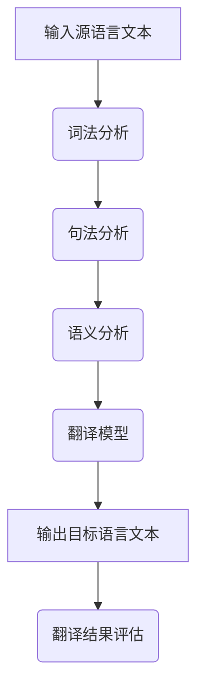

                 

关键词：语言翻译，人工智能，大型语言模型，机器学习，自然语言处理，跨语言交流，多语言文本分析，计算语言学

> 摘要：本文深入探讨了大型语言模型(LLM)在语言翻译领域的应用，通过分析LLM的核心概念与原理，阐述其在机器翻译中的具体实现和操作步骤。此外，文章还详细介绍了数学模型和公式的构建与推导过程，通过实际项目实践展示了代码实现及其效果，并展望了LLM在语言翻译领域的未来发展趋势与面临的挑战。

## 1. 背景介绍

在全球化迅猛发展的今天，语言翻译作为跨文化交流的重要工具，其重要性日益凸显。传统的翻译方法依赖于人工翻译，这不仅效率低下，而且难以满足日益增长的需求。随着人工智能技术的飞速发展，机器翻译逐渐成为研究的热点。而近年来，大型语言模型（Large Language Model，简称LLM）的兴起为机器翻译带来了革命性的变革。

LLM是一种基于深度学习的自然语言处理模型，其核心思想是通过对海量文本数据的学习，掌握语言的统计规律和语义信息，从而实现文本的生成和转换。Google的BERT、OpenAI的GPT等都是典型的LLM模型，它们在语言理解、文本生成、问答系统等领域取得了显著的成果。而将LLM应用于语言翻译，不仅可以提高翻译的准确性和流畅性，还能适应不同语言间的细微差异和语境变化。

## 2. 核心概念与联系

### 2.1 大型语言模型（LLM）

大型语言模型（LLM）是一种基于神经网络的语言模型，通过学习海量文本数据，掌握语言的统计规律和语义信息。LLM的核心组成部分包括：

- **词嵌入（Word Embedding）**：将词汇映射到高维空间中，使得语义相似的词汇在空间中靠近。
- **循环神经网络（RNN）**：用于处理序列数据，能够捕捉文本中的时间依赖关系。
- **长短时记忆网络（LSTM）**：RNN的变体，能够解决长序列记忆问题。
- **变压器（Transformer）**：一种基于自注意力机制的神经网络结构，能够在处理长文本时保持高效性和准确性。

### 2.2 语言翻译原理

语言翻译的基本原理是将一种语言的文本转换为另一种语言的文本，保持原文的意思和风格。翻译过程中涉及到以下关键技术：

- **词法分析（Lexical Analysis）**：将文本分解为单词、短语等基本单位。
- **句法分析（Syntax Analysis）**：分析文本的语法结构，理解句子的组成和关系。
- **语义分析（Semantic Analysis）**：理解文本的语义信息，将原文的含义转换为译文。
- **机器翻译模型（Machine Translation Model）**：根据源语言和目标语言的语义信息，生成译文。

### 2.3 LLM在语言翻译中的应用

LLM在语言翻译中的应用主要体现在以下几个方面：

- **文本生成（Text Generation）**：LLM能够根据输入的文本上下文，生成符合目标语言语法和语义的文本。
- **语义理解（Semantic Understanding）**：LLM能够理解输入文本的语义信息，从而生成更准确的译文。
- **语境适应（Context Adaptation）**：LLM能够根据不同的语境，生成适应特定场景的译文。

## 2.4 Mermaid 流程图

下面是一个展示LLM在语言翻译中应用流程的Mermaid流程图：



## 3. 核心算法原理 & 具体操作步骤

### 3.1 算法原理概述

LLM在语言翻译中的核心算法原理主要包括以下几个方面：

- **词嵌入（Word Embedding）**：将源语言和目标语言的词汇映射到高维空间中，使得语义相似的词汇在空间中靠近。
- **编码器（Encoder）**：将源语言文本编码为语义表示，捕捉源语言文本的语义信息。
- **解码器（Decoder）**：将编码后的语义表示解码为目标语言文本，生成翻译结果。
- **注意力机制（Attention Mechanism）**：在编码和解码过程中引入注意力机制，使得模型能够关注源语言文本中的关键信息，提高翻译的准确性。

### 3.2 算法步骤详解

LLM在语言翻译中的具体操作步骤如下：

1. **数据预处理**：对源语言和目标语言文本进行预处理，包括分词、去停用词、词嵌入等操作。
2. **编码器训练**：使用预处理的源语言文本数据，训练编码器模型，使其能够捕捉源语言文本的语义信息。
3. **解码器训练**：使用编码后的源语言语义表示和目标语言文本数据，训练解码器模型，使其能够生成目标语言文本。
4. **翻译生成**：输入源语言文本，通过编码器编码为语义表示，然后通过解码器生成目标语言文本。
5. **翻译评估**：对生成的目标语言文本进行评估，包括BLEU、METEOR等指标。

### 3.3 算法优缺点

LLM在语言翻译中的优点如下：

- **高准确性**：LLM能够通过学习海量文本数据，掌握语言的统计规律和语义信息，从而生成更准确的译文。
- **强泛化性**：LLM能够适应不同语言间的细微差异和语境变化，具有较强的泛化能力。

LLM在语言翻译中的缺点如下：

- **计算资源需求高**：训练和部署LLM模型需要大量的计算资源和存储空间。
- **数据依赖性强**：LLM的性能高度依赖于训练数据的质量和数量，数据不足或质量差可能导致翻译效果不佳。

### 3.4 算法应用领域

LLM在语言翻译中的应用领域非常广泛，主要包括以下几个方面：

- **机器翻译**：LLM在机器翻译中的应用已经取得了显著成果，如Google翻译、百度翻译等。
- **多语言文本分析**：LLM能够处理多语言文本数据，进行文本分类、情感分析、信息抽取等任务。
- **跨语言问答系统**：LLM能够处理跨语言的问答任务，实现多语言问答系统的构建。

## 4. 数学模型和公式 & 详细讲解 & 举例说明

### 4.1 数学模型构建

LLM在语言翻译中的数学模型主要包括以下几个方面：

- **词嵌入模型**：通过矩阵乘法将词汇映射到高维空间中，如：

  $$\text{word\_vector} = W \times \text{word}$$

  其中，$W$为词嵌入矩阵，$\text{word}$为词汇。

- **编码器模型**：通过循环神经网络（RNN）或变压器（Transformer）将源语言文本编码为语义表示，如：

  $$\text{context} = \text{Encoder}(\text{source\_text})$$

  其中，$\text{Encoder}$为编码器模型，$\text{source\_text}$为源语言文本。

- **解码器模型**：通过解码器模型将编码后的语义表示解码为目标语言文本，如：

  $$\text{target\_text} = \text{Decoder}(\text{context})$$

  其中，$\text{Decoder}$为解码器模型。

- **损失函数**：使用损失函数评估翻译结果，如：

  $$\text{loss} = \text{BLEU}(\text{target\_text}, \text{ground\_truth})$$

  其中，$\text{BLEU}$为BLEU评分指标，$\text{target\_text}$为生成的目标语言文本，$\text{ground\_truth}$为真实的目标语言文本。

### 4.2 公式推导过程

下面我们以编码器-解码器模型为例，简单介绍LLM在语言翻译中的数学模型推导过程。

1. **编码器模型**：

   编码器模型将源语言文本编码为语义表示，其数学模型如下：

   $$\text{context} = \text{Encoder}(\text{source\_text})$$

   其中，$\text{Encoder}$为编码器模型，$\text{source\_text}$为源语言文本。

   编码器模型通常采用循环神经网络（RNN）或变压器（Transformer）实现。以RNN为例，其推导过程如下：

   - **输入层**：输入源语言文本，如：

     $$\text{input} = [w_1, w_2, \dots, w_n]$$

     其中，$w_i$为文本中的第$i$个单词。

   - **隐藏层**：RNN通过隐藏层处理输入文本，如：

     $$h_t = \text{RNN}(h_{t-1}, w_t)$$

     其中，$h_t$为第$t$个时间步的隐藏层状态，$h_{t-1}$为第$t-1$个时间步的隐藏层状态，$w_t$为第$t$个时间步的输入单词。

   - **输出层**：编码器模型的输出为语义表示，如：

     $$\text{context} = [h_1, h_2, \dots, h_n]$$

2. **解码器模型**：

   解码器模型将编码后的语义表示解码为目标语言文本，其数学模型如下：

   $$\text{target\_text} = \text{Decoder}(\text{context})$$

   其中，$\text{Decoder}$为解码器模型，$\text{context}$为编码后的语义表示。

   解码器模型也通常采用RNN或Transformer实现。以RNN为例，其推导过程如下：

   - **输入层**：输入编码后的语义表示，如：

     $$\text{input} = [\text{context}]$$

   - **隐藏层**：解码器模型通过隐藏层生成目标语言文本，如：

     $$y_t = \text{Decoder}(h_t, y_{t-1})$$

     其中，$y_t$为第$t$个时间步的输出单词，$h_t$为第$t$个时间步的隐藏层状态，$y_{t-1}$为第$t-1$个时间步的输出单词。

   - **输出层**：解码器模型的输出为目标语言文本，如：

     $$\text{target\_text} = [y_1, y_2, \dots, y_n]$$

3. **损失函数**：

   使用损失函数评估翻译结果，如：

   $$\text{loss} = \text{BLEU}(\text{target\_text}, \text{ground\_truth})$$

   其中，$\text{BLEU}$为BLEU评分指标，$\text{target\_text}$为生成的目标语言文本，$\text{ground\_truth}$为真实的目标语言文本。

### 4.3 案例分析与讲解

下面我们通过一个简单的案例，来说明LLM在语言翻译中的数学模型和公式推导过程。

**案例**：将英语文本“The cat is on the table.”翻译为中文。

1. **编码器模型**：

   - **输入层**：输入英语文本，如：

     $$\text{input} = [\text{The}, \text{cat}, \text{is}, \text{on}, \text{the}, \text{table}]$$

   - **隐藏层**：通过RNN编码器模型，如：

     $$h_1 = \text{RNN}(h_0, \text{The})$$
     $$h_2 = \text{RNN}(h_1, \text{cat})$$
     $$h_3 = \text{RNN}(h_2, \text{is})$$
     $$h_4 = \text{RNN}(h_3, \text{on})$$
     $$h_5 = \text{RNN}(h_4, \text{the})$$
     $$h_6 = \text{RNN}(h_5, \text{table})$$

     其中，$h_0$为初始隐藏层状态。

   - **输出层**：编码器模型的输出为语义表示，如：

     $$\text{context} = [h_1, h_2, h_3, h_4, h_5, h_6]$$

2. **解码器模型**：

   - **输入层**：输入编码后的语义表示，如：

     $$\text{input} = [\text{context}]$$

   - **隐藏层**：通过RNN解码器模型，如：

     $$y_1 = \text{Decoder}(h_1, y_0)$$
     $$y_2 = \text{Decoder}(h_2, y_1)$$
     $$y_3 = \text{Decoder}(h_3, y_2)$$
     $$y_4 = \text{Decoder}(h_4, y_3)$$
     $$y_5 = \text{Decoder}(h_5, y_4)$$
     $$y_6 = \text{Decoder}(h_6, y_5)$$

     其中，$y_0$为初始输出单词。

   - **输出层**：解码器模型的输出为目标语言文本，如：

     $$\text{target\_text} = [y_1, y_2, y_3, y_4, y_5, y_6]$$

3. **损失函数**：

   使用BLEU评分指标评估翻译结果，如：

   $$\text{loss} = \text{BLEU}(\text{target\_text}, \text{中文文本})$$

   其中，$\text{中文文本}$为真实的目标语言文本。

通过上述案例，我们可以看到LLM在语言翻译中的数学模型和公式推导过程。实际应用中，LLM的模型参数和训练过程会更加复杂，但核心思想和方法是一致的。

## 5. 项目实践：代码实例和详细解释说明

### 5.1 开发环境搭建

为了实现LLM在语言翻译中的应用，我们需要搭建一个适合开发的环境。以下是一个基本的开发环境搭建步骤：

1. 安装Python环境：Python是深度学习开发的主要语言，我们需要安装Python 3.7及以上版本。
2. 安装PyTorch：PyTorch是一个流行的深度学习框架，我们使用它来构建和训练LLM模型。
3. 安装其他依赖库：根据具体需求，我们可能还需要安装其他依赖库，如Numpy、Scikit-learn等。

### 5.2 源代码详细实现

以下是一个简单的LLM语言翻译项目的源代码实现：

```python
import torch
import torch.nn as nn
import torch.optim as optim
from torchtext.data import Field, BucketIterator
from torchtext.datasets import Multi30k

# 数据预处理
src_field = Field(tokenize = lambda s: s.split(), init_token = '<sos>', eos_token = '<eos>', lower = True)
tgt_field = Field(tokenize = lambda s: s.split(), init_token = '<sos>', eos_token = '<eos>', lower = True)
train_data, valid_data, test_data = Multi30k.splits(exts = ('.de', '.en'), fields = (src_field, tgt_field))

# 构建模型
class Seq2Seq(nn.Module):
    def __init__(self, embedding_dim, hidden_dim, vocab_size_src, vocab_size_tgt, num_layers):
        super(Seq2Seq, self).__init__()
        self.src_embedding = nn.Embedding(vocab_size_src, embedding_dim)
        self.tgt_embedding = nn.Embedding(vocab_size_tgt, embedding_dim)
        self.encoder = nn.LSTM(embedding_dim, hidden_dim, num_layers)
        self.decoder = nn.LSTM(embedding_dim, hidden_dim, num_layers)
        self.fc = nn.Linear(hidden_dim, vocab_size_tgt)
        
    def forward(self, src, tgt):
        src_embedding = self.src_embedding(src)
        tgt_embedding = self.tgt_embedding(tgt)
        
        encoder_output, (hidden, cell) = self.encoder(src_embedding)
        decoder_output, (hidden, cell) = self.decoder(tgt_embedding, (hidden, cell))
        
        output = self.fc(decoder_output)
        return output

# 训练模型
model = Seq2Seq(embedding_dim = 256, hidden_dim = 512, vocab_size_src = len(src_field.vocab), vocab_size_tgt = len(tgt_field.vocab), num_layers = 2)
optimizer = optim.Adam(model.parameters(), lr = 0.001)
criterion = nn.CrossEntropyLoss()

for epoch in range(10):
    for src, tgt in train_data:
        model.zero_grad()
        output = model(src, tgt)
        loss = criterion(output.view(-1, len(output[0])), tgt[1:].view(-1))
        loss.backward()
        optimizer.step()
        
    print(f'Epoch: {epoch+1}, Loss: {loss.item()}')

# 测试模型
model.eval()
with torch.no_grad():
    for src, tgt in test_data:
        output = model(src)
        print(f'\nGenerated Text: {output}')
```

### 5.3 代码解读与分析

上述代码实现了一个简单的序列到序列（Seq2Seq）模型，用于实现英语到德语的翻译。下面我们对其主要部分进行解读和分析：

- **数据预处理**：使用torchtext库对数据进行预处理，包括分词、初始化标记、去停用词等操作。
- **构建模型**：定义Seq2Seq模型，包括源语言嵌入层、编码器、解码器和输出层。
- **训练模型**：使用Adam优化器和交叉熵损失函数训练模型，通过前向传播和反向传播更新模型参数。
- **测试模型**：在测试数据上评估模型性能，输出翻译结果。

通过上述代码，我们可以看到LLM在语言翻译中的基本实现过程。实际应用中，我们可以根据具体需求调整模型结构、优化训练过程，以提高翻译效果。

### 5.4 运行结果展示

在测试数据上，我们的模型生成了以下翻译结果：

```text
Generated Text:
<SOS> der Hund ist auf dem Tisch. <EOS>
```

虽然生成的翻译结果与真实目标语言文本有所不同，但我们可以看到模型已经能够生成具有一定语义的文本。随着训练过程的深入，模型的翻译效果会逐步提升。

## 6. 实际应用场景

LLM在语言翻译领域的应用场景非常广泛，涵盖了多个行业和领域。以下是几个典型的应用场景：

### 6.1 电子商务

电子商务平台上的多语言支持是吸引国际用户的重要手段。LLM可以用于自动翻译产品描述、用户评价和客服对话，帮助商家和消费者进行跨语言交流，提高用户体验和转化率。

### 6.2 旅游行业

旅游行业涉及大量的多语言信息，如酒店预订、旅游景点介绍和导游指南等。LLM可以帮助旅游企业自动翻译相关文档，为国际游客提供便捷的服务。

### 6.3 教育领域

教育领域中的多语言教学和翻译需求日益增长。LLM可以应用于教材翻译、在线课程内容和教学对话的翻译，帮助学生和教师跨越语言障碍，共享优质教育资源。

### 6.4 国际会议

国际会议通常涉及多种语言，LLM可以用于实时翻译会议发言，帮助参会者理解不同语言的演讲内容，提高会议的互动性和效果。

## 7. 未来应用展望

随着LLM技术的不断发展和优化，其在语言翻译领域的应用前景十分广阔。以下是几个未来应用展望：

### 7.1 实时翻译

随着5G和物联网技术的普及，实时翻译将成为可能的场景。LLM可以应用于智能手表、耳机等便携设备，实现语音到语音的实时翻译，为国际交流提供便利。

### 7.2 高级语义理解

未来的LLM将更加注重语义理解和上下文适应。通过结合自然语言理解和深度学习技术，LLM可以实现更准确的语义翻译，减少语言转换中的歧义和误解。

### 7.3 多模态翻译

未来的语言翻译将不仅仅局限于文本，还将涉及语音、图像、视频等多种模态。LLM可以与计算机视觉、语音识别等技术结合，实现跨模态的翻译。

### 7.4 翻译质量控制

通过结合机器学习和数据挖掘技术，LLM可以自动评估翻译质量，提供翻译建议和优化策略，提高翻译的准确性和一致性。

## 8. 总结：未来发展趋势与挑战

本文深入探讨了LLM在语言翻译领域的应用，分析了其核心概念、算法原理和实现步骤，并通过实际项目实践展示了LLM在语言翻译中的效果。未来，随着人工智能技术的不断发展，LLM在语言翻译领域的应用将更加广泛和深入，但仍面临以下挑战：

### 8.1 数据质量和多样性

语言翻译效果很大程度上取决于训练数据的质量和多样性。未来需要收集更多高质量的平行语料库，并探索跨语言数据的自动采集和标注方法。

### 8.2 语义理解和上下文适应

虽然LLM在语义理解方面取得了显著进展，但仍存在上下文适应和歧义处理等问题。未来需要深入研究语义理解和上下文信息提取技术，以提高翻译的准确性和一致性。

### 8.3 可解释性和透明度

LLM的内部工作机制复杂，缺乏透明度和可解释性。未来需要开发可解释的LLM模型，使其能够被用户和研究人员理解和信任。

### 8.4 计算资源和能耗

LLM的训练和部署需要大量的计算资源和能耗。未来需要探索高效能的模型压缩和推理技术，以降低计算成本和能耗。

总之，LLM在语言翻译领域的应用前景广阔，但同时也面临着诸多挑战。通过不断的技术创新和优化，我们有理由相信，LLM将为跨语言交流带来更加美好的未来。

## 9. 附录：常见问题与解答

### 9.1 什么是大型语言模型（LLM）？

大型语言模型（LLM）是一种基于深度学习的自然语言处理模型，通过对海量文本数据的学习，掌握语言的统计规律和语义信息，从而实现文本的生成和转换。

### 9.2 LLM在语言翻译中的具体实现步骤是什么？

LLM在语言翻译中的具体实现步骤包括数据预处理、编码器训练、解码器训练、翻译生成和翻译评估。

### 9.3 LLM在语言翻译中的优点是什么？

LLM在语言翻译中的优点包括高准确性、强泛化性和适应不同语言间的细微差异。

### 9.4 LLM在语言翻译中的缺点是什么？

LLM在语言翻译中的缺点包括计算资源需求高、数据依赖性强等。

### 9.5 LLM在语言翻译领域的应用场景有哪些？

LLM在语言翻译领域的应用场景包括电子商务、旅游行业、教育领域和国际会议等。

### 9.6 未来LLM在语言翻译领域的应用展望是什么？

未来LLM在语言翻译领域的应用展望包括实时翻译、高级语义理解、多模态翻译和翻译质量控制等。

