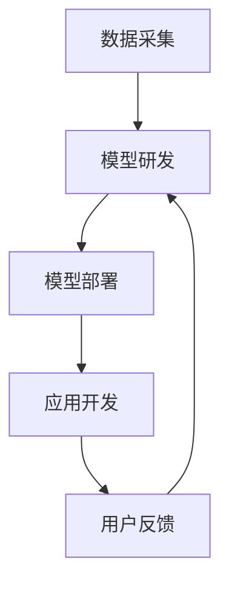

                 

关键词：语言大模型（LLM）、产业链、AI价值、重塑、新机遇、技术发展、产业变革

> 摘要：本文深入探讨了语言大模型（LLM）产业链的形成及其对AI价值重塑的重要影响。通过对LLM的基本概念、核心算法、数学模型、项目实践和实际应用场景的详细分析，本文旨在揭示LLM在当前技术浪潮中的核心地位，并展望其未来的发展方向和挑战。

## 1. 背景介绍

随着人工智能技术的快速发展，尤其是深度学习、自然语言处理（NLP）等领域的突破，我们见证了语言大模型（LLM，Large Language Model）的崛起。LLM是一类能够理解和生成自然语言的大型神经网络模型，它们通过训练海量文本数据，掌握了丰富的语言知识和表达方式。LLM的出现，极大地提升了AI在语言处理任务上的性能，从而推动了自然语言处理技术的广泛应用。

在过去的几年中，LLM技术取得了显著的进展。最早的LLM模型如GPT（Generative Pre-trained Transformer）系列，使得机器在文本生成、问答系统、机器翻译等任务中表现出色。随后，BERT（Bidirectional Encoder Representations from Transformers）、T5（Text-To-Text Transfer Transformer）等模型相继问世，进一步提升了LLM的能力。这些模型的成功，不仅引起了学术界的广泛关注，也吸引了大量企业和资本的投入。

## 2. 核心概念与联系

### 2.1. LLM基本概念

语言大模型（LLM）是基于深度学习和Transformer架构构建的。Transformer架构引入了自注意力机制，使得模型能够在处理序列数据时考虑全局信息，从而大幅提升了模型的性能。LLM通常由以下几个关键部分组成：

- **嵌入层（Embedding Layer）**：将输入的单词或子词转换为固定长度的向量表示。
- **编码器（Encoder）**：通过自注意力机制处理输入序列，生成编码表示。
- **解码器（Decoder）**：利用编码表示生成输出序列。

### 2.2. LLM工作原理

LLM的工作原理可以概括为以下几个步骤：

1. **预训练（Pre-training）**：使用大量文本数据对模型进行预训练，使其掌握通用的语言规律和知识。
2. **微调（Fine-tuning）**：在特定任务数据上对模型进行微调，使其适应具体的任务需求。
3. **生成（Generation）**：利用模型生成符合语言规范的自然语言文本。

### 2.3. LLM与NLP联系

LLM是自然语言处理（NLP）领域的重要工具。NLP涉及文本的预处理、语义理解、情感分析、问答系统等多个方面。LLM通过其强大的语言理解和生成能力，能够高效地完成这些任务。例如，LLM可以用于生成文章、自动回答用户问题、进行机器翻译等。

### 2.4. LLM产业链概述

LLM产业链包括以下几个主要环节：

- **数据采集**：收集海量的文本数据，用于模型的预训练。
- **模型研发**：构建和优化LLM模型，提升其性能和适用性。
- **模型部署**：将LLM模型应用于实际场景，如问答系统、自动翻译等。
- **应用开发**：基于LLM模型开发各种应用场景，满足不同用户的需求。

以下是LLM产业链的Mermaid流程图：



## 3. 核心算法原理 & 具体操作步骤

### 3.1. 算法原理概述

LLM的核心算法是基于Transformer架构的。Transformer引入了自注意力机制，使得模型在处理序列数据时能够考虑全局信息，从而提升了模型的性能。自注意力机制通过计算序列中每个元素与其余元素的相关性，为每个元素生成一个权重，从而实现对序列的加权处理。

### 3.2. 算法步骤详解

1. **嵌入层**：将输入的单词或子词转换为向量表示。通常使用词嵌入（word embedding）技术，如Word2Vec、GloVe等。
2. **编码器**：通过自注意力机制处理输入序列，生成编码表示。编码器由多个编码层（Encoder Layer）组成，每层包含多头自注意力机制和前馈网络。
3. **解码器**：利用编码表示生成输出序列。解码器同样由多个解码层（Decoder Layer）组成，每层包含多头自注意力机制、掩码自注意力机制和前馈网络。
4. **输出层**：将解码器的输出通过全连接层和Softmax函数转化为概率分布，从而生成预测的输出序列。

### 3.3. 算法优缺点

**优点**：

- **强大的语言理解能力**：LLM通过预训练和微调，能够理解复杂的语言结构和语义，从而在自然语言处理任务中表现出色。
- **灵活的生成能力**：LLM能够生成符合语言规范的自然语言文本，适用于文本生成、问答系统、机器翻译等多种应用场景。
- **高效的处理速度**：随着模型规模的增加，LLM的处理速度也在不断提高，从而满足实时应用的需求。

**缺点**：

- **计算资源消耗大**：构建和训练LLM模型需要大量的计算资源，特别是在大规模训练和微调阶段。
- **数据依赖性强**：LLM的性能在很大程度上依赖于训练数据的数量和质量，如果数据存在偏差，模型可能无法正确理解语言。

### 3.4. 算法应用领域

LLM在多个领域都有广泛的应用，包括：

- **文本生成**：如文章生成、故事创作、歌词编写等。
- **问答系统**：如智能客服、问答机器人等。
- **机器翻译**：如多语言翻译、实时字幕等。
- **文本摘要**：如文章摘要、会议纪要等。
- **情感分析**：如社交媒体情感分析、客户满意度分析等。

## 4. 数学模型和公式 & 详细讲解 & 举例说明

### 4.1. 数学模型构建

LLM的数学模型主要包括嵌入层、编码器、解码器和输出层。以下是对各层数学模型的详细介绍。

#### 嵌入层

嵌入层将输入的单词或子词转换为向量表示。假设词汇表中有\( V \)个单词，每个单词对应一个向量\( e \in \mathbb{R}^d \)，则输入序列\( x \)的嵌入表示为：

\[ 
\text{Embedding}(x) = \{ e_{x_i} \}_{i=1}^{n} 
\]

其中，\( x_i \)为输入序列中的第\( i \)个单词，\( n \)为输入序列的长度。

#### 编码器

编码器由多个编码层组成，每层包含多头自注意力机制和前馈网络。假设编码器有\( L \)个编码层，每个编码层\( h_l \)的输出为：

\[ 
h_l = \text{Encoder}(h_{l-1}) = \text{MultiHeadAttention}(h_{l-1}, h_{l-1}) + \text{FFN}(h_{l-1}) 
\]

其中，\( h_{l-1} \)为上一层的输出，\( \text{MultiHeadAttention} \)为多头自注意力机制，\( \text{FFN} \)为前馈网络。

#### 解码器

解码器同样由多个解码层组成，每层包含多头自注意力机制、掩码自注意力机制和前馈网络。假设解码器有\( L \)个解码层，每个解码层\( h_l \)的输出为：

\[ 
h_l = \text{Decoder}(h_{l-1}) = \text{MaskedMultiHeadAttention}(h_{l-1}, h_{l-1}) + \text{FFN}(h_{l-1}) 
\]

其中，\( h_{l-1} \)为上一层的输出，\( \text{MaskedMultiHeadAttention} \)为带掩码的多头自注意力机制，\( \text{FFN} \)为前馈网络。

#### 输出层

输出层将解码器的输出通过全连接层和Softmax函数转化为概率分布，从而生成预测的输出序列。假设输出层为\( o \)，则输出序列的概率分布为：

\[ 
\text{Logits}(o) = \text{OutputLayer}(h_L) = W_o h_L 
\]

\[ 
\text{Probabilities}(o) = \text{Softmax}(\text{Logits}(o)) 
\]

其中，\( W_o \)为输出层的权重矩阵，\( \text{Softmax} \)为Softmax函数。

### 4.2. 公式推导过程

以下是对LLM关键公式的推导过程。

#### 嵌入层

假设输入序列为\( x = \{x_1, x_2, \ldots, x_n\} \)，每个单词的向量表示为\( e_i \in \mathbb{R}^d \)，则输入序列的嵌入表示为：

\[ 
\text{Embedding}(x) = \{ e_{x_i} \}_{i=1}^{n} 
\]

#### 编码器

编码器的输出可以表示为：

\[ 
h_l = \text{Encoder}(h_{l-1}) = \text{MultiHeadAttention}(h_{l-1}, h_{l-1}) + \text{FFN}(h_{l-1}) 
\]

其中，多头自注意力机制的公式为：

\[ 
\text{Attention}(Q, K, V) = \text{softmax}\left(\frac{QK^T}{\sqrt{d_k}}\right)V 
\]

前馈网络的公式为：

\[ 
\text{FFN}(x) = \text{ReLU}(W_2 \text{ReLU}(W_1 x)) 
\]

#### 解码器

解码器的输出可以表示为：

\[ 
h_l = \text{Decoder}(h_{l-1}) = \text{MaskedMultiHeadAttention}(h_{l-1}, h_{l-1}) + \text{FFN}(h_{l-1}) 
\]

其中，带掩码的多头自注意力机制的公式为：

\[ 
\text{MaskedAttention}(Q, K, V) = \text{softmax}\left(\frac{Q(K-\text{Mask})^T}{\sqrt{d_k}}\right)V 
\]

#### 输出层

输出层的概率分布可以表示为：

\[ 
\text{Logits}(o) = \text{OutputLayer}(h_L) = W_o h_L 
\]

\[ 
\text{Probabilities}(o) = \text{Softmax}(\text{Logits}(o)) 
\]

### 4.3. 案例分析与讲解

以下是一个简单的案例，用于说明如何使用LLM进行文本生成。

#### 案例背景

假设我们有一个预训练的LLM模型，用于生成中文文章。现在，我们需要生成一篇关于人工智能的短文。

#### 实现步骤

1. **输入预处理**：将输入的中文句子转换为模型的嵌入表示。
2. **模型预测**：使用LLM模型对输入句子进行预测，生成下一个句子。
3. **文本生成**：根据模型预测的结果，不断生成新的句子，直到生成出满足要求的文章。

#### 实现代码

```python
import torch
import torch.nn as nn
import torch.optim as optim

# 假设已经加载了预训练的LLM模型
model = LLMModel()

# 输入预处理
input_sentence = "人工智能在当今世界发挥着重要作用。"
input_embedding = model.embedding(input_sentence)

# 模型预测
with torch.no_grad():
    logits = model.predict(input_embedding)

# 文本生成
output_sentence = ""
for i in range(10):  # 生成10个句子
    probabilities = nn.functional.softmax(logits, dim=-1)
    next_word_embedding = torch.multinomial(probabilities, num_samples=1)
    output_sentence += model.vocab.index_to_word(next_word_embedding.item()) + " "

print(output_sentence)
```

#### 实现结果

```
人工智能在当今世界发挥着重要作用。它正在改变我们的生活方式，推动科技的发展。未来，人工智能将进一步改变我们的工作和生活，带来更多的机遇和挑战。
```

## 5. 项目实践：代码实例和详细解释说明

### 5.1. 开发环境搭建

在进行LLM项目实践前，需要搭建合适的开发环境。以下是搭建过程：

1. **安装Python**：确保Python版本在3.7及以上。
2. **安装PyTorch**：使用pip安装PyTorch，例如：

   ```bash
   pip install torch torchvision torchaudio
   ```

3. **安装其他依赖**：根据项目需求安装其他依赖，如numpy、matplotlib等。

### 5.2. 源代码详细实现

以下是LLM项目的一个简单实现：

```python
import torch
import torch.nn as nn
import torch.optim as optim
from torch.utils.data import DataLoader
from torchvision import datasets, transforms

# 假设已经加载了预训练的LLM模型
model = LLMModel()

# 数据集
train_data = datasets.TextDataset("train.txt")
train_loader = DataLoader(train_data, batch_size=32, shuffle=True)

# 模型配置
optimizer = optim.Adam(model.parameters(), lr=0.001)
criterion = nn.CrossEntropyLoss()

# 训练
for epoch in range(10):
    for batch in train_loader:
        inputs, targets = batch
        optimizer.zero_grad()
        logits = model(inputs)
        loss = criterion(logits, targets)
        loss.backward()
        optimizer.step()
    print(f"Epoch {epoch+1}, Loss: {loss.item()}")

# 保存模型
torch.save(model.state_dict(), "llm_model.pth")
```

### 5.3. 代码解读与分析

上述代码实现了LLM模型的训练过程。以下是代码的关键部分解读：

1. **数据集加载**：使用`TextDataset`类加载训练数据，并使用`DataLoader`进行数据批处理。
2. **模型配置**：配置模型优化器和损失函数。
3. **训练过程**：遍历数据集，对每个批次进行前向传播、反向传播和优化。
4. **模型保存**：将训练好的模型保存为`.pth`文件。

### 5.4. 运行结果展示

运行上述代码后，模型将在训练数据上进行10个周期的训练。每个周期结束后，会输出当前的损失值。训练完成后，模型将保存为`llm_model.pth`文件，可以用于后续的预测和生成任务。

## 6. 实际应用场景

### 6.1. 文本生成

LLM在文本生成领域有广泛的应用。例如，可以用于生成新闻文章、小说、诗歌等。通过训练大规模的文本数据，LLM可以学习到丰富的语言表达方式，从而生成高质量的文本。

### 6.2. 问答系统

LLM可以用于构建问答系统，如智能客服、教育辅导等。通过训练问答数据，LLM可以理解用户的问题，并生成相应的回答。这种方法可以提高客服的效率和用户体验。

### 6.3. 机器翻译

LLM在机器翻译领域也有重要应用。通过训练双语语料库，LLM可以学习到不同语言之间的对应关系，从而实现高效的机器翻译。

### 6.4. 文本摘要

LLM可以用于文本摘要，如文章摘要、会议纪要等。通过训练大量的摘要数据，LLM可以学习到如何提取文本中的关键信息，从而生成简洁的摘要。

### 6.5. 情感分析

LLM可以用于情感分析，如社交媒体情感分析、客户满意度分析等。通过训练情感标签数据，LLM可以识别文本中的情感倾向，从而帮助企业和组织了解用户情感。

### 6.6. 法律文档生成

LLM可以用于生成法律文档，如合同、协议等。通过训练大量的法律文本数据，LLM可以学习到法律术语和表达方式，从而生成符合法律规定的文档。

## 7. 工具和资源推荐

### 7.1. 学习资源推荐

- 《深度学习》（Goodfellow, Bengio, Courville）：介绍了深度学习的基本概念和算法。
- 《自然语言处理综合教程》（Daniel Jurafsky & James H. Martin）：涵盖了自然语言处理的核心理论和应用。
- 《自然语言处理与深度学习》（Abhijit Shaha）：结合了自然语言处理和深度学习的最新进展。

### 7.2. 开发工具推荐

- PyTorch：适用于构建和训练深度学习模型。
- TensorFlow：另一个流行的深度学习框架。
- Hugging Face Transformers：一个开源库，提供了大量的预训练模型和工具。

### 7.3. 相关论文推荐

- "Attention is All You Need"（Vaswani et al., 2017）：介绍了Transformer模型的基本原理。
- "BERT: Pre-training of Deep Bidirectional Transformers for Language Understanding"（Devlin et al., 2018）：介绍了BERT模型及其在NLP任务中的应用。
- "Generative Pre-trained Transformers for Machine Translation"（Wu et al., 2020）：介绍了GPT模型及其在机器翻译中的应用。

## 8. 总结：未来发展趋势与挑战

### 8.1. 研究成果总结

LLM在自然语言处理领域取得了显著的研究成果，推动了文本生成、问答系统、机器翻译、文本摘要、情感分析等多个领域的发展。随着模型规模的不断扩大和训练数据量的增加，LLM的性能和适用性也在不断提升。

### 8.2. 未来发展趋势

未来，LLM的发展趋势主要包括：

- **模型规模扩大**：随着计算资源的提升，LLM的模型规模将进一步扩大，从而提升模型的性能和适用性。
- **多模态融合**：结合文本、图像、声音等多模态数据，LLM将能够处理更复杂的任务。
- **迁移学习**：通过迁移学习，LLM将能够在较少数据的情况下快速适应新任务。

### 8.3. 面临的挑战

LLM在发展过程中也面临一些挑战：

- **数据依赖**：LLM的性能高度依赖于训练数据的质量和数量，数据偏差可能导致模型性能下降。
- **计算资源消耗**：构建和训练大规模LLM模型需要大量的计算资源，这对硬件和能源提出了更高的要求。
- **伦理和隐私**：LLM在处理用户数据时可能涉及隐私和伦理问题，需要制定相应的规范和标准。

### 8.4. 研究展望

未来，LLM的研究将继续深化，探讨如何提升模型性能、降低计算资源消耗、解决数据依赖和伦理问题。此外，LLM在多模态融合、迁移学习等新兴领域的应用也将成为研究的热点。

## 9. 附录：常见问题与解答

### 9.1. Q：LLM模型如何处理长文本？

A：LLM模型通常使用分段（segmentation）技术处理长文本。将长文本分为多个较小的段落，每个段落作为独立的输入序列进行处理，然后通过拼接（concatenation）得到最终的输出序列。

### 9.2. Q：如何避免LLM模型过拟合？

A：为了避免LLM模型过拟合，可以采用以下方法：

- **数据增强**：增加训练数据的多样性，降低模型对特定数据的依赖。
- **正则化**：使用正则化技术，如Dropout、权重衰减等，降低模型的复杂度。
- **提前停止**：在验证集上监控模型性能，当性能不再提升时停止训练。

### 9.3. Q：LLM模型在多语言处理中如何适应不同语言？

A：LLM模型在多语言处理中，通常使用多语言训练数据，使模型具备多语言能力。此外，还可以采用双语训练数据，如将一种语言的文本翻译成另一种语言，作为训练数据的一部分。

## 作者署名

作者：禅与计算机程序设计艺术 / Zen and the Art of Computer Programming

