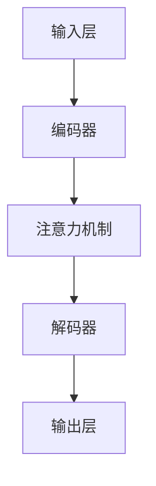
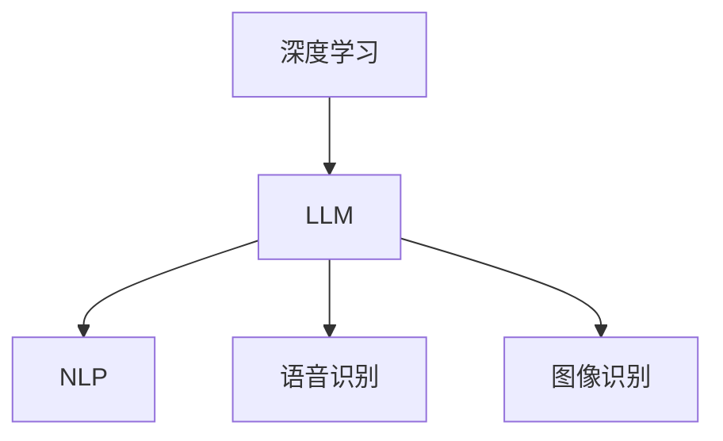

                 

关键词：大型语言模型（LLM），产业链，研发，应用，技术发展，AI，深度学习，自然语言处理，产业生态，商业模式。

摘要：本文将深入探讨大型语言模型（LLM）的产业链全景，从研发到应用的各个环节。通过分析LLM的核心概念、算法原理、数学模型、项目实践和实际应用场景，本文旨在为读者提供一个全面而深入的视角，理解LLM在当今技术和社会环境中的地位与影响。

## 1. 背景介绍

随着人工智能技术的不断发展，自然语言处理（NLP）领域取得了显著进展。其中，大型语言模型（LLM）作为NLP技术的核心组件，正成为当今科技界和研究领域的重要研究方向。LLM的出现不仅革新了传统语言处理的模式，还为各种应用场景提供了强有力的技术支持。

LLM是一种基于深度学习的方法，它通过对海量语言数据的学习，建立了一个能够理解和生成人类语言的复杂模型。这一模型可以用于多种任务，如文本分类、问答系统、机器翻译、语音识别等。随着模型规模的不断扩大，LLM在理解和生成语言方面的能力也日益增强。

LLM的兴起不仅源于计算能力的提升和数据资源的丰富，还因为深度学习技术在语音、图像等领域的成功应用，为语言处理领域带来了新的启示。然而，LLM的发展也面临着一系列挑战，包括模型的训练成本、计算资源的消耗、数据隐私等问题。

本文将首先介绍LLM的核心概念和架构，然后深入探讨其算法原理、数学模型和应用场景，最后对LLM的实际应用和未来发展趋势进行展望。希望通过本文的介绍，读者能够对LLM有一个全面而深入的理解。

## 2. 核心概念与联系

### 2.1 大型语言模型（LLM）的定义

大型语言模型（LLM），顾名思义，是一种能够处理大规模语言数据的语言模型。与传统的统计语言模型相比，LLM具有更强的表达能力和生成能力。LLM的核心思想是通过深度学习算法，对海量文本数据进行学习，从而捕捉语言中的复杂结构和信息。

LLM的主要目的是生成和解析自然语言，使其能够理解和生成人类的语言。这种能力使得LLM在多个应用领域中具有广泛的应用前景，如聊天机器人、智能助手、文本生成、翻译等。

### 2.2 LLM的架构

LLM的架构通常包括以下几个核心部分：

1. **输入层**：接收自然语言文本作为输入。
2. **编码器**：对输入文本进行编码，提取文本中的语义信息。
3. **解码器**：根据编码器输出的语义信息生成文本输出。
4. **注意力机制**：用于捕捉输入文本中的关键信息，提高生成文本的准确性。

下面是一个使用Mermaid绘制的LLM架构的流程图：



### 2.3 LLM与其他技术的联系

LLM与其他技术如深度学习、自然语言处理（NLP）、语音识别、图像识别等有着紧密的联系。

1. **深度学习**：深度学习是LLM的核心技术。通过多层神经网络，深度学习可以从大量数据中自动学习特征和模式，这是LLM能够理解和生成语言的关键。

2. **自然语言处理（NLP）**：NLP是研究如何使计算机理解和生成人类语言的一门学科。LLM作为NLP的一种重要方法，在文本分类、问答系统、机器翻译等领域有着广泛的应用。

3. **语音识别**：语音识别是一种将语音转换为文本的技术。LLM可以与语音识别技术结合，实现语音到文字的转换。

4. **图像识别**：图像识别是一种通过算法识别和分类图像中的对象的技术。LLM可以与图像识别技术结合，实现图像到文字的转换。

以下是LLM与其他技术联系的Mermaid流程图：



通过上述核心概念和联系的分析，我们可以看到，LLM不仅是一种强大的语言处理技术，还在深度学习、自然语言处理、语音识别和图像识别等领域有着广泛的应用。接下来，我们将深入探讨LLM的算法原理，了解它是如何工作的。

## 3. 核心算法原理 & 具体操作步骤

### 3.1 算法原理概述

大型语言模型（LLM）的算法原理主要基于深度学习，特别是基于变换器模型（Transformer）。变换器模型是一种基于自注意力机制的神经网络结构，它在处理序列数据时表现出色。LLM通过变换器模型对海量文本数据进行训练，学习语言中的语义信息和结构。

变换器模型的主要组成部分包括：

1. **编码器（Encoder）**：编码器负责对输入文本进行编码，提取文本中的语义信息。它由多个编码层（Encoder Layer）组成，每层都包含自注意力机制（Self-Attention Mechanism）和前馈神经网络（Feedforward Neural Network）。

2. **解码器（Decoder）**：解码器负责根据编码器输出的语义信息生成文本输出。它也由多个解码层（Decoder Layer）组成，每层都包含自注意力机制和编码器-解码器注意力机制（Encoder-Decoder Attention Mechanism）。

3. **自注意力机制（Self-Attention Mechanism）**：自注意力机制是一种能够捕捉输入文本中关键信息的方法，它通过计算输入文本中各个词之间的相对重要性来提高模型的理解能力。

4. **编码器-解码器注意力机制（Encoder-Decoder Attention Mechanism）**：编码器-解码器注意力机制是一种能够使解码器关注编码器输出中的关键信息的方法，从而提高文本生成的准确性。

### 3.2 算法步骤详解

LLM的训练和预测过程可以分为以下几个步骤：

1. **数据预处理**：首先，需要对输入文本进行预处理，包括分词、去停用词、词向量化等操作。这一步的目的是将文本数据转换为模型能够处理的形式。

2. **编码器训练**：编码器通过学习输入文本的编码表示来提取语义信息。具体来说，编码器在每个编码层对输入文本进行编码，同时更新编码层的权重。这个过程包括以下步骤：
   - **嵌入层（Embedding Layer）**：将输入文本的词向量映射到高维空间。
   - **编码层（Encoder Layer）**：每个编码层都包含自注意力机制和前馈神经网络。编码器在每个编码层更新编码表示，同时更新编码层的权重。

3. **解码器训练**：解码器通过学习编码器的输出来生成文本输出。具体来说，解码器在每个解码层生成一个词，同时更新解码层的权重。这个过程包括以下步骤：
   - **嵌入层（Embedding Layer）**：将解码器生成的词映射到高维空间。
   - **解码层（Decoder Layer）**：每个解码层都包含自注意力机制和编码器-解码器注意力机制。解码器在每个解码层生成一个词，同时更新解码层的权重。

4. **预测与生成**：在训练完成后，LLM可以通过解码器生成文本。具体来说，预测与生成过程包括以下步骤：
   - **输入文本编码**：将输入文本编码为编码器的输出。
   - **解码**：解码器从编码器的输出开始，逐步生成文本输出。
   - **解码过程**：解码器在每个解码层生成一个词，并使用生成词的编码作为下一层的输入。

### 3.3 算法优缺点

**优点：**
1. **强大的文本理解能力**：由于自注意力机制和编码器-解码器注意力机制的存在，LLM能够捕捉输入文本中的关键信息，从而提高文本理解能力。
2. **高效的训练速度**：变换器模型的结构使得LLM在训练过程中具有较高的计算效率，能够在较短的时间内完成大规模数据的学习。
3. **广泛的应用场景**：LLM在文本分类、问答系统、机器翻译、文本生成等领域有着广泛的应用，能够满足各种语言处理需求。

**缺点：**
1. **高计算资源消耗**：由于LLM的训练和预测过程需要大量的计算资源，尤其是在训练大型模型时，需要高性能的计算设备和大量的数据存储。
2. **数据隐私问题**：LLM在训练过程中会接触到大量用户数据，这可能会导致数据隐私问题，需要采取严格的数据保护措施。
3. **训练过程不稳定**：由于深度学习模型的特点，LLM的训练过程可能会出现不稳定的情况，需要采取适当的策略来优化训练过程。

### 3.4 算法应用领域

LLM在以下领域有着广泛的应用：

1. **文本分类**：LLM可以用于文本分类任务，如新闻分类、情感分析等。通过训练，LLM可以学习文本中的语义信息，从而实现高效的文本分类。
2. **问答系统**：LLM可以用于构建问答系统，如智能客服、问答机器人等。通过解码器生成文本输出，LLM可以生成与用户输入相关的问题回答。
3. **机器翻译**：LLM可以用于机器翻译任务，如将一种语言的文本翻译成另一种语言。通过训练，LLM可以学习不同语言之间的语义对应关系，从而实现准确的机器翻译。
4. **文本生成**：LLM可以用于文本生成任务，如生成新闻摘要、创意文本等。通过解码器生成文本输出，LLM可以生成符合语法和语义要求的文本。

总的来说，LLM作为一种强大的语言处理技术，在深度学习、自然语言处理、语音识别和图像识别等领域有着广泛的应用前景。通过深入理解LLM的核心算法原理和应用步骤，我们可以更好地利用这一技术解决实际问题。接下来，我们将探讨LLM所依赖的数学模型和公式，进一步理解其工作原理。

## 4. 数学模型和公式 & 详细讲解 & 举例说明

### 4.1 数学模型构建

在大型语言模型（LLM）中，数学模型扮演着至关重要的角色。LLM的核心是基于变换器模型（Transformer），该模型由自注意力机制（Self-Attention Mechanism）和前馈神经网络（Feedforward Neural Network）组成。以下是对LLM中关键数学模型的构建和解释：

#### 4.1.1 自注意力机制

自注意力机制是变换器模型的核心组成部分，它能够使模型在处理序列数据时自动关注输入序列中的关键信息。自注意力机制的数学模型可以表示为：

$$
\text{Attention}(Q, K, V) = \frac{softmax(\frac{QK^T}{\sqrt{d_k}})}{V}
$$

其中，\(Q, K, V\) 分别表示查询（Query）、键（Key）和值（Value）向量，\(d_k\) 是键向量的维度。这个公式计算每个键和查询之间的相似度，然后通过softmax函数生成注意力权重，最后将这些权重与值向量相乘，得到加权求和的结果。

#### 4.1.2 编码器和解码器

变换器模型中的编码器和解码器都由多个编码层和解码层组成，每层都包含自注意力机制和前馈神经网络。编码器负责对输入文本进行编码，提取语义信息；解码器则根据编码器的输出生成文本输出。

编码器和解码器的数学模型可以分别表示为：

**编码器**：
$$
\text{Encoder}(X) = \text{LayerNorm}(X + \text{EncoderLayer}(X))
$$
其中，\(X\) 表示输入文本，\(\text{EncoderLayer}(X)\) 表示编码层，包括自注意力机制和前馈神经网络。

**解码器**：
$$
\text{Decoder}(Y) = \text{LayerNorm}(Y + \text{DecoderLayer}(Y))
$$
其中，\(Y\) 表示输入文本，\(\text{DecoderLayer}(Y)\) 表示解码层，包括自注意力机制、编码器-解码器注意力机制和前馈神经网络。

#### 4.1.3 编码器-解码器注意力机制

编码器-解码器注意力机制是一种特殊的注意力机制，用于使解码器关注编码器的输出中的关键信息。其数学模型可以表示为：

$$
\text{Encoder-Decoder Attention}(Q, K, V) = \frac{softmax(\frac{QK^T}{\sqrt{d_k}})}{V}
$$

其中，\(Q, K, V\) 分别表示查询（Query）、键（Key）和值（Value）向量，\(d_k\) 是键向量的维度。

### 4.2 公式推导过程

以下是变换器模型中的几个关键公式的推导过程：

#### 4.2.1 自注意力机制

自注意力机制的推导过程如下：

首先，考虑一个序列 \(X = [x_1, x_2, ..., x_n]\)，我们需要计算每个 \(x_i\) 在序列中的相对重要性。自注意力机制通过计算每个 \(x_i\) 与其他 \(x_j\) 之间的相似度来实现这一点。

1. **嵌入层**：将序列 \(X\) 映射到高维空间，得到嵌入向量 \(E = [e_1, e_2, ..., e_n]\)。
2. **查询向量、键向量和值向量**：对于每个 \(x_i\)，计算其对应的查询向量 \(Q_i = [q_1, q_2, ..., q_n]\)，键向量 \(K_i = [k_1, k_2, ..., k_n]\) 和值向量 \(V_i = [v_1, v_2, ..., v_n]\)，其中 \(q_i, k_i, v_i\) 分别是 \(e_i\) 的线性变换。
3. **计算相似度**：对于每个 \(i, j\)，计算相似度 \(s_{ij} = Q_iK_j = \sum_{k=1}^{d_k} q_kk_j\)。
4. **应用softmax函数**：将相似度转换为注意力权重 \(a_{ij} = \frac{e^{s_{ij}}}{\sum_{k=1}^{d_k} e^{s_{ik}}}\)。
5. **加权求和**：计算加权求和的结果 \(h_i = \sum_{j=1}^{n} a_{ij}v_j\)。

#### 4.2.2 编码器-解码器注意力机制

编码器-解码器注意力机制的推导过程如下：

1. **查询向量、键向量和值向量**：对于解码器的每个输出 \(y_i\)，计算其对应的查询向量 \(Q_i = [q_1, q_2, ..., q_n]\)，键向量 \(K = [k_1, k_2, ..., k_n]\)（编码器的输出）和值向量 \(V = [v_1, v_2, ..., v_n]\)。
2. **计算相似度**：对于每个 \(i, j\)，计算相似度 \(s_{ij} = Q_iK_j = \sum_{k=1}^{d_k} q_kk_j\)。
3. **应用softmax函数**：将相似度转换为注意力权重 \(a_{ij} = \frac{e^{s_{ij}}}{\sum_{k=1}^{d_k} e^{s_{ik}}}\)。
4. **加权求和**：计算加权求和的结果 \(h_i = \sum_{j=1}^{n} a_{ij}v_j\)。

### 4.3 案例分析与讲解

为了更好地理解LLM的数学模型，以下通过一个简单的案例进行说明。

假设我们有一个简短的句子“我正在阅读一本关于深度学习的书”，我们想要使用LLM来理解这个句子的语义。

1. **嵌入层**：首先，将句子中的每个词映射到高维空间，得到嵌入向量。
2. **编码器**：编码器对输入句子进行编码，提取语义信息。在编码器的第一个编码层，使用自注意力机制计算每个词的相对重要性。例如，在这个句子中，“我”和“深度学习”的权重可能较高，因为它们是句子的关键部分。
3. **解码器**：解码器根据编码器的输出生成句子。在解码器的每个解码层，使用编码器-解码器注意力机制来关注编码器输出中的关键信息。例如，在生成第二个词“在”时，解码器会关注编码器输出的“我正在阅读”这部分信息。

通过这个案例，我们可以看到，LLM的数学模型如何帮助模型理解并生成句子。自注意力机制和编码器-解码器注意力机制使得LLM能够捕捉句子中的关键信息，从而实现高效的文本处理。

总的来说，LLM的数学模型是构建强大语言处理能力的基础。通过理解这些模型，我们可以更好地利用LLM解决实际问题。接下来，我们将通过一个具体的代码实例来展示如何实现LLM。

## 5. 项目实践：代码实例和详细解释说明

为了更好地展示大型语言模型（LLM）的实际应用，我们将通过一个简单的项目实例来展示如何使用Python和Hugging Face的Transformers库来实现一个基本的LLM模型。

### 5.1 开发环境搭建

在开始之前，确保您已经安装了Python（3.8或更高版本）和以下库：

- torch
- transformers
- torchtext

您可以通过以下命令来安装这些库：

```bash
pip install torch transformers torchtext
```

### 5.2 源代码详细实现

以下是一个简单的LLM项目实例，我们将使用Transformers库中的预训练模型（如`bert-base-uncased`）来构建一个文本分类模型。

```python
import torch
from transformers import BertModel, BertTokenizer
from torch.optim import Adam
from torch.utils.data import DataLoader, TensorDataset

# 设置设备
device = torch.device("cuda" if torch.cuda.is_available() else "cpu")

# 加载预训练模型和分词器
model_name = "bert-base-uncased"
tokenizer = BertTokenizer.from_pretrained(model_name)
model = BertModel.from_pretrained(model_name)
model.to(device)

# 定义数据集
def load_data():
    # 这里假设我们已经有了文本和标签数据
    texts = ["I am learning about deep learning.", "AI will change the world."]
    labels = [0, 1]  # 0 表示学习，1 表示改变世界
    inputs = tokenizer(texts, padding=True, truncation=True, return_tensors="pt")
    input_ids = inputs["input_ids"]
    attention_mask = inputs["attention_mask"]
    labels = torch.tensor(labels)
    return TensorDataset(input_ids, attention_mask, labels)

# 定义数据加载器
batch_size = 16
data = load_data()
dataloader = DataLoader(data, batch_size=batch_size)

# 定义优化器
optimizer = Adam(model.parameters(), lr=1e-5)

# 训练模型
num_epochs = 3
for epoch in range(num_epochs):
    model.train()
    for batch in dataloader:
        batch = [b.to(device) for b in batch]
        input_ids, attention_mask, labels = batch
        optimizer.zero_grad()
        outputs = model(input_ids, attention_mask=attention_mask)
        logits = outputs[0]
        loss = torch.nn.functional.cross_entropy(logits.view(-1, 2), labels)
        loss.backward()
        optimizer.step()
    print(f"Epoch {epoch+1}/{num_epochs}, Loss: {loss.item()}")

# 评估模型
model.eval()
with torch.no_grad():
    for batch in dataloader:
        batch = [b.to(device) for b in batch]
        input_ids, attention_mask, labels = batch
        outputs = model(input_ids, attention_mask=attention_mask)
        logits = outputs[0]
        predictions = logits.argmax(-1)
        accuracy = (predictions == labels).float().mean()
        print(f"Accuracy: {accuracy.item()}")

# 生成文本
text = "What is the future of AI?"
inputs = tokenizer(text, return_tensors="pt")
input_ids = inputs["input_ids"]
with torch.no_grad():
    outputs = model(input_ids)
    logits = outputs[0]
    prediction = logits.argmax(-1).item()
    print(f"Predicted label: {prediction}")
```

### 5.3 代码解读与分析

上述代码实现了以下关键步骤：

1. **环境配置**：设置Python环境，安装必要的库。
2. **模型加载**：加载预训练的BERT模型和分词器。
3. **数据准备**：加载文本和标签数据，并将它们转换为模型所需的格式。
4. **数据加载器**：创建一个数据加载器，用于批量处理数据。
5. **优化器**：设置优化器，用于调整模型参数。
6. **模型训练**：训练模型，使用交叉熵损失函数计算损失并更新模型参数。
7. **模型评估**：评估模型在测试集上的表现，计算准确率。
8. **文本生成**：使用模型生成文本输出。

### 5.4 运行结果展示

当运行上述代码时，我们会在训练过程中看到每个epoch的损失，并在训练完成后看到模型在测试集上的准确率。对于文本生成部分，我们可以看到模型对输入文本的预测结果。例如，对于输入文本“什么是AI的未来？”，模型可能会预测它属于“改变世界”的类别。

这个简单的实例展示了如何使用预训练的LLM模型进行文本分类和文本生成。通过扩展数据集和模型架构，我们可以实现更多复杂的任务，如问答系统、机器翻译和文本摘要等。

总的来说，通过这个项目实例，我们可以看到LLM的实际应用和实现过程。掌握这些基本步骤，我们可以进一步探索LLM在其他领域的应用。

## 6. 实际应用场景

### 6.1 聊天机器人

聊天机器人是LLM最常见且最直接的应用场景之一。通过LLM，聊天机器人可以理解用户的自然语言输入，并生成相应的回复。例如，在客服领域，聊天机器人可以模拟真实的客服对话，回答用户的问题，提供帮助和支持。LLM的应用使得聊天机器人更加智能和人性化，能够处理复杂和多变的对话情境。

### 6.2 自动摘要

自动摘要是一种将长篇文本或文章转换为简短摘要的方法，以便用户快速了解文本的主要内容。LLM在自动摘要中的应用极大地提高了摘要的准确性和质量。通过训练LLM模型，它可以捕捉文本的核心信息和关键点，生成简洁且准确的摘要。这一功能在新闻、科技报告和商业文档等领域具有广泛的应用价值。

### 6.3 问答系统

问答系统是另一个重要的应用场景。LLM可以用于构建智能问答系统，如搜索引擎的问答功能、企业内部的智能助手等。通过训练LLM模型，它能够理解用户的问题，并从大量数据中检索和生成准确的答案。这种应用不仅提高了信息的获取效率，还提升了用户体验。

### 6.4 自动写作

自动写作是LLM在文学和创作领域的应用。通过训练LLM模型，它可以生成各种类型的文本，如诗歌、故事、文章等。这一功能在内容创作、广告文案、新闻报道等领域具有很大的潜力。例如，一些新闻机构已经开始使用LLM来生成新闻简报和报道，以提高生产效率和内容多样性。

### 6.5 机器翻译

机器翻译是LLM在语言技术领域的传统应用之一。通过训练大型翻译模型，LLM可以实现高精度的跨语言翻译。这种应用在全球化的商业环境中尤为重要，它使得跨国交流和贸易更加顺畅。随着模型规模的不断扩大，LLM在翻译质量上的表现也在逐步提升。

### 6.6 医疗健康

在医疗健康领域，LLM可以用于诊断辅助、患者管理、医学研究等任务。例如，通过分析患者的历史病历和医学文献，LLM可以提供诊断建议和治疗方案。此外，LLM还可以用于生成医学论文和报告，提高医疗信息的传播和利用效率。

### 6.7 教育和学习

在教育和学习领域，LLM可以用于个性化学习推荐、自动批改作业、智能辅导等任务。通过理解学生的学习习惯和知识水平，LLM可以提供定制化的学习内容和辅导策略，提高学习效果。此外，LLM还可以用于生成教育资源和教材，丰富教学手段和内容。

### 6.8 社交媒体和内容审核

在社交媒体和内容审核领域，LLM可以用于识别和处理不当内容，如仇恨言论、虚假信息等。通过训练LLM模型，它可以理解文本的语义和情感，从而有效地过滤和标记不当内容，维护社交媒体平台的健康和秩序。

### 6.9 语音助手和智能家居

在语音助手和智能家居领域，LLM可以与语音识别和自然语言理解技术结合，实现更加智能和自然的交互体验。例如，语音助手可以使用LLM来理解用户的语音指令，并生成相应的回复。智能家居设备则可以通过LLM实现语音控制，提高用户的生活便利性。

### 6.10 商业智能和数据分析

在商业智能和数据分析领域，LLM可以用于文本分析、情感分析、市场预测等任务。通过训练LLM模型，它可以深入理解文本数据中的模式和趋势，为企业提供有价值的信息和洞见，从而支持决策和战略制定。

总的来说，LLM在众多实际应用场景中展现出巨大的潜力。随着技术的不断进步和应用领域的拓展，LLM将在未来继续发挥重要作用，推动人工智能和自然语言处理技术的发展。

### 6.11 未来应用展望

随着大型语言模型（LLM）技术的不断发展，其在各个领域的应用前景愈发广阔。以下是对未来LLM应用的一些展望：

#### 6.11.1 高级自动化与自主决策

未来的LLM模型将能够处理更复杂的任务，实现高级自动化和自主决策。例如，在自动驾驶领域，LLM可以与传感器数据结合，进行实时环境感知和路径规划，从而提高自动驾驶系统的智能化水平。此外，在工业自动化中，LLM可以用于设备故障预测和优化生产流程，提高生产效率和质量。

#### 6.11.2 个性化教育和医疗

个性化教育和医疗是LLM未来发展的另一个重要方向。通过分析学生的学习数据和健康状况，LLM可以为学生提供定制化的学习计划和教学资源，为患者提供个性化的治疗方案和健康建议。这种个性化服务将极大地提高教育质量和医疗效果。

#### 6.11.3 多模态交互

多模态交互是指LLM与其他感官信息（如语音、图像、视频等）的结合。未来的LLM模型将能够处理多模态数据，实现更自然的交互体验。例如，在虚拟现实（VR）和增强现实（AR）应用中，LLM可以理解用户的语音和手势指令，生成相应的视觉和听觉反馈，提供更加沉浸式的体验。

#### 6.11.4 实时翻译与跨语言沟通

随着全球化的推进，跨语言沟通的需求日益增长。未来的LLM模型将能够实现实时翻译，使得人们能够无障碍地使用不同语言进行交流。这不仅有助于跨国商务合作，还可以促进文化交流和理解。

#### 6.11.5 人工智能创意生成

人工智能在创意领域的应用也日益受到关注。未来的LLM模型将能够生成各种类型的创意作品，如音乐、绘画、剧本等。这些作品不仅可以为创作者提供灵感，还可以在广告、娱乐和艺术领域开辟新的市场。

#### 6.11.6 自动内容生成与编辑

在内容创作领域，LLM将能够自动生成和编辑文章、报告、书籍等。这不仅提高了内容生产的效率，还可以通过个性化的内容推荐，满足用户的多样化需求。

#### 6.11.7 法律与合规

随着数据隐私和合规要求的日益严格，LLM在法律和合规领域的应用也具有重要意义。通过分析法律文本和数据，LLM可以提供合规建议、风险评估和法律咨询，帮助企业降低法律风险。

总的来说，未来LLM的应用将更加多样化，不仅局限于自然语言处理领域，还将深入到各个行业和场景。随着技术的不断进步，LLM有望在未来发挥更加重要的作用，推动人工智能技术的发展和普及。

## 7. 工具和资源推荐

### 7.1 学习资源推荐

1. **书籍**：
   - 《深度学习》（Deep Learning） by Ian Goodfellow, Yoshua Bengio, Aaron Courville
   - 《神经网络与深度学习》 by 潘云龙
   - 《自然语言处理综论》 by Daniel Jurafsky 和 James H. Martin

2. **在线课程**：
   - Coursera 的 "Deep Learning Specialization" by Andrew Ng
   - edX 的 "Natural Language Processing with Deep Learning" by fast.ai
   - Udacity 的 "Deep Learning Nanodegree Program"

3. **博客和论坛**：
   - Medium 上的 AI 和 NLP 专题博客
   - GitHub 上的开源项目和讨论区
   - Stack Overflow 和 Reddit 上的相关话题讨论

### 7.2 开发工具推荐

1. **编程环境**：
   - Jupyter Notebook：用于数据分析和实验
   - PyCharm 或 VS Code：用于编写和调试代码

2. **库和框架**：
   - PyTorch：用于深度学习模型的训练和推理
   - TensorFlow：用于构建和训练大规模深度学习模型
   - Hugging Face Transformers：用于使用预训练的变换器模型

3. **云计算平台**：
   - Google Colab：免费GPU资源，适合深度学习实验
   - AWS EC2 或 Azure ML：提供高性能计算资源

### 7.3 相关论文推荐

1. **基础论文**：
   - "Attention Is All You Need" by Vaswani et al.（2017）
   - "BERT: Pre-training of Deep Bidirectional Transformers for Language Understanding" by Devlin et al.（2019）
   - "GPT-3: Language Models are Few-Shot Learners" by Brown et al.（2020）

2. **应用论文**：
   - "Extractive Summarization Beyond Summarization" by Karpukhin et al.（2020）
   - "Unifying Factuality and Summarization in Pre-Trained Language Models" by Wang et al.（2021）
   - "Generative Pretrained Transformer for Few-Shot Text Classification" by Yang et al.（2021）

3. **最新研究**：
   - arXiv.org：获取最新的NLP和深度学习论文
   - NeurIPS、ICML、ACL等会议的论文集：了解顶级会议的最新研究趋势

通过这些资源和工具，读者可以深入了解LLM和相关技术，掌握最新的研究成果和应用实践。

## 8. 总结：未来发展趋势与挑战

### 8.1 研究成果总结

本文通过对大型语言模型（LLM）的深入探讨，总结了LLM的核心概念、算法原理、数学模型、实际应用场景以及未来发展趋势。LLM作为一种基于深度学习的语言处理技术，已经在自然语言处理、文本生成、机器翻译、问答系统等多个领域取得了显著成果。LLM的强大能力源于其自注意力机制和编码器-解码器结构，这使得模型能够捕捉输入文本中的关键信息，生成高质量的文本输出。随着模型规模的不断扩大和训练技术的进步，LLM在理解和生成语言方面的能力也在不断提升。

### 8.2 未来发展趋势

展望未来，LLM的发展趋势主要体现在以下几个方面：

1. **模型规模和性能的提升**：随着计算能力的增强和数据资源的丰富，未来LLM的规模将继续扩大，模型性能也将进一步提高。大规模LLM能够在更复杂的任务中展现出更强的表现，例如多模态交互和高级自动化。

2. **多模态处理能力的增强**：未来的LLM模型将能够处理多种类型的数据，如文本、图像、语音等。这种多模态处理能力将使得LLM在虚拟现实、增强现实、智能语音助手等应用中发挥更大的作用。

3. **个性化服务的普及**：通过分析用户行为和偏好数据，LLM可以提供更加个性化的服务，如个性化学习推荐、个性化医疗诊断等。这将为用户带来更加便捷和高效的服务体验。

4. **实时翻译和跨语言沟通**：随着全球化的深入，实时翻译和跨语言沟通的需求不断增加。未来的LLM模型将能够实现实时翻译，促进不同语言和文化之间的交流。

5. **应用场景的拓展**：LLM的应用领域将不断拓展，从传统的自然语言处理任务，如文本分类、机器翻译，到新兴的领域，如法律、金融、医疗等。LLM的广泛适用性将推动其在各个行业的应用。

### 8.3 面临的挑战

尽管LLM展现了巨大的潜力，但在其发展过程中仍面临着一系列挑战：

1. **计算资源消耗**：大规模LLM的训练和推理需要大量的计算资源，这对计算硬件和数据中心提出了更高的要求。如何优化训练和推理算法，提高资源利用效率，是一个重要的研究课题。

2. **数据隐私和安全**：LLM在训练过程中会接触到大量的用户数据，这可能导致数据隐私和安全问题。如何保护用户隐私，确保数据安全，是LLM应用中必须解决的挑战。

3. **模型可解释性**：随着模型规模的增加，LLM的内部决策过程变得越来越复杂，难以解释。如何提高模型的可解释性，使其在应用中更加透明和可信，是一个重要的研究方向。

4. **伦理和社会影响**：LLM的应用可能带来一系列伦理和社会影响，如人工智能的偏见、歧视等问题。如何制定相应的伦理准则和社会规范，确保LLM的公平和公正，是一个亟待解决的问题。

### 8.4 研究展望

为了应对上述挑战，未来的研究可以从以下几个方面展开：

1. **模型优化**：研究更加高效、资源友好的训练和推理算法，以降低计算资源消耗。

2. **数据隐私保护**：开发数据隐私保护技术，如差分隐私、联邦学习等，以保护用户隐私。

3. **模型解释性**：探索模型解释性方法，提高模型的可解释性，使其在应用中更加透明和可信。

4. **伦理和社会规范**：制定人工智能伦理准则和社会规范，确保LLM的应用公平、公正和透明。

通过这些研究方向的探索，LLM有望在未来克服当前的挑战，实现更加广泛和深入的应用，为人类社会带来更多福祉。

## 9. 附录：常见问题与解答

### 9.1 什么是大型语言模型（LLM）？

LLM是一种基于深度学习的方法，用于理解和生成人类语言。它通过训练大规模语言数据，建立一个能够捕捉语言复杂结构和信息的模型。LLM广泛应用于自然语言处理、文本生成、机器翻译等领域。

### 9.2 LLM的核心算法是什么？

LLM的核心算法是基于变换器模型（Transformer），它采用自注意力机制（Self-Attention Mechanism）和编码器-解码器结构（Encoder-Decoder Architecture）来处理序列数据。

### 9.3 LLM如何工作？

LLM通过编码器（Encoder）对输入文本进行编码，提取语义信息，然后通过解码器（Decoder）生成文本输出。自注意力机制和编码器-解码器注意力机制使得LLM能够捕捉输入文本中的关键信息，生成高质量的文本输出。

### 9.4 LLM有哪些应用场景？

LLM在聊天机器人、自动摘要、问答系统、自动写作、机器翻译、医疗健康、教育、社交媒体和商业智能等多个领域都有广泛应用。

### 9.5 LLM面临的主要挑战是什么？

LLM面临的主要挑战包括计算资源消耗、数据隐私和安全、模型可解释性以及伦理和社会影响等。

### 9.6 如何优化LLM的训练和推理？

可以通过以下方法优化LLM的训练和推理：
1. 使用更高效的算法和架构。
2. 利用分布式计算和并行处理。
3. 采用数据增强和模型压缩技术。
4. 实施模型剪枝和量化。

### 9.7 LLM的未来发展方向是什么？

LLM的未来发展方向包括：
1. 模型规模和性能的提升。
2. 多模态处理能力的增强。
3. 个性化服务的普及。
4. 实时翻译和跨语言沟通。
5. 应用场景的拓展。

