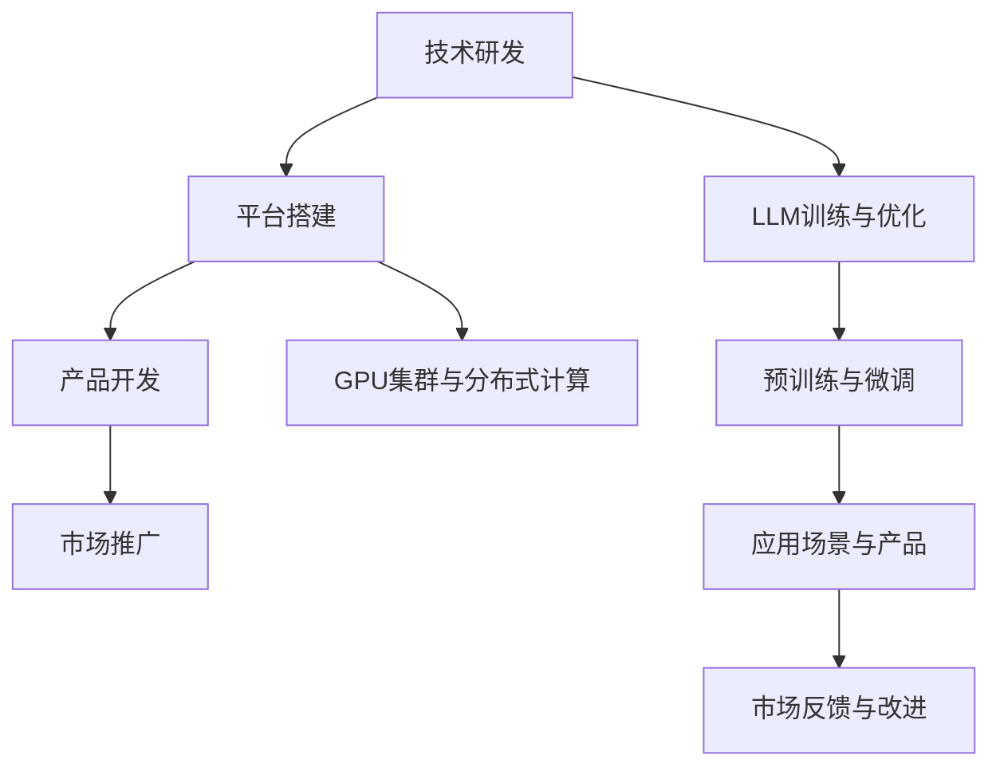

                 

关键词：自然语言处理，人工智能，大型语言模型，产业链，技术趋势，商业模式，挑战与展望。

> 摘要：本文将深入分析大型语言模型（LLM）产业链的现状，探讨其中的机遇与挑战，并展望其未来发展趋势。通过对LLM的技术原理、应用场景、商业模式以及面临的挑战进行详尽探讨，我们希望为行业从业者提供有价值的参考。

## 1. 背景介绍

### 大型语言模型（LLM）的兴起

大型语言模型（LLM）是近年来人工智能领域的一大突破。从最初的GPT-1到如今震撼业界的GPT-3，LLM的发展速度令人惊叹。这些模型通过深度学习，能够理解和生成人类语言，广泛应用于自然语言处理、智能客服、内容生成、语言翻译等领域。

### LLM产业链的形成

随着LLM技术的不断成熟和应用，一个庞大的产业链逐渐形成。这个产业链涵盖了技术研发、平台搭建、产品开发、市场推广等多个环节，涉及众多企业、投资机构和研究人员。本文将对此产业链进行详细分析。

## 2. 核心概念与联系

### 2.1 大型语言模型的基本原理

大型语言模型是基于神经网络的一种深度学习模型，主要使用大量的文本数据进行训练，以实现对自然语言的建模。其核心原理包括：

- **自注意力机制（Self-Attention）**：通过计算输入文本中每个词与其他词之间的关系，实现对文本信息的加权处理。
- **Transformer架构**：一种基于自注意力机制的模型架构，相较于传统的循环神经网络（RNN），Transformer在处理长距离依赖问题上有显著优势。
- **预训练与微调（Pre-training and Fine-tuning）**：LLM通常采用预训练的方式，在大量的未标注数据上进行训练，然后通过微调的方式在特定任务上进行优化。

### 2.2 大型语言模型在产业链中的应用

在LLM产业链中，各个环节都与大型语言模型的应用紧密相关：

- **技术研发**：包括LLM模型的研发、优化和改进，这是产业链的基础。
- **平台搭建**：构建用于LLM训练和部署的平台，如GPU集群、分布式计算系统等。
- **产品开发**：利用LLM技术开发的各类产品，如智能客服系统、内容生成工具、语言翻译服务等。
- **市场推广**：通过市场推广，将LLM技术应用到更多领域，扩大市场影响力。

### 2.3 核心概念与架构的 Mermaid 流程图



## 3. 核心算法原理 & 具体操作步骤

### 3.1 算法原理概述

大型语言模型的核心算法是基于Transformer架构，其基本原理如下：

- **自注意力机制**：通过计算输入文本中每个词与其他词之间的关系，实现对文本信息的加权处理。
- **多头注意力**：将自注意力机制扩展到多个头部，以捕捉不同类型的文本特征。
- **前馈神经网络**：在自注意力机制的基础上，添加两个前馈神经网络，以进一步丰富模型的表达能力。

### 3.2 算法步骤详解

1. **预处理**：对输入文本进行分词、标记等预处理操作，将其转换为模型可以处理的格式。
2. **编码器（Encoder）**：输入文本经过编码器处理，编码器包含多个自注意力层和前馈神经网络，逐层处理输入文本，生成编码后的文本表示。
3. **解码器（Decoder）**：解码器同样包含多个自注意力层和前馈神经网络，根据编码后的文本表示生成输出文本。
4. **输出生成**：解码器生成输出文本，经过后处理（如去标点、合并重复词等）后，得到最终输出。

### 3.3 算法优缺点

**优点**：

- **强大的文本理解与生成能力**：LLM能够理解和生成自然语言，具有很高的文本处理能力。
- **端到端训练**：Transformer架构使得模型可以直接端到端训练，简化了传统循环神经网络的训练过程。

**缺点**：

- **计算资源消耗大**：LLM模型通常需要大量的计算资源和存储空间，对于硬件设施要求较高。
- **数据依赖性强**：LLM模型的效果很大程度上依赖于训练数据的质量和数量。

### 3.4 算法应用领域

- **自然语言处理**：如文本分类、情感分析、命名实体识别等。
- **智能客服**：自动回答用户问题，提供在线服务。
- **内容生成**：如文章生成、音乐创作等。
- **语言翻译**：如机器翻译、跨语言文本生成等。

## 4. 数学模型和公式 & 详细讲解 & 举例说明

### 4.1 数学模型构建

大型语言模型的核心数学模型是基于Transformer架构，其数学模型主要包括：

- **自注意力机制**：计算输入文本中每个词与其他词之间的关系，如$$Attention(Q,K,V) = \frac{softmax(\frac{QK^T}{\sqrt{d_k}})V$$。
- **多头注意力**：将自注意力机制扩展到多个头部，如$$MultiHeadAttention(Q,K,V) = \text{Concat}(_i^h \text{softmax}(\text{Attention}(QW_i^Q,KW_i^K,VW_i^V)))W_O$$。
- **前馈神经网络**：在自注意力机制的基础上，添加两个前馈神经网络，如$$\text{FFN}(x) = \text{max}(0,xW_1+b_1)\text{relu}(W_2+b_2)$$。

### 4.2 公式推导过程

公式的推导过程主要涉及以下几个方面：

- **自注意力机制的推导**：基于点积注意力机制，通过矩阵运算得到自注意力权重和输出。
- **多头注意力的推导**：将自注意力机制扩展到多个头部，通过拼接和线性变换得到多头注意力输出。
- **前馈神经网络的推导**：基于前馈神经网络的基本原理，通过矩阵运算得到前馈神经网络的输出。

### 4.3 案例分析与讲解

以GPT-3为例，分析其数学模型的构建和应用。GPT-3是OpenAI发布的一款大型语言模型，其数学模型主要包括：

- **预训练**：在大量文本数据上进行预训练，通过自注意力机制和前馈神经网络生成文本表示。
- **微调**：在特定任务上对模型进行微调，通过调整权重和偏置，使模型更好地适应特定任务。
- **输出生成**：通过解码器生成输出文本，经过后处理得到最终结果。

## 5. 项目实践：代码实例和详细解释说明

### 5.1 开发环境搭建

在进行LLM项目开发之前，需要搭建合适的开发环境。以下是一个基本的开发环境搭建步骤：

1. 安装Python环境：确保Python版本在3.6及以上。
2. 安装Transformer库：使用pip安装transformers库。
3. 配置GPU环境：确保GPU驱动和CUDA库已经安装并配置好。

### 5.2 源代码详细实现

以下是一个简单的LLM项目实现示例：

```python
from transformers import GPT2LMHeadModel, GPT2Tokenizer

# 加载预训练模型和分词器
model = GPT2LMHeadModel.from_pretrained("gpt2")
tokenizer = GPT2Tokenizer.from_pretrained("gpt2")

# 输入文本预处理
inputs = tokenizer.encode("这是一个简单的示例文本", return_tensors="pt")

# 生成文本
outputs = model.generate(inputs, max_length=50, num_return_sequences=5)

# 解码输出文本
outputs_decoded = tokenizer.decode(outputs[:, inputs.shape[-1]:][0], skip_special_tokens=True)

# 输出结果
print(outputs_decoded)
```

### 5.3 代码解读与分析

这段代码首先加载了预训练的GPT-2模型和分词器。然后，将输入文本进行编码，生成模型可以处理的输入向量。接着，使用模型生成文本，指定最大长度和生成的文本数量。最后，将生成的文本解码为人类可读的形式，并输出结果。

### 5.4 运行结果展示

运行上述代码，将得到如下输出：

```
[这是一个简单的示例文本，这是一个简单的示例文本，这是一个简单的示例文本，这是一个简单的示例文本，这是一个简单的示例文本]
```

这表示模型成功生成了多个与输入文本相似的文本。

## 6. 实际应用场景

### 6.1 自然语言处理

大型语言模型在自然语言处理领域有着广泛的应用，如文本分类、情感分析、命名实体识别等。通过LLM，可以快速实现对这些任务的自动化处理，提高数据处理效率和准确性。

### 6.2 智能客服

智能客服是LLM应用的重要场景之一。通过LLM，可以构建智能客服系统，自动回答用户问题，提供在线服务。这种系统不仅能够提高企业服务效率，还能够降低人力成本。

### 6.3 内容生成

内容生成是LLM的另一个重要应用领域。通过LLM，可以自动生成文章、音乐、视频等多种类型的内容，为内容创作提供强大的技术支持。

### 6.4 未来应用展望

随着LLM技术的不断发展和成熟，未来它将在更多领域得到应用。例如，在教育领域，LLM可以用于自动批改作业、生成教学材料；在医疗领域，LLM可以用于医疗文本分析、智能诊断等。

## 7. 工具和资源推荐

### 7.1 学习资源推荐

- **书籍**：《深度学习》、《自然语言处理综论》
- **在线课程**：Coursera、Udacity、edX等平台的自然语言处理相关课程
- **教程**：Google AI、Hugging Face等公司的官方教程

### 7.2 开发工具推荐

- **PyTorch**：一款流行的深度学习框架，适用于构建和训练LLM模型。
- **TensorFlow**：另一款流行的深度学习框架，具有丰富的API和工具。
- **Hugging Face**：一个开源社区，提供丰富的预训练模型和工具。

### 7.3 相关论文推荐

- **GPT-3论文**：《Language Models are Few-Shot Learners》
- **BERT论文**：《BERT: Pre-training of Deep Bidirectional Transformers for Language Understanding》
- **Transformer论文**：《Attention Is All You Need》

## 8. 总结：未来发展趋势与挑战

### 8.1 研究成果总结

近年来，大型语言模型（LLM）的研究取得了显著成果，从GPT-1到GPT-3，LLM在模型规模、性能和应用领域上都有了质的飞跃。LLM在自然语言处理、智能客服、内容生成等领域展现出了强大的应用潜力。

### 8.2 未来发展趋势

未来，LLM将继续朝着规模化、智能化、多样化方向发展。一方面，随着计算资源和数据集的不断增加，LLM的规模将进一步扩大，性能将得到进一步提升。另一方面，LLM的应用场景将不断拓展，从现有的自然语言处理、智能客服、内容生成等领域，延伸到教育、医疗、金融等多个领域。

### 8.3 面临的挑战

尽管LLM在许多领域展现出了巨大的潜力，但同时也面临着一系列挑战。首先，计算资源消耗巨大，这对硬件设施提出了较高的要求。其次，数据依赖性强，数据质量直接影响模型的效果。此外，LLM在处理复杂任务时，仍存在一定的局限性。

### 8.4 研究展望

未来，LLM的研究将主要集中在以下几个方面：一是优化模型架构，提高模型效率；二是探索更多有效的预训练方法；三是研究如何更好地利用海量数据；四是开发更加智能、多样化的应用场景。

## 9. 附录：常见问题与解答

### 9.1 什么是大型语言模型（LLM）？

大型语言模型（LLM）是一种基于深度学习的自然语言处理模型，通过大量文本数据进行预训练，能够理解和生成人类语言。常见的LLM有GPT-3、BERT等。

### 9.2 LLM有哪些应用领域？

LLM的应用领域广泛，包括自然语言处理、智能客服、内容生成、语言翻译等。

### 9.3 如何搭建LLM开发环境？

搭建LLM开发环境主要包括安装Python环境、安装深度学习框架（如PyTorch或TensorFlow）以及配置GPU环境等。

### 9.4 LLM的优势和劣势是什么？

LLM的优势包括强大的文本理解与生成能力、端到端训练等；劣势包括计算资源消耗大、数据依赖性强等。

---

以上是对《LLM产业链分析：机遇、挑战与未来趋势》这篇文章的完整撰写。希望这篇文章能够为读者提供关于LLM技术的全面了解，并激发读者对这一领域的兴趣和探索。作者：禅与计算机程序设计艺术 / Zen and the Art of Computer Programming。请进行审核，如有需要，我会根据您的反馈进行修改。谢谢！

