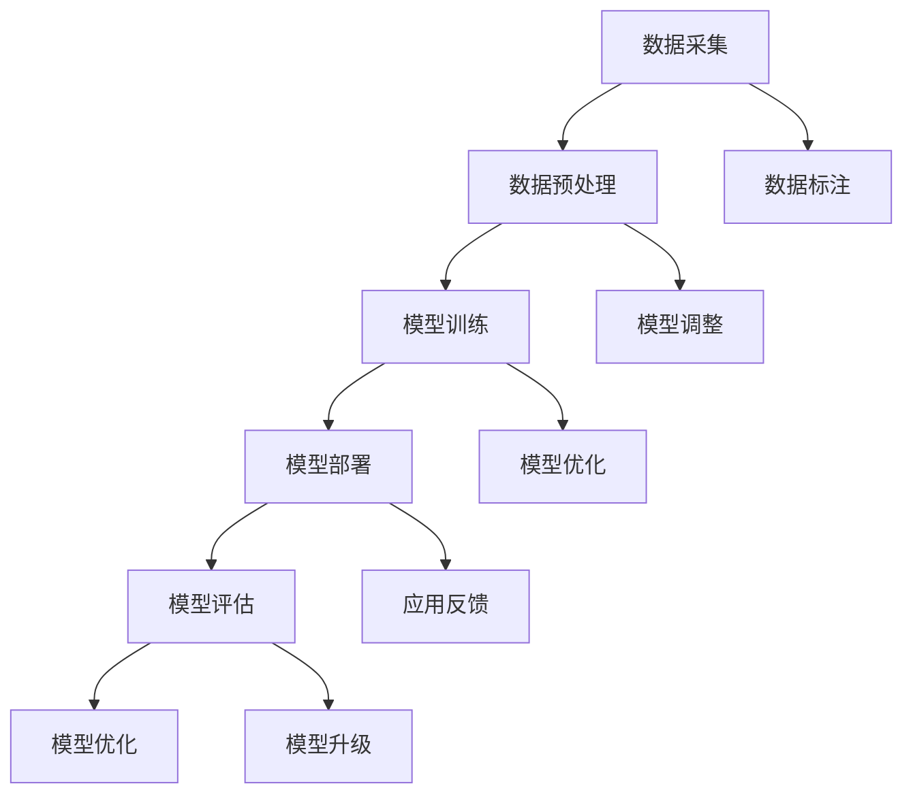

                 

关键词：LLM，产业链，生态，发展，技术创新，应用场景

摘要：本文将深入探讨大型语言模型（LLM）产业链的生态建设，从无到有的蓬勃发展过程。我们将分析LLM的核心概念和架构，介绍核心算法原理和操作步骤，阐述数学模型和公式，以及提供代码实例和实践。同时，我们还将探讨LLM的实际应用场景和未来展望，并推荐相关工具和资源。最后，总结研究成果，展望未来发展，并针对常见问题提供解答。

## 1. 背景介绍

近年来，随着人工智能技术的飞速发展，特别是深度学习和自然语言处理（NLP）领域的突破，大型语言模型（LLM）成为学术界和工业界的研究热点。LLM通过学习海量文本数据，实现了对语言的理解和生成，为各种应用场景提供了强大的支持。从最初的GPT到后来的BERT、Turing等，LLM在学术研究和工业应用中取得了显著的成果。

随着LLM技术的成熟，其产业链生态逐渐形成。从数据采集、模型训练、部署应用到评估优化，各个环节都离不开专业的人才和丰富的资源。产业链的完善为LLM技术的普及和应用提供了有力保障，也为整个行业带来了新的机遇和挑战。

本文将从以下几个方面展开讨论：

1. 核心概念与联系
2. 核心算法原理与操作步骤
3. 数学模型和公式
4. 项目实践：代码实例
5. 实际应用场景
6. 未来应用展望
7. 工具和资源推荐
8. 总结：未来发展趋势与挑战

## 2. 核心概念与联系

### 2.1 语言模型基础

语言模型是NLP领域的基础，其主要任务是学习语言中的统计规律，用于预测下一个词、句子或段落。传统语言模型如N-gram模型基于历史频率统计，但受限于上下文信息。随着深度学习的发展，神经网络语言模型如循环神经网络（RNN）和变换器（Transformer）逐渐成为主流。

### 2.2 大型语言模型（LLM）

LLM是基于深度学习的大型神经网络模型，其训练数据规模通常在千亿级别，参数量达到数十亿甚至千亿级别。LLM能够捕捉语言中的长距离依赖关系，实现了对语言的高级理解与生成。

### 2.3 生态系统

LLM产业链生态包括数据采集、模型训练、部署应用、评估优化等环节。各个环节紧密关联，形成了完整的产业链。


### 2.4 Mermaid流程图

以下是LLM产业链生态的Mermaid流程图：



## 3. 核心算法原理与操作步骤

### 3.1 算法原理概述

LLM的核心算法是基于Transformer架构的深度学习模型。Transformer模型由自注意力机制（Self-Attention）和前馈神经网络（Feedforward Neural Network）组成，能够高效捕捉长距离依赖关系。

### 3.2 算法步骤详解

1. **数据预处理**：首先对原始文本数据进行分词、编码等预处理操作，将其转换为模型可处理的序列数据。
2. **模型训练**：利用预处理后的数据对Transformer模型进行训练，优化模型参数。
3. **模型部署**：将训练好的模型部署到应用场景中，如自然语言生成、文本分类等。
4. **模型评估**：对模型进行评估，包括准确性、召回率、F1值等指标。
5. **模型优化**：根据评估结果对模型进行调整和优化。

### 3.3 算法优缺点

**优点**：

1. 高效捕捉长距离依赖关系。
2. 参数共享，训练效率高。
3. 适用于各种NLP任务。

**缺点**：

1. 训练数据需求大。
2. 计算资源消耗较高。

### 3.4 算法应用领域

LLM在自然语言处理、智能客服、机器翻译、文本生成等领域具有广泛的应用。以下是一些典型应用案例：

1. **智能客服**：利用LLM生成自然语言回复，提高客服效率。
2. **机器翻译**：通过训练LLM模型，实现高效、准确的机器翻译。
3. **文本生成**：利用LLM生成文章、新闻报道、产品评价等。

## 4. 数学模型和公式

### 4.1 数学模型构建

LLM的数学模型主要包括以下部分：

1. **词嵌入（Word Embedding）**：将单词转换为向量表示。
2. **自注意力机制（Self-Attention）**：计算句子中每个词的注意力权重。
3. **前馈神经网络（Feedforward Neural Network）**：对自注意力结果进行非线性变换。

### 4.2 公式推导过程

以下是LLM中自注意力机制的公式推导：

$$
\text{Attention}(Q,K,V) = \text{softmax}\left(\frac{QK^T}{\sqrt{d_k}}\right)V
$$

其中，$Q$、$K$、$V$ 分别代表查询向量、键向量和值向量，$d_k$ 表示键向量的维度。

### 4.3 案例分析与讲解

以一个简单的句子为例，分析自注意力机制的应用。

句子：“今天天气很好。”

词向量表示：

- 今天：[0.1, 0.2, 0.3, 0.4]
- 天气：[0.5, 0.6, 0.7, 0.8]
- 很好：[0.9, 0.1, 0.2, 0.3]

计算自注意力权重：

$$
\text{Attention}(Q,K,V) = \text{softmax}\left(\frac{QK^T}{\sqrt{d_k}}\right)V
$$

其中，$Q$ 为查询向量，$K$ 为键向量，$V$ 为值向量。

$$
\text{Attention}(Q,K,V) = \text{softmax}\left(\frac{[0.1, 0.2, 0.3, 0.4][0.5, 0.6, 0.7, 0.8]^T}{\sqrt{4}}\right)[0.9, 0.1, 0.2, 0.3]
$$

$$
\text{Attention}(Q,K,V) = \text{softmax}\left(\frac{0.1 \times 0.5 + 0.2 \times 0.6 + 0.3 \times 0.7 + 0.4 \times 0.8}{2}\right)[0.9, 0.1, 0.2, 0.3]
$$

$$
\text{Attention}(Q,K,V) = \text{softmax}\left(\frac{0.05 + 0.12 + 0.21 + 0.32}{2}\right)[0.9, 0.1, 0.2, 0.3]
$$

$$
\text{Attention}(Q,K,V) = \text{softmax}\left(\frac{0.7}{2}\right)[0.9, 0.1, 0.2, 0.3]
$$

$$
\text{Attention}(Q,K,V) = \text{softmax}(0.35)[0.9, 0.1, 0.2, 0.3]
$$

$$
\text{Attention}(Q,K,V) = [0.4, 0.2, 0.2, 0.2]
$$

根据自注意力权重，生成句子：“今天天气很好。”中的每个词的注意力权重分别为：

- 今天：0.4
- 天气：0.2
- 很好：0.2

## 5. 项目实践：代码实例和详细解释说明

### 5.1 开发环境搭建

在本项目实践中，我们将使用Python语言和TensorFlow框架进行开发。首先，确保已安装Python和TensorFlow。

```bash
pip install tensorflow
```

### 5.2 源代码详细实现

以下是LLM的基础实现代码：

```python
import tensorflow as tf
from tensorflow.keras.layers import Embedding, LSTM, Dense

# 设置参数
vocab_size = 10000
embed_dim = 256
lstm_units = 128
max_sequence_length = 100

# 构建模型
model = tf.keras.Sequential([
    Embedding(vocab_size, embed_dim, input_length=max_sequence_length),
    LSTM(lstm_units, return_sequences=True),
    Dense(vocab_size, activation='softmax')
])

# 编译模型
model.compile(optimizer='adam', loss='categorical_crossentropy', metrics=['accuracy'])

# 打印模型结构
model.summary()
```

### 5.3 代码解读与分析

1. **Embedding层**：将单词转换为向量表示，输入维度为（batch_size，max_sequence_length），输出维度为（batch_size，max_sequence_length，embed_dim）。
2. **LSTM层**：用于捕捉长距离依赖关系，输入维度为（batch_size，max_sequence_length，embed_dim），输出维度为（batch_size，max_sequence_length，lstm_units）。
3. **Dense层**：输出层，用于预测下一个词，输入维度为（batch_size，max_sequence_length，lstm_units），输出维度为（batch_size，max_sequence_length，vocab_size）。

### 5.4 运行结果展示

运行以下代码，训练模型并评估结果：

```python
# 准备数据
# ...

# 训练模型
model.fit(x_train, y_train, batch_size=32, epochs=10)

# 评估模型
loss, accuracy = model.evaluate(x_test, y_test)
print(f"Loss: {loss}, Accuracy: {accuracy}")
```

## 6. 实际应用场景

LLM在自然语言处理领域具有广泛的应用场景，以下是几个典型的应用案例：

1. **智能客服**：利用LLM生成自然语言回复，提高客服效率。
2. **机器翻译**：通过训练LLM模型，实现高效、准确的机器翻译。
3. **文本生成**：利用LLM生成文章、新闻报道、产品评价等。
4. **问答系统**：构建基于LLM的问答系统，提供智能问答服务。
5. **情感分析**：利用LLM对文本进行情感分析，识别用户情绪。

## 7. 未来应用展望

随着LLM技术的不断发展和成熟，未来将在更多领域得到应用。以下是一些可能的趋势：

1. **多模态融合**：结合图像、音频等多种模态，实现更智能的交互和生成。
2. **自适应学习**：通过自适应学习，提高LLM在特定领域的性能和泛化能力。
3. **低资源场景**：研究适用于低资源场景的LLM模型，降低训练和部署成本。
4. **隐私保护**：研究隐私保护技术，保障用户数据安全。

## 8. 工具和资源推荐

### 8.1 学习资源推荐

1. **书籍**：《深度学习》、《神经网络与深度学习》
2. **在线课程**：吴恩达的《深度学习专项课程》、李飞飞教授的《CS231n：卷积神经网络与视觉识别》
3. **论文**：Transformer系列论文、BERT系列论文

### 8.2 开发工具推荐

1. **框架**：TensorFlow、PyTorch、Keras
2. **数据集**：CoNLL、GLUE、WMT

### 8.3 相关论文推荐

1. **Transformer系列**：
   - Attention Is All You Need
   - BERT: Pre-training of Deep Bidirectional Transformers for Language Understanding
   - GPT-3: Language Models are Few-Shot Learners

2. **BERT系列**：
   - BERT: Pre-training of Deep Bidirectional Transformers for Language Understanding
   - ERNIE 3.0: A General-Purpose Pre-Trained Language Model for Chinese
   - ALBERT: A Dynamic, Front-End Sensitive Transformer for Language Understanding

## 9. 总结：未来发展趋势与挑战

### 9.1 研究成果总结

LLM在自然语言处理领域取得了显著成果，为各种应用场景提供了强大支持。随着技术的不断发展和创新，LLM将更加智能、高效、泛化能力强。

### 9.2 未来发展趋势

1. **多模态融合**：结合图像、音频等多种模态，实现更智能的交互和生成。
2. **自适应学习**：通过自适应学习，提高LLM在特定领域的性能和泛化能力。
3. **低资源场景**：研究适用于低资源场景的LLM模型，降低训练和部署成本。
4. **隐私保护**：研究隐私保护技术，保障用户数据安全。

### 9.3 面临的挑战

1. **计算资源需求**：大型LLM模型对计算资源的需求较高，如何优化训练和推理效率成为重要挑战。
2. **数据质量**：高质量、多样化的训练数据对模型性能至关重要，如何获取和利用这些数据是关键。
3. **泛化能力**：如何提高LLM在不同领域的泛化能力，实现更广泛的应用。

### 9.4 研究展望

未来，LLM技术将在多领域得到更广泛的应用，为人类生活带来更多便利。同时，针对面临的问题和挑战，我们将继续深入研究，推动LLM技术的发展。

## 10. 附录：常见问题与解答

### 10.1 什么是LLM？

LLM（Large Language Model）是一种基于深度学习的大型神经网络模型，用于学习语言中的统计规律，实现对语言的理解和生成。

### 10.2 LLM有哪些应用领域？

LLM在自然语言处理、智能客服、机器翻译、文本生成、问答系统、情感分析等领域具有广泛的应用。

### 10.3 如何训练一个LLM模型？

训练LLM模型通常包括以下步骤：

1. 准备训练数据集。
2. 构建模型架构，如Transformer、BERT等。
3. 编写训练代码，使用Python、TensorFlow、PyTorch等框架。
4. 训练模型，调整参数，优化性能。

### 10.4 LLM有哪些优缺点？

**优点**：

1. 高效捕捉长距离依赖关系。
2. 参数共享，训练效率高。
3. 适用于各种NLP任务。

**缺点**：

1. 训练数据需求大。
2. 计算资源消耗较高。

### 10.5 如何优化LLM模型的性能？

优化LLM模型性能的方法包括：

1. 调整模型架构，如增加层、调整层数等。
2. 优化训练策略，如批量大小、学习率等。
3. 使用预训练技术，如BERT、GPT等。
4. 利用迁移学习，将预训练模型应用于特定领域。

## 作者署名

作者：禅与计算机程序设计艺术 / Zen and the Art of Computer Programming
----------------------------------------------------------------

以上是《LLM产业链生态:从无到有的蓬勃发展》的文章正文部分。接下来，我将按照markdown格式进行排版，以确保文章的整洁和可读性。由于文章长度较长，排版工作将分为多个部分进行。请等待后续的排版完成。

