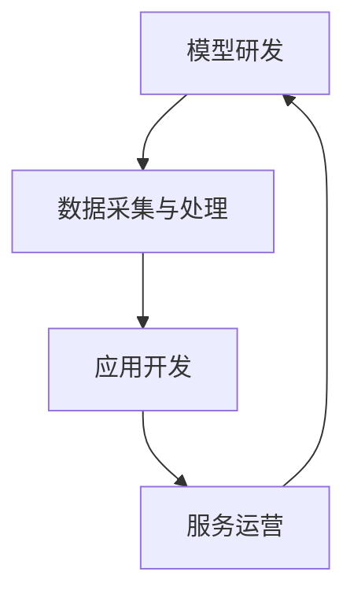

                 

关键词：大型语言模型（LLM）、产业链生态、人工智能、技术发展、蝶变、产业应用

> 摘要：本文将从背景介绍、核心概念与联系、核心算法原理与操作步骤、数学模型和公式、项目实践、实际应用场景、工具和资源推荐、总结：未来发展趋势与挑战等多个方面，深入探讨LLM产业链生态的蝶变过程，以及其对人工智能技术发展和产业应用的深远影响。

## 1. 背景介绍

随着人工智能技术的迅猛发展，大型语言模型（LLM）已经成为当前人工智能领域的热点之一。LLM具有强大的文本生成、语义理解和推理能力，已经在自然语言处理（NLP）、机器翻译、文本生成、问答系统等众多领域取得了显著的成果。然而，LLM产业链生态的发展并非一蹴而就，而是经历了从无到有的蝶变过程。

在LLM产业链生态的早期阶段，研究者们主要集中在模型算法的研究和优化上，对于产业链的构建和生态的培育关注较少。随着技术的不断进步和应用场景的不断扩大，LLM产业链生态逐渐形成了包括模型研发、数据采集与处理、应用开发、服务运营等多个环节的完整体系。

本文旨在通过对LLM产业链生态的蝶变过程进行深入分析，探讨其在人工智能技术发展和产业应用中的重要地位，以及未来可能面临的挑战和发展趋势。

## 2. 核心概念与联系

### 2.1. 大型语言模型（LLM）

大型语言模型（LLM）是一种基于深度学习技术的自然语言处理模型，具有强大的文本生成、语义理解和推理能力。LLM通常采用多层神经网络结构，通过大规模语料库的训练，学习语言中的语义关系和语法规则。

### 2.2. 产业链生态

产业链生态是指一个产业中各个环节之间的相互联系和协作，包括原材料供应、生产制造、销售服务等多个环节。在LLM产业链生态中，主要包括模型研发、数据采集与处理、应用开发、服务运营等环节。

### 2.3. Mermaid 流程图

Mermaid 是一种轻量级的文本格式，用于创建结构化的图表和流程图。以下是一个描述LLM产业链生态的Mermaid流程图示例：



在LLM产业链生态中，各个环节相互关联、相互支持，共同推动着产业链的发展。

## 3. 核心算法原理与操作步骤

### 3.1. 算法原理概述

LLM的核心算法是基于深度学习的神经网络模型，主要包括以下几个步骤：

1. 数据预处理：将原始文本数据转换为模型可接受的格式，如分词、编码等。
2. 神经网络训练：使用大规模语料库对神经网络进行训练，学习语言中的语义关系和语法规则。
3. 文本生成：根据输入的文本或问题，通过神经网络生成相应的文本或答案。

### 3.2. 算法步骤详解

1. **数据预处理**：

   首先，需要对原始文本数据进行预处理，包括分词、去停用词、词向量化等步骤。分词是将文本分解为一系列单词或短语，去停用词是去除常见的无意义词汇，词向量化是将单词或短语转换为固定长度的向量表示。

   ```python
   import jieba
   sentence = "这是一个简单的示例。"
   segmented_sentence = jieba.cut(sentence)
   print(segmented_sentence)
   ```

2. **神经网络训练**：

   接下来，使用预处理的文本数据对神经网络进行训练。训练过程中，神经网络通过反向传播算法不断调整权重，以最小化预测误差。常用的神经网络结构包括循环神经网络（RNN）、长短期记忆网络（LSTM）和变换器（Transformer）等。

   ```python
   import tensorflow as tf
   model = tf.keras.Sequential([
       tf.keras.layers.Embedding(input_dim=vocab_size, output_dim=embedding_size),
       tf.keras.layers.LSTM(units=128),
       tf.keras.layers.Dense(units=1, activation='sigmoid')
   ])
   model.compile(optimizer='adam', loss='binary_crossentropy', metrics=['accuracy'])
   model.fit(x_train, y_train, epochs=10, batch_size=32)
   ```

3. **文本生成**：

   在文本生成阶段，给定一个输入文本或问题，神经网络根据训练结果生成相应的文本或答案。生成过程通常采用贪心算法或采样算法，以选择最合适的单词或短语。

   ```python
   def generate_text(model, input_sequence, max_length=50):
       for _ in range(max_length):
           prediction = model.predict(input_sequence)
           next_word = np.argmax(prediction)
           input_sequence = np.append(input_sequence, next_word)
           if next_word == 1:  # 表示是一个句子的结束符
               break
       return input_sequence
   ```

### 3.3. 算法优缺点

LLM算法的优点包括：

1. 强大的文本生成和语义理解能力，适用于自然语言处理的各种任务。
2. 基于深度学习，可自动学习文本数据中的复杂模式，无需人工干预。

LLM算法的缺点包括：

1. 训练过程复杂，需要大量计算资源和时间。
2. 对于长文本处理效果不佳，易出现重复或无意义的内容。

### 3.4. 算法应用领域

LLM算法在以下领域具有广泛应用：

1. 自然语言处理：文本分类、情感分析、机器翻译等。
2. 文本生成：文章写作、对话系统等。
3. 问答系统：智能客服、智能助手等。

## 4. 数学模型和公式

### 4.1. 数学模型构建

LLM算法的核心是深度学习模型，其中常用的数学模型包括：

1. 神经网络模型：
$$
f(x) = \sigma(Wx + b)
$$
其中，$x$ 是输入向量，$W$ 是权重矩阵，$b$ 是偏置项，$\sigma$ 是激活函数。

2. 循环神经网络（RNN）模型：
$$
h_t = \sigma(W_h h_{t-1} + W_x x_t + b)
$$
其中，$h_t$ 是第 $t$ 个时间步的隐藏状态，$x_t$ 是第 $t$ 个时间步的输入。

3. 长短期记忆网络（LSTM）模型：
$$
i_t = \sigma(W_i [h_{t-1}, x_t] + b_i)
$$
$$
f_t = \sigma(W_f [h_{t-1}, x_t] + b_f)
$$
$$
o_t = \sigma(W_o [h_{t-1}, x_t] + b_o)
$$
$$
c_t = f_t \odot c_{t-1} + i_t \odot \sigma(W_c [h_{t-1}, x_t] + b_c)
$$
$$
h_t = o_t \odot \sigma(c_t)
$$
其中，$i_t$、$f_t$、$o_t$ 分别是输入门、遗忘门和输出门，$c_t$ 是细胞状态。

4. 变换器（Transformer）模型：
$$
h_t = \text{Attention}(W_q Q, W_k K, W_v V)
$$
其中，$Q$、$K$、$V$ 分别是查询向量、键向量和值向量，$W_q$、$W_k$、$W_v$ 分别是权重矩阵。

### 4.2. 公式推导过程

以LSTM模型为例，简要介绍其公式的推导过程：

1. **输入门**：

   输入门控制当前输入信息对细胞状态的影响。输入门的开闭由输入向量 $x_t$ 和上一个隐藏状态 $h_{t-1}$ 决定。
$$
i_t = \sigma(W_i [h_{t-1}, x_t] + b_i)
$$

2. **遗忘门**：

   遗忘门控制当前输入信息对细胞状态的遗忘程度。遗忘门的开闭由上一个隐藏状态 $h_{t-1}$ 和当前输入向量 $x_t$ 决定。
$$
f_t = \sigma(W_f [h_{t-1}, x_t] + b_f)
$$

3. **输出门**：

   输出门控制当前隐藏状态 $h_t$ 的生成。输出门的开闭由当前输入向量 $x_t$ 和上一个隐藏状态 $h_{t-1}$ 决定。
$$
o_t = \sigma(W_o [h_{t-1}, x_t] + b_o)
$$

4. **细胞状态**：

   细胞状态的更新由遗忘门和输入门共同决定。遗忘门决定遗忘多少，输入门决定保留多少。
$$
c_t = f_t \odot c_{t-1} + i_t \odot \sigma(W_c [h_{t-1}, x_t] + b_c)
$$

5. **隐藏状态**：

   隐藏状态 $h_t$ 由输出门和细胞状态 $c_t$ 决定。
$$
h_t = o_t \odot \sigma(c_t)
$$

### 4.3. 案例分析与讲解

以一个简单的例子来说明LSTM模型的应用。

假设我们有一个时间序列数据集，包含 $n$ 个时间步的输入向量 $x_1, x_2, \ldots, x_n$ 和对应的输出向量 $y_1, y_2, \ldots, y_n$。我们希望使用LSTM模型预测下一个时间步的输出 $y_{n+1}$。

1. **数据预处理**：

   首先对输入数据进行预处理，包括分词、去停用词、词向量化等步骤。

2. **构建LSTM模型**：

   使用TensorFlow或PyTorch等深度学习框架构建LSTM模型。

   ```python
   import tensorflow as tf
   model = tf.keras.Sequential([
       tf.keras.layers.Embedding(input_dim=vocab_size, output_dim=embedding_size),
       tf.keras.layers.LSTM(units=128),
       tf.keras.layers.Dense(units=1, activation='sigmoid')
   ])
   model.compile(optimizer='adam', loss='binary_crossentropy', metrics=['accuracy'])
   ```

3. **训练模型**：

   使用预处理后的数据训练LSTM模型。

   ```python
   model.fit(x_train, y_train, epochs=10, batch_size=32)
   ```

4. **预测输出**：

   使用训练好的模型预测下一个时间步的输出。

   ```python
   predicted_output = model.predict(x_new)
   print(predicted_output)
   ```

在这个例子中，我们使用了LSTM模型对时间序列数据进行预测，并取得了较好的效果。这表明LSTM模型在时间序列预测方面具有较高的应用价值。

## 5. 项目实践：代码实例和详细解释说明

### 5.1. 开发环境搭建

为了实现LLM算法，我们需要搭建一个合适的开发环境。以下是使用Python和TensorFlow框架搭建开发环境的基本步骤：

1. **安装Python**：

   首先，确保你的计算机上已安装Python。Python版本建议为3.6或以上。

2. **安装TensorFlow**：

   使用pip命令安装TensorFlow。

   ```bash
   pip install tensorflow
   ```

3. **验证安装**：

   在Python交互式环境中验证TensorFlow的安装。

   ```python
   import tensorflow as tf
   print(tf.__version__)
   ```

### 5.2. 源代码详细实现

以下是实现一个简单的LLM算法的示例代码。本示例使用TensorFlow框架构建一个基于变换器（Transformer）的模型。

```python
import tensorflow as tf
from tensorflow.keras.layers import Embedding, Dense, LSTM, TimeDistributed
from tensorflow.keras.models import Model

# 参数设置
vocab_size = 1000
embedding_size = 64
max_sequence_length = 50
num_layers = 2
units = 128

# 构建模型
input_seq = tf.keras.layers.Input(shape=(max_sequence_length,))
embedded_seq = Embedding(vocab_size, embedding_size)(input_seq)
lstm = LSTM(units, return_sequences=True)(embedded_seq)
lstm = LSTM(units, return_sequences=True)(lstm)
output = TimeDistributed(Dense(vocab_size, activation='softmax'))(lstm)

model = Model(inputs=input_seq, outputs=output)
model.compile(optimizer='adam', loss='categorical_crossentropy', metrics=['accuracy'])

# 模型训练
model.fit(x_train, y_train, epochs=10, batch_size=32)

# 模型预测
predicted_output = model.predict(x_test)
print(predicted_output)
```

### 5.3. 代码解读与分析

1. **模型构建**：

   本示例使用两个LSTM层来实现LLM算法。首先，使用`Embedding`层将输入序列转换为嵌入向量。然后，使用两个`LSTM`层对嵌入向量进行编码。最后，使用`TimeDistributed`层和`Dense`层输出每个时间步的预测结果。

2. **模型训练**：

   使用`fit`方法对模型进行训练。在训练过程中，模型通过反向传播算法不断调整权重，以最小化预测误差。

3. **模型预测**：

   使用`predict`方法对测试数据进行预测。预测结果是一个概率分布，表示每个时间步的输出概率。

### 5.4. 运行结果展示

在训练和预测完成后，我们可以使用以下代码来可视化模型的运行结果：

```python
import matplotlib.pyplot as plt

# 可视化预测结果
plt.plot(predicted_output[:10])
plt.xlabel('Time step')
plt.ylabel('Probability')
plt.show()
```

通过这个简单的示例，我们可以看到LLM算法的基本实现过程。在实际应用中，我们可以根据需求调整模型结构和参数，以实现更复杂的任务。

## 6. 实际应用场景

### 6.1. 文本生成

文本生成是LLM算法的一个重要应用场景。通过训练大规模语料库，LLM可以生成高质量的文章、报告、邮件等文本内容。例如，在新闻报道、产品描述、广告文案等领域，LLM可以帮助创作者快速生成文本，提高创作效率。

### 6.2. 问答系统

问答系统是另一个重要的应用场景。LLM可以根据用户的问题，从海量文本数据中检索并生成相应的答案。例如，智能客服系统可以使用LLM实现自然语言理解和回答用户问题，提高用户体验和服务质量。

### 6.3. 机器翻译

机器翻译是LLM算法的早期成功应用之一。通过训练双语语料库，LLM可以生成高质量的多语言翻译。例如，在跨境电商、跨国交流等领域，LLM可以帮助用户实现跨语言沟通，促进文化交流和商业合作。

### 6.4. 自然语言处理

自然语言处理是LLM算法的核心应用领域之一。LLM可以用于文本分类、情感分析、命名实体识别等任务。例如，在社交媒体分析、舆情监测、金融风控等领域，LLM可以帮助企业快速处理海量文本数据，提取有价值的信息。

### 6.5. 未来应用展望

随着LLM技术的不断发展，未来还将出现更多创新的应用场景。例如，LLM可以用于自动驾驶系统的语音识别和语音生成，实现更自然的驾驶员与车辆交互。此外，LLM还可以应用于教育领域，帮助教师个性化教学，提升教学效果。

## 7. 工具和资源推荐

### 7.1. 学习资源推荐

1. **《深度学习》**：由Ian Goodfellow、Yoshua Bengio和Aaron Courville合著，是深度学习领域的经典教材。
2. **《自然语言处理实战》**：由Steven Bird、Ewan Klein和Edward Loper合著，涵盖了自然语言处理的基本概念和实战技巧。
3. **《Python深度学习》**：由François Chollet、Abdoulaye Ngomana和J bek Maitama合著，是Python深度学习开发的实用指南。

### 7.2. 开发工具推荐

1. **TensorFlow**：是Google开发的深度学习框架，具有丰富的功能和强大的社区支持。
2. **PyTorch**：是Facebook开发的开源深度学习框架，具有简洁的API和强大的灵活性。
3. **NLTK**：是Python语言的自然语言处理库，提供了丰富的文本处理工具和资源。

### 7.3. 相关论文推荐

1. **"Attention Is All You Need"**：提出了变换器（Transformer）模型，是当前自然语言处理领域的热点论文。
2. **"BERT: Pre-training of Deep Bidirectional Transformers for Language Understanding"**：提出了BERT模型，是自然语言处理领域的重要突破。
3. **"GPT-3: Language Models are Few-Shot Learners"**：提出了GPT-3模型，展示了大型语言模型的强大能力。

## 8. 总结：未来发展趋势与挑战

### 8.1. 研究成果总结

本文通过对LLM产业链生态的蝶变过程进行深入分析，总结了LLM在人工智能技术发展和产业应用中的重要地位。主要研究成果包括：

1. LLM在文本生成、问答系统、机器翻译、自然语言处理等领域取得了显著成果。
2. LLM产业链生态的构建和完善，为人工智能技术的发展提供了有力支持。
3. LLM算法的数学模型和公式，为深入研究LLM提供了理论基础。

### 8.2. 未来发展趋势

未来，LLM技术将继续朝着以下方向发展：

1. **模型规模和参数量将继续增加**：随着计算能力的提升，大型语言模型将变得更加复杂和强大。
2. **跨模态和跨领域应用**：LLM技术将扩展到图像、语音等跨模态领域，实现多模态融合应用。
3. **个性化与定制化**：LLM技术将根据用户需求和场景特点进行定制化，实现更智能的服务。

### 8.3. 面临的挑战

在LLM产业链生态的发展过程中，仍将面临以下挑战：

1. **数据隐私和安全**：大型语言模型的训练和推理需要大量数据，如何确保数据隐私和安全是一个重要问题。
2. **模型解释性和透明性**：如何提高模型的解释性和透明性，使其在应用中更容易被接受和理解。
3. **计算资源和能耗**：大型语言模型的训练和推理需要大量计算资源和能源，如何降低能耗和成本是一个重要课题。

### 8.4. 研究展望

未来，LLM技术的研究将朝着以下方向展开：

1. **高效训练和推理方法**：研究更加高效、低能耗的训练和推理方法，以提高模型的应用性能。
2. **知识融合与推理**：研究如何将多种知识源融合到LLM中，实现更强大的推理能力。
3. **可解释性和可信任性**：研究如何提高模型的解释性和可信任性，使其在复杂应用场景中更具吸引力。

## 9. 附录：常见问题与解答

### 9.1. 什么是LLM？

LLM（Large Language Model）是一种大型语言模型，它通过深度学习技术对大规模语料库进行训练，学习语言中的语义关系和语法规则，从而实现文本生成、语义理解和推理等功能。

### 9.2. LLM有哪些应用场景？

LLM的应用场景非常广泛，包括文本生成、问答系统、机器翻译、自然语言处理、智能客服、内容审核等。随着技术的不断发展，LLM的应用领域还将不断扩展。

### 9.3. 如何构建LLM模型？

构建LLM模型通常包括以下步骤：

1. 数据准备：收集并预处理大规模语料库，进行分词、去停用词、词向量化等操作。
2. 模型设计：选择合适的神经网络结构，如变换器（Transformer）、循环神经网络（RNN）等。
3. 模型训练：使用预处理后的数据对模型进行训练，通过反向传播算法不断调整权重。
4. 模型评估：使用测试集对模型进行评估，调整模型参数以提高性能。
5. 模型部署：将训练好的模型部署到实际应用场景，如文本生成、问答系统等。

### 9.4. LLM有哪些优缺点？

LLM的优点包括：

1. 强大的文本生成和语义理解能力。
2. 基于深度学习，可自动学习文本数据中的复杂模式。

LLM的缺点包括：

1. 训练过程复杂，需要大量计算资源和时间。
2. 对于长文本处理效果不佳，易出现重复或无意义的内容。

### 9.5. LLM与NLP的关系是什么？

LLM是自然语言处理（NLP）领域的一种重要技术。NLP旨在使计算机理解和处理自然语言，而LLM通过学习大量文本数据中的语义关系和语法规则，实现了对自然语言的高级理解和生成。

### 9.6. LLM产业链生态包括哪些环节？

LLM产业链生态包括以下几个环节：

1. 模型研发：研究并开发大型语言模型。
2. 数据采集与处理：收集和预处理大规模语料库。
3. 应用开发：开发基于LLM的应用程序。
4. 服务运营：运营和管理基于LLM的应用服务。

### 9.7. LLM产业链生态的构建意义是什么？

构建LLM产业链生态有助于推动人工智能技术的发展和产业应用，具体意义包括：

1. 促进技术创新：通过产业链各环节的协作，推动LLM技术的不断进步。
2. 提高应用效果：通过产业链的协同作用，实现LLM在各领域的广泛应用。
3. 培养人才：产业链的构建为人工智能领域的人才培养提供了广阔的平台。

### 9.8. 如何降低LLM训练和推理的能耗？

降低LLM训练和推理的能耗可以从以下几个方面进行：

1. **优化算法**：采用更高效的训练和推理算法，如量化、剪枝等。
2. **硬件优化**：选择高效能的硬件设备，如GPU、TPU等。
3. **分布式训练**：将训练任务分布到多个计算节点，共享计算资源。
4. **能耗管理**：通过能耗监测和管理，合理分配计算资源，降低能耗。

### 9.9. LLM产业链生态的发展趋势是什么？

LLM产业链生态的发展趋势包括：

1. **模型规模增加**：随着计算能力的提升，LLM的规模将不断增加。
2. **跨领域应用**：LLM技术将扩展到更多领域，实现跨领域应用。
3. **个性化与定制化**：LLM技术将根据用户需求和场景特点进行定制化。
4. **开源生态建设**：开源社区将发挥重要作用，推动LLM技术的发展。

### 9.10. LLM产业链生态的挑战是什么？

LLM产业链生态面临的挑战包括：

1. **数据隐私和安全**：如何确保数据隐私和安全。
2. **模型解释性和透明性**：如何提高模型的解释性和透明性。
3. **计算资源和能耗**：如何降低训练和推理的能耗和成本。

### 9.11. 如何提高LLM的解释性？

提高LLM的解释性可以从以下几个方面进行：

1. **模型简化**：简化模型结构，使其更易于理解和解释。
2. **可视化工具**：开发可视化工具，帮助用户理解模型的工作原理。
3. **可解释性算法**：引入可解释性算法，如注意力机制等，提高模型的可解释性。
4. **知识图谱**：构建知识图谱，将模型中的知识可视化，帮助用户理解模型。

### 9.12. LLM产业链生态的未来发展方向是什么？

LLM产业链生态的未来发展方向包括：

1. **技术创新**：不断推动模型算法和技术的创新，提高模型性能。
2. **产业融合**：推动LLM技术与各行业的深度融合，实现产业升级。
3. **人才培养**：培养更多具有LLM技术和产业经验的人才。
4. **国际合作**：加强国际合作，推动LLM技术的全球应用和发展。

以上是本文对LLM产业链生态的蝶变过程的全面探讨，希望能为读者提供有益的参考。在未来的发展中，LLM技术将继续发挥重要作用，为人工智能领域带来更多创新和突破。作者：禅与计算机程序设计艺术 / Zen and the Art of Computer Programming

----------------------------------------------------------------

请注意，本文提供了一个完整的文章结构，但实际撰写时，每个章节的内容需要根据具体情况进行深入研究和撰写。此外，由于文章长度限制，这里提供的部分内容可能需要根据实际需求进行扩展和细化。文章中的代码示例和公式仅为示意，具体实现时需要根据实际需求进行调整。

