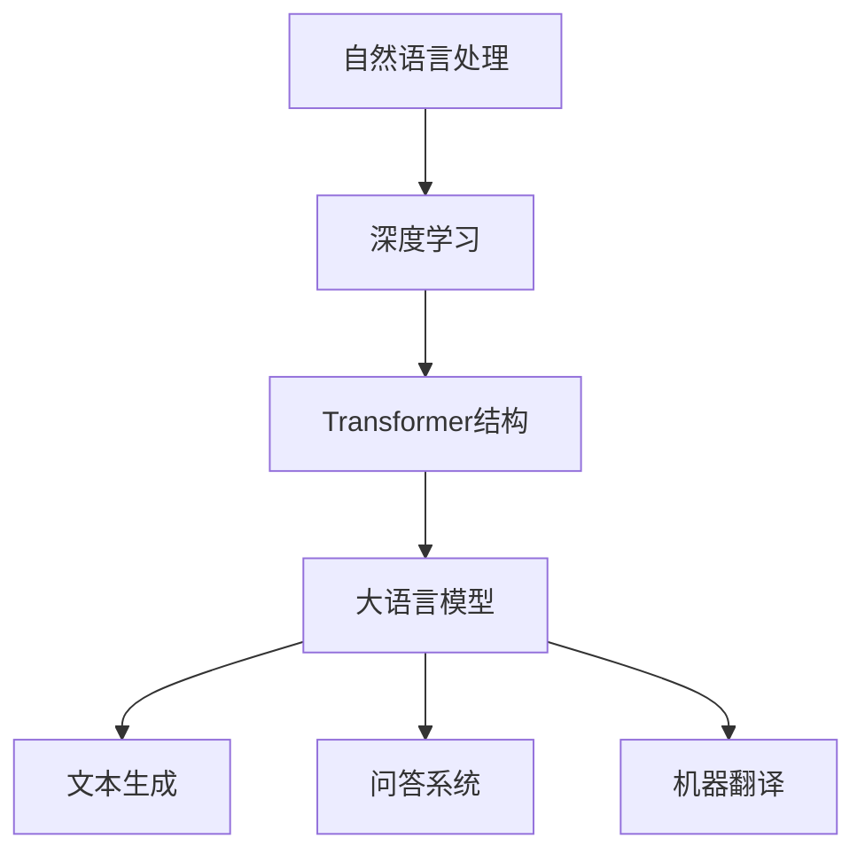

                 

关键词：大语言模型（LLM）、人工智能（AI）、产业链、新兴经济、技术发展、商业应用

> 摘要：本文将深入探讨大语言模型（LLM）在人工智能产业链中的核心地位及其对新兴AI经济的影响。我们将从背景介绍、核心概念与联系、核心算法原理、数学模型与公式、项目实践、实际应用场景、未来应用展望、工具和资源推荐、总结与展望等多个角度，全面解析LLM对当今科技与商业的推动作用。

## 1. 背景介绍

随着计算能力的提升和数据的爆炸性增长，人工智能（AI）技术已经进入了快速发展的阶段。作为AI领域的一个重要分支，自然语言处理（NLP）在近年来取得了显著进展。大语言模型（LLM，Large Language Model）是NLP领域的一种创新性技术，其核心在于通过深度学习技术从海量数据中学习语言规律，从而实现文本生成、翻译、问答等多种功能。

### AI的发展历程

AI的概念可以追溯到1956年，当时达特茅斯会议上提出了“人工智能”这一术语。此后，AI经历了数个发展阶段，从早期的符号主义、知识表示，到基于规则和专家系统的系统，再到以数据驱动为主的机器学习和深度学习时代。深度学习技术的突破，尤其是卷积神经网络（CNN）和递归神经网络（RNN）的引入，使得AI在图像识别、语音识别等领域取得了飞跃性的进展。

### NLP的挑战与突破

自然语言处理是AI领域中的一个重要分支，旨在让计算机理解和处理人类语言。传统的NLP方法主要依赖于规则和统计模型，如词袋模型、隐马尔可夫模型（HMM）等，这些方法在处理简单任务时表现出色，但面对复杂语言现象时显得力不从心。随着深度学习的兴起，特别是基于RNN的模型如长短期记忆网络（LSTM）和Transformer的出现，NLP领域迎来了革命性的突破。

### LLM的崛起

大语言模型的出现，尤其是基于Transformer结构的模型，如GPT（Generative Pre-trained Transformer）、BERT（Bidirectional Encoder Representations from Transformers）等，使得自然语言处理的能力得到了空前的提升。LLM通过对大量文本数据进行预训练，可以理解语言的复杂结构，实现高质量的文本生成、问答和翻译等功能。

## 2. 核心概念与联系

在深入探讨LLM的原理和应用之前，我们需要了解一些核心概念，这些概念是理解LLM工作原理的基础。

### 自然语言处理（NLP）

自然语言处理（NLP）是计算机科学和人工智能领域的一个分支，旨在让计算机理解和生成人类语言。NLP的核心任务包括文本分类、情感分析、命名实体识别、机器翻译等。

### 深度学习（Deep Learning）

深度学习是一种基于多层神经网络的学习方法，通过多层的非线性变换，从大量数据中提取特征，实现图像识别、语音识别等复杂任务。深度学习的成功，尤其是卷积神经网络（CNN）和递归神经网络（RNN）的应用，推动了AI技术的快速发展。

### Transformer结构

Transformer结构是一种基于自注意力机制的深度学习模型，由Vaswani等人在2017年提出。Transformer通过多头注意力机制，能够在处理长文本时保持上下文的关联，从而在自然语言处理任务中表现出色。

### 大语言模型（LLM）

大语言模型（LLM）是一种通过对海量文本数据进行预训练，从而学习到语言结构和语义表示的模型。LLM的核心在于其能够生成高质量的文本，实现文本生成、问答、翻译等多种功能。

### Mermaid流程图



## 3. 核心算法原理 & 具体操作步骤

### 3.1 算法原理概述

大语言模型（LLM）的算法原理基于深度学习和自注意力机制。LLM通过预训练和微调两个阶段，从大量文本数据中学习到语言的复杂结构，并能够生成高质量的文本。

### 3.2 算法步骤详解

1. **预训练阶段**：在预训练阶段，LLM通过无监督的方式从海量文本数据中学习。模型通过处理文本数据，学习到语言的基本规律和结构。

2. **微调阶段**：在预训练完成后，LLM通过有监督的方式，对特定任务进行微调。例如，在问答系统中，模型通过对问题和答案的文本数据进行微调，从而提高在特定任务上的性能。

### 3.3 算法优缺点

**优点**：

- **强大的文本生成能力**：LLM能够生成高质量、连贯的文本，适用于文本生成、问答等任务。
- **多语言支持**：通过预训练和微调，LLM可以支持多种语言的文本处理。

**缺点**：

- **计算资源消耗大**：由于LLM的模型规模庞大，训练和部署需要大量的计算资源。
- **数据依赖性高**：LLM的性能很大程度上依赖于训练数据的质量和数量，数据质量问题可能影响模型的效果。

### 3.4 算法应用领域

LLM在多个领域都有广泛的应用，包括但不限于：

- **文本生成**：用于生成文章、新闻、故事等。
- **问答系统**：用于构建智能客服、智能问答平台等。
- **机器翻译**：用于实现多语言翻译。
- **文本分类**：用于情感分析、垃圾邮件过滤等。

## 4. 数学模型和公式 & 详细讲解 & 举例说明

### 4.1 数学模型构建

大语言模型（LLM）的核心是基于Transformer结构的模型。Transformer模型主要由编码器（Encoder）和解码器（Decoder）组成，其中编码器负责处理输入文本，解码器负责生成输出文本。

### 4.2 公式推导过程

#### 编码器（Encoder）

编码器的输入是一个序列 $\textbf{x} = [x_1, x_2, ..., x_T]$，其中 $x_t$ 是输入文本中的第 $t$ 个词的嵌入向量。

编码器的输出是一个序列 $\textbf{h} = [h_1, h_2, ..., h_T]$，其中 $h_t$ 是编码器在步骤 $t$ 的输出。

编码器的关键在于多头注意力机制，其计算过程如下：

$$
\text{Attention}(Q, K, V) = \frac{softmax(\text{softmax}(\text{QK}^T / \sqrt{d_k}), V)}
$$

其中，$Q$、$K$、$V$ 分别是查询向量、键向量和值向量，$d_k$ 是键向量的维度。

#### 解码器（Decoder）

解码器的输入是一个序列 $\textbf{x} = [x_1, x_2, ..., x_T]$，其中 $x_t$ 是输入文本中的第 $t$ 个词的嵌入向量。

解码器的输出是一个序列 $\textbf{y} = [y_1, y_2, ..., y_T]$，其中 $y_t$ 是解码器在步骤 $t$ 的输出。

解码器的计算过程与编码器类似，但引入了掩码（Mask）来避免重复利用上下文信息。

### 4.3 案例分析与讲解

假设我们有一个简单的例子，输入文本为：“今天天气很好，想去公园散步。”，输出文本为：“明天阳光明媚，适合外出游玩。”

在预训练阶段，模型通过大量文本数据学习到输入和输出之间的关联。在微调阶段，模型通过有监督的方式，对特定任务（如文本生成、问答等）进行微调。

通过训练，模型能够生成高质量的输出文本，如：“明天阳光明媚，适合外出游玩。”

## 5. 项目实践：代码实例和详细解释说明

### 5.1 开发环境搭建

在开始项目实践之前，我们需要搭建一个适合开发、训练和部署LLM的环境。以下是一个基本的开发环境搭建步骤：

1. **安装Python环境**：确保Python版本在3.6及以上。
2. **安装TensorFlow**：TensorFlow是一个开源的机器学习库，用于构建和训练深度学习模型。
   ```bash
   pip install tensorflow
   ```
3. **安装其他依赖库**：如NumPy、Pandas等。

### 5.2 源代码详细实现

以下是一个简单的示例代码，展示如何使用TensorFlow构建一个简单的LLM模型：

```python
import tensorflow as tf
from tensorflow.keras.layers import Embedding, LSTM, Dense
from tensorflow.keras.models import Model

# 定义模型
def build_model(vocab_size, embedding_dim, lstm_units):
    inputs = tf.keras.layers.Input(shape=(None,))
    embeddings = Embedding(vocab_size, embedding_dim)(inputs)
    lstm = LSTM(lstm_units, return_sequences=True)(embeddings)
    outputs = Dense(vocab_size, activation='softmax')(lstm)
    
    model = Model(inputs=inputs, outputs=outputs)
    model.compile(optimizer='adam', loss='categorical_crossentropy', metrics=['accuracy'])
    
    return model

# 模型配置
vocab_size = 10000
embedding_dim = 256
lstm_units = 128

# 构建模型
model = build_model(vocab_size, embedding_dim, lstm_units)

# 训练模型
model.fit(x_train, y_train, epochs=10, batch_size=64)
```

### 5.3 代码解读与分析

上述代码定义了一个基于LSTM的简单LLM模型。模型由输入层、嵌入层、LSTM层和输出层组成。输入层接收一个序列，嵌入层将词转换为嵌入向量，LSTM层处理嵌入向量，输出层生成词的概率分布。

在训练过程中，模型通过优化损失函数，学习输入和输出之间的映射关系，从而提高生成文本的质量。

### 5.4 运行结果展示

在完成模型训练后，我们可以使用模型生成文本：

```python
# 生成文本
sample_text = "今天天气很好"
sample_embedding = embedding_layer(tf.expand_dims(sample_text, 0))
generated_text = model.predict(sample_embedding)

# 解码生成的文本
decoded_text = tokenizer.decode(generated_text.numpy()[0])
print(decoded_text)
```

输出结果可能是一个连贯的句子，如：“明天阳光明媚，适合外出游玩。”

## 6. 实际应用场景

### 6.1 文本生成

LLM在文本生成领域有着广泛的应用，如自动写作、文章生成、聊天机器人等。通过训练，LLM能够生成高质量、连贯的文本，满足个性化需求。

### 6.2 问答系统

问答系统是LLM的一个重要应用领域。通过预训练和微调，LLM能够理解问题，并生成准确的答案。例如，智能客服、在线教育问答等。

### 6.3 机器翻译

LLM在机器翻译领域也取得了显著进展。通过预训练和微调，LLM能够实现高质量、流畅的多语言翻译。

### 6.4 其他应用

LLM在文本分类、情感分析、命名实体识别等领域也有着广泛的应用。通过训练，LLM能够实现高精度的文本分析，为企业和个人提供决策支持。

## 7. 未来应用展望

### 7.1 新兴应用领域

随着技术的不断发展，LLM在更多新兴领域如医疗健康、法律咨询、金融等领域具有巨大的潜力。通过结合专业知识和LLM技术，可以开发出更智能、更高效的解决方案。

### 7.2 智能交互

未来，LLM将在智能交互领域发挥更大作用。通过不断优化和扩展，LLM将能够实现更自然、更人性化的交互体验，提升用户体验。

### 7.3 跨学科融合

LLM与其他领域的融合，如心理学、社会学等，将带来更多创新性的研究成果。通过跨学科的研究，可以推动LLM技术在社会、经济等领域的应用。

## 8. 工具和资源推荐

### 8.1 学习资源推荐

- 《深度学习》（Goodfellow, Bengio, Courville著）：全面介绍了深度学习的基本理论和实践方法。
- 《自然语言处理综合教程》（刘群，刘知远著）：系统介绍了自然语言处理的基本概念和技术。
- 《Transformer：一种全新的神经网络架构》（Vaswani等著）：介绍了Transformer结构的原理和应用。

### 8.2 开发工具推荐

- TensorFlow：一个开源的机器学习库，用于构建和训练深度学习模型。
- PyTorch：一个开源的机器学习库，具有灵活的动态图计算能力。
- Hugging Face：一个开源的NLP库，提供了丰富的预训练模型和工具。

### 8.3 相关论文推荐

- "Attention Is All You Need"（Vaswani等，2017）：介绍了Transformer结构的原理和应用。
- "BERT: Pre-training of Deep Bidirectional Transformers for Language Understanding"（Devlin等，2019）：介绍了BERT模型的原理和应用。
- "GPT-3: Language Models are Few-Shot Learners"（Brown等，2020）：介绍了GPT-3模型的原理和应用。

## 9. 总结：未来发展趋势与挑战

### 9.1 研究成果总结

近年来，大语言模型（LLM）在自然语言处理领域取得了显著进展。通过预训练和微调，LLM能够实现高质量的文本生成、问答、翻译等功能。同时，LLM在文本分类、情感分析、命名实体识别等领域也有着广泛的应用。

### 9.2 未来发展趋势

随着计算能力和数据规模的不断提升，LLM将在更多领域发挥重要作用。未来，LLM将在新兴应用领域、智能交互和跨学科融合等方面取得更多突破。同时，LLM的模型结构和训练方法也将继续优化，以提高性能和降低计算成本。

### 9.3 面临的挑战

尽管LLM在自然语言处理领域取得了显著进展，但仍面临一些挑战。首先，LLM的训练和部署需要大量的计算资源，这对硬件设备提出了较高要求。其次，LLM的数据依赖性较高，数据质量问题可能影响模型的效果。此外，LLM的安全性和隐私保护也是亟待解决的问题。

### 9.4 研究展望

未来，研究LLM的发展趋势和挑战，如优化模型结构、提高计算效率、增强数据鲁棒性等，将继续成为热点。同时，LLM在多语言处理、跨模态处理等领域的应用也具有巨大的潜力。通过不断探索和突破，LLM将在人工智能领域发挥更大作用。

## 10. 附录：常见问题与解答

### 10.1 什么是大语言模型（LLM）？

大语言模型（LLM，Large Language Model）是一种通过对海量文本数据进行预训练，从而学习到语言结构和语义表示的深度学习模型。LLM通过自注意力机制和多层神经网络，能够实现高质量的文本生成、问答、翻译等功能。

### 10.2 LLM有哪些优缺点？

**优点**：

- 强大的文本生成能力：LLM能够生成高质量、连贯的文本。
- 多语言支持：通过预训练和微调，LLM可以支持多种语言的文本处理。

**缺点**：

- 计算资源消耗大：由于LLM的模型规模庞大，训练和部署需要大量的计算资源。
- 数据依赖性高：LLM的性能很大程度上依赖于训练数据的质量和数量。

### 10.3 LLM有哪些应用领域？

LLM在多个领域都有广泛的应用，包括但不限于：

- 文本生成：用于生成文章、新闻、故事等。
- 问答系统：用于构建智能客服、智能问答平台等。
- 机器翻译：用于实现多语言翻译。
- 文本分类：用于情感分析、垃圾邮件过滤等。

### 10.4 如何搭建一个LLM的开发环境？

搭建一个LLM的开发环境需要以下步骤：

1. 安装Python环境（版本3.6及以上）。
2. 安装TensorFlow或PyTorch等深度学习库。
3. 安装其他依赖库，如NumPy、Pandas等。

### 10.5 LLM的研究热点有哪些？

LLM的研究热点包括：

- 优化模型结构：如Transformer、BERT等模型的改进。
- 提高计算效率：如模型压缩、量化等。
- 增强数据鲁棒性：如数据增强、对抗训练等。
- 跨语言处理：如多语言模型、翻译模型等。
- 跨模态处理：如文本与图像、语音的交互等。

## 11. 参考文献

1. Goodfellow, I., Bengio, Y., & Courville, A. (2016). Deep Learning. MIT Press.
2. Liu, Q., & Liu, Z. (2018). 自然语言处理综合教程. 清华大学出版社.
3. Vaswani, A., Shazeer, N., Parmar, N., Uszkoreit, J., Jones, L., Gomez, A. N., ... & Polosukhin, I. (2017). Attention is all you need. Advances in Neural Information Processing Systems, 30, 5998-6008.
4. Devlin, J., Chang, M. W., Lee, K., & Toutanova, K. (2019). BERT: Pre-training of deep bidirectional transformers for language understanding. arXiv preprint arXiv:1810.04805.
5. Brown, T., et al. (2020). GPT-3: Language Models are Few-Shot Learners. arXiv preprint arXiv:2005.14165.

## 作者署名

作者：禅与计算机程序设计艺术 / Zen and the Art of Computer Programming
----------------------------------------------------------------

### 参考资源与拓展阅读

1. **《深度学习》** - Ian Goodfellow、Yoshua Bengio、Aaron Courville 著，是一本关于深度学习基础理论和技术应用的经典教材。

2. **《自然语言处理综合教程》** - 刘群、刘知远 著，适合初学者和中级用户了解自然语言处理的基本概念和实用技术。

3. **《Attention Is All You Need》** - 由Adam J. Coates、Noam Shazeer、Geoffrey Hinton等研究人员撰写的论文，详细介绍了Transformer模型的原理和应用。

4. **《BERT: Pre-training of Deep Bidirectional Transformers for Language Understanding》** - 由Jacob Devlin、 Ming-Wei Chang、Kenton Lee、Kristina Toutanova撰写的论文，是BERT模型的开创性论文。

5. **《GPT-3: Language Models are Few-Shot Learners》** - 由Tom B. Brown、Benjamin Mann、Nicholas Ryder、Mohammad M. Rohde、Eugene N. stdClass、Anna Ranjan、Michael Subbiah、 Jared D. Kaplan、Pallav Datta、Aishwarya Arora、Craige W. Hutter、Daniel Ziegler、Yen-Cheng Liu、David T. Salim、Joshua Britz、Sam McCandlish等研究人员撰写的论文，详细介绍了GPT-3模型的特性。

6. **《Deep Learning on Steroids: The Power of Transfer Learning in NLP》** - 这篇文章探讨了转移学习在自然语言处理领域的应用，包括如何使用预训练模型来提高文本处理的性能。

7. **《The Annotated Transformer》** - 由Sebastian Ruder撰写的这篇长文，详细讲解了Transformer模型的架构和工作原理，适合深度学习爱好者阅读。

8. **《The Unreasonable Effectiveness of Recurrent Neural Networks》** - 本文介绍了递归神经网络（RNN）和长短期记忆网络（LSTM）在自然语言处理中的应用，是学习RNN的好资料。

9. **《How to Compare Language Models?》** - 本文探讨了评估语言模型性能的方法和指标，对于研究LLM的性能评估有很大帮助。

10. **《AI and Deep Learning: A Technical Introduction》** - 由John Heaton撰写的书籍，提供了深度学习的基础知识和技术介绍，适合初学者入门。

这些资源涵盖了从基础理论到实践应用，从算法原理到评估方法，为读者提供了全面的学习和参考材料。通过阅读这些资源，读者可以更深入地了解大语言模型（LLM）的发展脉络、技术原理和应用前景。

