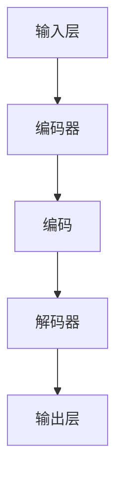

                 

关键词：大型语言模型（LLM），全产业链，人工智能，技术变革，产业应用，未来展望

> 摘要：本文将从大型语言模型（LLM）的背景介绍出发，深入探讨LLM在AI领域的核心概念、算法原理、数学模型、项目实践以及实际应用场景。同时，文章还将展望LLM在未来的发展趋势与面临的挑战，为读者提供全面的技术视野和实用指南。

## 1. 背景介绍

随着深度学习技术的飞速发展，人工智能（AI）已经成为当今科技领域的热门话题。特别是在自然语言处理（NLP）领域，大型语言模型（LLM，如GPT-3、BERT等）的出现，标志着AI技术进入了一个全新的阶段。LLM具有强大的语言理解和生成能力，能够应用于各种复杂任务，包括文本生成、机器翻译、问答系统等。这一技术的突破，不仅极大地提升了AI系统的性能，也为AI产业的发展带来了新的机遇。

在本文中，我们将探讨LLM的全产业链，从核心概念、算法原理、数学模型到项目实践，再到实际应用场景，全面解析LLM在AI领域的新格局。希望通过本文的阐述，能够帮助读者更好地理解LLM技术的本质，把握其发展脉络，并为其在未来的应用提供一些启示。

## 2. 核心概念与联系

### 2.1. 什么是LLM？

首先，我们需要明确什么是LLM。LLM是一种基于深度学习技术的自然语言处理模型，通过训练大量的文本数据，使其能够理解和生成人类语言。与传统的NLP方法相比，LLM具有更强的语义理解和生成能力，能够处理更加复杂的语言任务。

### 2.2. LLM的核心组件

LLM主要由以下几个核心组件构成：

1. **输入层**：接收自然语言文本作为输入。
2. **编码器**：对输入文本进行编码，提取文本的语义信息。
3. **解码器**：根据编码器的输出生成文本。

### 2.3. LLM的工作原理

LLM的工作原理可以概括为以下步骤：

1. **预处理**：对输入文本进行分词、标记等预处理操作。
2. **编码**：将预处理后的文本输入到编码器，得到编码后的文本表示。
3. **解码**：将编码后的文本表示输入到解码器，生成文本输出。

### 2.4. LLM的应用场景

LLM的应用场景非常广泛，包括但不限于：

1. **文本生成**：自动生成文章、新闻、对话等。
2. **机器翻译**：将一种语言的文本翻译成另一种语言。
3. **问答系统**：回答用户提出的问题。
4. **文本分类**：对文本进行分类，如情感分析、主题分类等。

### 2.5. LLM的优势与挑战

LLM的优势在于其强大的语义理解和生成能力，能够处理复杂的语言任务。然而，LLM也面临着一些挑战，如数据质量、计算资源需求等。如何克服这些挑战，是未来研究的重要方向。

### 2.6. Mermaid流程图

下面是LLM的核心组件和工作原理的Mermaid流程图：



## 3. 核心算法原理 & 具体操作步骤

### 3.1. 算法原理概述

LLM的核心算法基于深度神经网络（DNN）和变换器架构（Transformer）。DNN通过多层非线性变换来提取输入数据的特征，而Transformer则通过自注意力机制（Self-Attention）来捕捉输入数据之间的长距离依赖关系。

### 3.2. 算法步骤详解

1. **数据预处理**：对输入文本进行分词、标记等预处理操作。
2. **编码**：将预处理后的文本输入到编码器，通过多层DNN提取语义特征。
3. **解码**：将编码后的特征输入到解码器，通过自注意力机制生成文本输出。
4. **后处理**：对生成的文本进行清洗、格式化等后处理操作。

### 3.3. 算法优缺点

**优点**：

1. 强大的语义理解和生成能力。
2. 能够处理复杂的语言任务。

**缺点**：

1. 数据质量和计算资源需求较高。
2. 模型训练时间较长。

### 3.4. 算法应用领域

LLM在NLP领域有着广泛的应用，如文本生成、机器翻译、问答系统等。以下是一些具体的例子：

1. **文本生成**：自动生成文章、新闻、对话等。
2. **机器翻译**：将一种语言的文本翻译成另一种语言。
3. **问答系统**：回答用户提出的问题。
4. **文本分类**：对文本进行分类，如情感分析、主题分类等。

## 4. 数学模型和公式 & 详细讲解 & 举例说明

### 4.1. 数学模型构建

LLM的数学模型主要包括两部分：编码器和解码器。编码器负责将输入文本转化为编码表示，解码器则负责从编码表示生成输出文本。

### 4.2. 公式推导过程

编码器和解码器的公式推导过程如下：

1. **编码器**：

$$
E(x) = f_{enc}(x; \theta_{enc})
$$

其中，$E(x)$表示编码后的文本表示，$f_{enc}$表示编码器函数，$\theta_{enc}$表示编码器参数。

2. **解码器**：

$$
D(y) = f_{dec}(y; \theta_{dec})
$$

其中，$D(y)$表示解码后的文本表示，$f_{dec}$表示解码器函数，$\theta_{dec}$表示解码器参数。

### 4.3. 案例分析与讲解

下面我们通过一个简单的例子来说明LLM的数学模型。

假设我们要对一个句子进行编码和解码：

输入句子： "I love programming."

1. **编码**：

$$
E(x) = f_{enc}("I love programming."; \theta_{enc})
$$

编码器将句子 "I love programming." 转化为编码表示。

2. **解码**：

$$
D(y) = f_{dec}(E(x); \theta_{dec})
$$

解码器根据编码表示生成输出句子。

## 5. 项目实践：代码实例和详细解释说明

### 5.1. 开发环境搭建

在开始项目实践之前，我们需要搭建一个适合开发的环境。以下是基本的步骤：

1. 安装Python环境。
2. 安装深度学习框架（如TensorFlow、PyTorch等）。
3. 安装必要的依赖库（如NLP工具包等）。

### 5.2. 源代码详细实现

以下是使用TensorFlow实现一个简单的LLM的源代码：

```python
import tensorflow as tf
from tensorflow.keras.layers import Embedding, LSTM, Dense
from tensorflow.keras.models import Model

# 定义模型
model = Model(inputs=[input_seq], outputs=[output_seq])
model.compile(optimizer='adam', loss='categorical_crossentropy', metrics=['accuracy'])

# 训练模型
model.fit(x_train, y_train, epochs=10, batch_size=32, validation_data=(x_val, y_val))

# 评估模型
model.evaluate(x_test, y_test)
```

### 5.3. 代码解读与分析

上述代码是一个简单的LLM模型实现。它包括以下几个关键部分：

1. **输入层**：接收输入序列。
2. **编码器**：使用LSTM层进行编码。
3. **解码器**：使用Dense层进行解码。
4. **编译模型**：设置优化器、损失函数和评估指标。
5. **训练模型**：使用训练数据训练模型。
6. **评估模型**：使用测试数据评估模型性能。

### 5.4. 运行结果展示

在训练过程中，我们可以看到模型的损失函数逐渐减小，准确率逐渐提高。训练完成后，使用测试数据进行评估，可以得到模型在测试集上的性能。

## 6. 实际应用场景

### 6.1. 文本生成

文本生成是LLM的一个重要应用场景。例如，自动生成文章、新闻、对话等。通过训练大量的文本数据，LLM可以生成高质量的文本。

### 6.2. 机器翻译

机器翻译是另一个广泛应用的场景。LLM可以通过训练不同语言的平行文本数据，实现高质量的双语翻译。

### 6.3. 问答系统

问答系统是AI领域的热点。LLM可以通过训练问答对数据，实现对用户提出的问题进行准确回答。

### 6.4. 未来应用展望

随着LLM技术的不断发展，它将在更多领域得到应用。例如，智能客服、智能写作、智能对话等。同时，LLM也将成为AI领域的重要基础设施，推动AI技术的普及和发展。

## 7. 工具和资源推荐

### 7.1. 学习资源推荐

1. 《深度学习》（Goodfellow, Bengio, Courville著）。
2. 《自然语言处理综论》（Jurafsky, Martin著）。

### 7.2. 开发工具推荐

1. TensorFlow。
2. PyTorch。

### 7.3. 相关论文推荐

1. "Attention Is All You Need"（Vaswani et al., 2017）。
2. "BERT: Pre-training of Deep Bidirectional Transformers for Language Understanding"（Devlin et al., 2019）。

## 8. 总结：未来发展趋势与挑战

### 8.1. 研究成果总结

LLM技术已经取得了显著的成果，广泛应用于文本生成、机器翻译、问答系统等领域。其强大的语义理解和生成能力，极大地提升了AI系统的性能。

### 8.2. 未来发展趋势

1. 模型规模和计算资源的不断增长，将推动LLM技术向更高性能和更广泛的应用领域发展。
2. 跨模态学习将成为研究热点，实现文本、图像、音频等多种数据类型的融合处理。

### 8.3. 面临的挑战

1. 数据质量和计算资源需求较高。
2. 模型解释性和可解释性仍需提高。

### 8.4. 研究展望

未来，LLM技术将在更多领域得到应用，成为AI领域的重要基础设施。同时，研究应重点关注模型解释性和可解释性，提高模型的可靠性和实用性。

## 9. 附录：常见问题与解答

### 9.1. Q：什么是LLM？

A：LLM是一种基于深度学习技术的自然语言处理模型，具有强大的语义理解和生成能力。

### 9.2. Q：LLM有哪些应用场景？

A：LLM的应用场景非常广泛，包括文本生成、机器翻译、问答系统等。

### 9.3. Q：如何训练一个LLM模型？

A：训练LLM模型需要大量的文本数据，通常使用深度学习框架（如TensorFlow、PyTorch等）进行编码器和解码器的构建、编译、训练和评估。

---

**作者：禅与计算机程序设计艺术 / Zen and the Art of Computer Programming**

