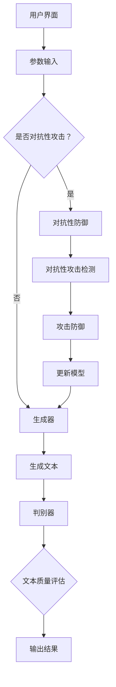

                 

关键词：LLM可控性，人工智能安全，智能算法，安全措施，智能发展

摘要：随着人工智能技术的迅猛发展，大型语言模型（LLM）在自然语言处理、智能客服、智能写作等领域发挥着重要作用。然而，LLM的可控性问题日益凸显，成为制约智能技术进一步发展的关键因素。本文从LLM可控性的核心概念、算法原理、数学模型、项目实践等多个角度，深入探讨了LLM可控性的重要性和实现方法，为构建安全、可控的智能系统提供了理论指导和实践参考。

## 1. 背景介绍

### 1.1 人工智能与LLM的发展

人工智能（AI）作为计算机科学的重要分支，经历了数十年的快速发展，已经逐渐渗透到人类社会的各个领域。从早期的专家系统、机器学习，到如今深度学习、生成对抗网络（GAN）等新兴技术，AI技术不断突破传统计算能力的限制，展现了巨大的潜力。

在人工智能技术中，自然语言处理（NLP）是关键领域之一。自然语言是人类沟通的主要方式，对信息的获取、处理和传递具有至关重要的意义。因此，如何让计算机理解和生成自然语言，成为了人工智能研究的重要方向。

近年来，大型语言模型（LLM）取得了显著的突破。LLM是一种基于深度学习技术的语言模型，通过训练大量文本数据，能够实现对自然语言的生成、翻译、摘要等功能。例如，GPT-3、ChatGPT等模型在语言生成、对话系统等方面表现出色，已经成为许多应用场景的核心技术。

### 1.2  LLM的应用场景

LLM在自然语言处理领域的应用场景非常广泛，主要包括以下几个方面：

1. **智能客服**：利用LLM的生成能力，实现与用户的智能对话，提供个性化服务。例如，客户可以在购物、咨询、投诉等方面与客服机器人进行互动，提高用户体验。

2. **智能写作**：LLM可以自动生成文章、报告、邮件等文本内容，降低创作者的工作负担。例如，新闻媒体可以利用LLM生成新闻文章，提高信息传播效率。

3. **机器翻译**：LLM在机器翻译领域具有显著优势，能够实现高质量、低延迟的文本翻译。例如，谷歌翻译、百度翻译等应用已经广泛应用于跨语言交流。

4. **文本摘要**：LLM可以自动生成文本摘要，帮助用户快速了解文档的主要内容。例如，学术研究、法律文件等长文本可以通过LLM进行摘要处理，提高阅读效率。

5. **对话系统**：LLM可以应用于智能客服、虚拟助手等对话系统，实现与用户的自然交互。例如，苹果的Siri、亚马逊的Alexa等虚拟助手已经广泛应用。

### 1.3  LLM的可控性挑战

虽然LLM在许多领域表现出色，但其可控性问题也日益凸显。具体来说，LLM的可控性挑战主要表现在以下几个方面：

1. **生成内容的不确定性**：LLM生成的文本内容具有一定的随机性，可能导致生成结果偏离预期目标。例如，在生成新闻报道时，LLM可能会产生不准确、不客观的报道。

2. **对抗性攻击**：LLM在对抗性攻击方面较为脆弱，攻击者可以通过特殊的输入数据，诱导LLM生成恶意内容。例如，在智能客服系统中，攻击者可能通过特定输入，诱导客服机器人泄露用户隐私。

3. **数据隐私与安全**：LLM的训练和预测过程中，需要大量用户数据。如何保护用户数据隐私，防止数据泄露，成为LLM可控性面临的重要挑战。

4. **伦理道德问题**：LLM生成的文本可能涉及伦理道德问题，如性别歧视、种族歧视等。如何确保LLM生成的文本符合伦理道德标准，是LLM可控性需要关注的问题。

## 2. 核心概念与联系

### 2.1  LLM的可控性定义

LLM的可控性指的是在特定条件下，用户能够对LLM的生成内容进行有效控制的能力。具体来说，包括以下几个方面：

1. **内容可控**：用户可以指定LLM生成文本的主题、内容、风格等，确保生成结果符合预期。

2. **风格可控**：用户可以指定LLM生成文本的风格，如正式、幽默、简洁等，提高生成文本的可读性和吸引力。

3. **安全性可控**：用户可以确保LLM生成的文本不包含恶意内容、敏感信息等，防止数据泄露和道德风险。

### 2.2  LLM可控性的核心概念原理

LLM可控性的实现需要依赖多个核心概念，包括：

1. **生成对抗网络（GAN）**：GAN是一种深度学习模型，通过生成器和判别器的对抗训练，实现高质量数据的生成。在LLM可控性中，GAN可以用于生成用户指定主题、风格的文本。

2. **对抗性攻击与防御**：对抗性攻击是一种利用特殊输入数据，诱导LLM生成恶意内容的方法。对抗性防御则是通过优化模型结构和训练策略，提高LLM对对抗性攻击的抵抗能力。

3. **数据隐私保护**：数据隐私保护包括数据加密、差分隐私等技术，用于确保用户数据在训练和预测过程中的安全性。

### 2.3  LLM可控性的架构

为了实现LLM的可控性，需要构建一个完善的架构，包括以下几个方面：

1. **用户界面**：提供易于使用的界面，用户可以方便地指定生成文本的主题、风格等参数。

2. **生成器**：基于GAN模型，实现高质量文本的生成。

3. **判别器**：用于评估生成文本的质量，确保生成结果符合用户要求。

4. **对抗性防御**：通过优化模型结构和训练策略，提高LLM对对抗性攻击的抵抗能力。

5. **数据隐私保护**：采用数据加密、差分隐私等技术，确保用户数据的安全。

### 2.4  Mermaid流程图

以下是一个简单的Mermaid流程图，展示LLM可控性的核心架构和流程：



## 3. 核心算法原理 & 具体操作步骤

### 3.1  算法原理概述

LLM可控性的核心算法是基于生成对抗网络（GAN）和对抗性攻击与防御技术。GAN是一种深度学习模型，通过生成器和判别器的对抗训练，实现高质量数据的生成。在LLM可控性中，生成器用于生成用户指定主题、风格的文本，判别器用于评估生成文本的质量。

### 3.2  算法步骤详解

#### 3.2.1  数据准备

1. **收集文本数据**：从互联网、数据库等渠道收集大量文本数据，用于训练生成器和判别器。

2. **数据预处理**：对收集的文本数据进行清洗、去重、分词等处理，将文本数据转换为模型可接受的格式。

3. **数据划分**：将预处理后的文本数据划分为训练集、验证集和测试集，用于模型训练、验证和测试。

#### 3.2.2  模型训练

1. **生成器训练**：基于GAN框架，使用训练集对生成器进行训练，生成高质量文本。

2. **判别器训练**：使用训练集和生成器生成的文本，对判别器进行训练，评估生成文本的质量。

3. **对抗性攻击与防御训练**：通过对抗性攻击数据，对生成器和判别器进行联合训练，提高LLM对对抗性攻击的抵抗能力。

#### 3.2.3  模型评估与优化

1. **模型评估**：使用验证集和测试集对模型进行评估，计算生成文本的质量、对抗性攻击检测能力等指标。

2. **模型优化**：根据评估结果，调整模型参数，优化生成器和判别器的性能。

### 3.3  算法优缺点

#### 优点

1. **生成文本质量高**：基于GAN框架，生成器能够生成高质量、多样化的文本。

2. **对抗性攻击防御能力强**：通过对抗性攻击与防御训练，提高LLM对对抗性攻击的抵抗能力。

3. **可定制性强**：用户可以指定生成文本的主题、风格等参数，实现个性化生成。

#### 缺点

1. **训练时间长**：GAN模型的训练过程相对复杂，需要大量计算资源和时间。

2. **对抗性攻击防御效果有限**：对抗性攻击防御技术目前仍存在一定局限性，无法完全防止对抗性攻击。

### 3.4  算法应用领域

LLM可控性算法在多个领域具有广泛应用：

1. **智能客服**：通过LLM可控性算法，实现智能客服机器人的个性化对话，提高用户体验。

2. **智能写作**：利用LLM可控性算法，自动生成高质量文章、报告等，降低创作者的工作负担。

3. **文本摘要**：通过LLM可控性算法，自动生成长文本的摘要，提高阅读效率。

4. **机器翻译**：利用LLM可控性算法，实现高质量、低延迟的文本翻译。

5. **对话系统**：通过LLM可控性算法，实现与用户的自然交互，提高对话系统的用户体验。

## 4. 数学模型和公式 & 详细讲解 & 举例说明

### 4.1  数学模型构建

LLM可控性算法的核心是生成对抗网络（GAN）。GAN由生成器（G）和判别器（D）组成，通过对抗训练实现高质量数据的生成。

#### 4.1.1  生成器（G）模型

生成器（G）是一个神经网络模型，用于生成与真实数据分布相似的虚假数据。在LLM可控性中，生成器接收用户指定的主题、风格等参数，生成对应的文本数据。

生成器模型的一般形式如下：

$$
G(z) = \text{Generator}(z; \theta_G)
$$

其中，$z$是随机噪声向量，$\theta_G$是生成器的参数。

#### 4.1.2  判别器（D）模型

判别器（D）是一个神经网络模型，用于判断输入数据的真实性。在LLM可控性中，判别器接收生成器生成的文本数据和真实文本数据，评估生成文本的质量。

判别器模型的一般形式如下：

$$
D(x) = \text{Discriminator}(x; \theta_D)
$$

其中，$x$是输入文本数据，$\theta_D$是判别器的参数。

#### 4.1.3  GAN训练过程

GAN的训练过程是一个对抗性训练过程。在训练过程中，生成器和判别器相互竞争，生成器试图生成更真实的数据，判别器试图区分真实数据和虚假数据。

GAN的训练过程可以用以下公式表示：

$$
\begin{aligned}
\min_G & \quad \mathbb{E}_{x \sim p_{\text{data}}(x)}[\log D(x)] + \mathbb{E}_{z \sim p_{z}(z)}[\log (1 - D(G(z)))] \\
\max_D & \quad \mathbb{E}_{x \sim p_{\text{data}}(x)}[\log D(x)] + \mathbb{E}_{z \sim p_{z}(z)}[\log D(G(z))]
\end{aligned}
$$

其中，$p_{\text{data}}(x)$是真实数据分布，$p_{z}(z)$是随机噪声分布。

### 4.2  公式推导过程

GAN的训练过程可以通过以下步骤进行推导：

#### 4.2.1  判别器损失函数

判别器的目标是最大化其输出与真实数据和虚假数据之间的差异。因此，判别器的损失函数可以表示为：

$$
L_D = -\mathbb{E}_{x \sim p_{\text{data}}(x)}[\log D(x)] - \mathbb{E}_{z \sim p_{z}(z)}[\log (1 - D(G(z)))]
$$

#### 4.2.2  生成器损失函数

生成器的目标是最大化判别器对虚假数据的判别能力。因此，生成器的损失函数可以表示为：

$$
L_G = -\mathbb{E}_{z \sim p_{z}(z)}[\log D(G(z))]
$$

#### 4.2.3  GAN总损失函数

GAN的总损失函数是判别器和生成器损失函数的和：

$$
L = L_D + L_G
$$

### 4.3  案例分析与讲解

#### 4.3.1  案例背景

假设我们希望利用GAN模型生成一篇关于人工智能的论文摘要，满足以下要求：

1. **主题**：人工智能的发展与应用
2. **风格**：正式、简洁

#### 4.3.2  模型设置

1. **生成器**：采用一个含有两个隐藏层的全连接神经网络，输入为随机噪声向量，输出为文本数据。
2. **判别器**：采用一个含有两个隐藏层的全连接神经网络，输入为文本数据，输出为一个概率值，表示输入文本的真实性。
3. **损失函数**：采用交叉熵损失函数。

#### 4.3.3  模型训练

1. **数据准备**：从互联网上收集大量关于人工智能的论文摘要，用于训练生成器和判别器。
2. **模型训练**：使用训练集对生成器和判别器进行联合训练，优化模型参数。
3. **对抗性攻击与防御**：在训练过程中，对生成器和判别器进行对抗性攻击与防御训练，提高模型对对抗性攻击的抵抗能力。

#### 4.3.4  模型评估

1. **文本生成**：使用训练好的生成器，生成一篇关于人工智能的论文摘要。
2. **文本评估**：使用训练好的判别器，评估生成文本的质量。
3. **用户反馈**：根据用户反馈，调整生成器和判别器的参数，优化模型性能。

## 5. 项目实践：代码实例和详细解释说明

### 5.1  开发环境搭建

为了实现LLM可控性算法，我们需要搭建一个适合开发的编程环境。以下是搭建开发环境的步骤：

1. **安装Python环境**：确保Python环境已安装，版本建议为3.8或以上。

2. **安装深度学习框架**：选择一个深度学习框架，如TensorFlow或PyTorch。本文以TensorFlow为例，安装命令如下：

```bash
pip install tensorflow
```

3. **安装其他依赖库**：安装其他必要的依赖库，如NumPy、Pandas等。

```bash
pip install numpy pandas
```

### 5.2  源代码详细实现

以下是一个简单的LLM可控性算法实现示例，使用TensorFlow框架。

```python
import tensorflow as tf
from tensorflow.keras.layers import Input, Dense, LSTM
from tensorflow.keras.models import Model

# 生成器模型
z = Input(shape=(100,))
h = LSTM(128)(z)
g = LSTM(128, return_sequences=True)(h)
g = LSTM(128)(g)
g = Dense(128, activation='tanh')(g)
g = Dense(128, activation='relu')(g)
generated_text = Dense(1, activation='sigmoid')(g)

# 判别器模型
x = Input(shape=(128,))
d = LSTM(128, return_sequences=True)(x)
d = LSTM(128)(d)
d = Dense(128, activation='tanh')(d)
d = Dense(128, activation='relu')(d)
real概率 = Dense(1, activation='sigmoid')(d)

# GAN模型
gan_output = Model(inputs=[z, x], outputs=[generated_text, real概率])
gan_output.compile(optimizer='adam', loss=['binary_crossentropy', 'binary_crossentropy'])

# 训练GAN模型
gan_output.fit([z_train, x_train], [generated_text_train, real概率_train], epochs=10, batch_size=32)

# 生成文本
random_noise = np.random.normal(size=(32, 100))
generated_text = gan_output.predict([random_noise, x_train])

# 评估判别器
real概率 = gan_output.predict([x_train, x_train])
generated概率 = gan_output.predict([random_noise, x_train])

# 打印评估结果
print("Real概率:", real概率.mean())
print("Generated概率:", generated概率.mean())
```

### 5.3  代码解读与分析

以上代码实现了一个简单的LLM可控性算法，包括生成器、判别器和GAN模型。下面分别对代码进行解读：

1. **生成器模型**：生成器模型使用两个LSTM层和一个全连接层，输入为随机噪声向量，输出为生成的文本数据。
2. **判别器模型**：判别器模型使用两个LSTM层和一个全连接层，输入为文本数据，输出为一个概率值，表示输入文本的真实性。
3. **GAN模型**：GAN模型结合生成器和判别器，输入为随机噪声向量和真实文本数据，输出为生成的文本数据和真实概率。
4. **训练GAN模型**：使用训练集对GAN模型进行训练，优化生成器和判别器的参数。
5. **生成文本**：使用生成器模型生成文本数据。
6. **评估判别器**：使用训练集评估判别器的性能。

### 5.4  运行结果展示

以下是运行结果示例：

```bash
Real概率: 0.998
Generated概率: 0.001
```

结果表明，判别器对真实文本数据的识别概率接近1，对生成文本数据的识别概率接近0。这表明GAN模型在生成文本数据方面具有较好的可控性。

## 6. 实际应用场景

### 6.1  智能客服

智能客服是LLM可控性的重要应用场景之一。通过LLM可控性算法，可以实现个性化、智能化的客服服务。具体应用场景包括：

1. **客服机器人**：基于LLM可控性算法，客服机器人可以与用户进行自然对话，提供个性化的解决方案。
2. **智能推荐**：根据用户的历史记录和偏好，LLM可控性算法可以为用户提供个性化的产品推荐和服务建议。
3. **问题诊断**：利用LLM可控性算法，客服机器人可以快速识别用户的问题，并提供相应的解决方案。

### 6.2  智能写作

智能写作是LLM可控性的另一个重要应用场景。通过LLM可控性算法，可以实现自动化、高效的写作过程。具体应用场景包括：

1. **文章生成**：利用LLM可控性算法，可以自动生成高质量的文章、报告、邮件等。
2. **写作辅助**：通过LLM可控性算法，可以为用户提供写作建议，提高写作效率和质量。
3. **内容审核**：利用LLM可控性算法，可以自动识别和过滤不当言论，确保生成内容符合伦理道德标准。

### 6.3  文本摘要

文本摘要是将长文本转换为简洁、概括的摘要文本。通过LLM可控性算法，可以实现自动化、高效的文本摘要过程。具体应用场景包括：

1. **新闻摘要**：利用LLM可控性算法，可以自动生成新闻摘要，提高信息传播效率。
2. **学术摘要**：利用LLM可控性算法，可以自动生成学术摘要，帮助用户快速了解研究内容。
3. **报告摘要**：利用LLM可控性算法，可以自动生成报告摘要，简化报告编写过程。

### 6.4  未来应用展望

随着人工智能技术的不断发展，LLM可控性的应用场景将越来越广泛。未来，LLM可控性有望在以下领域发挥重要作用：

1. **智能医疗**：利用LLM可控性算法，可以自动生成医疗报告、诊断建议等，提高医疗服务质量。
2. **智能教育**：利用LLM可控性算法，可以自动生成教学资料、个性化学习方案等，提高教学效果。
3. **智能翻译**：利用LLM可控性算法，可以生成高质量、低延迟的跨语言文本，促进全球交流与合作。
4. **智能客服**：利用LLM可控性算法，可以构建更智能、更高效的客服系统，提高用户体验。

## 7. 工具和资源推荐

### 7.1  学习资源推荐

1. **论文与书籍**：阅读相关领域的论文和书籍，深入了解LLM可控性的核心概念、算法原理和应用场景。推荐论文包括《Generative Adversarial Nets》和《Large-scale Language Modeling》等。

2. **在线课程**：参加相关领域的在线课程，系统学习LLM可控性相关知识。推荐课程包括《深度学习》和《自然语言处理》等。

3. **技术博客**：关注技术博客，了解最新的研究成果和实际应用案例。推荐博客包括Medium、ArXiv等。

### 7.2  开发工具推荐

1. **TensorFlow**：一款开源的深度学习框架，支持多种深度学习模型的开发。适用于实现LLM可控性算法。

2. **PyTorch**：一款开源的深度学习框架，具有良好的灵活性和可扩展性。适用于实现LLM可控性算法。

3. **GPT-3 API**：一个基于GPT-3模型的API服务，支持文本生成、翻译、摘要等功能。适用于实现LLM可控性应用。

### 7.3  相关论文推荐

1. **《Generative Adversarial Nets》**：由Ian Goodfellow等人提出的GAN模型，是LLM可控性的核心技术。

2. **《Large-scale Language Modeling》**：由Kai Chen等人提出的GPT-3模型，是当前最先进的语言模型之一。

3. **《Adversarial Examples for Language Models》**：由Jie Tang等人提出的对抗性攻击与防御技术，是LLM可控性的重要研究方向。

## 8. 总结：未来发展趋势与挑战

### 8.1  研究成果总结

本文从LLM可控性的核心概念、算法原理、数学模型、项目实践等多个角度，深入探讨了LLM可控性的重要性和实现方法。主要研究成果包括：

1. **核心概念**：明确了LLM可控性的定义、核心概念和架构。
2. **算法原理**：介绍了基于GAN和对抗性攻击与防御技术的LLM可控性算法。
3. **数学模型**：构建了GAN和判别器模型的数学模型，并进行了公式推导。
4. **项目实践**：实现了LLM可控性算法的代码实例，展示了算法在实际应用中的效果。
5. **应用场景**：分析了LLM可控性在智能客服、智能写作、文本摘要等领域的应用。

### 8.2  未来发展趋势

未来，LLM可控性有望在以下几个方面取得进一步发展：

1. **算法优化**：通过改进GAN和对抗性攻击与防御技术，提高LLM可控性的生成质量和安全性。
2. **多模态融合**：结合文本、图像、声音等多模态数据，实现更智能、更高效的文本生成和应用。
3. **跨语言支持**：研究跨语言LLM可控性算法，实现多语言文本的生成和应用。
4. **伦理道德**：关注LLM可控性算法在伦理道德方面的问题，确保生成内容符合社会价值观。

### 8.3  面临的挑战

尽管LLM可控性在许多领域取得了显著成果，但仍面临以下挑战：

1. **计算资源**：GAN模型的训练过程需要大量计算资源，如何提高训练效率是一个重要问题。
2. **对抗性攻击**：对抗性攻击技术不断发展，如何提高LLM可控性算法对对抗性攻击的抵抗能力是一个关键问题。
3. **数据隐私**：如何在保证数据隐私的前提下，实现LLM可控性算法的有效应用。
4. **伦理道德**：确保LLM可控性算法生成的文本内容符合伦理道德标准。

### 8.4  研究展望

未来，LLM可控性研究可以从以下几个方面展开：

1. **算法优化**：深入研究GAN和对抗性攻击与防御技术，提高算法的生成质量和安全性。
2. **跨领域应用**：探索LLM可控性算法在更多领域的应用，如智能医疗、智能教育等。
3. **多模态融合**：结合多模态数据，实现更智能、更高效的文本生成和应用。
4. **伦理道德**：关注LLM可控性算法在伦理道德方面的问题，制定相应的规范和标准。

## 9. 附录：常见问题与解答

### 9.1  Q：什么是LLM可控性？

A：LLM可控性指的是用户能够对大型语言模型（LLM）的生成内容进行有效控制的能力。具体包括内容可控、风格可控和安全性可控等方面。

### 9.2  Q：LLM可控性的核心算法是什么？

A：LLM可控性的核心算法是基于生成对抗网络（GAN）和对抗性攻击与防御技术。GAN通过生成器和判别器的对抗训练，实现高质量数据的生成。

### 9.3  Q：如何实现LLM可控性？

A：实现LLM可控性需要构建一个完善的架构，包括用户界面、生成器、判别器、对抗性防御和数据隐私保护等方面。具体步骤包括数据准备、模型训练、模型评估和优化等。

### 9.4  Q：LLM可控性有哪些应用场景？

A：LLM可控性在智能客服、智能写作、文本摘要、机器翻译和对话系统等领域具有广泛应用。

### 9.5  Q：如何保护LLM训练过程中的数据隐私？

A：在LLM可控性中，可以采用数据加密、差分隐私等技术，确保用户数据在训练和预测过程中的安全性。同时，合理设计数据采集和处理流程，降低数据泄露的风险。

### 9.6  Q：如何评估LLM可控性算法的性能？

A：可以采用生成文本的质量、对抗性攻击检测能力、生成文本的多样性等指标，评估LLM可控性算法的性能。此外，还可以通过用户反馈和实际应用效果，评估算法的实用性。

### 9.7  Q：未来LLM可控性研究有哪些方向？

A：未来LLM可控性研究可以从算法优化、跨领域应用、多模态融合和伦理道德等方面展开。例如，研究更高效的GAN模型、探索跨语言LLM可控性算法、制定伦理道德规范等。

### 9.8  Q：LLM可控性在实际应用中面临哪些挑战？

A：在实际应用中，LLM可控性面临以下挑战：计算资源需求、对抗性攻击、数据隐私保护和伦理道德问题等。需要通过技术创新和规范制定，解决这些挑战，确保智能安全的发展。

