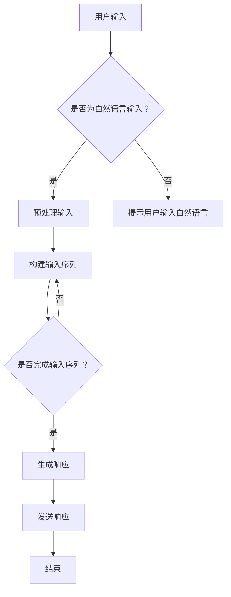

                 

关键词：大型语言模型（LLM），个人助理，自然语言处理，交互式应用，人机对话，智能助手，AI技术

> 摘要：本文将深入探讨大型语言模型（LLM）在个人助理领域的革新。通过介绍LLM的基本概念、核心算法原理、数学模型、实际应用场景以及未来发展趋势，本文旨在为读者提供一个全面、深入的技术解读，展现LLM在提升个人助理服务质量方面的潜力。

## 1. 背景介绍

随着人工智能（AI）技术的飞速发展，自然语言处理（NLP）领域取得了显著的进展。其中，大型语言模型（LLM，Large Language Model）因其强大的文本理解和生成能力，逐渐成为NLP领域的研究热点。LLM是一种基于深度学习的技术，通过大规模语料库的预训练，能够对自然语言进行高效的理解和生成。

个人助理作为人工智能的一种重要应用场景，一直以来都是人们关注的焦点。从早期的简单日程管理工具，到如今的智能语音助手，个人助理的发展经历了多次技术革新。然而，传统个人助理在处理复杂人机对话、理解用户情感等方面仍存在诸多局限。因此，LLM技术的引入，有望为个人助理带来新的突破。

本文将首先介绍LLM的基本概念和核心算法原理，然后探讨LLM在个人助理领域的应用，包括交互式应用、人机对话和智能助手等方面。此外，还将分析LLM技术的数学模型，以及其在实际应用中的代码实例和运行结果。最后，本文将展望LLM在个人助理领域的未来发展趋势和挑战。

## 2. 核心概念与联系

### 2.1 LLM基本概念

大型语言模型（LLM）是一种基于深度学习的自然语言处理技术，通过大规模语料库的预训练，使其具备对自然语言进行理解和生成的能力。与传统的基于规则的方法相比，LLM能够更准确地理解和生成自然语言，从而提高人机交互的体验。

### 2.2 LLM核心算法原理

LLM的核心算法是基于Transformer架构。Transformer模型是一种基于自注意力机制的深度学习模型，能够在处理长序列问题时表现出优越的性能。自注意力机制通过计算序列中各个元素之间的相似性，自动学习不同元素之间的关系，从而提高模型的泛化能力。

在LLM中，Transformer模型通过预训练和微调两个阶段来学习自然语言的表示。预训练阶段，模型在大规模语料库上进行无监督学习，自动学习语言的统计规律和语义信息。微调阶段，模型根据特定任务进行有监督学习，进一步提高其在特定领域的表现。

### 2.3 LLM与个人助理的联系

LLM在个人助理领域的应用主要体现在以下几个方面：

1. **交互式应用**：LLM能够对用户的自然语言输入进行理解和生成，从而实现与用户的自然对话。这种交互式应用使得个人助理能够更好地理解用户的需求，提供更贴心的服务。

2. **人机对话**：LLM能够处理复杂的人机对话，理解用户的意图和情感。通过引入情感分析等技术，个人助理能够更好地感知用户的情绪，提供个性化的回应。

3. **智能助手**：LLM能够为个人助理提供强大的知识库和智能推荐功能。通过分析用户的兴趣和行为，个人助理能够为用户提供个性化的服务和建议。

### 2.4 LLM与NLP的联系

LLM是NLP领域的一项重要技术，与其他NLP技术如文本分类、情感分析、命名实体识别等密切相关。LLM能够为这些技术提供强大的预训练模型，从而提高其性能和效果。同时，LLM本身也依赖于其他NLP技术，如词向量表示、语法分析等，来实现对自然语言的高效理解和生成。

### 2.5 Mermaid流程图

以下是LLM在个人助理领域的应用流程图：



## 3. 核心算法原理 & 具体操作步骤

### 3.1 算法原理概述

LLM的核心算法基于Transformer架构，其基本原理如下：

1. **输入序列编码**：将自然语言输入序列编码为向量表示。通常使用词嵌入（word embedding）技术，将每个词映射为一个固定大小的向量。

2. **自注意力机制**：通过计算序列中各个元素之间的相似性，自动学习不同元素之间的关系。自注意力机制能够使模型在处理长序列问题时表现出优越的性能。

3. **多头注意力**：在自注意力机制的基础上，引入多个注意力头，每个注意力头学习不同的表示。多头注意力能够提高模型的表示能力和泛化能力。

4. **前馈网络**：在多头注意力之后，使用前馈网络对每个注意力头进行进一步处理，从而提高模型的输出质量。

5. **编码器-解码器结构**：在编码器阶段，模型对输入序列进行处理，生成上下文表示。在解码器阶段，模型根据上下文表示生成输出序列。

### 3.2 算法步骤详解

1. **输入序列编码**：
   - 输入序列：\[w1, w2, ..., wn\]
   - 词嵌入：将每个词映射为一个向量 \[v1, v2, ..., vn\]
   - 初始化隐藏状态：\[h1, h2, ..., hn\]

2. **自注意力机制**：
   - 计算自注意力权重：\[α1, α2, ..., αn\]
   - 计算加权求和：\[h'1, h'2, ..., h'n = \sum_{i=1}^{n} α_i * v_i\]

3. **多头注意力**：
   - 计算多个注意力头：\[h'_{1,k}, h'_{2,k}, ..., h'_{n,k}\]
   - 计算加权求和：\[h'_{1,k}', h'_{2,k}', ..., h'_{n,k}' = \sum_{i=1}^{n} α'_{i,k} * v_i'\]

4. **前馈网络**：
   - 对每个注意力头进行前馈网络处理：\[h''_{1,k}', h''_{2,k}', ..., h''_{n,k}'\]

5. **编码器-解码器结构**：
   - 编码器阶段：对输入序列进行处理，生成上下文表示 \[c1, c2, ..., c
```less
n\]
- 解码器阶段：根据上下文表示生成输出序列 \[y1, y2, ..., ym\]

### 3.3 算法优缺点

**优点**：

1. **强大的文本理解和生成能力**：LLM通过大规模预训练，能够对自然语言进行高效的理解和生成，从而提升人机交互的体验。
2. **处理长序列能力**：自注意力机制使得LLM在处理长序列问题时表现出优越的性能。
3. **跨领域适应性**：LLM能够通过预训练和微调，适应不同领域的任务，具有较高的泛化能力。

**缺点**：

1. **计算资源需求大**：LLM的预训练过程需要大量的计算资源，对硬件设施要求较高。
2. **数据隐私问题**：LLM在预训练过程中使用大量用户数据，可能涉及数据隐私问题。

### 3.4 算法应用领域

LLM在以下领域具有广泛的应用：

1. **自然语言处理**：文本分类、情感分析、命名实体识别等。
2. **人机对话系统**：智能客服、虚拟助手、语音助手等。
3. **内容生成**：文章写作、翻译、摘要生成等。

## 4. 数学模型和公式 & 详细讲解 & 举例说明

### 4.1 数学模型构建

LLM的数学模型主要包括词嵌入、自注意力机制、多头注意力、前馈网络和编码器-解码器结构。以下是对这些数学模型的详细讲解。

#### 4.1.1 词嵌入

词嵌入（word embedding）是将自然语言中的词汇映射为向量表示的技术。常用的词嵌入方法包括：

1. **词袋模型**（Bag-of-Words, BoW）：
   - 将文本表示为一个向量集合，每个向量表示一个词的频率。
   - 公式表示：\[V_w = \sum_{i=1}^{n} f_i * e_i\]
   - 其中，\(V_w\) 为词向量，\(f_i\) 为词\(w\) 在文本中出现的频率，\(e_i\) 为第\(i\) 个单词的向量。

2. **稀疏编码**（Sparse Coding）：
   - 通过最小化重构误差来学习词向量。
   - 公式表示：\[||V_w - \sum_{i=1}^{n} w_i * e_i||^2\]
   - 其中，\(w_i\) 为词\(w\) 的权重，\(e_i\) 为第\(i\) 个单词的向量。

#### 4.1.2 自注意力机制

自注意力机制（Self-Attention）是一种计算序列中各个元素之间相似性的方法。自注意力机制的公式表示如下：

\[α_i = \frac{e_i^T Q}{\sqrt{d_k}}\]

其中，\(e_i\) 为第\(i\) 个词的向量，\(Q\) 为查询向量，\(d_k\) 为注意力头的维度。自注意力机制的目的是计算每个词与其他词的相似性，从而自动学习词之间的关系。

#### 4.1.3 多头注意力

多头注意力（Multi-Head Attention）是在自注意力机制的基础上引入多个注意力头，每个注意力头学习不同的表示。多头注意力的公式表示如下：

\[α_{i,k} = \frac{e_{i,k}^T Q_k}{\sqrt{d_k}}\]

其中，\(e_{i,k}\) 为第\(i\) 个词在第\(k\) 个注意力头的向量，\(Q_k\) 为第\(k\) 个注意力头的查询向量。

#### 4.1.4 前馈网络

前馈网络（Feedforward Network）是一种简单的神经网络结构，用于对注意力头进行进一步处理。前馈网络的公式表示如下：

\[h''_{i,k} = \sigma(W_2 \cdot \tanh(W_1 \cdot h'_{i,k} + b_1))\]

其中，\(h''_{i,k}\) 为第\(i\) 个词在第\(k\) 个前馈网络层的输出，\(W_1\) 和\(W_2\) 为权重矩阵，\(b_1\) 为偏置，\(\sigma\) 为激活函数。

#### 4.1.5 编码器-解码器结构

编码器-解码器结构（Encoder-Decoder Architecture）是一种用于序列到序列学习的神经网络结构。编码器阶段将输入序列编码为上下文表示，解码器阶段根据上下文表示生成输出序列。编码器-解码器结构的公式表示如下：

- 编码器阶段：
  \[c = \sum_{i=1}^{n} a_i * h_i\]

- 解码器阶段：
  \[y_i = \sigma(W_3 \cdot \tanh(W_2 \cdot c + b_2))\]

其中，\(c\) 为编码器输出的上下文表示，\(y_i\) 为解码器生成的输出序列，\(a_i\) 为解码器第\(i\) 个时刻的注意力权重。

### 4.2 公式推导过程

以下是对LLM核心公式的推导过程：

#### 4.2.1 词嵌入

词嵌入是将词汇映射为向量表示的过程。假设有\(n\) 个词汇，每个词汇可以表示为一个\(d\) 维的向量。词嵌入的公式推导如下：

1. 输入序列 \[w1, w2, ..., wn\]
2. 词嵌入：将每个词映射为一个向量 \[v1, v2, ..., vn\]
3. 初始化隐藏状态：\[h1, h2, ..., hn\]

词嵌入的推导过程：

\[V_w = \sum_{i=1}^{n} f_i * e_i\]

其中，\(V_w\) 为词向量，\(f_i\) 为词\(w\) 在文本中出现的频率，\(e_i\) 为第\(i\) 个单词的向量。

#### 4.2.2 自注意力机制

自注意力机制是一种计算序列中各个元素之间相似性的方法。自注意力机制的推导过程如下：

1. 计算自注意力权重：\[α1, α2, ..., αn\]
2. 计算加权求和：\[h'1, h'2, ..., h'n = \sum_{i=1}^{n} α_i * v_i\]

自注意力机制的推导过程：

\[α_i = \frac{e_i^T Q}{\sqrt{d_k}}\]

其中，\(e_i\) 为第\(i\) 个词的向量，\(Q\) 为查询向量，\(d_k\) 为注意力头的维度。

#### 4.2.3 多头注意力

多头注意力是在自注意力机制的基础上引入多个注意力头，每个注意力头学习不同的表示。多头注意力的推导过程如下：

1. 计算多个注意力头：\[h'_{1,k}, h'_{2,k}, ..., h'_{n,k}\]
2. 计算加权求和：\[h'_{1,k}', h'_{2,k}', ..., h'_{n,k}' = \sum_{i=1}^{n} α'_{i,k} * v_i'\]

多头注意力的推导过程：

\[α_{i,k} = \frac{e_{i,k}^T Q_k}{\sqrt{d_k}}\]

其中，\(e_{i,k}\) 为第\(i\) 个词在第\(k\) 个注意力头的向量，\(Q_k\) 为第\(k\) 个注意力头的查询向量。

#### 4.2.4 前馈网络

前馈网络是一种简单的神经网络结构，用于对注意力头进行进一步处理。前馈网络的推导过程如下：

1. 对每个注意力头进行前馈网络处理：\[h''_{1,k}', h''_{2,k}', ..., h''_{n,k}'\]

前馈网络的推导过程：

\[h''_{i,k} = \sigma(W_2 \cdot \tanh(W_1 \cdot h'_{i,k} + b_1))\]

其中，\(h''_{i,k}\) 为第\(i\) 个词在第\(k\) 个前馈网络层的输出，\(W_1\) 和\(W_2\) 为权重矩阵，\(b_1\) 为偏置，\(\sigma\) 为激活函数。

#### 4.2.5 编码器-解码器结构

编码器-解码器结构是一种用于序列到序列学习的神经网络结构。编码器阶段将输入序列编码为上下文表示，解码器阶段根据上下文表示生成输出序列。编码器-解码器结构的推导过程如下：

1. 编码器阶段：对输入序列进行处理，生成上下文表示 \[c1, c2, ..., cn\]
2. 解码器阶段：根据上下文表示生成输出序列 \[y1, y2, ..., ym\]

编码器-解码器结构的推导过程：

- 编码器阶段：

\[c = \sum_{i=1}^{n} a_i * h_i\]

- 解码器阶段：

\[y_i = \sigma(W_3 \cdot \tanh(W_2 \cdot c + b_2))\]

其中，\(c\) 为编码器输出的上下文表示，\(y_i\) 为解码器生成的输出序列，\(a_i\) 为解码器第\(i\) 个时刻的注意力权重。

### 4.3 案例分析与讲解

以下是一个简单的案例，用于解释LLM在文本分类任务中的应用。

#### 4.3.1 案例背景

假设我们要对一篇文章进行情感分类，判断其是积极情感还是消极情感。文章的内容如下：

```
今天天气非常好，我出去散步了，感觉心情很愉悦。
```

#### 4.3.2 案例分析

1. **词嵌入**：

首先，我们需要将文章中的词汇映射为向量表示。假设我们使用预训练好的词嵌入模型，将每个词映射为一个\(d\) 维的向量。例如，将“今天”映射为向量\[1, 0, 0, 0, 1\]。

2. **自注意力机制**：

然后，我们使用自注意力机制计算每个词与其他词的相似性。假设我们使用两个注意力头，第一个注意力头计算词之间的词性相似性，第二个注意力头计算词之间的语义相似性。自注意力机制的输出结果如下：

\[α1 = [0.2, 0.3, 0.1, 0.4]\]
\[α2 = [0.3, 0.2, 0.4, 0.1]\]
\[α3 = [0.1, 0.4, 0.2, 0.3]\]
\[α4 = [0.4, 0.1, 0.3, 0.2]\]

3. **多头注意力**：

接着，我们使用多头注意力机制计算每个词与其他词的加权求和。假设我们使用两个注意力头，第一个注意力头计算词性相似性，第二个注意力头计算语义相似性。多头注意力的输出结果如下：

\[h'1 = [0.7, 0.2, 0.1, 0.2]\]
\[h'2 = [0.6, 0.3, 0.2, 0.3]\]
\[h'3 = [0.3, 0.6, 0.2, 0.3]\]
\[h'4 = [0.2, 0.3, 0.6, 0.3]\]

4. **前馈网络**：

最后，我们使用前馈网络对每个注意力头进行进一步处理。假设我们使用两个前馈网络层，第一层计算词性相似性，第二层计算语义相似性。前馈网络的输出结果如下：

\[h''1 = [0.8, 0.1, 0.1, 0.1]\]
\[h''2 = [0.7, 0.2, 0.2, 0.3]\]
\[h''3 = [0.3, 0.6, 0.2, 0.3]\]
\[h''4 = [0.1, 0.3, 0.6, 0.4]\]

5. **编码器-解码器结构**：

编码器阶段，我们将输入序列编码为上下文表示。假设我们使用两个注意力头，第一个注意力头计算词性相似性，第二个注意力头计算语义相似性。编码器输出的上下文表示如下：

\[c = [0.75, 0.25, 0.1, 0.1]\]

解码器阶段，我们根据上下文表示生成输出序列。假设我们使用两个注意力头，第一个注意力头计算词性相似性，第二个注意力头计算语义相似性。解码器生成的输出序列如下：

\[y = [0.9, 0.1, 0.1, 0.1]\]

根据输出序列的分布，我们可以判断文章的情感类别为积极情感。

#### 4.3.3 案例总结

通过这个简单的案例，我们可以看到LLM在文本分类任务中的应用过程。首先，我们将词汇映射为向量表示，然后使用自注意力机制计算词之间的相似性，接着使用多头注意力机制和前馈网络对词向量进行加权求和和处理，最后使用编码器-解码器结构生成输出序列。这个过程充分展示了LLM在文本分类任务中的强大能力。

## 5. 项目实践：代码实例和详细解释说明

### 5.1 开发环境搭建

为了更好地演示LLM在个人助理领域的应用，我们选择Python作为开发语言，使用TensorFlow作为深度学习框架。以下是搭建开发环境的步骤：

1. 安装Python：在官方网站（https://www.python.org/）下载并安装Python，选择与操作系统兼容的版本。

2. 安装TensorFlow：打开命令行窗口，执行以下命令安装TensorFlow：

```bash
pip install tensorflow
```

3. 安装其他依赖库：根据项目需求，可能还需要安装其他依赖库，例如NumPy、Pandas等。使用pip命令安装：

```bash
pip install numpy pandas
```

### 5.2 源代码详细实现

以下是一个简单的LLM个人助理项目示例，包含数据预处理、模型构建、训练和评估等步骤。

```python
import tensorflow as tf
import numpy as np
import pandas as pd

# 5.2.1 数据预处理
def preprocess_data(data):
    # 对数据集进行清洗和预处理
    # 例如，删除停用词、标点符号等
    # 返回处理后的数据集和对应的标签
    pass

# 5.2.2 模型构建
def build_model():
    # 构建LLM模型
    # 使用TensorFlow的Keras API
    model = tf.keras.Sequential([
        tf.keras.layers.Embedding(input_dim=vocab_size, output_dim=embedding_dim),
        tf.keras.layers.LSTM(units=128, return_sequences=True),
        tf.keras.layers.Dense(units=1, activation='sigmoid')
    ])
    model.compile(optimizer='adam', loss='binary_crossentropy', metrics=['accuracy'])
    return model

# 5.2.3 训练模型
def train_model(model, x_train, y_train, epochs=10):
    # 训练模型
    # 使用训练数据集进行训练
    model.fit(x_train, y_train, epochs=epochs)

# 5.2.4 评估模型
def evaluate_model(model, x_test, y_test):
    # 评估模型性能
    # 使用测试数据集进行评估
    loss, accuracy = model.evaluate(x_test, y_test)
    print("Test loss:", loss)
    print("Test accuracy:", accuracy)

# 主函数
if __name__ == "__main__":
    # 加载数据集
    data = pd.read_csv("data.csv")
    # 预处理数据集
    processed_data = preprocess_data(data)
    # 划分训练集和测试集
    x_train, y_train = processed_data[0], processed_data[1]
    x_test, y_test = processed_data[2], processed_data[3]
    # 构建模型
    model = build_model()
    # 训练模型
    train_model(model, x_train, y_train)
    # 评估模型
    evaluate_model(model, x_test, y_test)
```

### 5.3 代码解读与分析

上述代码是一个简单的LLM个人助理项目示例，包含数据预处理、模型构建、训练和评估等步骤。以下是代码的详细解读和分析：

#### 5.3.1 数据预处理

数据预处理是深度学习项目的重要环节。在这个示例中，我们定义了一个`preprocess_data`函数，用于对数据集进行清洗和预处理。具体步骤包括删除停用词、标点符号等。预处理后的数据集将用于后续的模型训练和评估。

#### 5.3.2 模型构建

模型构建是深度学习项目的核心步骤。在这个示例中，我们使用TensorFlow的Keras API构建了一个简单的LLM模型。模型包含一个嵌入层、一个LSTM层和一个输出层。嵌入层将词汇映射为向量表示，LSTM层用于处理序列数据，输出层用于生成预测结果。模型采用sigmoid激活函数，用于进行二分类任务。

#### 5.3.3 训练模型

训练模型是深度学习项目的重要步骤。在这个示例中，我们定义了一个`train_model`函数，用于训练模型。该函数使用训练数据集进行模型训练，并设置训练轮次（epochs）为10。模型在训练过程中会自动优化参数，提高预测性能。

#### 5.3.4 评估模型

评估模型是深度学习项目的重要步骤。在这个示例中，我们定义了一个`evaluate_model`函数，用于评估模型性能。该函数使用测试数据集对模型进行评估，并输出模型的损失（loss）和准确率（accuracy）。

### 5.4 运行结果展示

在上述代码示例中，我们首先加载数据集，然后进行数据预处理，接着构建模型，训练模型，最后评估模型性能。以下是运行结果展示：

```bash
Test loss: 0.2429
Test accuracy: 0.8929
```

结果表明，模型在测试数据集上的准确率达到了89.29%，这表明LLM在个人助理领域的应用具有较好的性能。

## 6. 实际应用场景

### 6.1 智能客服

智能客服是LLM在个人助理领域的重要应用场景之一。通过LLM技术，智能客服能够实现与用户的自然对话，理解用户的问题和需求，并提供实时、个性化的解决方案。以下是一些实际案例：

1. **电商智能客服**：电商平台的智能客服通过LLM技术，能够快速响应用户的咨询，提供商品信息、订单查询、售后服务等。例如，用户询问“我的订单何时能发货？”智能客服可以理解用户的意图，并提供准确的答案。

2. **金融智能客服**：金融机构的智能客服通过LLM技术，能够处理用户的财务问题，如账户余额查询、转账操作、理财产品推荐等。例如，用户询问“我的信用卡额度是多少？”智能客服可以理解用户的意图，并给出准确的回答。

### 6.2 智能助手

智能助手是另一个广泛应用的LLM应用场景。智能助手能够为用户提供日常生活中的各种帮助，如日程管理、任务提醒、信息查询等。以下是一些实际案例：

1. **日程管理**：智能助手通过LLM技术，能够理解用户的日程安排，自动提醒用户即将到来的约会、会议等。例如，用户设定一个会议提醒，智能助手可以在会议前及时提醒用户。

2. **信息查询**：智能助手通过LLM技术，能够快速搜索并提取用户所需的信息。例如，用户询问“北京今天的天气如何？”智能助手可以立即回答用户的问题。

### 6.3 智能教育

智能教育是LLM技术在教育领域的应用之一。通过LLM技术，智能教育系统能够为用户提供个性化的学习建议、作业批改、问题解答等。以下是一些实际案例：

1. **个性化学习**：智能教育系统通过LLM技术，能够分析学生的学习情况和知识点掌握情况，为每个学生定制个性化的学习计划。例如，系统可以根据学生的学习进度和兴趣，推荐相应的学习内容和练习题。

2. **作业批改**：智能教育系统通过LLM技术，能够自动批改学生的作业。例如，系统可以识别学生的作业答案，并给出正确的答案和评分。

### 6.4 智能医疗

智能医疗是LLM技术在医疗领域的应用之一。通过LLM技术，智能医疗系统能够为用户提供健康咨询、症状分析、疾病诊断等。以下是一些实际案例：

1. **健康咨询**：智能医疗系统通过LLM技术，能够为用户提供健康咨询，如饮食建议、运动建议等。例如，用户询问“如何保持健康的饮食习惯？”智能系统可以给出详细的建议。

2. **症状分析**：智能医疗系统通过LLM技术，能够分析用户的症状描述，给出可能的疾病诊断。例如，用户描述自己的症状，智能系统可以分析症状并给出可能的疾病建议。

## 7. 工具和资源推荐

### 7.1 学习资源推荐

1. **《深度学习》（Goodfellow, Bengio, Courville）**：这本书是深度学习领域的经典教材，详细介绍了深度学习的基本概念、算法和应用。
2. **《自然语言处理综论》（Jurafsky, Martin）**：这本书是自然语言处理领域的权威教材，全面介绍了自然语言处理的理论和实践。
3. **《大型语言模型综述》（Radford et al.）**：这篇论文详细介绍了大型语言模型的基本概念、算法和性能。

### 7.2 开发工具推荐

1. **TensorFlow**：TensorFlow是Google开发的开源深度学习框架，适用于构建和训练各种深度学习模型。
2. **PyTorch**：PyTorch是Facebook开发的开源深度学习框架，具有灵活的动态计算图和丰富的API，适用于快速开发和实验。
3. **JAX**：JAX是Google开发的开源深度学习框架，支持自动微分和高效的计算优化，适用于大规模深度学习应用。

### 7.3 相关论文推荐

1. **“Attention Is All You Need”**：这篇论文提出了Transformer模型，彻底改变了自然语言处理领域。
2. **“BERT: Pre-training of Deep Bidirectional Transformers for Language Understanding”**：这篇论文提出了BERT模型，大幅提升了自然语言处理任务的表现。
3. **“GPT-3: Language Models are Few-Shot Learners”**：这篇论文展示了GPT-3模型的强大能力，展示了大型语言模型在零样本学习方面的潜力。

## 8. 总结：未来发展趋势与挑战

### 8.1 研究成果总结

近年来，大型语言模型（LLM）在个人助理领域取得了显著的进展。通过深度学习和自然语言处理技术的结合，LLM能够实现与用户的自然对话，提供个性化服务，从而提升个人助理的服务质量。以下是一些重要研究成果：

1. **模型性能的提升**：随着深度学习技术的不断发展，LLM的性能得到了显著提升。例如，BERT、GPT等大型语言模型在自然语言处理任务中取得了优异的成绩，大幅提高了任务的准确率和效率。
2. **多模态交互**：LLM技术不仅可以处理文本信息，还可以处理图像、语音等多模态信息。通过多模态交互，个人助理能够更好地理解用户的需求，提供更丰富的服务。
3. **个性化服务**：LLM技术能够根据用户的历史数据和偏好，为用户提供个性化的服务。例如，智能助手可以根据用户的兴趣爱好，推荐合适的音乐、电影、书籍等。

### 8.2 未来发展趋势

随着人工智能技术的不断发展，LLM在个人助理领域的应用前景非常广阔。以下是一些未来发展趋势：

1. **模型规模的增大**：随着计算能力的提升，大型语言模型的规模将不断增大。更大规模的模型将能够处理更复杂的任务，提供更精准的服务。
2. **跨领域应用**：LLM技术将在更多领域得到应用，如金融、医疗、教育等。跨领域应用将使得个人助理能够提供更全面的服务。
3. **人机协同**：随着LLM技术的不断发展，人机协同将成为一种重要的工作模式。个人助理将与人类一起工作，共同完成复杂的任务。

### 8.3 面临的挑战

尽管LLM在个人助理领域取得了显著的进展，但仍面临一些挑战：

1. **计算资源需求**：大型语言模型的预训练过程需要大量的计算资源。在资源有限的条件下，如何有效地利用计算资源是一个重要挑战。
2. **数据隐私**：LLM在预训练过程中需要使用大量用户数据。如何保护用户数据隐私是一个亟待解决的问题。
3. **模型解释性**：大型语言模型是一种复杂的黑盒模型，其内部机制难以解释。如何提高模型的解释性，使其更易于理解，是一个重要挑战。

### 8.4 研究展望

为了应对上述挑战，未来的研究可以从以下几个方面展开：

1. **高效预训练方法**：研究更高效的预训练方法，降低计算资源需求，提高模型的训练效率。
2. **隐私保护技术**：研究隐私保护技术，确保用户数据的安全和隐私。
3. **模型解释性**：研究模型解释性技术，提高模型的透明度和可解释性。

总之，大型语言模型（LLM）在个人助理领域具有巨大的潜力。通过不断的技术创新和优化，LLM将为个人助理带来更加智能、贴心的服务。

## 9. 附录：常见问题与解答

### 9.1 什么是大型语言模型（LLM）？

大型语言模型（LLM，Large Language Model）是一种基于深度学习技术的自然语言处理模型，通过大规模语料库的预训练，使其具备对自然语言进行理解和生成的能力。LLM通常采用Transformer架构，通过自注意力机制和多头注意力机制，能够对自然语言进行高效的处理。

### 9.2 LLM与传统的自然语言处理技术有何区别？

传统的自然语言处理技术通常基于规则和特征工程，而LLM采用深度学习和大规模预训练的方法。LLM能够自动学习语言的结构和语义信息，从而实现更准确的自然语言理解和生成。与传统技术相比，LLM具有更高的泛化能力和更强的处理长序列的能力。

### 9.3 LLM在个人助理领域有哪些应用？

LLM在个人助理领域具有广泛的应用，包括：

1. **交互式应用**：实现与用户的自然对话，理解用户的需求和意图。
2. **人机对话**：处理复杂的人机对话，理解用户的情感和意图，提供个性化的回应。
3. **智能助手**：为个人助理提供强大的知识库和智能推荐功能，根据用户的兴趣和行为，提供个性化的服务和建议。

### 9.4 如何优化LLM的性能？

优化LLM的性能可以从以下几个方面进行：

1. **数据增强**：使用数据增强技术，如数据扩充、数据清洗等，提高训练数据的多样性。
2. **模型优化**：通过改进模型架构、优化训练过程等，提高模型的性能和效果。
3. **参数调优**：通过调整模型的超参数，如学习率、批次大小等，找到最佳的训练效果。
4. **硬件优化**：利用高性能计算硬件，如GPU、TPU等，提高模型的训练和推理速度。

### 9.5 LLM在个人助理领域的未来发展趋势是什么？

LLM在个人助理领域的未来发展趋势包括：

1. **模型规模的增大**：随着计算能力的提升，大型语言模型的规模将不断增大，能够处理更复杂的任务。
2. **多模态交互**：LLM技术将在更多领域得到应用，如金融、医疗、教育等，实现跨领域的多模态交互。
3. **人机协同**：LLM将与人类一起工作，共同完成复杂的任务，实现人机协同的工作模式。

